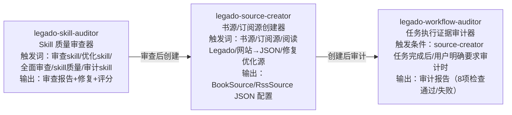

# Legado（阅读Sigma）

> Android 开源电子书阅读器，核心为自定义书源规则引擎（CSS/JSONPath/XPath/正则/JS 五种解析），用户编写规则即可将任意网页转化为结构化书籍资源。

---

## 🔴 强制规则：复杂任务处理流程

> **当任务涉及 50+ 源文件分析、多份文档验证/修复、或任何单次上下文无法容纳的复杂任务时，必须严格遵循以下流程。禁止跳过任何阶段。**

### 硬性约束

| 约束 | 值 | 说明 |
|------|-----|------|
| **单子代理上限** | ≤ 12 个源文件 | 超过即拆分，禁止合并 |
| **单临时文档上限** | ≤ 1000 行 | 超限说明分组过大 |
| **启动方式** | 同批次全部并行 | 禁止串行逐个启动 |
| **结果验证** | 必须交叉验证 | 禁止信任单一来源 |

### 五阶段流水线

```
Phase 1 → Phase 2 → Phase 3 → Phase 4 → Phase 5
扫描分组   并行分析   交叉验证   精准修复   导航同步
```

| 阶段 | 动作 | 产出 |
|------|------|------|
| **Phase 1** | 3 个搜索子代理并行扫描，按 8-12 文件/组划分 | 文件分组清单 |
| **Phase 2** | N 个分析子代理并行分析，生成临时文档到 `docs/temp-analysis/` | 临时分析文档 |
| **Phase 3** | M 个验证子代理交叉对比临时文档 vs 现有文档 | ERROR/WARN/INFO 报告 |
| **Phase 4** | K 个修复子代理基于验证报告精准修复 | 修复后的文档 |
| **Phase 5** | 同步 AGENTS.md / overview.md / README.md 统计数字和索引 | 更新后的导航 |

### 反模式

❌ 子代理塞 30+ 文件 / 串行启动 / 信任单份文档 / 只看报告不看源码 / 只管后端不管前端 / 修完不更新导航
> **完整方法论**：[multi-agent-analysis-spec.md](./docs/project-flow/architecture/multi-agent-analysis-spec.md)

---

## 🔴🔴🔴 强制规则：书源/订阅源自测交付流程

> **任何新生成或优化的书源/订阅源，必须经过自测通过后才能视为任务完成。禁止未经自测直接交付！**

- **源码验证优先**：每一步规则编写必须先去 Legado 源码核实验证，不能凭经验臆测
- **自测不通过=未完成**：任务状态不得标记为 completed，直到自测全部通过
- **经验必须源码验证**：写入 skill 参考文档的经验教训，必须经过源码深度分析核实

> **自测三阶段流水线 + 79 条 Rhino 陷阱清单 + 验证脚本**：详见 [SKILL.md](./.trae/skills/legado-source-creator/SKILL.md)

---

## 🔴🔴 强制规则：OpenSpec 工作流程

> **任何新增功能、优化功能、Bug 修复、重构任务，必须先生成 OpenSpec 文档并经用户审核通过后，才能开始实施代码。禁止未经设计审核直接编码！**

### 强制触发条件

所有场景一律生成四文档（README.md + spec.md + design.md + tasks.md），不做级别区分：

| 文档 | 核心内容 |
|------|---------|
| **README.md** | 功能概述、核心能力、文档索引、状态标记 |
| **spec.md** | Intent/Scope/Approach（含 Alternatives Considered + Drawbacks）/Requirements/Scenarios |
| **design.md** | Technical Approach/Architecture Decisions（ADR Y-Statement 模板）/Data Flow/File Changes |
| **tasks.md** | `- [ ] X.Y` 格式任务清单 + AOAdapt 日志（遇问题时必须记录） |

文档位置：`docs/specs/{功能名称}/`

### 工作流程（8 步 + 3 检查点）

```
步骤1: 用户提出需求 → 步骤2: 需求分析 → 步骤3: 生成四文档(🔄设计中)
→ 🛑检查点1: 用户审查设计 → 步骤5: 按tasks.md实施(🔄开发中)
→ 🛑检查点2: 用户审核实施 → 🛑检查点3: 用户最终验收
→ 步骤8: 文档同步(更新docs/project-flow/)
```

### 反模式

❌ 直接写代码不生成文档 / 凭感觉不分析需求 / spec.md 无 Alternatives 和 Drawbacks / design.md 决策记录无 ADR 结构 / 未经用户确认就实施 / 完成不更新文档 / 不更新tasks.md
> **完整工作流程**：[openspec-workflow.md](./docs/project-rules/openspec-workflow.md)

---

## 项目核心 Skill：legado-source-creator

> **本项目核心工具**：Legado 书源/订阅源智能创建器。79 条陷阱检查、5 阶段闭环工作流、10 大参考目录、16 个验证脚本、JVM 仿真器（legado-jvm.jar，覆盖率 85-90%）。

**触发条件**：用户提到「书源」「订阅源/RSS源」「阅读/Legado」「网站→JSON」「修复/优化源」时，必须使用本 skill。

### 5 阶段闭环工作流

```
Phase 1: 经验优先 → Phase 2: 构建规则 → Phase 3: 测试驱动 → Phase 4: 源码深挖 → Phase 5: 经验反哺+代码进化
(先查skill文档)    (按规则写源)      (JVM/Python验证)    (失败时深入源码)    (新经验写入skill+JVM/Python代码更新)
```

### 参考文档（10 大目录）

[references/](./.trae/skills/legado-source-creator/references/_INDEX.md)(4:规则语法+URL模板+实体字段+示例源) |
[troubleshooting/](./.trae/skills/legado-source-creator/references/troubleshooting/_index.md)(6:陷阱排查) |
[js-extensions/](./.trae/skills/legado-source-creator/references/js-extensions/_index.md)(11:JS扩展函数) |
[js-patterns/](./.trae/skills/legado-source-creator/references/js-patterns/_index.md)(11:JS模式) |
[special-scenarios/](./.trae/skills/legado-source-creator/references/special-scenarios/_index.md)(13:登录/验证码/加密/视频) |
[source-analysis/](./.trae/skills/legado-source-creator/references/source-analysis/_index.md)(6:源码分析验证) |
[site-features/](./.trae/skills/legado-source-creator/references/site-features/_INDEX.md)(5:站点特征与规则类型映射) |
[rule-construction-guide/](./.trae/skills/legado-source-creator/references/rule-construction-guide/_index.md)(3:规则构建指南) |
[known-fix-patterns/](./.trae/skills/legado-source-creator/references/known-fix-patterns/_index.md)(8:已知修复模式) |
[cms-samples/](./.trae/skills/legado-source-creator/references/cms-samples/_INDEX.md)(2:CMS模板样本)

### 书源/订阅源网络获取地址

> **AI 获取真实书源/订阅源 JSON 用于测试验证时，必须从以下地址获取。禁止凭空构造测试数据！**

| 类型 | 地址 | 说明 |
|------|------|------|
| **书源** | `https://www.yckceo.com/yuedu/shuyuans/index.html` | 社区书源分享平台，746+ 条合集，每条含用户名/源数量/下载量 |
| **订阅源** | `https://www.yckceo.com/yuedu/rsss/index.html` | 社区订阅源分享平台，87+ 条合集，同结构 |

**获取流程**：
1. 访问列表页，按下载量/更新时间筛选合适的源合集
2. 点击进入详情页（URL 格式：`/yuedu/shuyuans/content/id/{id}.html` 或 `/yuedu/rsss/content/id/{id}.html`）
3. 从详情页获取 JSON 下载链接，下载 BookSource/RssSource JSON 文件
4. 用 `quick-verify.py` / `verify-source.py` 验证 JSON 格式合法性
5. 用 JVM 仿真器或 Python 客户端加载测试

**筛选建议**：
- 优先选择「已校验」「已效验」标记的源合集（校验过可用性）
- 优先选择源数量 100-500 的合集（过大合集含大量失效源，过小合集覆盖不足）
- 下载量 Top 10 的合集通常质量较高

### 验证脚本与工具

**验证脚本**：`quick-verify.py`(浅层) | `verify-source.py`(深度) | `debug-source.py`(端到端调试)
**固化脚本**：`verify-decrypt.py` | `verify-selector.py` | `verify-image.py` | `analyze_site.py` | `verify-source.py`
**辅助脚本**：`generate-js-doc.py` | `deep-analyze-js.py` | `html_fetcher.py`(HTML获取回退链) | `diagnose-failures.py`(失败诊断) | `run-full-regression.py`(全量回归) | `debug-single.py` | `fix_rule_articles.py` | `quick-test-sources.py` | `test-real-biquge.py` | `test-rss-single.py`
**JVM 仿真器**：legado-jvm.jar（Rhino桥接+jsoup CSS+hutool加密+AnalyzeRule，统一JAR），覆盖率 85-90%
**完整文档**：[SKILL.md](./.trae/skills/legado-source-creator/SKILL.md) | [AI_README.md](./.trae/skills/legado-source-creator/AI_README.md)

### 🔴🔴🔴 强制规则：Phase 完成标志与审计

> **使用 legado-source-creator Skill 时，必须遵守以下规则。禁止跳过任何步骤。**

1. **Phase 完成标志**：每个 Phase 完成后必须输出 `[PHASEX_COMPLETE]` 标志，格式如下：
   - Phase 1: `[PHASE1_COMPLETE] basic-memory搜索:命中/未命中/降级, 陷阱检查:已检查/未检查`
   - Phase 3: `[PHASE3_COMPLETE] 测试覆盖率:X%, 高可信:N, 中可信:N, 需真机:N`
   - Phase 5: `[PHASE5_COMPLETE] 双写:完成/部分完成/失败, Schema验证:通过/未通过`

2. **Phase 切换约束**：如果未输出 `[PHASEX_COMPLETE]` 标志，禁止进入下一 Phase。

3. **任务后审计**：书源/订阅源创建或优化任务完成后，必须调用 `legado-workflow-auditor` Skill 进行审计。

4. **basic-memory 执行证据**：Phase 1/3/5 完成后必须将执行证据写入 basic-memory (project=legado)。

### 经验引擎（basic-memory）

> **basic-memory project=legado** 是经验索引层，存储陷阱、模式、验证结论的摘要+指针。完整内容保留在 references/ 目录。

- **Phase 1 经验搜索**：`search_notes(query="{网站特征}", search_type="hybrid", project="legado")`
- **Phase 5 经验反哺**：先更新 Skill 文档（权威源），再写入 basic-memory（索引层）
- **权威源规则**：Skill 文档为准，basic-memory 为索引层
- **降级路径**：basic-memory 不可用时手动 Grep 搜索 references/

### Skill 三件套协作

> 本项目包含三个相互协作的 Skill，形成"审查 skill → 创建源 → 审计执行"的完整闭环。

#### 调用链路图



#### 全局触发词表（去重）

| 触发词 | 归属 Skill | 说明 |
|--------|-----------|------|
| 书源 | source-creator | 唯一归属 |
| 订阅源/RSS源 | source-creator | 唯一归属 |
| 阅读/Legado | source-creator | 唯一归属 |
| 网站→JSON | source-creator | 唯一归属 |
| 修复/优化源 | source-creator | 优化对象是"源"（书源/订阅源） |
| 审计（任务执行） | workflow-auditor | 审计 Phase 执行证据 |
| 审查报告 | workflow-auditor | 唯一归属 |
| 执行证据检查 | workflow-auditor | 唯一归属 |
| 审查skill | skill-auditor | 带"skill"限定词 |
| 优化skill | skill-auditor | 带"skill"限定词 |
| 全面审查 | skill-auditor | 指向 skill 本身质量 |
| skill质量 | skill-auditor | 唯一归属 |
| 审计skill | skill-auditor | 带"skill"限定词 |

**冲突词优先级说明**：
- **"审计"**：单独使用 → workflow-auditor（任务执行证据审计）；带"skill" → skill-auditor（skill 本身审计）
- **"优化"**：带"源" → source-creator；带"skill" → skill-auditor
- **"审查"**：带"skill"或"全面/深度"修饰 → skill-auditor；其他上下文 → 根据语境判断

#### 上下文传递规范

source-creator → workflow-auditor 传递以下上下文：
- `source_name`：源名称（从 Phase 1 获取）
- `source_type`：`book` 或 `rss`
- `task_type`：`create` / `repair` / `optimize`
- `phases_completed`：已完成的 Phase 列表（如 `[1, 3, 5]`）
- `execution_logs`：各 Phase 的 basic-memory 执行证据 identifier

#### 三件套 Skill 概览

| Skill | 路径 | 核心能力 |
|-------|------|---------|
| **legado-source-creator** | [.trae/skills/legado-source-creator/SKILL.md](./.trae/skills/legado-source-creator/SKILL.md) | 79 条陷阱检查、5 阶段闭环工作流、10 大参考目录、JVM 仿真器（legado-jvm.jar） |
| **legado-workflow-auditor** | [.trae/skills/legado-workflow-auditor/SKILL.md](./.trae/skills/legado-workflow-auditor/SKILL.md) | 8 项执行证据检查、审计报告输出、basic-memory 降级路径 |
| **legado-skill-auditor** | [.trae/skills/legado-skill-auditor/SKILL.md](./.trae/skills/legado-skill-auditor/SKILL.md) | 8 维度 42 检查点（L1/L2/L3 三层，合并后~30模块）、精准修复+回归验证 |

---

## 代码约束（摘要）

### Code Style 核心

- ✅ 协程用自定义 `Coroutine.async{}...onError{}.onSuccess{}` 链式封装（非标准 launch+try/catch）
- ✅ 异步双版本：`xxx()` 返回 `Coroutine<T>` + `xxxAwait()` 挂起函数
- ✅ 核心业务用 `object` 单例（`ReadBook`, `WebBook`, `AppConfig`），不引入 DI 框架
- ✅ Room 实体：`data class` + `@Parcelize` + `@Entity`，字段全部有默认值
- ✅ 错误处理用 `kotlin.runCatching`（带 `kotlin.` 前缀），字符串判空用 `isNullOrBlank()`
- ❌ 不要使用 Timber / `CoroutineExceptionHandler`，日志用 `AppLog.put()`，异常用 `Coroutine.onError`

> **完整规范**：[naming_rules.md](./docs/project-rules/naming_rules.md) | [checkstyle_rules.md](./docs/project-rules/checkstyle_rules.md)

### Landmines 核心

- **jsoup 1.16.2 锁定**：破坏性变更 jsoup#2017，不可升级
- **rhino 1.8.1 锁定**：Android 6 以下缺少 Arrays.setAll，不可升级
- **hutool 5.8.22 锁定**：书源加解密依赖，不可升级
- **ReadBook 全局单例**：多 Activity 共享，改状态需 `@Synchronized` 或 `Mutex` 保护
- **Vue3 构建**：vite build 后 sync.js 仅在 GitHub Actions 执行，本地需手动复制
- **NoStackTraceException**：所有业务异常继承此类，覆写 `fillInStackTrace()`

> **完整陷阱**：[exception_rules.md](./docs/project-rules/exception_rules.md) | [logging_rules.md](./docs/project-rules/logging_rules.md) | [architecture_rules.md](./docs/project-rules/architecture_rules.md)

---

## 快速入口

| 用途 | 文档 |
|------|------|
| **所有文档统一索引** | [docs/INDEX.md](./docs/INDEX.md) |
| **任务导航（14模块代码锚点）** | [docs/project-flow/task-navigation.md](./docs/project-flow/task-navigation.md) |
| **构建/运行/测试命令** | [docs/project-flow/quick-reference.md](./docs/project-flow/quick-reference.md) |
| **项目规范（7个规范文档）** | [docs/project-rules/](./docs/project-rules/) |
| **规则引擎详解** | [docs/project-flow/architecture/rule-engine.md](./docs/project-flow/architecture/rule-engine.md) |
| **Skill 参考文档索引** | [.trae/skills/legado-source-creator/references/_INDEX.md](./.trae/skills/legado-source-creator/references/_INDEX.md) |
| **功能设计文档** | [docs/specs/](./docs/specs/) |
| **书源网络获取** | `https://www.yckceo.com/yuedu/shuyuans/index.html` |
| **订阅源网络获取** | `https://www.yckceo.com/yuedu/rsss/index.html` |
