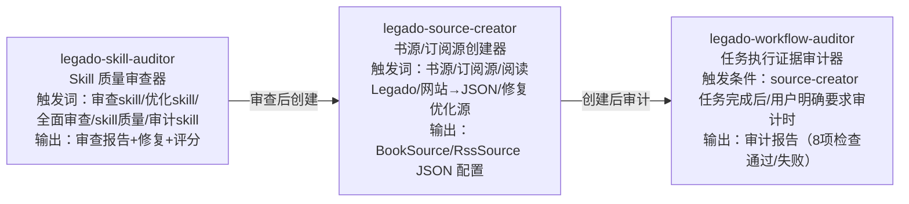

# Legado（阅读Sigma）

> Android 开源电子书阅读器，核心为自定义书源规则引擎（CSS/JSONPath/XPath/正则/JS 五种解析），用户编写规则即可将任意网页转化为结构化书籍资源。

## 项目来源

本项目 fork 自原版 [legado-E](https://github.com/Luoyacheng/legado-E)，在此基础上建立了私有化仓库（`https://github.com/syq17496152/legado.git`），并进行了私有化改造。遇到与原版行为不一致的问题时，应优先对比原版代码定位回归原因。

## 延伸版本参考（开源阅读生态）

> **AI 在进行网络层/前端/协程/WebView 等组件优化时，必须主动对比以下延伸版本的实现，学习借鉴优点，不闭门造车。**
> 来源：[阅读·全版本集散地](https://momo-b5a.pages.dev/%E4%B8%8B%E8%BD%BD/xz)（27+ 版本）

### 主线分支（基于原版，网络层与原版基本一致）

| 版本 | git 仓库 | 特色 | 对比优先级 |
|------|----------|------|-----------|
| 原版阅读 | [gedoor/legado](https://github.com/gedoor/legado) | 原版，所有 fork 的源头 | ⭐⭐⭐⭐⭐ |
| 阅读Sigma | [Luoyacheng/legado-E](https://github.com/Luoyacheng/legado-E) | 本项目 fork 源 | ⭐⭐⭐⭐⭐ |
| 喵公子阅读 | [LegadoTeam/legado](https://github.com/LegadoTeam/legado) | 主流分支，活跃度高 | ⭐⭐⭐⭐ |
| 阅读T | [skybbk1001/legadoT](https://github.com/skybbk1001/legadoT) | 主流分支 | ⭐⭐⭐ |
| 阅读Archive | [Rimchars/legado](https://github.com/Rimchars/legado) | 主流分支 | ⭐⭐⭐ |
| 阅读R | [refgd/legado](https://github.com/refgd/legado) | 主流分支 | ⭐⭐ |
| Jingshiro阅读 | [Jingshiro/legado](https://github.com/Jingshiro/legado) | 主流分支 | ⭐⭐ |

### Max 系列（蛋蛋Max 衍生，网络层有 307/308 重定向等优化）

| 版本 | git 仓库 | 特色 | 对比优先级 |
|------|----------|------|-----------|
| 蛋蛋阅读·Max | [DandanLLab/Legado_Max](https://github.com/DandanLLab/Legado_Max) | Max 系列源头，307/308 重定向优化 | ⭐⭐⭐⭐⭐ |
| 怣疯阅读·Max | [youfengknight/Legado_Max](https://github.com/youfengknight/Legado_Max) | 蛋蛋Max 衍生 | ⭐⭐ |
| Suml-1阅读·Max | [Suml-1/Legado_Max](https://github.com/Suml-1/Legado_Max) | 蛋蛋Max 衍生 | ⭐⭐ |

### 独立分支（前端/MD3/跨平台改造）

| 版本 | git 仓库 | 特色 | 对比优先级 |
|------|----------|------|-----------|
| 阅读NG | [joestar817/legado_NG](https://github.com/joestar817/legado_NG) | 网络日志标签等优化 | ⭐⭐⭐⭐ |
| 辞晨阅读·Max | [GEd520/legados](https://github.com/GEd520/legados) | 辞晨系列 | ⭐⭐⭐ |
| MD3阅读 | [HapeLee/legado-with-MD3](https://github.com/HapeLee/legado-with-MD3) | Material3 前端改造 | ⭐⭐⭐⭐（前端） |
| MD3阅读-DIY | [325506/legado-with-MD3-DIY](https://github.com/325506/legado-with-MD3-DIY) | MD3 衍生 | ⭐⭐⭐（前端） |
| 喵公子鸿蒙 | [mgz0227/legado-Harmony](https://github.com/mgz0227/legado-Harmony) | 鸿蒙适配 | ⭐⭐ |
| Legado-Tauri | [LegadoTeam/Legado-Tauri-Release](https://github.com/LegadoTeam/Legado-Tauri-Release) | Tauri 桌面端 | ⭐⭐ |

### 独立项目（非 Legado fork，可参考架构）

| 版本 | git 仓库 | 特色 | 对比优先级 |
|------|----------|------|-----------|
| MoRealm | [keys-cherish/morealm-reader](https://github.com/keys-cherish/morealm-reader) | 独立阅读器 | ⭐⭐ |
| 书享阅读 | [zyl140640/readbook-releases](https://github.com/zyl140640/readbook-releases) | 独立阅读器 | ⭐⭐ |
| 轻悦时光 | [autobcb/qysg](https://github.com/autobcb/qysg) | 独立阅读器 | ⭐⭐ |
| IReader | [IReaderorg/IReader](https://github.com/IReaderorg/IReader) | 独立阅读器 | ⭐⭐ |
| LightNovelReader | [dmzz-yyhyy/LightNovelReader](https://github.com/dmzz-yyhyy/LightNovelReader) | 轻小说专用 | ⭐⭐ |

### 对比方法论（强制规范）

> **任何网络层/前端/协程/WebView/数据管理组件优化或功能借鉴任务，必须遵循** [延伸版本对比方法论规范](./docs/project-rules/forks_comparison_methodology.md) **执行对比分析，禁止闭门造车。**

#### 对比优先级矩阵

| 优化领域 | 优先对比版本 | 原因 |
|----------|------------|------|
| **网络层** | 蛋蛋Max > 阅读T > 阅读NG | 蛋蛋Max 有 307/308 重定向；阅读T 有 SOCKS5 隧道+Brotli；阅读NG 有网络日志 |
| **协程/多线程** | 蛋蛋Max > 阅读NG > 阅读Archive | 蛋蛋Max 修复了 CancellationException 反模式 |
| **WebView** | 阅读Archive > 蛋蛋Max > 阅读NG | 阅读Archive 有 closed 标志 + isActiveWebView 修复范式 |
| **前端** | 蛋蛋Max > MD3阅读 | 仅蛋蛋Max 有前端实质增量（备份功能） |
| **数据管理** | 蛋蛋Max > 阅读Archive | 蛋蛋Max 有 Web 端备份功能 |

#### 五阶段对比流程

```
Phase 1: 准备阶段 → Phase 2: 分类对比 → Phase 3: 差异识别 → Phase 4: 价值评估 → Phase 5: 借鉴决策
(预检+浅克隆)     (按组件维度)     (逐文件对比)     (收益/风险评分)   (输出决策表)
```

#### 关键踩坑警示

- ⚠️ **GitHub git trees API 有缓存错误**：所有结论以 `git clone --depth 1` 实测为准
- ⚠️ **仓库 404 不等于不存在**：可能是改名/私有/删除，需在 [阅读·全版本集散地](https://momo-b5a.pages.dev/%E4%B8%8B%E8%BD%BD/xz) 查新地址
- ⚠️ **前端源码在 `modules/web/`**：不是 `app/src/main/assets/web/`（后者是构建产物）
- ⚠️ **PowerShell curl 别名冲突**：使用 `curl.exe` 或 `Invoke-WebRequest`

> **完整方法论、对比清单、决策矩阵、踩坑案例**：[docs/project-rules/forks_comparison_methodology.md](./docs/project-rules/forks_comparison_methodology.md)

---

## 🔴 强制规则：复杂任务处理流程

> **当任务涉及 50+ 源文件分析、多份文档验证/修复、或任何单次上下文无法容纳的复杂任务时，必须严格遵循以下流程。禁止跳过任何阶段。**

### 硬性约束

| 约束 | 值 | 说明 |
|------|-----|------|
| **单子代理上限** | ≤ 12 个源文件 | 超过即拆分，禁止合并 |
| **单临时文档上限** | ≤ 1000 行 | 超限说明分组过大 |
| **启动方式** | 同批次全部并行 | 禁止串行逐个启动 |
| **结果验证** | 必须交叉验证 | 禁止信任单一来源 |

### 五阶段流水线

```
Phase 1 → Phase 2 → Phase 3 → Phase 4 → Phase 5
扫描分组   并行分析   交叉验证   精准修复   导航同步
```

| 阶段 | 动作 | 产出 |
|------|------|------|
| **Phase 1** | 3 个搜索子代理并行扫描，按 8-12 文件/组划分 | 文件分组清单 |
| **Phase 2** | N 个分析子代理并行分析，生成临时文档到 `docs/temp-analysis/` | 临时分析文档 |
| **Phase 3** | M 个验证子代理交叉对比临时文档 vs 现有文档 | ERROR/WARN/INFO 报告 |
| **Phase 4** | K 个修复子代理基于验证报告精准修复 | 修复后的文档 |
| **Phase 5** | 同步 AGENTS.md / overview.md / README.md 统计数字和索引 | 更新后的导航 |

### 反模式

❌ 子代理塞 30+ 文件 / 串行启动 / 信任单份文档 / 只看报告不看源码 / 只管后端不管前端 / 修完不更新导航
> **完整方法论**：[multi-agent-analysis-spec.md](./docs/project-flow/architecture/multi-agent-analysis-spec.md)

---

## 🔴🔴 强制规则：AI 自动端到端测试（V3）

> **任何代码变更任务，在 OpenSpec 步骤 5（实施）与步骤 6（检查点 2）之间，必须执行步骤 5.5 AI 自动端到端测试。禁止跳过！**

### 子规范引用

| 子规范 | 路径 | 说明 |
|--------|------|------|
| **S13** | [ai_e2e_testing_workflow.md](./docs/project-rules/ai_e2e_testing_workflow.md) | 5.5.1~5.5.8 八步强制流程 |
| **S14** | [test-case-design-guide.md](./docs/project-rules/test-case-design-guide.md) | 双轨制 + 源码溯源字段 + 步骤语义化 |

### 八步强制流程

```
5.5.1 源码影响分析（run_e2e.py --diff HEAD~1）→ affected_modules.json
5.5.2 APK 自动发现 + MEmu 启动
5.5.3 双轨用例调度（同 TC-ID Python 优先）
5.5.4 8 类证据收集
5.5.5 规则判定（pass/fail/manual/warning）
5.5.6 manual 用例 AI agent 介入（生成 ai-prompt.md + 回填 ai_verdict）
5.5.7 五件套报告生成（report.md/json + manual_cases + affected + feedback）
5.5.8 反馈闭环触发（run_e2e.py --feedback）→ 沉淀规则/陷阱/提示词
```

### 🔴 固化层保护规则（V3）

`ai_tests/lib/` 下 9 个模块文件（M1-M9）为**固化层**，AI 不应直接修改，必须通过 OpenSpec 流程：

| 模块 | 文件 | 职责 |
|------|------|------|
| M1 | memu_controller.py | 模拟器控制 |
| M2 | apk_deployer.py | APK 部署 |
| M3 | case_parser.py | 用例解析（双轨+源码溯源） |
| M4 | ui_executor.py | UI 执行器 |
| M5 | evidence_collector.py | 8 类证据收集 |
| M6 | rule_analyzer.py | 规则判定 |
| M7 | report_generator.py | 五件套报告 |
| M8 | source_impact_analyzer.py | V3 源码影响分析 |
| M9 | source_test_generator.py | V3 B 轨测试生成 |

`config.py`（固化层）含 CRASH_PATTERNS/DB_QUERIES 等常量，扩展需 OpenSpec 流程。

### 持续迭代层（V3，AI 可自由追加）

- `ai_tests/cases/` — 测试用例（MD + Python 双轨）
- `ai_tests/lib/source_map.json` — Activity → TC-ID 映射（`--update-source-map`）
- `ai_tests/docs/known_issues.md` — 陷阱库（M16 自动追加）
- `ai_tests/docs/regression_history.md` — 回归历史（M16 自动追加）
- `ai_tests/docs/module_matrix.md` — 覆盖率报告（`gen_module_matrix.py`）
- `config.CRASH_PATTERNS` — 崩溃模式（基于失败案例扩展）
- `ai_tests/templates/ai_prompt_template.j2` — 提示词模板

### 反模式

❌ 跳过步骤 5.5 直接审核 / ❌ 不执行 5.5.1 源码影响分析 / ❌ 不读取 manual_cases.md 就标记完成 / ❌ V3 不触发 5.5.8 反馈闭环 / ❌ 不按 S14 设计用例（缺源码溯源字段）/ ❌ 直接修改 lib/ 固化层不通过 OpenSpec / ❌ V3 不沉淀失败案例到反馈闭环
---

## 🔴🔴🔴 强制规则：书源/订阅源自测交付流程

> **任何新生成或优化的书源/订阅源，必须经过自测通过后才能视为任务完成。禁止未经自测直接交付！**

- **源码验证优先**：每一步规则编写必须先去 Legado 源码核实验证，不能凭经验臆测
- **自测不通过=未完成**：任务状态不得标记为 completed，直到自测全部通过
- **经验必须源码验证**：写入 skill 参考文档的经验教训，必须经过源码深度分析核实

> **自测三阶段流水线 + 79 条 Rhino 陷阱清单 + 验证脚本**：详见 [SKILL.md](./.trae/skills/legado-source-creator/SKILL.md)

---

## 🔴🔴 强制规则：OpenSpec 工作流程

> **任何新增功能、优化功能、Bug 修复、重构任务，必须先生成 OpenSpec 文档并经用户审核通过后，才能开始实施代码。禁止未经设计审核直接编码！**

### 强制触发条件

所有场景一律生成四文档（README.md + spec.md + design.md + tasks.md），不做级别区分：

| 文档 | 核心内容 |
|------|---------|
| **README.md** | 功能概述、核心能力、文档索引、状态标记 |
| **spec.md** | Intent/Scope/Approach（含 Alternatives Considered + Drawbacks）/Requirements/Scenarios |
| **design.md** | Technical Approach/Architecture Decisions（ADR Y-Statement 模板）/Data Flow/File Changes |
| **tasks.md** | `- [ ] X.Y` 格式任务清单 + AOAdapt 日志（遇问题时必须记录） |

文档位置：`docs/specs/{功能名称}/`

### 工作流程（8 步 + 3 检查点）

```
步骤1: 用户提出需求 → 步骤2: 需求分析 → 步骤3: 生成四文档(🔄设计中)
→ 🛑检查点1: 用户审查设计 → 步骤5: 按tasks.md实施(🔄开发中)
→ 🛑检查点2: 用户审核实施 → 🛑检查点3: 用户最终验收
→ 步骤8: 文档同步(更新docs/project-flow/)
```

### 检查点交互规范（强制）

> **OpenSpec 三个检查点（1/2/3）必须使用 AskUserQuestion 工具与用户交互，禁止依赖 ExitPlanMode 的二元确认。违反用户交互强制规范将导致用户金钱损失与体验下降。**

#### 三个检查点的统一交互要求

| 检查点 | 触发时机 | 必须使用工具 | 禁止行为 |
|--------|---------|------------|----------|
| 🛑检查点1 | 步骤3 生成四文档后 | AskUserQuestion | ExitPlanMode 二元确认 |
| 🛑检查点2 | 步骤5 实施完成后 | AskUserQuestion | ExitPlanMode 二元确认 |
| 🛑检查点3 | 步骤8 文档同步前 | AskUserQuestion | ExitPlanMode 二元确认 |

#### 三选项强制结构

每个检查点的 AskUserQuestion 必须提供以下三个选项，缺一不可：

| 选项 | 含义 | 后续动作 |
|------|------|---------|
| **通过（继续下一阶段）** | 用户认可当前阶段产出 | 进入下一阶段，更新 TaskList 状态 |
| **需调整** | 用户对部分内容有意见 | 用户通过 Other 输入具体意见，AI 据此修订后重新发起检查点确认 |
| **拒绝（回退上一阶段）** | 用户不认可整体方向 | 回退到上一阶段重新分析/实施，更新 TaskList 状态 |

#### Plan 模式 ExitPlanMode 前置确认

Plan 模式下调用 ExitPlanMode 前，必须先通过 AskUserQuestion 获取用户明确确认，禁止直接调用 ExitPlanMode 强制二元确认：

- 用户选"通过" → ExitPlanMode（执行）
- 用户选"需调整" → 据意见修订 → 重新 AskUserQuestion
- 用户选"拒绝回退" → 回退上一阶段

#### 检查点交互示例

```javascript
// 检查点1：用户审查设计
AskUserQuestion({
  questions: [
    {
      question: "OpenSpec 四文档（README/spec/design/tasks）已生成，请审查设计是否符合预期？",
      header: "检查点1",
      multiSelect: false,
      options: [
        { label: "通过（继续实施）", description: "设计符合预期，进入步骤5按 tasks.md 实施" },
        { label: "需调整", description: "对部分内容有意见，通过 Other 输入具体修订意见" },
        { label: "拒绝（回退需求分析）", description: "整体方向不符，回退到步骤2重新分析需求" }
      ]
    }
  ]
})
```

### 反模式

❌ 直接写代码不生成文档 / 凭感觉不分析需求 / spec.md 无 Alternatives 和 Drawbacks / design.md 决策记录无 ADR 结构 / 未经用户确认就实施 / 完成不更新文档 / 不更新tasks.md
❌ 检查点直接用 ExitPlanMode 二元确认（取消/执行），用户无法反馈审核意见
❌ AskUserQuestion 只提供"通过/取消"两选项，缺少"需调整"和"拒绝回退"
❌ Plan 模式跳过 AskUserQuestion 直接调用 ExitPlanMode
❌ 用户选"需调整"后 AI 不重新发起检查点确认，直接进入下一阶段
> **完整工作流程**：[openspec-workflow.md](./docs/project-rules/openspec-workflow.md)

---

## 🔴🔴🔴 强制规则：上下文压缩恢复流程

> **对话恢复（上下文压缩后）的第一步，必须并行读取四件套，缺一不可进入工作。违反本规则将导致 AI 丢失关键信息（OpenSpec 文档路径、tasks.md 状态、AGENTS.md 强制规则、用户反馈），走入单文件方案而非 OpenSpec 四文档流程，且无视用户已明确的反馈。**

### 恢复四件套（并行读取）

| 序号 | 必读项 | 路径 / 获取方式 | 作用 |
|------|--------|----------------|------|
| 1 | AGENTS.md | `./AGENTS.md` | 强制规则、代码约束、Skill 触发条件 |
| 2 | project_memory.md | memory 系统项目目录（`~/.trae-cn/memory/projects/{项目key}/project_memory.md`），可用 Grep 搜索 | 项目约束、历史决策、活跃 spec 清单、**用户反馈与决策记录（重点读取）** |
| 3 | TaskList | 调用 TaskList 工具 | 任务状态唯一权威源 |
| 4 | basic-memory | `search_notes(query=..., project="legado")` | 当前任务历史决策（若有） |

读取顺序：四者必须**并行读取**（同一轮工具调用批次），禁止串行。四者全部就绪后方可进入工作。

### 用户反馈持久化（强制）

AI 在以下场景必须立即将用户反馈写入 project_memory.md 的"用户反馈与决策记录"小节（在 AI 继续任何工作前写入）：

| 场景 | 持久化内容 | 写入时机 |
|------|-----------|---------|
| AskUserQuestion 响应 | 用户选择/Other 输入原文 + 触发问题 | 用户响应后、AI 继续工作前 |
| 用户批评 | 批评原文 + AI 反思要点 | AI 回复前先写入 |
| 用户纠正 | 纠正内容 + 被纠正的错误行为 | AI 调整行为前先写入 |
| 用户明确决策 | 决策内容 + 决策上下文 | AI 执行决策前先写入 |

格式：`[YYYY-MM-DD HH:MM] 类型 | 触发上下文摘要 | 用户原文/响应 | 影响`

反馈记录保留最近 7 天，超期归档到 `archived_feedback/YYYYMM.md`（每周首次压缩恢复时执行归档）。

### AskUserQuestion 响应处理（强制）

用户通过 AskUserQuestion 给出响应后，AI 必须在继续工作前：

1. **复述**用户的选择（"收到您选择：XXX"）
2. 若用户选"需调整"并通过 Other 输入意见，必须**原文复述**意见
3. 将响应**写入** project_memory.md 的"用户反馈与决策记录"小节
4. 然后才能继续执行后续工作

> 此规范防止上下文压缩后 AI 无视用户通过 AskUserQuestion 给出的响应（用户控诉："尤其是你提问后我给你的响应信息！！！"）。

### 恢复后输出反馈清单（强制）

压缩恢复读取四件套后，必须输出"已加载的用户反馈清单"，列出最近 7 天的用户反馈，并声明"以上反馈将在本次会话中严格遵守"。禁止静默读取后不输出。

### 任务状态权威源规则

| 数据源 | 角色 | 说明 |
|--------|------|------|
| **TaskList 工具** | 唯一权威源 | AI 判定任务进度、Phase 状态的唯一依据 |
| **tasks.md** | 人类可读副本 | 双向同步：TaskList 变更 → 同步 tasks.md；tasks.md 人工修改 → 同步 TaskList |

判定冲突时以 TaskList 为准，并将 tasks.md 同步至一致状态。压缩恢复后若发现 tasks.md 与 TaskList 不一致，先以 TaskList 为准继续工作，再异步同步 tasks.md。

### basic-memory 持久化要求

每个 Phase（含 OpenSpec 步骤、复杂任务 Phase 1-5、Skill Phase 1-5）完成后，必须将以下信息写入 basic-memory（project=legado）：

- **关键决策**：本阶段做出的技术选型/方案决策及理由
- **文件路径**：本阶段创建/修改的关键文件绝对路径
- **任务状态**：当前 Phase 编号、完成标志、下一 Phase 入口
- **OpenSpec 路径**：当前活跃 spec 的 `docs/specs/{功能名称}/` 完整路径

写入后，上下文压缩恢复时可通过 basic-memory 快速定位上下文，无需重新探索。

### 恢复流程

1. 上下文压缩触发
2. 并行读取四件套（AGENTS.md + project_memory.md 含反馈记录 + TaskList + basic-memory）
3. 四者就绪？
   - 是 → 解析 project_memory.md 的"用户反馈与决策记录"小节，筛选最近 7 天反馈
     - 输出"已加载的用户反馈清单"，声明"以上反馈将在本次会话中严格遵守"
     - 检查 basic-memory 是否有当前任务历史决策
       - 有 → 加载历史上下文后从 TaskList 当前任务继续工作
       - 无 → 从当前 TaskList 状态重新建立上下文
   - 否 → 暂停工作，向用户报告缺失项（禁止强行续接）

### 反模式

❌ 压缩后直接续接工作，不读取 AGENTS.md / project_memory.md / TaskList / basic-memory 四件套
❌ 压缩后不读取 project_memory.md 的"用户反馈与决策记录"小节，无视用户已明确的反馈
❌ 压缩恢复后不输出"已加载的用户反馈清单"，静默读取后不确认理解
❌ AskUserQuestion 响应后不复述、不持久化，直接继续工作（导致压缩后丢失用户响应）
❌ 用户批评/纠正/决策后不立即写入 project_memory.md，只存在于对话上下文
❌ 信任 tasks.md 而非 TaskList 作为任务状态权威源
❌ Phase 完成后不写入 basic-memory，导致压缩后无法恢复关键决策与文件路径
❌ 串行读取四件套（应并行），浪费时间且容易遗漏关键规范或用户反馈
❌ 四件套缺失时仍强行续接工作，应暂停向用户报告并补齐

---

## 🔴🔴 强制规则：版本交付同步

> **任何涉及代码变更的任务完成后，必须同步更新 `assets/updateLog.md`。禁止只改代码不写更新日志！**

### 同步清单

| 变更类型 | 必须同步的文件 | 说明 |
|----------|--------------|------|
| **任何代码变更** | `app/src/main/assets/updateLog.md` | 顶部追加日期条目，写明用户可感知的变更内容 |
| **文档变更** | `docs/INDEX.md` | 更新 spec 状态标记 |
| **架构变更** | `docs/project-flow/` 相关文档 | 同步架构说明 |
| **Skill 变更** | `.trae/skills/` 相关 SKILL.md | 同步能力说明 |

### updateLog.md 格式

```markdown
**YYYY/MM/DD**
- 变更说明1（面向用户，非技术细节）
- 变更说明2
```

条目追加在 `## cronet版本:` 行之后、已有条目之前。内容面向用户，用通俗语言描述可感知的变化，而非内部技术术语。

### 反模式

❌ 改代码不写 updateLog.md / updateLog.md 只写"优化代码，修复问题"无具体内容 / 新功能上线但用户不知道 / tasks.md 全部完成但 updateLog.md 未更新

---

## 项目核心 Skill：legado-source-creator

> **本项目核心工具**：Legado 书源/订阅源智能创建器。79 条陷阱检查、5 阶段闭环工作流、10 大参考目录、16 个验证脚本、JVM 仿真器（legado-jvm.jar，覆盖率 85-90%）。

**触发条件**：用户提到「书源」「订阅源/RSS源」「阅读/Legado」「网站→JSON」「修复/优化源」时，必须使用本 skill。

### 5 阶段闭环工作流

```
Phase 1: 经验优先 → Phase 2: 构建规则 → Phase 3: 测试驱动 → Phase 4: 源码深挖 → Phase 5: 经验反哺+代码进化
(先查skill文档)    (按规则写源)      (JVM/Python验证)    (失败时深入源码)    (新经验写入skill+JVM/Python代码更新)
```

### 参考文档（10 大目录）

[references/](./.trae/skills/legado-source-creator/references/_INDEX.md)(4:规则语法+URL模板+实体字段+示例源) |
[troubleshooting/](./.trae/skills/legado-source-creator/references/troubleshooting/_index.md)(6:陷阱排查) |
[js-extensions/](./.trae/skills/legado-source-creator/references/js-extensions/_index.md)(11:JS扩展函数) |
[js-patterns/](./.trae/skills/legado-source-creator/references/js-patterns/_index.md)(11:JS模式) |
[special-scenarios/](./.trae/skills/legado-source-creator/references/special-scenarios/_index.md)(13:登录/验证码/加密/视频) |
[source-analysis/](./.trae/skills/legado-source-creator/references/source-analysis/_index.md)(6:源码分析验证) |
[site-features/](./.trae/skills/legado-source-creator/references/site-features/_INDEX.md)(5:站点特征与规则类型映射) |
[rule-construction-guide/](./.trae/skills/legado-source-creator/references/rule-construction-guide/_index.md)(3:规则构建指南) |
[known-fix-patterns/](./.trae/skills/legado-source-creator/references/known-fix-patterns/_index.md)(8:已知修复模式) |
[cms-samples/](./.trae/skills/legado-source-creator/references/cms-samples/_INDEX.md)(2:CMS模板样本)

### 书源/订阅源网络获取地址

> **AI 获取真实书源/订阅源 JSON 用于测试验证时，必须从以下地址获取。禁止凭空构造测试数据！**

| 类型 | 地址 | 说明 |
|------|------|------|
| **书源** | `https://www.yckceo.com/yuedu/shuyuans/index.html` | 社区书源分享平台，746+ 条合集，每条含用户名/源数量/下载量 |
| **订阅源** | `https://www.yckceo.com/yuedu/rsss/index.html` | 社区订阅源分享平台，87+ 条合集，同结构 |

**获取流程**：
1. 访问列表页，按下载量/更新时间筛选合适的源合集
2. 点击进入详情页（URL 格式：`/yuedu/shuyuans/content/id/{id}.html` 或 `/yuedu/rsss/content/id/{id}.html`）
3. 从详情页获取 JSON 下载链接，下载 BookSource/RssSource JSON 文件
4. 用 `quick-verify.py` / `verify-source.py` 验证 JSON 格式合法性
5. 用 JVM 仿真器或 Python 客户端加载测试

**筛选建议**：
- 优先选择「已校验」「已效验」标记的源合集（校验过可用性）
- 优先选择源数量 100-500 的合集（过大合集含大量失效源，过小合集覆盖不足）
- 下载量 Top 10 的合集通常质量较高

### 验证脚本与工具

**验证脚本**：`quick-verify.py`(浅层) | `verify-source.py`(深度) | `debug-source.py`(端到端调试)
**固化脚本**：`verify-decrypt.py` | `verify-selector.py` | `verify-image.py` | `analyze_site.py` | `verify-source.py`
**辅助脚本**：`generate-js-doc.py` | `deep-analyze-js.py` | `html_fetcher.py`(HTML获取回退链) | `diagnose-failures.py`(失败诊断) | `run-full-regression.py`(全量回归) | `debug-single.py` | `fix_rule_articles.py` | `quick-test-sources.py` | `test-real-biquge.py` | `test-rss-single.py`
**JVM 仿真器**：legado-jvm.jar（Rhino桥接+jsoup CSS+hutool加密+AnalyzeRule，统一JAR），覆盖率 85-90%
**完整文档**：[SKILL.md](./.trae/skills/legado-source-creator/SKILL.md) | [AI_README.md](./.trae/skills/legado-source-creator/AI_README.md)

### 🔴🔴🔴 强制规则：Phase 完成标志与审计

> **使用 legado-source-creator Skill 时，必须遵守以下规则。禁止跳过任何步骤。**

1. **Phase 完成标志**：每个 Phase 完成后必须输出 `[PHASEX_COMPLETE]` 标志，格式如下：
   - Phase 1: `[PHASE1_COMPLETE] basic-memory搜索:命中/未命中/降级, 陷阱检查:已检查/未检查`
   - Phase 3: `[PHASE3_COMPLETE] 测试覆盖率:X%, 高可信:N, 中可信:N, 需真机:N`
   - Phase 5: `[PHASE5_COMPLETE] 双写:完成/部分完成/失败, Schema验证:通过/未通过`

2. **Phase 切换约束**：如果未输出 `[PHASEX_COMPLETE]` 标志，禁止进入下一 Phase。

3. **任务后审计**：书源/订阅源创建或优化任务完成后，必须调用 `legado-workflow-auditor` Skill 进行审计。

4. **basic-memory 执行证据**：Phase 1/3/5 完成后必须将执行证据写入 basic-memory (project=legado)。

### 经验引擎（basic-memory）

> **basic-memory project=legado** 是经验索引层，存储陷阱、模式、验证结论的摘要+指针。完整内容保留在 references/ 目录。

- **Phase 1 经验搜索**：`search_notes(query="{网站特征}", search_type="hybrid", project="legado")`
- **Phase 5 经验反哺**：先更新 Skill 文档（权威源），再写入 basic-memory（索引层）
- **权威源规则**：Skill 文档为准，basic-memory 为索引层
- **降级路径**：basic-memory 不可用时手动 Grep 搜索 references/

### Skill 三件套协作

> 本项目包含三个相互协作的 Skill，形成"审查 skill → 创建源 → 审计执行"的完整闭环。

#### 调用链路图



#### 全局触发词表（去重）

| 触发词 | 归属 Skill | 说明 |
|--------|-----------|------|
| 书源 | source-creator | 唯一归属 |
| 订阅源/RSS源 | source-creator | 唯一归属 |
| 阅读/Legado | source-creator | 唯一归属 |
| 网站→JSON | source-creator | 唯一归属 |
| 修复/优化源 | source-creator | 优化对象是"源"（书源/订阅源） |
| 审计（任务执行） | workflow-auditor | 审计 Phase 执行证据 |
| 审查报告 | workflow-auditor | 唯一归属 |
| 执行证据检查 | workflow-auditor | 唯一归属 |
| 审查skill | skill-auditor | 带"skill"限定词 |
| 优化skill | skill-auditor | 带"skill"限定词 |
| 全面审查 | skill-auditor | 指向 skill 本身质量 |
| skill质量 | skill-auditor | 唯一归属 |
| 审计skill | skill-auditor | 带"skill"限定词 |

**冲突词优先级说明**：
- **"审计"**：单独使用 → workflow-auditor（任务执行证据审计）；带"skill" → skill-auditor（skill 本身审计）
- **"优化"**：带"源" → source-creator；带"skill" → skill-auditor
- **"审查"**：带"skill"或"全面/深度"修饰 → skill-auditor；其他上下文 → 根据语境判断

#### 上下文传递规范

source-creator → workflow-auditor 传递以下上下文：
- `source_name`：源名称（从 Phase 1 获取）
- `source_type`：`book` 或 `rss`
- `task_type`：`create` / `repair` / `optimize`
- `phases_completed`：已完成的 Phase 列表（如 `[1, 3, 5]`）
- `execution_logs`：各 Phase 的 basic-memory 执行证据 identifier

#### 三件套 Skill 概览

| Skill | 路径 | 核心能力 |
|-------|------|---------|
| **legado-source-creator** | [.trae/skills/legado-source-creator/SKILL.md](./.trae/skills/legado-source-creator/SKILL.md) | 79 条陷阱检查、5 阶段闭环工作流、10 大参考目录、JVM 仿真器（legado-jvm.jar） |
| **legado-workflow-auditor** | [.trae/skills/legado-workflow-auditor/SKILL.md](./.trae/skills/legado-workflow-auditor/SKILL.md) | 8 项执行证据检查、审计报告输出、basic-memory 降级路径 |
| **legado-skill-auditor** | [.trae/skills/legado-skill-auditor/SKILL.md](./.trae/skills/legado-skill-auditor/SKILL.md) | 8 维度 42 检查点（L1/L2/L3 三层，合并后~30模块）、精准修复+回归验证 |

---

## 代码约束（摘要）

### Code Style 核心

- ✅ 协程用自定义 `Coroutine.async{}...onError{}.onSuccess{}` 链式封装（非标准 launch+try/catch）
- ✅ 异步双版本：`xxx()` 返回 `Coroutine<T>` + `xxxAwait()` 挂起函数
- ✅ 核心业务用 `object` 单例（`ReadBook`, `WebBook`, `AppConfig`），不引入 DI 框架
- ✅ Room 实体：`data class` + `@Parcelize` + `@Entity`，字段全部有默认值
- ✅ 错误处理用 `kotlin.runCatching`（带 `kotlin.` 前缀），字符串判空用 `isNullOrBlank()`
- ❌ 不要使用 Timber / `CoroutineExceptionHandler`，日志用 `AppLog.put()`，异常用 `Coroutine.onError`

> **完整规范**：[naming_rules.md](./docs/project-rules/naming_rules.md) | [checkstyle_rules.md](./docs/project-rules/checkstyle_rules.md)

### Landmines 核心

- **jsoup 1.16.2 锁定**：破坏性变更 jsoup#2017，不可升级
- **rhino 1.8.1 锁定**：API 24 以下缺少 Arrays.setAll，不可升级（minSdk 已提升至 23 但仍低于 24）
- **hutool 5.8.22 锁定**：书源加解密依赖，不可升级
- **ReadBook 全局单例**：多 Activity 共享，改状态需 `@Synchronized` 或 `Mutex` 保护
- **Vue3 构建**：vite build 后 sync.js 仅在 GitHub Actions 执行，本地需手动复制
- **NoStackTraceException**：所有业务异常继承此类，覆写 `fillInStackTrace()`

> **完整陷阱**：[exception_rules.md](./docs/project-rules/exception_rules.md) | [logging_rules.md](./docs/project-rules/logging_rules.md) | [architecture_rules.md](./docs/project-rules/architecture_rules.md)

### 并发文件修改规范（全局通用）

> **多 Agent 并行操作时，必须遵循以下规则，防止文件内容被并发覆盖丢失。**
> 踩坑案例：文档同步阶段，多个后台 Agent 并行修改文档时，与源码文件产生时序竞态，导致已添加的代码定义被覆盖丢失，构建失败。

| 规则 | 说明 |
|------|------|
| **源码文件修改串行化** | 同一源码文件的所有 Edit 必须由主 Agent 串行执行，**禁止委托给后台 Agent**触碰同一源码文件 |
| **文档与代码隔离** | 文档同步 Agent 只能修改文档目录，**禁止读取+回写**源码文件（验证时只读不写） |
| **关键节点构建复验** | 每个阶段结束后必须重新执行项目构建验证命令，而非只在最后构建一次；文档同步后也要复验源码完整性 |
| **git diff 校验** | 重要文件修改后用 `git diff` 确认变更范围符合预期，发现异常回退立即排查 |
| **后台 Agent 职责单一** | 后台 Agent 只负责独立的分析/文档任务，**禁止**在后台 Agent 中执行源码文件 Edit |
| **修改前备份上下文** | 对核心配置文件/常量文件执行 Edit 前，先 Read 确认当前内容；多轮修改后再次 Read 防止中间状态丢失 |

### Git 仓库管理

- **远程仓库**：`https://github.com/syq17496152/legado.git`（私有）
- **主分支**：`master`
- **.gitignore 核心排除**：`temp/`（Android SDK/缓存）、`output/`（测试输出）、Skill 运行时产物、`*.log`
- **Commit 规范**：Conventional Commits（`feat:` / `fix:` / `docs:` / `refactor:` / `skill:` 等）

> **完整规范**：[git-repo-management.md](./docs/project-flow/git-repo-management.md)

---

## 快速入口

| 用途 | 文档 |
|------|------|
| **所有文档统一索引** | [docs/INDEX.md](./docs/INDEX.md) |
| **任务导航（14模块代码锚点）** | [docs/project-flow/task-navigation.md](./docs/project-flow/task-navigation.md) |
| **构建/运行/测试命令** | [docs/project-flow/quick-reference.md](./docs/project-flow/quick-reference.md) |
| **项目规范（8个规范文档）** | [docs/project-rules/](./docs/project-rules/)（含 [延伸版本对比方法论](./docs/project-rules/forks_comparison_methodology.md)） |
| **Git 仓库管理** | [docs/project-flow/git-repo-management.md](./docs/project-flow/git-repo-management.md) |
| **规则引擎详解** | [docs/project-flow/architecture/rule-engine.md](./docs/project-flow/architecture/rule-engine.md) |
| **Skill 参考文档索引** | [.trae/skills/legado-source-creator/references/_INDEX.md](./.trae/skills/legado-source-creator/references/_INDEX.md) |
| **功能设计文档** | [docs/specs/](./docs/specs/) |
| **AI 自动化测试基础设施** | [ai_tests/README.md](./ai_tests/README.md)（E2E 测试编排器 + 8 类证据 + 规则判定 + 七件套报告） |
| **E2E 测试设计文档** | [docs/specs/e2e-automated-testing/](./docs/specs/e2e-automated-testing/)（V3 四文档） |
| **书源网络获取** | `https://www.yckceo.com/yuedu/shuyuans/index.html` |
| **订阅源网络获取** | `https://www.yckceo.com/yuedu/rsss/index.html` |
