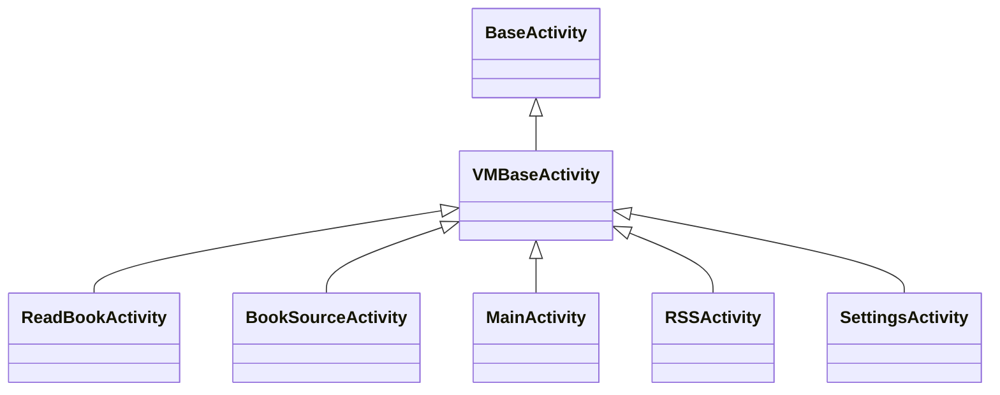
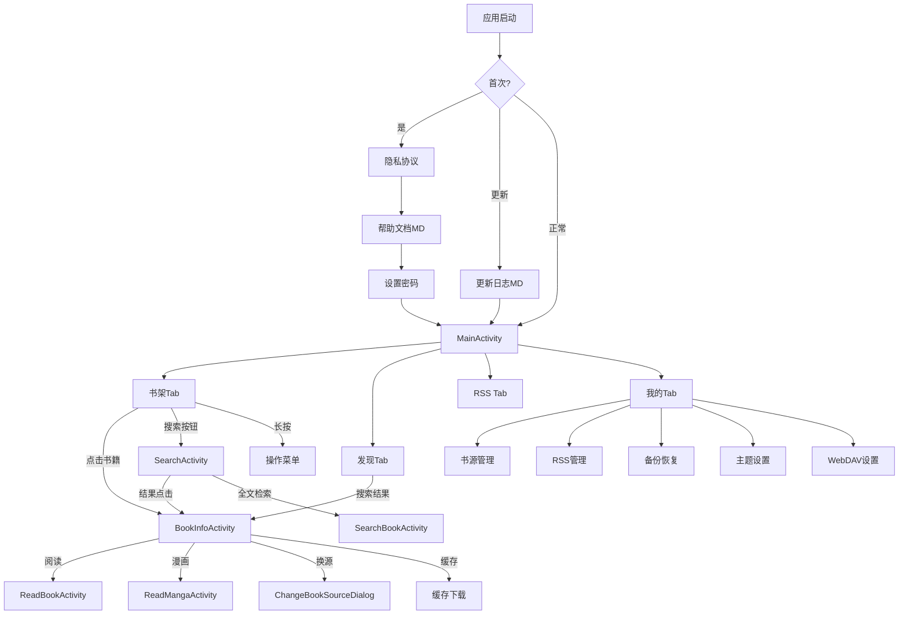

# Android UI 架构 · 核心框架册（android-ui-core）

> **隶属关系**：本文档由原 `docs/project-flow/architecture/android-ui.md`（1988 行/26 章）拆分而来，四册同目录：
> - **本册 android-ui-core.md** — 主框架/活动/Fragment/基类/导航/启动引导 + 顶栏体系（N1）+ Compose 化现状（N2）
> - 姊妹册 [android-ui-pages.md](android-ui-pages.md) — 页面布局与交互详解 + 书源调试/搜索范围/发现页/关联导入/辅助工具 + 订阅页双模式（N3）+ 发现页缓存加固（N4）
> - 姊妹册 [android-ui-media-theme.md](android-ui-media-theme.md) — 阅读/排版/漫画/音频/Widget/主题/资源/横屏 + EPUB 渲染与高亮（N5）+ 播放器画质增强（N6）
> - 姊妹册 [android-ui-changelog.md](android-ui-changelog.md) — UI 层源码统计 + 时敏优化记录（原 §25/§26）
>
> **一句话定位**：MainActivity 主框架与全局 UI 骨架的权威参考。
>
> 行号锚点以 2026-08-30 源码快照实测为准（MainActivity.kt 当前 2548 行）。

## 本册目录

| 章 | 内容 | 对应原章 |
|----|------|---------|
| §1 | 主框架：MainActivity + 底部导航 | 原 §1 |
| §2 | 活动（Activity）体系 | 原 §2 |
| §3 | Fragment 体系 | 原 §3 |
| §4 | Base 基类体系 | 原 §6 |
| §5 | 导航链路总览 | 原 §8 |
| §6 | 启动引导流程 | 原 §19 |
| §7 | N1 顶栏体系：MainTopBarView | 新增 |
| §8 | N2 Compose 化现状 | 新增 |

> 原稿 §4（Widget 概览）与 §5（主题简版）与原 §14/§15 重复，已删除不迁移；Widget/主题内容见姊妹册 media-theme。

---

## 1. 主框架：MainActivity + 底部导航

```
MainActivity (VMBaseActivity, ui/main/MainActivity.kt, 2548 行)
├── ViewPager (viewPagerMain, offscreenPageLimit=3)
│   ├── Tab 0: BookshelfFragment1/2  — 书架（双样式切换）
│   ├── Tab 1: ExploreFragment       — 发现（可经底部导航配置隐藏）
│   ├── Tab 2: RssFragment           — RSS订阅（可隐藏，双模式见 pages 册 §8）
│   └── Tab 3: MyFragment            — 我的配置
└── BottomNavigationView（支持底栏布局模式，含 sidebar 侧边栏形态 L716-718）
```

### 关键设计决策

| 决策 | 位置（实测） | 说明 |
|------|------|------|
| ViewPager + FragmentStatePagerAdapter | [MainActivity.kt:L2485](file:///f:/myself/github/WeAgentChat/temp/legado/app/src/main/java/io/legado/app/ui/main/MainActivity.kt#L2485) | `BEHAVIOR_RESUME_ONLY_CURRENT_FRAGMENT`，非当前 Fragment 不 resume |
| 书架双样式切换 | [MainActivity.kt:L2460](file:///f:/myself/github/WeAgentChat/temp/legado/app/ui/main/MainActivity.kt#L2460) | `AppConfig.bookGroupStyle == 1 ? BookshelfFragment2 : BookshelfFragment1` |
| 底部菜单动态显示 | [MainActivity.kt:L2102-L2106](file:///f:/myself/github/WeAgentChat/temp/legado/app/ui/main/MainActivity.kt#L2102) | **已改为 `MainBottomNavConfig.isVisible(KEY_DISCOVERY/KEY_RSS)`**（原 `AppConfig.showDiscovery/showRSS` 已废弃）；菜单构建消费 `MainBottomNavConfig.visibleItems()/spec()`（L2374-L2410） |
| 默认首页 | [MainActivity.kt:L2446](file:///f:/myself/github/WeAgentChat/temp/legado/app/ui/main/MainActivity.kt#L2446) | `AppConfig.defaultHomePage` 支持 bookshelf/explore/rss/my |
| 双击退出 | [MainActivity.kt:L298-L322](file:///f:/myself/github/WeAgentChat/temp/legado/app/ui/main/MainActivity.kt#L298) | `onBackPressedDispatcher` 回调：侧边栏打开先关闭 → 非书架 Tab 先回书架 → EXIT_INTERVAL 内双击：朗读暂停则 finish，否则 moveTaskToBack（L312-L321） |
| Tab 重复选中回顶 | [MainActivity.kt:L486-L506](file:///f:/myself/github/WeAgentChat/temp/legado/app/ui/main/MainActivity.kt#L486) | 书架/RSS Tab 再次选中 → `gotoTop()`（L491/L501） |
| 顶栏刷新 | [MainActivity.kt:L702-L714](file:///f:/myself/github/WeAgentChat/temp/legado/app/ui/main/MainActivity.kt#L702) | `refreshMainTopBars()` 递归遍历视图树：MainTopBarView→refreshStyle()；TitleBar→refreshTopBarAppearance()（managed TitleBar 配色刷新） |

### 启动流程

[MainActivity.kt:L331-L361](file:///f:/myself/github/WeAgentChat/temp/legado/app/src/main/java/io/legado/app/ui/main/MainActivity.kt#L331)

```
onPostCreate (lifecycleScope.launch)
    ├── privacyPolicy()          — 隐私协议确认（实现 L2148）
    ├── upVersion()              — 版本更新检查/帮助文档（实现 L2173）
    ├── setLocalPassword()       — 首次设置本地密码（实现 L2222）
    ├── notifyAppCrash()         — 崩溃日志通知（实现 L2246）
    ├── backupSync()             — WebDAV 备份同步（实现 L2286）
    ├── viewModel.ruleSubsUp()   — 延迟1s自动更新书源（L349）
    ├── viewModel.upAllBookToc() — 延迟2s自动更新书籍目录（L355）
    └── viewModel.postLoad()     — 延迟3s后台加载（L359）
```

---

## 2. 活动（Activity）体系

### 书架模块

| Activity | 文件 | 功能 |
|----------|------|------|
| MainActivity | `ui/main/MainActivity.kt`（2548 行） | 主界面容器 |
| BookInfoActivity | `ui/book/info/BookInfoActivity.kt` | 书籍详情：信息/目录/书源管理 |
| BookChangeSourceActivity | `ui/book/change/BookChangeSourceActivity.kt` | 换源界面 |
| ImportBookActivity | `ui/book/import/local/ImportBookActivity.kt` | 本地书导入 |
| ImportBookWebActivity | `ui/book/import/web/ImportBookWebActivity.kt` | 网络书导入 |

### 阅读模块

| Activity | 文件 | 功能 |
|----------|------|------|
| BaseReadBookActivity | `ui/book/read/BaseReadBookActivity.kt` | 阅读抽象基类，负责屏幕方向/刘海适配/亮屏/翻页动画/按键翻页等通用功能 |
| ReadBookActivity | `ui/book/read/ReadBookActivity.kt`（5208 行，当前全 ui/ 最大） | 文字阅读核心，全屏沉浸式（override 方法 125 个，实测 2026-08-30） |
| ReadMangaActivity | `ui/book/manga/ReadMangaActivity.kt`（993 行） | 漫画阅读 |
| ReadAloudActivity | `ui/book/read/ReadAloudActivity.kt` | 朗读控制面板 |

### 搜索/发现模块

| Activity | 文件 | 功能 |
|----------|------|------|
| SearchActivity | `ui/book/search/SearchActivity.kt`（729 行） | 搜索入口 + 搜索结果展示 |
| SearchBookActivity | `ui/book/searchContent/SearchBookActivity.kt` | 全文检索 |
| ExploreActivity | `ui/book/explore/ExploreActivity.kt` | 发现详情 |
| ExploreShowActivity | `ui/book/explore/ExploreShowActivity.kt`（218 行） | 发现源结果展示 |

### 书源/RSS 管理

| Activity | 文件 | 功能 |
|----------|------|------|
| BookSourceActivity | `ui/book/source/manage/BookSourceActivity.kt`（1204 行） | 书源列表管理 |
| BookSourceEditActivity | `ui/book/source/edit/BookSourceEditActivity.kt`（856 行） | 书源可视化编辑 |
| RssSourceActivity | `ui/rss/source/manage/RssSourceActivity.kt` | RSS 源管理 |
| RssSourceEditActivity | `ui/rss/source/edit/RssSourceEditActivity.kt` | RSS 源编辑 |
| RssArticlesActivity | `ui/rss/article/RssArticlesActivity.kt` | RSS 文章列表容器 |
| RssSortActivity | `ui/rss/article/RssSortActivity.kt` | RSS 多源分组排序 |
| ReadRssActivity | `ui/rss/read/ReadRssActivity.kt` | RSS 文章阅读（WebView + JS注入） |
| RssFavoritesActivity | `ui/rss/favorites/RssFavoritesActivity.kt` | RSS 收藏文章 |
| RuleSubActivity | `ui/rss/subscription/RuleSubActivity.kt` | RSS 规则订阅入口 |
| NavigationBarManageActivity | 1283 行（底部导航项管理） | 顶栏/底栏管理配置入口 |

### 配置/替换/工具

| Activity | 文件 | 功能 |
|----------|------|------|
| ConfigActivity | `ui/config/ConfigActivity.kt` | 全局设置 |
| ReplaceRuleActivity | `ui/replace/ReplaceRuleActivity.kt` | 替换规则管理 |
| DictRuleActivity | `ui/dict/DictRuleActivity.kt` | 字典规则 |
| TTSEditActivity | `ui/tts/TTSEditActivity.kt` | TTS 配置编辑 |
| FileManageActivity | `ui/file/FileManageActivity.kt` | 文件管理 |

### 辅助模块

| Activity | 文件 | 功能 |
|----------|------|------|
| LoginActivity | `ui/login/LoginActivity.kt` | 登录/密码验证 |
| FontActivity | `ui/font/FontActivity.kt` | 字体管理 |
| AboutActivity | `ui/about/AboutActivity.kt` | 关于页面 |
| QrCodeActivity | `ui/qrcode/QrCodeActivity.kt` | 二维码/文件传输 |
| BrowserActivity | `ui/browser/BrowserActivity.kt` | 内置浏览器 |
| CodeActivity | `ui/code/CodeActivity.kt` | 代码编辑器 |
| CacheActivity | `ui/book/cache/CacheActivity.kt`（754 行） | 缓存管理 |
| AssociationActivity | `ui/association/AssociationActivity.kt` | 关联导入(书源/RSS/替换) |
| VideoPlayActivity | `ui/video/VideoPlayActivity.kt` | 视频播放（画质增强见 media-theme 册 §10） |

---

## 3. Fragment 体系

### 书架 Fragment

```
BaseBookshelfFragment              — 书架基类（排序/分组/长按菜单/拖拽）
├── BookshelfFragment1             — 样式1：普通列表/网格
└── BookshelfFragment2             — 样式2：按分组折叠展示
```

核心行为：
- 长按书籍 → 弹出操作菜单（置顶/删除/换源/详情/缓存/导出）
- 下拉刷新 → 触发搜索线程池更新所有已收藏书籍
- 分组拖拽 → DragSortRecyclerView 实现
- 排序模式：按更新时间/按书名/按作者/按阅读进度/自定义排序

### 我的 (MyFragment)

展示配置入口：
- 书源管理 / RSS管理 / 替换规则
- 备份与恢复 / WebDAV 设置
- 主题设置 / 阅读设置 / TTS 设置
- 缓存与下载管理 / 关于

> `debug_tools` 调试工具箱入口已从 MyFragment 迁移至 OtherConfigFragment（详见 changelog 册 §26）。

### RSS 文章流 (RssArticlesFragment + 5种Adapter)

**文件**：[RssArticlesFragment.kt](file:///f:/myself/github/WeAgentChat/temp/legado/app/src/main/java/io/legado/app/ui/rss/article/RssArticlesFragment.kt)（358 行）

RSS 文章流是仅次于书架的第二复杂 Fragment，支持 5 种文章展示样式：

| Adapter | 样式 | 布局 |
|---------|------|------|
| `BaseRssArticlesAdapter<VB>` | 抽象基类 | 继承 `RecyclerAdapter<RssArticle, VB>` |
| `RssArticlesAdapter` (样式0) | 列表+缩略图 | LinearLayoutManager |
| `RssArticlesAdapter2` (样式2) | 网格2列 | GridLayoutManager(span=2) |
| `RssArticlesAdapter3` (样式3) | 瀑布流 | StaggeredGridLayoutManager(横屏3列/竖屏2列) |
| `RssArticlesAdapter4` (样式4) | 网格3列 | GridLayoutManager(span=3) |

核心功能：
- `sortName/sortUrl/searchKey` 通过 Bundle 传入，Room Flow `flowByOriginSort()` 监听数据变化
- DiffUtil 按 `link` 判断同一项，`title/image/read` 判断内容变化
- `isPreload=true` 时所有页面在后台加载，支持分页加载 `scrollToBottom() → loadMore()`
- 点击文章 → `ReadRssActivity`（WebView + JS注入，支持黑白名单过滤/Cookie管理/全屏视频/朗读）

**ReadRssActivity** ([ReadRssActivity.kt](file:///f:/myself/github/WeAgentChat/temp/legado/app/src/main/java/io/legado/app/ui/rss/read/ReadRssActivity.kt))：
- WebView 池化复用（`WebViewPool.acquire(this)`）
- JS 接口注入（java/source/cache 对象）供书源规则使用
- `shouldInterceptRequest` 实现 preloadJs 注入和黑白名单 URL 过滤
- 返回键智能处理：全屏→WebView历史栈后退（跳过多刷新页）→退出

> RSS 订阅主页的双形态（classic/modern）架构见姊妹册 pages 册 §8「订阅页双模式」。

---

## 4. Base 基类体系



```
BaseActivity             — 最基础 Activity（Lifecycle + CoroutineScope）
├── VMBaseActivity<B,VM> — ViewBinding + ViewModel 泛型封装
│   ├── MainActivity
│   ├── BaseReadBookActivity  — 阅读抽象基类（屏幕方向/刘海适配/亮屏/翻页动画）
│   │   ├── ReadBookActivity  — 文字阅读核心，全屏沉浸式
│   │   └── ReadMangaActivity — 漫画阅读
│   └── ...
└── ...
```

`VMBaseActivity` 提供：
- `val binding` — 自动 ViewBinding 绑定
- `val viewModel` — 自动 ViewModel 懒加载
- `observeLiveBus()` — LiveData/EventBus 观察注册点

---

## 5. 导航链路总览

```
应用启动
    │
    ├── 首次启动 → 隐私协议 → 帮助文档(MD) → 设置密码 → MainActivity
    ├── 版本更新 → 更新日志(MD) → MainActivity
    └── 正常启动 → MainActivity（欢迎页流程见 §6）
                        │
        ┌───────────────┼───────────────────┐
        ▼               ▼                   ▼
    书架Tab         发现Tab             我的Tab
    │               │                   │
    ├─点击书籍       ├─搜索结果           ├─书源管理
    │  └─BookInfo   │  └─BookInfo      ├─RSS管理
    │     ├─开始阅读  │     └─ReadBook   ├─替换规则
    │     │  └─ReadBookActivity        ├─备份恢复
    │     ├─换源                        ├─主题设置
    │     ├─缓存                        ├─WebDAV
    │     └─导出                        └─...
    ├─长按书籍 → 操作菜单
    ├─下拉刷新 → 全局更新
    └─搜索按钮 → SearchActivity
                     │
                     ├─搜索结果 → BookInfo → ReadBook
                     ├─全文检索 → SearchBookActivity
                     └─发现详情 → ExploreActivity
```



---

## 6. 启动引导流程

### 6.1 WelcomeActivity 架构

**文件**: [WelcomeActivity.kt](file:///f:/myself/github/WeAgentChat/temp/legado/app/src/main/java/io/legado/app/ui/welcome/WelcomeActivity.kt)（148 行，**已 Compose 化**）

```
WelcomeActivity (148 行)
├── 展示壳层已迁移至 Compose WelcomeScreen（S6 展示族，见 §8）
│   └── 欢迎图背景/导航/文字图标显隐（日/夜）由 Compose 承载
├── Activity 保留逻辑：FLAG_ACTIVITY_BROUGHT_TO_FRONT 防重复（L52）
│   └── startMainActivity + defaultToRead 直进上次阅读（L132）
└── Launcher1 ~ Launcher7 — activity-alias 桌面快捷方式（L142 起，7 个子类无覆盖）
```

### 6.2 冷启动防重复实例化

```kotlin
// WelcomeActivity.kt:L52 — 防止冷重启时重复创建实例
if (intent.flags and Intent.FLAG_ACTIVITY_BROUGHT_TO_FRONT != 0) {
    finish()
    return
}
```

### 6.3 闪屏延时与跳转

| 配置项 | PreferKey | 默认值 | 说明 |
|--------|-----------|--------|------|
| 闪屏延时 | `welcomeShowTime` | 500ms | 0则直接跳转，无延时（L56-L60） |
| 自定义背景开关 | `customWelcome` | false | 启用自定义欢迎页背景 |
| 显示文字 | `welcomeShowText` / `welcomeShowTextDark` | — | 亮/暗主题分别配置 |
| 显示图标 | `welcomeShowIcon` / `welcomeShowIconDark` | — | 亮/暗主题分别配置 |

**跳转流程**：

```
onActivityCreated()
├── FLAG_ACTIVITY_BROUGHT_TO_FRONT 检查 → 防重复实例化
├── upBackgroundImage()             — 主题感知背景加载(.9.png/位图)
├── setupSystemBar()                — 全屏+状态栏颜色适配
├── postDelayed(welcomeShowTime)    — L60
└── startMainActivity()
    ├── startActivity(MainActivity)
    └── [条件] defaultToRead=true && lastReadBook!=null（L132）
        └── startActivity(ReadBookActivity)  — 直接进入上次阅读
```

### 6.4 多启动器别名

`Launcher1`~`Launcher7` 通过 Android Manifest 的 `activity-alias` 实现（代码子类见 L142-L148），允许用户选择不同桌面快捷方式入口，每个别名在启动器中独立显示图标。

---

## 7. N1 顶栏体系：MainTopBarView

> 新增章节。主界面四 Tab 的顶栏已从传统 TitleBar 演进为统一的 MainTopBarView 体系，同时保留 managed TitleBar 兼容路径。

### 7.1 文件与规模

**文件**：[MainTopBarView.kt](file:///f:/myself/github/WeAgentChat/temp/legado/app/src/main/java/io/legado/app/ui/widget/MainTopBarView.kt)（`ui/widget/`，866 行，实测 2026-08-30）

### 7.2 六种模式（Mode 枚举）

[MainTopBarView.kt:L51](file:///f:/myself/github/WeAgentChat/temp/legado/app/src/main/java/io/legado/app/ui/widget/MainTopBarView.kt#L51)

```kotlin
enum class Mode { BOOKSHELF, DISCOVERY, RSS, READ_RECORD, MY, SUB }
```

- 同一顶栏控件按宿主 Tab/页面切换 Mode，承载书架/发现/订阅/阅读记录/我的/订阅源六类顶栏形态
- 订阅页消费示例：RssFragment modern 形态 `binding.topBar.setMode(MainTopBarView.Mode.RSS)`（见 pages 册 §8）

### 7.3 TopBarConfig 配置消费

| 配置维度 | 源码位置 | 说明 |
|---------|---------|------|
| 圆角 | L285 / L487（`TopBarConfig.cornerRadius(context, config)`） | 常规样式才应用圆角，`isRegularStyle()` 判定 |
| 壁纸 | L666（`config.wallpaperAlpha` 透明度 0-100）/ L688-L691（`wallpaperCropLeft/Top/Right/Bottom` 裁剪） | 顶栏壁纸独立裁剪与透明度控制 |
| 背景色 | L429 / L480（`ColorDrawable(context.backgroundColor)`） | 无壁纸时回退主题背景色 |

### 7.4 TOP_BAR_CHANGED 事件链

| 环节 | 位置 | 说明 |
|------|------|------|
| 事件定义 | [EventBus.kt:L72](file:///f:/myself/github/WeAgentChat/temp/legado/app/src/main/java/io/legado/app/constant/EventBus.kt#L72) | `const val TOP_BAR_CHANGED = "topBarChanged"` |
| 宿主订阅 | [MainActivity.kt:L2351](file:///f:/myself/github/WeAgentChat/temp/legado/app/src/main/java/io/legado/app/ui/main/MainActivity.kt#L2351) | `observeEvent<Boolean>(EventBus.TOP_BAR_CHANGED)` → 触发 refreshMainTopBars（L702-L714 递归视图树） |
| 控件自订阅 | [MainTopBarView.kt:L187-L204](file:///f:/myself/github/WeAgentChat/temp/legado/app/src/main/java/io/legado/app/ui/widget/MainTopBarView.kt#L187) | theme-rss-header-layout-sync F3：第二刷新通道，`eventObservable` observeForever，自订阅后不再全靠宿主 refreshMainTopBars/recreate 驱动 |

### 7.5 与 TitleBar 的关系

- 主界面部分页面（"我的/发现经典"形态）仍使用 managed `TitleBar`，由 `refreshMainTopBars()` 统一调用 `refreshTopBarAppearance()` 刷新顶栏管理配色（MainActivity bugfix ③，L705-L707）
- 传统 TitleBar（`ui/widget/TitleBar.kt`，301 行）规格见姊妹册 media-theme 册 §5.1

---

## 8. N2 Compose 化现状

> 新增章节。项目正在推进 View → Compose 双轨演进，本节记录当前 Compose 资产分布（实测 2026-08-30）。

### 8.1 ui/widget 组成

| 维度 | 数值 | 说明 |
|------|------|------|
| `ui/widget/` Kotlin 文件 | 128 | 子目录 13 个：anima/checkbox/code/components/compose/dialog/dynamiclayout/image/keyboard/number/recycler/seekbar/text |
| `widget/compose/` | 20 文件 | Compose 基础设施层 |
| `widget/components/` | 33 文件 | Compose 业务组件族（全量） |

### 8.2 widget/compose（20 文件，基础设施）

典型文件：
- `LegadoComposeTheme.kt` / `LegadoMiuixComponents.kt` / `AppUiTokens.kt` — 主题与设计令牌接入
- `ComposeDialogFragment.kt` / `ComposeDialogAdapters.kt` / `ComposeChoiceListDialog.kt` / `AppComposeDialogs.kt` — Compose 对话框基建
- `ComposeFastScroller.kt` — 快速滚动的 Compose 版
- `ComposeViewOwners.kt` / `ComposeThemeImageLayer.kt` / `ComposeImageRelease.kt` — ComposeView 宿主与图片生命周期
- `BookCoverImage.kt` / `SearchBookListItem.kt` / `SearchBookPreviewOverlay.kt` — 业务单元
- `GroupManageComposeDialog.kt` / `AppSettingComponents.kt` / `AppManagementScaffold.kt` / `AppPackageManageComponents.kt` / `RuleEditComposeComponents.kt` / `SnapshotListUpdates.kt`

### 8.3 widget/components（33 文件，组件族）

覆盖五类能力：
- **壳层/导航**：GlassTopAppBar、PillNavigationBar、MenuLayer、AppShapes、ThemeSpec
- **对话框/弹出**：AppModalBottomSheet、AppMenuSheet、AppDropdownMenu、ConfirmDialog、AppConfirmDialog、AppEditDialog、AppTextDialog、SingleChoiceDialog、ColorPickerSheet、ImportSourceSheet、BookTocBookmarkSheet、HighlightStyleSheet
- **设置族**：SettingsCard、SettingsSection、SettingsToggleRow、SettingsClickRow、SettingsSelectableRow、SettingsSearchBar
- **列表/反馈**：GroupHeader、EmptyStatePlaceholder、MetricGrid、TagChip、BadgeDot、ListCard、RowIcon、ShelfGridSkeleton、VerticalScrollbar、ReadMenuSlider

### 8.4 已 Compose 化的页面/模块

| 模块 | 现状 | 说明 |
|------|------|------|
| 调试工具箱（AiConfigFragment） | 全 Compose，971 行 | 入口在 OtherConfigFragment `debug_tools`（自 MyFragment 迁移，见 changelog 册 §26） |
| NavigationBarManageActivity | 1283 行 | 底部导航项管理 |
| WelcomeActivity | Compose 壳层（S6 WelcomeScreen） | 见 §6.1 |
| ReadRecordActivity | 部分 Compose | 状态用 `mutableStateOf`（L47 recordEnabled） |
| 书架骨架屏 | ShelfGridSkeleton（components） | 骨架占位组件 |

### 8.5 尚未 Compose 化的核心资产

- 主框架（MainActivity + ViewPager + BottomNavigationView）仍为 View 体系
- 阅读界面（ReadBookActivity/PageView/排版引擎）为 View + 自绘体系
- 主题感知控件 `lib/theme/view/` 仍为 View 体系（8 个 ThemeView，见 media-theme 册 §6.8）
- 经典书架/经典订阅列表仍为 RecyclerView 体系（订阅页经典模式内的文件夹网格已用 Compose，见 pages 册 §8）

---

*本册由 android-ui.md 拆分生成（2026-08-30）。行号锚点均为当日实测，后续改动请以 git blame 复核。*
