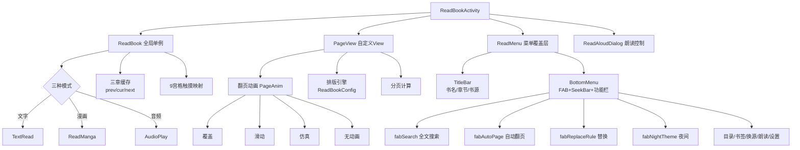

# Android UI 架构 · 阅读媒体与主题册（android-ui-media-theme）

> **隶属关系**：本文档由原 `docs/project-flow/architecture/android-ui.md`（1988 行/26 章）拆分而来，四册同目录：
> - 姊妹册 [android-ui-core.md](android-ui-core.md) — 主框架/活动/Fragment/基类/导航/启动引导 + 顶栏体系（N1）+ Compose 化现状（N2）
> - 姊妹册 [android-ui-pages.md](android-ui-pages.md) — 核心页面布局与交互 + 书源调试/搜索范围/发现页/关联导入/辅助工具 + 订阅页双模式（N3）+ 发现页缓存加固（N4）
> - **本册 android-ui-media-theme.md** — 阅读/排版引擎/漫画/音频/Widget/主题/资源/横屏 + EPUB 渲染与高亮（N5）+ 播放器画质增强（N6）
> - 姊妹册 [android-ui-changelog.md](android-ui-changelog.md) — UI 层源码统计 + 时敏优化记录（原 §25/§26）
>
> **一句话定位**：阅读核心（排版/漫画/音频/EPUB）、自定义控件与主题体系的深度架构文档。
>
> 行号锚点以 2026-08-30 源码快照实测为准；原文档中已失效的行数/行号均已重数修正（如 setTypeText L899→L1945）。

## 本册目录

| 章 | 内容 | 对应原章 |
|----|------|---------|
| §1 | 阅读界面架构 | 原 §7 |
| §2 | 排版引擎架构（TextChapterLayout） | 原 §11 |
| §3 | 漫画阅读架构（ReadMangaActivity） | 原 §12 |
| §4 | 音频播放架构（AudioPlayActivity） | 原 §13 |
| §5 | Widget 自定义控件体系详解 | 原 §14 |
| §6 | 主题系统深度架构 | 原 §15 |
| §7 | 布局资源体系 | 原 §16 |
| §8 | 横屏适配策略 | 原 §17 |
| §9 | N5 EPUB 渲染与高亮 | 新增 |
| §10 | N6 播放器画质增强 | 新增 |

> 原稿 §4（Widget 概览）/§5（主题简版）与本册 §5/§6 重复，已删除不迁移。

---

## 1. 阅读界面架构 (VMBaseActivity → BaseReadBookActivity → ReadBookActivity)

阅读界面是项目中最复杂的 Activity，通过 BaseReadBookActivity 抽象基类（负责屏幕方向设置/刘海屏适配/亮屏控制/翻页动画选择/按键翻页等通用阅读功能）统一管理文字阅读和漫画阅读的公共行为：

```
ReadBookActivity (5208 行，全 ui/ 最大)
├── ReadBook (全局单例, model/)
│   ├── 三种模式: 文字/漫画/音频  (ReadBook/ReadManga/AudioPlay)
│   ├── 三章缓存: prevChapter / curChapter / nextChapter
│   └── 触摸事件 → 9宫格区域映射 clickActionTL/TC/TR/ML/MC/MR/BL/BC/BR
├── PageView (自定义 View)
│   ├── 翻页动画: PageAnim 枚举 (覆盖/滑动/仿真/无)
│   ├── 排版引擎: ReadBookConfig.Config (行距/段距/字体/背景/页边距)
│   └── 分页计算: 基于屏幕尺寸 + Config 实时计算
├── ReadMenu (顶部/底部弹出菜单)
│   ├── 目录/书签/换源/朗读/设置/缓存/下载
│   └── 亮度调节/字体缩放/翻页动画切换
└── ReadAloudDialog (朗读控制浮窗)
```



**9宫格触摸区域**：[AppConfig.kt:L74](file:///f:/myself/github/WeAgentChat/temp/legado/app/src/main/java/io/legado/app/help/config/AppConfig.kt#L74)（`clickActionTL` 等 9 个属性，PreferKey 定义于 PreferKey.kt L35 起）

```
┌─────────┬─────────┬─────────┐
│ clickTL │ clickTC │ clickTR │   0=菜单  1=下一页  2=上一页
├─────────┼─────────┼─────────┤   可自定义每个区域行为
│ clickML │ clickMC │ clickMR │   若全部设为非0则自动恢复中间区域为菜单
├─────────┼─────────┼─────────┤   （AppConfig.kt:L2652 自动恢复逻辑）
│ clickBL │ clickBC │ clickBR │
└─────────┴─────────┴─────────┘
```

> EPUB 阅读路径独立于 PageView（`ui/book/read/epub/`，九宫格在 EpubReadView/EpubGestureController 中同样消费 `AppConfig.clickActionTL`），见本册 §9。

---

## 2. 排版引擎架构（TextChapterLayout）

阅读界面的排版引擎是项目中最复杂的子系统，负责将原始章节文本排版为可分页、可翻页的 `TextChapter` 数据结构。

**文件**：[TextChapterLayout.kt](file:///f:/myself/github/WeAgentChat/temp/legado/app/src/main/java/io/legado/app/ui/book/read/page/provider/TextChapterLayout.kt)（2656 行，实测 2026-08-30；原稿记录 1271 行已严重过时）

### 2.1 整体架构

```
ChapterProvider (object单例，全局排版参数)
  ├── titlePaint / contentPaint / reviewPaint — 全局画笔
  ├── viewWidth / viewHeight / padding* / visible* — 绘制区域
  └── getTextChapterAsync() — 异步排版入口
        └── TextChapter.createLayout()
              └── TextChapterLayout — 核心排版引擎
                    ├── ZhLayout — 中文排版（禁则处理）
                    ├── TextPageFactory — 页面切换工厂
                    └── Column 体系 — 字符级精度实体
```

### 2.2 核心排版流程（三阶段）

[TextChapterLayout.kt](file:///f:/myself/github/WeAgentChat/temp/legado/app/src/main/java/io/legado/app/ui/book/read/page/provider/TextChapterLayout.kt)

> 原稿记录的阶段行号（L222-L322/L329-L494/L495-L510）随文件膨胀已失效，本轮不再标注细粒度行号，流程结构经源码结构复核仍成立。

```
getTextChapter() 三阶段:
  阶段一: 标题排版
    displayTitle.splitNotBlank("\n") → 逐行 setTypeText(isTitle=true)
    → 单图模式强制分页 prepareNextPageIfNeed()

  阶段二: 正文排版
    遍历 bookContent.textList:
      ├── [newpage] → 分页
      ├── <usehtml> → setTypeHtml()
      ├── 图片样式: img标签 → srcReplaceStr占位 → setTypeText(带srcList)
      └── 段尾标记: pendingTextPage.lines.last().isParagraphEnd = true

  阶段三: 收尾
    wordCount统计 → 最后一页endPadding(20dp) → onPageCompleted() → onCompleted()
```

### 2.3 文字排版核心：setTypeText()

[TextChapterLayout.kt:L1945](file:///f:/myself/github/WeAgentChat/temp/legado/app/src/main/java/io/legado/app/ui/book/read/page/provider/TextChapterLayout.kt#L1945)（原稿 L899 已失效）

```
1. textPaint.getTextWidthsCompat() — 逐字宽度
2. useZhLayout=true → ZhLayout（中文排版）| false → StaticLayout（Android原生）
3. 逐行生成 TextLine:
   ├── 行0(首行): addCharsToLineFirst() — 首行缩进+两端对齐
   ├── 末行/单行: addCharsToLineNatural() — 自然排列(标题居中)
   └── 中间行: addCharsToLineMiddle() — 两端对齐
4. prepareNextPageIfNeed() — 超页则分页
```

**对齐算法**（行号实测 2026-08-30）：
- `addCharsToLineFirst()` ([L2103](file:///f:/myself/github/WeAgentChat/temp/legado/app/src/main/java/io/legado/app/ui/book/read/page/provider/TextChapterLayout.kt#L2103)，原稿 L1052 已失效): 首行缩进 + 剩余字符走中间行对齐
- `addCharsToLineMiddle()` ([L2150](file:///f:/myself/github/WeAgentChat/temp/legado/app/src/main/java/io/legado/app/ui/book/read/page/provider/TextChapterLayout.kt#L2150)，原稿 L1099 已失效): 多空格→扩展空格宽度；少空格→扩展字符间距
- `addCharsToLineNatural()` ([L2218](file:///f:/myself/github/WeAgentChat/temp/legado/app/src/main/java/io/legado/app/ui/book/read/page/provider/TextChapterLayout.kt#L2218)): 逐字符累加，不做额外间距扩展

### 2.4 分页算法

> 原稿记录的 L1269-L1295 已失效，本轮不标行号；逻辑结构经源码复核仍成立。

```
requestHeight > visibleHeight 时:
  双页模式+左列: textPage.leftLineSize=lineSize → 切换右列(absStartX=viewWidth/2+paddingLeft)
  否则(单页/右列结束):
    textPage.text → onPageCompleted() → 新建TextPage → absStartX重置
  durY = 0f 重置
```

### 2.5 中文排版（ZhLayout）

[ZhLayout.kt:L16-L277](file:///f:/myself/github/WeAgentChat/temp/legado/app/src/main/java/io/legado/app/ui/book/read/page/provider/ZhLayout.kt#L16)（278 行；**原稿锚点经复核仍准确，予以保留**）

继承 Android `Layout`，解决原生 `StaticLayout` 不处理中文禁则的问题。

**禁则标点集合**（行号实测与原稿一致）：
- 行尾禁标 `postPanc` (L25): 逗号、句号、问号、感叹号、右引号、右括号等
- 行首禁标 `prePanc` (L29): 左引号、左括号、左书名号等

**BreakMod 七种断行模式** (L43，实测枚举含 NORMAL/BREAK_ONE_CHAR/BREAK_MORE_CHAR/CPS_1/CPS_2/CPS_3)：

| 模式 | 触发条件 | 动作 |
|------|---------|------|
| NORMAL | 无禁则冲突 | 当前字符移至下行 |
| BREAK_ONE_CHAR | 前一字符是禁首标点 | 当前行下移一个字 |
| BREAK_MORE_CHAR | reCheck回溯找到合法断点 | 当前行下移多个字 |
| CPS_1 | 两个连续禁尾标点 | 压缩至当前行不分下移 |
| CPS_2 | 禁首+禁首+字 | 压缩至当前行 |
| CPS_3 | 禁首+字+禁尾 | 压缩至当前行 |

### 2.6 Column（列）实体体系

```
BaseColumn (接口) — start/end X坐标 + draw() + isTouch()
├── TextBaseColumn (接口) — charData + selected + isSearchResult
│   ├── TextColumn — 普通文字列，使用全局Paint
│   └── TextHtmlColumn — HTML文字列，自带TextPaint(独立字号/字色/超链接)
├── ImageColumn — 图片URL+点击链接，通过ImageProvider获取Bitmap绘制
├── ReviewColumn — 评论按钮(气泡形)
└── ButtonColumn — 占位符
```

**设计要点**：每个 Column 对应一个字符（像素级 X 坐标区间 `[start, end)`）；双向引用 `TextLine ↔ BaseColumn`；`TextColumn.selected` setter 自动触发 `textLine.invalidate()`。

### 2.7 TextPageFactory 页面切换

[TextPageFactory.kt](file:///f:/myself/github/WeAgentChat/temp/legado/app/src/main/java/io/legado/app/ui/book/read/page/provider/TextPageFactory.kt)（328 行；方法行号实测 2026-08-30）

| 方法 | 行号 | 逻辑 |
|------|------|------|
| `hasPrev()` | L29 | `hasPrevChapter() ∥ pageIndex > 0` |
| `hasNext()` | L33 | `hasNextChapter() ∥ currentChapter未到末页` |
| `moveToNext()` | L61 | 当前章末页→ReadBook.moveToNextChapter(); 否则→pageIndex+1 |
| `moveToPrev()` | L92 | 当前章首页→ReadBook.moveToPrevChapter(); 否则→pageIndex-1 |
| `curPage` | L118 | ReadBook.msg非空→消息页; 否则→currentChapter.getPage(pageIndex) |
| `nextPage` | L125 | 当前章下一页 → 下一章首页 |
| `prevPage` | L132 | 当前章上一页 → 上一章末页 |

---

## 3. 漫画阅读架构（ReadMangaActivity）

### 3.1 模块协作关系

（文件均在 `ui/book/manga/`，行数实测 2026-08-30）

```
ReadMangaActivity (993 行, 6个回调接口；原稿记录 856 行已过时)
    ├── ReadMangaViewModel → ReadManga(object单例, model/, 684 行)
    ├── MangaAdapter (两种VH: 章节边界+漫画图片页, recyclerview/, 280 行)
    ├── WebtoonRecyclerView (自定义滚动+缩放, recyclerview/, 373 行)
    ├── WebtoonFrame (手势分发容器, recyclerview/, 126 行)
    ├── ScrollTimer (自动翻页/滚动定时器, recyclerview/, 75 行)
    └── MangaLayoutManager (recyclerview/, 17 行, 预加载 3/4屏幕高度)
```

### 3.2 核心数据流

```
ViewModel.initData() → ReadManga.resetData/upData → loadChapterList → loadContent()
ReadManga.mCallback.upContent() → Activity.upContent()
  → mAdapter.submitList(ReadManga.mangaContents) → 定位到pos → 更新底栏+SeekBar
```

**滚动位置追踪**（[ReadMangaActivity.kt:L246-L269](file:///f:/myself/github/WeAgentChat/temp/legado/app/src/main/java/io/legado/app/ui/book/manga/ReadMangaActivity.kt#L246)，原稿 L208-226 已失效）：
`WebtoonRecyclerView.setPreScrollListener` → `findCenterViewPosition()`（L246 取中心项）→ 比较 `chapterIndex` → 触发跨章加载

### 3.3 WebtoonRecyclerView 缩放系统

（373 行；文件内细粒度行号随版本漂移，本轮保留机制描述、不标行号）

| 机制 | 说明 |
|------|------|
| 缩放范围 | `currentScale` [0.5f, 3f]，`isZooming` 防冲突 |
| 缩放动画 | `AnimatorSet` X/Y平移+Scale，200ms DecelerateInterpolator |
| 双击缩放 | scaleX≠1f→缩回; =1f→放大2x |
| 捏合缩放 | `currentScale *= scaleFactor`，<MIN_RATE自动回弹 |
| 缩放拖拽 | `touchSlop` 判定 → `zoomScrollBy(dx, dy)` |
| Fling惯性 | `distanceTimeFactor=0.4f`，DecelerateInterpolator |
| 坐标约束 | 平移限制在 `halfWidth*(scale-1)` 范围 |

### 3.4 漫画配置

| 组件 | 职责 |
|------|------|
| MangaColorFilterDialog | ARGB 4x5 ColorMatrix 颜色滤镜 |
| MangaFooterSettingDialog | 底栏显示项配置 |
| MangaEpaperDialog | 墨水屏二值化阈值调节 |
| ScrollTimer | 连续滚动/自动翻页两种模式 |

---

## 4. 音频播放架构（AudioPlayActivity）

### 4.1 完整链路

（行数实测 2026-08-30）

```
AudioPlayActivity (ui/book/audio/, 523 行)
    ├── AudioPlayViewModel → AudioPlay(object单例, model/, 488 行)
    │     ├── initData → resetData → loadOrUpPlayUrl
    │     ├── loadPlayUrl → WebBook.getContent → contentLoadFinish → play()/playNew()
    │     └── play/pause/resume/stop → startService<AudioPlayService>
    └── AudioPlayService (service/, 727 行前台服务)
          ├── ExoPlayer 播放引擎
          ├── MediaSessionCompat 媒体会话
          ├── 音频焦点管理 (GAIN→恢复/LOSS→暂停/LOSS_TRANSIENT→暂停+标记)
          ├── WakeLock/WifiLock 保持
          ├── 通知栏媒体控制
          └── 进度上报 (500ms协程循环)
```

### 4.2 UI 状态同步（EventBus）

[AudioPlayActivity.kt:L479-L512](file:///f:/myself/github/WeAgentChat/temp/legado/app/src/main/java/io/legado/app/ui/book/audio/AudioPlayActivity.kt#L479)（原稿 L367-L410 已失效，均为 `observeEventSticky` 订阅）

| EventBus 事件 | 行号 | UI 更新 |
|---------------|---------|---------|
| AUDIO_STATE | L479 | 播放/暂停按钮图标 |
| AUDIO_SUB_TITLE | L487 | 章节标题 + 上/下一首启用 |
| AUDIO_SIZE | L493 | SeekBar max |
| AUDIO_PROGRESS | L497 | SeekBar progress |
| AUDIO_BUFFER_PROGRESS | L501 | secondaryProgress |
| AUDIO_SPEED | L504 | 速度标签显隐 |
| AUDIO_DS | L512 | 定时器显示 |

### 4.3 播放模式

`AudioPlay.playMode`（[AudioPlay.kt:L60](file:///f:/myself/github/WeAgentChat/temp/legado/app/src/main/java/io/legado/app/model/AudioPlay.kt#L60)，PlayMode 枚举自轮换 `next()` L50；切换入口 L83-L85 发 `PLAY_MODE_CHANGED`）：4 种模式（列表循环/单曲循环/随机/顺序），`next()` 根据 `playMode` 决定行为（[AudioPlay.kt:L342](file:///f:/myself/github/WeAgentChat/temp/legado/app/src/main/java/io/legado/app/model/AudioPlay.kt#L342)）。

### 4.4 音频焦点策略

[AudioPlayService.kt:L583-L610](file:///f:/myself/github/WeAgentChat/temp/legado/app/src/main/java/io/legado/app/service/AudioPlayService.kt#L583)（原稿 L581-L614 基本仍准确，微调）

| 焦点变化 | 行号 | 行为 |
|----------|------|------|
| AUDIOFOCUS_GAIN | L583 | 恢复播放（`needResumeOnAudioFocusGain` 时，L584） |
| AUDIOFOCUS_LOSS | L592 | 暂停 |
| AUDIOFOCUS_LOSS_TRANSIENT | L597 | 暂停 + `needResumeOnAudioFocusGain=true`（L600） |
| AUDIOFOCUS_LOSS_TRANSIENT_CAN_DUCK | L605 | 压低音量 |

`AppConfig.ignoreAudioFocus` 可忽略焦点变化；`needResumeOnAudioFocusGain` 字段定义 L121。

---

## 5. Widget 自定义控件体系详解

`ui/widget/` 共 **128 个 Kotlin 文件、13 个子目录**（实测 2026-08-30；原稿"60 文件/10 子目录"已过时；Compose 侧 20+33 文件分布见 core 册 §8）。

### 5.1 标题栏：TitleBar

[TitleBar.kt](file:///f:/myself/github/WeAgentChat/temp/legado/app/src/main/java/io/legado/app/ui/widget/TitleBar.kt)（301 行，实测）

AppBarLayout + Toolbar 封装，核心 API：
- `title/subtitle` 属性
- `setColorFilter(color)` — 统一图标颜色滤镜
- `fitStatusBar/fitNavigationBar` — WindowInsets 自适应
- `attachToActivity` — 自动 `setSupportActionBar`
- EInk 模式：`bg_eink_border_bottom` 背景
- 主界面 managed TitleBar 支持 `refreshTopBarAppearance()` 顶栏管理配色刷新（由 MainActivity.refreshMainTopBars 调用，见 core 册 §7.5）

> 主界面顶栏已演进为 MainTopBarView 体系（866 行，Mode 六枚举 + TopBarConfig 壁纸/圆角/背景色 + TOP_BAR_CHANGED 事件），详见 core 册 §7。

### 5.2 图片查看域

**PhotoView** [PhotoView.kt](file:///f:/myself/github/WeAgentChat/temp/legado/app/src/main/java/io/legado/app/ui/widget/image/PhotoView.kt)（1294 行，实测；原稿 1260 已过时）

全功能图片查看器，三层 Matrix 架构：
- `mBaseMatrix` — 基础定位
- `mAnimMatrix` — 动画变换
- `mSynthesisMatrix` — 合成结果

`Transform` 内部类：五路 Scroller 并行驱动 (translate/scale/fling/rotate/clip)

| 交互 | 机制 |
|------|------|
| 双击缩放 | `isZoonUp` 状态切换，计算缩放中心 |
| 捏合缩放 | `ScaleGestureListener` 实时 `postScale` |
| 旋转手势 | `RotateListener` + `mMinRotate=35` 阈值 |
| Fling惯性 | 双向 `OverScroller.fling` |
| 边界回弹 | 图片不可移出视口 |
| 入场/退场 | `animaFrom/animaTo` + Clip 效果 |

> 注：文件内细粒度行号随版本漂移，本轮保留机制描述。

**CoverImageView** [CoverImageView.kt](file:///f:/myself/github/WeAgentChat/temp/legado/app/src/main/java/io/legado/app/ui/widget/image/CoverImageView.kt)（415 行，实测）

- 4:3 宽高比锁定（`onMeasure`）
- 圆角裁剪（`ViewOutlineProvider` 12f radius）
- 无封面时生成文字封面: 书名竖排+作者竖排，`LruCache` 缓存
- Glide 加载 + `RequestListener` 失败触发文字封面

### 5.3 列表交互域

**DragSelectTouchHelper** [DragSelectTouchHelper.kt](file:///f:/myself/github/WeAgentChat/temp/legado/app/src/main/java/io/legado/app/ui/widget/recycler/DragSelectTouchHelper.kt)（1019 行，实测）

- 四状态机: Normal → DragFromNormal / Slide → DragFromSlide
- `OnItemTouchListener` 拦截触摸
- 自动滚动: 热点区域触发，速度与距离成比例
- `AdvanceCallback<T>` 六种选择模式
- 支持 RTL

**FastScroller** [FastScroller.kt](file:///f:/myself/github/WeAgentChat/temp/legado/app/src/main/java/io/legado/app/ui/widget/recycler/scroller/FastScroller.kt)（549 行，实测）

三组件: `mBubbleView`(索引气泡) + `mHandleView`(拖拽手柄) + `mTrackView`(轨道)
- 自动隐藏/显示: 300ms 动画
- 气泡显隐: 100ms 动画
- 拖拽定位: 计算比例 → `setRecyclerViewPosition`
- `SectionIndexer` 接口提供分段文字

### 5.4 对话框域

**BottomWebViewDialog** [BottomWebViewDialog.kt](file:///f:/myself/github/WeAgentChat/temp/legado/app/src/main/java/io/legado/app/ui/widget/dialog/BottomWebViewDialog.kt)（944 行，实测；原稿 884 已过时）

- `WebViewPool` 复用 WebView
- `Config` 数据类: 30+ 配置项
- JS 注入（`shouldInterceptRequest`）: 拦截 nameUrl 请求替换为 preloadJs
- `WebJsExtensions` 注入: source/book/cache 等 JS 接口
- 长按保存图片 / 全屏视频
- 返回键智能导航: 跳过同 URL 连续页面

> 注：文件内细粒度行号随版本漂移，本轮保留机制描述。

### 5.5 进度条域

**VerticalSeekBar** [VerticalSeekBar.kt](file:///f:/myself/github/WeAgentChat/temp/legado/app/src/main/java/io/legado/app/ui/widget/seekbar/VerticalSeekBar.kt)（346 行，实测）

- 两种旋转策略: `useViewRotation()`(API级) vs `TraditionalRotation`(Canvas旋转)
- Canvas 旋转 `onDraw`: 90°顺时针或270°逆时针
- 反射调用 `setProgress(int, boolean)`
- 自动应用 accentColor tint

### 5.6 Widget 全景索引

（行数全部实测 2026-08-30）

| 功能域 | 控件 | 路径 | 行数 |
|--------|------|------|------|
| 标题栏 | TitleBar | `widget/TitleBar.kt` | 301 |
| 顶栏（主界面） | MainTopBarView | `widget/MainTopBarView.kt` | 866（见 core 册 §7） |
| 阴影布局 | ShadowLayout | `widget/ShadowLayout.kt` | 184 |
| 阅读信息栏 | ReaderInfoBarView | `widget/ReaderInfoBarView.kt` | 194 |
| 选择操作栏 | SelectActionBar | `widget/SelectActionBar.kt` | 159 |
| 搜索视图 | SearchView | `widget/SearchView.kt` | 110 |
| 电池 | BatteryView | `widget/BatteryView.kt` | 122 |
| 图片查看 | PhotoView | `widget/image/PhotoView.kt` | 1294 |
| 封面图 | CoverImageView | `widget/image/CoverImageView.kt` | 415 |
| 圆形图 | CircleImageView | `widget/image/CircleImageView.kt` | 457 |
| 圆角图 | FilletImageView | `widget/image/FilletImageView.kt` | 111 |
| 弧形视图 | ArcView | `widget/image/ArcView.kt` | 90 |
| 拖拽选择 | DragSelectTouchHelper | `widget/recycler/DragSelectTouchHelper.kt` | 1019 |
| 快速滚动 | FastScroller | `widget/recycler/scroller/FastScroller.kt` | 549 |
| WebView弹窗 | BottomWebViewDialog | `widget/dialog/BottomWebViewDialog.kt` | 944 |
| 垂直SeekBar | VerticalSeekBar | `widget/seekbar/VerticalSeekBar.kt` | 346 |
| 代码编辑 | CodeView | `widget/code/CodeView.kt` | 413 |
| 动画复选框 | SmoothCheckBox | `widget/checkbox/SmoothCheckBox.kt` | 327 |
| 旋转加载 | RotateLoading | `widget/anima/RotateLoading.kt` | 229 |
| 刷新进度条 | RefreshProgressBar | `widget/anima/RefreshProgressBar.kt` | 195 |
| 爆炸动画 | ExplosionView | `widget/anima/explosion_field/ExplosionView.kt` | 156 |
| 键盘工具 | KeyboardToolPop | `widget/keyboard/KeyboardToolPop.kt` | 213 |
| 动态布局 | DynamicFrameLayout | `widget/dynamiclayout/DynamicFrameLayout.kt` | 192 |
| 斜角标签 | BevelLabelView | `widget/text/BevelLabelView.kt` | 352 |
| 徽章 | BadgeView | `widget/text/BadgeView.kt` | 236 |
| 数字选择 | NumberPickerDialog | `widget/number/NumberPickerDialog.kt` | 87 |

---

## 6. 主题系统深度架构

### 6.1 主题枚举

[Theme.kt](file:///f:/myself/github/WeAgentChat/temp/legado/app/src/main/java/io/legado/app/constant/Theme.kt)

```kotlin
enum class Theme { Dark, Light, Auto, Transparent, EInk }
```

### 6.2 主题判定链

[ThemeConfig.kt:L96](file:///f:/myself/github/WeAgentChat/temp/legado/app/src/main/java/io/legado/app/help/config/ThemeConfig.kt#L96)（原稿 L59-63 已失效）

```
getTheme() 优先级:
  1. EInkMode  → Theme.EInk   (themeMode == "3", 最高优先级)
  2. NightTheme → Theme.Dark   (themeMode == "2")
  3. 其他       → Theme.Light  (themeMode == "1" 或 "0" 跟随系统)
```

### 6.3 主题存储引擎：ThemeStore

[ThemeStore.kt](file:///f:/myself/github/WeAgentChat/temp/legado/app/src/main/java/io/legado/app/lib/theme/ThemeStore.kt)（360 行，实测）

基于 SharedPreferences（文件名 `app_themes`），Builder 模式：

| 存储字段 | 含义 |
|----------|------|
| `primary_color` | 主色调 (Toolbar/标题栏) |
| `primary_color_dark` | 主色调暗色 (状态栏) |
| `accent_color` | 强调色 (按钮/选中态) |
| `backgroundColor` | 背景色 |
| `bottomBackground` | 底部栏背景色 |
| `transparentNavBar` | 导航栏是否透明 |
| `text_color_primary/secondary` | 主/次文本色 |

### 6.4 日/夜 PrefKey 分离

[ThemeConfig.kt](file:///f:/myself/github/WeAgentChat/temp/legado/app/src/main/java/io/legado/app/help/config/ThemeConfig.kt)（写入区实测 L461-L550，原稿 L227-L294 已失效）

| 属性 | 日间 Key | 夜间 Key |
|------|---------|---------|
| 主题名 | `dThemeName` | `dNThemeName` |
| 主色 | `cPrimary` | `cNPrimary` |
| 强调色 | `cAccent` | `cNAccent` |
| 背景色 | `cBackground` | `cNBackground` |
| 底栏色 | `cBBackground` | `cNBBackground` |
| 背景图 | `bgImage` | `bgImageN`（含 Blurring/Crop 派生 Key，L502-L504） |

### 6.5 applyTheme() 三路分支

[ThemeConfig.kt:L1045](file:///f:/myself/github/WeAgentChat/temp/legado/app/src/main/java/io/legado/app/help/config/ThemeConfig.kt#L1045)（原稿 L392-L452 已失效）

```
EInkMode: primary=WHITE, accent=BLACK, bg=WHITE, bottomBg=WHITE, transparent=false
Night:   从Night PreferKey读取，强制background为暗色(isColorLight检查)
Light:   从Day PreferKey读取，强制background为亮色(!isColorLight检查)
```

### 6.6 applyDayNight() 完整流程

[ThemeConfig.kt:L106](file:///f:/myself/github/WeAgentChat/temp/legado/app/src/main/java/io/legado/app/help/config/ThemeConfig.kt#L106)（原稿 L69-L74 已失效）

```
1. applyTheme(context)         → 写入 ThemeStore SharedPreferences
2. initNightMode()             → AppCompatDelegate.setDefaultNightMode()
3. BookCover.upDefaultCover()  → 更新默认封面
4. postEvent(RECREATE)         → 触发 Activity 重建
```

### 6.7 TintHelper 控件着色引擎

[TintHelper.kt](file:///f:/myself/github/WeAgentChat/temp/legado/app/src/main/java/io/legado/app/lib/theme/TintHelper.kt)（487 行，实测）

覆盖多种 View 类型的主题着色（原稿记"11 种"，实际枚举 9 类，待复核）：

| View 类型 | 着色方式 |
|-----------|---------|
| RadioButton/CheckBox | buttonTintList (3态: disabled/normal/checked) |
| Switch/SwitchCompat | trackDrawable + thumbDrawable (4态) |
| SeekBar | thumbTintList + progressTintList |
| ProgressBar | progressTintList + secondaryProgressTintList + indeterminateTintList |
| AppCompatEditText | supportBackgroundTintList + cursorTint(反射) |
| ImageView | setColorFilter(SRC_ATOP) |
| Button | background ColorStateList + textColor + RippleDrawable |
| FloatingActionButton | backgroundTintList + rippleColor + drawable tint |
| SearchView | 5个子图标 ImageView 逐一 tint |

### 6.8 ThemeView 组件

8 个自定义主题感知控件（`lib/theme/view/`，实测文件清单 2026-08-30），init 块自动应用 accentColor 着色：

| 继承自 | 类名 | 特殊行为 |
|--------|------|---------|
| BottomNavigationView | ThemeBottomNavigationVIew | 根据 bottomBackground 着色, EInk/透明特殊处理 |
| AppCompatCheckBox | ThemeCheckBox | — |
| SwitchCompat | ThemeSwitch | isUserAction 防止程序化触发 |
| AppCompatSeekBar | ThemeSeekBar | — |
| AppCompatRadioButton | ThemeRadioNoButton | 自定义圆角边框背景(Selector), isBottomBackground 属性 |
| AppCompatRadioButton | ThemeRadioButton | — |
| AppCompatProgressBar | ThemeProgressBar | — |
| AppCompatEditText | ThemeEditText | — |

### 6.9 夜间模式颜色覆盖

| 颜色名 | 亮色值 | 夜间值 | 说明 |
|--------|--------|--------|------|
| `primary` | md_light_blue_600 | md_blue_grey_600 | 蓝灰调 |
| `accent` | md_pink_800 | md_deep_orange_800 | 深橙强调 |
| `background` | md_grey_50 | md_grey_900 | 近黑背景 |
| `primaryText` | #de000000 | #ffffffff | 白字 |
| `secondaryText` | #8a000000 | #b3ffffff | 70%白 |
| `night_mask` | #00000000 | #69000000 | 41%黑遮罩 |

> Design Token 体系与 WCAG 对比度优化见姊妹册 changelog 册 §2。

---

## 7. 布局资源体系

### 7.1 布局文件统计

（实测 2026-08-30；原稿数字已全部重数）

| 前缀 | 数量 | 说明 |
|------|------|------|
| activity_ | 63 | Activity 布局 |
| item_ | 42 | RecyclerView/ListView 列表项 |
| view_ | 21 | 自定义 View/复合组件 |
| dialog_ | 18 | 对话框布局 |
| popup_ | 4 | 弹出窗口 |
| fragment_ | 8 | Fragment 布局 |
| video_ | 3 | 视频播放器 |
| **合计** | **167** | res/layout XML 总数（另 layout-land 4 个，见 §8） |

### 7.2 关键布局结构

**activity_main.xml**: `LinearLayout(vertical) → ViewPager + ThemeBottomNavigationVIew`

**view_read_menu.xml**:
```
ConstraintLayout
  ├── vw_menu_bg (半透明背景)
  ├── TitleBar (章节名/URL/换源)
  ├── ll_brightness (左侧竖向亮度条 + VerticalSeekBar)
  └── bottom_menu
        ├── ll_floating_button (4FAB: 搜索/自动翻页/替换/夜间)
        └── ll_bottom_bg (章节滑动条 + 4操作按钮)
```

**activity_book_info.xml**: `ImageView(模糊背景) + LinearLayout(遮罩+TitleBar+SwipeRefresh+ScrollView信息+操作栏)`

### 7.3 自定义属性（attrs.xml）

**46 个 declare-styleable**（实测 2026-08-30；原稿"23 个"已过时），核心：

| styleable | 核心属性 | 用途 |
|-----------|---------|------|
| TitleBar (12属性) | title, subtitle, fitStatusBar, fitNavigationBar, themeMode | 标题栏 |
| FastScroller (7属性) | fadeScrollbar, showBubble, showTrack, trackColor, handleColor | 快速滚动 |
| SmoothCheckBox (5属性) | duration, stroke_width, color_tick/checked/unchecked | 动画复选框 |
| FilletImageView (5属性) | radius, left_top/right_top/right_bottom/left_bottom_radius | 圆角图片 |
| BevelLabelView (6属性) | label_bg_color/text/text_color/text_size/length/corner, label_mode(8种) | 斜角标签 |
| ShadowLayout (5属性) | shadowColor/Radius/Dx/Dy, shadowShape, shadowSide | 阴影布局 |

**全局共享属性**: `radius`(dimension)、`isBottomBackground`(boolean)、`themeMode`(enum)

### 7.4 菜单资源

**16 个 menu XML 文件**（实测 2026-08-30；原稿"91 个"已过时），按功能域：
- 阅读相关: book_read, book_manga, book_info, bookmark 等
- 书源相关: book_source, book_source_debug, book_search 等
- RSS相关: rss_source, rss_articles, rss_read 等
- 换源/编辑: change_source, content_edit 等
- 配置/管理: group_manage, keyboard_assists_config 等

> 注：菜单功能域分组沿用原稿描述，当前总量以 16 为准。

---

## 8. 横屏适配策略

### 8.1 横屏布局文件

`layout-land/` 仅 4 个文件（4/167 ≈ 2.4% 覆盖率，实测 2026-08-30），大部分界面不做横屏特殊处理：

| 横屏文件 | 竖屏文件 | 适配策略 |
|----------|---------|---------|
| `activity_book_info.xml` | `layout/activity_book_info.xml` | 单栏→双栏(左:信息+右:简介) |
| `view_book_intro.xml` | `layout/view_book_intro.xml` | padding调整 |
| `item_rss_article_3.xml` | `layout/item_rss_article_3.xml` | maxLines减+textSize增 |
| `activity_audio_play.xml` | — | 横屏歌词区(封面旁) |

### 8.2 横屏双栏化：activity_book_info

**竖屏**: 纵向滚动单栏（封面 110x160dp + 全部信息纵向排列）
**横屏**: 水平双栏（左栏 weight=1: 封面 165x240dp + 信息; 右栏 weight=1.5: 简介 + 操作栏; 1dp 分隔线）

### 8.3 适配策略总结

1. **最小化横屏覆盖**: 仅关键场景有横屏变体
2. **关键场景双栏化**: 书籍详情横屏左右分栏
3. **文字密度调整**: RSS 卡片横屏减小 maxLines、增大 textSize
4. **音频播放器横屏歌词区**: 利用横屏宽度
5. **标准限定符**: 使用 `layout-land` 自动切换

---

## 9. N5 EPUB 渲染与高亮

> 新增章节。EPUB 阅读采用独立于 PageView/TextChapterLayout 的渲染栈，位于 `ui/book/read/epub/`，另有高亮规则存储器支撑标注功能。

### 9.1 EPUB 渲染器族

（`ui/book/read/epub/`，行数实测 2026-08-30）

| 文件 | 行数 | 职责 |
|------|------|------|
| [EpubPageRenderer.kt](file:///f:/myself/github/WeAgentChat/temp/legado/app/src/main/java/io/legado/app/ui/book/read/epub/EpubPageRenderer.kt) | 671 | 页面渲染核心：把 EPUB 内容绘制为显示列表 |
| [EpubSimulationTurnRenderer.kt](file:///f:/myself/github/WeAgentChat/temp/legado/app/src/main/java/io/legado/app/ui/book/read/epub/EpubSimulationTurnRenderer.kt) | 438 | 仿真翻页渲染（纸张卷曲效果独立渲染路径） |
| EpubReadView.kt | — | EPUB 阅读视图（触摸手势/九宫格 clickAction 消费，L727 `AppConfig.clickActionTL`） |
| EpubPageDisplayList.kt | — | 页面显示列表（DisplayList 缓存结构） |
| EpubGestureController.kt | — | 手势控制器（九宫格 clickAction 分派，L99） |

### 9.2 与主阅读栈的关系

- 复用全局单例 ReadBook 数据流与 BaseReadBookActivity 通用能力（屏幕方向/亮屏/按键翻页）
- 翻页动画（含仿真卷曲）在 EPUB 栈内独立实现，不依赖 PageView 的 PageAnim
- 触摸九宫格行为与文字阅读一致（`AppConfig.clickActionTL/TR/...`，见本册 §1）

### 9.3 高亮规则存储器

**文件**：[HighlightRuleStore.kt](file:///f:/myself/github/WeAgentChat/temp/legado/app/src/main/java/io/legado/app/ui/book/read/config/HighlightRuleStore.kt)（`ui/book/read/config/`，474 行，实测 2026-08-30）

- 存储阅读界面高亮标注规则（持久化 + 命中匹配）
- 与替换规则/净化规则平行的高亮维度，服务于"高亮规则"功能（设置面板入口 HighlightStyleSheet 见 core 册 §8.3 组件族）

---

## 10. N6 播放器画质增强

> 新增章节。视频播放器画质增强分 A/B 两期：A 期 ColorMatrix 四参数色彩调节（TextureView Paint Filter），B 期 media3-effect 降噪+锐化效果链注入播放引擎。

### 10.1 架构总览

```
VideoPlay (全局配置态, model/)
├── enhanceEnabled / enhanceBrightness / enhanceContrast / enhanceSaturation / enhanceColorTemp
│
├── A 期（色彩调节）: ImageEnhanceController (ui/video/, 166 行, object)
│   ├── buildColorMatrix() — 色温→饱和度→对比度→亮度 四参数合成单一 ColorMatrix
│   ├── apply(root) — 实时遍历 view 树找 TextureView → LAYER_TYPE_HARDWARE + Paint Filter
│   └── registerPlayerView / applyToRegistered / reset
│
└── B 期（降噪+锐化）: ImageEnhanceEffects (help/exoplayer/, 80 行, object)
    ├── buildEffects(sharpenLevel, denoiseLevel) → List<Effect>
    ├── GaussianBlur(sigma) 降噪 → SharpenEffect(k) 锐化（先除噪再锐化防噪点放大）
    └── SharpenEffect: SeparableConvolution 1D 核 [-k, 1+2k, -k]（横竖各卷积一次，sum=1 亮度守恒）
        → ExoVideoManager.applyImageEnhanceEffects() → player.setVideoEffects(effects)
```

### 10.2 A 期：ImageEnhanceController（色彩调节）

**文件**：[ImageEnhanceController.kt](file:///f:/myself/github/WeAgentChat/temp/legado/app/src/main/java/io/legado/app/ui/video/ImageEnhanceController.kt)（`ui/video/`，166 行，object，实测 2026-08-30）

- 四参数（十倍整值）：亮度/对比度/色温 -500~500，饱和度 -1000~1000
- 像素作用顺序：色温 → 饱和度 → 对比度 → 亮度（`buildColorMatrix()` L61-L105；对比度围绕中灰 128 缩放与亮度 RGB 偏移合并为单矩阵）
- 应用时机（A1.3 关键实证）：GSY 在播放状态变化时会重置渲染视图，必须在播放事件回调（onPrepared/全屏切换/切集数/降级返回）后重新 apply，禁止仅 onViewCreated 一次性应用
- 渲染视图获取（AD-02）：每次从 view 树实时遍历查找 TextureView，不缓存引用（L157-L165）；GSY 默认渲染为 TextureView（K1 反编译实锤 sRenderType=TEXTURE）
- 性能护栏（AD-04）：四参数打包指纹（L133-L137）+ 缓存 Paint + 最近应用视图弱引用，参数未变且视图未重建时短路，消除拖动帧级硬件层重建

### 10.3 B 期：ImageEnhanceEffects（media3-effect 效果链）

**文件**：[ImageEnhanceEffects.kt](file:///f:/myself/github/WeAgentChat/temp/legado/app/src/main/java/io/legado/app/help/exoplayer/ImageEnhanceEffects.kt)（`help/exoplayer/`，80 行，object，实测 2026-08-30）

- 全部基于 **media3-effect 1.10.1 公开效果类**组装，零手写 GL shader（规避 BaseGlShaderProgram 纹理池管理风险）
- 档位映射：锐化 1/2/3 → k=0.15/0.30/0.50（L24-L29）；降噪 1/2 → sigma=0.5/1.0（L32-L36）
- `buildEffects()`（L45-L58）：`VideoPlay.enhanceEnabled=false` 时返回空列表（调用方 `setVideoEffects(emptyList())` 即清空残留，K4）→ 依次追加 GaussianBlur（sigma>0）与 SharpenEffect（k>0）
- `SharpenEffect`（L67-L80）：继承 `SeparableConvolution`，`getConvolution` 返回分段 `ConvolutionFunction1D`（domain [-1,1]，|x|>0.5 为 -k，否则 1+2k）

### 10.4 引擎挂钩：ExoVideoManager

**文件**：[ExoVideoManager.kt](file:///f:/myself/github/WeAgentChat/temp/legado/app/src/main/java/io/legado/app/help/gsyVideo/ExoVideoManager.kt)（`help/gsyVideo/`，137 行，实测）

- [ExoVideoManager.kt:L120](file:///f:/myself/github/WeAgentChat/temp/legado/app/src/main/java/io/legado/app/help/gsyVideo/ExoVideoManager.kt#L120) `applyImageEnhanceEffects()`：组装效果链 → `player.setVideoEffects(effects)`（L130）
- 档位全关时 `setVideoEffects(空列表)` 显式清空（K4 防池化实例跨会话残留）
- 主线程约束：ExoPlayer verifyApplicationThread；setVideoEffects 失败走 `AppLog.put` 兜底
- 触发链：`ImageEnhanceController.applyEffectsToPlayer()`（L152-L154）→ `VideoPlay.videoManager.applyImageEnhanceEffects()`；效果在下一次视频管线构建时生效（media3 语义），onPrepared 钩子保证每次播放都会重建应用

---

*本册由 android-ui.md 拆分生成（2026-08-30）。行号锚点均为当日实测，后续改动请以 git blame 复核。*
