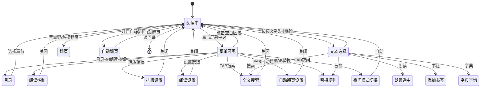
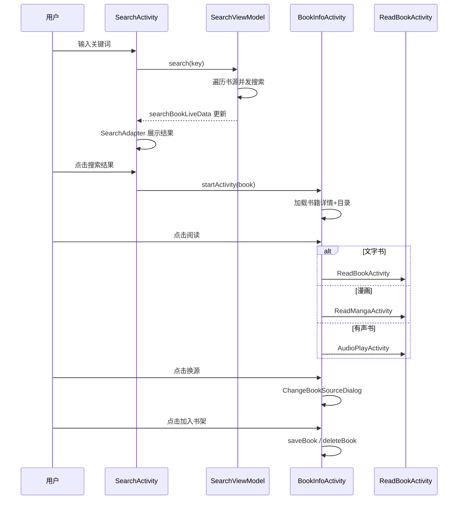

# Android UI 架构 · 页面详解册（android-ui-pages）

> **隶属关系**：本文档由原 `docs/project-flow/architecture/android-ui.md`（1988 行/26 章）拆分而来，四册同目录：
> - 姊妹册 [android-ui-core.md](android-ui-core.md) — 主框架/活动/Fragment/基类/导航/启动引导 + 顶栏体系（N1）+ Compose 化现状（N2）
> - **本册 android-ui-pages.md** — 核心页面布局与交互 + 流程图 + 书源调试/搜索范围/发现页/关联导入/辅助工具 + 订阅页双模式（N3）+ 发现页缓存加固（N4）
> - 姊妹册 [android-ui-media-theme.md](android-ui-media-theme.md) — 阅读/排版/漫画/音频/Widget/主题/资源/横屏 + EPUB 渲染与高亮（N5）+ 播放器画质增强（N6）
> - 姊妹册 [android-ui-changelog.md](android-ui-changelog.md) — UI 层源码统计 + 时敏优化记录（原 §25/§26）
>
> **一句话定位**：各功能页面的布局结构、状态变量与交互行为速查手册。
>
> 行号锚点以 2026-08-30 源码快照实测为准；原文档中已失效的文件行数与行号均已重数修正。

## 本册目录

| 章 | 内容 | 对应原章 |
|----|------|---------|
| §1 | 核心页面布局与交互详解（10 小节） | 原 §9 |
| §2 | 页面交互流程图 | 原 §10 |
| §3 | 书源调试流程 | 原 §20 |
| §4 | 搜索范围配置 | 原 §21 |
| §5 | 发现页架构 | 原 §22 |
| §6 | 关联导入体系 | 原 §23 |
| §7 | 辅助工具页面 | 原 §24 |
| §8 | N3 订阅页双模式 | 新增 |
| §9 | N4 发现页缓存加固 | 新增 |

> 原 §26（书源/订阅源文件夹视图重构）归入姊妹册 changelog 册 §3；本册 §1.5 的文件夹视图说明指向该处。

---

## 1. 核心页面布局与交互详解

### 1.1 书架页面 (BookshelfFragment1/2)

**布局**：
```
+-------------------------------------------+
| TitleBar (搜索按钮/排序/更多)               |
+-------------------------------------------+
|                                            |
| SwipeRefreshLayout                         |
|  +-- RecyclerView                          |
|       样式1: GridLayoutManager(3列)        |
|       样式2: 分组折叠 + GridLayoutManager  |
|                                            |
+-------------------------------------------+
```

**状态变量**：
| 变量 | 类型 | 用途 |
|------|------|------|
| books | List<Book> | 当前书籍列表 |
| sort | Int | 排序模式 |
| isSearch | Boolean | 是否搜索模式 |

**交互**：长按→操作菜单(置顶/删除/换源/详情/缓存/导出)；下拉刷新→全局搜索更新；分组拖拽→DragSortRecyclerView

### 1.2 搜索页面 (SearchActivity)

**文件**：`ui/book/search/SearchActivity.kt`（729 行）

**布局**：
```
+-------------------------------------------+
|  TitleBar + SearchView                     |
+-------------------------------------------+
|  RefreshProgressBar                        |
+-------------------------------------------+
|  A) 搜索结果: RecyclerView + SearchAdapter |
|  B) 输入帮助:                              |
|     书架书籍(FlexboxLayout+BookAdapter)    |
|     搜索历史(FlexboxLayout+HistoryKeyAdapter)|
+-------------------------------------------+
|  FAB (搜索开始/停止)                       |
+-------------------------------------------+
```

**状态变量**：
| 变量 | 类型 | 用途 |
|------|------|------|
| groups | List<String>? | 书源分组 |
| isManualStopSearch | Boolean | 是否手动停止 |
| precisionSearchMenuItem | MenuItem? | 精准搜索 |

**ViewModel LiveData**：
| LiveData | 用途 |
|----------|------|
| isSearchLiveData | 搜索进行中 |
| searchBookLiveData | 搜索结果 |
| upAdapterLiveData | Adapter局部刷新 |
| searchFinishLiveData | 搜索结束 |
| searchScope.stateLiveData | 搜索范围 |

**交互流程**：
1. SearchView提交 → viewModel.search(key)
2. 搜索文本变化 → stop() + upHistory(newText)
3. 搜索范围选择 → menu_group_1/2 → searchScope.update/remove
4. FAB → 搜索中stop(); 未搜索search("")
5. 结果点击 → BookInfoActivity
6. 历史关键字点击 → 直接搜索或补全
7. 滚动到底部 → 自动加载更多

### 1.3 书籍详情页面 (BookInfoActivity)

**布局**：
```
+-------------------------------------------+
|  bg_book (模糊封面背景)                    |
|  +-- vw_bg (半透明遮罩)                    |
|  |   +-- TitleBar (Dark主题)               |
|  |   +-- SwipeRefreshLayout                |
|  |       +-- NestedScrollView              |
|  |           ArcView (弧形顶部)            |
|  |           CardView > CoverImageView     |
|  |           tv_name (书名,居中)            |
|  |           lb_kind (分类标签)             |
|  |           tv_author / tv_origin         |
|  |           tv_lasted (最新章)             |
|  |           tv_group (分组)               |
|  |           tv_toc (目录进度)              |
|  |           tv_intro_container (简介)     |
|  +-- fl_action (底部操作)                  |
|      [tv_shelf: 加入/移出书架]             |
|      [tv_read: 阅读]                       |
+-------------------------------------------+
```

**状态变量**：
| 变量 | 类型 | 用途 |
|------|------|------|
| chapterChanged | Boolean | 章节变更 |
| pooledWebView | PooledWebView? | WebView池 |
| initIntroView | Boolean | 简介是否初始化 |

**ViewModel LiveData**：
| LiveData | 用途 |
|----------|------|
| bookData | 当前书籍 |
| chapterListData | 章节列表 |
| waitDialogData | 等待对话框 |
| actionLive | 操作指令 |

**交互**：
- tvRead → 按bookType分发AudioPlay/VideoPlayer/ReadManga/ReadBook
- tvShelf → 已加入:删除确认; 未加入:添加书架
- tvChangeSource → ChangeBookSourceDialog
- ivCover click → ChangeCoverDialog; long → PhotoDialog
- 简介支持四种模式: `<useweb>`/`<usehtml>`/`<md>`/纯文本

**菜单**：16项(menu_custom_btn, menu_edit, menu_share_it, menu_refresh, menu_login, menu_top, menu_set_source_variable, menu_set_book_variable, menu_copy_book_url, menu_copy_toc_url, menu_can_update, menu_clear_cache, menu_log, menu_split_long_chapter, menu_delete_alert, menu_upload)

### 1.4 阅读界面 (ReadBookActivity)

**文件**：`ui/book/read/ReadBookActivity.kt`（5208 行）。阅读核心架构（PageView/ReadMenu/排版）见姊妹册 media-theme 册 §1-§2。

**布局**：
```
FrameLayout
 +-- ReadView (全屏阅读视图, 自定义View)
 +-- View (text_menu_position, 不可见锚点)
 +-- ImageView (cursor_left, 文本选择左光标)
 +-- ImageView (cursor_right, 文本选择右光标)
 +-- ReadMenu (阅读菜单覆盖层, 默认gone)
 |    +-- vwMenuBg (点击关闭菜单背景)
 |    +-- TitleBar (书名/章节名/书源操作/自定义按钮)
 |    +-- bottomMenu (ConstraintLayout)
 |         +-- fabSearch / fabAutoPage / fabReplaceRule / fabNightTheme
 |         +-- tvPre / tvNext (上一章/下一章)
 |         +-- seekReadPage (进度SeekBar)
 |         +-- llCatalog / llReadAloud / llFont / llSetting
 |         +-- llBrightness (亮度控制条)
 +-- SearchMenu (全文搜索菜单, 默认gone)
 +-- View (navigation_bar, 底部导航栏占位)
```

**状态变量**：
| 变量 | 类型 | 用途 |
|------|------|------|
| isInitFinish | Boolean | 数据初始化完成 |
| menuLayoutIsVisible | Boolean | 菜单可见 |
| isAutoPage | Boolean | 自动翻页 |
| isScroll | Boolean | 滚动模式 |
| isShowingSearchResult | Boolean | 全文搜索结果模式 |
| isSelectingSearchResult | Boolean | 选择搜索结果 |
| bookChanged | Boolean | 书籍变更 |
| pageChanged | Boolean | 页面变更 |
| confirmRestoreProcess | Boolean? | 恢复进度确认 |
| searchContentQuery | String | 搜索关键词 |
| searchResultList | List<SearchResult>? | 搜索结果 |
| searchResultIndex | Int | 当前搜索索引 |

**翻页交互 (5种)**：
1. 触摸翻页: ReadView.OnTouchEvent → pageDelegate.turnPage()
2. 音量键: VOLUME_UP/DOWN → volumeKeyPage()
3. 键盘: PAGE_UP/DOWN/SPACE → handleKeyPage()
4. 鼠标滚轮: SCROLL → mouseWheelPage()
5. 自动翻页: autoPage() → readView.autoPager.start()

**菜单显示/隐藏**：
点击屏幕中央 → showActionMenu()
  → 朗读中 → showReadAloudDialog()
  → 自动翻页 → AutoReadDialog
  → 全文搜索中 → searchMenu.runMenuIn()
  → 否则 → readMenu.runMenuIn() (TitleBar下滑 + 底栏上滑)

**文本选择交互**：
长按文字 → ContentTextView选中 → cursorLeft/cursorRight显示
拖拽光标 → selectStartMove/selectEndMove
松手 → TextActionMenu (朗读/书签/替换/全文搜索/字典)

**事件总线观察**：
- TIME_CHANGED / BATTERY_CHANGED → 更新时间/电量
- UP_CONFIG(array) → 更新配置(0=系统UI, 1=背景, 2=样式, 3=透明度, 4=翻页灵敏度, 5=重载内容, 6=更新内容...)
- ALOUD_STATE → 朗读状态变化
- TTS_PROGRESS → TTS进度
- SEARCH_RESULT → 搜索结果
- REFRESH_BOOK_CONTENT / REFRESH_BOOK_TOC → JS触发刷新

### 1.5 书源管理页面 (BookSourceActivity)

**文件**：`ui/book/source/manage/BookSourceActivity.kt`（1204 行）

**布局**：
```
+-------------------------------------------+
|  TitleBar + SearchView                     |
+-------------------------------------------+
|  FastScrollRecyclerView                    |
|    LinearLayoutManager                     |
|    BookSourceAdapter                       |
|    DragSelectTouchHelper (滑动多选)        |
|    ItemTouchHelper (拖拽排序)              |
+-------------------------------------------+
|  SelectActionBar                           |
|  [全选/反选] [删除] [启用/禁用/校验/...]   |
+-------------------------------------------+
```

**状态变量**：
| 变量 | 类型 | 用途 |
|------|------|------|
| sort | BookSourceSort | 排序模式(Default/Weight/Name/Url/Update/Respond/Enable) |
| sortAscending | Boolean | 升序/降序 |
| groups | LinkedHashSet<String> | 书源分组 |
| groupSourcesByDomain | Boolean | 按域名分组 |
| snackBar | Snackbar? | 校验提示 |

**搜索关键字**：支持"启用/禁用/需登录/无分组/启用发现/禁用发现/group:xxx"

**批量操作**：启用/禁用/发现/校验/置顶/置底/加分组/移分组/导出/分享

**文件夹视图**（2026-07-08 重构）：除默认列表视图外，书源/订阅源列表支持切换为文件夹卡片视图，详见姊妹册 [changelog 册 §3](android-ui-changelog.md)。卡片采用 3:4 比例 + 首字占位 + 主题色背景，参考书架封面风格；通过 `showFolderConfig()` 对话框配置分组样式、视图模式与间距。

### 1.6 书源编辑页面 (BookSourceEditActivity)

**文件**：`ui/book/source/edit/BookSourceEditActivity.kt`（856 行）

**布局**：
```
+-------------------------------------------+
|  TitleBar ("编辑书源")                     |
+-------------------------------------------+
|  HorizontalScrollView (配置行)             |
|  [Spinner:类型] [启用] [发现] [Cookie]     |
|  [事件监听] [自定义按钮]                   |
+-------------------------------------------+
|  TabLayout (6个Tab)                        |
|  [基本] [搜索] [发现] [详情] [目录] [正文] |
+-------------------------------------------+
|  RecyclerView (动态EditEntity列表)          |
+-------------------------------------------+
```

**6个Tab编辑项**：
| Tab | 编辑项数 | 关键字段 |
|-----|---------|---------|
| 基本 | 13 | bookSourceUrl, bookSourceName, bookSourceGroup, loginUrl, loginUi, loginCheckJs, coverDecodeJs, bookUrlPattern, header, variableComment, concurrentRate, jsLib |
| 搜索 | 11 | searchUrl, checkKeyWord, bookList, name, author, kind, wordCount, lastChapter, intro, coverUrl, bookUrl |
| 发现 | 10 | exploreUrl, bookList, name, author, kind, wordCount, lastChapter, intro, coverUrl, bookUrl |
| 详情 | 11 | init, name, author, kind, wordCount, lastChapter, intro, coverUrl, tocUrl, canReName, downloadUrls |
| 目录 | 10 | preUpdateJs, chapterList, chapterName, chapterUrl, formatJs, isVolume, updateTime, isVip, isPay, nextTocUrl |
| 正文 | 11 | content, nextContentUrl, subContent, replaceRegex, title, sourceRegex, imageStyle, imageDecode, webJs, payAction, callBackJs |

**交互**：Tab切换→RecyclerView的EditEntity切换；保存→getSource()收集→viewModel.save()；调试→先保存→BookSourceDebugActivity（见本册 §3）；全屏编辑→CodeEditActivity；键盘工具→KeyboardToolPop(URL参数/教程/正则/文件)

### 1.7 RSS订阅源页面 (RssSortActivity)

**布局**：
```
+-------------------------------------------+
|  TitleBar                                  |
+-------------------------------------------+
|  LinearLayout (tabs_container, 动态多行标签)|
|  每行: HorizontalScrollView > TextView标签  |
|  (<=10:1行, <=20:2行, >20:3行)            |
+-------------------------------------------+
|  ViewPager                                 |
|  +-- RssArticlesFragment (每分类一个)      |
+-------------------------------------------+
```

**5种文章样式**：
| style | Adapter | LayoutManager | 说明 |
|-------|---------|---------------|------|
| 0 | RssArticlesAdapter | LinearLayoutManager | 标题+日期(左) + 缩略图(右110x68) |
| 1 | RssArticlesAdapter1 | LinearLayoutManager | 大图(220dp高) + 标题 + 日期 |
| 2 | RssArticlesAdapter2 | GridLayoutManager(2列) | 双列卡片 |
| 3 | RssArticlesAdapter3 | StaggeredGridLayoutManager(竖2/横3) | 瀑布流CardView |
| 4 | RssArticlesAdapter4 | GridLayoutManager(3列) | 三列紧凑 |

切换：菜单 menu_switch_layout → articleStyle循环0→1→2→3→4→0

### 1.8 RSS文章阅读页面 (ReadRssActivity)

**布局**：
```
FrameLayout
 +-- ConstraintLayout (主视图)
 |    +-- TitleBar
 |    +-- FrameLayout (web_view_container, WebView)
 |    +-- RefreshProgressBar (1dp进度条)
 +-- FrameLayout (custom_web_view, 全屏视频)
```

**内容加载三路分发**：
1. 有link+有description → contentLiveData → loadDataWithBaseURL
2. 有link+有ruleContent → Rss.getContent() → contentLiveData
3. 有link+无ruleContent → urlLiveData → loadUrl
4. 有startHtml → htmlLiveData → loadDataWithBaseURL

**WebView交互**：长按图片→保存；URL跳转→shouldOverrideUrlLoading JS；黑白名单→shouldInterceptRequest过滤；JS注入→preloadJs；全屏视频→customWebView覆盖

**返回导航**：全屏→关闭视频；WebView可后退→智能计算后退步数(跳过刷新重复)；无法后退→finish()

### 1.9 配置页面 (ConfigActivity)

**布局**：简单容器，通过configTag动态加载Fragment

**Fragment路由表**：
| configTag | Fragment | 功能 |
|-----------|----------|------|
| OTHER_CONFIG | OtherConfigFragment | 其他设置（含 debug_tools 调试工具箱入口） |
| THEME_CONFIG | ThemeConfigFragment | 主题设置 |
| BACKUP_CONFIG | BackupConfigFragment | 备份设置 |
| COVER_CONFIG | CoverConfigFragment | 封面设置 |
| WELCOME_CONFIG | WelcomeConfigFragment | 欢迎页设置 |

### 1.10 换源对话框 (ChangeBookSourceDialog)

**布局**：
```
+-------------------------------------------+
|  Toolbar (书名/作者 + 菜单)                |
+-------------------------------------------+
|  RefreshProgressBar                        |
+-------------------------------------------+
|  FastScrollRecyclerView                    |
|    ChangeBookSourceAdapter                 |
+-------------------------------------------+
|  ll_bottom_bar                             |
|  [当前源/进度] [跳顶部] [跳底部]          |
+-------------------------------------------+
```

**交互**：换源→changeTo()→类型确认→viewModel.getToc()→callBack.changeTo()；搜索控制→startOrStopSearch()；分组切换→AppConfig.searchGroup变更；滚动定位→scrollToDurSource()

---

## 2. 页面交互流程图

### 2.1 阅读界面状态流转

```
[阅读中]
  │
  ├── 点击屏幕中央 ─→ [菜单可见]
  │     ├── TitleBar: 书名/章节/书源操作/自定义按钮
  │     ├── 目录 → TocDialog
  │     ├── 朗读 → ReadAloudDialog
  │     ├── 排版 → ReadStyleDialog
  │     ├── 设置 → ReadBookConfigFragment
  │     ├── FAB搜索 → SearchMenu
  │     ├── FAB自动翻页 → AutoReadDialog
  │     ├── FAB替换 → ReplaceRuleDialog
  │     ├── FAB夜间 → 切换夜间模式
  │     └── 点击空白 → 返回[阅读中]
  │
  ├── 长按文字 ─→ [文本选择]
  │     ├── 朗读选中
  │     ├── 添加书签
  │     ├── 替换规则
  │     ├── 全文搜索
  │     └── 字典查询
  │
  ├── 音量键 ─→ 翻页
  ├── 自动翻页 ─→ 定时翻页
  └── 返回键 ─→ finish()
```



### 2.2 搜索→详情→阅读 完整流程

```
SearchActivity
  │
  ├── 输入关键词 → 搜索 → searchBookLiveData
  │     ├── 结果点击 → BookInfoActivity
  │     │     ├── tvRead → ReadBookActivity / ReadMangaActivity / AudioPlayActivity
  │     │     ├── tvShelf → 加入/移出书架
  │     │     ├── tvChangeSource → ChangeBookSourceDialog
  │     │     └── ivCover → ChangeCoverDialog
  │     │
  │     └── 长按结果 → 快速加入书架
  │
  └── 搜索范围 → menu_group → 分组筛选
```



---

## 3. 书源调试流程

### 3.1 架构总览

**文件**（行数实测 2026-08-30）:
- Activity: [BookSourceDebugActivity.kt](file:///f:/myself/github/WeAgentChat/temp/legado/app/src/main/java/io/legado/app/ui/book/source/debug/BookSourceDebugActivity.kt)（231 行）
- ViewModel: [BookSourceDebugModel.kt](file:///f:/myself/github/WeAgentChat/temp/legado/app/src/main/java/io/legado/app/ui/book/source/debug/BookSourceDebugModel.kt)（60 行）
- 核心模型: [Debug.kt](file:///f:/myself/github/WeAgentChat/temp/legado/app/src/main/java/io/legado/app/model/Debug.kt)（403 行）

```
BookSourceDebugActivity (VMBaseActivity)
└── BookSourceDebugModel (BaseViewModel, Debug.Callback)
    └── Debug (object 单例)
        ├── startDebug(BookSource, key)    — 书源4阶段
        └── startDebug(RssSource, key)     — RSS源2阶段
```

### 3.2 四阶段调试状态机

`BookSourceDebugModel.printLog()` 拦截 state 码作为阶段标记：

| state | 阶段 | 缓存字段 | 含义 |
|-------|------|----------|------|
| 10 | 搜索页 | `searchSrc` | 搜索页HTML源码 |
| 20 | 详情页 | `bookSrc` | 详情页HTML源码 |
| 30 | 目录页 | `tocSrc` | 目录页HTML源码 |
| 40 | 正文页 | `contentSrc` | 正文页HTML源码 |
| -1 | 错误 | — | 停止加载旋转 |
| 1000 | 完成 | — | 停止加载旋转 |

**完整调试链路**：

```
Debug.startDebug()
├── [默认] 搜索 → info → toc → content        (4阶段)
├── [explore入口] explore → info → toc → content
├── [++前缀] toc → content                      (跳过搜索+详情)
├── [--前缀] content                              (仅正文)
├── [URL输入] info → toc → content               (跳过搜索)
└── [::格式] explore → info → toc → content      (发现页入口)
```

### 3.3 ++/-- 前缀自动补全

| 前缀 | 行为 | 触发方法 |
|------|------|----------|
| `++` | 截取 `key.substring(2)` 作为目录URL，直接进入 toc 阶段 | `prefixAutoComplete("++")` |
| `--` | 截取 `key.substring(2)` 作为正文URL，直接进入 content 阶段 | `prefixAutoComplete("--")` |
| `::` | 进入发现页调试，`::` 前为分类名，后为分类URL | 搜索框输入 |

### 3.4 RSS 调试差异

RSS 源没有4阶段流程：

| 特征 | 书源 | RSS源 |
|------|------|-------|
| 阶段数 | 4（搜索→详情→目录→正文） | 2（分类页→内容页） |
| 入口 | `searchUrl` | `sortUrl` 第一个 |
| 内容页条件 | 始终执行 | 仅当有 `ruleContent` 且无 `ruleDescription` |
| `::` 格式 | 发现页调试 | 分类名+分类URL调试 |

### 3.5 UI 模式

- SearchView + 快捷帮助按钮（我的/其他/发现/信息/目录/正文）
- RecyclerView 实时追加调试消息
- RotateLoading 加载指示器
- 菜单：扫码、查看各阶段源码(html)、刷新发现分类、帮助

---

## 4. 搜索范围配置

### 4.1 架构总览

**文件**（行数实测 2026-08-30）:
- Dialog: [SearchScopeDialog.kt](file:///f:/myself/github/WeAgentChat/temp/legado/app/src/main/java/io/legado/app/ui/book/search/SearchScopeDialog.kt)（359 行）
- 数据类: [SearchScope.kt](file:///f:/myself/github/WeAgentChat/temp/legado/app/src/main/java/io/legado/app/ui/book/search/SearchScope.kt)（164 行）

```
SearchScopeDialog (BaseDialogFragment)
├── rbGroup 模式   — 分组多选 CheckBox
│   └── selectGroups: ArrayList<String>
└── rbSource 模式   — 书源单选 RadioButton
    └── selectSource: BookSourcePart

SearchScope (data class)
├── scope: String       — 持久化字符串
├── isSource()          — 检测含 "::"
└── getBookSourceParts() — 解析为书源列表
```

### 4.2 双模式设计

| 模式 | 控件 | 选择方式 | 搜索框 | scope格式 |
|------|------|----------|--------|-----------|
| 分组模式 (`rbGroup`) | CheckBox | 多选 | 隐藏 | `"默认,玄幻"` (逗号分隔) |
| 书源模式 (`rbSource`) | RadioButton | 单选 | 显示 | `"书源名::书源URL"` |

### 4.3 scope 解析流程

`getBookSourceParts()` 解析逻辑：

```
scope 为空 → 返回所有已启用书源
scope 含 "::" → 按 URL 查询单个书源
scope 为分组名 → 按分组查询已启用书源
  └── 空分组自动清理 → update(newScope) 自修正
结果为空 → 降级到全部书源
```

### 4.4 持久化策略

```kotlin
// 单书源搜索不缓存，防止下次仍为单书源
fun save() {
    AppConfig.searchScope = scope
    if (!isSource()) {
        AppConfig.searchGroup = scope
    }
}
```

- `AppConfig.searchScope`: 当前搜索范围
- `AppConfig.searchGroup`: 上次分组搜索范围（仅分组模式更新）
- 单书源模式不写 `searchGroup`，避免下次打开仍锁定在单源

### 4.5 UI 布局

- BaseDialogFragment，90%宽 × 80%高
- 内嵌 RecyclerAdapter，根据模式切换 ViewHolder（CheckBox vs RadioButton）
- Flow + conflate 实时搜索书源

---

## 5. 发现页架构

### 5.1 架构总览

**文件**（行数实测 2026-08-30）:
- Adapter: [ExploreAdapter.kt](file:///f:/myself/github/WeAgentChat/temp/legado/app/src/main/java/io/legado/app/ui/main/explore/ExploreAdapter.kt)（694 行，最大适配器）
- 数据实体: [ExploreKind.kt](file:///f:/myself/github/WeAgentChat/temp/legado/app/src/main/java/io/legado/app/data/entities/rule/ExploreKind.kt)（51 行）
- 展示Activity: [ExploreShowActivity.kt](file:///f:/myself/github/WeAgentChat/temp/legado/app/src/main/java/io/legado/app/ui/book/explore/ExploreShowActivity.kt)（218 行）

```
ExploreAdapter (RecyclerAdapter)
├── 5种UI控件动态渲染
├── infoMap: LruCache<String, InfoMap>(99)  — 状态缓存
├── 3类View回收池: recycler/textRecycler/selectRecycler
└── JS执行引擎: evalUiJs / evalButtonClick

ExploreShowActivity
├── 双向分页加载
└── NumberPickerDialog 跳页（maxValue=999，L58-L60）
```

### 5.2 五种UI控件类型

| 类型 | 控件 | 交互行为 | 触发动作 |
|------|------|----------|----------|
| **url** | TextView标签 | 点击跳转 | `callBack.openExplore()` → ExploreShowActivity |
| **button** | TextView标签 | 点击执行 | `evalButtonClick(kind.action)` — JS代码 |
| **text** | AutoCompleteTextView | 输入内容(600ms防抖) | `kind.action` JS执行 |
| **toggle** | TextView标签 | 点击循环切换 `kind.chars[]` | 切换后触发 action JS |
| **select** | Spinner | 下拉选择 | 选中项触发 action JS |

### 5.3 动态名称机制

所有类型支持 `viewName` 动态名称：
- `'xxx'` 格式（单引号包裹，3-19字符）→ 直接取字面值
- 其他 → 执行 JS (`evalUiJs`) 获取名称

**toggle 显示格式**：
- `style.layout_justifySelf == flex_end` → `title + char`（值在右）
- 其他 → `char + title`（值在左）

### 5.4 JS 执行机制

| 方法 | 注入变量 | 用途 |
|------|----------|------|
| `evalUiJs()` | `infoMap` | 获取动态控件名称 |
| `evalButtonClick()` | `java`(SourceLoginJsExtensions) + `infoMap` | 按钮交互逻辑 |

`infoMap` 缓存所有控件的用户输入/选择状态，键为 title。

### 5.5 View 回收机制

三类回收池避免 FlexboxLayout 频繁 inflate：

| 回收池 | 类型 | 控件 |
|--------|------|------|
| `recycler` | url/button/toggle | TextView |
| `textRecycler` | text | AutoCompleteTextView |
| `selectRecycler` | select | LinearLayout(含Spinner) |

- `recyclerFlexbox()`: 折叠时回收所有子 View 到对应池
- `getFlexboxChild/Text/Select()`: 从池中取或新建

### 5.6 ExploreShowActivity 分页

**双向分页加载**：

```
滚动监听
├── canScrollVertically(1) == false → 翻下页
├── canScrollVertically(-1) == false → 翻上页
└── NumberPickerDialog → 跳页（最大999页，setMaxValue(999) 实测 L60）

翻页逻辑:
├── oldPage 追踪当前页码
├── 跳页后清空列表自动触发加载
└── loadMoreView / loadMoreViewTop 分别为底部/顶部加载指示器
```

### 5.7 数据流

```
BookSourcePart → exploreKinds() → List<ExploreKind>
→ upKindList() 根据 type 渲染5种UI控件
→ 用户交互 → infoMap 更新 → evalButtonClick/evalUiJs 执行
→ url类型 → ExploreShowActivity 展示搜索结果
```

> 发现 Tab 主页（ExploreFragment）的缓存签名/快照持久化加固见本册 §9。

---

## 6. 关联导入体系

### 6.1 架构总览

**文件**（行数实测 2026-08-30）:
- URL导入: [OnLineImportActivity.kt](file:///f:/myself/github/WeAgentChat/temp/legado/app/src/main/java/io/legado/app/ui/association/OnLineImportActivity.kt)（379 行）
- 文件导入: [FileAssociationActivity.kt](file:///f:/myself/github/WeAgentChat/temp/legado/app/src/main/java/io/legado/app/ui/association/FileAssociationActivity.kt)（255 行）
- ViewModel基类: [BaseAssociationViewModel.kt](file:///f:/myself/github/WeAgentChat/temp/legado/app/src/main/java/io/legado/app/ui/association/BaseAssociationViewModel.kt)（48 行）
- 在线ViewModel: [OnLineImportViewModel.kt](file:///f:/myself/github/WeAgentChat/temp/legado/app/src/main/java/io/legado/app/ui/association/OnLineImportViewModel.kt)（111 行）
- 书源导入对话框: [ImportBookSourceDialog.kt](file:///f:/myself/github/WeAgentChat/temp/legado/app/src/main/java/io/legado/app/ui/association/ImportBookSourceDialog.kt)（282 行）

```
OnLineImportActivity (URL Scheme入口)
├── OnLineImportViewModel
│   ├── determineType()        — Content-Type/JSON类型判断
│   └── importJson()           — 7种JSON类型识别
└── → 对应 ImportXxxDialog

FileAssociationActivity (文件关联入口)
├── FileAssociationViewModel
│   ├── dispatchIntent(uri)    — URI scheme路由
│   ├── dispatch(fileDoc)      — 文件类型路由
│   └── importBook()           — 本地书导入
└── → 对应 ImportXxxDialog 或 导入书籍
```

### 6.2 URL Scheme 处理

格式：`legado://import/{path}?src={url}`

| 路径 | 对话框 | 说明 |
|------|--------|------|
| `/bookSource` | ImportBookSourceDialog | 书源 |
| `/rssSource` | ImportRssSourceDialog | RSS源 |
| `/replaceRule` | ImportReplaceRuleDialog | 替换规则 |
| `/textTocRule` | ImportTxtTocRuleDialog | TXT目录规则 |
| `/httpTTS` | ImportHttpTtsDialog | 在线TTS |
| `/dictRule` | ImportDictRuleDialog | 字典规则 |
| `/theme` | ImportThemeDialog | 主题 |
| `/readConfig` | 直接导入 | 排版配置(二进制) |
| `/addToBookshelf` | AddToBookshelfDialog | 加入书架 |
| `/importonline` | 按 host 区分 | 自动判断类型 |

### 6.3 七种JSON类型识别

`BaseAssociationViewModel.importJson()` 通过 JsonPath 解析 JSON 第一个元素，按键名判断类型：

| 键名组合 | 类型 | 对应对话框 |
|----------|------|-----------|
| `bookSourceUrl` | bookSource | ImportBookSourceDialog |
| `sourceUrl` | rssSource | ImportRssSourceDialog |
| `pattern` | replaceRule | ImportReplaceRuleDialog |
| `themeName` | theme | ImportThemeDialog |
| `showRule` | dictRule | ImportDictRuleDialog |
| `name` + `rule` | txtRule | ImportTxtTocRuleDialog |
| `name` + `url` | httpTts | ImportHttpTtsDialog |

### 6.4 文件关联处理流程

```
dispatchIntent(uri)
├── content/file scheme → 检查是否压缩包 → 解压后递归 dispatch
└── 其他 scheme → 转发到 OnLineImportActivity

dispatch(fileDoc)
├── JSON文件 → importJson() → 7种类型识别
├── 匹配 bookFileRegex → importBookLiveData → 导入书籍
└── 其他 → notSupportedLiveData → 提示是否强制导入

importBook()
├── 检查 defaultBookTreeUri → 复制文件到书库
└── LocalBook.importFile() → 入库
```

### 6.5 ImportBookSourceDialog 核心功能

| 功能 | 说明 |
|------|------|
| 批量选择 | 全选/反选、选新增/选更新 |
| 自定义分组 | `isAddGroup` 开关 + `groupName` 设置 |
| 保留原名 | `importKeepName` |
| 保留分组 | `importKeepGroup` |
| 保留启用状态 | `importKeepEnable` |
| 显示注释 | `importShowComment` |
| 源状态标记 | `新增` / `更新` / `已有` |
| 单条编辑 | CodeDialog 编辑源JSON |

### 6.6 数据流

```
URL Scheme / File Intent
→ OnLineImportActivity / FileAssociationActivity
→ ViewModel.determineType() / dispatchIntent()
→ BaseAssociationViewModel.importJson() → 7种JSON类型识别
→ successLive → 对应 ImportXxxDialog
→ ImportBookSourceDialog → 选择 → viewModel.importSelect() → 入库
```

---

## 7. 辅助工具页面

### 7.1 ReadRecordActivity 阅读记录

**文件**: [ReadRecordActivity.kt](file:///f:/myself/github/WeAgentChat/temp/legado/app/src/main/java/io/legado/app/ui/about/ReadRecordActivity.kt)（147 行，实测；**已部分 Compose 化**——状态用 `mutableStateOf`，见 core 册 §8.4）

**排序模式**（3种，持久化到 `LocalConfig.readInt("readRecordSort")`，实测 L37-L39）：

| 排序 | 实现 | 说明 |
|------|------|------|
| 0 | `cnCompare` | 按书名中文排序（L108） |
| 1 | `sortedByDescending { it.readTime }` | 按阅读时长降序 |
| 2 | `sortedByDescending { it.lastRead }` | 按最后阅读时间降序 |

**核心功能**：
- 搜索过滤: `appDb.readRecordDao.search(searchKey)`
- 总时长显示: `appDb.readRecordDao.allTime` → `formatDuring()` 格式化为"X天X小时X分钟X秒"
- 启用/禁用记录: `AppConfig.enableReadRecord` 开关（实测 L47/L74）
- 清空记录: `appDb.readRecordDao.clear()`
- 点击条目: 查找书籍 → 存在则打开阅读，不存在则跳转搜索

### 7.2 CacheActivity 缓存与导出

**文件**: [CacheActivity.kt](file:///f:/myself/github/WeAgentChat/temp/legado/app/src/main/java/io/legado/app/ui/book/cache/CacheActivity.kt)（754 行，实测）

**排序模式**（5种，由 `AppConfig.getBookSortByGroupId()` 决定）：

| 排序 | 字段 | 说明 |
|------|------|------|
| 0 | `durChapterTime` | 按最近阅读时间 |
| 1 | `latestChapterTime` | 按最新章节时间 |
| 2 | `cnCompare` | 按书名中文排序 |
| 3 | `order` | 按自定义排序 |
| 4 | `max(latestChapterTime, durChapterTime)` | 按综合时间 |

**导出配置体系**（实测锚点：exportTypes L96 / configExportSection L467 / exportToWebDav L306 / parallelExportBook L318 / exportCharset L330）：

| 配置项 | PreferKey | 说明 |
|--------|-----------|------|
| 导出格式 | `exportType` | TXT / EPUB |
| 导出编码 | `exportCharset` | 默认 UTF-8 |
| 自定义文件名 | `bookExportFileName` | 支持 JS 变量 `name`/`author` |
| EPUB分段导出 | `configExportSection()` | 可选章节范围+分段大小 |
| WebDAV导出 | `exportToWebDav` | 导出后上传 WebDAV |
| 并行导出 | `parallelExportBook` | 多书并行导出 |
| 替换规则 | `exportUseReplace` | 导出时应用替换规则 |
| 无章节名 | `exportNoChapterName` | 正文不含章节标题 |
| 导出图片 | `exportPictureFile` | 含图片文件导出 |

**缓存下载**：`CacheBook.start()` 启动，支持从当前章节或第0章开始，状态通过 `EventBus.UP_DOWNLOAD` 等事件通知。

### 7.3 分组编辑三层对话框

**文件**（行数实测 2026-08-30）:
- [GroupEditDialog.kt](file:///f:/myself/github/WeAgentChat/temp/legado/app/src/main/java/io/legado/app/ui/book/group/GroupEditDialog.kt)（388 行）
- [GroupManageDialog.kt](file:///f:/myself/github/WeAgentChat/temp/legado/app/src/main/java/io/legado/app/ui/book/group/GroupManageDialog.kt)（245 行；另有同名薄壳类分布于 book/source/manage、replace、rss/source/manage 各 44 行）
- [GroupSelectDialog.kt](file:///f:/myself/github/WeAgentChat/temp/legado/app/src/main/java/io/legado/app/ui/book/group/GroupSelectDialog.kt)（242 行）
- [GroupViewModel.kt](file:///f:/myself/github/WeAgentChat/temp/legado/app/src/main/java/io/legado/app/ui/book/group/GroupViewModel.kt)（64 行）

**三层嵌套关系**：

```
GroupManageDialog (分组列表管理)
├── 拖拽排序: ItemTouchCallback + ItemTouchHelper
├── 上限检查: appDb.bookGroupDao.canAddGroup (最多64个自定义分组)
├── 显示/隐藏切换
└── → GroupEditDialog (单个分组编辑)
    ├── groupName / cover / bookSort / enableRefresh / onlyUpdateRead
    ├── 封面选择: HandleFileContract.IMAGE, MD5去重缓存到 externalFiles/covers/
    └── 删除: groupId > 0 或 groupId == Long.MIN_VALUE 时可删

GroupSelectDialog (分组多选)
├── groupId 位运算管理
├── 系统内置分组(负数): -1(全部) / -2(本地) / -3(音频) / -4(未分组) / -5(未分组含本地) / -6(视频) / -11(更新失败)
└── CallBack.upGroup(requestCode, groupId) → 返回位掩码值
```

> 注：系统内置分组位值细节为原稿断言，本轮未逐值核验（待确认）。

### 7.4 groupId 位运算核心

groupId 为 2 的幂次，通过位运算实现多分组管理：

| 操作 | 实现 | 说明 |
|------|------|------|
| 添加分组 | `groupId + it.groupId` | 位 OR（因为幂次不重叠） |
| 移除分组 | `groupId - it.groupId` | 位 AND NOT |
| 检测归属 | `(groupId and it.groupId) > 0` | 位 AND |
| 合法性检查 | `id and (id - 1) == 0L` | 判断2的幂次 |
| 分配新ID | `getUnusedId()` | 从 `1L` 左移到无交集位 |

---

## 8. N3 订阅页双模式（RssFragment classic/modern）

> 新增章节。订阅 Tab 主页存在"经典形态"与"现代形态"两套渲染路径，由 `AppConfig.modernRssPage` 总开关分派。

### 8.1 文件与开关

**文件**：[RssFragment.kt](file:///f:/myself/github/WeAgentChat/temp/legado/app/src/main/java/io/legado/app/ui/main/rss/RssFragment.kt)（`ui/main/rss/`，1464 行，实测 2026-08-30）

| 要素 | 位置 | 说明 |
|------|------|------|
| 总开关 | [PreferKey.kt:L414](file:///f:/myself/github/WeAgentChat/temp/legado/app/src/main/java/io/legado/app/constant/PreferKey.kt#L414) | `modernRssPage` |
| 运行时镜像 | RssFragment L148 | `private var usingModernRss = false` |
| 经典头就绪标记 | RssFragment L161 | `classicHeaderReady`（per-mode 释放，防 adapter 复用重复挂载） |
| 模式分派 | RssFragment L341-L346 | `usingModernRss = AppConfig.modernRssPage` 后走 `applyClassicRssMode()` / `applyModernRssMode()` |
| 重建守卫 | RssFragment L241 / L301 | `usingModernRss != AppConfig.modernRssPage` 时重建；重建后 needSwitch=false 不会循环重建（L297 注释） |

### 8.2 经典形态（classic）

**入口**：`applyClassicRssMode()`（[RssFragment.kt:L383](file:///f:/myself/github/WeAgentChat/temp/legado/app/src/main/java/io/legado/app/ui/main/rss/RssFragment.kt#L383)）

- 移除 modern 顶栏 layout 监听（S1，标题宽度不再被钳制 96~190dp，L384-L386）
- 双保险隐藏 modern 容器（rss_fragment_container/rss_web_container 全屏 z 序最高，不隐藏会盖住经典列表——真机实锤 2026-08-28，L388-L391）
- 显示 `binding.recyclerView`（L393）
- Compose 化组件：
  - `initComposeTopBar()`（L395）— Compose 顶栏
  - `initTabLayout()`（L396，D1）— 分组胶囊标签
  - `initFolderComposeView()`（L397，folder-compose-refactor）— Compose 文件夹网格
- 文件夹/标签/间距偏好（迁移链）：
  - **`PreferKey.rssViewMode` 已删除**（[PreferKey.kt:L292](file:///f:/myself/github/WeAgentChat/temp/legado/app/src/main/java/io/legado/app/constant/PreferKey.kt#L292) 注释：原 rssViewMode 0 引用已删除）
  - 现由 `sourceGroupStyle`（0=列表/1=按类型/2=按分组，PreferKey L300）+ `sourceGroupMode` + `sourceMargin`（卡片间距 0-60，PreferKey L307）组合表达
  - `isFolderViewMode = sourceGroupStyle != 0 && sourceGroupMode == 1`（RssFragment L180-L181）
  - `folderComposeMargin = AppConfig.sourceMargin`（RssFragment L175）
- 数据流：`initRecyclerView() → initGroupData() → upFolderView()/upRssFlowJob()`（L400-L406）

### 8.3 现代形态（modern）

**入口**：`applyModernRssMode()`（[RssFragment.kt:L422](file:///f:/myself/github/WeAgentChat/temp/legado/app/src/main/java/io/legado/app/ui/main/rss/RssFragment.kt#L422)）

- 取消 classic 数据流任务，隐藏 recyclerView（L423-L429）
- 顶栏：`binding.topBar.setMode(MainTopBarView.Mode.RSS)`（L453；顶栏体系见 core 册 §7）
  - 源选择（titleSelect → SourceSelectDialog，L467）+ 源标签（primaryBar，L471）+ 分类标签 + 搜索/登录/星标/刷新
- 内容双路（L448-L450 注释、L557-L558 分派）：
  - 有 `ruleArticles` 源 → 内嵌 `RssArticlesFragment`（rss_fragment_container）
  - 无 ruleArticles 源 → WebView 单源渲染（rss_web_container）

### 8.4 500ms 二次收敛机制

[RssFragment.kt:L407-L418](file:///f:/myself/github/WeAgentChat/temp/legado/app/src/main/java/io/legado/app/ui/main/rss/RssFragment.kt#L407)

```
classic 建立后 binding.root.postDelayed(500ms):
  if (view == null || usingModernRss) return   // 模式已切换则放弃
  if (rssFragmentContainer.isVisible || rssWebContainer.isVisible):
      强制再次清空 modern 容器 + destroyModernRssChildren()
      + topBar.setPrimaryItems(emptyList()) + showTags(false)
```

- 目的：对抗"日志静默区竞态重新渲染 modern 容器"，根治"经典顶栏 + modern 内容"混合态（rss-classic-layout-align 守卫补强，真机实锤）
- 配套：`destroyModernRssChildren()`（L434-L446）用 `commitNow` 同步移除 Fragment（commit 异步存在窗口期会残留覆盖）

### 8.5 跨模式状态隔离

- sortHostViewModel 跨模式隔离（S6）：切回 classic 前清空 url/sortUrl/rssSource/sourceName/searchKey，防切回 modern 残留旧源（L370-L377）
- per-mode 释放（S5）：`classicHeaderReady = false`，adapter 复用时 getHeaderCount 幂等兜底防重复挂载（L378-L379）

---

## 9. N4 发现页缓存加固（ExploreFragment）

> 新增章节。发现 Tab 主页（ExploreFragment，`ui/main/explore/`，4004 行，实测）对 widget 快照缓存做了一套签名校验 + 容量治理 + 反序列化加固体系。

### 9.1 缓存签名（cacheSignature）

| 用途 | 位置 | 说明 |
|------|------|------|
| widget 变更检测 | [ExploreFragment.kt:L510](file:///f:/myself/github/WeAgentChat/temp/legado/app/src/main/java/io/legado/app/ui/main/explore/ExploreFragment.kt#L510) | `currentWidget.cacheSignature() == widget.cacheSignature()` 判定是否需要重建 |
| 签名生成 | [ExploreFragment.kt:L565](file:///f:/myself/github/WeAgentChat/temp/legado/app/src/main/java/io/legado/app/ui/main/explore/ExploreFragment.kt#L565) | 读取时生成 suite/widget 签名 |
| 签名表 | L601/L620/L639/L1010/L1026/L1047/L1136/L1190 | `suiteWidgetSignatures[widget.id] = widget.cacheSignature()` 维护 suite 内 widget 签名映射 |
| suite 签名 | L660/L667/L675/L700 | `suite.cacheSignature()`；L675 对比"选中 suite 签名 != 快照签名"触发重载 |

### 9.2 快照缓存（readSuiteSnapshotCache）

- 入口：[ExploreFragment.kt:L670](file:///f:/myself/github/WeAgentChat/temp/legado/app/src/main/java/io/legado/app/ui/main/explore/ExploreFragment.kt#L670)、实现 L721
- 快照写入前经 `DiscoveryCachePolicy.toBoundedJson(compactSnapshot)` 裁量（L749/L1850）
- 读出后 `DiscoveryCachePolicy.canRead(result.byteCount)` 反向校验（L1878）

### 9.3 DiscoveryCachePolicy 容量治理

| 能力 | 源码锚点 | 说明 |
|------|---------|------|
| `MAX_SQLITE_VALUE_BYTES` | L1876 / L1881 / L1896 | 以 SQLite 单值上限为界，超限不写/降级 |
| `canRead(byteCount)` | L1878 | 读取侧字节数守卫 |
| `toBoundedJson(...)` | L749 / L1850 | 序列化前做紧凑化与限界 |
| `compact(...)` | L1819 / L1841 | 书目列表紧凑化（裁剪冗余字段） |

### 9.4 LinkedTreeMap 强转加固

[ExploreFragment.kt:L1812](file:///f:/myself/github/WeAgentChat/temp/legado/app/src/main/java/io/legado/app/ui/main/explore/ExploreFragment.kt#L1812)

- 问题：Gson 泛型反序列化在旧缓存场景产出 `LinkedTreeMap`，直接强转目标类型真机必崩（源码注释原文：真机读旧缓存必崩）
- 方案：改用 **Class 字面量传 Type** 绕开链式 TypeToken 场景，并对 books 元素做逐项 `mapNotNull(DiscoveryCachePolicy::compact)` 兜底（L1815-L1819）

---

*本册由 android-ui.md 拆分生成（2026-08-30）。行号锚点均为当日实测，后续改动请以 git blame 复核。*
