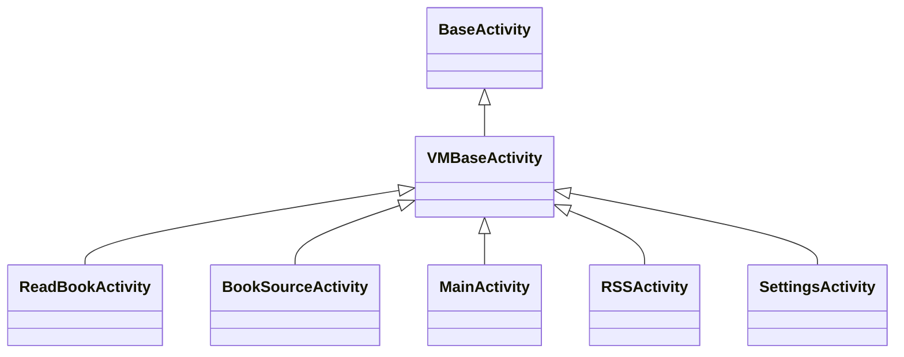
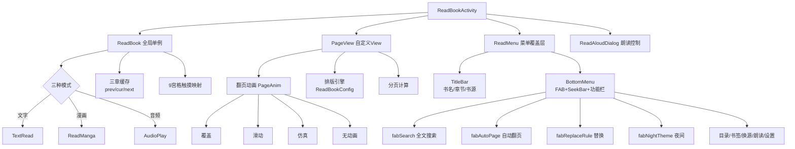
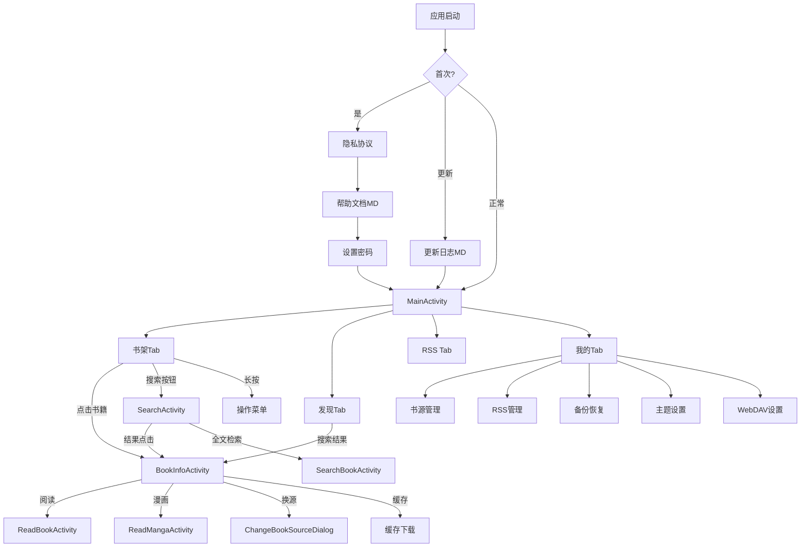
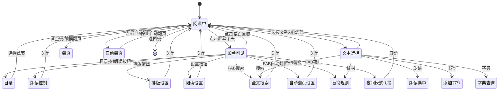
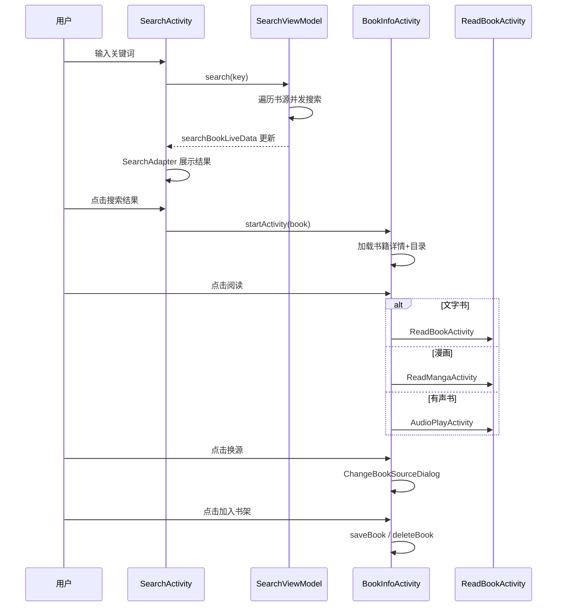

# Android UI 层架构

> **核心问题**：200+ 个 Activity/Fragment/Widget 如何组织？导航链路怎样流转？
> **答案**：MainActivity(ViewPager+底部Nav) → 四大TabFragment → 二级 Activity → 三级 Dialog。阅读界面为独立 Activity 全屏栈。

---

## 1. 主框架：MainActivity + 底部导航

```
MainActivity (VMBaseActivity)
├── ViewPager (offscreenPageLimit=3)
│   ├── Tab 0: BookshelfFragment1/2  — 书架（双样式切换）
│   ├── Tab 1: ExploreFragment       — 发现（可选隐藏）
│   ├── Tab 2: RssFragment           — RSS订阅（可选隐藏）
│   └── Tab 3: MyFragment            — 我的配置
└── BottomNavigationView
    ├── menu_bookshelf
    ├── menu_discovery (AppConfig.showDiscovery 控制显隐)
    ├── menu_rss       (AppConfig.showRSS 控制显隐)
    └── menu_my_config
```

### 关键设计决策

| 决策 | 位置 | 说明 |
|------|------|------|
| ViewPager + FragmentStatePagerAdapter | [MainActivity.kt:L441](file:///f:/myself/github/WeAgentChat/temp/legado/app/src/main/java/io/legado/app/ui/main/MainActivity.kt#L441) | `BEHAVIOR_RESUME_ONLY_CURRENT_FRAGMENT`，非当前 Fragment 不 resume |
| 书架双样式切换 | [MainActivity.kt:L424-L429](file:///f:/myself/github/WeAgentChat/temp/legado/app/src/main/java/io/legado/app/ui/main/MainActivity.kt#L424) | `AppConfig.bookGroupStyle == 1 ? BookshelfFragment2 : BookshelfFragment1` |
| 底部菜单动态显示 | [MainActivity.kt:L386-L406](file:///f:/myself/github/WeAgentChat/temp/legado/app/src/main/java/io/legado/app/ui/main/MainActivity.kt#L386) | `showDiscovery/showRSS` 控制 "发现"/"RSS" Tab 可见性 |
| 默认首页 | [MainActivity.kt:L408-L421](file:///f:/myself/github/WeAgentChat/temp/legado/app/src/main/java/io/legado/app/ui/main/MainActivity.kt#L408) | `AppConfig.defaultHomePage` 支持 bookshelf/explore/rss/my |
| 双击退出 | [MainActivity.kt:L101-L121](file:///f:/myself/github/WeAgentChat/temp/legado/app/src/main/java/io/legado/app/ui/main/MainActivity.kt#L101) | 2000ms 内双击返回退出；若朗读暂停则直接 finish，否则 moveTaskToBack |
| 书架重复点击回顶 | [MainActivity.kt:L172-L189](file:///f:/myself/github/WeAgentChat/temp/legado/app/src/main/java/io/legado/app/ui/main/MainActivity.kt#L172) | 300ms 内再次选中 → `gotoTop()` |

### 启动流程

[MainActivity.kt:L124-L153](file:///f:/myself/github/WeAgentChat/temp/legado/app/src/main/java/io/legado/app/ui/main/MainActivity.kt#L124)
```
onPostCreate
    ├── privacyPolicy()          — 隐私协议确认
    ├── upVersion()              — 版本更新检查/帮助文档
    ├── setLocalPassword()       — 首次设置本地密码
    ├── notifyAppCrash()         — 崩溃日志通知
    ├── backupSync()             — WebDAV 备份同步
    ├── viewModel.ruleSubsUp()   — 延迟1s自动更新书源
    ├── viewModel.upAllBookToc() — 延迟2s自动更新书籍目录
    └── viewModel.postLoad()     — 延迟3s后台加载
```

---

## 2. 活动（Activity）体系

### 书架模块

| Activity | 文件 | 功能 |
|----------|------|------|
| MainActivity | `ui/main/MainActivity.kt` | 主界面容器 |
| BookInfoActivity | `ui/book/info/BookInfoActivity.kt` | 书籍详情：信息/目录/书源管理 |
| BookChangeSourceActivity | `ui/book/change/BookChangeSourceActivity.kt` | 换源界面 |
| ImportBookActivity | `ui/book/import/local/ImportBookActivity.kt` | 本地书导入 |
| ImportBookWebActivity | `ui/book/import/web/ImportBookWebActivity.kt` | 网络书导入 |

### 阅读模块

| Activity | 文件 | 功能 |
|----------|------|------|
| BaseReadBookActivity | `ui/book/read/BaseReadBookActivity.kt` | 阅读抽象基类，负责屏幕方向/刘海适配/亮屏/翻页动画/按键翻页等通用功能 |
| ReadBookActivity | `ui/book/read/ReadBookActivity.kt` | 文字阅读核心，全屏沉浸式，16个接口实现 |
| ReadMangaActivity | `ui/book/read/ReadMangaActivity.kt` | 漫画阅读 |
| ReadAloudActivity | `ui/book/read/ReadAloudActivity.kt` | 朗读控制面板 |

### 搜索/发现模块

| Activity | 文件 | 功能 |
|----------|------|------|
| SearchActivity | `ui/book/search/SearchActivity.kt` | 搜索入口 + 搜索结果展示 |
| SearchBookActivity | `ui/book/searchContent/SearchBookActivity.kt` | 全文检索 |
| ExploreActivity | `ui/book/explore/ExploreActivity.kt` | 发现详情 |

### 书源/RSS 管理

| Activity | 文件 | 功能 |
|----------|------|------|
| BookSourceActivity | `ui/book/source/manage/BookSourceActivity.kt` | 书源列表管理 |
| BookSourceEditActivity | `ui/book/source/edit/BookSourceEditActivity.kt` | 书源可视化编辑 |
| RssSourceActivity | `ui/rss/source/manage/RssSourceActivity.kt` | RSS 源管理 |
| RssSourceEditActivity | `ui/rss/source/edit/RssSourceEditActivity.kt` | RSS 源编辑 |
| RssArticlesActivity | `ui/rss/article/RssArticlesActivity.kt` | RSS 文章列表容器 |
| RssSortActivity | `ui/rss/article/RssSortActivity.kt` | RSS 多源分组排序 |
| ReadRssActivity | `ui/rss/read/ReadRssActivity.kt` | RSS 文章阅读（WebView + JS注入） |
| RssFavoritesActivity | `ui/rss/favorites/RssFavoritesActivity.kt` | RSS 收藏文章 |
| RuleSubActivity | `ui/rss/subscription/RuleSubActivity.kt` | RSS 规则订阅入口 |

### 配置/替换/工具

| Activity | 文件 | 功能 |
|----------|------|------|
| ConfigActivity | `ui/config/ConfigActivity.kt` | 全局设置 |
| ReplaceRuleActivity | `ui/replace/ReplaceRuleActivity.kt` | 替换规则管理 |
| DictRuleActivity | `ui/dict/DictRuleActivity.kt` | 字典规则 |
| TTSEditActivity | `ui/tts/TTSEditActivity.kt` | TTS 配置编辑 |
| FileManageActivity | `ui/file/FileManageActivity.kt` | 文件管理 |

### 辅助模块

| Activity | 文件 | 功能 |
|----------|------|------|
| LoginActivity | `ui/login/LoginActivity.kt` | 登录/密码验证 |
| FontActivity | `ui/font/FontActivity.kt` | 字体管理 |
| AboutActivity | `ui/about/AboutActivity.kt` | 关于页面 |
| QrCodeActivity | `ui/qrcode/QrCodeActivity.kt` | 二维码/文件传输 |
| BrowserActivity | `ui/browser/BrowserActivity.kt` | 内置浏览器 |
| CodeActivity | `ui/code/CodeActivity.kt` | 代码编辑器 |
| CacheActivity | `ui/cache/CacheActivity.kt` | 缓存管理 |
| AssociationActivity | `ui/association/AssociationActivity.kt` | 关联导入(书源/RSS/替换) |
| VideoPlayActivity | `ui/video/VideoPlayActivity.kt` | 视频播放 |

---

## 3. Fragment 体系

### 书架 Fragment

```
BaseBookshelfFragment              — 书架基类（排序/分组/长按菜单/拖拽）
├── BookshelfFragment1             — 样式1：普通列表/网格
└── BookshelfFragment2             — 样式2：按分组折叠展示
```

核心行为：
- 长按书籍 → 弹出操作菜单（置顶/删除/换源/详情/缓存/导出）
- 下拉刷新 → 触发搜索线程池更新所有已收藏书籍
- 分组拖拽 → DragSortRecyclerView 实现
- 排序模式：按更新时间/按书名/按作者/按阅读进度/自定义排序

### 我的 (MyFragment)

展示配置入口：
- 书源管理 / RSS管理 / 替换规则
- 备份与恢复 / WebDAV 设置
- 主题设置 / 阅读设置 / TTS 设置
- 缓存与下载管理 / 关于

### RSS 文章流 (RssArticlesFragment + 5种Adapter)

**文件**：[RssArticlesFragment.kt](file:///f:/myself/github/WeAgentChat/temp/legado/app/src/main/java/io/legado/app/ui/rss/article/RssArticlesFragment.kt)

RSS 文章流是仅次于书架的第二复杂 Fragment，支持 5 种文章展示样式：

| Adapter | 样式 | 布局 |
|---------|------|------|
| `BaseRssArticlesAdapter<VB>` | 抽象基类 | 继承 `RecyclerAdapter<RssArticle, VB>` |
| `RssArticlesAdapter` (样式0) | 列表+缩略图 | LinearLayoutManager |
| `RssArticlesAdapter2` (样式2) | 网格2列 | GridLayoutManager(span=2) |
| `RssArticlesAdapter3` (样式3) | 瀑布流 | StaggeredGridLayoutManager(横屏3列/竖屏2列) |
| `RssArticlesAdapter4` (样式4) | 网格3列 | GridLayoutManager(span=3) |

核心功能：
- `sortName/sortUrl/searchKey` 通过 Bundle 传入，Room Flow `flowByOriginSort()` 监听数据变化
- DiffUtil 按 `link` 判断同一项，`title/image/read` 判断内容变化
- `isPreload=true` 时所有页面在后台加载，支持分页加载 `scrollToBottom() → loadMore()`
- 点击文章 → `ReadRssActivity`（WebView + JS注入，支持黑白名单过滤/Cookie管理/全屏视频/朗读）

**ReadRssActivity** ([ReadRssActivity.kt](file:///f:/myself/github/WeAgentChat/temp/legado/app/src/main/java/io/legado/app/ui/rss/read/ReadRssActivity.kt))：
- WebView 池化复用（`WebViewPool.acquire(this)`）
- JS 接口注入（java/source/cache 对象）供书源规则使用
- `shouldInterceptRequest` 实现 preloadJs 注入和黑白名单 URL 过滤
- 返回键智能处理：全屏→WebView历史栈后退（跳过多刷新页）→退出

---

## 4. Widget 自定义控件体系

`ui/widget/` 下 30+ 自定义控件，核心分类：

| 类别 | 控件 | 用途 |
|------|------|------|
| **对话框** | `WaitDialog` / `TextDialog` / `RequestDialog` / `ModifyDialog` | 等待/文本展示/请求确认/修改 |
| **文本** | `BadgeView` / `UnderLineTextView` / `ExplosionTextView` | 角标/下划线/展开文本 |
| **图片** | `CoverImageView` / `PhotoView` / `RoundedRectImageView` | 封面/图片查看/圆角图 |
| **进度/滑块** | `VerticalSeekBar` / `NumberPicker` / `TouchSeekBar` | 垂直滑动条/数字选择/触控滑块 |
| **列表** | `FastScroller` / `DragSortRecyclerView` / `SwipeRecyclerView` | 快速滚动/拖拽排序/侧滑 |
| **弹窗** | `BottomDialog` / `BottomMenu` / `SourceEditDialog` | 底部弹窗/菜单/书源编辑 |
| **复选框** | `SmoothCheckBox` | 动画复选框 |
| **导航** | `PageNumberView` / `BatteryView` | 页码显示/电池电量 |
| **输入** | `CodeEditor` / `FontPicker` | 代码编辑器/字体选择 |
| **WebView** | `AndroidBug5497Workaround` / `WebDialog` | WebView 键盘修复/网页弹窗 |

---

## 5. Theme & 主题系统

```
ThemeConfig.getTheme()
├── EInk 模式  (AppConfig.isEInkMode → themeMode == "3")
├── Dark 深色   (AppConfig.isNightTheme → themeMode == "2")
└── Light 浅色  (默认/跟随系统 → themeMode == "0" or "1")
```

主题切换流程：[ThemeConfig.kt:L69-L73](file:///f:/myself/github/WeAgentChat/temp/legado/app/src/main/java/io/legado/app/help/config/ThemeConfig.kt#L69)
```
applyDayNight()
├── applyTheme()         — 切换 ThemeStore 主题
├── initNightMode()      — AppCompatDelegate 日夜间
├── BookCover.upDefaultCover() — 更新默认封面
└── postEvent(RECREATE)  — 通知 MainActivity 重建
```

**EInk 模式特殊处理**：
- 所有动画禁用 / elevation = 0
- BottomNavigationView 使用特殊底边框 drawable
- 界面极简化，去除阴影和过渡动画

---

## 6. Base 基类体系



```
BaseActivity             — 最基础 Activity（Lifecycle + CoroutineScope）
├── VMBaseActivity<B,VM> — ViewBinding + ViewModel 泛型封装
│   ├── MainActivity
│   ├── BaseReadBookActivity  — 阅读抽象基类（屏幕方向/刘海适配/亮屏/翻页动画）
│   │   ├── ReadBookActivity  — 文字阅读核心，全屏沉浸式
│   │   └── ReadMangaActivity — 漫画阅读
│   └── ...
└── ...
```

`VMBaseActivity` 提供：
- `val binding` — 自动 ViewBinding 绑定
- `val viewModel` — 自动 ViewModel 懒加载
- `observeLiveBus()` — LiveData/EventBus 观察注册点

---

## 7. 阅读界面架构 (VMBaseActivity → BaseReadBookActivity → ReadBookActivity)

阅读界面是项目中最复杂的 Activity，通过 BaseReadBookActivity 抽象基类（负责屏幕方向设置/刘海屏适配/亮屏控制/翻页动画选择/按键翻页等通用阅读功能）统一管理文字阅读和漫画阅读的公共行为：

```
ReadBookActivity
├── ReadBook (全局单例, model/)
│   ├── 三种模式: 文字/漫画/音频  (ReadBook/ReadManga/AudioPlay)
│   ├── 三章缓存: prevChapter / curChapter / nextChapter
│   └── 触摸事件 → 9宫格区域映射 clickActionTL/TC/TR/ML/MC/MR/BL/BC/BR
├── PageView (自定义 View)
│   ├── 翻页动画: PageAnim 枚举 (覆盖/滑动/仿真/无)
│   ├── 排版引擎: ReadBookConfig.Config (行距/段距/字体/背景/页边距)
│   └── 分页计算: 基于屏幕尺寸 + Config 实时计算
├── ReadMenu (顶部/底部弹出菜单)
│   ├── 目录/书签/换源/朗读/设置/缓存/下载
│   └── 亮度调节/字体缩放/翻页动画切换
└── ReadAloudDialog (朗读控制浮窗)
```



**9宫格触摸区域**：[AppConfig.kt:L38-L46](file:///f:/myself/github/WeAgentChat/temp/legado/app/src/main/java/io/legado/app/help/config/AppConfig.kt#L38)
```
┌─────────┬─────────┬─────────┐
│ clickTL │ clickTC │ clickTR │   0=菜单  1=下一页  2=上一页
├─────────┼─────────┼─────────┤   可自定义每个区域行为
│ clickML │ clickMC │ clickMR │   若全部设为非0则自动恢复中间区域为菜单
├─────────┼─────────┼─────────┤
│ clickBL │ clickBC │ clickBR │
└─────────┴─────────┴─────────┘
```

---

## 8. 导航链路总览

```
应用启动
    │
    ├── 首次启动 → 隐私协议 → 帮助文档(MD) → 设置密码 → MainActivity
    ├── 版本更新 → 更新日志(MD) → MainActivity
    └── 正常启动 → MainActivity
                        │
        ┌───────────────┼───────────────────┐
        ▼               ▼                   ▼
    书架Tab         发现Tab             我的Tab
    │               │                   │
    ├─点击书籍       ├─搜索结果           ├─书源管理
    │  └─BookInfo   │  └─BookInfo      ├─RSS管理
    │     ├─开始阅读  │     └─ReadBook   ├─替换规则
    │     │  └─ReadBookActivity        ├─备份恢复
    │     ├─换源                        ├─主题设置
    │     ├─缓存                        ├─WebDAV
    │     └─导出                        └─...
    ├─长按书籍 → 操作菜单
    ├─下拉刷新 → 全局更新
    └─搜索按钮 → SearchActivity
                     │
                     ├─搜索结果 → BookInfo → ReadBook
                     ├─全文检索 → SearchBookActivity
                     └─发现详情 → ExploreActivity
```



---

## 9. 核心页面布局与交互详解

### 9.1 书架页面 (BookshelfFragment1/2)

**布局**：
```
+-------------------------------------------+
| TitleBar (搜索按钮/排序/更多)               |
+-------------------------------------------+
|                                            |
| SwipeRefreshLayout                         |
|  +-- RecyclerView                          |
|       样式1: GridLayoutManager(3列)        |
|       样式2: 分组折叠 + GridLayoutManager  |
|                                            |
+-------------------------------------------+
```

**状态变量**：
| 变量 | 类型 | 用途 |
|------|------|------|
| books | List<Book> | 当前书籍列表 |
| sort | Int | 排序模式 |
| isSearch | Boolean | 是否搜索模式 |

**交互**：长按→操作菜单(置顶/删除/换源/详情/缓存/导出)；下拉刷新→全局搜索更新；分组拖拽→DragSortRecyclerView

### 9.2 搜索页面 (SearchActivity)

**布局**：
```
+-------------------------------------------+
|  TitleBar + SearchView                     |
+-------------------------------------------+
|  RefreshProgressBar                        |
+-------------------------------------------+
|  A) 搜索结果: RecyclerView + SearchAdapter |
|  B) 输入帮助:                              |
|     书架书籍(FlexboxLayout+BookAdapter)    |
|     搜索历史(FlexboxLayout+HistoryKeyAdapter)|
+-------------------------------------------+
|  FAB (搜索开始/停止)                       |
+-------------------------------------------+
```

**状态变量**：
| 变量 | 类型 | 用途 |
|------|------|------|
| groups | List<String>? | 书源分组 |
| isManualStopSearch | Boolean | 是否手动停止 |
| precisionSearchMenuItem | MenuItem? | 精准搜索 |

**ViewModel LiveData**：
| LiveData | 用途 |
|----------|------|
| isSearchLiveData | 搜索进行中 |
| searchBookLiveData | 搜索结果 |
| upAdapterLiveData | Adapter局部刷新 |
| searchFinishLiveData | 搜索结束 |
| searchScope.stateLiveData | 搜索范围 |

**交互流程**：
1. SearchView提交 → viewModel.search(key)
2. 搜索文本变化 → stop() + upHistory(newText)
3. 搜索范围选择 → menu_group_1/2 → searchScope.update/remove
4. FAB → 搜索中stop(); 未搜索search("")
5. 结果点击 → BookInfoActivity
6. 历史关键字点击 → 直接搜索或补全
7. 滚动到底部 → 自动加载更多

### 9.3 书籍详情页面 (BookInfoActivity)

**布局**：
```
+-------------------------------------------+
|  bg_book (模糊封面背景)                    |
|  +-- vw_bg (半透明遮罩)                    |
|  |   +-- TitleBar (Dark主题)               |
|  |   +-- SwipeRefreshLayout                |
|  |       +-- NestedScrollView              |
|  |           ArcView (弧形顶部)            |
|  |           CardView > CoverImageView     |
|  |           tv_name (书名,居中)            |
|  |           lb_kind (分类标签)             |
|  |           tv_author / tv_origin         |
|  |           tv_lasted (最新章)             |
|  |           tv_group (分组)               |
|  |           tv_toc (目录进度)              |
|  |           tv_intro_container (简介)     |
|  +-- fl_action (底部操作)                  |
|      [tv_shelf: 加入/移出书架]             |
|      [tv_read: 阅读]                       |
+-------------------------------------------+
```

**状态变量**：
| 变量 | 类型 | 用途 |
|------|------|------|
| chapterChanged | Boolean | 章节变更 |
| pooledWebView | PooledWebView? | WebView池 |
| initIntroView | Boolean | 简介是否初始化 |

**ViewModel LiveData**：
| LiveData | 用途 |
|----------|------|
| bookData | 当前书籍 |
| chapterListData | 章节列表 |
| waitDialogData | 等待对话框 |
| actionLive | 操作指令 |

**交互**：
- tvRead → 按bookType分发AudioPlay/VideoPlayer/ReadManga/ReadBook
- tvShelf → 已加入:删除确认; 未加入:添加书架
- tvChangeSource → ChangeBookSourceDialog
- ivCover click → ChangeCoverDialog; long → PhotoDialog
- 简介支持四种模式: `<useweb>`/`<usehtml>`/`<md>`/纯文本

**菜单**：16项(menu_custom_btn, menu_edit, menu_share_it, menu_refresh, menu_login, menu_top, menu_set_source_variable, menu_set_book_variable, menu_copy_book_url, menu_copy_toc_url, menu_can_update, menu_clear_cache, menu_log, menu_split_long_chapter, menu_delete_alert, menu_upload)

### 9.4 阅读界面 (ReadBookActivity)

**布局**：
```
FrameLayout
 +-- ReadView (全屏阅读视图, 自定义View)
 +-- View (text_menu_position, 不可见锚点)
 +-- ImageView (cursor_left, 文本选择左光标)
 +-- ImageView (cursor_right, 文本选择右光标)
 +-- ReadMenu (阅读菜单覆盖层, 默认gone)
 |    +-- vwMenuBg (点击关闭菜单背景)
 |    +-- TitleBar (书名/章节名/书源操作/自定义按钮)
 |    +-- bottomMenu (ConstraintLayout)
 |         +-- fabSearch / fabAutoPage / fabReplaceRule / fabNightTheme
 |         +-- tvPre / tvNext (上一章/下一章)
 |         +-- seekReadPage (进度SeekBar)
 |         +-- llCatalog / llReadAloud / llFont / llSetting
 |         +-- llBrightness (亮度控制条)
 +-- SearchMenu (全文搜索菜单, 默认gone)
 +-- View (navigation_bar, 底部导航栏占位)
```

**状态变量**：
| 变量 | 类型 | 用途 |
|------|------|------|
| isInitFinish | Boolean | 数据初始化完成 |
| menuLayoutIsVisible | Boolean | 菜单可见 |
| isAutoPage | Boolean | 自动翻页 |
| isScroll | Boolean | 滚动模式 |
| isShowingSearchResult | Boolean | 全文搜索结果模式 |
| isSelectingSearchResult | Boolean | 选择搜索结果 |
| bookChanged | Boolean | 书籍变更 |
| pageChanged | Boolean | 页面变更 |
| confirmRestoreProcess | Boolean? | 恢复进度确认 |
| searchContentQuery | String | 搜索关键词 |
| searchResultList | List<SearchResult>? | 搜索结果 |
| searchResultIndex | Int | 当前搜索索引 |

**翻页交互 (5种)**：
1. 触摸翻页: ReadView.OnTouchEvent → pageDelegate.turnPage()
2. 音量键: VOLUME_UP/DOWN → volumeKeyPage()
3. 键盘: PAGE_UP/DOWN/SPACE → handleKeyPage()
4. 鼠标滚轮: SCROLL → mouseWheelPage()
5. 自动翻页: autoPage() → readView.autoPager.start()

**菜单显示/隐藏**：
点击屏幕中央 → showActionMenu()
  → 朗读中 → showReadAloudDialog()
  → 自动翻页 → AutoReadDialog
  → 全文搜索中 → searchMenu.runMenuIn()
  → 否则 → readMenu.runMenuIn() (TitleBar下滑 + 底栏上滑)

**文本选择交互**：
长按文字 → ContentTextView选中 → cursorLeft/cursorRight显示
拖拽光标 → selectStartMove/selectEndMove
松手 → TextActionMenu (朗读/书签/替换/全文搜索/字典)

**事件总线观察**：
- TIME_CHANGED / BATTERY_CHANGED → 更新时间/电量
- UP_CONFIG(array) → 更新配置(0=系统UI, 1=背景, 2=样式, 3=透明度, 4=翻页灵敏度, 5=重载内容, 6=更新内容...)
- ALOUD_STATE → 朗读状态变化
- TTS_PROGRESS → TTS进度
- SEARCH_RESULT → 搜索结果
- REFRESH_BOOK_CONTENT / REFRESH_BOOK_TOC → JS触发刷新

### 9.5 书源管理页面 (BookSourceActivity)

**布局**：
```
+-------------------------------------------+
|  TitleBar + SearchView                     |
+-------------------------------------------+
|  FastScrollRecyclerView                    |
|    LinearLayoutManager                     |
|    BookSourceAdapter                       |
|    DragSelectTouchHelper (滑动多选)        |
|    ItemTouchHelper (拖拽排序)              |
+-------------------------------------------+
|  SelectActionBar                           |
|  [全选/反选] [删除] [启用/禁用/校验/...]   |
+-------------------------------------------+
```

**状态变量**：
| 变量 | 类型 | 用途 |
|------|------|------|
| sort | BookSourceSort | 排序模式(Default/Weight/Name/Url/Update/Respond/Enable) |
| sortAscending | Boolean | 升序/降序 |
| groups | LinkedHashSet<String> | 书源分组 |
| groupSourcesByDomain | Boolean | 按域名分组 |
| snackBar | Snackbar? | 校验提示 |

**搜索关键字**：支持"启用/禁用/需登录/无分组/启用发现/禁用发现/group:xxx"

**批量操作**：启用/禁用/发现/校验/置顶/置底/加分组/移分组/导出/分享

### 9.6 书源编辑页面 (BookSourceEditActivity)

**布局**：
```
+-------------------------------------------+
|  TitleBar ("编辑书源")                     |
+-------------------------------------------+
|  HorizontalScrollView (配置行)             |
|  [Spinner:类型] [启用] [发现] [Cookie]     |
|  [事件监听] [自定义按钮]                   |
+-------------------------------------------+
|  TabLayout (6个Tab)                        |
|  [基本] [搜索] [发现] [详情] [目录] [正文] |
+-------------------------------------------+
|  RecyclerView (动态EditEntity列表)          |
+-------------------------------------------+
```

**6个Tab编辑项**：
| Tab | 编辑项数 | 关键字段 |
|-----|---------|---------|
| 基本 | 13 | bookSourceUrl, bookSourceName, bookSourceGroup, loginUrl, loginUi, loginCheckJs, coverDecodeJs, bookUrlPattern, header, variableComment, concurrentRate, jsLib |
| 搜索 | 11 | searchUrl, checkKeyWord, bookList, name, author, kind, wordCount, lastChapter, intro, coverUrl, bookUrl |
| 发现 | 10 | exploreUrl, bookList, name, author, kind, wordCount, lastChapter, intro, coverUrl, bookUrl |
| 详情 | 11 | init, name, author, kind, wordCount, lastChapter, intro, coverUrl, tocUrl, canReName, downloadUrls |
| 目录 | 10 | preUpdateJs, chapterList, chapterName, chapterUrl, formatJs, isVolume, updateTime, isVip, isPay, nextTocUrl |
| 正文 | 11 | content, nextContentUrl, subContent, replaceRegex, title, sourceRegex, imageStyle, imageDecode, webJs, payAction, callBackJs |

**交互**：Tab切换→RecyclerView的EditEntity切换；保存→getSource()收集→viewModel.save()；调试→先保存→BookSourceDebugActivity；全屏编辑→CodeEditActivity；键盘工具→KeyboardToolPop(URL参数/教程/正则/文件)

### 9.7 RSS订阅源页面 (RssSortActivity)

**布局**：
```
+-------------------------------------------+
|  TitleBar                                  |
+-------------------------------------------+
|  LinearLayout (tabs_container, 动态多行标签)|
|  每行: HorizontalScrollView > TextView标签  |
|  (<=10:1行, <=20:2行, >20:3行)            |
+-------------------------------------------+
|  ViewPager                                 |
|  +-- RssArticlesFragment (每分类一个)      |
+-------------------------------------------+
```

**5种文章样式**：
| style | Adapter | LayoutManager | 说明 |
|-------|---------|---------------|------|
| 0 | RssArticlesAdapter | LinearLayoutManager | 标题+日期(左) + 缩略图(右110x68) |
| 1 | RssArticlesAdapter1 | LinearLayoutManager | 大图(220dp高) + 标题 + 日期 |
| 2 | RssArticlesAdapter2 | GridLayoutManager(2列) | 双列卡片 |
| 3 | RssArticlesAdapter3 | StaggeredGridLayoutManager(竖2/横3) | 瀑布流CardView |
| 4 | RssArticlesAdapter4 | GridLayoutManager(3列) | 三列紧凑 |

切换：菜单 menu_switch_layout → articleStyle循环0→1→2→3→4→0

### 9.8 RSS文章阅读页面 (ReadRssActivity)

**布局**：
```
FrameLayout
 +-- ConstraintLayout (主视图)
 |    +-- TitleBar
 |    +-- FrameLayout (web_view_container, WebView)
 |    +-- RefreshProgressBar (1dp进度条)
 +-- FrameLayout (custom_web_view, 全屏视频)
```

**内容加载三路分发**：
1. 有link+有description → contentLiveData → loadDataWithBaseURL
2. 有link+有ruleContent → Rss.getContent() → contentLiveData
3. 有link+无ruleContent → urlLiveData → loadUrl
4. 有startHtml → htmlLiveData → loadDataWithBaseURL

**WebView交互**：长按图片→保存；URL跳转→shouldOverrideUrlLoading JS；黑白名单→shouldInterceptRequest过滤；JS注入→preloadJs；全屏视频→customWebView覆盖

**返回导航**：全屏→关闭视频；WebView可后退→智能计算后退步数(跳过刷新重复)；无法后退→finish()

### 9.9 配置页面 (ConfigActivity)

**布局**：简单容器，通过configTag动态加载Fragment

**Fragment路由表**：
| configTag | Fragment | 功能 |
|-----------|----------|------|
| OTHER_CONFIG | OtherConfigFragment | 其他设置 |
| THEME_CONFIG | ThemeConfigFragment | 主题设置 |
| BACKUP_CONFIG | BackupConfigFragment | 备份设置 |
| COVER_CONFIG | CoverConfigFragment | 封面设置 |
| WELCOME_CONFIG | WelcomeConfigFragment | 欢迎页设置 |

### 9.10 换源对话框 (ChangeBookSourceDialog)

**布局**：
```
+-------------------------------------------+
|  Toolbar (书名/作者 + 菜单)                |
+-------------------------------------------+
|  RefreshProgressBar                        |
+-------------------------------------------+
|  FastScrollRecyclerView                    |
|    ChangeBookSourceAdapter                 |
+-------------------------------------------+
|  ll_bottom_bar                             |
|  [当前源/进度] [跳顶部] [跳底部]          |
+-------------------------------------------+
```

**交互**：换源→changeTo()→类型确认→viewModel.getToc()→callBack.changeTo()；搜索控制→startOrStopSearch()；分组切换→AppConfig.searchGroup变更；滚动定位→scrollToDurSource()

---

## 10. 页面交互流程图

### 10.1 阅读界面状态流转

```
[阅读中]
  │
  ├── 点击屏幕中央 ─→ [菜单可见]
  │     ├── TitleBar: 书名/章节/书源操作/自定义按钮
  │     ├── 目录 → TocDialog
  │     ├── 朗读 → ReadAloudDialog
  │     ├── 排版 → ReadStyleDialog
  │     ├── 设置 → ReadBookConfigFragment
  │     ├── FAB搜索 → SearchMenu
  │     ├── FAB自动翻页 → AutoReadDialog
  │     ├── FAB替换 → ReplaceRuleDialog
  │     ├── FAB夜间 → 切换夜间模式
  │     └── 点击空白 → 返回[阅读中]
  │
  ├── 长按文字 ─→ [文本选择]
  │     ├── 朗读选中
  │     ├── 添加书签
  │     ├── 替换规则
  │     ├── 全文搜索
  │     └── 字典查询
  │
  ├── 音量键 ─→ 翻页
  ├── 自动翻页 ─→ 定时翻页
  └── 返回键 ─→ finish()
```



### 10.2 搜索→详情→阅读 完整流程

```
SearchActivity
  │
  ├── 输入关键词 → 搜索 → searchBookLiveData
  │     ├── 结果点击 → BookInfoActivity
  │     │     ├── tvRead → ReadBookActivity / ReadMangaActivity / AudioPlayActivity
  │     │     ├── tvShelf → 加入/移出书架
  │     │     ├── tvChangeSource → ChangeBookSourceDialog
  │     │     └── ivCover → ChangeCoverDialog
  │     │
  │     └── 长按结果 → 快速加入书架
  │
  └── 搜索范围 → menu_group → 分组筛选
```



---

## 11. 排版引擎架构（TextChapterLayout）

阅读界面的排版引擎是项目中最复杂的子系统，负责将原始章节文本排版为可分页、可翻页的 `TextChapter` 数据结构。

### 11.1 整体架构

```
ChapterProvider (object单例，全局排版参数)
  ├── titlePaint / contentPaint / reviewPaint — 全局画笔
  ├── viewWidth / viewHeight / padding* / visible* — 绘制区域
  └── getTextChapterAsync() — 异步排版入口
        └── TextChapter.createLayout()
              └── TextChapterLayout — 核心排版引擎
                    ├── ZhLayout — 中文排版（禁则处理）
                    ├── TextPageFactory — 页面切换工厂
                    └── Column 体系 — 字符级精度实体
```

### 11.2 核心排版流程

[TextChapterLayout.kt:L212-L510](file:///f:/myself/github/WeAgentChat/temp/legado/app/src/main/java/io/legado/app/ui/book/read/page/provider/TextChapterLayout.kt#L212)

```
getTextChapter() 三阶段:
  阶段一: 标题排版 (L222-L322)
    displayTitle.splitNotBlank("\n") → 逐行 setTypeText(isTitle=true)
    → 单图模式强制分页 prepareNextPageIfNeed()

  阶段二: 正文排版 (L329-L494)
    遍历 bookContent.textList:
      ├── [newpage] → 分页
      ├── <usehtml> → setTypeHtml()
      ├── 图片样式: img标签 → srcReplaceStr占位 → setTypeText(带srcList)
      └── 段尾标记: pendingTextPage.lines.last().isParagraphEnd = true

  阶段三: 收尾 (L495-L510)
    wordCount统计 → 最后一页endPadding(20dp) → onPageCompleted() → onCompleted()
```

### 11.3 文字排版核心：setTypeText()

[TextChapterLayout.kt:L899-L1027](file:///f:/myself/github/WeAgentChat/temp/legado/app/src/main/java/io/legado/app/ui/book/read/page/provider/TextChapterLayout.kt#L899)

```
1. textPaint.getTextWidthsCompat() — 逐字宽度
2. useZhLayout=true → ZhLayout（中文排版）| false → StaticLayout（Android原生）
3. 逐行生成 TextLine:
   ├── 行0(首行): addCharsToLineFirst() — 首行缩进+两端对齐
   ├── 末行/单行: addCharsToLineNatural() — 自然排列(标题居中)
   └── 中间行: addCharsToLineMiddle() — 两端对齐
4. prepareNextPageIfNeed() — 超页则分页
```

**对齐算法**：
- `addCharsToLineFirst()` (L1052): 首行缩进 + 剩余字符走中间行对齐
- `addCharsToLineMiddle()` (L1099): 多空格→扩展空格宽度；少空格→扩展字符间距
- `addCharsToLineNatural()` (L1167): 逐字符累加，不做额外间距扩展

### 11.4 分页算法

[TextChapterLayout.kt:L1269-L1295](file:///f:/myself/github/WeAgentChat/temp/legado/app/src/main/java/io/legado/app/ui/book/read/page/provider/TextChapterLayout.kt#L1269)

```
requestHeight > visibleHeight 时:
  双页模式+左列: textPage.leftLineSize=lineSize → 切换右列(absStartX=viewWidth/2+paddingLeft)
  否则(单页/右列结束):
    textPage.text → onPageCompleted() → 新建TextPage → absStartX重置
  durY = 0f 重置
```

### 11.5 中文排版（ZhLayout）

[ZhLayout.kt:L16-L277](file:///f:/myself/github/WeAgentChat/temp/legado/app/src/main/java/io/legado/app/ui/book/read/page/provider/ZhLayout.kt#L16)

继承 Android `Layout`，解决原生 `StaticLayout` 不处理中文禁则的问题。

**禁则标点集合**：
- 行尾禁标 `postPanc` (L25): 逗号、句号、问号、感叹号、右引号、右括号等
- 行首禁标 `prePanc` (L29): 左引号、左括号、左书名号等

**BreakMod 五种断行模式** (L43)：

| 模式 | 触发条件 | 动作 |
|------|---------|------|
| NORMAL | 无禁则冲突 | 当前字符移至下行 |
| BREAK_ONE_CHAR | 前一字符是禁首标点 | 当前行下移一个字 |
| BREAK_MORE_CHAR | reCheck回溯找到合法断点 | 当前行下移多个字 |
| CPS_1 | 两个连续禁尾标点 | 压缩至当前行不分下移 |
| CPS_2 | 禁首+禁首+字 | 压缩至当前行 |
| CPS_3 | 禁首+字+禁尾 | 压缩至当前行 |

### 11.6 Column（列）实体体系

```
BaseColumn (接口) — start/end X坐标 + draw() + isTouch()
├── TextBaseColumn (接口) — charData + selected + isSearchResult
│   ├── TextColumn — 普通文字列，使用全局Paint
│   └── TextHtmlColumn — HTML文字列，自带TextPaint(独立字号/字色/超链接)
├── ImageColumn — 图片URL+点击链接，通过ImageProvider获取Bitmap绘制
├── ReviewColumn — 评论按钮(气泡形)
└── ButtonColumn — 占位符
```

**设计要点**：每个 Column 对应一个字符（像素级 X 坐标区间 `[start, end)`）；双向引用 `TextLine ↔ BaseColumn`；`TextColumn.selected` setter 自动触发 `textLine.invalidate()`。

### 11.7 TextPageFactory 页面切换

[TextPageFactory.kt:L10-L160](file:///f:/myself/github/WeAgentChat/temp/legado/app/src/main/java/io/legado/app/ui/book/read/page/provider/TextPageFactory.kt#L10)

| 方法 | 逻辑 |
|------|------|
| `hasPrev()` | `hasPrevChapter() ∥ pageIndex > 0` |
| `hasNext()` | `hasNextChapter() ∥ currentChapter未到末页` |
| `moveToNext()` | 当前章末页→ReadBook.moveToNextChapter(); 否则→pageIndex+1 |
| `moveToPrev()` | 当前章首页→ReadBook.moveToPrevChapter(); 否则→pageIndex-1 |
| `curPage` | ReadBook.msg非空→消息页; 否则→currentChapter.getPage(pageIndex) |
| `nextPage` | 当前章下一页 → 下一章首页 |
| `prevPage` | 当前章上一页 → 上一章末页 |

---

## 12. 漫画阅读架构（ReadMangaActivity）

### 12.1 模块协作关系

```
ReadMangaActivity (856行, 6个回调接口)
    ├── ReadMangaViewModel → ReadManga(object单例, 全局状态)
    ├── MangaAdapter (两种VH: 章节边界+漫画图片页)
    ├── WebtoonRecyclerView (自定义滚动+缩放, 373行)
    ├── WebtoonFrame (手势分发容器, 126行)
    ├── ScrollTimer (自动翻页/滚动定时器, 75行)
    └── MangaLayoutManager (预加载 3/4屏幕高度)
```

### 12.2 核心数据流

```
ViewModel.initData() → ReadManga.resetData/upData → loadChapterList → loadContent()
ReadManga.mCallback.upContent() → Activity.upContent()
  → mAdapter.submitList(ReadManga.mangaContents) → 定位到pos → 更新底栏+SeekBar
```

**滚动位置追踪** (ReadMangaActivity L208-226)：
`WebtoonRecyclerView.setPreScrollListener` → `findCenterViewPosition()` → 比较 `chapterIndex` → 触发跨章加载

### 12.3 WebtoonRecyclerView 缩放系统

| 机制 | 行号 | 说明 |
|------|------|------|
| 缩放范围 | L25-35 | `currentScale` [0.5f, 3f]，`isZooming` 防冲突 |
| 缩放动画 | L112-141 | `AnimatorSet` X/Y平移+Scale，200ms DecelerateInterpolator |
| 双击缩放 | L244-255 | scaleX≠1f→缩回; =1f→放大2x |
| 捏合缩放 | L193-218 | `currentScale *= scaleFactor`，<MIN_RATE自动回弹 |
| 缩放拖拽 | L290-336 | `touchSlop` 判定 → `zoomScrollBy(dx, dy)` |
| Fling惯性 | L143-173 | `distanceTimeFactor=0.4f`，DecelerateInterpolator |
| 坐标约束 | L96-110 | 平移限制在 `halfWidth*(scale-1)` 范围 |

### 12.4 漫画配置

| 组件 | 职责 |
|------|------|
| MangaColorFilterDialog | ARGB 4x5 ColorMatrix 颜色滤镜 |
| MangaFooterSettingDialog | 底栏显示项配置 |
| MangaEpaperDialog | 墨水屏二值化阈值调节 |
| ScrollTimer | 连续滚动/自动翻页两种模式 |

---

## 13. 音频播放架构（AudioPlayActivity）

### 13.1 完整链路

```
AudioPlayActivity (417行)
    ├── AudioPlayViewModel → AudioPlay(object单例)
    │     ├── initData → resetData → loadOrUpPlayUrl
    │     ├── loadPlayUrl → WebBook.getContent → contentLoadFinish → play()/playNew()
    │     └── play/pause/resume/stop → startService<AudioPlayService>
    └── AudioPlayService (730行前台服务)
          ├── ExoPlayer 播放引擎
          ├── MediaSessionCompat 媒体会话
          ├── 音频焦点管理 (GAIN→恢复/LOSS→暂停/LOSS_TRANSIENT→暂停+标记)
          ├── WakeLock/WifiLock 保持
          ├── 通知栏媒体控制
          └── 进度上报 (500ms协程循环)
```

### 13.2 UI 状态同步（EventBus）

[AudioPlayActivity.kt:L367-L410](file:///f:/myself/github/WeAgentChat/temp/legado/app/src/main/java/io/legado/app/ui/book/audio/AudioPlayActivity.kt#L367)

| EventBus 事件 | UI 更新 |
|---------------|---------|
| AUDIO_STATE | 播放/暂停按钮图标 |
| AUDIO_SUB_TITLE | 章节标题 + 上/下一首启用 |
| AUDIO_SIZE | SeekBar max |
| AUDIO_PROGRESS | SeekBar progress |
| AUDIO_BUFFER_PROGRESS | secondaryProgress |
| AUDIO_SPEED | 速度标签显隐 |
| AUDIO_DS | 定时器显示 |

### 13.3 播放模式

`AudioPlay.playMode` (AudioPlay.kt L80-84): 4 种模式（列表循环/单曲循环/随机/顺序），`next()` 根据模式决定行为 (L340-381)。

### 13.4 音频焦点策略

[AudioPlayService.kt:L581-L614](file:///f:/myself/github/WeAgentChat/temp/legado/app/src/main/java/io/legado/app/service/AudioPlayService.kt#L581)

| 焦点变化 | 行为 |
|----------|------|
| AUDIOFOCUS_GAIN | 恢复播放 |
| AUDIOFOCUS_LOSS | 暂停 |
| AUDIOFOCUS_LOSS_TRANSIENT | 暂停 + `needResumeOnAudioFocusGain=true` |

`AppConfig.ignoreAudioFocus` 可忽略焦点变化。

---

## 14. Widget 自定义控件体系详解

`ui/widget/` 下 60 个 Kotlin 文件，10 个子目录，按功能域分类：

### 14.1 标题栏：TitleBar

[TitleBar.kt](file:///f:/myself/github/WeAgentChat/temp/legado/app/src/main/java/io/legado/app/ui/widget/TitleBar.kt)（280行）

AppBarLayout + Toolbar 封装，核心 API：
- `title/subtitle` 属性 (L41-55)
- `setColorFilter(color)` — 统一图标颜色滤镜 (L236-244)
- `fitStatusBar/fitNavigationBar` — WindowInsets 自适应 (L171-183)
- `attachToActivity` — 自动 `setSupportActionBar` (L271-278)
- EInk 模式：`bg_eink_border_bottom` 背景 (L184-186)

### 14.2 图片查看域

**PhotoView** [PhotoView.kt](file:///f:/myself/github/WeAgentChat/temp/legado/app/src/main/java/io/legado/app/ui/widget/image/PhotoView.kt)（1260行）

全功能图片查看器，三层 Matrix 架构 (L49-52)：
- `mBaseMatrix` — 基础定位
- `mAnimMatrix` — 动画变换
- `mSynthesisMatrix` — 合成结果

`Transform` 内部类 (L645-866): 五路 Scroller 并行驱动 (translate/scale/fling/rotate/clip)

| 交互 | 行号 | 机制 |
|------|------|------|
| 双击缩放 | L1204-1235 | `isZoonUp` 状态切换，计算缩放中心 |
| 捏合缩放 | L1238-1258 | `ScaleGestureListener` 实时 `postScale` |
| 旋转手势 | L1079-1096 | `RotateListener` + `mMinRotate=35` 阈值 |
| Fling惯性 | L1111-1144 | 双向 `OverScroller.fling` |
| 边界回弹 | L524-551 | 图片不可移出视口 |
| 入场/退场 | L973-1069 | `animaFrom/animaTo` + Clip 效果 |

**CoverImageView** [CoverImageView.kt](file:///f:/myself/github/WeAgentChat/temp/legado/app/src/main/java/io/legado/app/ui/widget/image/CoverImageView.kt)（362行）

- 4:3 宽高比锁定 (L84-91 `onMeasure`)
- 圆角裁剪 (L94-101 `ViewOutlineProvider` 12f radius)
- 无封面时生成文字封面 (L156-227): 书名竖排+作者竖排，`LruCache` 缓存
- Glide 加载 + `RequestListener` 失败触发文字封面 (L234-263)

### 14.3 列表交互域

**DragSelectTouchHelper** [DragSelectTouchHelper.kt](file:///f:/myself/github/WeAgentChat/temp/legado/app/src/main/java/io/legado/app/ui/widget/recycler/DragSelectTouchHelper.kt)（1001行）

- 四状态机 (L37-53): Normal → DragFromNormal / Slide → DragFromSlide
- `OnItemTouchListener` 拦截触摸 (L207-315)
- 自动滚动 (L657-698): 热点区域触发，速度与距离成比例
- `AdvanceCallback<T>` 六种选择模式 (L815-968)
- 支持 RTL (L735-737)

**FastScroller** [FastScroller.kt](file:///f:/myself/github/WeAgentChat/temp/legado/app/src/main/java/io/legado/app/ui/widget/recycler/scroller/FastScroller.kt)（549行）

三组件: `mBubbleView`(索引气泡) + `mHandleView`(拖拽手柄) + `mTrackView`(轨道)
- 自动隐藏/显示 (L455-491): 300ms 动画
- 气泡显隐 (L423-453): 100ms 动画
- 拖拽定位 (L293-338): 计算比例 → `setRecyclerViewPosition`
- `SectionIndexer` 接口提供分段文字 (L538-540)

### 14.4 对话框域

**BottomWebViewDialog** [BottomWebViewDialog.kt](file:///f:/myself/github/WeAgentChat/temp/legado/app/src/main/java/io/legado/app/ui/widget/dialog/BottomWebViewDialog.kt)（884行）

- `WebViewPool` 复用 WebView (L142-143)
- `Config` 数据类 (L662-711): 30+ 配置项
- JS 注入 (L812-837 `shouldInterceptRequest`): 拦截 nameUrl 请求替换为 preloadJs
- `WebJsExtensions` 注入 (L549-557): source/book/cache 等 JS 接口
- 长按保存图片 (L369-398)
- 全屏视频 (L718-738)
- 返回键智能导航 (L492-536): 跳过同 URL 连续页面

### 14.5 进度条域

**VerticalSeekBar** [VerticalSeekBar.kt](file:///f:/myself/github/WeAgentChat/temp/legado/app/src/main/java/io/legado/app/ui/widget/seekbar/VerticalSeekBar.kt)（346行）

- 两种旋转策略 (L82-87): `useViewRotation()`(API级) vs `TraditionalRotation`(Canvas旋转)
- Canvas 旋转 `onDraw` (L310-326): 90°顺时针或270°逆时针
- 反射调用 `setProgress(int, boolean)` (L256-282)
- 自动应用 accentColor tint (L59-61)

### 14.6 Widget 全景索引

| 功能域 | 控件 | 路径 | 行数 |
|--------|------|------|------|
| 标题栏 | TitleBar | `widget/TitleBar.kt` | 280 |
| 阴影布局 | ShadowLayout | `widget/ShadowLayout.kt` | 165 |
| 阅读信息栏 | ReaderInfoBarView | `widget/ReaderInfoBarView.kt` | 171 |
| 选择操作栏 | SelectActionBar | `widget/SelectActionBar.kt` | 117 |
| 搜索视图 | SearchView | `widget/SearchView.kt` | 100 |
| 电池 | BatteryView | `widget/BatteryView.kt` | 111 |
| 图片查看 | PhotoView | `widget/image/PhotoView.kt` | 1260 |
| 封面图 | CoverImageView | `widget/image/CoverImageView.kt` | 362 |
| 圆形图 | CircleImageView | `widget/image/CircleImageView.kt` | 377 |
| 圆角图 | FilletImageView | `widget/image/FilletImageView.kt` | 88 |
| 弧形视图 | ArcView | `widget/image/ArcView.kt` | 82 |
| 拖拽选择 | DragSelectTouchHelper | `widget/recycler/DragSelectTouchHelper.kt` | 1001 |
| 快速滚动 | FastScroller | `widget/recycler/scroller/FastScroller.kt` | 549 |
| WebView弹窗 | BottomWebViewDialog | `widget/dialog/BottomWebViewDialog.kt` | 884 |
| 垂直SeekBar | VerticalSeekBar | `widget/seekbar/VerticalSeekBar.kt` | 346 |
| 代码编辑 | CodeView | `widget/code/CodeView.kt` | 367 |
| 动画复选框 | SmoothCheckBox | `widget/checkbox/SmoothCheckBox.kt` | 307 |
| 旋转加载 | RotateLoading | `widget/anima/RotateLoading.kt` | 189 |
| 刷新进度条 | RefreshProgressBar | `widget/anima/RefreshProgressBar.kt` | 177 |
| 爆炸动画 | ExplosionView | `widget/anima/ExplosionView.kt` | 129 |
| 键盘工具 | KeyboardToolPop | `widget/keyboard/KeyboardToolPop.kt` | 189 |
| 动态布局 | DynamicFrameLayout | `widget/dynamiclayout/DynamicFrameLayout.kt` | 149 |
| 斜角标签 | BevelLabelView | `widget/text/BevelLabelView.kt` | 322 |
| 徽章 | BadgeView | `widget/text/BadgeView.kt` | 203 |
| 数字选择 | NumberPickerDialog | `widget/number/NumberPickerDialog.kt` | 71 |

---

## 15. 主题系统深度架构

### 15.1 主题枚举

[Theme.kt:L3-4](file:///f:/myself/github/WeAgentChat/temp/legado/app/src/main/java/io/legado/app/constant/Theme.kt#L3)

```kotlin
enum class Theme { Dark, Light, Auto, Transparent, EInk }
```

### 15.2 主题判定链

[ThemeConfig.kt:L59-63](file:///f:/myself/github/WeAgentChat/temp/legado/app/src/main/java/io/legado/app/help/config/ThemeConfig.kt#L59)

```
getTheme() 优先级:
  1. EInkMode  → Theme.EInk   (themeMode == "3", 最高优先级)
  2. NightTheme → Theme.Dark   (themeMode == "2")
  3. 其他       → Theme.Light  (themeMode == "1" 或 "0" 跟随系统)
```

### 15.3 主题存储引擎：ThemeStore

[ThemeStore.kt](file:///f:/myself/github/WeAgentChat/temp/legado/app/src/main/java/io/legado/app/lib/theme/ThemeStore.kt)

基于 SharedPreferences（文件名 `app_themes`），Builder 模式：

| 存储字段 | 含义 |
|----------|------|
| `primary_color` | 主色调 (Toolbar/标题栏) |
| `primary_color_dark` | 主色调暗色 (状态栏) |
| `accent_color` | 强调色 (按钮/选中态) |
| `backgroundColor` | 背景色 |
| `bottomBackground` | 底部栏背景色 |
| `transparentNavBar` | 导航栏是否透明 |
| `text_color_primary/secondary` | 主/次文本色 |

### 15.4 日/夜 PrefKey 分离

[ThemeConfig.kt:L227-L294](file:///f:/myself/github/WeAgentChat/temp/legado/app/src/main/java/io/legado/app/help/config/ThemeConfig.kt#L227)

| 属性 | 日间 Key | 夜间 Key |
|------|---------|---------|
| 主题名 | `dThemeName` | `dNThemeName` |
| 主色 | `cPrimary` | `cNPrimary` |
| 强调色 | `cAccent` | `cNAccent` |
| 背景色 | `cBackground` | `cNBackground` |
| 底栏色 | `cBBackground` | `cNBBackground` |
| 背景图 | `bgImage` | `bgImageN` |

### 15.5 applyTheme() 三路分支

[ThemeConfig.kt:L392-L452](file:///f:/myself/github/WeAgentChat/temp/legado/app/src/main/java/io/legado/app/help/config/ThemeConfig.kt#L392)

```
EInkMode: primary=WHITE, accent=BLACK, bg=WHITE, bottomBg=WHITE, transparent=false
Night:   从Night PreferKey读取，强制background为暗色(isColorLight检查)
Light:   从Day PreferKey读取，强制background为亮色(!isColorLight检查)
```

### 15.6 applyDayNight() 完整流程

[ThemeConfig.kt:L69-L74](file:///f:/myself/github/WeAgentChat/temp/legado/app/src/main/java/io/legado/app/help/config/ThemeConfig.kt#L69)

```
1. applyTheme(context)         → 写入 ThemeStore SharedPreferences
2. initNightMode()             → AppCompatDelegate.setDefaultNightMode()
3. BookCover.upDefaultCover()  → 更新默认封面
4. postEvent(RECREATE)         → 触发 Activity 重建
```

### 15.7 TintHelper 控件着色引擎

[TintHelper.kt](file:///f:/myself/github/WeAgentChat/temp/legado/app/src/main/java/io/legado/app/lib/theme/TintHelper.kt)

覆盖 11 种 View 类型的主题着色：

| View 类型 | 着色方式 |
|-----------|---------|
| RadioButton/CheckBox | buttonTintList (3态: disabled/normal/checked) |
| Switch/SwitchCompat | trackDrawable + thumbDrawable (4态) |
| SeekBar | thumbTintList + progressTintList |
| ProgressBar | progressTintList + secondaryProgressTintList + indeterminateTintList |
| AppCompatEditText | supportBackgroundTintList + cursorTint(反射) |
| ImageView | setColorFilter(SRC_ATOP) |
| Button | background ColorStateList + textColor + RippleDrawable |
| FloatingActionButton | backgroundTintList + rippleColor + drawable tint |
| SearchView | 5个子图标 ImageView 逐一 tint |

### 15.8 ThemeView 组件

8 个自定义主题感知控件（`lib/theme/view/`），init 块自动应用 accentColor 着色：

| 继承自 | 类名 | 特殊行为 |
|--------|------|---------|
| BottomNavigationView | ThemeBottomNavigationVIew | 根据 bottomBackground 着色, EInk/透明特殊处理 |
| SwitchCompat | ThemeSwitch | isUserAction 防止程序化触发 |
| AppCompatSeekBar | ThemeSeekBar | — |
| AppCompatRadioButton | ThemeRadioNoButton | 自定义圆角边框背景(Selector), isBottomBackground 属性 |

### 15.9 夜间模式颜色覆盖

| 颜色名 | 亮色值 | 夜间值 | 说明 |
|--------|--------|--------|------|
| `primary` | md_light_blue_600 | md_blue_grey_600 | 蓝灰调 |
| `accent` | md_pink_800 | md_deep_orange_800 | 深橙强调 |
| `background` | md_grey_50 | md_grey_900 | 近黑背景 |
| `primaryText` | #de000000 | #ffffffff | 白字 |
| `secondaryText` | #8a000000 | #b3ffffff | 70%白 |
| `night_mask` | #00000000 | #69000000 | 41%黑遮罩 |

---

## 16. 布局资源体系

### 16.1 布局文件统计

| 前缀 | 数量 | 说明 |
|------|------|------|
| item_ | 67 | RecyclerView/ListView 列表项 |
| dialog_ | 61 | 对话框布局 |
| activity_ | 40 | Activity 布局 |
| view_ | 25 | 自定义 View/复合组件 |
| fragment_ | 10 | Fragment 布局 |
| video_ | 4 | 视频播放器 |
| popup_ | 4 | 弹出窗口 |
| 其他 | 5 | switch/layout/floating |

### 16.2 关键布局结构

**activity_main.xml**: `LinearLayout(vertical) → ViewPager + ThemeBottomNavigationVIew`

**view_read_menu.xml**:
```
ConstraintLayout
  ├── vw_menu_bg (半透明背景)
  ├── TitleBar (章节名/URL/换源)
  ├── ll_brightness (左侧竖向亮度条 + VerticalSeekBar)
  └── bottom_menu
        ├── ll_floating_button (4FAB: 搜索/自动翻页/替换/夜间)
        └── ll_bottom_bg (章节滑动条 + 4操作按钮)
```

**activity_book_info.xml**: `ImageView(模糊背景) + LinearLayout(遮罩+TitleBar+SwipeRefresh+ScrollView信息+操作栏)`

### 16.3 自定义属性（attrs.xml）

23 个 declare-styleable，核心：

| styleable | 核心属性 | 用途 |
|-----------|---------|------|
| TitleBar (12属性) | title, subtitle, fitStatusBar, fitNavigationBar, themeMode | 标题栏 |
| FastScroller (7属性) | fadeScrollbar, showBubble, showTrack, trackColor, handleColor | 快速滚动 |
| SmoothCheckBox (5属性) | duration, stroke_width, color_tick/checked/unchecked | 动画复选框 |
| FilletImageView (5属性) | radius, left_top/right_top/right_bottom/left_bottom_radius | 圆角图片 |
| BevelLabelView (6属性) | label_bg_color/text/text_color/text_size/length/corner, label_mode(8种) | 斜角标签 |
| ShadowLayout (5属性) | shadowColor/Radius/Dx/Dy, shadowShape, shadowSide | 阴影布局 |

**全局共享属性**: `radius`(dimension)、`isBottomBackground`(boolean)、`themeMode`(enum)

### 16.4 菜单资源

91 个 menu XML 文件，按功能域：
- 阅读相关 (12): book_read, book_manga, book_info, bookmark 等
- 书源相关 (7): book_source, book_source_debug, book_search 等
- RSS相关 (9): rss_source, rss_articles, rss_read 等
- 换源/编辑 (5): change_source, content_edit 等
- 配置/管理 (5): group_manage, keyboard_assists_config 等

---

## 17. 横屏适配策略

### 17.1 横屏布局文件

`layout-land/` 仅 4 个文件（1.85% 覆盖率），大部分界面不做横屏特殊处理：

| 横屏文件 | 竖屏文件 | 适配策略 |
|----------|---------|---------|
| `activity_book_info.xml` | `layout/activity_book_info.xml` | 单栏→双栏(左:信息+右:简介) |
| `view_book_intro.xml` | `layout/view_book_intro.xml` | padding调整 |
| `item_rss_article_3.xml` | `layout/item_rss_article_3.xml` | maxLines减+textSize增 |
| `activity_audio_play.xml` | — | 横屏歌词区(封面旁) |

### 17.2 横屏双栏化：activity_book_info

**竖屏**: 纵向滚动单栏（封面 110x160dp + 全部信息纵向排列）
**横屏**: 水平双栏（左栏 weight=1: 封面 165x240dp + 信息; 右栏 weight=1.5: 简介 + 操作栏; 1dp 分隔线）

### 17.3 适配策略总结

1. **最小化横屏覆盖**: 仅关键场景有横屏变体
2. **关键场景双栏化**: 书籍详情横屏左右分栏
3. **文字密度调整**: RSS 卡片横屏减小 maxLines、增大 textSize
4. **音频播放器横屏歌词区**: 利用横屏宽度
5. **标准限定符**: 使用 `layout-land` 自动切换

---

## 18. UI 层源码统计

| 指标 | 数值 |
|------|------|
| ui/ 下 .kt 文件总数 | ~260 |
| 最大文件 | ReadBookActivity.kt (1716行) |
| 次大文件 | TextChapterLayout.kt (1271行) |
| PhotoView.kt | 1260行 (Widget最大) |
| 布局 XML | 216 个 |
| 菜单 XML | 91 个 |
| 自定义属性组 | 23 个 declare-styleable |
| 主题感知控件 | 8 个 ThemeView |

### 18.1 页面布局组件统计

共分析 **50 个主布局文件**（40 Activity + 10 Fragment），总 UI 组件 **416 个**，平均每页 8.3 个组件。

**组件数 Top 10 页面**：

| 页面 | 布局文件 | 组件数 | 复杂度来源 |
|------|----------|--------|-----------|
| 书籍详情 | activity_book_info.xml | 41 | 11层LinearLayout嵌套+7个TextView+6个ImageView |
| 音频播放 | activity_audio_play.xml | 27 | 6个ImageButton+5个View+5个TextView |
| 代码编辑 | activity_code_edit.xml | 24 | 6个LinearLayout+4个Button+4个TextView |
| 替换规则编辑 | activity_replace_edit.xml | 24 | 7个TextInputLayout+7个ThemeEditText |
| 书籍信息编辑 | activity_book_info_edit.xml | 22 | 6个LinearLayout+4个TextInputLayout+4个ThemeEditText |
| 书源调试 | activity_source_debug.xml | 18 | 11个TextView（调试消息区） |
| 书源编辑 | activity_book_source_edit.xml | 16 | 6个ThemeCheckBox（规则开关） |
| RSS源编辑 | activity_rss_source_edit.xml | 16 | 4个ThemeCheckBox+2个Spinner |
| 视频播放 | activity_video_player.xml | 16 | 5个LinearLayout+2个RecyclerView |
| RSS源调试 | activity_rss_source_debug.xml | 14 | 7个TextView（调试消息区） |

**全局组件类型分布（Top 10）**：

| 组件类型 | 出现次数 | 说明 |
|---------|---------|------|
| LinearLayout | 73 | 最常用布局容器 |
| TextView | 60 | 最基础展示组件 |
| TitleBar（自定义） | 40 | 几乎每页必备的标题栏 |
| ConstraintLayout | 24 | 现代布局容器 |
| FrameLayout | 24 | 简单堆叠容器 |
| RecyclerView | 15 | 列表展示 |
| ThemeCheckBox（自定义） | 13 | 主题感知复选框 |
| FastScrollRecyclerView（自定义） | 12 | 带快速滚动的列表 |
| TextInputLayout | 11 | 输入框容器 |
| ThemeEditText（自定义） | 11 | 主题感知输入框 |

**特征总结**：
- **27/50 页面仅 3~5 个组件**：采用 TitleBar + RecyclerView 的极简模式
- **编辑页最复杂**：表单类页面组件密度最高
- **阅读页特殊**：BookReadActivity 布局仅 8 组件，ReadView/ReadMenu 内部承载大量逻辑
- **自定义组件占比高**：TitleBar(40次)、FastScrollRecyclerView(12次)、ThemeCheckBox(13次) 为三大高频自定义组件

---

## 19. 启动引导流程

### 19.1 WelcomeActivity 架构

**文件**: [WelcomeActivity.kt](file:///f:/myself/github/WeAgentChat/temp/legado/app/src/main/java/io/legado/app/ui/welcome/WelcomeActivity.kt)（117行）

```
WelcomeActivity (BaseActivity<ActivityWelcomeBinding>)
├── Launcher1   — activity-alias 桌面快捷方式
├── Launcher2
├── Launcher3
├── Launcher4
├── Launcher5
├── Launcher6
└── Launcher7   — 7个子类无覆盖，仅 Manifest 别名不同
```

### 19.2 冷启动防重复实例化

```kotlin
// WelcomeActivity.kt — 防止冷重启时重复创建实例
if (intent.flags and Intent.FLAG_ACTIVITY_BROUGHT_TO_FRONT != 0) {
    finish()
    return
}
```

### 19.3 闪屏延时与跳转

| 配置项 | PreferKey | 默认值 | 说明 |
|--------|-----------|--------|------|
| 闪屏延时 | `welcomeShowTime` | 500ms | 0则直接跳转，无延时 |
| 自定义背景开关 | `customWelcome` | false | 启用自定义欢迎页背景 |
| 显示文字 | `welcomeShowText` / `welcomeShowTextDark` | — | 亮/暗主题分别配置 |
| 显示图标 | `welcomeShowIcon` / `welcomeShowIconDark` | — | 亮/暗主题分别配置 |

**跳转流程**：

```
onActivityCreated()
├── FLAG_ACTIVITY_BROUGHT_TO_FRONT 检查 → 防重复实例化
├── upBackgroundImage()             — 主题感知背景加载(.9.png/位图)
├── setupSystemBar()                — 全屏+状态栏颜色适配
├── postDelayed(welcomeShowTime)
└── startMainActivity()
    ├── startActivity(MainActivity)
    └── [条件] defaultToRead=true && lastReadBook!=null
        └── startActivity(ReadBookActivity)  — 直接进入上次阅读
```

### 19.4 多启动器别名

`Launcher1`~`Launcher7` 通过 Android Manifest 的 `activity-alias` 实现，允许用户选择不同桌面快捷方式入口（可能对应不同书架分组视图），每个别名在启动器中独立显示图标。

---

## 20. 书源调试流程

### 20.1 架构总览

**文件**:
- Activity: [BookSourceDebugActivity.kt](file:///f:/myself/github/WeAgentChat/temp/legado/app/src/main/java/io/legado/app/ui/book/source/debug/BookSourceDebugActivity.kt)（209行）
- ViewModel: [BookSourceDebugModel.kt](file:///f:/myself/github/WeAgentChat/temp/legado/app/src/main/java/io/legado/app/ui/book/source/debug/BookSourceDebugModel.kt)（59行）
- 核心模型: [Debug.kt](file:///f:/myself/github/WeAgentChat/temp/legado/app/src/main/java/io/legado/app/model/Debug.kt)（382行）

```
BookSourceDebugActivity (VMBaseActivity)
└── BookSourceDebugModel (BaseViewModel, Debug.Callback)
    └── Debug (object 单例)
        ├── startDebug(BookSource, key)    — 书源4阶段
        └── startDebug(RssSource, key)     — RSS源2阶段
```

### 20.2 四阶段调试状态机

`BookSourceDebugModel.printLog()` 拦截 state 码作为阶段标记：

| state | 阶段 | 缓存字段 | 含义 |
|-------|------|----------|------|
| 10 | 搜索页 | `searchSrc` | 搜索页HTML源码 |
| 20 | 详情页 | `bookSrc` | 详情页HTML源码 |
| 30 | 目录页 | `tocSrc` | 目录页HTML源码 |
| 40 | 正文页 | `contentSrc` | 正文页HTML源码 |
| -1 | 错误 | — | 停止加载旋转 |
| 1000 | 完成 | — | 停止加载旋转 |

**完整调试链路**：

```
Debug.startDebug()
├── [默认] 搜索 → info → toc → content        (4阶段)
├── [explore入口] explore → info → toc → content
├── [++前缀] toc → content                      (跳过搜索+详情)
├── [--前缀] content                              (仅正文)
├── [URL输入] info → toc → content               (跳过搜索)
└── [::格式] explore → info → toc → content      (发现页入口)
```

### 20.3 ++/-- 前缀自动补全

| 前缀 | 行为 | 触发方法 |
|------|------|----------|
| `++` | 截取 `key.substring(2)` 作为目录URL，直接进入 toc 阶段 | `prefixAutoComplete("++")` |
| `--` | 截取 `key.substring(2)` 作为正文URL，直接进入 content 阶段 | `prefixAutoComplete("--")` |
| `::` | 进入发现页调试，`::` 前为分类名，后为分类URL | 搜索框输入 |

### 20.4 RSS 调试差异

RSS 源没有4阶段流程：

| 特征 | 书源 | RSS源 |
|------|------|-------|
| 阶段数 | 4（搜索→详情→目录→正文） | 2（分类页→内容页） |
| 入口 | `searchUrl` | `sortUrl` 第一个 |
| 内容页条件 | 始终执行 | 仅当有 `ruleContent` 且无 `ruleDescription` |
| `::` 格式 | 发现页调试 | 分类名+分类URL调试 |

### 20.5 UI 模式

- SearchView + 快捷帮助按钮（我的/其他/发现/信息/目录/正文）
- RecyclerView 实时追加调试消息
- RotateLoading 加载指示器
- 菜单：扫码、查看各阶段源码(html)、刷新发现分类、帮助

---

## 21. 搜索范围配置

### 21.1 架构总览

**文件**:
- Dialog: [SearchScopeDialog.kt](file:///f:/myself/github/WeAgentChat/temp/legado/app/src/main/java/io/legado/app/ui/book/search/SearchScopeDialog.kt)（255行）
- 数据类: [SearchScope.kt](file:///f:/myself/github/WeAgentChat/temp/legado/app/src/main/java/io/legado/app/ui/book/search/SearchScope.kt)（157行）

```
SearchScopeDialog (BaseDialogFragment)
├── rbGroup 模式   — 分组多选 CheckBox
│   └── selectGroups: ArrayList<String>
└── rbSource 模式   — 书源单选 RadioButton
    └── selectSource: BookSourcePart

SearchScope (data class)
├── scope: String       — 持久化字符串
├── isSource()          — 检测含 "::"
└── getBookSourceParts() — 解析为书源列表
```

### 21.2 双模式设计

| 模式 | 控件 | 选择方式 | 搜索框 | scope格式 |
|------|------|----------|--------|-----------|
| 分组模式 (`rbGroup`) | CheckBox | 多选 | 隐藏 | `"默认,玄幻"` (逗号分隔) |
| 书源模式 (`rbSource`) | RadioButton | 单选 | 显示 | `"书源名::书源URL"` |

### 21.3 scope 解析流程

`getBookSourceParts()` 解析逻辑：

```
scope 为空 → 返回所有已启用书源
scope 含 "::" → 按 URL 查询单个书源
scope 为分组名 → 按分组查询已启用书源
  └── 空分组自动清理 → update(newScope) 自修正
结果为空 → 降级到全部书源
```

### 21.4 持久化策略

```kotlin
// 单书源搜索不缓存，防止下次仍为单书源
fun save() {
    AppConfig.searchScope = scope
    if (!isSource()) {
        AppConfig.searchGroup = scope
    }
}
```

- `AppConfig.searchScope`: 当前搜索范围
- `AppConfig.searchGroup`: 上次分组搜索范围（仅分组模式更新）
- 单书源模式不写 `searchGroup`，避免下次打开仍锁定在单源

### 21.5 UI 布局

- BaseDialogFragment，90%宽 × 80%高
- 内嵌 RecyclerAdapter，根据模式切换 ViewHolder（CheckBox vs RadioButton）
- Flow + conflate 实时搜索书源

---

## 22. 发现页架构

### 22.1 架构总览

**文件**:
- Adapter: [ExploreAdapter.kt](file:///f:/myself/github/WeAgentChat/temp/legado/app/src/main/java/io/legado/app/ui/main/explore/ExploreAdapter.kt)（674行，最大适配器）
- 数据实体: [ExploreKind.kt](file:///f:/myself/github/WeAgentChat/temp/legado/app/src/main/java/io/legado/app/data/entities/rule/ExploreKind.kt)（50行）
- 展示Activity: [ExploreShowActivity.kt](file:///f:/myself/github/WeAgentChat/temp/legado/app/src/main/java/io/legado/app/ui/book/explore/ExploreShowActivity.kt)（176行）

```
ExploreAdapter (RecyclerAdapter)
├── 5种UI控件动态渲染
├── infoMap: LruCache<String, InfoMap>(99)  — 状态缓存
├── 3类View回收池: recycler/textRecycler/selectRecycler
└── JS执行引擎: evalUiJs / evalButtonClick

ExploreShowActivity
├── 双向分页加载
└── NumberPickerDialog 跳页
```

### 22.2 五种UI控件类型

| 类型 | 控件 | 交互行为 | 触发动作 |
|------|------|----------|----------|
| **url** | TextView标签 | 点击跳转 | `callBack.openExplore()` → ExploreShowActivity |
| **button** | TextView标签 | 点击执行 | `evalButtonClick(kind.action)` — JS代码 |
| **text** | AutoCompleteTextView | 输入内容(600ms防抖) | `kind.action` JS执行 |
| **toggle** | TextView标签 | 点击循环切换 `kind.chars[]` | 切换后触发 action JS |
| **select** | Spinner | 下拉选择 | 选中项触发 action JS |

### 22.3 动态名称机制

所有类型支持 `viewName` 动态名称：
- `'xxx'` 格式（单引号包裹，3-19字符）→ 直接取字面值
- 其他 → 执行 JS (`evalUiJs`) 获取名称

**toggle 显示格式**：
- `style.layout_justifySelf == flex_end` → `title + char`（值在右）
- 其他 → `char + title`（值在左）

### 22.4 JS 执行机制

| 方法 | 注入变量 | 用途 |
|------|----------|------|
| `evalUiJs()` | `infoMap` | 获取动态控件名称 |
| `evalButtonClick()` | `java`(SourceLoginJsExtensions) + `infoMap` | 按钮交互逻辑 |

`infoMap` 缓存所有控件的用户输入/选择状态，键为 title。

### 22.5 View 回收机制

三类回收池避免 FlexboxLayout 频繁 inflate：

| 回收池 | 类型 | 控件 |
|--------|------|------|
| `recycler` | url/button/toggle | TextView |
| `textRecycler` | text | AutoCompleteTextView |
| `selectRecycler` | select | LinearLayout(含Spinner) |

- `recyclerFlexbox()`: 折叠时回收所有子 View 到对应池
- `getFlexboxChild/Text/Select()`: 从池中取或新建

### 22.6 ExploreShowActivity 分页

**双向分页加载**：

```
滚动监听
├── canScrollVertically(1) == false → 翻下页
├── canScrollVertically(-1) == false → 翻上页
└── NumberPickerDialog → 跳页（最大999页）

翻页逻辑:
├── oldPage 追踪当前页码
├── 跳页后清空列表自动触发加载
└── loadMoreView / loadMoreViewTop 分别为底部/顶部加载指示器
```

### 22.7 数据流

```
BookSourcePart → exploreKinds() → List<ExploreKind>
→ upKindList() 根据 type 渲染5种UI控件
→ 用户交互 → infoMap 更新 → evalButtonClick/evalUiJs 执行
→ url类型 → ExploreShowActivity 展示搜索结果
```

---

## 23. 关联导入体系

### 23.1 架构总览

**文件**:
- URL导入: [OnLineImportActivity.kt](file:///f:/myself/github/WeAgentChat/temp/legado/app/src/main/java/io/legado/app/ui/association/OnLineImportActivity.kt)（115行）
- 文件导入: [FileAssociationActivity.kt](file:///f:/myself/github/WeAgentChat/temp/legado/app/src/main/java/io/legado/app/ui/association/FileAssociationActivity.kt)（218行）
- ViewModel基类: [BaseAssociationViewModel.kt](file:///f:/myself/github/WeAgentChat/temp/legado/app/src/main/java/io/legado/app/ui/association/BaseAssociationViewModel.kt)（47行）
- 在线ViewModel: [OnLineImportViewModel.kt](file:///f:/myself/github/WeAgentChat/temp/legado/app/src/main/java/io/legado/app/ui/association/OnLineImportViewModel.kt)（109行）
- 书源导入对话框: [ImportBookSourceDialog.kt](file:///f:/myself/github/WeAgentChat/temp/legado/app/src/main/java/io/legado/app/ui/association/ImportBookSourceDialog.kt)（315行）

```
OnLineImportActivity (URL Scheme入口)
├── OnLineImportViewModel
│   ├── determineType()        — Content-Type/JSON类型判断
│   └── importJson()           — 7种JSON类型识别
└── → 对应 ImportXxxDialog

FileAssociationActivity (文件关联入口)
├── FileAssociationViewModel
│   ├── dispatchIntent(uri)    — URI scheme路由
│   ├── dispatch(fileDoc)      — 文件类型路由
│   └── importBook()           — 本地书导入
└── → 对应 ImportXxxDialog 或 导入书籍
```

### 23.2 URL Scheme 处理

格式：`legado://import/{path}?src={url}`

| 路径 | 对话框 | 说明 |
|------|--------|------|
| `/bookSource` | ImportBookSourceDialog | 书源 |
| `/rssSource` | ImportRssSourceDialog | RSS源 |
| `/replaceRule` | ImportReplaceRuleDialog | 替换规则 |
| `/textTocRule` | ImportTxtTocRuleDialog | TXT目录规则 |
| `/httpTTS` | ImportHttpTtsDialog | 在线TTS |
| `/dictRule` | ImportDictRuleDialog | 字典规则 |
| `/theme` | ImportThemeDialog | 主题 |
| `/readConfig` | 直接导入 | 排版配置(二进制) |
| `/addToBookshelf` | AddToBookshelfDialog | 加入书架 |
| `/importonline` | 按 host 区分 | 自动判断类型 |

### 23.3 七种JSON类型识别

`BaseAssociationViewModel.importJson()` 通过 JsonPath 解析 JSON 第一个元素，按键名判断类型：

| 键名组合 | 类型 | 对应对话框 |
|----------|------|-----------|
| `bookSourceUrl` | bookSource | ImportBookSourceDialog |
| `sourceUrl` | rssSource | ImportRssSourceDialog |
| `pattern` | replaceRule | ImportReplaceRuleDialog |
| `themeName` | theme | ImportThemeDialog |
| `showRule` | dictRule | ImportDictRuleDialog |
| `name` + `rule` | txtRule | ImportTxtTocRuleDialog |
| `name` + `url` | httpTts | ImportHttpTtsDialog |

### 23.4 文件关联处理流程

```
dispatchIntent(uri)
├── content/file scheme → 检查是否压缩包 → 解压后递归 dispatch
└── 其他 scheme → 转发到 OnLineImportActivity

dispatch(fileDoc)
├── JSON文件 → importJson() → 7种类型识别
├── 匹配 bookFileRegex → importBookLiveData → 导入书籍
└── 其他 → notSupportedLiveData → 提示是否强制导入

importBook()
├── 检查 defaultBookTreeUri → 复制文件到书库
└── LocalBook.importFile() → 入库
```

### 23.5 ImportBookSourceDialog 核心功能

| 功能 | 说明 |
|------|------|
| 批量选择 | 全选/反选、选新增/选更新 |
| 自定义分组 | `isAddGroup` 开关 + `groupName` 设置 |
| 保留原名 | `importKeepName` |
| 保留分组 | `importKeepGroup` |
| 保留启用状态 | `importKeepEnable` |
| 显示注释 | `importShowComment` |
| 源状态标记 | `新增` / `更新` / `已有` |
| 单条编辑 | CodeDialog 编辑源JSON |

### 23.6 数据流

```
URL Scheme / File Intent
→ OnLineImportActivity / FileAssociationActivity
→ ViewModel.determineType() / dispatchIntent()
→ BaseAssociationViewModel.importJson() → 7种JSON类型识别
→ successLive → 对应 ImportXxxDialog
→ ImportBookSourceDialog → 选择 → viewModel.importSelect() → 入库
```

---

## 24. 辅助工具页面

### 24.1 ReadRecordActivity 阅读记录

**文件**: [ReadRecordActivity.kt](file:///f:/myself/github/WeAgentChat/temp/legado/app/src/main/java/io/legado/app/ui/about/ReadRecordActivity.kt)（235行）

**排序模式**（3种，持久化到 `LocalConfig.readInt("readRecordSort")`）：

| 排序 | 实现 | 说明 |
|------|------|------|
| 0 | `cnCompare` | 按书名中文排序 |
| 1 | `sortedByDescending { it.readTime }` | 按阅读时长降序 |
| 2 | `sortedByDescending { it.lastRead }` | 按最后阅读时间降序 |

**核心功能**：
- 搜索过滤: `appDb.readRecordDao.search(searchKey)`
- 总时长显示: `appDb.readRecordDao.allTime` → `formatDuring()` 格式化为"X天X小时X分钟X秒"
- 启用/禁用记录: `AppConfig.enableReadRecord` 开关
- 清空记录: `appDb.readRecordDao.clear()`
- 点击条目: 查找书籍 → 存在则打开阅读，不存在则跳转搜索

### 24.2 CacheActivity 缓存与导出

**文件**: [CacheActivity.kt](file:///f:/myself/github/WeAgentChat/temp/legado/app/src/main/java/io/legado/app/ui/book/cache/CacheActivity.kt)（581行）

**排序模式**（5种，由 `AppConfig.getBookSortByGroupId()` 决定）：

| 排序 | 字段 | 说明 |
|------|------|------|
| 0 | `durChapterTime` | 按最近阅读时间 |
| 1 | `latestChapterTime` | 按最新章节时间 |
| 2 | `cnCompare` | 按书名中文排序 |
| 3 | `order` | 按自定义排序 |
| 4 | `max(latestChapterTime, durChapterTime)` | 按综合时间 |

**导出配置体系**：

| 配置项 | PreferKey | 说明 |
|--------|-----------|------|
| 导出格式 | `exportType` | TXT / EPUB |
| 导出编码 | `exportCharset` | 默认 UTF-8 |
| 自定义文件名 | `bookExportFileName` | 支持 JS 变量 `name`/`author` |
| EPUB分段导出 | `configExportSection()` | 可选章节范围+分段大小 |
| WebDAV导出 | `exportToWebDav` | 导出后上传 WebDAV |
| 并行导出 | `parallelExportBook` | 多书并行导出 |
| 替换规则 | `exportUseReplace` | 导出时应用替换规则 |
| 无章节名 | `exportNoChapterName` | 正文不含章节标题 |
| 导出图片 | `exportPictureFile` | 含图片文件导出 |

**缓存下载**：`CacheBook.start()` 启动，支持从当前章节或第0章开始，状态通过 `EventBus.UP_DOWNLOAD` 等事件通知。

### 24.3 分组编辑三层对话框

**文件**:
- [GroupEditDialog.kt](file:///f:/myself/github/WeAgentChat/temp/legado/app/src/main/java/io/legado/app/ui/book/group/GroupEditDialog.kt)（170行）
- [GroupManageDialog.kt](file:///f:/myself/github/WeAgentChat/temp/legado/app/src/main/java/io/legado/app/ui/book/group/GroupManageDialog.kt)（162行）
- [GroupSelectDialog.kt](file:///f:/myself/github/WeAgentChat/temp/legado/app/src/main/java/io/legado/app/ui/book/group/GroupSelectDialog.kt)（167行）
- [GroupViewModel.kt](file:///f:/myself/github/WeAgentChat/temp/legado/app/src/main/java/io/legado/app/ui/book/group/GroupViewModel.kt)（53行）

**三层嵌套关系**：

```
GroupManageDialog (分组列表管理)
├── 拖拽排序: ItemTouchCallback + ItemTouchHelper
├── 上限检查: appDb.bookGroupDao.canAddGroup (最多64个自定义分组)
├── 显示/隐藏切换
└── → GroupEditDialog (单个分组编辑)
    ├── groupName / cover / bookSort / enableRefresh / onlyUpdateRead
    ├── 封面选择: HandleFileContract.IMAGE, MD5去重缓存到 externalFiles/covers/
    └── 删除: groupId > 0 或 groupId == Long.MIN_VALUE 时可删

GroupSelectDialog (分组多选)
├── groupId 位运算管理
├── 系统内置分组(负数): -1(全部) / -2(本地) / -3(音频) / -4(未分组) / -5(未分组含本地) / -6(视频) / -11(更新失败)
└── CallBack.upGroup(requestCode, groupId) → 返回位掩码值
```

### 24.4 groupId 位运算核心

groupId 为 2 的幂次，通过位运算实现多分组管理：

| 操作 | 实现 | 说明 |
|------|------|------|
| 添加分组 | `groupId + it.groupId` | 位 OR（因为幂次不重叠） |
| 移除分组 | `groupId - it.groupId` | 位 AND NOT |
| 检测归属 | `(groupId and it.groupId) > 0` | 位 AND |
| 合法性检查 | `id and (id - 1) == 0L` | 判断2的幂次 |
| 分配新ID | `getUnusedId()` | 从 `1L` 左移到无交集位 |

---

*文档补全: wiki-generator + android-ui-design | 最后更新: 2026-07-04*

---

## 25. UI/UX 优化记录（2026-07-04）

> 基于深度 16 维度分析，完成 8 个任务组的系统性 UI 优化。详细设计文档见 [specs/android-ui-optimization/](../../../specs/android-ui-optimization/)

### 25.1 Design Token 体系（新增）

| Token 组 | Token 数 | 值范围 |
|----------|---------|--------|
| Corner Radius | 4 | 4dp / 8dp / 12dp / 16dp |
| Typography Scale | 12 | 11sp~36sp（M3 子集） |
| Spacing (4dp Grid) | 6 | 4dp~32dp |
| Elevation (M3 Level) | 6 | 0dp~12dp |

### 25.2 关键变更摘要

| 类别 | 变更数 | 说明 |
|------|--------|------|
| P0 Bug 修复 | 11 | 暗色不可见/WCAG 对比度/Toast Android 11+/viewport 异常 |
| Design Token | 4 组 | Corner/Typography/Spacing/Elevation |
| 暗色模式补全 | 5 项 | highlight/error/success/lightBlue/硬编码色替换 |
| 布局现代化 | 7 项 | 触控目标/BottomNav/FAB Elevation/Crossfade/SoftInputMode |
| 圆角统一 | 4 级 | shape_corner_extra_small/small/medium/large |
| 图标修正 | 6 项 | viewport/dp尺寸/fillColor 统一 |
| 触控目标修复 | 26+ | seek 控制/播放控制/列表项操作图标→48dp |
| Popup 圆角 | 3 个 | shape_corner_small (8dp) |

### 25.3 新增 Drawable

- `shape_corner_extra_small.xml` (4dp) — 极小圆角，适用于紧凑组件
- `shape_corner_small.xml` (8dp) — 小圆角，适用于 Popup/ActionMenu
- `shape_corner_medium.xml` (12dp) — 中等圆角，适用于 Card/Dialog（替代原 3dp 的 shape_card_view）
- `shape_corner_large.xml` (16dp) — 大圆角，适用于大容器

### 25.4 WCAG 对比度提升

| 颜色 | 修改前 | 修改后 | 对比度提升 |
|------|--------|--------|-----------|
| tv_text_summary (亮色) | #8A2C2C2C (~3.3:1) | #8A000000 (~4.6:1) | ✅ AA 达标 |
| primary (亮色) | md_light_blue_600 | md_light_blue_800 (~5.0:1) | ✅ AA 达标 |
| accent (暗色) | md_deep_orange_800 | md_deep_orange_500 (~5.5:1) | ✅ AA 达标 |

### 25.5 验证状态

| 验证项 | 结果 |
|--------|------|
| 自动化检查 (10项) | ✅ 全部通过 |
| Gradle 编译 | ✅ assembleAppDebug 成功 |
| APK 生成 | ✅ legado_app_3.26.070420.apk |
| 暗色模式视觉 | 🔄 需真机验证 |
| 触控目标视觉 | 🔄 需真机验证 |
| WCAG 对比度实测 | 🔄 需真机验证 |