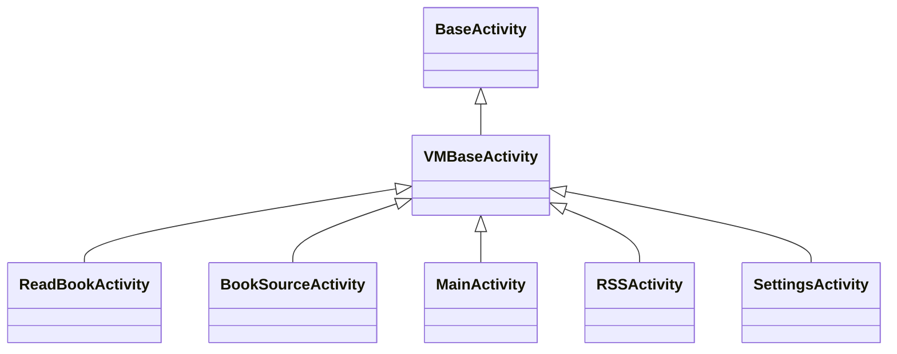

# Android UI 层架构

> **核心问题**：200+ 个 Activity/Fragment/Widget 如何组织？导航链路怎样流转？
> **答案**：MainActivity(ViewPager+底部Nav) → 四大TabFragment → 二级 Activity → 三级 Dialog。阅读界面为独立 Activity 全屏栈。

---

## 1. 主框架：MainActivity + 底部导航

```
MainActivity (VMBaseActivity)
├── ViewPager (offscreenPageLimit=3)
│   ├── Tab 0: BookshelfFragment1/2  — 书架（双样式切换）
│   ├── Tab 1: ExploreFragment       — 发现（可选隐藏）
│   ├── Tab 2: RssFragment           — RSS订阅（可选隐藏）
│   └── Tab 3: MyFragment            — 我的配置
└── BottomNavigationView
    ├── menu_bookshelf
    ├── menu_discovery (AppConfig.showDiscovery 控制显隐)
    ├── menu_rss       (AppConfig.showRSS 控制显隐)
    └── menu_my_config
```

### 关键设计决策

| 决策 | 位置 | 说明 |
|------|------|------|
| ViewPager + FragmentStatePagerAdapter | [MainActivity.kt:L441](file:///f:/myself/github/WeAgentChat/temp/legado/app/src/main/java/io/legado/app/ui/main/MainActivity.kt#L441) | `BEHAVIOR_RESUME_ONLY_CURRENT_FRAGMENT`，非当前 Fragment 不 resume |
| 书架双样式切换 | [MainActivity.kt:L424-L429](file:///f:/myself/github/WeAgentChat/temp/legado/app/src/main/java/io/legado/app/ui/main/MainActivity.kt#L424) | `AppConfig.bookGroupStyle == 1 ? BookshelfFragment2 : BookshelfFragment1` |
| 底部菜单动态显示 | [MainActivity.kt:L386-L406](file:///f:/myself/github/WeAgentChat/temp/legado/app/src/main/java/io/legado/app/ui/main/MainActivity.kt#L386) | `showDiscovery/showRSS` 控制 "发现"/"RSS" Tab 可见性 |
| 默认首页 | [MainActivity.kt:L408-L421](file:///f:/myself/github/WeAgentChat/temp/legado/app/src/main/java/io/legado/app/ui/main/MainActivity.kt#L408) | `AppConfig.defaultHomePage` 支持 bookshelf/explore/rss/my |
| 双击退出 | [MainActivity.kt:L101-L121](file:///f:/myself/github/WeAgentChat/temp/legado/app/src/main/java/io/legado/app/ui/main/MainActivity.kt#L101) | 2000ms 内双击返回退出；若朗读暂停则直接 finish，否则 moveTaskToBack |
| 书架重复点击回顶 | [MainActivity.kt:L172-L189](file:///f:/myself/github/WeAgentChat/temp/legado/app/src/main/java/io/legado/app/ui/main/MainActivity.kt#L172) | 300ms 内再次选中 → `gotoTop()` |

### 启动流程

[MainActivity.kt:L124-L153](file:///f:/myself/github/WeAgentChat/temp/legado/app/src/main/java/io/legado/app/ui/main/MainActivity.kt#L124)
```
onPostCreate
    ├── privacyPolicy()          — 隐私协议确认
    ├── upVersion()              — 版本更新检查/帮助文档
    ├── setLocalPassword()       — 首次设置本地密码
    ├── notifyAppCrash()         — 崩溃日志通知
    ├── backupSync()             — WebDAV 备份同步
    ├── viewModel.ruleSubsUp()   — 延迟1s自动更新书源
    ├── viewModel.upAllBookToc() — 延迟2s自动更新书籍目录
    └── viewModel.postLoad()     — 延迟3s后台加载
```

---

## 2. 活动（Activity）体系

### 书架模块

| Activity | 文件 | 功能 |
|----------|------|------|
| MainActivity | `ui/main/MainActivity.kt` | 主界面容器 |
| BookInfoActivity | `ui/book/info/BookInfoActivity.kt` | 书籍详情：信息/目录/书源管理 |
| BookChangeSourceActivity | `ui/book/change/BookChangeSourceActivity.kt` | 换源界面 |
| ImportBookActivity | `ui/book/import/local/ImportBookActivity.kt` | 本地书导入 |
| ImportBookWebActivity | `ui/book/import/web/ImportBookWebActivity.kt` | 网络书导入 |

### 阅读模块

| Activity | 文件 | 功能 |
|----------|------|------|
| BaseReadBookActivity | `ui/book/read/BaseReadBookActivity.kt` | 阅读抽象基类，负责屏幕方向/刘海适配/亮屏/翻页动画/按键翻页等通用功能 |
| ReadBookActivity | `ui/book/read/ReadBookActivity.kt` | 文字阅读核心，全屏沉浸式，16个接口实现 |
| ReadMangaActivity | `ui/book/read/ReadMangaActivity.kt` | 漫画阅读 |
| ReadAloudActivity | `ui/book/read/ReadAloudActivity.kt` | 朗读控制面板 |

### 搜索/发现模块

| Activity | 文件 | 功能 |
|----------|------|------|
| SearchActivity | `ui/book/search/SearchActivity.kt` | 搜索入口 + 搜索结果展示 |
| SearchBookActivity | `ui/book/searchContent/SearchBookActivity.kt` | 全文检索 |
| ExploreActivity | `ui/book/explore/ExploreActivity.kt` | 发现详情 |

### 书源/RSS 管理

| Activity | 文件 | 功能 |
|----------|------|------|
| BookSourceActivity | `ui/book/source/manage/BookSourceActivity.kt` | 书源列表管理 |
| BookSourceEditActivity | `ui/book/source/edit/BookSourceEditActivity.kt` | 书源可视化编辑 |
| RssSourceActivity | `ui/rss/source/manage/RssSourceActivity.kt` | RSS 源管理 |
| RssSourceEditActivity | `ui/rss/source/edit/RssSourceEditActivity.kt` | RSS 源编辑 |
| RssArticlesActivity | `ui/rss/article/RssArticlesActivity.kt` | RSS 文章列表容器 |
| RssSortActivity | `ui/rss/article/RssSortActivity.kt` | RSS 多源分组排序 |
| ReadRssActivity | `ui/rss/read/ReadRssActivity.kt` | RSS 文章阅读（WebView + JS注入） |
| RssFavoritesActivity | `ui/rss/favorites/RssFavoritesActivity.kt` | RSS 收藏文章 |
| RuleSubActivity | `ui/rss/subscription/RuleSubActivity.kt` | RSS 规则订阅入口 |

### 配置/替换/工具

| Activity | 文件 | 功能 |
|----------|------|------|
| ConfigActivity | `ui/config/ConfigActivity.kt` | 全局设置 |
| ReplaceRuleActivity | `ui/replace/ReplaceRuleActivity.kt` | 替换规则管理 |
| DictRuleActivity | `ui/dict/DictRuleActivity.kt` | 字典规则 |
| TTSEditActivity | `ui/tts/TTSEditActivity.kt` | TTS 配置编辑 |
| FileManageActivity | `ui/file/FileManageActivity.kt` | 文件管理 |

### 辅助模块

| Activity | 文件 | 功能 |
|----------|------|------|
| LoginActivity | `ui/login/LoginActivity.kt` | 登录/密码验证 |
| FontActivity | `ui/font/FontActivity.kt` | 字体管理 |
| AboutActivity | `ui/about/AboutActivity.kt` | 关于页面 |
| QrCodeActivity | `ui/qrcode/QrCodeActivity.kt` | 二维码/文件传输 |
| BrowserActivity | `ui/browser/BrowserActivity.kt` | 内置浏览器 |
| CodeActivity | `ui/code/CodeActivity.kt` | 代码编辑器 |
| CacheActivity | `ui/cache/CacheActivity.kt` | 缓存管理 |
| AssociationActivity | `ui/association/AssociationActivity.kt` | 关联导入(书源/RSS/替换) |
| VideoPlayActivity | `ui/video/VideoPlayActivity.kt` | 视频播放 |

---

## 3. Fragment 体系

### 书架 Fragment

```
BaseBookshelfFragment              — 书架基类（排序/分组/长按菜单/拖拽）
├── BookshelfFragment1             — 样式1：普通列表/网格
└── BookshelfFragment2             — 样式2：按分组折叠展示
```

核心行为：
- 长按书籍 → 弹出操作菜单（置顶/删除/换源/详情/缓存/导出）
- 下拉刷新 → 触发搜索线程池更新所有已收藏书籍
- 分组拖拽 → DragSortRecyclerView 实现
- 排序模式：按更新时间/按书名/按作者/按阅读进度/自定义排序

### 我的 (MyFragment)

展示配置入口：
- 书源管理 / RSS管理 / 替换规则
- 备份与恢复 / WebDAV 设置
- 主题设置 / 阅读设置 / TTS 设置
- 缓存与下载管理 / 关于

### RSS 文章流 (RssArticlesFragment + 5种Adapter)

**文件**：[RssArticlesFragment.kt](file:///f:/myself/github/WeAgentChat/temp/legado/app/src/main/java/io/legado/app/ui/rss/article/RssArticlesFragment.kt)

RSS 文章流是仅次于书架的第二复杂 Fragment，支持 5 种文章展示样式：

| Adapter | 样式 | 布局 |
|---------|------|------|
| `BaseRssArticlesAdapter<VB>` | 抽象基类 | 继承 `RecyclerAdapter<RssArticle, VB>` |
| `RssArticlesAdapter` (样式0) | 列表+缩略图 | LinearLayoutManager |
| `RssArticlesAdapter2` (样式2) | 网格2列 | GridLayoutManager(span=2) |
| `RssArticlesAdapter3` (样式3) | 瀑布流 | StaggeredGridLayoutManager(横屏3列/竖屏2列) |
| `RssArticlesAdapter4` (样式4) | 网格3列 | GridLayoutManager(span=3) |

核心功能：
- `sortName/sortUrl/searchKey` 通过 Bundle 传入，Room Flow `flowByOriginSort()` 监听数据变化
- DiffUtil 按 `link` 判断同一项，`title/image/read` 判断内容变化
- `isPreload=true` 时所有页面在后台加载，支持分页加载 `scrollToBottom() → loadMore()`
- 点击文章 → `ReadRssActivity`（WebView + JS注入，支持黑白名单过滤/Cookie管理/全屏视频/朗读）

**ReadRssActivity** ([ReadRssActivity.kt](file:///f:/myself/github/WeAgentChat/temp/legado/app/src/main/java/io/legado/app/ui/rss/read/ReadRssActivity.kt))：
- WebView 池化复用（`WebViewPool.acquire(this)`）
- JS 接口注入（java/source/cache 对象）供书源规则使用
- `shouldInterceptRequest` 实现 preloadJs 注入和黑白名单 URL 过滤
- 返回键智能处理：全屏→WebView历史栈后退（跳过多刷新页）→退出

---

## 4. Widget 自定义控件体系

`ui/widget/` 下 30+ 自定义控件，核心分类：

| 类别 | 控件 | 用途 |
|------|------|------|
| **对话框** | `WaitDialog` / `TextDialog` / `RequestDialog` / `ModifyDialog` | 等待/文本展示/请求确认/修改 |
| **文本** | `BadgeView` / `UnderLineTextView` / `ExplosionTextView` | 角标/下划线/展开文本 |
| **图片** | `CoverImageView` / `PhotoView` / `RoundedRectImageView` | 封面/图片查看/圆角图 |
| **进度/滑块** | `VerticalSeekBar` / `NumberPicker` / `TouchSeekBar` | 垂直滑动条/数字选择/触控滑块 |
| **列表** | `FastScroller` / `DragSortRecyclerView` / `SwipeRecyclerView` | 快速滚动/拖拽排序/侧滑 |
| **弹窗** | `BottomDialog` / `BottomMenu` / `SourceEditDialog` | 底部弹窗/菜单/书源编辑 |
| **复选框** | `SmoothCheckBox` | 动画复选框 |
| **导航** | `PageNumberView` / `BatteryView` | 页码显示/电池电量 |
| **输入** | `CodeEditor` / `FontPicker` | 代码编辑器/字体选择 |
| **WebView** | `AndroidBug5497Workaround` / `WebDialog` | WebView 键盘修复/网页弹窗 |

---

## 5. Theme & 主题系统

```
ThemeConfig.getTheme()
├── EInk 模式  (AppConfig.isEInkMode → themeMode == "3")
├── Dark 深色   (AppConfig.isNightTheme → themeMode == "2")
└── Light 浅色  (默认/跟随系统 → themeMode == "0" or "1")
```

主题切换流程：[ThemeConfig.kt:L69-L73](file:///f:/myself/github/WeAgentChat/temp/legado/app/src/main/java/io/legado/app/help/config/ThemeConfig.kt#L69)
```
applyDayNight()
├── applyTheme()         — 切换 ThemeStore 主题
├── initNightMode()      — AppCompatDelegate 日夜间
├── BookCover.upDefaultCover() — 更新默认封面
└── postEvent(RECREATE)  — 通知 MainActivity 重建
```

**EInk 模式特殊处理**：
- 所有动画禁用 / elevation = 0
- BottomNavigationView 使用特殊底边框 drawable
- 界面极简化，去除阴影和过渡动画

---

## 6. Base 基类体系



```
BaseActivity             — 最基础 Activity（Lifecycle + CoroutineScope）
├── VMBaseActivity<B,VM> — ViewBinding + ViewModel 泛型封装
│   ├── MainActivity
│   ├── BaseReadBookActivity  — 阅读抽象基类（屏幕方向/刘海适配/亮屏/翻页动画）
│   │   ├── ReadBookActivity  — 文字阅读核心，全屏沉浸式
│   │   └── ReadMangaActivity — 漫画阅读
│   └── ...
└── ...
```

`VMBaseActivity` 提供：
- `val binding` — 自动 ViewBinding 绑定
- `val viewModel` — 自动 ViewModel 懒加载
- `observeLiveBus()` — LiveData/EventBus 观察注册点

---

## 7. 阅读界面架构 (VMBaseActivity → BaseReadBookActivity → ReadBookActivity)

阅读界面是项目中最复杂的 Activity，通过 BaseReadBookActivity 抽象基类（负责屏幕方向设置/刘海屏适配/亮屏控制/翻页动画选择/按键翻页等通用阅读功能）统一管理文字阅读和漫画阅读的公共行为：

```
ReadBookActivity
├── ReadBook (全局单例, model/)
│   ├── 三种模式: 文字/漫画/音频  (ReadBook/ReadManga/AudioPlay)
│   ├── 三章缓存: prevChapter / curChapter / nextChapter
│   └── 触摸事件 → 9宫格区域映射 clickActionTL/TC/TR/ML/MC/MR/BL/BC/BR
├── PageView (自定义 View)
│   ├── 翻页动画: PageAnim 枚举 (覆盖/滑动/仿真/无)
│   ├── 排版引擎: ReadBookConfig.Config (行距/段距/字体/背景/页边距)
│   └── 分页计算: 基于屏幕尺寸 + Config 实时计算
├── ReadMenu (顶部/底部弹出菜单)
│   ├── 目录/书签/换源/朗读/设置/缓存/下载
│   └── 亮度调节/字体缩放/翻页动画切换
└── ReadAloudDialog (朗读控制浮窗)
```

**9宫格触摸区域**：[AppConfig.kt:L38-L46](file:///f:/myself/github/WeAgentChat/temp/legado/app/src/main/java/io/legado/app/help/config/AppConfig.kt#L38)
```
┌─────────┬─────────┬─────────┐
│ clickTL │ clickTC │ clickTR │   0=菜单  1=下一页  2=上一页
├─────────┼─────────┼─────────┤   可自定义每个区域行为
│ clickML │ clickMC │ clickMR │   若全部设为非0则自动恢复中间区域为菜单
├─────────┼─────────┼─────────┤
│ clickBL │ clickBC │ clickBR │
└─────────┴─────────┴─────────┘
```

---

## 8. 导航链路总览

```
应用启动
    │
    ├── 首次启动 → 隐私协议 → 帮助文档(MD) → 设置密码 → MainActivity
    ├── 版本更新 → 更新日志(MD) → MainActivity
    └── 正常启动 → MainActivity
                        │
        ┌───────────────┼───────────────────┐
        ▼               ▼                   ▼
    书架Tab         发现Tab             我的Tab
    │               │                   │
    ├─点击书籍       ├─搜索结果           ├─书源管理
    │  └─BookInfo   │  └─BookInfo      ├─RSS管理
    │     ├─开始阅读  │     └─ReadBook   ├─替换规则
    │     │  └─ReadBookActivity        ├─备份恢复
    │     ├─换源                        ├─主题设置
    │     ├─缓存                        ├─WebDAV
    │     └─导出                        └─...
    ├─长按书籍 → 操作菜单
    ├─下拉刷新 → 全局更新
    └─搜索按钮 → SearchActivity
                     │
                     ├─搜索结果 → BookInfo → ReadBook
                     ├─全文检索 → SearchBookActivity
                     └─发现详情 → ExploreActivity
```