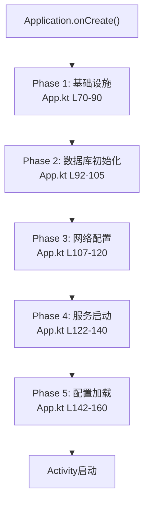

# App 入口与初始化流程

> **核心问题**：Application 启动后执行了哪些初始化步骤？哪些框架在什么时候被设置？
> **答案**：`App.onCreate()` 执行 50+ 步初始化——崩溃捕获 → 日间/夜间 → 通知渠道 → Cronet预下载 → LiveEventBus → 数据库清理 → Rhino引擎 → JS环境 → 简繁转换 → WebDAV同步。

---

## 1. 启动时间线



**文件**：[App.kt:L70-L127](file:///f:/myself/github/WeAgentChat/temp/legado/app/src/main/java/io/legado/app/App.kt#L70)

```
onCreate()
├── CrashHandler(this)                          ── 全局崩溃处理器
├── ThreadUtils 设置(DEBUG模式)                  ── 禁用线程断言
├── applyDayNightInit(this)                     ── 初始化日夜间主题
├── registerActivityLifecycleCallbacks           ── 生命周期监听 LifecycleHelp
├── registerOnSharedPreferenceChangeListener     ── AppConfig 监听器注册
│
└── Coroutine.async {                          ── 异步初始化块
    ├── LogUtils.init()                         ── 日志系统初始化
    ├── LogUtils.logDeviceInfo()                ── 打印设备信息
    ├── Cronet.preDownload()                    ── 预下载 Cronet 动态库
    │
    ├── createNotificationChannels()            ── 创建通知渠道(Android 8+)
    │   ├── channelIdDownload   "下载"
    │   ├── channelIdReadAloud  "朗读"
    │   └── channelIdWeb        "Web服务"
    │
    ├── LiveEventBus.config()                   ── 事件总线配置
    │   ├── lifecycleObserverAlwaysActive(true)  ── 观察者始终活跃
    │   ├── autoClear(false)                     ── 不自动清除粘性事件
    │   ├── enableLogger(DEBUG || recordLog)     ── 条件路由
    │   └── setLogger(EventLogger())             ── 自定义路由
    │
    ├── DefaultData.upVersion()                 ── 默认数据版本更新
    ├── AppFreezeMonitor.init()                  ── UI冻结监控
    ├── DispatchersMonitor.init()                ── 协程调度器监控
    │
    ├── URL.setURLStreamHandlerFactory()        ── OkHttp 作为全局 URL 处理器
    ├── installGmsTlsProvider()                  ── GMS 设备启用 TLSv1.3
    │
    ├── initRhino()                             ── 初始化 Rhino JS 引擎
    │   ├── RhinoScriptEngine 类加载触发生
    │   ├── BookSource → NativeBaseSource (可读写)
    │   ├── RssSource → NativeBaseSource (可读写)
    │   ├── HttpTTS → NativeBaseSource (可读写)
    │   ├── ExploreRule → ReadOnlyJavaObject
    │   ├── SearchRule → ReadOnlyJavaObject
    │   ├── BookInfoRule → ReadOnlyJavaObject
    │   ├── ContentRule → ReadOnlyJavaObject
    │   ├── BookChapter → ReadOnlyJavaObject
    │   └── Book.ReadConfig → ReadOnlyJavaObject
    │
    ├── BookCover.toString()                     ── 触发生面初始化(lazy)
    ├── appDb.cacheDao.clearDeadline()          ── 清理过期缓存
    │
    ├── 条件：[autoClearExpired]                  ── 清除 24h 前搜索书
    │   └── appDb.searchBookDao.clearExpired()
    │
    ├── RuleBigDataHelp.clearInvalid()           ── 清除无效规则大数据
    ├── BookHelp.clearInvalidCache()             ── 清理无效书籍缓存
    ├── Backup.clearCache()                      ── 清理旧备份临时文件
    ├── ReadBookConfig.clearBgAndCache()         ── 清理背景图缓存
    │
    ├── 简繁转换引擎                             ── ChineseUtils 预加载
    │   ├── converterType == 1 → TRADITIONAL_TO_SIMPLE
    │   └── converterType == 2 → SIMPLE_TO_TRADITIONAL
    │
    ├── SourceHelp.adjustSortNumber()            ── 调整书源排序序号
    │
    └── 条件：[syncBookProgress]                 ── WebDAV 同步阅读进度
        └── AppWebDav.downloadAllBookProgress()
```

### 配置变更监听

[App.kt:L133-L140](file:///f:/myself/github/WeAgentChat/temp/legado/app/src/main/java/io/legado/app/App.kt#L133)

```
onConfigurationChanged(newConfig)
    → 检测 UI_MODE 变更 (Dark Mode 切换)
    → applyDayNight(this)   — 重新应用主题
```

### AppContextWrapper

[App.kt:L129-L131](file:///f:/myself/github/WeAgentChat/temp/legado/app/src/main/java/io/legado/app/App.kt#L129)

```kotlin
override fun attachBaseContext(base: Context) {
    super.attachBaseContext(AppContextWrapper.wrap(base))
}
```

`AppContextWrapper` 代理 `SharedPreferences`，实现 Language 切换下的 Context 包装。

---

## 2. 常量系统

### constant/ 目录结构（13个文件）

| 文件 | 内容 | 用途 |
|------|------|------|
| `AppConst.kt` | 应用级别常量 | 通知渠道ID、UA_NAME、MAX_THREAD、签名校验、时间格式、androidId、appInfo(variant)、charSets |
| `PreferKey.kt` | SharedPreferences Key 枚举 | 180+ 个配置 Key，涵盖主题/阅读/书架/TTS/导出/WebDAV/漫画/更新/编辑 |
| `EventBus.kt` | 事件总线事件名 | 40+ 事件常量（见下文） |
| `Status.kt` | 播放状态枚举 | STOP(0) / PLAY(1) / PAUSE(3) |
| `IntentAction.kt` | Service Intent Action | start/play/stop/resume/pause/addTimer/prev/next/moveTo 等 25 个 |
| `AppLog.kt` | 日志工具 | 应用日志持久化 |
| `AppPattern.kt` | 正则模式集合 | 各类匹配正则 |
| `BookType.kt` | 书籍类型 | 本地/网络/音频/漫画等 |
| `BookSourceType.kt` | 书源类型 | book(TEXT) / rss |
| `SourceType.kt` | 源类型 | 同上 |
| `Theme.kt` | 主题枚举 | EInk / Dark / Light |
| `PageAnim.kt` | 翻页动画枚举 | 覆盖/滑动/仿真/无 |
| `NotificationId.kt` | 通知ID | 避免通知冲突 |

### AppConst 关键常量

[AppConst.kt:L15-L111](file:///f:/myself/github/WeAgentChat/temp/legado/app/src/main/java/io/legado/app/constant/AppConst.kt#L15)

| 常量 | 值 | 说明 |
|------|-----|------|
| `APP_TAG` | "Legado" | 全局标识 |
| `MAX_THREAD` | 9 | 搜索/解析并发线程数 |
| `UA_NAME` | "User-Agent" | HTTP 请求头键 |
| `DEFAULT_WEBDAV_ID` | -1L | 默认 WebDAV 服务器 ID |
| `authority` | package.fileProvider | FileProvider 授权 |
| `sha256Signature` | (运行时) | 应用签名校验（区分正式/测试版） |
| `appInfo.variant` | (运行时) | OFFICIAL / BETA_RELEASE / UNKNOWN |

### AppInfo（应用信息）

```kotlin
data class AppInfo(
    var versionCode: Long      // 版本码
    var versionName: String    // 版本名 3.{yy.MMddHH}
    var appVariant: AppVariant // 变体类型
)
```

---

## 3. EventBus 事件总线

**文件**：[EventBus.kt](file:///f:/myself/github/WeAgentChat/temp/legado/app/src/main/java/io/legado/app/constant/EventBus.kt)

使用 **LiveEventBus** 库，基于 LiveData 的事件总线。支持粘性事件、跨组件通信。

### 事件分类

| 类别 | 事件 | 说明 |
|------|------|------|
| **界面** | `RECREATE` | 重建Activity（主题切换） |
| | `UP_BOOKSHELF` / `BOOKSHELF_REFRESH` | 书架更新/刷新 |
| | `NOTIFY_MAIN` | 通知主界面 |
| | `SOURCE_CHANGED` | 书源变更通知 |
| | `UP_CONFIG` | 配置变更 |
| | `UPDATE_READ_ACTION_BAR` / `UP_SEEK_BAR` | 阅读界面更新 |
| | `REFRESH_BOOK_INFO/CONTENT/TOC` | 书籍信息刷新 |
| **朗读** | `ALOUD_STATE` | 朗读状态(STOP/PLAY/PAUSE) |
| | `TTS_PROGRESS` | TTS 朗读进度 |
| | `READ_ALOUD_DS` | 朗读定时倒计时 |
| | `READ_ALOUD_PLAY` | 通过EventBus控制朗读 |
| **音频/视频**| `AUDIO_STATE` / `AUDIO_PROGRESS` | 音频状态/进度 |
| | `AUDIO_BUFFER_PROGRESS` / `AUDIO_SIZE` | 音频缓冲/大小 |
| | `AUDIO_SPEED` / `PLAY_MODE_CHANGED` | 速度/模式 |
| | `VIDEO_SUB_TITLE` / `UP_VIDEO_INFO` | 视频字幕/信息 |
| | `AUDIO_SUB_TITLE` | 音频字幕 |
| **下载/导出**| `UP_DOWNLOAD` / `UP_DOWNLOAD_STATE` | 下载进度/状态 |
| | `EXPORT_BOOK` / `SAVE_CONTENT` | 导出/保存 |
| **书源** | `CHECK_SOURCE` / `CHECK_SOURCE_DONE` | 书源检验状态 |
| | `SEARCH_RESULT` | 搜索结果 |
| **系统** | `MEDIA_BUTTON` | 媒体按钮 |
| | `BATTERY_CHANGED` / `TIME_CHANGED` | 电池/时间 |
| | `WEB_SERVICE` | Web 服务状态 |
| **其他** | `TIP_COLOR` | 提示颜色 |
| | `UP_MANGA_CONFIG` | 漫画配置更新 |

### 使用方式

```kotlin
// 发送事件
postEvent(EventBus.ALOUD_STATE, Status.PLAY)

// 观察事件 (在 Activity/VM 中)
observeEvent<String>(EventBus.SOURCE_CHANGED) { key ->
    // 处理书源变更
}
```

---

## 4. 异常体系

**目录**：`exception/`（8个文件）

| 异常 | 说明 |
|------|------|
| `NoStackTraceException` | 无堆栈异常（业务逻辑提示信息，不记录堆栈） |
| `ConcurrentException` | 并发冲突异常 |
| `ContentEmptyException` | 正文为空 |
| `TocEmptyException` | 目录为空 |
| `RegexTimeoutException` | 正则匹配超时 |
| `NoBooksDirException` | 无书籍目录 |
| `InvalidBooksDirException` | 无效书籍目录 |
| `EmptyFileException` | 空文件异常 |

---

## 5. Monitor 监控系统

| 组件 | 功能 |
|------|------|
| `CrashHandler` | 全局未捕获异常处理器，写入崩溃日志文件，重启恢复 |
| `AppFreezeMonitor` | UI 冻结检测（主线程阻塞超过阈值 → 输出堆栈） |
| `DispatchersMonitor` | 协程调度器监控（死锁检测） |

---

## 6. Lifecycle 生命周期管理

**文件**：[LifecycleHelp.kt](file:///f:/myself/github/WeAgentChat/temp/legado/app/src/main/java/io/legado/app/help/LifecycleHelp.kt)

实现 `Application.ActivityLifecycleCallbacks`：
- `onActivityCreated()` → 设置 activity 级 `CoroutineContainer`
- `onActivityDestroyed()` → 取消 activity 关联的所有协程
- 前/后台切换检测 → 自动暂停/恢复朗读

---

## 7. AppContextWrapper — 上下文包装

**文件**：[base/AppContextWrapper.kt](file:///f:/myself/github/WeAgentChat/temp/legado/app/src/main/java/io/legado/app/base/AppContextWrapper.kt)

重写 `getSharedPreferences()` 方法，在 Language 切换后返回正确的 SP 实例，保证语言设置全局生效。

---

## 8. 自定义 DNS

### 自定义 Hosts

```kotlin
// AppConfig.customHosts 存储 JSON: {"example.com": "1.2.3.4"}
// → AppConfig.hostMap → AppConfig.addressCache
// → OkHttpClient Builder 注入 customDns
```

### GMS TLS Provider

[App.kt:L152-L173](file:///f:/myself/github/WeAgentChat/temp/legado/app/src/main/java/io/legado/app/App.kt#L152)

Android Q 以下设备：检测 GMS/MicroG → 加载 Conscrypt JCE Provider → 启用 TLSv1.3。