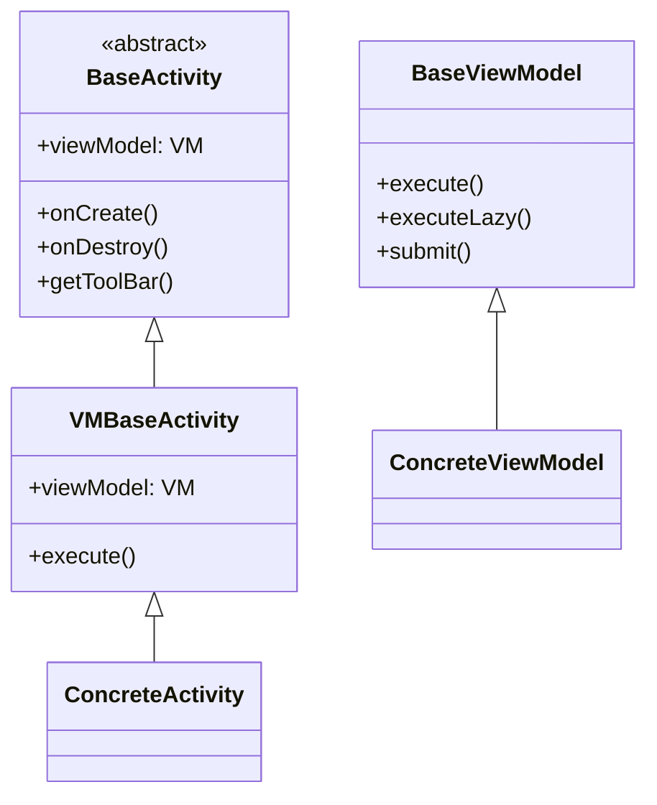

# Base 类与 MVVM 体系

> **核心问题**：Activity/Fragment/Service 的基类如何设计？ViewModel 模式是什么？Adapter 如何复用？
> **答案**：三层泛型继承（Base → VMBase → Concrete）+ Coroutine.execute() 统一协程调度 + RecyclerAdapter(Header/Footer/Diff) + BaseService(前台通知+权限)。

---

## 1. 继承链全景



```
AppCompatActivity
    └── BaseActivity<VB: ViewBinding>                         ← 基础 Activity
            └── VMBaseActivity<VB, VM: ViewModel>            ← ViewModel + ViewBinding
                    ├── MainActivity
                    ├── ReadBookActivity
                    ├── BookInfoActivity
                    ├── ... (所有具体 Activity)
                    └── ...

Fragment
    └── BaseFragment(layoutID)                               ← 基础 Fragment
            └── VMBaseFragment<VM: ViewModel>                ← ViewModel
                    ├── BookshelfFragment1/2
                    ├── ExploreFragment
                    ├── RssFragment
                    ├── ... (所有具体 Fragment)
                    └── ...

LifecycleService
    └── BaseService                                         ← 基础 Service
            ├── BaseReadAloudService                        ← 朗读抽象基类
            │   ├── TTSReadAloudService                     ← 本地TTS朗读
            │   └── HttpReadAloudService                    ← 在线HTTP朗读
            ├── AudioPlayService
            ├── DownloadService
            └── ... (所有具体 Service)

DialogFragment
    └── BaseDialogFragment                                   ← 基础 DialogFragment
            └── BasePrefDialogFragment                       ← SharedPreferences 对话框基类
```

---

## 2. BaseActivity — Activity 基类

**文件**：[BaseActivity.kt](file:///f:/myself/github/WeAgentChat/temp/legado/app/src/main/java/io/legado/app/base/BaseActivity.kt)

### 构造参数

```kotlin
abstract class BaseActivity<VB : ViewBinding>(
    val fullScreen: Boolean = true,        // 是否全屏
    private val theme: Theme = Theme.Auto, // 主题: Auto/Dark/Light/Transparent
    private val toolBarTheme: Theme = Theme.Auto, // Toolbar 主题
    private val transparent: Boolean = false,     // 是否透明背景
    private val imageBg: Boolean = true,          // 是否加载主题背景图
    private val showOpenMenuIcon: Boolean = true  // 是否显示溢出菜单图标
)
```

### 生命周期

```
attachBaseContext
    → AppContextWrapper.wrap(base)          — Language 切换支持

onCreate
    ├── window.decorView.disableAutoFill()  — 禁用自动填充
    ├── initTheme()                          — 根据参数设置 Theme
    │   ├── Theme.Transparent → AppTheme_Transparent
    │   ├── Theme.Dark        → AppTheme_Dark
    │   ├── Theme.Light       → AppTheme_Light
    │   └── Theme.Auto        → primaryColor 计算深/浅色
    ├── setupSystemBar()                     — 状态栏/导航栏颜色
    │   ├── fullScreen() (非多窗口模式)
    │   ├── setStatusBarColorAuto()          — 状态栏自动着色
    │   ├── setLightStatusBar()              — 状态栏图标类型
    │   └── upNavigationBarColor()           — 导航栏颜色(支持沉浸式)
    ├── setContentView(binding.root)         — 绑定视图
    ├── upBackgroundImage()                  — 加载主题背景图
    │   ├── ThemeConfig.getBgImage()
    │   └── window.decorView.background = drawable (OOM异常保护)
    ├── TitleBar.onMultiWindowModeChanged()  — 多窗口适配
    ├── onBackPressedDispatcher.addCallback  — 返回键处理
    ├── observeLiveBus()                     — 子类重写：注册 EventBus 观察
    └── onActivityCreated(savedInstanceState) — 子类重写：业务初始化
```

### 工具栏菜单

```kotlin
// 统一的菜单着色和溢出图标处理
onCreateOptionsMenu → onCompatCreateOptionsMenu → menu.applyTint(toolBarTheme)
onMenuOpened → menu.applyOpenTint(showOpenMenuIcon)
```

### 多窗口适配

[BaseActivity.kt:L97-L110](file:///f:/myself/github/WeAgentChat/temp/legado/app/src/main/java/io/legado/app/base/BaseActivity.kt#L97)

```kotlin
// 分屏/多窗口模式变化时，重新设置 TitleBar 和 SystemBar
override fun onMultiWindowModeChanged(isInMultiWindowMode, newConfig) {
    TitleBar.onMultiWindowModeChanged(isInMultiWindowMode, fullScreen)
    setupSystemBar()
}
```

### 软键盘自动隐藏

```kotlin
override fun finish() {
    currentFocus?.hideSoftInput()  // finish 前自动隐藏软键盘
    super.finish()
}
```

### TouchEvent 异常保护

```kotlin
override fun dispatchTouchEvent(ev: MotionEvent): Boolean {
    return try {
        super.dispatchTouchEvent(ev)
    } catch (e: IllegalArgumentException) {
        e.printStackTrace()
        false
    }
}
```

---

## 3. VMBaseActivity — ViewModel+ViewBinding

**文件**：[VMBaseActivity.kt](file:///f:/myself/github/WeAgentChat/temp/legado/app/src/main/java/io/legado/app/base/VMBaseActivity.kt)

```kotlin
abstract class VMBaseActivity<VB : ViewBinding, VM : ViewModel>(
    // ... 同 BaseActivity 参数
) : BaseActivity<VB>(...) {
    protected abstract val viewModel: VM    // 子类声明 ViewModel
}
```

**使用示例**：
```kotlin
class MainActivity : VMBaseActivity<ActivityMainBinding, MainViewModel>() {
    override val binding by viewBinding(ActivityMainBinding::inflate)
    override val viewModel by viewModels<MainViewModel>()
}
```

---

## 4. BaseViewModel — ViewModel 基类

**文件**：[BaseViewModel.kt](file:///f:/myself/github/WeAgentChat/temp/legado/app/src/main/java/io/legado/app/base/BaseViewModel.kt)

### 协程封装

```kotlin
open class BaseViewModel(application: Application) : AndroidViewModel(application) {

    val context: Context by lazy { this.getApplication<App>() }

    // 异步执行: IO线程 → Main线程(结果回调)
    fun <T> execute(
        scope: CoroutineScope = viewModelScope,     // 默认绑定 VM 生命周期
        context: CoroutineContext = Dispatchers.IO,
        start: CoroutineStart = CoroutineStart.DEFAULT,
        executeContext: CoroutineContext = Dispatchers.Main,
        semaphore: Semaphore? = null,
        block: suspend CoroutineScope.() -> T
    ): Coroutine<T>

    // 懒执行: 需手动 Coroutine.start() 才执行
    fun <T> executeLazy(...): Coroutine<T>

    // 提交执行: block 返回 Deferred
    fun <R> submit(...): Coroutine<R>
}
```

**Coroutine<T> 封装**：`help/coroutine/Coroutine.kt` 提供了 `onSuccess` / `onError` / `onFinally` 链式回调。

---

## 5. BaseService — Service 基类

**文件**：[BaseService.kt](file:///f:/myself/github/WeAgentChat/temp/legado/app/src/main/java/io/legado/app/base/BaseService.kt)

### 核心特性

```kotlin
abstract class BaseService : LifecycleService() {
    
    private var isForeground = false       // 前台服务标记

    // 协程封装（同 BaseViewModel.execute）
    fun <T> execute(scope = lifecycleScope, ...): Coroutine<T>

    // 生命周期
    override fun onCreate() {
        LifecycleHelp.onServiceCreate(this)  // 注册到全局生命周期管理
        checkPermission()                     // 通知权限 + 电池优化豁免
    }

    override fun onStartCommand(intent, flags, startId) {
        if (!isForeground) {
            startForegroundNotification()    // 子类重写：发送前台通知
            isForeground = true
        }
    }

    override fun onTaskRemoved(rootIntent) {
        stopSelf()                           // 任务栈清除 → 自停
    }

    override fun onDestroy() {
        LifecycleHelp.onServiceDestroy(this)
    }

    // 权限检测
    private fun checkPermission() {
        POST_NOTIFICATIONS                 // 通知权限(Android 13+)
        REQUEST_IGNORE_BATTERY_OPTIMIZATIONS // 电池优化豁免(Android 12+)
    }

    fun checkFloatPermission() {
        SYSTEM_ALERT_WINDOW                // 悬浮窗权限
    }
}
```

---

## 6. BaseFragment — Fragment 基类

**文件**：[BaseFragment.kt](file:///f:/myself/github/WeAgentChat/temp/legado/app/src/main/java/io/legado/app/base/BaseFragment.kt)

```kotlin
abstract class BaseFragment(@LayoutRes layoutID: Int) : Fragment(layoutID) {

    // 工具栏集成
    var supportToolbar: Toolbar?
    fun setSupportToolbar(toolbar: Toolbar)   // Menu 着色 + onClick 分发

    // 生命周期钩子
    open fun onFragmentCreated(view, savedInstanceState)
    open fun observeLiveBus()                 // 子类注册 EventBus
    open fun onCompatCreateOptionsMenu(menu)
    open fun onCompatOptionsItemSelected(item)

    // 多窗口适配（自动同步 BaseActivity 状态）
    onMultiWindowModeChanged → TitleBar 同步
}
```

### VMBaseFragment

```kotlin
abstract class VMBaseFragment<VM : ViewModel>(@LayoutRes layoutID: Int) : BaseFragment(layoutID) {
    protected abstract val viewModel: VM
}
```

---

## 7. RecyclerAdapter — 通用适配器

**文件**：[RecyclerAdapter.kt](file:///f:/myself/github/WeAgentChat/temp/legado/app/src/main/java/io/legado/app/base/adapter/RecyclerAdapter.kt)

### 核心设计

```kotlin
abstract class RecyclerAdapter<ITEM, VB : ViewBinding>(context: Context) :
    RecyclerView.Adapter<ItemViewHolder>() {

    // 数据源
    private val items: MutableList<ITEM>

    // Header/Footer 支持
    private val headerItems: SparseArray<(ViewGroup) -> ViewBinding>
    private val footerItems: SparseArray<(ViewGroup) -> ViewBinding>

    // 点击事件
    private var itemClickListener / itemLongClickListener

    // 动画
    var itemAnimation: ItemAnimation?       // ScaleIn/SlideIn/Alpha

    // DiffUtil 异步更新
    private var diffJob: Coroutine<*>?
}
```

### 核心方法

| 方法 | 说明 |
|------|------|
| `getItems()` | 获取数据列表（不可变视图） |
| `setItems(newItems)` | 设置数据（创建 Diff 任务异步更新） |
| `addItem/removeItem/moveItem` | 单条操作 |
| `addHeaderView/footer` / `removeHeaderView/footer` | Header/Footer 管理 |
| `setOnItemClickListener/longClickListener` | 点击/长按回调 |
| `bindToRecyclerView(rv)` | 绑定 RecyclerView |

### DiffUtil 集成

```kotlin
// 子类需提供:
abstract fun areItemsTheSame(oldItem: ITEM, newItem: ITEM): Boolean
abstract fun areContentsTheSame(oldItem: ITEM, newItem: ITEM): Boolean

// 内部使用 AsyncDiffUtil + Coroutine 实现异步 Diff
fun setItems(newItems: List<ITEM>) {
    diffJob?.cancel()
    diffJob = Coroutine.async(IODispatcher) {
        DiffUtil.calculateDiff(DiffCallback(oldItems, newItems))
    }
    diffJob?.onSuccess(IO) { diffResult → diffResult.dispatchUpdatesTo(this) }
}
```

---

## 8. DiffRecyclerAdapter — Diff 增强适配器

**文件**：[DiffRecyclerAdapter.kt](file:///f:/myself/github/WeAgentChat/temp/legado/app/src/main/java/io/legado/app/base/adapter/DiffRecyclerAdapter.kt)

继承 `RecyclerAdapter`，内置 `DiffUtil.ItemCallback<ITEM>` 实现：

```kotlin
abstract class DiffRecyclerAdapter<ITEM, VB>(context: Context) :
    RecyclerAdapter<ITEM, VB>(context) {

    // 子类需重写:
    abstract fun areItemsTheSame(oldItem: ITEM, newItem: ITEM): Boolean
    abstract fun areContentsTheSame(oldItem: ITEM, newItem: ITEM): Boolean
}
```

---

## 9. ItemAnimation — 条目动画

**文件**：[ItemAnimation.kt](file:///f:/myself/github/WeAgentChat/temp/legado/app/src/main/java/io/legado/app/base/adapter/ItemAnimation.kt)  
**目录**：`base/adapter/animations/`

| 动画 | 效果 |
|------|------|
| `AlphaInAnimation` | 透明度渐入 |
| `ScaleInAnimation` | 缩放渐入 |
| `SlideInLeftAnimation` | 左侧滑入 |
| `SlideInRightAnimation` | 右侧滑入 |
| `SlideInBottomAnimation` | 底部滑入 |

---

## 10. AppContextWrapper — 上下文代理

**文件**：[AppContextWrapper.kt](file:///f:/myself/github/WeAgentChat/temp/legado/app/src/main/java/io/legado/app/base/AppContextWrapper.kt)

```kotlin
object AppContextWrapper {
    fun wrap(base: Context): Context {
        return if (language != base.resources.configuration.locales[0]) {
            // 创建新的 Configuration 并设置 Language
            AppCompatContextWrapper(base).apply { ... }
        } else base
    }
}
```

用途：切换语言后，所有 Activity/Service 自动使用新的 Locale。

---

## 11. BaseDialogFragment / BasePrefDialogFragment

**BaseDialogFragment**：带 ViewBinding 的 DialogFragment 基类，提供 `initView()` / `observeLiveBus()` 钩子。

**BasePrefDialogFragment**：`BaseDialogFragment` 子类，实现 `SharedPreferences.OnSharedPreferenceChangeListener`，自动监听 SP 变更并更新 UI。

---

## 12. MVVM 数据流

```
┌─────────────────────────────────────────────────────────┐
│                  BaseActivity / BaseFragment             │
│  ┌──────────────────────┐   ┌────────────────────────┐ │
│  │    ViewBinding       │   │    ViewModel            │ │
│  │  (XML → Kotlin 代码)  │   │  (LiveData / Flow)      │ │
│  └──────────┬───────────┘   └───────────┬────────────┘ │
│             │                           │               │
│    observe(liveData) { updateUI() }     │               │
│             │                           │               │
│             └───────────────────────────┘               │
│                          │                               │
│            viewModel.execute(block)                      │
│            IO线程 → Main线程结果回调                      │
└─────────────────────────────────────────────────────────┘
                │
    ┌───────────▼───────────┐
    │    Model 层 (单例)     │
    │    ReadBook / WebBook  │
    │    Room DAO / OkHttp   │
    └───────────────────────┘
```