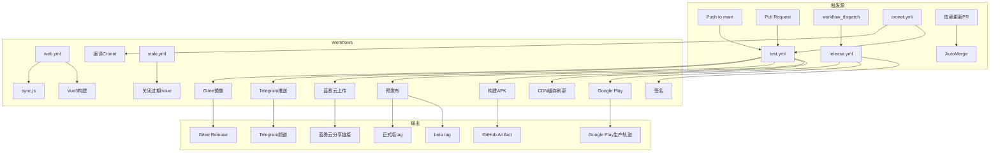

# CI/CD 流程文档

> 本文档分析 Legado 项目的持续集成与持续部署体系，涵盖 GitHub Actions workflows、dependabot、Issue 模板、辅助脚本。

---

## 1. CI/CD 架构概览



---

## 2. GitHub Actions Workflows

### 2.1 Workflow 清单

| Workflow | 文件路径 | 触发条件 | 主要功能 |
|----------|----------|----------|----------|
| **test.yml** | `.github/workflows/test.yml` | push/pr/web_run | 构建测试版APK、预发布、多平台分发 |
| **release.yml** | `.github/workflows/release.yml` | workflow_dispatch | 正式版签名构建、Google Play发布 |
| **web.yml** | `.github/workflows/web.yml` | push modules/web | Vue3前端构建 |
| **cronet.yml** | `.github/workflows/cronet.yml` | workflow_dispatch | 编译Cronet网络库 |
| **stale.yml** | `.github/workflows/stale.yml` | schedule | 关闭过期Issue/PR |

### 2.2 test.yml（主构建流程）

**触发条件**（L3-21）：

| 触发源 | 配置 | 说明 |
|--------|------|------|
| `push` | `branches: [main]`, 路径排除 `ISSUE_TEMPLATE`、`modules/web` | 主分支推送触发 |
| `pull_request` | 路径排除 `modules/web` | PR触发，不构建web |
| `workflow_run` | `workflows: [Build Web]` | Vue3构建完成后触发 |
| `workflow_dispatch` | 手动触发 | 调试/特殊构建 |

**并发控制**（L23-25）：

```yaml
concurrency:
  group: ${{ github.workflow }}-${{ github.ref }}
  cancel-in-progress: true
```

同一分支同时只运行一个构建，新构建自动取消旧的。

**Jobs 结构**：

| Job | 功能 | 依赖 |
|------|------|------|
| `prepare` | 版本号生成、检查secrets、更新日志提取 | 无 |
| `build` | 构建APK（release/releaseS两种变体） | prepare |
| `prerelease` | 发布到GitHub Release（beta/正式版） | prepare, build |
| `lanzou` | 上传到蓝奏云 | prepare, build |
| `telegram` | 推送到Telegram频道 | prepare, build |
| `gitee` | 镜像到Gitee | prepare, build |
| `update-storage` | 更新辅助仓库 | prepare, build |

**版本号生成**（L46-49）：

```bash
version=$(date -d "8 hour" -u +3.%y.%m%d%H)   # 3.26.063014
versionL=$(date -d "8 hour" -u +3.%y.%m%d%H%M) # 3.26.06301435
```

**构建矩阵**（L137-143）：

| 条件 | 构建矩阵 |
|------|----------|
| updateLog.md 更新 | `product: [app], type: [release, releaseS]` |
| 其他 | `product: [app], type: [release]` |

**签名配置**（L169-178）：

```bash
RELEASE_STORE_FILE=./legado.jks
RELEASE_KEY_ALIAS=legado
RELEASE_STORE_PASSWORD=gedoor_legado  # 测试版固定密码
RELEASE_KEY_PASSWORD=gedoor_legado
```

### 2.3 release.yml（正式发布流程）

**触发条件**（L3-9）：

```yaml
on:
  workflow_dispatch:  # 手动触发
```

Push触发已注释，仅支持手动发布。

**Jobs 结构**：

| Job | 功能 | 条件 |
|------|------|------|
| `prepare` | 版本号、检查签名secrets、Google Play secrets | `ref == refs/heads/master` |
| `build` | 构建app/google两种product | `needs.prepare.outputs.sign == yes` |

**签名安全**（L53-62）：

| 参数 | 来源 | 安全性 |
|------|------|--------|
| `RELEASE_KEY_STORE` | GitHub Secrets (base64) | ✅ 加密存储 |
| `RELEASE_KEY_ALIAS` | GitHub Secrets | ✅ |
| `RELEASE_KEY_PASSWORD` | GitHub Secrets | ✅ |
| `RELEASE_STORE_PASSWORD` | GitHub Secrets | ✅ |

**发布渠道**（L89-131）：

| 渠道 | Job | 条件 |
|------|-----|------|
| GitHub Release | `softprops/action-gh-release@v2` | `product == app` |
| Google Play | `r0adkll/upload-google-play@v1` | `product == google && play == yes` |
| Release分支 | Git push到`release`分支 | `actor == gedoor` |
| JsDelivr CDN | Purge缓存API | `actor == gedoor` |

### 2.4 web.yml（Vue3前端构建）

**触发条件**：

| 触发源 | 配置 |
|--------|------|
| `push` | `branches: [main]`, `paths: ['modules/web/**']` |
| `workflow_dispatch` | 手动触发 |

**构建流程**：

```bash
cd modules/web
pnpm install
pnpm build
node sync.js  # 同步构建产物到assets
```

**注意**：`sync.js` 仅在 GitHub Actions 执行，本地需手动复制。

### 2.5 cronet.yml（Cronet网络库编译）

**功能**：编译 Google Cronet 网络库的本地版本

**脚本**：`.github/scripts/cronet.sh`

### 2.6 stale.yml（过期Issue清理）

**触发条件**（L3-5）：

```yaml
on:
  schedule:
    - cron: '0 0 * * *'  # 每天0点UTC
```

**配置**（L10-30）：

| 参数 | 值 | 说明 |
|------|-----|------|
| `days-before-stale` | 60 | 60天无活动标记stale |
| `days-before-close` | 7 | stale后7天关闭 |
| `stale-label` | `stale` | 过期标签 |
| `exempt-labels` | `pinned`, `security` | 永不关闭的标签 |

---

## 3. Dependabot 配置

**文件**: `.github/dependabot.yml`

| 配置项 | 值 | 说明 |
|--------|-----|------|
| `interval` | `weekly` | 每周检查依赖更新 |
| `day` | ` monday` | 每周一 |
| `open-pull-requests-limit` | 10 | 最大PR数 |
| `groups` | Gradle依赖分组 | 批量更新 |

---

## 4. Issue 模板

**目录**: `.github/ISSUE_TEMPLATE/`

| 模板 | 文件 | 用途 |
|------|------|------|
| Bug Report | `01-bugReport.yml` | Bug反馈（含环境信息、复现步骤） |
| Feature Request | `02-featureRequest.yml` | 功能建议 |
| Config | `config.yml` | 模板配置（空白Issue禁用） |

**Bug Report 必填项**：

| 字段 | 类型 | 说明 |
|------|------|------|
| `问题描述` | textarea | 详细描述 |
| `复现步骤` | textarea | Steps to reproduce |
| `期望行为` | textarea | Expected behavior |
| `环境信息` | dropdown | Android版本、应用版本 |
| `日志` | textarea | 可选，粘贴AppLog |

---

## 5. 辅助脚本

**目录**: `.github/scripts/`

| 脚本 | 语言 | 功能 |
|------|------|------|
| `cronet.sh` | Shell | 编译Cronet网络库 |
| `lzy_web.py` | Python | 蓝奏云Web上传 |
| `tg_bot.py` | Python | Telegram Bot推送 |

### 5.1 lzy_web.py（蓝奏云上传）

**参数**：

| 参数 | 说明 |
|------|------|
| `path` | APK文件目录 |
| `LANZOU_FOLDER_ID` | 蓝奏云文件夹ID |

**认证**：

| Secret | 说明 |
|--------|------|
| `LANZOU_ID` | ylogin cookie |
| `LANZOU_PSD` | phpdisk_info cookie |

### 5.2 tg_bot.py（Telegram推送）

**使用方式**: 通过 `xireiki/channel-post@v1` action

| Secret | 说明 |
|--------|------|
| `BOT_TOKEN` | Telegram Bot Token |
| `CHANNEL_ID` | 频道ID |

---

## 6. Secrets 配置清单

| Secret | Workflow | 用途 |
|--------|----------|------|
| `RELEASE_KEY_STORE` | release.yml | 正式版签名密钥库(base64) |
| `RELEASE_KEY_ALIAS` | release.yml | 密钥别名 |
| `RELEASE_KEY_PASSWORD` | release.yml | 密钥密码 |
| `RELEASE_STORE_PASSWORD` | release.yml | 密钥库密码 |
| `SERVICE_ACCOUNT_JSON` | release.yml | Google Play服务账号JSON |
| `ACTIONS_TOKEN` | release.yml | Push到release分支的Token |
| `LANZOU_ID` | test.yml | 蓝奏云登录ID |
| `LANZOU_PSD` | test.yml | 蓝奏云密码 |
| `LANZOU_FOLDER_ID` | test.yml | 蓝奏云文件夹ID |
| `LANZOU_URL` | test.yml | 蓝奏云分享链接 |
| `BOT_TOKEN` | test.yml | Telegram Bot Token |
| `CHANNEL_ID` | test.yml | Telegram频道ID |
| `GITEE_TOKEN` | test.yml | Gitee API Token |
| `S_GITHUB_TOKEN` | test.yml | 辅助仓库Token |

---

## 7. 发布渠道矩阵

| 渠道 | Workflow | 条件 | APK命名 |
|------|----------|------|----------|
| GitHub Release (beta) | test.yml | 非updateLog更新 | `legado_app_3.26.06301435_beta.apk` |
| GitHub Release (正式) | test.yml | updateLog.md更新 | `legado_app_3.26.063014.apk` |
| GitHub Release (手动) | release.yml | workflow_dispatch | `legado_app_3.26.063014.apk` |
| Google Play | release.yml | `play == yes` | `legado_google_*.apk` |
| 蓝奏云 | test.yml | `lanzou == yes` | 测试版APK |
| Telegram | test.yml | `telegram == yes` | 带beta/plus标签 |
| Gitee | test.yml | `gitee == yes` | 镜像Release |

---

## 8. 构建命令速查

| 命令 | 说明 |
|------|------|
| `./gradlew assembleApprelease` | 构建原包名Release版 |
| `./gradlew assembleAppreleaseS` | 构建共存版ReleaseS |
| `./gradlew assembleGooglerelease` | 构建Google Play版 |
| `./gradlew assembleAppdebug` | 构建Debug版 |
| `./gradlew --build-cache --parallel --daemon` | 启用缓存/并行/守护进程 |

---

## 9. 源码锚点

| 组件 | 文件路径 | 关键行号 |
|------|----------|----------|
| 测试版构建 | `.github/workflows/test.yml` | L145-253 |
| 正式版发布 | `.github/workflows/release.yml` | L32-140 |
| Vue3构建 | `.github/workflows/web.yml` | 全文件 |
| Cronet编译 | `.github/workflows/cronet.yml` | 全文件 |
| 过期清理 | `.github/workflows/stale.yml` | L10-30 |
| Dependabot | `.github/dependabot.yml` | 全文件 |
| Bug模板 | `.github/ISSUE_TEMPLATE/01-bugReport.yml` | 全文件 |
| 蓝奏云上传 | `.github/scripts/lzy_web.py` | 全文件 |
| Telegram推送 | `.github/scripts/tg_bot.py` | 全文件 |
| Cronet脚本 | `.github/scripts/cronet.sh` | 全文件 |

---

*文档生成: wiki-generator v2.1 | 最后更新: 2026-06-30*