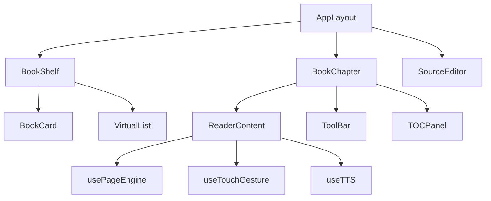
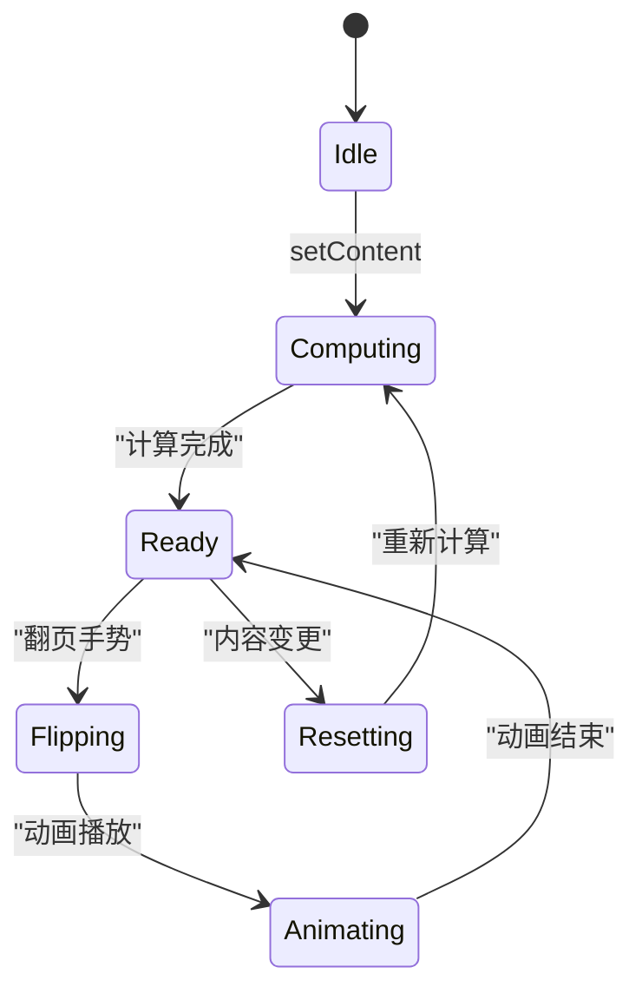

# Vue3 Web 重构方案 — 组件与页面

> 本文档为 Vue3 Web 重构方案的组件实现部分，与 [frontend.md](./frontend.md) 第15章"重构方案"对应。
> 现有架构（MPA + Element Plus）详见 frontend.md 第1-14章。

## 1. 路由设计

使用 `vue-router` 实现单页应用路由，采用 **Hash 模式**以兼容 Electron 打包和静态部署。

```typescript
// src/router/index.ts
import { createRouter, createWebHashHistory, RouteRecordRaw } from 'vue-router'

const routes: RouteRecordRaw[] = [
  {
    path: '/',
    name: 'Shelf',
    component: () => import('@/views/shelf/ShelfPage.vue'),
    meta: { title: '书架', icon: 'book', keepAlive: true }
  },
  {
    path: '/search',
    name: 'Search',
    component: () => import('@/views/search/SearchPage.vue'),
    meta: { title: '搜索', icon: 'search' }
  },
  {
    path: '/book/:url',
    name: 'BookDetail',
    component: () => import('@/views/book/BookDetailPage.vue'),
    meta: { title: '书籍详情' },
    props: true
  },
  {
    path: '/reader/:url/:chapter?',
    name: 'Reader',
    component: () => import('@/views/reader/ReaderPage.vue'),
    meta: { title: '阅读器', fullscreen: true },
    props: true
  },
  {
    path: '/sources',
    name: 'SourceManager',
    component: () => import('@/views/sources/SourceManagerPage.vue'),
    meta: { title: '书源管理', icon: 'source' }
  },
  {
    path: '/rss',
    name: 'RSS',
    component: () => import('@/views/rss/RSSPage.vue'),
    meta: { title: 'RSS 订阅', icon: 'rss' }
  },
  {
    path: '/replace',
    name: 'ReplaceRule',
    component: () => import('@/views/replace/ReplaceRulePage.vue'),
    meta: { title: '替换净化', icon: 'replace' }
  },
  {
    path: '/settings',
    name: 'Settings',
    component: () => import('@/views/settings/SettingsPage.vue'),
    meta: { title: '设置', icon: 'settings' }
  }
]

const router = createRouter({
  history: createWebHashHistory(),
  routes
})

export default router
```

### 路由元信息

| 路径 | 路由名 | 页面 | 说明 |
|------|--------|------|------|
| `/` | Shelf | 书架 | 图书网格展示、分组切换，支持 keepAlive |
| `/search` | Search | 搜索 | 多书源并行搜索、筛选 |
| `/book/:url` | BookDetail | 书籍详情 | 书籍信息、目录、操作（`:url` 为 Base64 编码后 URL） |
| `/reader/:url/:chapter?` | Reader | 阅读器 | 分页阅读、TTS、设置，fullscreen 模式隐藏导航栏 |
| `/sources` | SourceManager | 书源管理 | 书源列表、导入/导出/校验 |
| `/rss` | RSS | RSS 管理 | RSS 源列表、文章浏览 |
| `/replace` | ReplaceRule | 替换管理 | 替换规则列表、测试 |
| `/settings` | Settings | 设置 | 全局配置、主题、备份 |

**编码说明**：`:url` 参数使用 `encodeURIComponent(btoa(url))` 进行编码，防止特殊字符破坏路由解析。在组件内通过 `decodeURIComponent(atob(url))` 解码。

### 路由守卫

```typescript
// src/router/guards.ts
import router from './index'

// 标题更新守卫
router.beforeEach((to, _from, next) => {
  const title = to.meta.title as string
  if (title) {
    document.title = `${title} - Legado`
  }
  next()
})

// 全屏模式切换（阅读器隐藏导航栏）
router.afterEach((to) => {
  const app = document.getElementById('app')
  if (to.meta.fullscreen) {
    app?.classList.add('fullscreen-mode')
  } else {
    app?.classList.remove('fullscreen-mode')
  }
})
```

---

## 2. 组件树设计

### 2.1 组件层级关系图



### 2.2 完整组件树

```
App
└─ AppLayout                    全局布局（顶栏 + 侧边栏 + 主区域）
   ├─ NavHeader                顶栏导航
   │  ├─ AppLogo               Logo / 标题
   │  ├─ GlobalSearchInput     全局搜索入口
   │  └─ HeaderActions         主题切换 / 设置入口 / 用户菜单
   ├─ SideNav                  侧边栏（桌面端） / 底部导航（移动端）
   └─ <router-view>            主内容区域（keep-alive 缓存）
      │
      ├─ ShelfPage             书架页
      │  ├─ ShelfToolbar       书架工具栏（分组/排序/布局切换）
      │  ├─ BookGroupTab       分组切换 Tabs（全部/分组/本地/订阅）
      │  ├─ BookGrid            书籍网格
      │  │  └─ BookCard        书籍卡片（封面/标题/作者/进度）
      │  └─ ShelfEmpty         空状态占位
      │
      ├─ SearchPage            搜索页
      │  ├─ SearchInput        搜索输入框（联想/历史）
      │  ├─ SourceProgressBar  多书源并行搜索进度
      │  ├─ SearchResultList   搜索结果列表（虚拟滚动）
      │  │  └─ SearchResultItem 搜索结果项（书名/作者/来源/操作）
      │  ├─ SearchFilter       搜索过滤（来源/类型/排序）
      │  └─ SearchHistory      搜索历史
      │
      ├─ BookDetailPage        书籍详情页
      │  ├─ BookCover          封面大图
      │  ├─ BookInfoPanel      信息面板（作者/状态/简介/标签）
      │  ├─ BookActions        操作栏（加入书架/开始阅读/缓存）
      │  ├─ ChapterList        章节列表（虚拟滚动 + 已读标记）
      │  │  └─ ChapterItem     章节项
      │  └─ BookInfoEdit       书籍信息编辑弹窗
      │
      ├─ ReaderPage            阅读器页（核心页面）
      │  ├─ ReaderHeader       阅读器顶栏（返回/书名/菜单）
      │  ├─ ReaderContent      阅读内容区
      │  │  ├─ ReaderPageFlip  分页渲染（CSS columns 实现）
      │  │  ├─ ReaderScroll    滚动模式渲染
      │  │  └─ ReaderWebView   WebView 渲染（富文本/漫画）
      │  ├─ ReaderBottomBar    底部操作栏
      │  │  ├─ ReaderProgress  阅读进度条
      │  │  ├─ ReaderPageInfo  页码信息
      │  │  └─ ReaderActions   快捷操作（目录/亮度/字体/设置/TTS）
      │  ├─ ReaderMenu         全屏菜单（点击中间弹出）
      │  │  ├─ ReaderChapterNav 章节导航
      │  │  ├─ ReaderFontSize  字号调节
      │  │  ├─ ReaderTheme     主题切换
      │  │  └─ ReaderSettings  详细设置弹窗
      │  └─ ReaderTTSBar       TTS 朗读控制栏
      │
      ├─ SourceManagerPage     书源管理页
      │  ├─ SourceToolbar      工具栏（启用/禁用/导入/导出/校验）
      │  ├─ SourceList         书源列表（虚拟滚动）
      │  │  └─ SourceItem      书源项（名称/启用开关/分组/操作）
      │  ├─ SourceImportDialog 书源导入弹窗（URL/文件/剪切板）
      │  ├─ SourceExportDialog 书源导出弹窗
      │  ├─ SourceDebugPanel   书源调试面板
      │  └─ SourceEditDialog   书源编辑弹窗（JSON 编辑器）
      │
      ├─ ReplaceRulePage       替换净化页
      │  ├─ ReplaceToolbar     工具栏（添加/导入/导出/批量操作）
      │  ├─ ReplaceRuleList    替换规则列表
      │  │  └─ ReplaceRuleItem 替换规则项（名称/模式/启用开关）
      │  ├─ ReplaceRuleForm    规则编辑表单
      │  └─ ReplaceRuleTest    规则测试面板
      │
      ├─ SettingsPage          设置页
      │  ├─ ThemeSettings      主题设置
      │  ├─ ReadSettings       阅读设置
      │  ├─ DownloadSettings   下载设置
      │  ├─ BackupSettings      备份与恢复
      │  └─ AboutPanel         关于
      │
      └── RSSPage              RSS 管理页
         ├─ RSSSourceList      RSS 源列表
         ├─ RSSArticleList     RSS 文章列表（虚拟滚动）
         └─ RSSArticleReader   RSS 文章阅读器
```

### 2.2 核心组件示例

#### AppLayout 全局布局

```vue
<!-- src/layout/AppLayout.vue -->
<script setup lang="ts">
import { ref, onMounted, onUnmounted } from 'vue'
import NavHeader from './components/NavHeader.vue'
import SideNav from './components/SideNav.vue'
import BottomNav from './components/BottomNav.vue'

const isMobile = ref(false)

const checkMobile = () => {
  isMobile.value = window.innerWidth < 768
}

onMounted(() => {
  checkMobile()
  window.addEventListener('resize', checkMobile)
})

onUnmounted(() => {
  window.removeEventListener('resize', checkMobile)
})
</script>

<template>
  <div class="flex h-screen bg-base-100 text-base-content">
    <!-- 桌面端侧边栏 -->
    <SideNav v-if="!isMobile" class="hidden md:flex" />
    <div class="flex flex-col flex-1 overflow-hidden">
      <NavHeader />
      <main class="flex-1 overflow-y-auto p-4">
        <router-view v-slot="{ Component }">
          <keep-alive :include="['ShelfPage']">
            <component :is="Component" />
          </keep-alive>
        </router-view>
      </main>
    </div>
    <!-- 移动端底部导航 -->
    <BottomNav v-if="isMobile" class="md:hidden" />
  </div>
</template>
```

#### BookCard 书籍卡片

```vue
<!-- src/views/shelf/components/BookCard.vue -->
<script setup lang="ts">
import type { Book } from '@/stores/bookStore'

const props = defineProps<{
  book: Book
  layout: 'grid' | 'list'
}>()

const emit = defineEmits<{
  click: [url: string]
  longPress: [url: string]
}>()

// 长按检测
const longPressTimer = ref<number | null>(null)

const onTouchStart = (url: string) => {
  longPressTimer.value = window.setTimeout(() => {
    emit('longPress', url)
  }, 600)
}

const onTouchEnd = () => {
  if (longPressTimer.value) {
    clearTimeout(longPressTimer.value)
    longPressTimer.value = null
  }
}
</script>

<template>
  <div
    class="book-card cursor-pointer select-none"
    :class="[layout === 'grid' ? 'flex-col w-full' : 'flex-row']"
    @click="emit('click', book.bookUrl)"
    @touchstart="onTouchStart(book.bookUrl)"
    @touchend="onTouchEnd"
    @touchmove="onTouchEnd"
  >
    <!-- 封面 -->
    <div class="book-cover relative overflow-hidden rounded-lg shadow-md" :class="layout === 'grid' ? 'w-full aspect-[3/4]' : 'w-20 h-28 shrink-0'">
      
      <!-- 未读角标 -->
      <span
        v-if="book.unReadCount && book.unReadCount > 0"
        class="absolute top-1 right-1 badge badge-error badge-sm"
      >
        {{ book.unReadCount > 99 ? '99+' : book.unReadCount }}
      </span>
      <!-- 进度覆盖层 -->
      <div class="absolute bottom-0 left-0 right-0 h-1 bg-base-300">
        <div
          class="h-full bg-primary transition-all duration-300"
          :style="{ width: `${book.progress}%` }"
        />
      </div>
    </div>
    <!-- 信息 -->
    <div class="book-info mt-2" :class="layout === 'grid' ? 'text-center' : 'ml-3 flex-1'">
      <h3 class="font-medium text-sm line-clamp-2">{{ book.name }}</h3>
      <p class="text-xs text-base-content/60 mt-1 line-clamp-1">{{ book.author }}</p>
      <p v-if="layout === 'list'" class="text-xs text-base-content/40 mt-1">
        {{ book.lastChapterName }}
      </p>
    </div>
  </div>
</template>
```

#### ReaderContent 阅读内容

```vue
<!-- src/views/reader/components/ReaderContent.vue -->
<script setup lang="ts">
import { ref, watch, nextTick } from 'vue'
import { useReaderStore } from '@/stores/readerStore'

const props = defineProps<{
  chapterIndex: number
  pageMode: 'scroll' | 'column' | 'simulate' | 'cover' | 'slide' | 'none'
}>()

const emit = defineEmits<{
  pageChange: [current: number, total: number]
  wordSelected: [word: string, range: Range]
}>()

const store = useReaderStore()
const contentRef = ref<HTMLElement>()
const currentPage = ref(1)
const totalPages = ref(1)

// CSS columns 分页渲染
const columnStyle = computed(() => {
  if (props.pageMode === 'column') {
    return {
      columnWidth: `${store.settings.contentWidth}px`,
      columnGap: `${store.settings.columnGap}px`,
      height: '100vh',
      overflow: 'hidden'
    }
  }
  return {}
})

// 翻页方法
const nextPage = () => {
  if (currentPage.value < totalPages.value) {
    currentPage.value++
    emit('pageChange', currentPage.value, totalPages.value)
  }
}

const prevPage = () => {
  if (currentPage.value > 1) {
    currentPage.value--
    emit('pageChange', currentPage.value, totalPages.value)
  }
}

// 翻页动画过渡
const pageTransition = computed(() => {
  const map: Record<string, string> = {
    slide: 'transform 0.3s ease-out',
    simulate: 'transform 0.25s ease-in-out',
    cover: 'transform 0.3s ease-out',
    none: 'none'
  }
  return map[props.pageMode] || 'none'
})

// 长按选词
const longPressTimer = ref<number>()
const onContentTouchStart = (e: TouchEvent) => {
  longPressTimer.value = window.setTimeout(() => {
    const selection = window.getSelection()
    if (selection && selection.toString().trim()) {
      const range = selection.getRangeAt(0)
      emit('wordSelected', selection.toString().trim(), range)
    }
  }, 800)
}

const onContentTouchEnd = () => {
  if (longPressTimer.value) {
    clearTimeout(longPressTimer.value)
  }
}

watch(() => props.chapterIndex, async () => {
  currentPage.value = 1
  await nextTick()
  // 重新计算总页数
  if (contentRef.value && props.pageMode === 'column') {
    totalPages.value = Math.ceil(
      contentRef.value.scrollWidth / contentRef.value.clientWidth
    )
  }
})
</script>

<template>
  <div
    ref="contentRef"
    class="reader-content select-text"
    :style="columnStyle"
    @touchstart="onContentTouchStart"
    @touchend="onContentTouchEnd"
  >
    <!-- 内容渲染，支持 HTML 标签 -->
    <div
      class="reader-text"
      :style="{ fontSize: `${store.settings.fontSize}px`, lineHeight: store.settings.lineHeight, color: store.settings.textColor }"
      v-html="store.currentContent"
    />
  </div>
</template>
```

---

## 3. 阅读器核心实现

### 3.1 分页引擎

使用 CSS `columns` 实现分页效果，无需手动切割文本。



```typescript
// src/views/reader/composables/usePageEngine.ts
import { ref, nextTick, computed } from 'vue'

interface PageEngineOptions {
  container: HTMLElement
  columnWidth?: number
  columnGap?: number
  pageMode: 'scroll' | 'column' | 'simulate' | 'cover' | 'slide' | 'none'
}

export function usePageEngine(options: PageEngineOptions) {
  const currentPage = ref(0)
  const totalPages = ref(0)
  const isAnimating = ref(false)

  // CSS columns 分页
  const columnStyle = computed(() => {
    if (options.pageMode === 'column') {
      return {
        columnWidth: `${options.columnWidth ?? 400}px`,
        columnGap: `${options.columnGap ?? 30}px`,
        height: '100vh',
        overflow: 'hidden'
      }
    }
    return {}
  })

  // 翻页动画样式
  const animationStyle = computed(() => {
    if (isAnimating.value) {
      const map: Record<string, string> = {
        slide: 'transform 0.3s ease-out',
        simulate: 'transform 0.25s ease-in-out',
        cover: 'transform 0.3s ease-out',
        none: 'none'
      }
      return { transition: map[options.pageMode] || 'none' }
    }
    return {}
  })

  // 重新计算总页数
  async function recalcPages(): Promise<void> {
    await nextTick()
    if (options.container && options.pageMode === 'column') {
      totalPages.value = Math.ceil(
        options.container.scrollWidth / options.container.clientWidth
      )
    }
  }

  // 翻页
  async function turnPage(direction: 1 | -1): Promise<boolean> {
    const target = currentPage.value + direction
    if (target < 0 || target >= totalPages.value) return false

    isAnimating.value = true
    currentPage.value = target

    // 动画时长后释放锁
    await new Promise(resolve => setTimeout(resolve, 300))
    isAnimating.value = false
    return true
  }

  // 跳转到指定页
  async function jumpToPage(page: number): Promise<void> {
    const clamped = Math.max(0, Math.min(page, totalPages.value - 1))
    currentPage.value = clamped
  }

  // 重置
  function reset(): void {
    currentPage.value = 0
    totalPages.value = 0
  }

  return {
    currentPage,
    totalPages,
    isAnimating,
    columnStyle,
    animationStyle,
    recalcPages,
    turnPage,
    jumpToPage,
    reset
  }
}
```

### 3.2 触摸手势

```typescript
// src/views/reader/composables/useTouchGesture.ts
import { ref, onMounted, onUnmounted } from 'vue'

interface GestureOptions {
  element: HTMLElement | null
  onSwipeLeft?: () => void
  onSwipeRight?: () => void
  onTap?: (e: TouchEvent) => void
  onDoubleTap?: (e: TouchEvent) => void
  onLongPress?: (e: TouchEvent) => void
  threshold?: number          // 滑动手势阈值 px
  longPressDuration?: number  // 长按判定时间 ms
}

export function useTouchGesture(options: GestureOptions) {
  const {
    element,
    onSwipeLeft,
    onSwipeRight,
    onTap,
    onDoubleTap,
    onLongPress,
    threshold = 50,
    longPressDuration = 600
  } = options

  const startX = ref(0)
  const startY = ref(0)
  const startTime = ref(0)
  const longPressTimer = ref<number>()
  const lastTapTime = ref(0)
  const isSwiping = ref(false)

  function onTouchStart(e: TouchEvent): void {
    const touch = e.touches[0]
    startX.value = touch.clientX
    startY.value = touch.clientY
    startTime.value = Date.now()
    isSwiping.value = false

    // 长按定时器
    longPressTimer.value = window.setTimeout(() => {
      if (!isSwiping.value && onLongPress) {
        onLongPress(e)
      }
    }, longPressDuration)
  }

  function onTouchMove(e: TouchEvent): void {
    const touch = e.touches[0]
    const dx = touch.clientX - startX.value
    const dy = touch.clientY - startY.value

    if (Math.abs(dx) > 10 || Math.abs(dy) > 10) {
      isSwiping.value = true
      if (longPressTimer.value) {
        clearTimeout(longPressTimer.value)
      }
    }
  }

  function onTouchEnd(e: TouchEvent): void {
    if (longPressTimer.value) {
      clearTimeout(longPressTimer.value)
    }

    if (isSwiping.value) {
      const dx = e.changedTouches[0].clientX - startX.value
      if (Math.abs(dx) > threshold) {
        if (dx > 0 && onSwipeRight) {
          onSwipeRight()
        } else if (dx < 0 && onSwipeLeft) {
          onSwipeLeft()
        }
      }
      return
    }

    // 双击检测
    const now = Date.now()
    if (now - lastTapTime.value < 300 && onDoubleTap) {
      onDoubleTap(e)
      lastTapTime.value = 0
      return
    }
    lastTapTime.value = now

    // 单击
    if (onTap) {
      onTap(e)
    }
  }

  onMounted(() => {
    const el = element
    if (!el) return
    el.addEventListener('touchstart', onTouchStart, { passive: true })
    el.addEventListener('touchmove', onTouchMove, { passive: true })
    el.addEventListener('touchend', onTouchEnd, { passive: true })
  })

  onUnmounted(() => {
    const el = element
    if (!el) return
    el.removeEventListener('touchstart', onTouchStart)
    el.removeEventListener('touchmove', onTouchMove)
    el.removeEventListener('touchend', onTouchEnd)
  })
}
```

### 3.3 TTS 朗读同步

```typescript
// src/views/reader/composables/useTTS.ts
import { ref } from 'vue'
import { useReaderStore } from '@/stores/readerStore'

interface TTSOptions {
  onWordChange?: (charIndex: number) => void
  onEnd?: () => void
}

export function useTTS(options: TTSOptions = {}) {
  const store = useReaderStore()
  const utterance = ref<SpeechSynthesisUtterance | null>(null)
  const isSupported = ref('speechSynthesis' in window)

  // 朗读当前章节
  function speak(text: string, lang = 'zh-CN'): void {
    if (!isSupported.value) return

    window.speechSynthesis.cancel()

    utterance.value = new SpeechSynthesisUtterance(text)
    utterance.value.lang = lang
    utterance.value.rate = 1.0
    utterance.value.pitch = 1.0
    utterance.value.volume = 1.0

    // 进度同步（通过字数估算进度）
    const totalLength = text.length
    utterance.value.onboundary = (event) => {
      if (event.name === 'word' || event.name === 'sentence') {
        const charIndex = event.charIndex ?? 0
        const progress = Math.round((charIndex / totalLength) * 100)
        store.ttsProgress = progress
        options.onWordChange?.(charIndex)
      }
    }

    utterance.value.onend = () => {
      store.isTTSPlaying = false
      store.ttsProgress = 0
      options.onEnd?.()
    }

    utterance.value.onerror = () => {
      store.isTTSPlaying = false
    }

    window.speechSynthesis.speak(utterance.value)
  }

  // 暂停
  function pause(): void {
    window.speechSynthesis.pause()
  }

  // 继续
  function resume(): void {
    window.speechSynthesis.resume()
  }

  // 停止
  function stop(): void {
    window.speechSynthesis.cancel()
    store.isTTSPlaying = false
    store.ttsProgress = 0
  }

  // 切换播放/暂停
  function toggle(): void {
    if (store.isTTSPlaying) {
      if (window.speechSynthesis.paused) {
        resume()
      } else {
        pause()
      }
    }
  }

  // 获取可用语音列表
  function getVoices(): SpeechSynthesisVoice[] {
    return window.speechSynthesis.getVoices()
  }

  return {
    isSupported,
    speak,
    pause,
    resume,
    stop,
    toggle,
    getVoices
  }
}
```

### 3.4 阅读器页面整合

```vue
<!-- src/views/reader/ReaderPage.vue -->
<script setup lang="ts">
import { ref, onMounted, watch, nextTick } from 'vue'
import { useRoute, useRouter } from 'vue-router'
import { useReaderStore } from '@/stores/readerStore'
import { usePageEngine } from './composables/usePageEngine'
import { useTouchGesture } from './composables/useTouchGesture'
import { useTTS } from './composables/useTTS'
import ReaderContent from './components/ReaderContent.vue'
import ReaderMenu from './components/ReaderMenu.vue'
import ReaderTTSBar from './components/ReaderTTSBar.vue'

const route = useRoute()
const router = useRouter()
const store = useReaderStore()

const showMenu = ref(false)
const contentRef = ref<HTMLElement>()

const { currentPage, totalPages, recalcPages, turnPage } = usePageEngine({
  container: contentRef.value!,
  pageMode: store.settings.pageMode
})

const { speak, stop } = useTTS({
  onWordChange: (charIndex) => {
    // TTS 高亮同步
    store.ttsHighlightRange = { start: charIndex, end: charIndex + 50 }
  }
})

// 初始化阅读器
onMounted(async () => {
  const url = decodeURIComponent(atob(route.params.url as string))
  await store.initReader(url)

  const chapterIndex = route.params.chapter
    ? parseInt(route.params.chapter as string)
    : 0
  await store.loadChapter(chapterIndex)
  await nextTick()
  await recalcPages()
})

// 触摸手势
useTouchGesture({
  element: contentRef.value,
  onSwipeLeft: async () => {
    const moved = await turnPage(1)
    if (!moved) {
      // 已到末尾，进入下一章
      await store.nextPage()
      await nextTick()
      await recalcPages()
    }
  },
  onSwipeRight: async () => {
    const moved = await turnPage(-1)
    if (!moved) {
      await store.prevPage()
      await nextTick()
      await recalcPages()
    }
  },
  onTap: () => {
    showMenu.value = !showMenu.value
  }
})

// 500ms 去抖保存进度
watch(
  () => store.currentChapterIndex,
  () => store.saveProgress()
)
watch(
  () => currentPage.value,
  () => store.saveProgress()
)

// 返回书架
function goBack(): void {
  const bookUrl = route.params.url as string
  router.push({ name: 'BookDetail', params: { url: bookUrl } })
}
</script>

<template>
  <div class="reader-page relative h-screen w-full overflow-hidden" :style="{ filter: `brightness(${store.settings.brightness}%)` }">
    <!-- 阅读内容 -->
    <ReaderContent
      ref="contentRef"
      :chapter-index="store.currentChapterIndex"
      :page-mode="store.settings.pageMode"
      @page-change="(c, t) => { currentPage = c; totalPages = t }"
    />

    <!-- 点击中间弹出的全屏菜单 -->
    <ReaderMenu
      v-if="showMenu"
      @close="showMenu = false"
      @chapter-select="(i) => { showMenu = false; store.jumpToChapter(i) }"
    />

    <!-- TTS 朗读控制栏 -->
    <ReaderTTSBar
      v-if="store.isTTSPlaying"
      @stop="stop"
    />

    <!-- 左侧点按区域（上一页） -->
    <div class="absolute left-0 top-0 w-1/3 h-full z-10" @click="turnPage(-1)" />

    <!-- 右侧点按区域（下一页） -->
    <div class="absolute right-0 top-0 w-1/3 h-full z-10" @click="turnPage(1)" />
  </div>
</template>

<style scoped>
.reader-page {
  background-color: var(--reader-bg, #f5f0eb);
  color: var(--reader-text, #3a3a3a);
}
</style>
```

### 3.5 翻页动画模式

| 模式 | 实现方式 | 适用场景 |
|------|---------|---------|
| **scroll（滚动）** | `overflow-y: auto`，无分页 | 快速浏览 |
| **column（分栏）** | CSS `columns` 属性 | 类纸书分页，推荐默认模式 |
| **simulate（仿真）** | `transform: translateX()` + transition | 模拟真实翻页 |
| **cover（覆盖）** | 下一页从右侧滑入覆盖 | 类 App 翻页 |
| **slide（滑动）** | 整体内容平移 | 快速滑动 |
| **none（无动画）** | 立即切换无过渡 | 高性能需求 |

---

## 4. 移动端适配

### 4.1 自适应方案

```scss
// src/styles/responsive.scss

// 断点
$breakpoints: (
  'sm': 640px,
  'md': 768px,
  'lg': 1024px,
  'xl': 1280px
);

// 书架网格响应式
.book-grid {
  display: grid;
  grid-template-columns: repeat(auto-fill, minmax(120px, 1fr));
  gap: 16px;
  padding: 16px;

  @media (min-width: 640px) {
    grid-template-columns: repeat(3, 1fr);
    gap: 20px;
  }

  @media (min-width: 1024px) {
    grid-template-columns: repeat(4, 1fr);
    gap: 24px;
  }

  @media (min-width: 1280px) {
    grid-template-columns: repeat(5, 1fr);
    gap: 28px;
    padding: 24px;
  }
}

// 阅读器全屏沉浸
.reader-page {
  -webkit-tap-highlight-color: transparent;
  touch-action: manipulation;
  user-select: none;

  // 隐藏浏览器 UI
  &.fullscreen {
    position: fixed;
    top: 0;
    left: 0;
    right: 0;
    bottom: 0;
    z-index: 9999;
  }
}

// 移动端底部导航替代侧边栏
.bottom-nav {
  position: fixed;
  bottom: 0;
  left: 0;
  right: 0;
  z-index: 100;
  background: var(--color-surface);
  border-top: 1px solid var(--color-border);
  display: flex;
  justify-content: space-around;
  padding: 8px 0;
  padding-bottom: calc(8px + env(safe-area-inset-bottom));
}
```

### 4.2 响应式组件适配

| 组件 | 桌面端 | 移动端 |
|------|--------|--------|
| 导航 | 左侧固定侧边栏 | 底部 Tab 导航 |
| 书架 | 4-5列网格 | 2-3列网格 |
| 阅读器 | 居中容器，最大宽800px | 全宽沉浸模式 |
| 搜索 | 侧边搜索结果面板 | 全屏搜索结果 |
| 书源管理 | 左侧列表+右侧详情 | 卡片式列表+弹出编辑 |
| 弹窗 | 居中 Modal | 底部 Sheet |

---

## 5. 主题系统

### 5.1 CSS 变量设计

```css
/* src/styles/themes/variables.css */

:root {
  /* 通用颜色 */
  --color-primary: #409eff;
  --color-primary-hover: #66b1ff;
  --color-primary-active: #3a8ee6;
  --color-bg: #ffffff;
  --color-surface: #f5f7fa;
  --color-text: #303133;
  --color-text-secondary: #909399;
  --color-border: #dcdfe6;

  /* 阅读器颜色 */
  --reader-bg: #f5f0eb;
  --reader-text: #3a3a3a;
  --reader-highlight: #ffd700;

  /* 间距 */
  --spacing-xs: 4px;
  --spacing-sm: 8px;
  --spacing-md: 16px;
  --spacing-lg: 24px;
  --spacing-xl: 32px;

  /* 圆角 */
  --radius-sm: 4px;
  --radius-md: 8px;
  --radius-lg: 12px;
  --radius-xl: 16px;

  /* 阴影 */
  --shadow-sm: 0 1px 2px rgba(0, 0, 0, 0.06);
  --shadow-md: 0 4px 6px rgba(0, 0, 0, 0.07);
  --shadow-lg: 0 10px 15px rgba(0, 0, 0, 0.1);
}
```

### 5.2 主题切换实现

```typescript
// src/utils/theme.ts
import type { ThemeConfig, ThemeName } from '@/types/book'

const THEME_STORAGE_KEY = 'legado-theme'

export function getSavedTheme(): ThemeName {
  try {
    return (localStorage.getItem(THEME_STORAGE_KEY) as ThemeName) || 'light'
  } catch {
    return 'light'
  }
}

export function saveTheme(theme: ThemeName): void {
  try {
    localStorage.setItem(THEME_STORAGE_KEY, theme)
  } catch { /* ignore */ }
}

export function applyTheme(theme: ThemeConfig): void {
  const root = document.documentElement
  const c = theme.colors

  const map: Record<string, string> = {
    '--color-primary': c.primary,
    '--color-bg': c.background,
    '--color-surface': c.surface,
    '--color-text': c.text,
    '--color-text-secondary': c.textSecondary,
    '--color-border': c.border,
    '--reader-bg': theme.readerColors.bg,
    '--reader-text': theme.readerColors.text
  }

  Object.entries(map).forEach(([key, value]) => {
    root.style.setProperty(key, value)
  })

  // 设置 data-theme 属性，方便 CSS 选择器
  root.setAttribute('data-theme', theme.id)
}
```

---

## 6. 组件库选择

### 6.1 对比方案

| 方案 | 优势 | 劣势 | 适用场景 |
|------|------|------|---------|
| **Naive UI** | 全 TypeScript 支持，Tree-shaking 好，主题系统完善 | 包体积较大 | 推荐作为主 UI 库 |
| **Element Plus** | 生态成熟，文档丰富，Vue3 官方推荐 | 样式定制成本高 | 对表单/表格需求多的后台管理 |
| **Radix Vue** | 无样式 headless，完全自定义 | 需要额外写大量样式 | 阅读器自定义组件场景 |

### 6.2 推荐方案

```
主 UI 框架：Naive UI
    ├── 按钮/输入框/选择器/表单 → NButton, NInput, NSelect, NForm
    ├── 弹窗/抽屉/消息 → NModal, NDrawer, NMessage
    ├── 标签页/折叠面板 → NTabs, NCollapse
    ├── 表格/树 → NTable, NTree
    └── 上传/进度条 → NUpload, NProgress

虚拟滚动：vue-virtual-scroller
    └── 章节列表、搜索结果、书源列表

阅读器：自定义组件
    ├── 分页引擎 → 自研 usePageEngine composable
    ├── 触摸手势 → 自研 useTouchGesture composable
    ├── TTS 朗读 → 自研 useTTS composable（基于 Web Speech API）
    └── 主题切换 → 自研 theme.ts + CSS 变量

文本编辑器：CodeMirror 6（书源规则编辑、JSON 编辑）
```

### 6.3 组件使用示例

```vue
<script setup lang="ts">
import { NButton, NModal, NInput, NSelect, useMessage } from 'naive-ui'
import { RecycleScroller } from 'vue-virtual-scroller'
import 'vue-virtual-scroller/dist/vue-virtual-scroller.css'

const message = useMessage()

function handleSave() {
  message.success('保存成功')
}
</script>

<template>
  <n-modal title="书源编辑" :show="visible" @update:show="$emit('close')">
    <div class="p-4">
      <n-input v-model:value="sourceName" placeholder="书源名称" />
      <n-select v-model:value="sourceType" :options="typeOptions" />
      <n-button type="primary" @click="handleSave">保存</n-button>
    </div>
  </n-modal>

  <!-- 大数据列表虚拟滚动 -->
  <RecycleScroller
    :items="store.chapters"
    :item-size="44"
    key-field="url"
    class="h-full"
  >
    <template #default="{ item }">
      <ChapterItem :chapter="item" @click="selectChapter(item)" />
    </template>
  </RecycleScroller>
</template>
```

---

## 7. 目录结构

```
src/
├── api/                      # API 调用层
│   ├── request.ts            # Axios 封装
│   ├── books.ts              # 书籍/章节/内容 API
│   ├── sources.ts            # 书源/RSS API
│   ├── replace.ts            # 替换规则 API
│   ├── config.ts             # 配置 API
│   └── ws/                   # WebSocket 封装
│       ├── search.ts
│       └── debug.ts
├── assets/                   # 静态资源
│   ├── images/
│   └── icons/
├── components/               # 全局通用组件
│   ├── AppLayout.vue
│   ├── NavHeader.vue
│   ├── SideNav.vue
│   ├── BottomNav.vue
│   └── common/               # 通用 UI 组件
│       ├── VirtualList.vue
│       ├── ConfirmDialog.vue
│       └── Loading.vue
├── composables/              # 全局 composable
│   ├── useDebounce.ts
│   ├── useLocalStorage.ts
│   └── useElectron.ts
├── layouts/                  # 布局组件
│   └── ReaderLayout.vue
├── router/
│   ├── index.ts              # 路由配置
│   └── guards.ts             # 路由守卫
├── stores/                   # Pinia Store
│   ├── bookStore.ts
│   ├── readerStore.ts
│   ├── sourceStore.ts
│   ├── configStore.ts
│   └── replaceStore.ts
├── styles/
│   ├── main.scss             # 全局样式入口
│   ├── variables.css         # CSS 变量
│   ├── themes/               # 主题
│   │   ├── light.css
│   │   ├── dark.css
│   │   └── eye-care.css
│   └── responsive.scss       # 响应式适配
├── types/                    # TypeScript 类型
│   ├── book.ts               # 书籍/章节/搜索
│   ├── source.ts             # 书源/RSS
│   ├── config.ts             # 配置类型
│   └── api.ts                # API 响应类型
├── utils/                    # 工具函数
│   ├── format.ts             # 格式化
│   ├── storage.ts            # 本地存储
│   ├── theme.ts              # 主题工具
│   └── error.ts              # 错误处理
├── views/                    # 页面视图
│   ├── shelf/
│   │   ├── ShelfPage.vue
│   │   └── components/
│   │       ├── BookCard.vue
│   │       ├── BookGrid.vue
│   │       ├── BookGroupTab.vue
│   │       └── ShelfToolbar.vue
│   ├── search/
│   │   ├── SearchPage.vue
│   │   └── components/
│   │       ├── SearchInput.vue
│   │       ├── SourceProgressBar.vue
│   │       ├── SearchResultList.vue
│   │       └── SearchResultItem.vue
│   ├── book/
│   │   ├── BookDetailPage.vue
│   │   └── components/
│   │       ├── BookCover.vue
│   │       ├── BookInfoPanel.vue
│   │       └── ChapterList.vue
│   ├── reader/
│   │   ├── ReaderPage.vue
│   │   └── components/
│   │       ├── ReaderContent.vue
│   │       ├── ReaderMenu.vue
│   │       ├── ReaderTTSBar.vue
│   │       └── ReaderSettings.vue
│   ├── sources/
│   │   ├── SourceManagerPage.vue
│   │   └── components/
│   │       ├── SourceList.vue
│   │       ├── SourceDebugPanel.vue
│   │       └── SourceEditDialog.vue
│   ├── replace/
│   │   ├── ReplaceRulePage.vue
│   │   └── components/
│   │       ├── ReplaceRuleList.vue
│   │       ├── ReplaceRuleForm.vue
│   │       └── ReplaceRuleTest.vue
│   ├── settings/
│   │   └── SettingsPage.vue
│   └── rss/
│       ├── RSSPage.vue
│       └── components/
│           ├── RSSSourceList.vue
│           └── RSSArticleReader.vue
├── App.vue
└── main.ts
```

---

## 8. 关键技术点

### 8.1 虚拟滚动

使用 `vue-virtual-scroller`（或自研）处理大数据列表：

| 场景 | 预估数据量 | 组件 |
|------|-----------|------|
| 章节列表 | 数百~数千章 | RecycleScroller |
| 搜索结果 | 数百~数千条 | RecycleScroller |
| 书源列表 | 数百~数千个 | RecycleScroller |
| 替换规则 | 数十~数百个 | 普通 v-for |

### 8.2 WebSocket 生命周期

```
搜索流程：
1. 前端调用 REST API 创建搜索任务 → 获取 sessionId
2. 前端建立 WebSocket 连接：ws://host/ws/search?session={sessionId}
3. 后端逐书源搜索结果，通过 WebSocket 推送：
   - progress: 当前进度（已搜索 N 个书源 / 总书源数）
   - result: 单个书源的搜索结果
   - complete: 全部完成（附带汇总统计）
4. 前端实时更新进度条和结果列表
5. 搜索完成 / 用户取消 → 关闭 WebSocket
```

### 8.3 阅读进度同步策略

```
保存时机：
- 章节切换时（500ms 去抖）
- 页面切换时（500ms 去抖）
- 应用进入后台时（visibilitychange 事件）
- 手动点击保存按钮

保存内容：
{
  bookUrl: string,
  chapterIndex: number,
  pageIndex: number,
  progress: number,          // 0-100 阅读进度
  timestamp: number          // 时间戳，用于冲突处理
}

冲突处理：
- 以 timestamp 较新者为准
- 打开阅读器时优先使用服务端进度
```

### 8.4 Electron 适配层

```typescript
// src/composables/useElectron.ts
interface ElectronAPI {
  readFile: (path: string) => Promise<string>
  writeFile: (path: string, content: string) => Promise<void>
  openFileDialog: (filters: { name: string; extensions: string[] }[]) => Promise<string | null>
  saveFileDialog: (defaultName: string) => Promise<string | null>
  getAppPath: () => Promise<string>
  onWindowClose: (callback: () => void) => void
}

export function useElectron() {
  const api = (window as unknown as Record<string, unknown>).electronAPI as ElectronAPI | undefined
  const isElectron = ref(!!api)

  return {
    isElectron,
    api
  }
}
```

---

## 9. 错误处理策略

```typescript
// src/utils/error.ts
import { useMessage } from 'naive-ui'

export function handleError(error: unknown): void {
  if (import.meta.env.DEV) {
    console.error('[ErrorHandler]', error)
  }

  const message = useMessage()

  if (axios.isAxiosError(error)) {
    const status = error.response?.status
    const data = error.response?.data as Record<string, unknown> | undefined

    switch (status) {
      case 400:
        message.warning((data?.detail as string) || '请求参数错误')
        break
      case 401:
        message.error('登录已过期，请重新登录')
        // 跳转登录页
        break
      case 403:
        message.warning('没有权限执行此操作')
        break
      case 404:
        message.warning('请求的资源不存在')
        break
      case 429:
        message.warning('请求过于频繁，请稍后再试')
        break
      case 500:
      case 502:
      case 503:
        message.error('服务器异常，请稍后再试')
        break
      default:
        message.error(data?.detail as string || '网络请求失败')
    }
  } else if (error instanceof Error) {
    message.error(error.message)
  } else {
    message.error('发生未知错误')
  }
}
```

---

## 10. 性能优化建议

| 优化项 | 措施 | 预期效果 |
|--------|------|---------|
| 虚拟滚动 | 章节/搜索/书源列表使用 RecycleScroller | 万级数据流畅渲染 |
| 图片懒加载 | `v-lazy` 指令 + 占位图 | 书架/搜索结果首屏加速 |
| 路由懒加载 | `() => import()` | 首屏包体积减少 50%+ |
| keep-alive | 书架页面缓存 | 切换 Tab 无重新渲染 |
| 阅读器 CSS 分页 | CSS columns 替代 JS 分页 | 零开销分页渲染 |
| 去抖保存 | 500ms debounce 保存进度 | 减少 90%+ 的写请求 |
| 组件异步加载 | `defineAsyncComponent` | 非首屏组件延迟加载 |
| WebSocket 复用 | 单连接多通道 | 减少连接建立开销 |

---

## 11. 开发环境配置

```typescript
// vite.config.ts
import { defineConfig } from 'vite'
import vue from '@vitejs/plugin-vue'
import { resolve } from 'path'

export default defineConfig({
  plugins: [vue()],
  resolve: {
    alias: {
      '@': resolve(__dirname, 'src')
    }
  },
  server: {
    port: 5173,
    proxy: {
      '/api': {
        target: 'http://localhost:8000',
        changeOrigin: true
      },
      '/ws': {
        target: 'ws://localhost:8000',
        ws: true
      }
    }
  }
})
```

```json5
// tsconfig.json（核心配置）
{
  "compilerOptions": {
    "target": "ES2020",
    "module": "ESNext",
    "moduleResolution": "bundler",
    "strict": true,
    "jsx": "preserve",
    "resolveJsonModule": true,
    "isolatedModules": true,
    "esModuleInterop": true,
    "lib": ["ES2020", "DOM", "DOM.Iterable"],
    "skipLibCheck": true,
    "noEmit": true,
    "paths": {
      "@/*": ["./src/*"]
    }
  },
  "include": ["src/**/*.ts", "src/**/*.d.ts", "src/**/*.vue"],
  "references": [{ "path": "./tsconfig.node.json" }]
}
```
