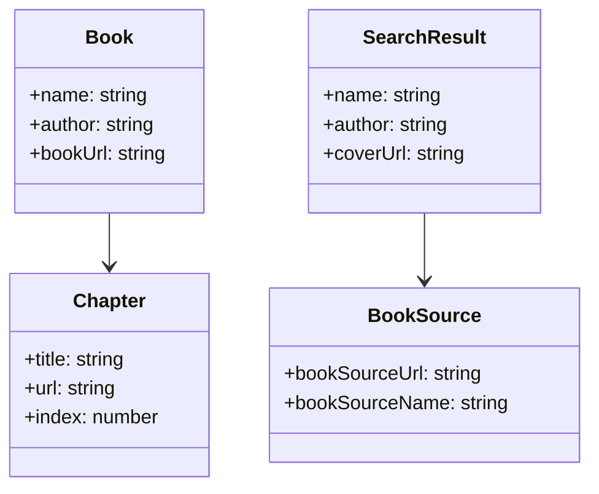
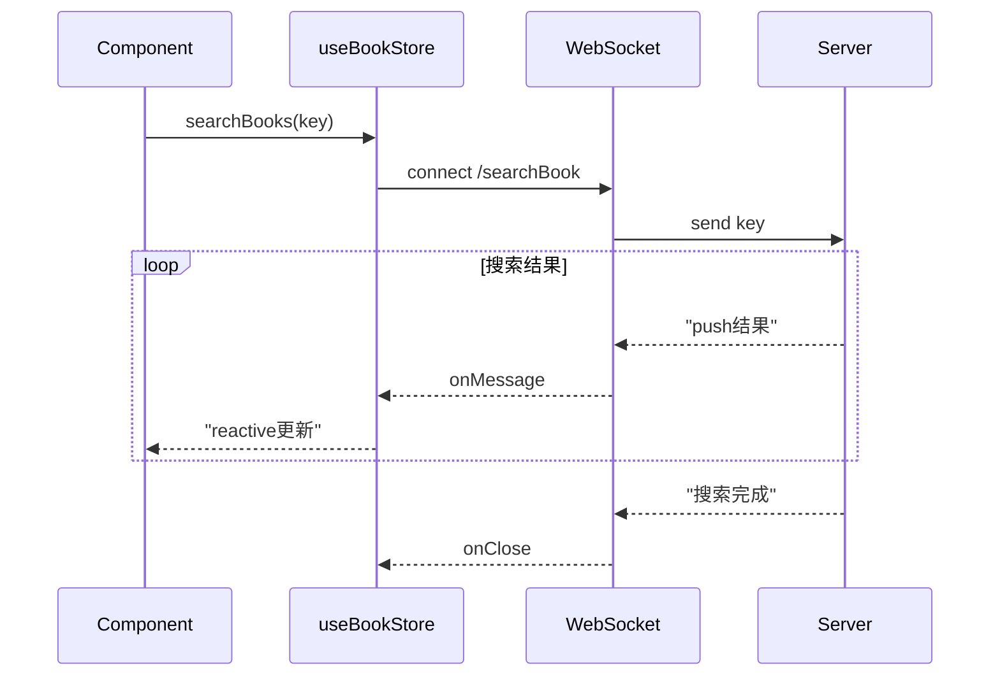

# Vue3 Web 重构方案 — Store 与 API 层

> 本文档为 Vue3 Web 重构方案的状态管理和 API 调用层部分，与 [frontend.md](./frontend.md) 第15章"重构方案"对应。

## 1. TypeScript 类型定义



```typescript
// src/types/book.ts
export interface Book {
  bookUrl: string            // 唯一标识（书籍 URL 的 Base64）
  name: string
  author: string
  coverUrl: string
  groupId?: number           // 分组 ID
  groupName?: string          // 分组名称
  sourceName: string          // 书源名称
  sourceUrl: string           // 书源 URL
  intro: string
  kind: string                // 分类标签
  origin: 'local' | 'network'
  progress: number            // 0-100 阅读进度百分比
  unReadCount: number         // 未读章节数
  totalChapterCount: number   // 总章节数
  lastChapterName: string     // 最后章节名
  lastReadTime: number        // 最后阅读时间戳
  isUpdate: boolean           // 是否有更新
  allowUpdate: boolean        // 是否允许更新
}

export interface Chapter {
  index: number
  title: string
  url: string
  isRead: boolean
  isDownload: boolean
  bookUrl: string
}

export interface SearchResult {
  book: Book
  sourceName: string
  sourceUrl: string
  searchTime: number
  isFromCache: boolean
  matchScore: number
}

export interface BookSource {
  sourceUrl: string           // 书源 URL 作为唯一标识
  sourceName: string
  sourceType: 'book' | 'rss' | 'both'
  enabled: boolean
  groupId: number
  groupName: string
  order: number
  // 规则（JSON 结构）
  ruleBookInfo: Record<string, any>
  ruleSearch: Record<string, any>
  ruleToc: Record<string, any>
  ruleContent: Record<string, any>
  // 统计
  lastCheckTime: number
  checkCount: number
  successCount: number
  failCount: number
}

export interface ReplaceRule {
  id: string
  name: string
  pattern: string             // 正则模式
  replacement: string         // 替换文本
  isRegex: boolean            // 是否为正则
  isEnabled: boolean
  scope: 'content' | 'title' | 'all'
  groupName?: string
  order: number
}

export interface RSSSource {
  sourceUrl: string
  sourceName: string
  groupName: string
  enabled: boolean
  lastUpdateTime: number
  articleCount: number
}

export interface RSSArticle {
  id: string
  title: string
  summary: string
  link: string
  author: string
  publishTime: number
  isRead: boolean
  sourceUrl: string
}

export interface ReadSettings {
  fontSize: number              // 14-32
  fontFamily: string            // 字体族
  lineHeight: number            // 1.2-2.0
  contentWidth: number          // 内容区宽度 px
  columnGap: number             // 分页间隔 px
  pageMode: 'scroll' | 'column' | 'simulate' | 'cover' | 'slide' | 'none'
  animationSpeed: number        // 动画速度 ms
  brightness: number            // 亮度 0-100
  bgColor: string
  textColor: string
}

export interface ThemeConfig {
  id: string
  name: string
  isPreset: boolean
  colors: {
    primary: string
    background: string
    surface: string
    text: string
    textSecondary: string
    border: string
  }
  readerColors: {
    bg: string
    text: string
  }
}
```

---

## 2. useBookStore

```typescript
// src/stores/bookStore.ts
import { defineStore } from 'pinia'
import { ref, computed } from 'vue'
import type { Book, Chapter, SearchResult } from '@/types/book'
import { bookApi } from '@/api/books'

export const useBookStore = defineStore('book', () => {
  /* ========== State ========== */
  // 书架
  const bookshelf = ref<Book[]>([])
  const currentGroup = ref<string>('all')
  const groups = ref<{ id: number; name: string; count: number }[]>([])

  // 当前选中书籍
  const currentBook = ref<Book | null>(null)

  // 搜索结果
  const searchResults = ref<SearchResult[]>([])
  const isSearching = ref(false)
  const searchKeywords = ref('')

  /* ========== Getters ========== */
  const filteredBooks = computed(() => {
    if (currentGroup.value === 'all') return bookshelf.value
    return bookshelf.value.filter(b => b.groupName === currentGroup.value)
  })

  const unReadCount = computed(() =>
    bookshelf.value.reduce((sum, b) => sum + b.unReadCount, 0)
  )

  const sortedBooks = computed(() => {
    return [...filteredBooks.value].sort((a, b) => b.lastReadTime - a.lastReadTime)
  })

  /* ========== Actions ========== */
  // 加载书架
  async function loadBookshelf(): Promise<void> {
    const res = await bookApi.getBookshelf()
    bookshelf.value = res.data
    // 提取分组信息
    const groupMap = new Map<string, number>()
    res.data.forEach(b => {
      const name = b.groupName || '默认'
      groupMap.set(name, (groupMap.get(name) || 0) + 1)
    })
    groups.value = [
      { id: -1, name: 'all', count: res.data.length },
      ...Array.from(groupMap.entries()).map(([name, count], i) => ({
        id: i,
        name,
        count
      }))
    ]
  }

  // 搜索
  async function search(keywords: string, sources?: string[]): Promise<void> {
    if (!keywords.trim()) return
    isSearching.value = true
    searchKeywords.value = keywords
    try {
      searchResults.value = await bookApi.search(keywords, sources)
    } finally {
      isSearching.value = false
    }
  }

  // 加入书架
  async function addToShelf(book: Book): Promise<void> {
    await bookApi.addToShelf(book)
    bookshelf.value.unshift(book)
  }

  // 从书架移除
  async function removeFromShelf(url: string): Promise<void> {
    await bookApi.removeFromShelf(url)
    bookshelf.value = bookshelf.value.filter(b => b.bookUrl !== url)
  }

  // 更新书籍进度
  async function updateBookProgress(url: string, progress: number): Promise<void> {
    const book = bookshelf.value.find(b => b.bookUrl === url)
    if (book) {
      book.progress = progress
      book.lastReadTime = Date.now()
    }
    await bookApi.updateProgress(url, progress)
  }

  // 设置当前阅读书籍
  function setCurrentBook(book: Book | null): void {
    currentBook.value = book
  }

  // 清除搜索
  function clearSearch(): void {
    searchResults.value = []
    searchKeywords.value = ''
  }

  return {
    bookshelf,
    currentGroup,
    groups,
    currentBook,
    searchResults,
    isSearching,
    searchKeywords,
    filteredBooks,
    unReadCount,
    sortedBooks,
    loadBookshelf,
    search,
    addToShelf,
    removeFromShelf,
    updateBookProgress,
    setCurrentBook,
    clearSearch
  }
})
```

---

## 3. useReaderStore

```typescript
// src/stores/readerStore.ts
import { defineStore } from 'pinia'
import { ref, computed } from 'vue'
import type { Chapter, ReadSettings } from '@/types/book'
import { bookApi } from '@/api/books'

export const useReaderStore = defineStore('reader', () => {
  /* ========== State ========== */
  const bookUrl = ref('')
  const chapters = ref<Chapter[]>([])
  const currentChapterIndex = ref(0)
  const currentContent = ref('')
  const isLoadingContent = ref(false)
  const currentPageIndex = ref(0)
  const totalPages = ref(1)

  // 阅读设置
  const settings = ref<ReadSettings>({
    fontSize: 18,
    fontFamily: 'sans-serif',
    lineHeight: 1.6,
    contentWidth: 400,
    columnGap: 30,
    pageMode: 'column',
    animationSpeed: 300,
    brightness: 100,
    bgColor: '#f5f0eb',
    textColor: '#3a3a3a'
  })

  // TTS 状态
  const isTTSPlaying = ref(false)
  const ttsProgress = ref(0)           // 0-100
  const ttsHighlightRange = ref<{ start: number; end: number } | null>(null)

  /* ========== Getters ========== */
  const currentChapter = computed(() =>
    chapters.value[currentChapterIndex.value] ?? null
  )

  const chapterCount = computed(() => chapters.value.length)

  const readingProgress = computed(() => {
    if (chapterCount.value === 0) return 0
    return Math.round((currentChapterIndex.value / chapterCount.value) * 100)
  })

  /* ========== Actions ========== */
  // 初始化阅读器
  async function initReader(url: string): Promise<void> {
    bookUrl.value = url
    const res = await bookApi.getChapters(url)
    chapters.value = res.data
  }

  // 加载章节内容
  async function loadChapter(chapterIndex: number): Promise<void> {
    if (chapterIndex < 0 || chapterIndex >= chapters.value.length) return
    isLoadingContent.value = true
    currentChapterIndex.value = chapterIndex
    currentPageIndex.value = 0
    try {
      const chapter = chapters.value[chapterIndex]
      const res = await bookApi.getChapterContent(bookUrl.value, chapter.url)
      currentContent.value = res.data
      markChapterAsRead(chapterIndex)
    } finally {
      isLoadingContent.value = false
    }
  }

  // 标记章节已读
  function markChapterAsRead(index: number): void {
    if (chapters.value[index]) {
      chapters.value[index].isRead = true
    }
  }

  // 下一页
  function nextPage(): boolean {
    if (currentPageIndex.value < totalPages.value - 1) {
      currentPageIndex.value++
      return true
    }
    // 进入下一章
    if (currentChapterIndex.value < chapters.value.length - 1) {
      loadChapter(currentChapterIndex.value + 1)
      return true
    }
    return false
  }

  // 上一页
  function prevPage(): boolean {
    if (currentPageIndex.value > 0) {
      currentPageIndex.value--
      return true
    }
    if (currentChapterIndex.value > 0) {
      loadChapter(currentChapterIndex.value - 1)
      return true
    }
    return false
  }

  // 跳转到章节
  function jumpToChapter(chapterIndex: number): void {
    loadChapter(chapterIndex)
  }

  // 跳转到进度（百分比）
  function jumpToProgress(progress: number): void {
    const targetIndex = Math.floor((progress / 100) * chapters.value.length)
    const clampedIndex = Math.max(0, Math.min(targetIndex, chapters.value.length - 1))
    loadChapter(clampedIndex)
  }

  // 保存阅读进度（500ms 去抖）
  const saveProgress = useDebounceFn(async () => {
    await bookApi.saveProgress(bookUrl.value, {
      chapterIndex: currentChapterIndex.value,
      pageIndex: currentPageIndex.value,
      progress: readingProgress.value
    })
  }, 500)

  // 更新设置
  function updateSettings(patch: Partial<ReadSettings>): void {
    Object.assign(settings.value, patch)
  }

  return {
    bookUrl,
    chapters,
    currentChapterIndex,
    currentContent,
    isLoadingContent,
    currentPageIndex,
    totalPages,
    settings,
    isTTSPlaying,
    ttsProgress,
    ttsHighlightRange,
    currentChapter,
    chapterCount,
    readingProgress,
    initReader,
    loadChapter,
    nextPage,
    prevPage,
    jumpToChapter,
    jumpToProgress,
    saveProgress,
    updateSettings
  }
})
```

---

## 4. useSourceStore

```typescript
// src/stores/sourceStore.ts
import { defineStore } from 'pinia'
import { ref } from 'vue'
import type { BookSource, RSSSource } from '@/types/book'
import { sourceApi } from '@/api/sources'

export const useSourceStore = defineStore('source', () => {
  const bookSources = ref<BookSource[]>([])
  const rssSources = ref<RSSSource[]>([])
  const currentSource = ref<BookSource | null>(null)
  const isLoading = ref(false)

  // 加载书源列表
  async function loadBookSources(): Promise<void> {
    const res = await sourceApi.getBookSources()
    bookSources.value = res.data
  }

  // 启用/禁用书源
  async function toggleSource(url: string, enabled: boolean): Promise<void> {
    const source = bookSources.value.find(s => s.bookSourceUrl === url)
    if (source) {
      source.enabled = enabled
    }
    await sourceApi.toggleSource(url, enabled)
  }

  // 批量操作
  async function batchToggle(urls: string[], enabled: boolean): Promise<void> {
    for (const url of urls) {
      const source = bookSources.value.find(s => s.bookSourceUrl === url)
      if (source) source.enabled = enabled
    }
    await sourceApi.batchToggle(urls, enabled)
  }

  async function batchDelete(urls: string[]): Promise<void> {
    bookSources.value = bookSources.value.filter(s => !urls.includes(s.bookSourceUrl))
    await sourceApi.batchDelete(urls)
  }

  // 导入书源
  async function importSources(content: string, type: 'url' | 'file' | 'clipboard'): Promise<void> {
    const res = await sourceApi.importSources(content, type)
    bookSources.value.push(...res.data)
  }

  // 导出书源
  async function exportSources(urls: string[]): Promise<string> {
    const res = await sourceApi.exportSources(urls)
    return res.data
  }

  // 校验书源
  async function checkSource(url: string): Promise<{ success: boolean; message: string }> {
    const source = bookSources.value.find(s => s.bookSourceUrl === url)
    if (source) {
      source.lastCheckTime = Date.now()
    }
    const res = await sourceApi.checkSource(url)
    if (source) {
      if (res.data.success) source.successCount++
      else source.failCount++
      source.checkCount++
    }
    return res.data
  }

  return {
    bookSources,
    rssSources,
    currentSource,
    isLoading,
    loadBookSources,
    toggleSource,
    batchToggle,
    batchDelete,
    importSources,
    exportSources,
    checkSource
  }
})
```

---

## 5. useConfigStore

```typescript
// src/stores/configStore.ts
import { defineStore } from 'pinia'
import { ref, watch } from 'vue'
import type { ThemeConfig } from '@/types/book'
import { configApi } from '@/api/config'

export type ThemeName = 'light' | 'dark' | 'eye-care' | 'green' | 'custom'

export const useConfigStore = defineStore('config', () => {
  /* ========== 预设主题 ========== */
  const presetThemes: Record<Exclude<ThemeName, 'custom'>, ThemeConfig> = {
    light: {
      id: 'light', name: '日间', isPreset: true,
      colors: {
        primary: '#409eff',
        background: '#ffffff',
        surface: '#f5f7fa',
        text: '#303133',
        textSecondary: '#909399',
        border: '#dcdfe6'
      },
      readerColors: { bg: '#f5f0eb', text: '#3a3a3a' }
    },
    dark: {
      id: 'dark', name: '夜间', isPreset: true,
      colors: {
        primary: '#409eff',
        background: '#1a1a2e',
        surface: '#16213e',
        text: '#e0e0e0',
        textSecondary: '#a0a0a0',
        border: '#2a2a4a'
      },
      readerColors: { bg: '#1a1a2e', text: '#c0c0c0' }
    },
    'eye-care': {
      id: 'eye-care', name: '护眼', isPreset: true,
      colors: {
        primary: '#409eff',
        background: '#c7edcc',
        surface: '#b8d9c0',
        text: '#3a3a3a',
        textSecondary: '#707070',
        border: '#a8c9b0'
      },
      readerColors: { bg: '#c7edcc', text: '#3a3a3a' }
    },
    green: {
      id: 'green', name: '绿色', isPreset: true,
      colors: {
        primary: '#67c23a',
        background: '#f0f9eb',
        surface: '#e1f3d8',
        text: '#303133',
        textSecondary: '#909399',
        border: '#c2e7b0'
      },
      readerColors: { bg: '#e1f3d8', text: '#3a3a3a' }
    }
  }

  /* ========== State ========== */
  const currentTheme = ref<ThemeName>('light')
  const customTheme = ref<ThemeConfig | null>(null)
  const readConfig = ref({
    fontSize: 18,
    fontFamily: 'sans-serif',
    lineHeight: 1.6,
    pageMode: 'column' as const,
    brightness: 100
  })
  const generalConfig = ref({
    autoCheckUpdate: true,
    downloadPath: '',
    proxyUrl: '',
    proxyEnabled: false,
    searchConcurrency: 5,
    cacheSize: 0
  })

  /* ========== Getters ========== */
  const activeTheme = computed<ThemeConfig>(() => {
    if (currentTheme.value === 'custom' && customTheme.value) {
      return customTheme.value
    }
    return presetThemes[currentTheme.value] ?? presetThemes.light
  })

  /* ========== Actions ========== */
  // 切换主题
  function setTheme(theme: ThemeName): void {
    currentTheme.value = theme
    applyTheme()
    configApi.saveTheme(theme)
  }

  // 应用主题到 DOM（CSS 变量）
  function applyTheme(): void {
    const t = activeTheme.value
    const root = document.documentElement
    const c = t.colors
    root.style.setProperty('--color-primary', c.primary)
    root.style.setProperty('--color-bg', c.background)
    root.style.setProperty('--color-surface', c.surface)
    root.style.setProperty('--color-text', c.text)
    root.style.setProperty('--color-text-secondary', c.textSecondary)
    root.style.setProperty('--color-border', c.border)
    // 阅读器颜色
    const rc = t.readerColors
    root.style.setProperty('--reader-bg', rc.bg)
    root.style.setProperty('--reader-text', rc.text)
  }

  // 自定义主题
  function setCustomTheme(config: ThemeConfig): void {
    customTheme.value = config
    currentTheme.value = 'custom'
    applyTheme()
    configApi.saveCustomTheme(config)
  }

  // 加载配置
  async function loadConfig(): Promise<void> {
    const res = await configApi.getConfig()
    generalConfig.value = { ...generalConfig.value, ...res.data.general }
    readConfig.value = { ...readConfig.value, ...res.data.read }
    if (res.data.theme) {
      currentTheme.value = res.data.theme.current
      customTheme.value = res.data.theme.custom ?? null
      applyTheme()
    }
  }

  // 保存通用配置
  async function saveGeneralConfig(): Promise<void> {
    await configApi.saveGeneralConfig(generalConfig.value)
  }

  // 保存阅读配置
  async function saveReadConfig(): Promise<void> {
    await configApi.saveReadConfig(readConfig.value)
  }

  // 监听配置变化自动保存
  watch(readConfig, saveReadConfig, { deep: true, debounce: 1000 })
  watch(generalConfig, saveGeneralConfig, { deep: true, debounce: 1000 })

  return {
    currentTheme,
    customTheme,
    readConfig,
    generalConfig,
    activeTheme,
    presetThemes,
    setTheme,
    applyTheme,
    setCustomTheme,
    loadConfig,
    saveGeneralConfig,
    saveReadConfig
  }
})
```

---

## 6. useReplaceStore

```typescript
// src/stores/replaceStore.ts
import { defineStore } from 'pinia'
import { ref } from 'vue'
import type { ReplaceRule } from '@/types/book'
import { replaceApi } from '@/api/replace'

export const useReplaceStore = defineStore('replace', () => {
  const replaceRules = ref<ReplaceRule[]>([])
  const isLoading = ref(false)

  async function loadRules(): Promise<void> {
    const res = await replaceApi.getRules()
    replaceRules.value = res.data
  }

  async function addRule(rule: Omit<ReplaceRule, 'id'>): Promise<void> {
    const res = await replaceApi.addRule(rule)
    replaceRules.value.push(res.data)
  }

  async function updateRule(id: string, data: Partial<ReplaceRule>): Promise<void> {
    await replaceApi.updateRule(id, data)
    const idx = replaceRules.value.findIndex(r => r.id === id)
    if (idx >= 0) {
      Object.assign(replaceRules.value[idx], data)
    }
  }

  async function deleteRule(id: string): Promise<void> {
    await replaceApi.deleteRule(id)
    replaceRules.value = replaceRules.value.filter(r => r.id !== id)
  }

  async function toggleRule(id: string, enabled: boolean): Promise<void> {
    const rule = replaceRules.value.find(r => r.id === id)
    if (rule) rule.isEnabled = enabled
    await replaceApi.toggleRule(id, enabled)
  }

  async function batchDelete(ids: string[]): Promise<void> {
    await replaceApi.batchDelete(ids)
    replaceRules.value = replaceRules.value.filter(r => !ids.includes(r.id))
  }

  async function testRule(pattern: string, replacement: string, text: string, isRegex: boolean): Promise<string> {
    const res = await replaceApi.testRule({ pattern, replacement, text, isRegex })
    return res.data
  }

  return {
    replaceRules,
    isLoading,
    loadRules,
    addRule,
    updateRule,
    deleteRule,
    toggleRule,
    batchDelete,
    testRule
  }
})
```

---

## 7. API 调用层

> ⚠️ 重构方案使用 REST 风格 API 端点，与现有 web-service.md 中的端点不同。重构需要新后端 API 层。

### 7.1 基础请求封装

```typescript
// src/api/request.ts
import axios, { AxiosRequestConfig, AxiosResponse } from 'axios'
import { handleError } from '@/utils/error'

const instance = axios.create({
  baseURL: import.meta.env.VITE_API_BASE || 'http://localhost:8000/api',
  timeout: 30000,
  headers: { 'Content-Type': 'application/json' }
})

// 请求拦截器
instance.interceptors.request.use(
  (config) => {
    // Token 注入
    const token = localStorage.getItem('token')
    if (token) {
      config.headers.Authorization = `Bearer ${token}`
    }
    return config
  },
  (error) => Promise.reject(error)
)

// 响应拦截器
instance.interceptors.response.use(
  (response: AxiosResponse) => response,
  (error) => {
    handleError(error)
    return Promise.reject(error)
  }
)

// 通用请求方法
export function request<T>(config: AxiosRequestConfig): Promise<AxiosResponse<T>> {
  return instance.request<T>(config)
}

export function get<T>(url: string, params?: Record<string, unknown>): Promise<AxiosResponse<T>> {
  return instance.get<T>(url, { params })
}

export function post<T>(url: string, data?: unknown): Promise<AxiosResponse<T>> {
  return instance.post<T>(url, data)
}

export function put<T>(url: string, data?: unknown): Promise<AxiosResponse<T>> {
  return instance.put<T>(url, data)
}

export function del<T>(url: string): Promise<AxiosResponse<T>> {
  return instance.delete<T>(url)
}
```

### 7.2 书籍相关 API

```typescript
// src/api/books.ts
import { get, post, put, del } from './request'
import type { Book, Chapter, SearchResult } from '@/types/book'

export const bookApi = {
  // 获取书架
  getBookshelf() {
    return get<Book[]>('/books/shelf')
  },

  // 搜索
  search(keywords: string, sources?: string[]) {
    return post<SearchResult[]>('/books/search', { keywords, sources })
  },

  // 添加到书架
  addToShelf(book: Book) {
    return post<void>('/books/shelf', book)
  },

  // 从书架移除
  removeFromShelf(url: string) {
    return del<void>(`/books/shelf/${encodeURIComponent(url)}`)
  },

  // 获取章节列表
  getChapters(bookUrl: string) {
    return get<Chapter[]>(`/books/${encodeURIComponent(bookUrl)}/chapters`)
  },

  // 获取章节内容
  getChapterContent(bookUrl: string, chapterUrl: string) {
    return get<string>(`/books/${encodeURIComponent(bookUrl)}/content`, {
      params: { url: chapterUrl }
    })
  },

  // 更新阅读进度
  updateProgress(url: string, progress: number) {
    return put<void>(`/books/${encodeURIComponent(url)}/progress`, { progress })
  },

  // 保存阅读进度
  saveProgress(bookUrl: string, data: { chapterIndex: number; pageIndex: number; progress: number }) {
    return post<void>(`/books/${encodeURIComponent(bookUrl)}/read-progress`, data)
  }
}
```

### 7.3 书源相关 API

```typescript
// src/api/sources.ts
import { get, post, put, del } from './request'
import type { BookSource } from '@/types/book'

export const sourceApi = {
  getBookSources() {
    return get<BookSource[]>('/sources')
  },

  toggleSource(url: string, enabled: boolean) {
    return put<void>(`/sources/${encodeURIComponent(url)}/toggle`, { enabled })
  },

  batchToggle(urls: string[], enabled: boolean) {
    return post<void>('/sources/batch/toggle', { urls, enabled })
  },

  batchDelete(urls: string[]) {
    return post<void>('/sources/batch/delete', { urls })
  },

  importSources(content: string, type: 'url' | 'file' | 'clipboard') {
    return post<BookSource[]>('/sources/import', { content, type })
  },

  exportSources(urls: string[]) {
    return post<string>('/sources/export', { urls })
  },

  checkSource(url: string) {
    return post<{ success: boolean; message: string }>(`/sources/${encodeURIComponent(url)}/check`)
  }
}
```

### 7.4 替换规则 API

```typescript
// src/api/replace.ts
import { get, post, put, del } from './request'
import type { ReplaceRule } from '@/types/book'

export const replaceApi = {
  getRules() {
    return get<ReplaceRule[]>('/replace/rules')
  },

  addRule(rule: Omit<ReplaceRule, 'id'>) {
    return post<ReplaceRule>('/replace/rules', rule)
  },

  updateRule(id: string, data: Partial<ReplaceRule>) {
    return put<void>(`/replace/rules/${id}`, data)
  },

  deleteRule(id: string) {
    return del<void>(`/replace/rules/${id}`)
  },

  toggleRule(id: string, enabled: boolean) {
    return put<void>(`/replace/rules/${id}/toggle`, { enabled })
  },

  batchDelete(ids: string[]) {
    return post<void>('/replace/rules/batch/delete', { ids })
  },

  testRule(data: { pattern: string; replacement: string; text: string; isRegex: boolean }) {
    return post<string>('/replace/rules/test', data)
  }
}
```

### 7.5 配置 API

```typescript
// src/api/config.ts
import { get, put } from './request'

export const configApi = {
  getConfig() {
    return get<{
      general: Record<string, unknown>
      read: Record<string, unknown>
      theme: { current: string; custom?: unknown }
    }>('/config')
  },

  saveTheme(theme: string) {
    return put<void>('/config/theme', { theme })
  },

  saveCustomTheme(config: unknown) {
    return put<void>('/config/theme/custom', config)
  },

  saveGeneralConfig(config: Record<string, unknown>) {
    return put<void>('/config/general', config)
  },

  saveReadConfig(config: Record<string, unknown>) {
    return put<void>('/config/read', config)
  }
}
```

---

## 8. WebSocket 封装

### 8.1 搜索 WebSocket



```typescript
// src/api/ws/search.ts
import { ref, onUnmounted } from 'vue'

interface SearchWSMessage {
  type: 'progress' | 'result' | 'complete' | 'error'
  sourceName?: string
  progress?: number          // 0-100
  results?: SearchResult[]
  message?: string
}

type SearchMessageHandler = (msg: SearchWSMessage) => void

export function useSearchWS() {
  const ws = ref<WebSocket | null>(null)
  const isConnected = ref(false)
  const handlers = new Set<SearchMessageHandler>()

  function connect(sessionId: string): void {
    const baseUrl = import.meta.env.VITE_WS_BASE || 'ws://localhost:8000'
    ws.value = new WebSocket(`${baseUrl}/ws/search?session=${sessionId}`)

    ws.value.onopen = () => {
      isConnected.value = true
    }

    ws.value.onmessage = (event: MessageEvent) => {
      try {
        const msg: SearchWSMessage = JSON.parse(event.data)
        handlers.forEach(h => h(msg))
      } catch {
        console.warn('[SearchWS] 消息解析失败:', event.data)
      }
    }

    ws.value.onclose = () => {
      isConnected.value = false
    }

    ws.value.onerror = () => {
      isConnected.value = false
    }
  }

  function onMessage(handler: SearchMessageHandler): void {
    handlers.add(handler)
  }

  function disconnect(): void {
    ws.value?.close()
    ws.value = null
    isConnected.value = false
    handlers.clear()
  }

  onUnmounted(disconnect)

  return {
    isConnected,
    connect,
    onMessage,
    disconnect
  }
}
```

### 8.2 调试 WebSocket

```typescript
// src/api/ws/debug.ts
interface DebugWSMessage {
  type: 'log' | 'result' | 'error' | 'complete'
  sourceName: string
  step: string               // 调试步骤：search / bookInfo / toc / content
  data: unknown
  duration: number           // 耗时 ms
}

type DebugHandler = (msg: DebugWSMessage) => void

export function useDebugWS() {
  const ws = ref<WebSocket | null>(null)
  const isConnected = ref(false)
  const handlers = new Set<DebugHandler>()
  const logs = ref<DebugWSMessage[]>([])

  function connect(sessionId: string, sourceUrl: string): void {
    const baseUrl = import.meta.env.VITE_WS_BASE || 'ws://localhost:8000'
    ws.value = new WebSocket(
      `${baseUrl}/ws/debug?session=${sessionId}&source=${encodeURIComponent(sourceUrl)}`
    )

    ws.value.onmessage = (event: MessageEvent) => {
      try {
        const msg: DebugWSMessage = JSON.parse(event.data)
        logs.value.push(msg)
        handlers.forEach(h => h(msg))
      } catch {
        console.warn('[DebugWS] 消息解析失败:', event.data)
      }
    }
  }

  function onMessage(handler: DebugHandler): void {
    handlers.add(handler)
  }

  function clearLogs(): void {
    logs.value = []
  }

  function disconnect(): void {
    ws.value?.close()
    ws.value = null
    isConnected.value = false
    handlers.clear()
  }

  onUnmounted(disconnect)

  return {
    isConnected,
    logs,
    connect,
    onMessage,
    clearLogs,
    disconnect
  }
}
```
