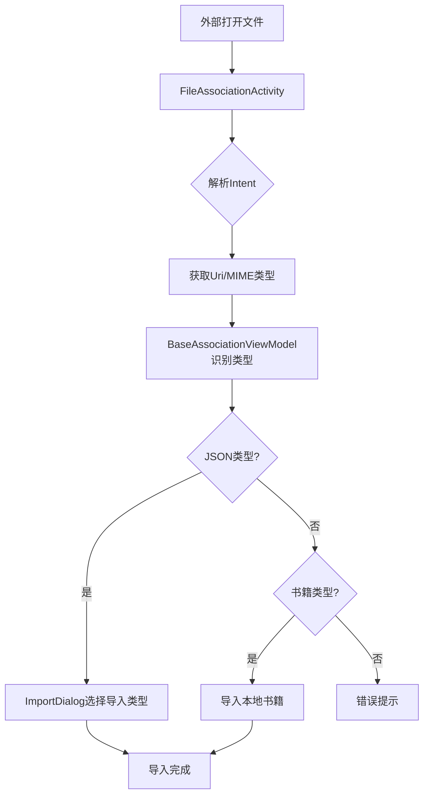

# Intent 与深度链接体系

> 本文档分析 Legado 的 Intent 体系，涵盖 Deep Link 注册、URL Scheme 处理、文件关联、分享接收、快捷方式等。

---

## 1. 概述

Legado 的 Intent 体系由以下核心组件构成：

| 组件 | 职责 | 源文件 |
|------|------|--------|
| **Deep Link 注册** | AndroidManifest 声明 scheme/host/pathPattern | AndroidManifest.xml |
| **URL Scheme 处理** | legado:// 和 yuedu:// 协议解析与分发 | OnLineImportActivity.kt |
| **文件关联** | mimeType + pathPattern 匹配打开书籍/配置 | FileAssociationActivity.kt |
| **分享接收** | ACTION_SEND / ACTION_PROCESS_TEXT 文本处理 | SharedReceiverActivity.kt |
| **Launcher 入口** | 8 个 LAUNCHER Activity | WelcomeActivity.kt |
| **自定义 Action** | Service 间通信的 IntentAction 常量 | IntentAction.kt |
| **大对象传递** | 静态 Map 中转，避免 TransactionTooLargeException | IntentData.kt |
| **快捷方式** | 桌面动态快捷方式 | ShortCuts.kt |
| **Intent 辅助** | 浏览器跳转、TTS 设置、安装未知应用 | IntentHelp.kt |
| **ContentProvider API** | 跨应用数据交换 | ReaderProvider.kt |

---

## 2. Deep Link 注册（AndroidManifest）

### 2.1 URL Scheme 声明

```xml
<!-- legado:// 协议 -->
<intent-filter>
    <action android:name="android.intent.action.VIEW"/>
    <category android:name="android.intent.category.DEFAULT"/>
    <category android:name="android.intent.category.BROWSABLE"/>
    <data android:scheme="legado"/>
</intent-filter>

<!-- yuedu:// 协议（兼容旧版） -->
<intent-filter>
    <data android:scheme="yuedu"/>
</intent-filter>
```

### 2.2 文件关联声明

| 文件类型 | mimeType | pathPattern | 处理Activity |
|----------|----------|-------------|--------------|
| `.txt` | `text/plain` | `.*\\.txt` | FileAssociationActivity |
| `.epub` | `application/epub+zip` | `.*\\.epub` | FileAssociationActivity |
| `.umd` | `application/octet-stream` | `.*\\.umd` | FileAssociationActivity |
| `.json` | `application/json` | `.*\\.json` | FileAssociationActivity |
| `.legado` | `*/*` | `.*\\.legado` | FileAssociationActivity |

### 2.3 Launcher Activity

| Activity | 功能 | LAUNCHER配置 |
|----------|------|--------------|
| WelcomeActivity | 欢迎页/首次启动 | 主LAUNCHER |
| MainActivity | 直接进入主界面 | 无（由Welcome启动） |

---

## 3. OnLineImportActivity（URL Scheme 处理）

**源文件**: `app/src/main/java/io/legado/app/ui/OnLineImportActivity.kt`

### 3.1 URL 格式

| URL格式 | 功能 | 示例 |
|---------|------|------|
| `legado://import/{path}?src={url}` | 导入书源/订阅源 | `legado://import/bookSource?src=https://xxx.json` |
| `legado://read/{bookUrl}` | 直接打开书籍 | `legado://read/https://xxx/book.html` |
| `legado://search/{keyword}` | 搜索书籍 | `legado://search/斗破苍穹` |

### 3.2 path 路由表

| path | 处理逻辑 |
|------|----------|
| `bookSource` | 导入BookSource JSON |
| `rssSource` | 导入RssSource JSON |
| `replaceRule` | 导入替换规则 |
| `readBook` | 打开书籍阅读 |
| `search` | 搜索书籍 |

### 3.3 src 参数约定

| 参数 | 说明 |
|------|------|
| `src` | JSON文件的URL |
| `#requestWithoutUA` | 标记不使用UA请求 |

---

## 4. FileAssociationActivity（文件关联）

**源文件**: `app/src/main/java/io/legado/app/ui/file/FileAssociationActivity.kt`

### 4.1 处理流程



### 4.2 JSON 类型识别

| 类型识别方式 | 导入Dialog |
|--------------|------------|
| 含 `bookSource` 字段 | ImportBookSourceDialog |
| 含 `rssSource` 字段 | ImportRssSourceDialog |
| 含 `replaceRule` 字段 | ImportReplaceRuleDialog |
| 含 `txtTocRule` 字段 | ImportTxtTocRuleDialog |

---

## 5. SharedReceiverActivity（分享接收）

**源文件**: `app/src/main/java/io/legado/app/ui/SharedReceiverActivity.kt`

### 5.1 支持的 Intent Action

| Action | 用途 |
|--------|------|
| `ACTION_SEND` | 分享文本/URL |
| `ACTION_PROCESS_TEXT` | 文字选择后处理（Android 6+） |

### 5.2 处理逻辑

| 分享内容 | 处理方式 |
|----------|----------|
| URL | 检测是否为书源JSON链接 → 导入 |
| 书籍URL | 添加到书架 |
| 纯文本 | 作为搜索关键词 |

---

## 6. IntentAction 常量

**源文件**: `app/src/main/java/io/legado/app/data/entities/IntentAction.kt`

### 6.1 Service 间通信 Action

| Action | 发送方 | 接收方 | 用途 |
|--------|--------|--------|------|
| `action_read_aloud` | ReadAloudService | ReadBookActivity | 朗读状态更新 |
| `action_page_change` | ReadBookActivity | ReadAloudService | 章节/页面变化 |
| `action_download` | DownloadService | MainActivity | 下载进度更新 |
| `action_source_debug` | BookSourceDebugActivity | WebBook | 书源调试结果 |

---

## 7. IntentData（大对象传递）

**源文件**: `app/src/main/java/io/legado/app/utils/IntentData.kt`

### 7.1 设计原因

Android Intent 传递数据有限制（约1MB），超过会抛出 `TransactionTooLargeException`。

### 7.2 实现方式

```kotlin
object IntentData {
    private val dataMap = mutableMapOf<String, Any>()
    
    fun put(key: String, value: Any) {
        dataMap[key] = value
    }
    
    fun get(key: String): Any? {
        return dataMap.remove(key)  // 取出后移除
    }
}
```

### 7.3 使用场景

| 场景 | 传递对象 |
|------|----------|
| 书源编辑 | BookSource 对象 |
| 章节跳转 | BookChapter 列表 |
| 搜索结果 | SearchBook 列表 |

---

## 8. ShortCuts（快捷方式）

**源文件**: `app/src/main/java/io/legado/app/api/ShortCuts.kt`

### 8.1 动态快捷方式

| Shortcut | 功能 | 跳转 |
|----------|------|------|
| 搜索 | 快速搜索 | SearchActivity |
| 书源管理 | 管理书源 | BookSourceActivity |
| 最近阅读 | 继续阅读 | ReadBookActivity |

---

## 9. IntentHelp（辅助工具）

**源文件**: `app/src/main/java/io/legado/app/utils/IntentHelp.kt`

### 9.1 功能清单

| 方法 | 功能 |
|------|------|
| `openBrowser(url)` | 打开外部浏览器 |
| `openTtsSettings()` | 打开TTS设置 |
| `installApk(uri)` | 安装APK（需REQUEST_INSTALL_PACKAGES权限） |
| `shareText(text)` | 分享文本 |
| `shareImage(uri)` | 分享图片 |

---

## 10. ReaderProvider（ContentProvider API）

**源文件**: `app/src/main/java/io/legado/app/api/ReaderProvider.kt`

### 10.1 跨应用数据交换

| URI | 返回数据 |
|------|----------|
| `content://io.legado.app.bookshelf` | 书架列表 |
| `content://io.legado.app.book/{id}` | 书籍信息 |

---

## 11. 源码锚点

| 组件 | 文件路径 | 关键行号 |
|------|----------|----------|
| URL Scheme处理 | `app/src/main/java/io/legado/app/ui/OnLineImportActivity.kt` | 全文件 |
| 文件关联 | `app/src/main/java/io/legado/app/ui/file/FileAssociationActivity.kt` | 全文件 |
| 分享接收 | `app/src/main/java/io/legado/app/ui/SharedReceiverActivity.kt` | 全文件 |
| Intent常量 | `app/src/main/java/io/legado/app/data/entities/IntentAction.kt` | 全文件 |
| 大对象传递 | `app/src/main/java/io/legado/app/utils/IntentData.kt` | 全文件 |
| 快捷方式 | `app/src/main/java/io/legado/app/api/ShortCuts.kt` | 全文件 |
| Intent辅助 | `app/src/main/java/io/legado/app/utils/IntentHelp.kt` | 全文件 |
| ContentProvider | `app/src/main/java/io/legado/app/api/ReaderProvider.kt` | 全文件 |
| Manifest声明 | `app/src/main/AndroidManifest.xml` | intent-filter标签 |

---

*文档生成: wiki-generator v2.1 | 最后更新: 2026-06-30*