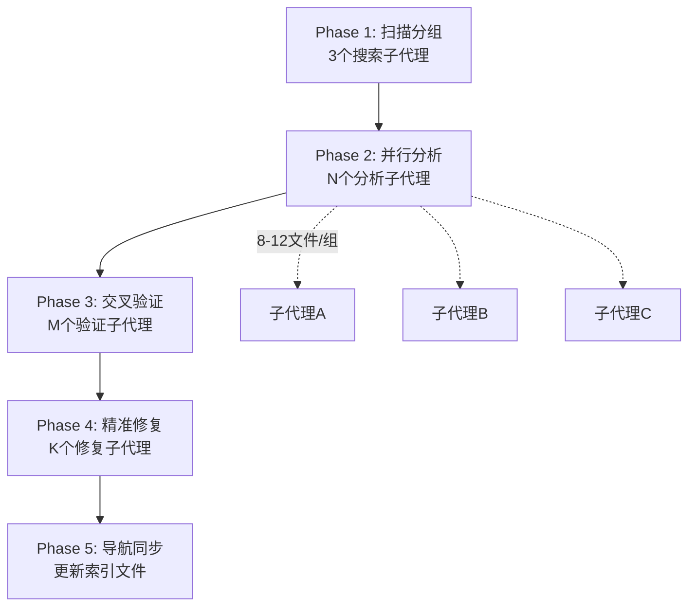

# 大规模并行子代理分析验证修复方法论

> **适用场景**：需要分析 100+ 源文件、验证/修复多份文档、或任何单次上下文无法容纳的复杂任务。
> **核心原则**：分而治之 → 并行分析 → 交叉验证 → 精准修复 → 同步收尾。

---

## 一、前置约束（必须遵守）

### 1.1 子代理文件数量硬限制

```
┌──────────────────────────────────────────────────────┐
│  单个子代理分配文件数：≤ 12 个源文件                    │
│  单个子代理生成临时文档：≤ 800 行                      │
│  超过此限制 → 必须拆分                                 │
└──────────────────────────────────────────────────────┘
```

**原因**：超过此限，子代理上下文会被压缩（truncation），导致：
- 文件内容读取不完整
- 分析结果空洞无物（只有"骨架"无"血肉"）
- 行号锚点偏移或丢失
- 子代理直接卡死无响应

### 1.2 不可合并的限制

以下情况**禁止**将多个子目录合并到一个子代理：
- 文件数超过 12 个
- 预估总行数超过 3000 行
- 跨不同架构层（如 help/ 和 model/）
- 包含过于复杂的核心算法文件（如 AnalyzeRule.kt 单文件 1000+ 行）

**正确做法**：按子目录或逻辑边界拆分，编号为 05a、05b、05c...

---

## 二、五阶段流水线



```
Phase 1       Phase 2        Phase 3        Phase 4        Phase 5
 扫描分组  →  并行分析   →   交叉验证   →   精准修复   →   导航同步
 (1 agent)   (N agents)    (M agents)     (K agents)     (1 agent)
```

---

## 三、Phase 1：范围扫描与文件分组

### 步骤

1. **启动 3 个独立的搜索子代理**（并行）：
   - 子代理 A：扫描所有后端 .kt 文件（排除 build/test/.gradle）
   - 子代理 B：扫描所有前端 .vue/.ts/.js/.css 文件（排除 node_modules/dist）
   - 子代理 C：扫描现有文档/规范文件

2. **根据扫描结果分组**：
   - 按 `package` 或目录结构划分
   - 每个分组 8~12 个文件
   - 如果某个目录文件过多（如 help/ 有 46 个），按子目录拆分
   - 为前端单独建立分组

3. **创建临时输出目录**：
   ```
   docs/temp-analysis/
   ```

### 分组示例

| 分组 | 文件范围 | 文件数 | 临时文档名 |
|------|----------|--------|-----------|
| 01 | model/analyzeRule/*.kt | 10 | 01-rule-engine.md |
| 02 | model/webBook/*.kt | 6 | 02-webbook-search.md |
| 03 | model/localBook/ + ReadBook + ReadManga + AudioPlay | 10 | 03-localbook-reading.md |
| 05a | help/http/ + help/coroutine/ | 13 | 05a-http-coroutine.md |
| 05b | help/config/ + help/crypto/ + help/storage/ | 14 | 05b-config-crypto-storage.md |
| 05c | help/TTS + AppWebDav + help/其余 | 12 | 05c-tts-webdav-others.md |
| F1 | modules/web/src/views/ | 4 | F1-views.md |
| F2 | modules/web/src/components/ | 13 | F2-components.md |
| ... | ... | ... | ... |

---

## 四、Phase 2：并行分析（核心阶段）

### 4.1 一次性全部启动

**关键**：所有分析子代理必须在**同一批次**中全部启动，不允许串行逐个执行。

**原因**：N 个子代理并行执行的总时间 ≈ 最慢那一个的时间，而非 N×单个时间。

### 4.2 每个子代理的任务模板

```
分析以下目录中的.kt/.vue/.ts文件（只分析这些，不要超出范围）：
1. [精确的文件路径列表]

逐个阅读每个文件，提取：
- 核心类/函数签名（含行号锚点）
- 关键算法逻辑（用伪代码描述）
- 数据模型字段（类型+注解+默认值）
- 状态机/生命周期（如有）
- 与其他模块的依赖关系

生成临时文档写入 f:\...\docs\temp-analysis\[编号]-[模块名].md
篇幅严格控制在 800 行以内，使用中文。
每个文件标注行号锚点，格式: [文件名](file:///完整路径#L起始-L结束)
```

### 4.3 临时文档内容规范

每个临时文档必须包含：
- **文件清单表**：文件名 + 行数 + 核心职责一句话
- **每个文件的核心提取**：关键方法签名 + 伪代码 + 行号锚点
- **数据模型表**：字段名/类型/注解/默认值/说明（表格格式）
- **模块间依赖图**：ASCII 或 Mermaid
- **关键设计决策**：版本锁定/特殊处理/安全机制

### 4.4 失败重试策略

如果某个子代理返回了结果但里面内容被截断或过于模糊（特征：全文只有摘要没有具体代码锚点），说明该子代理被压缩了。**必须立即拆分重试**：
- 将失败的分组拆成更小的 2-3 个子分组
- 重新启动分析

---

## 五、Phase 3：交叉验证

### 5.1 验证子代理的职责

1. **阅读临时分析文档**（Phase 2 产物）
2. **阅读现有 Wiki/规范文档**（如果要对比）
3. **逐项对比**：
   - 实体字段数量/类型是否一致
   - 算法描述（伪代码）是否正确
   - 行号锚点是否存在偏移
   - 是否有遗漏的重要功能点
   - 临时文档中是否有现有文档未涵盖的新细节
4. **遇到矛盾时**：读取源码原文验证（不要相信任何一份文档）

### 5.2 问题分级

| 级别 | 含义 | 处理 |
|------|------|------|
| **ERROR** | 事实性错误，与源码不符 | 必须立即修正 |
| **WARN** | 不精确描述或轻微偏差 | 建议修正 |
| **INFO** | 内容覆盖度差异 | 可按需补充 |

### 5.3 验证分组

验证子代理也需并行启动，每个负责一组相关文档的交叉对比：

| 验证代理 | 对比范围 |
|----------|----------|
| VALIDATION-01 | 核心引擎（规则引擎 + 搜索 + 阅读 + 本地书） |
| VALIDATION-02 | 数据与网络（数据层 + Web API + 配置 + 网络层 + API数据流） |
| VALIDATION-03 | 服务与UI（Service + 自定义库 + Base类 + 工具 + Android UI） |
| VALIDATION-04 | 前端（全部前端文档 vs 现有前端Wiki） |

---

## 六、Phase 4：精准修复

### 6.1 修复原则

- 每个修复子代理负责一组**相关联**的 Wiki 文档（2-5 个），不是全部
- 使用 `SearchReplace` 做精确替换，禁止大面积重写导致引入新错误
- 修复时以**源码**和**Phase 2 临时分析文档**为准，而非验证报告中的描述
- 修复完成后返回修改摘要（具体改了什么、在哪一行）

### 6.2 修复子代理任务模板

```
你需要修复以下Wiki文档中的错误。

步骤1：阅读验证报告 [VALIDATION-XX.md]
步骤2：阅读对应的临时分析文档（作为正确参考）
步骤3：逐个修复以下Wiki文档：
  - [文档1路径]：[具体要修正的 ERROR/WARN 编号和内容]
  - [文档2路径]：[具体要修正的 ERROR/WARN 编号和内容]

对每个修复，使用SearchReplace精确替换错误内容。
修复完成后返回修改摘要。
```

### 6.3 完全重写的例外

当一个文档的错误超过 50% 内容需要修改时（如整个布局图虚构、大部分路由表过时），允许使用 `Write` 完全重写。但必须：
1. 基于已验证的临时分析文档
2. 保留现有文档中仍然正确的 Mermaid 图、代码示例等
3. 控制在 800-1000 行以内

---

## 七、Phase 5：导航同步

### 7.1 必须同步的文件

修复所有 Wiki 后，**必须**更新以下导航文件：

| 文件 | 同步内容 |
|------|----------|
| `AGENTS.md` | 模块索引表、Project Map、Conventions 中的统计数字 |
| `docs/project-flow/architecture/overview.md` | 架构图、模块索引表、实体/DAO 数量 |
| `docs/project-flow/README.md` | 文档目录结构、模块说明 |

### 7.2 同步检查清单

- [ ] 实体数量（56 实体 + 43 DAO + 1 视图，version=108）
- [ ] API 路由数量（14 POST + 12 GET + 4 控制器）
- [ ] Mode 枚举（6 种，含 WebJs）
- [ ] 主键定义（BookChapter 复合主键，Bookmark Long 主键）
- [ ] 前端架构描述（MPA 架构，非虚构布局图）

---

## 八、效率对比

| 方式 | 耗时 | 覆盖度 | 准确度 |
|------|------|--------|--------|
| 单 Agent 逐文件阅读 | 不可行（500+文件） | 0% | N/A |
| 少量大子代理（如30+文件/个） | 中 | 60% | 低（被压缩） |
| **本方法论（12文件/子代理+交叉验证）** | **中** | **100%** | **高** |

---

## 九、反模式（禁止的操作）

| 反模式 | 后果 | 正确做法 |
|--------|------|----------|
| 一个子代理分配 30+ 文件 | 上下文压缩，产出空洞 | 拆分成 3 个子代理 |
| 串行启动子代理 | 耗时为 N×单个时间 | 一次性并行启动 |
| 信任单一文档不交叉验证 | 错误（如虚构的布局图）持续传播 | 第三方验证子代理对比 |
| 修复时不读源码验证 | 用错误修正错误 | 遇到矛盾先读源码 |
| 修完文档不更新导航 | AGENTS.md 中的数字过时 | Phase 5 必须执行 |
| 跳过前端文件分析 | 前端 Wiki 漏洞百出 | 前后端平等对待 |

---

## 十、模板速查

### 子代理分析请求模板

```
分析以下文件（只分析这些，不要超出范围）：
1. [目录1路径] 目录下所有.[ext]文件
2. [目录2路径] 目录下所有.[ext]文件
...

逐个阅读，提取：核心类/函数签名、关键算法（伪代码）、数据模型字段、状态机。
每个文件标注行号锚点。
生成临时文档写入 [temp-analysis/XX-xxx.md]，篇幅≤800行，中文。
```

### 子代理交叉验证请求模板

```
交叉验证任务：对比临时分析文档与现有Wiki。

阅读文件：
1-3. [3份临时分析文档路径]
4-6. [3份现有Wiki文档路径]

对比规则：实体字段、算法、行号、遗漏、新发现
输出差异报告到 [temp-analysis/VALIDATION-XX.md]，ERROR/WARN/INFO分级，中文。
```

### 子代理修复请求模板

```
修复以下Wiki文档：

步骤1：阅读验证报告 [VALIDATION-XX.md]
步骤2：阅读临时分析文档作为参考
步骤3：修复：
  - [文档路径]：[E-xx] [修复内容]
  - [文档路径]：[E-yy] [修复内容]

使用SearchReplace精确替换，返回修改摘要。
```