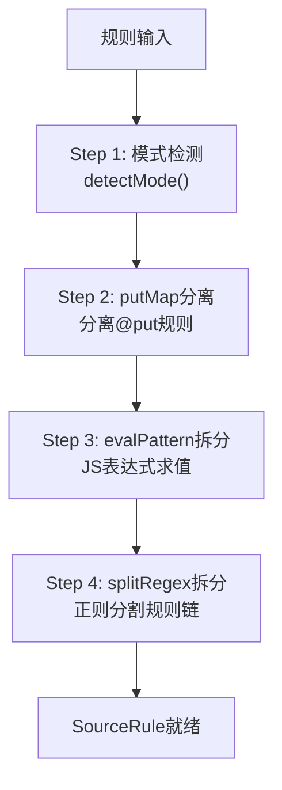
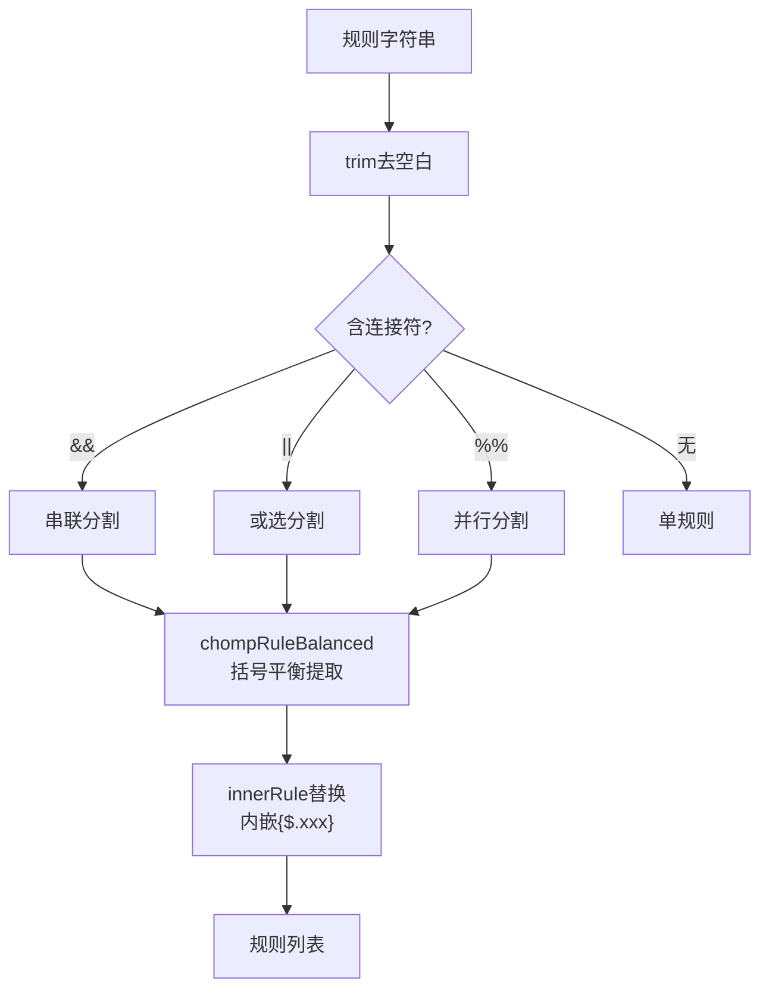
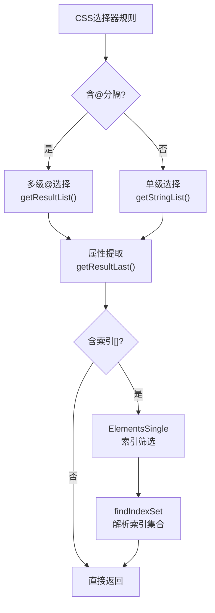
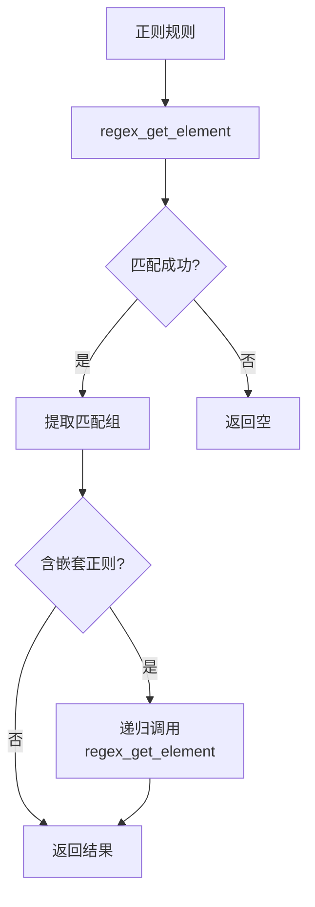

# 规则引擎算法详解

> SourceRule 完整规范、RuleAnalyzer 完整算法、五种解析器算法细节、Mode 枚举。

> **主文档**：[规则引擎详解](./rule-engine.md)

---

## 目录

1. [SourceRule 内部类完整规范](#1-sourcerule-内部类完整规范)
2. [规则语法前缀检测](#2-规则语法前缀检测)
3. [RuleAnalyzer 完整算法](#3-ruleanalyzer-完整算法)
4. [AnalyzeByJSoup 完整解析引擎](#4-analyzebyjsoup-完整解析引擎)
5. [AnalyzeByXPath 完整规范](#5-analyzebyxpath-完整规范)
6. [AnalyzeByJsonPath 完整规范](#6-analyzebyjsonpath-完整规范)
7. [AnalyzeByRegex 完整规范](#7-analyzebyregex-完整规范)
8. [Mode 枚举详情](#8-mode-枚举详情)

---

## 1. SourceRule 内部类完整规范

`SourceRule` 是 `AnalyzeRule` 的内部类，负责将单条规则字符串解析为可执行的结构化对象。

### 1.1 类结构

```python
from enum import Enum
import re
from typing import Any


class Mode(Enum):
    XPATH = 1
    JSON = 2
    DEFAULT = 3      # CSS
    JS = 4
    REGEX = 5
    WEBJS = 6


class SourceRule:
    """单条规则 — 对应 legado AnalyzeRule.SourceRule"""

    # 类正则常量（来源于 AnalyzeRule.Companion）
    PUT_PATTERN = re.compile(r'@put:(\{[^}]+?\})', re.IGNORECASE)
    EVAL_PATTERN = re.compile(
        r'@get:\{[^}]+\}|\{\{[\w\W]*?\}\}', re.IGNORECASE
    )
    REGEX_PATTERN = re.compile(r'\$\d{1,2}')

    def __init__(self, rule_str: str, mode: Mode = Mode.DEFAULT,
                 content_is_json: bool = False):
        self.mode: Mode = mode
        self.rule: str = ""           # 提取后的主规则
        self.replace_regex: str = ""   # ##分割的正则部分
        self.replacement: str = ""     # ##分割的替换内容
        self.replace_first: bool = False  # ###结尾=只替换首个匹配
        self.put_map: dict[str, str] = {}  # @put:{...} 提取的键值对

        # 内部参数列表（用于 @get / {{}} / $0-$99 的延迟替换）
        self._rule_param: list[str] = []   # 参数值列表
        self._rule_type: list[int] = []    # 参数类型列表
        self._GET_RULE_TYPE = -2    # @get 类型
        self._JS_RULE_TYPE = -1     # {{...}} 类型
        self._DEFAULT_TYPE = 0      # 普通文本类型
        # ---------- 初始化流程 ----------
        self._init_rule(rule_str, content_is_json)

    def _init_rule(self, rule_str: str, content_is_json: bool):
        """初始化：模式检测 → 前缀剥离 → splitRegex拆分"""
        # Step 1: 模式检测（仅非 JS/Regex 模式）
        if self.mode in (Mode.JS, Mode.REGEX):
            self.rule = rule_str
            return

        # 按照优先顺序检测前缀
        upper = rule_str.upper()
        if upper.startswith("@CSS:"):
            self.mode = Mode.DEFAULT
            self.rule = rule_str  # 保留完整 ruleStr（含 @CSS: 前缀），由 AnalyzeByJSoup 内部剥离
        elif rule_str.startswith("@@") and len(rule_str) > 2:
            self.mode = Mode.DEFAULT
            self.rule = rule_str[2:]
        elif upper.startswith("@XPATH:"):
            self.mode = Mode.XPATH
            self.rule = rule_str[7:]
        elif upper.startswith("@JSON:"):
            self.mode = Mode.JSON
            self.rule = rule_str[6:]
        elif content_is_json or rule_str.startswith("$.") or rule_str.startswith("$["):
            self.mode = Mode.JSON
            self.rule = rule_str
        elif rule_str.startswith("/"):
            self.mode = Mode.XPATH
            self.rule = rule_str
        else:
            self.rule = rule_str  # 保持原模式
        # Step 2: 分离 @put:{...} 规则
        self._split_put_rule()

        # Step 3: 拆分 @get / {{}} / $0-$99
        self._split_eval_and_regex()
```

### 1.2 putMap 分离

```python
def _split_put_rule(self):
    """从规则中提取 @put:{...} JSON 区块"""
    def replace_put(m: re.Match) -> str:
        json_str = m.group(1)
        try:
            d = json.loads(json_str)
            self.put_map.update(d)
        except json.JSONDecodeError:
            pass
        return ""

    self.rule = re.sub(self.PUT_PATTERN, replace_put, self.rule).strip()
```

### 1.3 evalPattern 拆分

```python
def _split_eval_and_regex(self):
    """拆分 @get:{key} / {{js}} / $0-$99 / ##regex##replacement##

    核心逻辑：
    1. 用 EVAL_PATTERN 查找 @get:{} 和 {{}}
    2. 遇到 @get:{} → 记录 getRuleType
    3. 遇到 {{}} → 记录 jsRuleType
    4. 两种之间的普通文本 → splitRegex 继续拆分 $0-$99
    5. 最后的普通文本 → splitRegex
    """
    remaining = self.rule
    pos = 0

    for m in self.EVAL_PATTERN.finditer(self.rule):
        # @get/{{}} 之前的普通文本
        if m.start() > pos:
            self._split_regex(self.rule[pos:m.start()])

        token = m.group()
        if token.upper().startswith("@GET:"):
            # @get:{key} — 提取 key
            key = token[5:-1]  # 去掉 @get:{ 和 }
            self._rule_type.append(self._GET_RULE_TYPE)
            self._rule_param.append(key)
        elif token.startswith("{{"):
            # {{js_code}} — 提取 js_code
            js_code = token[2:-2]
            self._rule_type.append(self._JS_RULE_TYPE)
            self._rule_param.append(js_code)
        else:
            self._split_regex(token)

        pos = m.end()

    # 剩余部分
    if pos < len(self.rule):
        self._split_regex(self.rule[pos:])
```

### 1.4 splitRegex 拆分

```python
def _split_regex(self, segment: str):
    """拆分 $0-$99 正则分组引用和 ## 替换

    1. 按 ## split
    2. 第一部分用 REGEX_PATTERN 查找 $0-$99
    3. 如果找到 $N 且模式非 JS/Regex，切换为 Regex 模式
    """
    # ## 分割
    parts = segment.split("##")
    first_part = parts[0]
    rest = parts[1:]

    # 在第一部分中查找 $0-$99
    seg_pos = 0
    for m in self.REGEX_PATTERN.finditer(first_part):
        if self.mode not in (Mode.JS, Mode.REGEX):
            self.mode = Mode.REGEX

        if m.start() > seg_pos:
            # $N 之前的普通文本
            self._rule_type.append(self._DEFAULT_TYPE)
            self._rule_param.append(first_part[seg_pos:m.start()])

        # $N — 记录分组索引
        group_idx = int(m.group()[1:])  # $0 → 0, $12 → 12
        self._rule_type.append(group_idx)
        self._rule_param.append(m.group())
        seg_pos = m.end()

    # $N 之后的剩余文本
    if seg_pos < len(first_part):
        self._rule_type.append(self._DEFAULT_TYPE)
        self._rule_param.append(first_part[seg_pos:])
```

### 1.5 makeUpRule 方法

```python
def make_up_rule(self, result: Any, get_fn, eval_js_fn):
    """延迟替换 @get / {{}} / $0-$99

    在规则执行时（运行时）调用，将占位符替换为实际值。
    Args:
        result: 当前解析结果（用于 $N 引用 List 中的元素）
        get_fn: get(key) 函数，从变量池取值
        eval_js_fn: evalJS(js_code, result) 函数
    """
    if not self._rule_param:
        return

    buf_parts = []
    for i in range(len(self._rule_param)):
        typ = self._rule_type[i]
        param = self._rule_param[i]

        if typ > self._DEFAULT_TYPE:
            # $N 模式：从 List 中取第 N 个元素
            if isinstance(result, list) and len(result) > typ:
                buf_parts.insert(0, result[typ] or "")
            else:
                buf_parts.insert(0, param)
        elif typ == self._JS_RULE_TYPE:
            # {{js}}：检测是规则还是纯 JS
            if self._is_rule(param):
                # 是规则 → 递归执行 getString
                val = get_fn(param)
                buf_parts.insert(0, val)
            else:
                # 是纯 JS → eval
                js_val = eval_js_fn(param, result)
                if js_val is None:
                    pass
                elif isinstance(js_val, str):
                    buf_parts.insert(0, js_val)
                elif isinstance(js_val, float) and js_val % 1.0 == 0.0:
                    buf_parts.insert(0, f"{js_val:.0f}")
                else:
                    buf_parts.insert(0, str(js_val))
        elif typ == self._GET_RULE_TYPE:
            # @get:{key} — 从变量池取值
            buf_parts.insert(0, get_fn(param))
        else:
            # 普通文本
            buf_parts.insert(0, param)

    self.rule = "".join(buf_parts)

    # 再次 ## 分割（第一次 init 时可能未完全分割）
    rule_parts = self.rule.split("##")
    self.rule = rule_parts[0].strip()
    if len(rule_parts) > 1:
        self.replace_regex = rule_parts[1]
    if len(rule_parts) > 2:
        self.replacement = rule_parts[2]
    if len(rule_parts) > 3:
        self.replace_first = True
```

### 1.6 isRule 检测

```python
@staticmethod
def _is_rule(s: str) -> bool:
    """判断 {{}} 内的字符串是规则还是纯 JS

    以 @ / $. / $[ / // 开头的视为规则
    """
    return (s.startswith('@')
            or s.startswith("$.")
            or s.startswith("$[")
            or s.startswith("//"))

def get_param_size(self) -> int:
    return len(self._rule_param)
```

### 1.7 SourceRule 初始化四步流程图



### 1.8 初始化流程总结

```
SourceRule.__init__(rule_str, mode)
      ├─ Step 1: mode 检测
      │   JS/Regex → 直接赋值 rule = rule_str
      │   @CSS: → mode=Default, 保留原文（AnalyzeByJSoup内部处理前缀剥离）
      │   @@ → mode=Default, 剥离@@
      │   @XPath: → mode=XPath, 剥离前缀
      │   @Json: → mode=Json, 剥离前缀
      │   $./$[ → mode=Json, 保留原文
      │   isJSON=true → mode=Json
      │   /开头 → mode=XPath
      │   否则 → 保持传入的模式
      ├─ Step 2: splitPutRule()
      │   正则 @put:(\{[^}]+\}) 匹配
      │   移除匹配文本，JSON 解析加入 putMap
      ├─ Step 3: evalPattern 拆分 (@get:{} 和 {{}})
      │   evalPattern = @get:\{[^}]+\}|\{\{[\w\W]*?\}\}
      │   ├─ 匹配到 @get:{key} → ruleType.append(-2), param = key
      │   ├─ 匹配到 {{js}} → ruleType.append(-1), param = js_code
      │   └─ 中间和尾部文本 → splitRegex
      └─ Step 4: splitRegex（拆分 $0-$99 和 ##）
               ├─ 按 ## 分割
               ├─ 第一部分搜索 $\d{1,2}
               │   若找到且非 JS/Regex 模式，mode 强制切换为 Regex
               │   $N 前文本 type=0, $N type=N
               ├─ 第二部分 → replace_regex
               ├─ 第三部分 → replacement
               └─ 第四部分存在 → replace_first = True
```

### 1.8 makeUpRule 运行流程

```
makeUpRule(result)
      ├─ 从右向左遍历 ruleParam
      ├─ type > 0 ($N) → result 是 List 时取第 N 个元素
      ├─ type == -1 ({{js}}) → isRule? 是则递归 getString，否则 evalJS
      ├─ type == -2 (@get) → get(key) 从变量池取值
      └─ type == 0 → 直接追加文本
      ├─ 拼接得到新的 rule
      └─ 再次 ## 分割（因为运行时替换后可能产生新的 ##）
          ├─ rule = parts[0]
          ├─ replace_regex = parts[1]
          ├─ replacement = parts[2]
          └─ replace_first = (parts.size > 3)
```

---

## 2. 规则语法前缀检测

### 2.1 完整前缀表

| 前缀写法 | 解析模式 | 说明 |
|----------|----------|------|
| 无前缀 | Default (CSS) | 自动按 CSS 选择器处理 |
| `@@` | Default (CSS) | `@@` 被剥离，剩余部分按 CSS 处理 |
| `@CSS:` (不区分大小写) | Default (CSS) | 显式声明 CSS 模式，`@CSS:` 前缀由 AnalyzeByJSoup 内部剥离 |
| `/` 开头（如 `//div`) | XPath | 以 `/` 起始即触发 XPath |
| `@XPath:` (不区分大小写) | XPath | 显式声明 XPath，前缀被剥离 |
| `$.` 或 `$[` 开头 | Json | JSONPath 自动识别 |
| `@Json:` (不区分大小写) | Json | 显式声明 JSONPath，前缀被剥离 |
| `{{...}}` | 内嵌 JS 表达式 | 规则字符串内嵌 `{{js代码}}` 将被执行 |
| `@js:...` | JS | 其后所有内容作为 JS 代码，直到字符串结束或下一个 `@` |
| `<js>...</js>` | JS | 标签包裹的 JS 代码 |
| `@webjs:...` | WebJs | 使用 WebView 执行 JS，最少 5 个字符 |
| `##` | 正则替换 | 出现在规则结尾，格式 `##match##replace[##]` |
| `$0` ~ `$99` | 正则分组引用 | 在正则模式下引用匹配分组 |

### 2.2 检测算法（Python 伪代码）

```python
def detect_mode(rule_str: str, content_is_json: bool) -> tuple[Mode, str]:
    """检测规则模式，返回 (模式, 剥离前缀后的规则)"""

    # 顺序：精确前缀优先于自动检测
    # 1. 显式 CSS
    if rule_str.upper().startswith("@CSS:"):
        return Mode.DEFAULT, rule_str   # 保留完整 ruleStr，由 AnalyzeByJSoup 内部剥离前缀

    # 2. @@ 前缀
    if rule_str.startswith("@@") and len(rule_str) > 2:
        return Mode.DEFAULT, rule_str[2:]   # 去掉 @@

    # 3. 显式 XPath
    if rule_str.upper().startswith("@XPATH:"):
        return Mode.XPATH, rule_str[7:]     # 去掉 @XPath:

    # 4. 显式 JSON
    if rule_str.upper().startswith("@JSON:"):
        return Mode.JSON, rule_str[6:]      # 去掉 @Json:

    # 5. 自动 JSON ($. / $[)
    if rule_str.startswith("$.") or rule_str.startswith("$["):
        return Mode.JSON, rule_str

    # 6. 如果内容本身就是 JSON，所有规则默认走 JSON 模式
    if content_is_json:
        return Mode.JSON, rule_str

    # 7. XPath 自动检测（/ 开头）
    if rule_str.startswith("/"):
        return Mode.XPATH, rule_str

    # 8. 默认 CSS
    return Mode.DEFAULT, rule_str


def detect_js_segments(rule_str: str) -> list[tuple[str, Mode]]:
    """从规则中提取 JS/WebJS 片段，按出现的顺序分析。
    返回 [(segment, mode), ...]

    注意：此函数对应 AnalyzeRule.splitSourceRule() 的逻辑，
    而非 RuleAnalyzer.splitRule()。两者是不同方法：
    - AnalyzeRule.splitSourceRule() → 分割 JS/WebJS 片段并创建 SourceRule
    - RuleAnalyzer.splitRule() → 按 &&/||/%% 分隔符切分规则字符串
    """
    segments = []
    pos = 0

    # <js>...</js> 标签
    import re
    js_pattern = re.compile(r'<js>([\w\W]*?)</js>', re.IGNORECASE)
    webjs_pattern = re.compile(r'@webjs:([\w\W]{5,})', re.IGNORECASE)

    # 先用正则查找所有 JS 片段，分割成段
    for m in js_pattern.finditer(rule_str):
        if m.start() > pos:
            segments.append((rule_str[pos:m.start()], Mode.DEFAULT))
        segments.append((m.group(1), Mode.JS))
        pos = m.end()

    for m in webjs_pattern.finditer(rule_str):
        if m.start() > pos:
            segments.append((rule_str[pos:m.start()], Mode.DEFAULT))
        segments.append((m.group(1), Mode.WebJs))
        pos = m.end()

    if pos < len(rule_str):
        segments.append((rule_str[pos:], Mode.DEFAULT))

    return segments
```

### 2.3 isJSON 检测

```python
def is_json(s: str) -> bool:
    """判断字符串是否为 JSON 格式"""
    s = s.strip()
    return (s.startswith("{") and s.endswith("}")) or \
           (s.startswith("[") and s.endswith("]"))
```

当 `content` 是 `org.jsoup.nodes.Node` 类型时，`isJSON` 固定为 `False`；否则通过 `isJson()` 扩展函数检测。

---

## 3. RuleAnalyzer 完整算法

`RuleAnalyzer` 是通用的规则切分处理类，不依赖任何特定解析器。它负责：
- 将规则字符串按分隔符（`&&`/`||`/`%%`/`@`）分割
- 跳过选择器中的 `[]` 和 `()` 平衡组
- 替换内嵌规则（`{$.xxx}` / `{{xxx}}`）
- 修剪前导 `@` 和空白符

### 3.1 类结构

```python
class RuleAnalyzer:
    """通用的规则切分处理 — 对应 legado RuleAnalyzer"""

    ESCAPE_CHAR = '\\'  # 转义字符

    def __init__(self, data: str, code_balanced: bool = False):
        self._queue: str = data       # 被处理字符串
        self._pos: int = 0            # 当前处理到的位置
        self._start: int = 0          # 当前处理字段的开头
        self._start_x: int = 0        # 当前规则的开头
        self._rule: list[str] = []    # 分割出的规则列表
        self._step: int = 0           # 分割字符的长度
        self.elements_type: str = ""  # 当前使用的分割符（&&/||/%%）
        # 选择平衡组函数
        # code_balanced=True 用于 JSON/JS → 使用 chompCodeBalanced
        # code_balanced=False 用于 XPath/JSoup → 使用 chompRuleBalanced
        self._chomp_balanced = (
            self._chomp_code_balanced if code_balanced
            else self._chomp_rule_balanced
        )
```

### 3.2 trim() — 修剪前导符号

```python
def trim(self):
    """修剪当前规则之前的 '@' 或空白符（ASCII < '!' 的字符）"""
    if self._queue[self._pos] == '@' or self._queue[self._pos] < '!':
        self._pos += 1
        while self._pos < len(self._queue) and \
              (self._queue[self._pos] == '@' or self._queue[self._pos] < '!'):
            self._pos += 1
        # 一次性设置开始位置
        self._start = self._pos
        self._start_x = self._pos
```

### 3.3 consumeTo / consumeToAny / findToAny — 底层定位方法

```python
def consume_to(self, seq: str) -> bool:
    """从 _pos 开始查找 seq，找到则设置 start=pos, pos=offset

    Returns:
        True 找到，False 未找到
    """
    self._start = self._pos
    offset = self._queue.find(seq, self._pos)
    if offset != -1:
        self._pos = offset
        return True
    return False


def consume_to_any(self, *seqs: str) -> bool:
    """从 _pos 开始查找任意一个 seq

    Returns:
        True 找到，设置 self._pos 和 self._step
    """
    pos = self._pos
    while pos < len(self._queue):
        for s in seqs:
            if self._queue.startswith(s, pos):
                self._step = len(s)
                self._pos = pos
                return True
        pos += 1
    return False


def find_to_any(self, *chars: str) -> int:
    """从 _pos 开始查找任意一个字符
    Returns:
        匹配位置，未找到返回 -1
    """
    pos = self._pos
    while pos < len(self._queue):
        for c in chars:
            if self._queue[pos] == c:
                return pos
        pos += 1
    return -1
```

### 3.4 chompRuleBalanced — 平衡组算法（XPath/JSoup 模式）

```python
def _chomp_rule_balanced(self, open_char: str, close_char: str) -> bool:
    """拉出一个规则平衡组

    特性：
    - 处理引号内转义字符（`\` 转义下一个字符）
    - 跟踪嵌套深度
    - 引号内内容不参与平衡匹配

    例如: div[class="test[1]"] — [ 和 ] 在引号内不参与平衡
    """
    pos = self._pos
    depth = 0
    in_single_quote = False
    in_double_quote = False

    while True:
        if pos >= len(self._queue):
            break
        c = self._queue[pos]
        pos += 1

        if c == '\'' and not in_double_quote:
            in_single_quote = not in_single_quote
        elif c == '"' and not in_single_quote:
            in_double_quote = not in_double_quote

        if in_single_quote or in_double_quote:
            continue

        # 不在引号中的转义字符跳过下一个字符
        if c == '\\':
            pos += 1
            continue

        if c == open_char:
            depth += 1
        elif c == close_char:
            depth -= 1

        if depth == 0:
            break

    if depth > 0:
        return False  # 未平衡
    self._pos = pos
    return True
```

### 3.5 chompCodeBalanced — 双平衡组算法（JSON/JS 模式）

```python
def _chomp_code_balanced(self, open_char: str, close_char: str) -> bool:
    """拉出一个代码平衡组（JSON/JS 模式）

    与 chompRuleBalanced 的区别：
    - 引号内 **不支持** 转义字符
    - 处理两个独立的平衡组：
        - 主平衡组：`[` `]`（depth）
        - 次平衡组：open_char/close_char（otherDepth）
    - 当 depth=0 时，默认嵌套全部闭合，此时才匹配 otherDepth
    - 当 otherDepth=0 且 depth=0 时，平衡组完全闭合

    用途：
    - JSONPath 中 {$.xxx} 内嵌规则提取
    - JavaScript 代码段中 {} 的平衡匹配
    """
    pos = self._pos
    depth = 0          # 主平衡组 [ ] 深度
    other_depth = 0    # 次平衡组 open/close 深度
    in_single_quote = False
    in_double_quote = False

    while True:
        if pos >= len(self._queue):
            break
        c = self._queue[pos]
        pos += 1

        if c != '\\':  # 非转义字符
            # 引号切换
            if c == '\'' and not in_double_quote:
                in_single_quote = not in_single_quote
            elif c == '"' and not in_single_quote:
                in_double_quote = not in_double_quote

            if in_single_quote or in_double_quote:
                continue

            # [ ] 主平衡组
            if c == '[':
                depth += 1
            elif c == ']':
                depth -= 1
            elif depth == 0:
                # 仅在主平衡组全部闭合时才处理次平衡组
                if c == open_char:
                    other_depth += 1
                elif c == close_char:
                    other_depth -= 1
        else:
            pos += 1  # 跳过转义后的字符

        if depth == 0 and other_depth == 0:
            break

    if depth > 0 or other_depth > 0:
        return False

    self._pos = pos
    return True
```

### 3.6 splitRule — 规则分割

`splitRule` 是最核心的分割方法，处理 `&&`、`||`、`%%` 三种分隔符。



```python
def split_rule(self, *splits: str) -> list[str]:
    """切分规则字符串
    特性：
    1. 不使用正则，不提前创建中间字符串
    2. 只在需要时才切片（延迟切片）
    3. 自动跳过选择器 [] 和 () 中的分隔符
    4. 递归处理嵌套分隔

    Args:
        *splits: 分隔符列表，如("&&", "||", "%%")

    Returns:
        切割后的规则列表
    """
    self._rule = []
    self.elements_type = ""

    # --------------------------------------------------
    # 第一阶段：首段匹配（elementsType 为空）
    # --------------------------------------------------
    first_stage = self._split_rule_first(*splits)
    return first_stage


def _split_rule_first(self, *splits: str) -> list[str]:
    """首段匹配 — 确定分隔符类型"""

    # 只有一个分隔符的情况
    if len(splits) == 1:
        self.elements_type = splits[0]
        if not self._consume_to(self.elements_type):
            # 没找到，整个字符串就是一条规则
            self._rule.append(self._queue[self._start_x:])
            return self._rule
        self._step = len(self.elements_type)
        return self._split_rule_next()  # 进入二段匹配

    # 多个分隔符，查找哪个先出现
    if not self._consume_to_any(*splits):
        # 都没有，整个字符串就是一条规则
        self._rule.append(self._queue[self._start_x:])
        return self._rule

    end = self._pos         # 记录分隔位置
    self._pos = self._start  # 回到开始，启动另一种查找
    while True:
        st = self._find_to_any('[', '(')  # 查找选择器位置
        if st == -1:
            # 没有选择器，直接按分隔符切割
            self._rule = [self._queue[self._start_x:end]]
            self.elements_type = self._queue[end:end + self._step]
            self._pos = end + self._step  # 跳过分隔符
            # 循环切割
            while self._consume_to(self.elements_type):
                self._rule.append(self._queue[self._start:self._pos])
                self._pos += self._step

            self._rule.append(self._queue[self._pos:])  # 最后一段
            return self._rule

        if st > end:
            # 分隔符在第一个选择器之前 → 正常切割
            self._rule = [self._queue[self._start_x:end]]
            self.elements_type = self._queue[end:end + self._step]
            self._pos = end + self._step

            while self._consume_to(self.elements_type) and self._pos < st:
                self._rule.append(self._queue[self._start:self._pos])
                self._pos += self._step

            if self._pos > st:
                # 还有更多段要切分
                self._start_x = self._start
                return self._split_rule_next()
            else:
                # 后面再无分隔符
                self._rule.append(self._queue[self._pos:])
                return self._rule

        # 选择器在分隔符之前 → 跳过选择器后继续
        self._pos = st
        next_close = ']' if self._queue[st] == '[' else ')'

        if not self._chomp_balanced(self._queue[st], next_close):
            raise ValueError(
                f"'{self._queue[:self._start]}' 后未平衡"
            )

        # 继续循环
        if end <= self._pos:
            self._start = self._pos
            return self._split_rule_first(*splits)
```

```python
def _split_rule_next(self) -> list[str]:
    """二段匹配 — elementsType 已确定，直接按它查找

    比首段更快，因为不需要再在多个分隔符中查找。
    """
    while True:
        end = self._pos
        self._pos = self._start

        st = self._find_to_any('[', '(')

        if st == -1:
            self._rule.append(self._queue[self._start_x:end])
            self._pos = end + self._step

            while self._consume_to(self.elements_type):
                self._rule.append(self._queue[self._start:self._pos])
                self._pos += self._step

            self._rule.append(self._queue[self._pos:])
            return self._rule

        if st > end:
            self._rule.append(self._queue[self._start_x:end])
            self._pos = end + self._step

            while self._consume_to(self.elements_type) and self._pos < st:
                self._rule.append(self._queue[self._start:self._pos])
                self._pos += self._step

            if self._pos > st:
                self._start_x = self._start
                return self._split_rule_next()
            else:
                self._rule.append(self._queue[self._pos:])
                return self._rule

        self._pos = st
        next_close = ']' if self._queue[st] == '[' else ')'

        if not self._chomp_balanced(self._queue[st], next_close):
            raise ValueError(
                f"'{self._queue[:self._start]}' 后未平衡"
            )

        if end <= self._pos:
            self._start = self._pos
            if not self._consume_to(self.elements_type):
                self._rule.append(self._queue[self._start_x:])
                return self._rule
            return self._split_rule_next()
```

### 3.7 innerRule — 内嵌规则替换

```python
def inner_rule(self, start_str: str, end_str: str,
               resolver_fn) -> str:
    """替换内嵌规则

    例如：{$.xxx} / {{js_code}} / <page>

    Args:
        start_str: 内嵌规则起始标记，如 "{"
        end_str: 内嵌规则结束标记，如 "}"
        resolver_fn: 内嵌规则解析函数 fn(content_between) -> str

    Returns:
        替换后的字符串
    """
    result = []
    pos = self._pos
    start_x = self._start_x

    while True:
        # 查找起始标记
        offset = self._queue.find(start_str, pos)
        if offset == -1:
            break

        # 尝试通过平衡组提取内嵌内容
        self._pos = offset
        start_pos = self._pos
        if self._chomp_code_balanced('{', '}'):
            content = self._queue[start_pos + 1:self._pos - 1]
            # 检查是否以 start_str 去除 { 后的内容开头
            inner_start = start_str[1:] if start_str.startswith('{') else start_str
            if content.startswith(inner_start):
                resolved = resolver_fn(content)
                if resolved:
                    result.append(self._queue[pos:start_pos] + resolved)
                    pos = self._pos
                    continue

        # 平衡组失败，跳过 start_str
        pos = offset + len(start_str)

    self._pos = pos

    if not result:
        return ""

    result.append(self._queue[pos:])
    return "".join(result)
```

**第二种重载形式**（指定 startStep 和 endStep）：

```python
def inner_rule_with_steps(self, start_str: str,
                          start_step: int = 1,
                          end_step: int = 1,
                          resolver_fn) -> str:
    """替换内嵌规则（支持自定义步长）
    Args:
        start_str: 起始标志，如 "{$."
        start_step: 不属于规则部分的前置字符长度，如 {$.
                    中 { 就不是规则部分，startStep=1
        end_step: 不属于规则部分的后置字符长度
    """
    sb = []

    while self._consume_to(start_str):
        pos_pre = self._pos  # 记录 consumeTo 匹配位置

        if self._chomp_code_balanced('{', '}'):
            inner = self._queue[pos_pre + start_step:
                                self._pos - end_step]
            resolved = resolver_fn(inner)
            if resolved:
                sb.append(self._queue[self._start_x:pos_pre] + resolved)
                self._start_x = self._pos
                continue

        # 不平衡，跳过此匹配
        self._pos += len(start_str)

    if self._start_x == 0:
        return ""

    sb.append(self._queue[self._start_x:])
    return "".join(sb)
```

---

## 4. AnalyzeByJSoup 完整解析引擎

`AnalyzeByJSoup` 负责 CSS 选择器（JSoup）模式下的 HTML 解析。

### 4.1 类结构

```python
from lxml import etree, html
from typing import Any


class AnalyzeByJSoup:
    """CSS 选择器解析引擎 — 对应 legado AnalyzeByJSoup

    核心数据类型：lxml HtmlElement
    """

    def __init__(self, doc: Any):
        self._element = self._parse(doc)

    def _parse(self, doc: Any) -> HtmlElement:
        """将任意输入解析为 HtmlElement"""
        if isinstance(doc, HtmlElement):
            return doc
        if isinstance(doc, JXNode):
            return doc.as_element() if doc.is_element \
                else html.fromstring(str(doc))
        text = str(doc)
        if text.upper().startswith("<?xml"):
            return html.fromstring(text, parser=etree.XMLParser())
        return html.fromstring(text)
```

### 4.2 内部 SourceRule

```python
class SourceRule:
    """提取 @CSS: 前缀"""
    def __init__(self, rule_str: str):
        self.is_css: bool = False
        self.elements_rule: str = rule_str

        if rule_str.upper().startswith("@CSS:"):
            self.is_css = True
            self.elements_rule = rule_str[5:].strip()
```

### 4.3 getString / getString0 — 获取文本

```python
def get_string(self, rule_str: str) -> str | None:
    """返回规则匹配的所有文本，多元素用换行连接"""
    if not rule_str:
        return None
    parts = self._get_string_list(rule_str)
    if not parts:
        return None
    if len(parts) == 1:
        return parts[0]
    return "\n".join(parts)


def get_string0(self, rule_str: str) -> str:
    """仅返回第一个匹配元素的文本"""
    parts = self._get_string_list(rule_str)
    return parts[0] if parts else ""
```

### 4.4 getStringList — 获取文本列表（核心）



```python
def _get_string_list(self, rule_str: str) -> list[str]:
    """核心方法：按规则提取文本列表"""
    if not rule_str:
        return []

    source_rule = SourceRule(rule_str)
    if not source_rule.elements_rule:
        # 空规则 = 获取根元素的 data（文本节点内容）
        return [self._element.text or ""]

    ra = RuleAnalyzer(source_rule.elements_rule)
    segmented_rules = ra.split_rule("&&", "||", "%%")

    all_results: list[list[str]] = []

    for seg in segmented_rules:
        if source_rule.is_css:
            # @CSS: 模式 — 使用 CSS selector
            last_at = seg.rfind('@')
            sel = seg[:last_at]
            attr = seg[last_at + 1:]
            elements = self._element.cssselect(sel)
            temp = self._get_result_last(elements, attr)
        else:
            # 普通模式 — 使用 ElementsSingle 逐级筛选
            temp = self._get_result_list(seg)

        if temp:
            all_results.append(temp)
            if ra.elements_type == "||":
                break  # 短路

    return self._merge_results(all_results, ra.elements_type)


def _merge_results(self, results: list[list[str]],
                   elements_type: str) -> list[str]:
    """合并多段规则的结果
    %% 模式：交叉合并（zip），元素依次交替拼接
        例如：results[0] = [A1, A2], results[1] = [B1, B2]
        结果：[A1, B1, A2, B2]

    && 模式：顺序合并（append）
        例如：result = [A1, A2, B1, B2]

    || 模式：短路合并（第一个非空后停止循环）
    """
    merged = []
    if elements_type == "%%":
        # 交叉合并
        if results:
            for i in range(len(results[0])):
                for r in results:
                    if i < len(r):
                        merged.append(r[i])
    else:
        # 顺序合并
        for r in results:
            merged.extend(r)
    return merged
```

### 4.5 getResultList — @ 分隔的多级选择

```python
def _get_result_list(self, rule_str: str) -> list[str] | None:
    """按 @ 分隔的链式选择

    规则格式：tag@attr 或 tag.class@text
    @ 分隔多个选择层级，最后一个 @ 之后是属性名

    处理流程：
    1. 创建 RuleAnalyzer，trim 修剪前导 @
    2. 按 @ 分割得到多个选择器
    3. 最后一个之前的选择器 → 逐级筛选 element
    4. 最后一个 → 提取属性文本
    """
    if not rule_str:
        return None

    elements = [self._element]
    ra = RuleAnalyzer(rule_str)
    ra.trim()
    rules = ra.split_rule("@")

    # 前 n-1 个规则：逐级筛选
    for i in range(len(rules) - 1):
        next_elements = []
        for el in elements:
            next_elements.extend(
                ElementsSingle().get_elements_single(el, rules[i])
            )
        elements = next_elements

    # 最后一个规则：提取属性
    return self._get_result_last(elements, rules[-1])
```

### 4.6 getResultLast — 最后一个 @ 后的属性提取

```python
def _get_result_last(self, elements: list[HtmlElement],
                     last_rule: str) -> list[str]:
    """根据最后一个规则获取内容
    特殊属性名（不区分大小写）：
    - text: element.text_content() 纯文本
    - textNodes: 所有文本节点拼接，子标签文本去除
    - ownText: 仅当前元素的直接文本（不含子标签文本）
    - html: outerHTML（去除 script/style）
    - all: 完整 outerHTML
    - 其他: 作为 HTML 属性名获取（href/src/alt 等）
    """
    results = []
    last_rule_lower = last_rule.lower()

    if last_rule_lower == "text":
        for el in elements:
            text = el.text_content().strip()
            if text:
                results.append(text)

    elif last_rule_lower == "textnodes":
        for el in elements:
            texts = [t.strip() for t in el.xpath("text()") if t.strip()]
            if texts:
                results.append("\n".join(texts))

    elif last_rule_lower == "owntext":
        for el in elements:
            # ownText = 直接子文本，不含子标签的文本
            text = (el.text or "").strip()
            if text:
                results.append(text)

    elif last_rule_lower == "html":
        for el in elements:
            # 移除 script 和 style
            etree.strip_elements(el, 'script', 'style')
            html_str = etree.tostring(el, encoding='unicode')
            results.append(html_str)

    elif last_rule_lower == "all":
        for el in elements:
            results.append(etree.tostring(el, encoding='unicode'))

    else:
        seen = set()
        for el in elements:
            attr = el.get(last_rule, "")
            if attr and attr not in seen:
                seen.add(attr)
                results.append(attr)

    return results
```

### 4.7 ElementsSingle — 索引筛选算法（核心！）

`ElementsSingle` 负责获取元素后按索引进行筛选，支持两种索引写法。

#### 4.7.1 findIndexSet — 两种索引写法

```python
class ElementsSingle:
    """元素索引筛选器

    支持两种索引写法：
    1. [] 式写法（推荐）：
       格式: tag.div[it, start:end:step]
             或 tag.class[!it, start:end:step]
       示例: tag.div[-1, 3:-2:-10, 2]
             特殊用法: tag.div[-1:0] 反转列表

    2. 传统写法：
       格式: tag.div!0:3 或 tag.div.0:3
       分隔符：
         '.' → 选择（选取这些索引的元素）
         '!' → 排除（删除这些索引的元素）
         ':' → 索引范围分隔
         '-' → 负数索引
    """

    def __init__(self):
        self._split: str = '.'          # 分隔符类型（./!/:）
        self._before_rule: str = ""     # 前置 CSS 选择器
        self._index_default: list[int] = []    # 传统写法的索引
        self._indexes: list[Any] = []          # []写法的索引

    def _find_index_set(self, rule: str):
        """解析索引规则

        Python 伪代码对应原 Kotlin 实现
        """
        rule = rule.strip()
        n = len(rule)
        cur_int: int | None = None
        cur_minus = False
        cur_list: list[int | None] = []
        l = ""

        # 判断是否为 [] 式索引
        is_bracket_style = rule[-1] == ']'

        if is_bracket_style:
            n -= 1  # 跳过 ]
            while n >= 0:
                c = rule[n]
                if c == ' ':
                    n -= 1
                    continue
                if '0' <= c <= '9':
                    l = c + l
                elif c == '-':
                    cur_minus = True
                else:
                    if l:
                        cur_int = -int(l) if cur_minus else int(l)
                    else:
                        cur_int = None

                    if c == ':':
                        cur_list.append(cur_int)
                    else:
                        if not cur_list:
                            if cur_int is None:
                                break  # 非索引结束
                            self._indexes.append(cur_int)
                        else:
                            # 区间: Triple(start, end, step)
                            start = cur_int
                            end = cur_list[-1]
                            step = cur_list[0] if len(cur_list) == 2 else 1
                            self._indexes.append((start, end, step))
                            cur_list.clear()

                        if c == '!':
                            self._split = '!'
                            n -= 1
                            while n >= 0 and rule[n] == ' ':
                                n -= 1
                            c = rule[n] if n >= 0 else ''

                        if c == '[':
                            self._before_rule = rule[:n]
                            return

                        if c != ',':
                            break

                    l = ""
                    cur_minus = False
                n -= 1

        else:
            # 传统写法
            while n >= 0:
                c = rule[n]
                if c == ' ':
                    n -= 1
                    continue
                if '0' <= c <= '9':
                    l = c + l
                elif c == '-':
                    cur_minus = True
                else:
                    if c in ('!', '.', ':'):
                        idx = -int(l) if cur_minus else int(l)
                        self._index_default.append(idx)
                        if c != ':':
                            self._split = c
                            self._before_rule = rule[:n]
                            return
                    else:
                        break
                    l = ""
                    cur_minus = False
                n -= 1

            self._split = ' '  # 无分隔符
            self._before_rule = rule
```

#### 4.7.2 getElementsSingle — 执行筛选

```python
def get_elements_single(self, element: HtmlElement,
                        rule: str) -> list[HtmlElement]:
    """按一条规则获取并筛选 Elements

    步骤：
    1. findIndexSet 解析索引
    2. 根据 beforeRule 获取所有候选元素
    3. 构建索引集合（处理负数、区间展开）
    4. 按索引集合筛选
    """
    self._find_index_set(rule)

    # 获取所有候选元素
    if not self._before_rule:
        elements = list(element)  # 直接子元素
    else:
        selectors = self._before_rule.split('.')
        selector_type = selectors[0]
        if selector_type == "children":
            elements = list(element)
        elif selector_type == "class":
            elements = element.find_class(selectors[1])
        elif selector_type == "tag":
            elements = element.findall(selectors[1])
        elif selector_type == "id":
            elements = element.cssselect(f"#{selectors[1]}")
        elif selector_type == "text":
            # 包含指定文本的元素
            matching = []
            for el in element.iter():
                if selectors[1] in (el.text or ""):
                    matching.append(el)
            elements = matching
        else:
            elements = element.cssselect(self._before_rule)

    n = len(elements)
    if n == 0:
        return []

    # 构建索引集合
    index_set: set[int] = set()
    if not self._indexes:
        # 传统写法
        for it in reversed(self._index_default):
            if 0 <= it < n:
                index_set.add(it)
            elif it < 0 and n >= -it:
                index_set.add(it + n)
    else:
        # [] 式写法
        for it in reversed(self._indexes):
            if isinstance(it, tuple):
                # 区间
                start_val, end_val, step_val = it
                start = start_val if start_val is not None else 0
                end = end_val if end_val is not None else (n - 1)

                if start < 0:
                    start += n
                if end < 0:
                    end += n

                if start >= n:
                    start = n - 1
                elif start < 0:
                    start = 0
                if end >= n:
                    end = n - 1
                elif end < 0:
                    end = 0

                if start == end or abs(step_val) >= n:
                    index_set.add(start)
                    continue

                if step_val < 0 and -step_val < n:
                    step_val = step_val + n
                if step_val <= 0:
                    step_val = 1

                if end > start:
                    index_set.update(range(start, end + 1, step_val))
                else:
                    index_set.update(range(start, end - 1, -step_val))
            else:
                # 单个索引
                idx = it
                if 0 <= idx < n:
                    index_set.add(idx)
                elif idx < 0 and n >= -idx:
                    index_set.add(idx + n)

    # 按索引筛选
    if self._split == '!':
        # 排除模式
        for idx in sorted(index_set, reverse=True):
            if idx < len(elements):
                elements.pop(idx)
    else:
        # 选择模式
        selected = []
        for idx in sorted(index_set):
            if idx < len(elements):
                selected.append(elements[idx])
        elements = selected

    return elements
```

### 4.8 getElements — 获取 Elements 列表

```python
def get_elements(self, rule: str) -> list[HtmlElement]:
    """按规则获取 Element 列表

    与 getStringList 逻辑一致，但返回 Element 而非文本。
    也支持 @CSS: 前缀和 &&/||/%% 分割符。
    """
    if not rule:
        return []

    source_rule = SourceRule(rule)
    ra = RuleAnalyzer(source_rule.elements_rule)
    segmented_rules = ra.split_rule("&&", "||", "%%")

    all_results: list[list[HtmlElement]] = []

    for seg in segmented_rules:
        if source_rule.is_css:
            elements = self._element.cssselect(seg)
        else:
            inner_ra = RuleAnalyzer(seg)
            inner_ra.trim()
            sub_rules = inner_ra.split_rule("@")

            if len(sub_rules) > 1:
                # 多级 @ 选择
                elements = [self._element]
                for rl in sub_rules:
                    next_elements = []
                    for el in elements:
                        next_elements.extend(
                            ElementsSingle().get_elements_single(el, rl)
                        )
                    elements = next_elements
            else:
                elements = ElementsSingle().get_elements_single(
                    self._element, seg
                )

        all_results.append(elements)
        if elements and ra.elements_type == "||":
            break

    return self._merge_element_results(all_results, ra.elements_type)


def _merge_element_results(self, results: list[list[HtmlElement]],
                            elements_type: str) -> list[HtmlElement]:
    """合并 Element 列表（与文本列表相同的 %% / && 逻辑）"""
    merged = []
    if elements_type == "%%":
        if results:
            for i in range(len(results[0])):
                for r in results:
                    if i < len(r):
                        merged.append(r[i])
    else:
        for r in results:
            merged.extend(r)
    return merged
```

---

## 5. AnalyzeByXPath 完整规范

### 5.1 类结构

```python
class AnalyzeByXPath:
    """XPath 解析引擎 — 对应 legado AnalyzeByXPath

    底层使用 lxml 的 XPath 实现
    """

    def __init__(self, doc: Any):
        self._node = self._parse(doc)

    def _parse(self, doc: Any) -> Any:
        """将任意输入解析为 XPath 可处理的节点

        输入类型处理：
        - JXNode: 元素节点直接使用，非元素节点 toString 后重新解析
        - Document: 直接作为 JXDocument 处理
        - Element: 创建 JXDocument(Elements(doc))
        - Elements: 创建 JXDocument(elements)
        - String: strToJXDocument 处理（补充父标签）
        """
        if isinstance(doc, JXNode):
            return doc if doc.is_element \
                else self._str_to_jx_document(str(doc))
        if isinstance(doc, Document):
            return JXDocument(doc)
        if isinstance(doc, HtmlElement):
            return JXDocument([doc])
        if isinstance(doc, list):
            return JXDocument(doc)
        return self._str_to_jx_document(str(doc))
```

### 5.2 strToJXDocument — 自动补充父标签

```python
def _str_to_jx_document(self, html_text: str) -> JXDocument:
    """将 HTML 片段包装为有效的 JXDocument

    自动补充父标签：
    - 以 </td> 结尾 → 包裹 <tr>...</tr>
    - 以 </tr> 或 </tbody> 结尾 → 包裹 <table>...</table>
    - XML 声明开头 → 用 XML 解析器解析

    这是重要的健壮性设计：很多书源返回的 HTML 片段不完整，
    直接传入 XPath 解析器可能报错，补充父标签后就能正常查询。
    """
    text = html_text
    if text.rstrip().endswith("</td>"):
        text = f"<tr>{text}</tr>"
    if text.rstrip().endswith("</tr>"):
        text = f"<table>{text}</table>"
    if text.rstrip().endswith("</tbody>"):
        text = f"<table>{text}</table>"

    if text.strip().upper().startswith("<?xml"):
        return JXDocument(html.fromstring(text, parser=etree.XMLParser()))

    return JXDocument(text)
```

### 5.3 getString / getStringList / getElements

```python
def _get_result(self, xpath: str) -> list[JXNode] | None:
    """执行 XPath 查询

    如果 node 是 JXNode，调用 .sel(xpath)
    如果 node 是 JXDocument，调用 .selN(xpath)
    """
    if isinstance(self._node, JXNode):
        return self._node.sel(xpath)
    return self._node.sel_n(xpath)


def get_elements(self, xpath: str) -> list[JXNode] | None:
    """获取元素列表 — 支持 &&/||/%% 分割"""
    if not xpath:
        return None

    ra = RuleAnalyzer(xpath)
    rules = ra.split_rule("&&", "||", "%%")

    if len(rules) == 1:
        return self._get_result(rules[0])

    results: list[list[JXNode]] = []
    for rl in rules:
        temp = self.get_elements(rl)
        if temp:
            results.append(temp)
            if ra.elements_type == "||":
                break

    return self._merge(results, ra.elements_type)


def get_string_list(self, xpath: str) -> list[str]:
    """获取字符串列表 — 支持 &&/||/%%"""
    result = []
    ra = RuleAnalyzer(xpath)
    rules = ra.split_rule("&&", "||", "%%")

    if len(rules) == 1:
        nodes = self._get_result(xpath)
        if nodes:
            result.extend(n.as_string() for n in nodes)
        return result

    results: list[list[str]] = []
    for rl in rules:
        temp = self.get_string_list(rl)
        if temp:
            results.append(temp)
            if ra.elements_type == "||":
                break

    return self._merge_strings(results, ra.elements_type)


def get_string(self, xpath: str) -> str | None:
    """获取字符串 — 支持 &&/||（%% 不适合单字符串）"""
    ra = RuleAnalyzer(xpath)
    rules = ra.split_rule("&&", "||")

    if len(rules) == 1:
        nodes = self._get_result(xpath)
        if nodes:
            return "\n".join(n.as_string() for n in nodes)
        return None

    texts = []
    for rl in rules:
        temp = self.get_string(rl)
        if temp:
            texts.append(temp)
            if ra.elements_type == "||":
                break

    return "\n".join(texts) if texts else None
```

### 5.4 合并方法

```python
def _merge(self, results: list[list[JXNode]],
            elements_type: str) -> list[JXNode]:
    """Element 列表合并（与 AnalyzeByJSoup 相同的 %% / && 逻辑）"""
    merged = []
    if elements_type == "%%":
        if results:
            for i in range(len(results[0])):
                for r in results:
                    if i < len(r):
                        merged.append(r[i])
    else:
        for r in results:
            merged.extend(r)
    return merged


def _merge_strings(self, results: list[list[str]],
                    elements_type: str) -> list[str]:
    """字符串列表合并"""
    merged = []
    if elements_type == "%%":
        if results:
            for i in range(len(results[0])):
                for r in results:
                    if i < len(r):
                        merged.append(r[i])
    else:
        for r in results:
            merged.extend(r)
    return merged
```

---

## 6. AnalyzeByJsonPath 完整规范

### 6.1 类结构

```python
from jsonpath_ng import parse as jsonpath_parse
from jsonpath_ng.exceptions import JsonPathParserError


class AnalyzeByJSonPath:
    """JSONPath 解析引擎 — 对应 legado AnalyzeByJSonPath

    底层使用 jsonpath-ng / com.jayway.jsonpath.JsonPath
    """

    def __init__(self, json_data: Any):
        self._ctx = self._parse(json_data)

    @staticmethod
    def _parse(json_data: Any) -> ReadContext:
        """解析 JSON 数据为 ReadContext

        输入类型：
        - ReadContext: 直接复用
        - String: json.loads 后包装
        - 其他: jsonpath_ng.parse 直接处理
        """
        if isinstance(json_data, ReadContext):
            return json_data
        if isinstance(json_data, str):
            return json.loads(json_data)
        return json_data
```

### 6.2 getString — 获取单个字符串

```python
def get_string(self, rule: str) -> str | None:
    """获取字符串 — 支持 &&/|| 分割和内嵌规则替换

    关键设计决策：
    1. 使用 code_balanced=True 初始化 RuleAnalyzer
       （因为 JSON 中使用 {} 平衡组而非 []）
    2. 先尝试 innerRule 替换 {$.xxx}
    3. 如果替换成功，直接用替换结果
    4. 如果替换失败，执行 JSONPath 查询
    """
    if not rule:
        return None

    ra = RuleAnalyzer(rule, code_balanced=True)
    rules = ra.split_rule("&&", "||")

    if len(rules) == 1:
        # 单条规则 — 尝试内嵌替换 + JSONPath 查询
        ra.re_set_pos()
        inner_result = ra.inner_rule("{$.") { self.get_string(it) }

        if inner_result:
            return inner_result

        # 内嵌替换失败，直接执行 JSONPath
        try:
            obj = jsonpath_parse(rule).find(self._ctx)
            if isinstance(obj, list):
                return "\n".join(str(v.value) for v in obj)
            return str(obj[0].value) if obj else None
        except (JsonPathParserError, Exception):
            return None

    # 多条规则（&&/||）
    texts = []
    for rl in rules:
        temp = self.get_string(rl)
        if temp:
            texts.append(temp)
            if ra.elements_type == "||":
                break

    return "\n".join(texts) if texts else None
```

### 6.3 getStringList — 获取字符串列表

```python
def get_string_list(self, rule: str) -> list[str]:
    """获取字符串列表 — 支持 &&/||/%% 分割"""
    result = []
    if not rule:
        return result

    ra = RuleAnalyzer(rule, code_balanced=True)
    rules = ra.split_rule("&&", "||", "%%")

    if len(rules) == 1:
        ra.re_set_pos()
        inner_result = ra.inner_rule("{$.") { self.get_string(it) }

        if inner_result:
            result.append(inner_result)
            return result

        try:
            obj = jsonpath_parse(rule).find(self._ctx)
            if isinstance(obj, list):
                result.extend(str(v.value) for v in obj)
            else:
                result.append(str(obj[0].value))
        except Exception:
            pass
        return result

    results = []
    for rl in rules:
        temp = self.get_string_list(rl)
        if temp:
            results.append(temp)
            if ra.elements_type == "||":
                break

    return self._merge_strings(results, ra.elements_type)
```

### 6.4 getObject / getList

```python
def get_object(self, rule: str) -> Any:
    """获取单个 JSON 对象（Element 模式使用）"""
    return jsonpath_parse(rule).find(self._ctx)


def get_list(self, rule: str) -> list[Any] | None:
    """获取 JSON 列表（Elements 模式使用）"""
    result = []
    if not rule:
        return result

    ra = RuleAnalyzer(rule, code_balanced=True)
    rules = ra.split_rule("&&", "||", "%%")

    if len(rules) == 1:
        try:
            return jsonpath_parse(rules[0]).find(self._ctx)
        except Exception:
            return result

    results = []
    for rl in rules:
        temp = self.get_list(rl)
        if temp:
            results.append(temp)
            if ra.elements_type == "||":
                break

    return self._merge_objects(results, ra.elements_type)


def _merge_strings(self, results, elements_type: str) -> list[str]:
    """字符串列表合并（与其他解析器一致的 %% / && 逻辑）"""
    merged = []
    if elements_type == "%%":
        if results:
            for i in range(len(results[0])):
                for r in results:
                    if i < len(r):
                        merged.append(r[i])
    else:
        for r in results:
            merged.extend(r)
    return merged


def _merge_objects(self, results, elements_type: str) -> list[Any]:
    """对象列表合并"""
    merged = []
    if elements_type == "%%":
        if results:
            for i in range(len(results[0])):
                for r in results:
                    if i < len(r) and r[i] is not None:
                        merged.append(r[i])
    else:
        for r in results:
            merged.extend(r)
    return merged
```

---

## 7. AnalyzeByRegex 完整规范



### 7.1 类结构

`AnalyzeByRegex` 是一个静态工具对象，不自持状态，正则处理的核心调度内嵌在 AnalyzeRule 中，非独立解析器。

```python
import re
from typing import Any


def regex_get_element(res: str, regs: list[str],
                      index: int = 0) -> list[str] | None:
    """递归正则匹配，返回单个匹配的完整分组列表

    Args:
        res: 待匹配的文本
        regs: 多级正则规则列表（&& 分割）
        index: 当前正在处理的正则在 regs 中的索引

    Returns:
        返回匹配结果列表：[group0, group1, group2, ...]
        - group 0 = 全匹配
        - group 1+ = 捕获组
        - 如果未匹配，返回 None
    """
    pattern = re.compile(regs[index])
    m = pattern.search(res)
    if not m:
        return None

    # 如果是最后一个正则 → 返回所有 group
    if index + 1 == len(regs):
        return [m.group(i) or "" for i in range(m.lastindex + 1)]

    # 否则拼接所有匹配作为下一级的输入
    result_parts = []
    pos = 0
    while m:
        result_parts.append(m.group(0))
        pos = m.end()
        m = pattern.search(res, pos)
    return regex_get_element(
        "".join(result_parts), regs, index + 1
    )


def regex_get_elements(res: str, regs: list[str],
                       index: int = 0) -> list[list[str]]:
    """递归正则匹配，返回所有匹配的分组列表

    Args:
        res: 待匹配的文本
        regs: 多级正则规则列表
        index: 当前正在处理的正则索引

    Returns:
        返回匹配结果列表，每个元素是 [group0, group1, ...]
        空列表 = 无匹配
    """
    pattern = re.compile(regs[index])
    m = pattern.search(res)
    if not m:
        return []

    if index + 1 == len(regs):
        # 最后一个正则 → 为每个匹配收集所有 group
        results = []
        while m:
            groups = [m.group(i) or "" for i in range(m.lastindex + 1)]
            results.append(groups)
            m = pattern.search(res, m.end())
        return results

    # 拼接所有匹配作为下一级输入
    result_parts = []
    while m:
        result_parts.append(m.group(0))
        m = pattern.search(res, m.end())
    return regex_get_elements("".join(result_parts), regs, index + 1)
```

### 7.2 递归嵌套示例

```
输入 res = "A1 B1, A2 B2, A3 B3"
正则：regs = [r"(A\d) (B\d)", r"B(\d)"]

步骤 1: 第一级正则 r"(A\d) (B\d)"
  → 匹配所有 ["A1 B1", "A2 B2", "A3 B3"]
  → 拼接: "A1 B1A2 B2A3 B3"

步骤 2: 第二级正则 r"B(\d)"
  → 匹配所有 ["1", "2", "3"]
  → 返回: [["1"], ["2"], ["3"]]
```

---

## 8. Mode 枚举详情

```python
from enum import Enum

class Mode(Enum):
    """规则解析模式 — 对应 legado AnalyzeRule.Mode"""
    XPATH = 0    # XPath 解析
    JSON = 1     # JSONPath 解析
    DEFAULT = 2  # CSS 选择器 (JSoup)
    JS = 3       # JavaScript 执行
    REGEX = 4    # 正则表达式
    WEBJS = 5    # WebView 中执行 JavaScript
```

### 各模式与子解析器的对应关系

| Mode | 子解析器 | getString 调用 | getElements 调用 |
|------|----------|----------------|------------------|
| DEFAULT | AnalyzeByJSoup | `.getString(rule)` | `.getElements(rule)` |
| XPATH | AnalyzeByXPath | `.getString(rule)` | `.getElements(rule)` |
| JSON | AnalyzeByJSonPath | `.getString(rule)` | `.getList(rule)` / `.getObject(rule)` |
| JS | Rhino | `evalJS(rule, result)` | `evalJS(rule, result)` |
| REGEX | AnalyzeByRegex | `.getElement(res, regs)` | `.getElements(res, regs)` |
| WEBJS | BackstageWebView | `getWebJsResult(rule, result)` | `getWebJsResult(rule, result)` |

### 模式分派前的短路路径

在 `getStringList` / `getString` 进入 Mode 分派之前，存在两条重要的短路路径，直接按 key 访问结果，**绕过所有模式分派逻辑**：

1. **NativeObject 短路**：当 `result` 是 `org.mozilla.javascript.NativeObject`（Rhino JS 返回的对象）时，直接通过 `result.get(key)` 按 key 取值。这是因为 Rhino JS 执行后返回的 JS 对象无法被 CSS/XPath/JSONPath 等解析器处理，必须直接按属性名访问。

2. **LinkedTreeMap 短路**：当 `result` 是 `com.google.gson.internal.LinkedTreeMap`（Gson 解析 JSON 后的 Map 对象）时，直接通过 `result.get(key)` 按 key 取值。这是因为 Gson 反序列化后的 Map 已是结构化数据，无需再经过 JSONPath 等解析器。

```python
# 短路路径伪代码（在 mode 分派之前执行）
if isinstance(result, NativeObject):
    value = result.get(rule_str)
    return [str(value)] if value else []

if isinstance(result, LinkedTreeMap):
    value = result.get(rule_str)
    return [str(value)] if value else []

# 以上均未命中 → 进入正常的 mode 分派
```

> **注意**：这两条短路路径仅在 `result`（上一步解析的中间结果）为对应类型时触发，不影响首次解析（首次解析时 result 为 HTML/JSON 原始内容）。

### getString / getStringList 的 isUrl 行为差异

`AnalyzeRule.getString(ruleStr, isUrl)` 和 `AnalyzeRule.getStringList(ruleStr, isUrl)` 的 `isUrl` 参数会显著改变执行路径：

**getString 的 isUrl 行为：**

| isUrl | 调用方式 | 说明 |
|-------|----------|------|
| `false`（默认） | `getString(rule)` | 所有匹配结果用换行符 `\n` 连接返回 |
| `true` | `getString0(rule)` | **仅返回第一个匹配元素**，跳过其余匹配 |

> ⚠️ **关键差异**：`isUrl=true` 时调用的是 `getString0(rule)`（只取首匹配），而非 `getString(rule)`（全匹配拼接）。这是因为 URL 字段通常只需要一个值，多匹配会导致 URL 拼接错误。

**getString 的 isUrl 空值回退：**

当 `isUrl=true` 且解析结果为空白字符串时，返回 `baseUrl` 作为回退值：

```python
# 伪代码
if isUrl and result.isNullOrBlank():
    return baseUrl
```

**getString 的 unescapeHtml4 行为：**

当 `unescape=true`（默认）且结果字符串包含 `&` 字符时，自动应用 `StringEscapeUtils.unescapeHtml4()` 进行 HTML 实体反转义：

```python
# 伪代码
if unescape and '&' in result:
    result = StringEscapeUtils.unescapeHtml4(result)
# 示例：&amp; → &, &lt; → <, &gt; → >, &nbsp; → 空格, &#39; → '
```

**getStringList 的 isUrl 行为：**

当 `isUrl=true` 时，返回的 URL 列表会经过两步后处理：
1. **去重**：移除重复的 URL
2. **过滤空 URL**：移除空白字符串

```python
# 伪代码
if isUrl:
    url_list = list(dict.fromkeys(url_list))  # 去重（保持顺序）
    url_list = [u for u in url_list if u.isNotBlank()]  # 过滤空值
```

### getStringList 的 WebJs JSON 数组回退

在 WebJs 模式下，`getStringList` 的结果解析有二级回退策略：

```python
# 伪代码
try:
    # 优先：尝试将 JS 返回值解析为 JSON 数组
    result_list = GSON.fromJsonArray<String>(js_result)
except:
    # 回退：解析失败时，将原始返回值作为单个字符串
    result_list = [js_result.toString()]
```

### getElement 方法

`AnalyzeRule.getElement(ruleStr)` 是与 `getString`/`getStringList` 并列的方法，用于获取单个元素：

- 支持 Regex 模式：通过 `AnalyzeByRegex.getElement(res, regs)` 执行
- 返回单个元素（非列表），对应正则匹配的第一个结果
- 在 Mode 分派中，`getElement` 对应 Regex 模式的单元素提取路径

```python
# Mode 分派中的 getElement 路径
if mode == Mode.REGEX:
    return AnalyzeByRegex.getElement(content, split_rules)
```

### replaceRegex / replaceFirst 行为细节

SourceRule 的 `replaceRegex` 和 `replaceFirst` 字段控制正则替换行为，以下边界情况需注意：

**replaceFirst=true 时的边界行为：**

| 场景 | 行为 | 说明 |
|------|------|------|
| 正则不匹配 | 返回**空字符串**（非原始内容） | 与直觉不同，不匹配时不是保留原文 |
| 正则编译失败 | 返回 `replacement` 字符串本身 | 异常被捕获，直接返回替换文本 |

```python
# 伪代码
try:
    compiled = Pattern.compile(replace_regex)
    matcher = compiled.matcher(content)
    if matcher.find():
        if replace_first:
            return matcher.replaceFirst(replacement)
        else:
            return matcher.replaceAll(replacement)
    else:
        return ""  # 不匹配 → 空字符串（非原文！）
except PatternSyntaxException:
    return replacement  # 编译失败 → 返回替换文本
```

### splitSourceRule 的 allInOne 参数与 isRegex 标志

`AnalyzeRule.splitSourceRule(ruleStr, allInOne=false)` 有两个重要行为：

**allInOne=true 时的 Regex 强制模式：**

当 `allInOne=true` 且规则以 `:` 开头时，强制切换为 Regex 模式：

```python
# 伪代码
if allInOne and rule_str.startswith(":"):
    source_rule = SourceRule(rule_str[1:], Mode.REGEX)  # 剥离 : 前缀，强制 Regex
```

**isRegex 实例标志持久化：**

`AnalyzeRule` 实例有一个 `isRegex` 布尔标志，在 `splitSourceRule` 调用中被设置后，会**跨调用持久化**：

```python
# 伪代码
class AnalyzeRule:
    is_regex: bool = False  # 实例级标志

    def split_source_rule(self, rule_str, all_in_one=False):
        # ... 解析过程中 ...
        if any_rule_mode == Mode.REGEX:
            self.is_regex = True  # 设置后不再重置
        # 后续调用 splitSourceRule 时，is_regex 仍为 True
```

> ⚠️ 这意味着如果某次规则解析触发了 Regex 模式，同一 `AnalyzeRule` 实例后续的所有 `splitSourceRule` 调用都会看到 `isRegex=True`。
