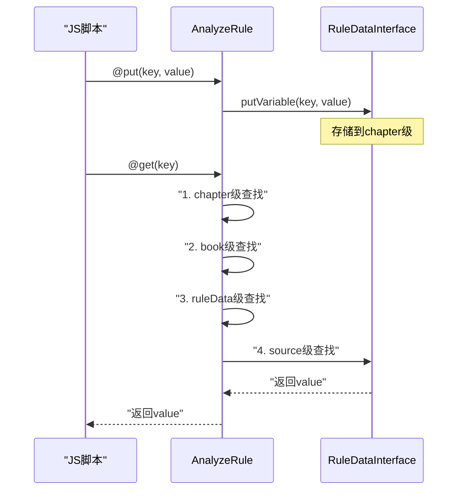
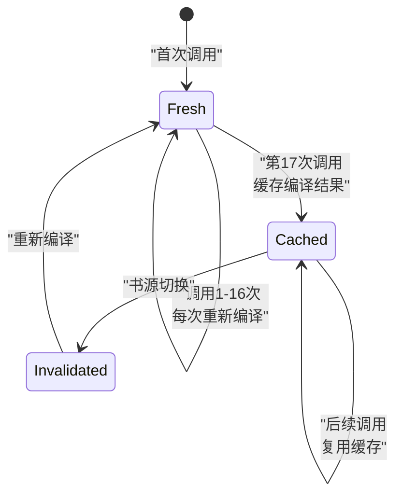

# JS 执行环境与变量机制

> AnalyzeRule/AnalyzeUrl 环境绑定、ajax 跨域请求、Rhino 编译缓存、共享作用域、@put/@get 变量机制。

> **主文档**：[规则引擎详解](./rule-engine.md) | **算法详解**：[规则引擎算法详解](./rule-engine-algorithms.md)

---

## 目录

1. [AnalyzeRule 环境绑定](#1-analyzerule-环境绑定)
2. [AnalyzeUrl 环境绑定](#2-analyzeurl-环境绑定)
3. [ajax 跨域请求](#3-ajax-跨域请求)
4. [@put/@get 变量机制](#4-putget-变量机制)
5. [RhinoScriptEngine 编译缓存](#5-rhinoscriptengine-编译缓存)
6. [共享作用域 topScopeRef](#6-共享作用域-topscoperef)
7. [JsExtensions 接口方法表](#7-jsextensions-接口方法表)
8. [规则执行完整流程图](#8-规则执行完整流程图)

---

## 1. AnalyzeRule 环境绑定

当 `AnalyzeRule.evalJS()` 被调用时，以下变量注入 JS 全局作用域：

```python
BINDINGS = {
    # 当前 AnalyzeRule 实例（暴露 JsExtensions 接口）
    "java": self,             # AnalyzeRule → JsExtensions

    # Cookie 存储
    "cookie": COOKIE_STORE,   # CookieStore 单例

    # 缓存管理器
    "cache": CACHE_MANAGER,   # CacheManager

    # 当前书源
    "source": self.source,    # BaseSource

    # 当前书籍（ruleData 转型）
    "book": self.rule_data,   # BaseBook | None

    # 当前解析的中间结果
    "result": result,         # Any

    # 当前页面的 baseUrl
    "baseUrl": self.base_url, # String | None

    # 当前章节（如果正在解析章节）
    "chapter": self.chapter,  # BookChapter | None

    # 当前章节标题的快捷方式
    "title": getattr(self.chapter, 'title', None),

    # 原始内容（HTTP 响应体或 DOM）
    "src": self.content,      # Any

    # 下一章的 URL（正文翻页时）
    "nextChapterUrl": self.next_chapter_url,  # String | None

    # RSS 文章（如果正在解析 RSS）
    "rssArticle": self.rss_article,  # RssArticle | None

    # 是否从书籍信息页进入
    "fromBookInfo": self.is_from_book_info,  # bool
}
```

**共 12 个变量**。

---

## 2. AnalyzeUrl 环境绑定

在 JS 于 URL 模板中执行（如 `{{js_code}}`）：

```python
URL_BINDINGS = {
    "java": self,          # AnalyzeUrl → JsExtensions
    "baseUrl": self.base_url,
    "cookie": COOKIE_STORE,
    "cache": CACHE_MANAGER,
    "page": self.page,              # int | None（当前页码）
    "key": self.key,                # str | None（搜索关键词）
    "speakText": self.speak_text,   # str | None（朗读文本）
    "speakSpeed": self.speak_speed, # int | None（朗读速度）
    "book": self.rule_data,         # Book | None
    "source": self.source,
    "result": result,               # 当前 URL 构建的中间结果
    "infoMap": self.info_map,       # MutableMap<String, String>
}
```

**共 11 个变量**。与 AnalyzeRule 的区别：
- 新增 `page`、`key`、`speakText`、`speakSpeed`、`infoMap`
- 缺少 `chapter`、`title`、`src`、`nextChapterUrl`、`rssArticle`、`fromBookInfo`

---

## 3. ajax 跨域请求

```python
def ajax(url: Any) -> str | None:
    """在 JS 中发送 HTTP 请求

    参数：
        url: 字符串或列表（列表取第一个元素）

    返回：
        响应体字符串，失败返回错误栈字符串

    实现：
    1. 将 url 转为字符串
    2. 创建 AnalyzeUrl（带当前 source/coroutineContext）
    3. 调用 getStrResponse() 执行请求
    4. 返回 body
    """
    url_str = str(url[0]) if isinstance(url, list) else str(url)
    analyze_url = AnalyzeUrl(
        url_str,
        source=self.source,
        coroutine_context=self.coroutine_context
    )
    try:
        response = analyze_url.get_str_response()
        return response.body
    except Exception as e:
        return traceback.format_exc()
```

---

## 4. @put/@get 变量机制



### 4.1 @put 规则

```python
def _put_rule(self, put_map: dict[str, str]):
    """执行 @put 存储

    对 putMap 中的每个键值对：
    1. value 作为规则字符串递归调用 getString
    2. 结果存入变量池（逐级存储）

    流程：
    putMap[key] = value
      → put(key, getString(value))
        → chapter.putVariable(key, value)
          → book.putVariable(key, value)
            → ruleData.putVariable(key, value)
              → source.put(key, value)
    """
    for key, value in put_map.items():
        resolved = self.get_string(value)
        self.put(key, resolved)
```

### 4.2 @get 规则

```python
def get(self, key: str) -> str:
    """从变量池获取值（逐级查找）

    特殊处理：
    - "bookName" → 直接返回 book.name
    - "title" → 直接返回 chapter.title
    - 其他 → 逐级查找

    查找顺序（优先级从高到低）：
    1. chapter.getVariable(key)
    2. book.getVariable(key)
    3. ruleData.getVariable(key)
    4. source.get(key)

    返回第一个非空值，全部找不到返回 ""
    """
    if key == "bookName":
        book = self.rule_data
        if isinstance(book, BaseBook):
            return book.name
    elif key == "title":
        if self.chapter:
            return self.chapter.title

    # 逐级查找（chapter → book → ruleData → source）
    value = self._get_variable(self.chapter, key)
    if value:
        return value
    value = self._get_variable(self.rule_data, key)
    if value:
        return value
    value = self.source.get(key) if self.source else ""
    return value
```

> **⚠️ AnalyzeUrl 与 AnalyzeRule 的 @get 查找层级差异**：上述 4 级查找（chapter → book → ruleData → source）是 `AnalyzeRule.get()` 的行为。而 `AnalyzeUrl` 中仅实现 **2 级查找**（chapter → ruleData），不查找 book 和 source 层级。这是因为 AnalyzeUrl 的构造函数只接收 `chapter` 和 `ruleData` 参数，没有 `book` 和 `source` 的变量池访问能力。在 AnalyzeUrl 的 JS 环境中调用 `@get:{key}` 时，仅在这 2 级中查找。

### 4.3 put 机制

```python
def put(self, key: str, value: str) -> str:
    """存储变量到变量池（逐级存储）

    优先级（从高到低）：
    1. chapter.putVariable
    2. book.putVariable
    3. ruleData.putVariable
    4. source.put

    注意：
    - "bookName" 和 "title" 虽可写入但会被覆盖
    - 源码会打印警告日志
    """
    if self.chapter:
        self.chapter.put_variable(key, value)
    elif isinstance(self.rule_data, BaseBook):
        self.rule_data.put_variable(key, value)
    elif self.rule_data:
        self.rule_data.put_variable(key, value)
    elif self.source:
        self.source.put(key, value)
    return value
```

### 4.4 RuleDataInterface 接口

```python
class RuleDataInterface:
    """规则数据接口 — 对应 legado RuleDataInterface

    variableMap 存储键值对，支持大小限制：
    - value < 10000 字符 → 存入 variableMap
    - value >= 10000 字符 → 存入大变量存储（putBigVariable）
    """

    @property
    def variable_map(self) -> dict[str, str]: ...

    def put_variable(self, key: str, value: str | None) -> bool:
        """存储变量

        如果 value 是 None → 删除 key
        如果 value < 10000 → 存 variableMap
        如果 value >= 10000 → 存大变量存储（如文件或数据库）
        """
        ...

    def get_variable(self, key: str) -> str:
        """获取变量

        先查 variableMap
        再查大变量存储
        都找不到返回 ""
        """
        ...

    def get_big_variable(self, key: str) -> str | None: ...
    def put_big_variable(self, key: str, value: str | None): ...
```

**10000 字符阈值**：当变量值超过 10000 字符时，自动切换到大变量存储（如文件或数据库），避免内存溢出。

---

## 5. RhinoScriptEngine 编译缓存

```python
def compile_script(js_str: str) -> CompiledScript:
    """编译 JS 脚本（带缓存）

    缓存策略：LRU 最多 16 个脚本
    使用 Java 的 Rhino 引擎编译脚本，每次 eval 时传入不同的 scope
    """
    return RHINO_ENGINE.compile(js_str)


def get_runtime_scope(bindings: dict) -> Scriptable:
    """创建运行时作用域

    实现：
    1. 创建 Scriptable 对象
    2. 将所有 bindings 注入
    3. 设置 prototype 以支持 topScope 共享
    """
    scope = RHINO_ENGINE.create_scriptable()
    for key, value in bindings.items():
        scope.put(key, scope, value)
    return scope
```

---

## 6. 共享作用域 topScopeRef

```python
def get_share_scope():
    """获取 source 级别的 JS 共享作用域

    用于在同一书源的多次 JS 调用之间共享变量和数据。

    原理：
    - 第一次创建后缓存
    - 后续通过 prototype 链共享
    - 通过 WeakReference 持有，防止内存泄漏

    实现（对应源码 RhinoScriptEngine.getRuntimeScope）：
    1. 如果是第一次 JS 调用（evalJSCallCount <= 16），
       直接用 bindings 创建 scope
    2. 第 17 次调用时，缓存 prototype 作为 topScopeRef
    3. 后续调用复用 topScopeRef
    """
    pass
```

**第 17 次调用缓存机制**：前 16 次 JS 调用每次都创建新的 scope，第 17 次开始缓存 prototype，后续调用共享该 prototype。这是一种延迟优化策略——避免为只执行少量 JS 的书源创建不必要的缓存。

> **evalJSCallCount 计数器细节**：`evalJSCallCount` 是 `RhinoScriptEngine` 的实例级计数器，每次 `evalJS()` 调用时递增 1。当 `evalJSCallCount > 16` 时，将当前 scope 的 prototype 缓存为 `topScopeRef = WeakReference(prototype)`。使用 `WeakReference` 的目的是防止内存泄漏——当书源切换或 AnalyzeRule 实例被回收时，缓存的 prototype 可被 GC 回收。



---

## 7. JsExtensions 接口方法表

JS 中通过 `java.xxx()` 调用以下方法：

| 方法 | 说明 |
|------|------|
| `ajax(url)` | HTTP GET 请求 |
| `ajaxAll(urls)` | 并发 HTTP GET |
| `connect(url, header?)` | 带自定义请求头的请求 |
| `webView(html, url, js)` | 使用 WebView 渲染页面并执行 JS |
| `base64Decode(str)` | Base64 解码 |
| `base64Encode(str)` | Base64 编码 |
| `md5Encode(str)` | MD5 编码（存在于 JsEncodeUtils 中） |
| `randomUUID()` | 生成 UUID |
| `toast(msg)` | Toast 提示 |
| `log(msg)` | 输出调试日志 |
| `getCookie(tag)` | 获取 Cookie |
| `downloadFile(url)` | 下载文件到缓存目录 |
| `queryTTF(data)` | 查询字体映射 |
| `replaceFont(...)` | 替换字体混淆 |
| `htmlFormat(html)` | HTML 格式化 |
| `t2s(s)` / `s2t(s)` | 简繁转换 |

---

## 8. 规则执行完整流程图

```
用户传入规则字符串
      │
      ├─ AnalyzeRule.getString(ruleStr)
      │       │
      │       ├─ splitSourceRule(ruleStr)  → 分割 JS/WebJS 片段
      │       │       List<SourceRule>
      │       │
      │       └─ getString(ruleList)
      │               │
      │               ├─ for each SourceRule:
      │               │       ├─ putRule(putMap)           → 先存变量
      │               │       ├─ makeUpRule(result)         → 替换 @get/{{}}/$N
      │               │       └─ switch(mode):
      │               │               ├─ WebJs  → getWebJsResult()
      │               │               ├─ Js     → evalJS()
      │               │               ├─ Json   → AnalyzeByJSonPath.getString()
      │               │               ├─ XPath  → AnalyzeByXPath.getString()
      │               │               ├─ Default → AnalyzeByJSoup.getString()
      │               │               └─ Regex  → AnalyzeByRegex.getElement()
      │               │                       └─ result.toString()
      │       └─ 返回字符串

AnalyzeByJSoup.getString(ruleStr)
      │
      ├─ SourceRule(ruleStr) → 提取 @CSS:
      ├─ RuleAnalyzer(ruleStr)  → 按 &&/||/%%/@ 分割
      ├─ ElementsSingle.getElementsSingle() → 获取元素
      └─ getResultLast(elements, lastRule)  → 提取文本

RuleAnalyzer.splitRule(&&, ||, %%)
      │
      ├─ 首段匹配: 确定 elementsType
      ├─ 平衡组跳过: 跳过选择器 []/() 中的分隔符
      ├─ 递归匹配: 二段匹配到字符串末尾
      └─ 返回 ArrayList<String>
```
