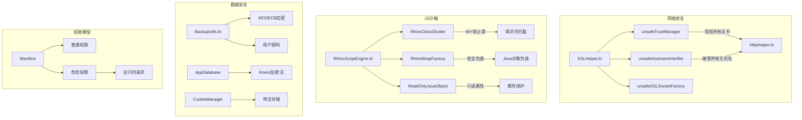
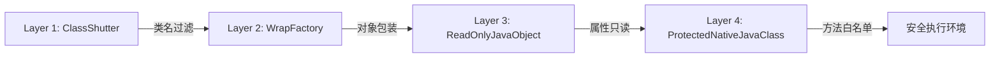

# Legado 安全模型

> 本文档分析 Legado 项目的安全架构，涵盖 SSL/TLS 信任策略、Rhino JS 沙箱、数据加密、权限模型、代码保护机制。

---

## 1. 安全架构概览

---

## 2. SSL/TLS 信任策略（最大安全风险）

### 2.1 源码分析

**源文件**: `app/src/main/java/io/legado/app/help/http/SSLHelper.kt`

| 组件 | 行号 | 实现 | 安全风险 |
|------|------|------|----------|
| `unsafeTrustManager` | L27-49 | `checkClientTrusted/checkServerTrusted` 空实现 | 🔴 **高危** - 接受任意证书 |
| `unsafeHostnameVerifier` | L70 | `HostnameVerifier { _, _ -> true }` | 🔴 **高危** - 接受任意主机名 |
| `unsafeSSLSocketFactory` | L55-63 | 使用 `unsafeTrustManager` 初始化 SSLContext | 🔴 **高危** - 绕过 SSL 验证 |

### 2.2 设计意图

源码注释（L22-26）明确说明：

> "为了解决客户端不信任服务器数字证书的问题，网络上大部分的解决方案都是让客户端不对证书做任何检查，这是一种有很大安全漏洞的办法"

**设计决策**：Legado 作为书源聚合应用，需访问大量使用自签名证书的小说网站，SSL 全信任是"功能优先"的权衡结果。

### 2.3 受影响组件

| 组件 | 文件 | 使用方式 |
|------|------|----------|
| AnalyzeUrl | `model/analyzeRule/AnalyzeUrl.kt` | 书源 HTTP 请求 |
| HttpHelper | `help/http/HttpHelper.kt` | 通用 HTTP 工具 |
| CronetInterceptor | `lib/cronet/CronetInterceptor.kt` | Cronet 网络库适配 |
| App.kt | `App.kt` | 应用初始化时配置 |

### 2.4 安全建议

| 建议 | 影响 | 实现难度 |
|------|------|----------|
| 用户可配置的证书信任策略 | 可选择信任特定证书 | 中 |
| 证书白名单机制 | 仅信任已知书源证书 | 高 |
| 警告提示 | SSL 错误时提示用户风险 | 低 |

---

## 3. Rhino JS 沙箱（4层防护）

### 3.1 防护层级

### 3.2 Layer 1: RhinoClassShutter（类名黑名单）

**源文件**: `modules/rhino/src/main/java/com/script/rhino/RhinoClassShutter.kt`

**禁止类列表**（L48-119）：

| 类别 | 禁止类/包 | 数量 |
|------|----------|------|
| **Java 核心** | `java.lang.Class`, `ClassLoader`, `Runtime`, `ProcessBuilder`, `File`, `IO.*`, `nio.*`, `reflect.*` | 25+ |
| **Android 系统** | `android.content.Intent`, `Settings`, `ActivityThread`, `Looper`, `Process` | 8 |
| **Hutool 工具** | `JarClassLoader`, `Singleton`, `RuntimeUtil`, `ClassLoaderUtil`, `ReflectUtil`, `SerializeUtil` | 7 |
| **Rhino 内部** | `org.mozilla.*`, `com.script.*`, `DefiningClassLoader` | 3+ |
| **数据库** | `AppDatabase`, `AppDatabase_Impl`, `room.*`, `sqlite.*` | 5+ |
| **包名前缀** | `android.system`, `android.database`, `dalvik.system`, `sun`, `libcore` | 10+ |

**总计**: 60+ 禁止类 + 10+ 禁止包前缀

### 3.3 Layer 2: RhinoWrapFactory（对象包装）

**源文件**: `modules/rhino/src/main/java/com/script/rhino/RhinoWrapFactory.kt`

- 拦截 Java 对象的 JS 包装
- 对敏感类返回 `null` 或安全包装器

### 3.4 Layer 3: ReadOnlyJavaObject（属性只读）

**源文件**: `modules/rhino/src/main/java/com/script/rhino/ReadOnlyJavaObject.kt`

- 阻止 JS 修改 Java 对象属性
- `get()` 正常返回，`put()` 抛出异常或忽略

### 3.5 Layer 4: ProtectedNativeJavaClass（方法白名单）

**源文件**: `modules/rhino/src/main/java/com/script/rhino/ProtectedNativeJavaClass.kt`

- 对 `System` 类限制 `load/loadLibrary/exit` 方法（L122-124）
- 其他类默认允许非危险方法

### 3.6 沙箱绕过风险

| 风险点 | 说明 | 已知漏洞 |
|--------|------|----------|
| 反射绕过 | ClassShutter 无法阻止已暴露对象的反射调用 | 中风险 |
| 新增类未列入黑名单 | 未来引入的危险类可能未被拦截 | 低风险 |
| Scriptable 对象滥用 | 某些 Scriptable 实现可能泄露敏感数据 | 低风险 |

---

## 4. 数据加密与存储

### 4.1 备份加密

**源文件**: `app/src/main/java/io/legado/app/model/backup/BackupUtils.kt`

| 属性 | 值 | 安全评估 |
|------|-----|----------|
| 加密算法 | AES | ✅ 安全算法 |
| 加密模式 | ECB | 🔴 **不安全** - 无 IV，相同明文→相同密文 |
| 密钥来源 | 用户输入密码 | ✅ 用户可控 |
| 密钥派生 | 未使用 PBKDF2/KDF | ⚠️ **警告** - 简单密码易破解 |

**已知问题**：
- ECB 模式无法隐藏数据模式（如相同章节内容的密文相同）
- 未使用加盐，字典攻击可行

### 4.2 数据库存储

**源文件**: `app/src/main/java/io/legado/app/data/AppDatabase.kt`

| 属性 | 值 | 安全评估 |
|------|-----|----------|
| 数据库框架 | Room | ✅ |
| 加密 | 无 | 🔴 **明文存储** |
| 敏感数据 | BookSource.loginUrl/cookie, ReadRecord | 🔴 **泄露风险** |

### 4.3 Cookie 存储

**源文件**: `app/src/main/java/io/legado/app/help/http/CookieManager.kt`

| 属性 | 值 | 安全评估 |
|------|-----|----------|
| 存储方式 | SharedPreferences | 🔴 **明文 XML** |
| 二级域名隔离 | ✅ 支持 | ✅ |
| 跨域名共享 | 默认禁用 | ✅ |

---

## 5. 权限模型

### 5.1 AndroidManifest 权限声明

**源文件**: `app/src/main/AndroidManifest.xml`

| 权限 | 类型 | 用途 | 风险 |
|------|------|------|------|
| `INTERNET` | 普通 | 网络请求 | ✅ |
| `ACCESS_NETWORK_STATE` | 普通 | 网络状态检测 | ✅ |
| `ACCESS_WIFI_STATE` | 普通 | WiFi 状态 | ✅ |
| `WRITE_EXTERNAL_STORAGE` | 危险 | 书籍导出/备份 | ⚠️ Android 10+ 受限 |
| `READ_EXTERNAL_STORAGE` | 危险 | 本地书籍读取 | ⚠️ Android 10+ 受限 |
| `WAKE_LOCK` | 普通 | 朗读/自动翻页保持唤醒 | ✅ |
| `FOREGROUND_SERVICE` | 普通 | 后台朗读服务 | ✅ |
| `REQUEST_INSTALL_PACKAGES` | 危险 | APK 更新安装 | ⚠️ 用户授权 |
| `CAMERA` | 危险 | 二维码扫描 | ⚠️ 按需请求 |

### 5.2 运行时权限请求

**实现方式**: Activity/Fragment 中使用 `registerForActivityResult` + `ActivityResultContracts.RequestPermission`

**关键文件**:
- `MainActivity.kt` - 存储权限请求
- `QrCodeFragment.kt` - 相机权限请求
- `HandleFileActivity.kt` - 安装权限请求

---

## 6. 代码保护

### 6.1 ProGuard 配置

**源文件**: `app/proguard-rules.pro`

| 规则 | 作用 | 安全效果 |
|------|------|----------|
| `-keep class io.legado.app.data.entities.**` | 保留 Room 实体类 | 防止数据库序列化失败 |
| `-keep class com.script.rhino.**` | 保留 Rhino 模块 | JS 调用兼容性 |
| `-keepclassmembers class * { @JsExtensions <methods>; }` | 保留 JS 扩展方法 | JS API 稳定性 |
| `-obfuscationdictionary dictionary.txt` | 自定义混淆字典 | 增加逆向难度 |

### 6.2 混淆效果

| 类型 | 混淆程度 | 说明 |
|------|----------|------|
| 业务逻辑类 | 高 | 类名/方法名/字段名混淆 |
| Room 实体 | 低 | 仅字段名混淆，类名保留 |
| Rhino 相关 | 低 | 类名保留，方法名保留 |
| JS 扩展方法 | 无 | 完全保留供 JS 调用 |

---

## 7. 安全事件日志

### 7.1 AppLog 系统

**源文件**: `app/src/main/java/io/legado/app/utils/AppLog.kt`

| 功能 | 实现 | 安全用途 |
|------|------|----------|
| 错误日志 | `put(message)` | 异常追踪 |
| 堆栈记录 | `put(throwable)` | 崩溃分析 |
| 用户操作日志 | 无 | 🔴 缺失 |

### 7.2 CrashLogsDialog

**源文件**: `app/src/main/java/io/legado/app/ui/about/CrashLogsDialog.kt`

- 显示最近崩溃日志
- 用户可导出日志供调试

---

## 8. 安全审计建议

### 8.1 高优先级

| 问题 | 建议 | 影响 |
|------|------|------|
| SSL 全信任 | 添加用户可配置的证书白名单 | 防止 MITM 攻击 |
| AES/ECB 模式 | 改用 AES/CBC 或 AES/GCM | 防止数据模式泄露 |
| 数据库明文 | 使用 SQLCipher 或 EncryptedSharedPreferences | 防止数据泄露 |

### 8.2 中优先级

| 问题 | 建议 | 影响 |
|------|------|------|
| Cookie 明文存储 | 加密存储或使用 Android Keystore | 防止会话劫持 |
| 无安全审计日志 | 添加敏感操作日志 | 安全事件追溯 |

### 8.3 低优先级

| 问题 | 建议 | 影响 |
|------|------|------|
| ClassShutter 黑名单更新 | 定期审计新增敏感类 | 防止新绕过途径 |
| ProGuard 优化 | 增强 JS 扩展方法的混淆难度 | 增加逆向成本 |

---

## 9. 源码锚点

| 安全组件 | 文件路径 | 关键行号 |
|----------|----------|----------|
| SSL 全信任 | `app/src/main/java/io/legado/app/help/http/SSLHelper.kt` | L27-70 |
| JS 类黑名单 | `modules/rhino/src/main/java/com/script/rhino/RhinoClassShutter.kt` | L48-189 |
| JS 对象包装 | `modules/rhino/src/main/java/com/script/rhino/RhinoWrapFactory.kt` | 全文件 |
| 属性只读保护 | `modules/rhino/src/main/java/com/script/rhino/ReadOnlyJavaObject.kt` | 全文件 |
| 方法白名单 | `modules/rhino/src/main/java/com/script/rhino/ProtectedNativeJavaClass.kt` | L122-124 |
| 备份加密 | `app/src/main/java/io/legado/app/model/backup/BackupUtils.kt` | AES 相关 |
| Cookie 管理 | `app/src/main/java/io/legado/app/help/http/CookieManager.kt` | 全文件 |
| 权限声明 | `app/src/main/AndroidManifest.xml` | `<uses-permission>` 标签 |
| 混淆规则 | `app/proguard-rules.pro` | 全文件 |

---

*文档生成: wiki-generator v2.1 | 最后更新: 2026-06-30*