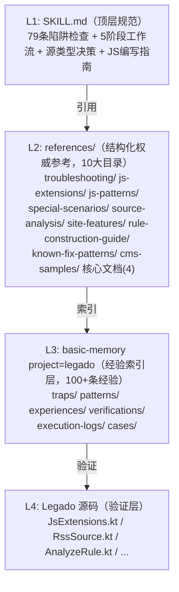
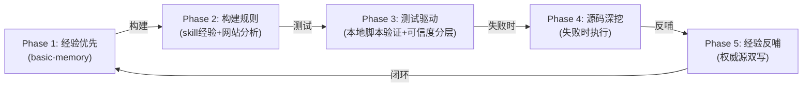

# Legado Source Creator Skill 架构说明

> 本文档描述 legado-source-creator Skill 的架构分层、5 阶段闭环工作流、basic-memory 经验引擎与审计 Skill。
>
> **状态说明（2026-08 清理）**：早期配套的 16 个验证脚本、5 个固化脚本（`.trae/skills/legado-source-creator/scripts/*.py`）与 JVM 规则引擎仿真器（`tools/legado-jvm/`、Rhino jar、Python 客户端）已从 Skill 目录移除，现存于 `.trae/skills/legado-source-creator-archive/`。原 §4（JVM 仿真器）、§6（固化脚本体系）、§8（端到端验证结果）、§9（降级路径一览）及附录（目录结构）已删除。**当前 Phase 3 的本地脚本验证能力需自行重建或直接改用真机验证**；§4/§6 编号保留空缺以维持历史引用稳定。

---

## 1. 概述

**Skill 定位**：Legado 书源/订阅源智能创建器。

**核心能力**：

| 能力 | 说明 |
|------|------|
| 79 条陷阱检查 | 覆盖 JS/Rhino、源类型/字段、URL/网络、其他关键陷阱四大类，每条均含错误做法与正确做法 |
| 5 阶段闭环工作流 | 经验优先 -> 构建规则 -> 测试驱动 -> 源码深挖 -> 经验反哺 |
| 10 大参考目录 | troubleshooting(6)、js-extensions(11)、js-patterns(11)、special-scenarios(13)、source-analysis(6)、site-features(5)、rule-construction-guide(3)、known-fix-patterns(8)、cms-samples(CMS样本)、核心文档(4) |
| basic-memory 经验引擎 | project=legado：100+ 条经验笔记，6 种笔记类型 |

---

## 2. 金字塔架构



### 各层职责

| 层级 | 职责 | 维护方式 |
|------|------|----------|
| L1 | 顶层规范，AI 执行时的主入口 | git 版本控制，Phase 5 反哺更新 |
| L2 | 结构化权威参考，按场景分类的详细文档 | git 版本控制，Phase 5 反哺更新 |
| L3 | 经验索引层，存储陷阱/模式/验证结论的摘要+指针 | basic-memory 管理，Phase 1 查询 / Phase 5 写入 |
| L4 | 事实来源，所有经验必须经源码验证 | 只读，Phase 4 深挖时读取 |

### 降级路径

| 正常模式 | 降级模式 | 触发条件 |
|----------|----------|----------|
| L3 basic-memory 搜索 | 手动 Grep 搜索 references/ | basic-memory 服务不可用 |
| L4 源码验证 | 标注"待验证"写入文档 | 源码文件不可访问 |

### 权威源规则

若 L2 与 L3 数据不一致时，以 L2（Skill 文档）为准。L3 是索引层，记录 `source_doc` 指针指向 L2 对应文档，`sync_status` 标记同步状态。

---

## 3. 5 阶段闭环工作流



### Phase 1: 经验优先

**目标**：先从 skill 文档中找答案，避免重复踩坑。

**执行步骤**：
1. 过一遍「强制陷阱检查清单」（79 条，逐项检查）
2. 搜索 basic-memory：`search_notes(query="{网站特征}", search_type="hybrid", project="legado")`
3. 查找 references/ 中同类网站经验
4. 找到经验 -> 直接复用；未找到 -> 标记为 skill 未覆盖场景

**查询策略**：

| 层级 | 调用方式 | 说明 |
|------|----------|------|
| 最小必执行 | `search_notes(query="...", search_type="hybrid", project="legado")` | 1 次调用 |
| 推荐增强 | `search_notes(tags=[...], metadata_filters={...}, project="legado")` | 根据第一轮结果决定 |
| 知识图谱 | `build_context(url="memory://...", depth=2, max_related=20, project="legado")` | 遍历关联经验 |
| 降级 | 手动 Grep 搜索 references/ | basic-memory 不可用时 |

**完成标志**：`[PHASE1_COMPLETE] basic-memory搜索:命中/未命中/降级, 陷阱检查:已检查/未检查`

### Phase 2: 构建规则

**目标**：基于 skill 经验 + 网站分析，构建完整的书源/订阅源规则。

**执行步骤**：
1. 分析目标网站（编码检测、HTML获取、类型判断、特殊场景检测）
2. 构建搜索规则（searchUrl + ruleSearch）
3. 构建详情+目录+正文规则（ruleBookInfo + ruleToc + ruleContent）
4. 处理特殊场景（CF反爬、登录/验证码、加密认证、加密图片/视频）

**前置条件**：必须完成 Phase 1。

### Phase 3: 测试驱动

**目标**：模拟 Legado 环境验证规则正确性。

**执行步骤**：
1. 静态陷阱扫描（79 条清单逐项检查）
2. 本地脚本动态验证 / Python 模拟脚本（原 JVM 仿真器与固化脚本已归档，见顶部状态说明）
3. 可信度分层标注
4. 测试通过 -> Phase 5；测试失败 -> Phase 4

**可信度分层**：

| 可信度 | 适用规则 | 验证方式 | 用户提示 |
|--------|---------|---------|---------|
| 高 | CSS 选择器、纯逻辑 JS、加密解密 | 本地脚本验证（历史为 JVM 仿真器/固化脚本） | "已通过本地验证" |
| 中 | 依赖 ajax() 但不依赖 Cookie/Header 的 JS | 本地脚本 Mock 验证（行为可能有差异） | "Cookie/Header 差异可能导致部分场景失败" |
| 低 | 依赖 ajax() 且依赖 Cookie/Header 的 JS | Python requests 补充验证 | "需要真机验证 Cookie/Header 行为" |
| 不可验证 | 依赖 WebView 的规则 | -- | "必须在 Legado App 中测试" |

**完成标志**：`[PHASE3_COMPLETE] 测试覆盖率 X%, 高可信 N, 中可信 N, 需真机:N`

### Phase 4: 源码深挖

**目标**：测试失败时，深度分析 Legado 源码定位根因。

**执行步骤**：
1. 定位失败点（哪个规则、哪个阶段、什么错误）
2. 读取对应的 Legado 源码
3. 分析源码中的实际行为，找出规则与源码行为的偏差
4. 基于源码分析结果修复规则
5. 回到 Phase 3 重新测试
6. 反思：为什么 skill 经验没覆盖这个点

**必须核实源码的场景**（12 类）：

| 场景 | 源码位置 |
|------|----------|
| JS 函数签名 | JsExtensions.kt / JsEncodeUtils.kt |
| 字段结构 | BookSource.kt / RssSource.kt |
| 规则字段含义 | SearchRule.kt / ContentRule.kt / TocRule.kt |
| 规则引擎解析行为 | AnalyzeRule.kt / RuleAnalyzer.kt |
| 网络请求流程 | HttpHelper.kt / CronetInterceptor.kt |
| WebView/Cookie 传递 | BackstageWebView.kt / WebViewActivity.kt |
| 搜索/内容调度 | WebBook.kt / SearchModel.kt / BookContent.kt |
| loginCheckJs 执行时机 | WebBook.kt / BookList.kt / BookContent.kt |
| RssSource 解析流程 | RssParserByRule.kt / Rss.kt |
| 视频/音频播放 | VideoPlay.kt / ReadRss.kt |
| Rhino 类访问限制 | RhinoClassShutter.kt |
| JS 规则的 result 类型 | AnalyzeRule.kt L828-858 |

**核心原则**：Legado 源码是唯一的真相来源。不经过源码验证的经验不写入文档。

### Phase 5: 经验反哺

**目标**：将新经验写入 skill 文档，实现自进化。

**执行步骤**：
1. 回顾：本次任务中遇到了什么新问题/新技巧/新规则
2. 验证：每条"经验"在 Legado 源码中验证
3. 分类：确定更新目标（troubleshooting/js-patterns/js-extensions/SKILL.md 等）
4. 写入：先更新 Skill 文档（权威源），再写入 basic-memory（索引层）
5. 反思：为什么 skill 之前没覆盖这个点
6. 确认：向用户报告更新内容

**权威源双写流程**：

```
1. 判断经验类型 -> 确定 note_type 与 directory
2. 先更新 Skill 文档（权威源，有 git 版本控制）
3. search_notes 检查是否已有同类笔记
   -> 找到 -> edit_note(operation="append" 或 "replace_section")
   -> 未找到 -> write_note(overwrite=False)
4. 写入 basic-memory（索引层），记录：
   - source_doc: "references/xxx.md"
   - source_sync_date: "YYYY-MM-DD"
   - sync_status: "synced"
5. 输出 [PHASE5_COMPLETE] 标志
```

**完成标志**：`[PHASE5_COMPLETE] 双写:完成/部分完成/失败, Schema验证:通过/未通过`

---

## 5. basic-memory 经验引擎

### 经验笔记类型体系

| note_type | directory | 说明 | 示例 |
|-----------|-----------|------|------|
| trap | `traps/` | 陷阱条目，对应 SKILL.md 79 条清单 | `traps/js-rhino/陷阱#1-ES5-only` |
| pattern | `patterns/` | 代码模式/技巧 | `patterns/crypto/参考摘要：加密签名模式` |
| experience | `experiences/` | 综合经验 | `experiences/经验-CF标准修复配置详解` |
| verification | `verifications/` | 源码验证结论 | `verifications/RssSource实体字段与解析流程` |
| execution-log | `execution-logs/` | Phase 执行证据 | `execution-logs/执行证据-Phase-1` |
| case | `cases/` | 实战案例 | `cases/实战案例-订阅源` |

### Schema 设计（宽松 Schema）

经验笔记使用宽松 Schema，核心字段通过 frontmatter metadata 记录：

| 字段 | 说明 | 示例 |
|------|------|------|
| `source_doc` | 指向 L2 权威文档的路径 | `"references/troubleshooting/rhino-js-traps.md"` |
| `source_sync_date` | 与权威文档同步日期 | `"2026-06-12"` |
| `sync_status` | 同步状态 | `"synced"` / `"pending"` / `"conflict"` |
| `verification_status` | 源码验证状态 | `"verified"` / `"pending"` / `"deprecated"` |
| `trap_id` | 陷阱编号（trap 类型专用） | `"#12"` |
| `severity` | 严重度（trap 类型专用） | `"high"` / `"medium"` / `"low"` |
| `category` | 分类 | `"js-rhino"` / `"source-type"` / `"crypto"` |

### 迁移分层

| 优先级 | 条目数 | 内容 | 目录 |
|--------|--------|------|------|
| P0 | 21 条 | 高频致命陷阱：#1~#13 JS/Rhino + #14~#18 源类型 + #19~#21 URL | `traps/js-rhino/` + `traps/source-type/` + `traps/url-network/` |
| P1 | 24 条 | 中频陷阱 + 核心模式：#22~#36 陷阱 + 加密签名/URL构造/result模式 | `traps/` + `patterns/` |
| P2 | 28 条 | 低频陷阱 + 验证结论 + 实战案例：#37~#54 + 源码验证 + 案例 | `traps/` + `verifications/` + `cases/` |

**总计**：100+ 条经验笔记

### Phase 1 查询策略

| 层级 | 调用 | 说明 |
|------|------|------|
| 最小必执行（1次） | `search_notes(query="{网站特征}", search_type="hybrid", project="legado", page_size=10)` | 必须执行 |
| 推荐增强 | `search_notes(tags=["..."], metadata_filters={...}, project="legado")` | 根据第一轮结果决定 |
| 知识图谱遍历 | `build_context(url="memory://{permalink}", depth=2, max_related=20, project="legado")` | 发现关联经验 |
| 降级 | 手动 Grep 搜索 references/ | basic-memory 不可用时 |

### Phase 5 反哺策略

1. 先更新 Skill 文档（权威源，有 git 版本控制）
2. 再写入 basic-memory（索引层），记录 `source_doc` + `sync_status`
3. 权威源规则：两处数据不一致时，以 Skill 文档为准

### basic-memory 内容统计（记录于 2026-06，仅供量级参考）

| 目录 | 文件数 | 说明 |
|------|--------|------|
| `traps/` | 22 | 陷阱条目（js-rhino/source-type/url-network/html-css/crypto） |
| `patterns/` | 5 | 代码模式（crypto/url-network/result/templates） |
| `experiences/` | 10 | 综合经验（CF配置/加密/WebView/coverDecode等） |
| `verifications/` | 3 | 源码验证结论（RssSource/视频链路/Rhino安全限制） |
| `execution-logs/` | 7 | Phase 执行证据 |
| `cases/` | 4 | 实战案例 |

---

## 7. 审计 Skill

### 基本信息

- **Skill 名称**：legado-workflow-auditor
- **位置**：`.trae/skills/legado-workflow-auditor/SKILL.md`
- **触发条件**：书源/订阅源创建或优化任务完成后

### 4 项审计检查

| 检查项 | 检查内容 | 查询方式 |
|--------|---------|----------|
| Phase 1 执行证据 | basic-memory 搜索是否执行、结果是否命中、陷阱检查是否完成 | `search_notes(tags=["execution-log","phase-1"], project="legado")` |
| Phase 3 执行证据 | 测试验证是否执行、覆盖率是否 > 0、可信度分层是否输出 | `search_notes(tags=["execution-log","phase-3"], project="legado")` |
| Phase 5 执行证据 | 经验反哺是否执行、双写是否完成、sync_status 是否 synced | `search_notes(tags=["execution-log","phase-5"], project="legado")` |
| 经验反哺质量 | 是否有新 trap/pattern/experience 笔记、status 是否 verified/pending、是否有 source_doc 指针 | `search_notes(query="{源特征}", project="legado", timeframe="1 day")` |

### 审计报告格式

```
=== Legado Workflow 审计报告 ===
审计日期: {日期}

Phase 1: [PASS] 已执行 / [FAIL] 未执行
  - basic-memory 搜索: 命中/未命中/降级/未执行
  - 陷阱检查: 已检查/未检查

Phase 3: [PASS] 已执行（覆盖率 X%） / [FAIL] 未执行
  - 高可信 N 条 / 中可信 N 条 / 低可信 N 条 / 不可验证: N 条

Phase 5: [PASS] 已执行（双写完成） / [WARN] 部分完成 / [FAIL] 未执行
  - Skill 文档更新: 是/否
  - basic-memory 写入: 是/否
  - sync_status: synced/pending/conflict

经验反哺: [PASS] 有新经验 / [FAIL] 无新经验
  - 新增笔记: N / 待验证: N

总体评估: [PASS] 完整 / [WARN] 部分完成 / [FAIL] 不完整
建议: {根据审计结果给出建议}
```
