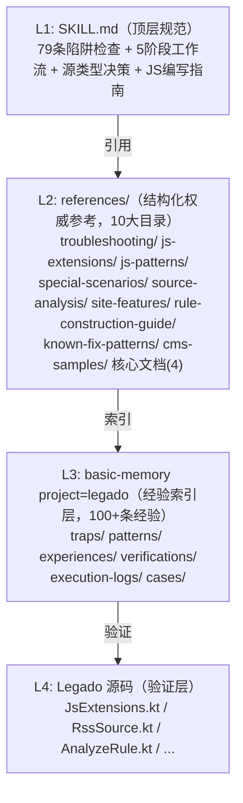
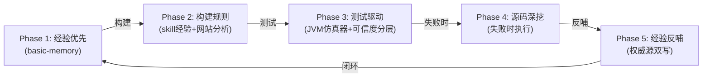

# Legado Source Creator Skill 架构说明

> 本文档描述 legado-source-creator Skill 的完整架构状态，包括金字塔分层、5 阶段闭环工作流、JVM 规则引擎仿真器、basic-memory 经验引擎、固化脚本体系、审计 Skill 及端到端验证结果。

---

## 1. 概述

**Skill 定位**：Legado 书源/订阅源智能创建器。

**核心能力**：

| 能力 | 说明 |
|------|------|
| 79 条陷阱检查| 覆盖 JS/Rhino、源类型/字段、URL/网络、其他关键陷阱四大类，每条均含错误做法与正确做法 |
| 5 阶段闭环工作流| 经验优先 -> 构建规则 -> 测试驱动 -> 源码深挖 -> 经验反哺 |
| 10 大参考目录| troubleshooting(6)、js-extensions(11)、js-patterns(11)、special-scenarios(13)、source-analysis(6)、site-features(5)、rule-construction-guide(3)、known-fix-patterns(8)、cms-samples(CMS样本）、核心文档(4) |
| 16 个验证脚本| quick-verify / verify-source / debug-source / generate-js-doc / deep-analyze-js / verify-decrypt / verify-selector / verify-image / analyze-site / debug-single / diagnose-failures / fix-rule-articles / quick-test-sources / run-full-regression / test-real-biquge / test-rss-single |
| 5 个固化脚本| verify-decrypt / verify-selector / verify-image / analyze-site / verify-source |
| JVM 仿真器| legado-jvm（Gradle项目），Rhino 桥接 + jsoup CSS 验证 + hutool 加密验证 |
| basic-memory 经验引擎 | project=legado：100+ 条经验笔记，6 种笔记类型|

---

## 2. 金字塔架构



### 各层职责

| 层级 | 职责 | 维护方式 |
|------|------|----------|
| L1 | 顶层规范，AI 执行时的主入口| git 版本控制，Phase 5 反哺更新 |
| L2 | 结构化权威参考，按场景分类的详细文档 | git 版本控制，Phase 5 反哺更新 |
| L3 | 经验索引层，存储陷阱/模式/验证结论的摘要+指针 | basic-memory 管理，Phase 1 查询 / Phase 5 写入 |
| L4 | 事实来源，所有经验必须经源码验证 | 只读，Phase 4 深挖时读取|

### 降级路径

| 正常模式 | 降级模式 | 触发条件 |
|----------|----------|----------|
| L3 basic-memory 搜索 | 手动 Grep 搜索 references/ | basic-memory 服务不可用 |
| L4 源码验证 | 标注"待验证"写入文档 | 源码文件不可访问 |
| JVM 仿真器验证| Python 仿真验证 | JVM 进程启动失败 |
| jsoup CSS 验证 | BeautifulSoup 验证 | JVM 不可用|

### 权威源规则

若 L2 与 L3 数据不一致时，以 L2（Skill 文档）为准。L3 是索引层，记录 `source_doc` 指针指向 L2 对应文档，`sync_status` 标记同步状态。

---

## 3. 5 阶段闭环工作流



### Phase 1: 经验优先

**目标**：先从 skill 文档中找答案，避免重复踩坑。

**执行步骤**：
1. 过一遍「强制陷阱检查清单」（79 条，逐项检查）
2. 搜索 basic-memory：`search_notes(query="{网站特征}", search_type="hybrid", project="legado")`
3. 查找 references/ 中同类网站经验
4. 找到经验 -> 直接复用；未找到 -> 标记为 skill 未覆盖场景

**查询策略**：

| 层级 | 调用方式 | 说明 |
|------|----------|------|
| 最小必执行 | `search_notes(query="...", search_type="hybrid", project="legado")` | 1 次调用|
| 推荐增强 | `search_notes(tags=[...], metadata_filters={...}, project="legado")` | 根据第一轮结果决定|
| 知识图谱 | `build_context(url="memory://...", depth=2, max_related=20, project="legado")` | 遍历关联经验 |
| 降级 | 手动 Grep 搜索 references/ | basic-memory 不可用时 |

**完成标志**：`[PHASE1_COMPLETE] basic-memory搜索:命中/未命中/降级, 陷阱检查:已检查/未检查`

### Phase 2: 构建规则

**目标**：基于 skill 经验 + 网站分析，构建完整的书源/订阅源规则。

**执行步骤**：
1. 分析目标网站（编码检测、HTML获取、类型判断、特殊场景检测）
2. 构建搜索规则（searchUrl + ruleSearch）
3. 构建详情+目录+正文规则（ruleBookInfo + ruleToc + ruleContent）
4. 处理特殊场景（CF反爬、登录/验证码、加密认证、加密图片/视频）

**前置条件**：必须完成 Phase 1。

### Phase 3: 测试驱动

**目标**：模拟 Legado 环境验证规则正确性。

**执行步骤**：
1. 静态陷阱扫描（79 条清单逐项检查）
2. JVM 仿真器动态验证 / Python 模拟脚本
3. 可信度分层标注
4. 测试通过 -> Phase 5；测试失败 -> Phase 4

**可信度分层**：

| 可信度| 适用规则 | 验证方式 | 用户提示 |
|--------|---------|---------|---------|
| 高 | CSS 选择器、纯逻辑 JS、加密解密 | JVM 仿真器或固化脚本 | "已通过本地验证" |
| 中 | 依赖 ajax() 但不依赖 Cookie/Header 的 JS | JVM 仿真器（Mock 行为可能有差异） | "Cookie/Header 差异可能导致部分场景失败" |
| 低 | 依赖 ajax() 且依赖 Cookie/Header 的 JS | Python requests 补充验证 | "需要真机验证 Cookie/Header 行为" |
| 不可验证 | 依赖 WebView 的规则 | -- | "必须在 Legado App 中测试" |

**完成标志**：`[PHASE3_COMPLETE] 测试覆盖率 X%, 高可信 N, 中可信 N, 需真机:N`

### Phase 4: 源码深挖

**目标**：测试失败时，深度分析 Legado 源码定位根因。

**执行步骤**：
1. 定位失败点（哪个规则、哪个阶段、什么错误）
2. 读取对应的 Legado 源码
3. 分析源码中的实际行为，找出规则与源码行为的偏差
4. 基于源码分析结果修复规则
5. 回到 Phase 3 重新测试
6. 反思：为什么 skill 经验没覆盖这个点

**必须核实源码的场景**（12 类）：

| 场景 | 源码位置 |
|------|----------|
| JS 函数签名 | JsExtensions.kt / JsEncodeUtils.kt |
| 字段结构 | BookSource.kt / RssSource.kt |
| 规则字段含义 | SearchRule.kt / ContentRule.kt / TocRule.kt |
| 规则引擎解析行为 | AnalyzeRule.kt / RuleAnalyzer.kt |
| 网络请求流程 | HttpHelper.kt / CronetInterceptor.kt |
| WebView/Cookie 传递 | BackstageWebView.kt / WebViewActivity.kt |
| 搜索/内容调度 | WebBook.kt / SearchModel.kt / BookContent.kt |
| loginCheckJs 执行时机 | WebBook.kt / BookList.kt / BookContent.kt |
| RssSource 解析流程 | RssParserByRule.kt / Rss.kt |
| 视频/音频播放 | VideoPlay.kt / ReadRss.kt |
| Rhino 类访问限制 | RhinoClassShutter.kt |
| JS 规则的 result 类型 | AnalyzeRule.kt L828-858 |

**核心原则**：Legado 源码是唯一的真相来源。不经过源码验证的经验不写入文档。

### Phase 5: 经验反哺

**目标**：将新经验写入 skill 文档，实现自进化。

**执行步骤**：
1. 回顾：本次任务中遇到了什么新问题/新技巧/新规则
2. 验证：每条"经验"在 Legado 源码中验证
3. 分类：确定更新目标（troubleshooting/js-patterns/js-extensions/SKILL.md 等）
4. 写入：先更新 Skill 文档（权威源），再写入 basic-memory（索引层）
5. 反思：为什么 skill 之前没覆盖这个点
6. 确认：向用户报告更新内容

**权威源双写流程**：

```
1. 判断经验类型 -> 确定 note_type 与 directory
2. 先更新 Skill 文档（权威源，有 git 版本控制）
3. search_notes 检查是否已有同类笔记
   -> 找到 -> edit_note(operation="append" 或 "replace_section")
   -> 未找到 -> write_note(overwrite=False)
4. 写入 basic-memory（索引层），记录：
   - source_doc: "references/xxx.md"
   - source_sync_date: "YYYY-MM-DD"
   - sync_status: "synced"
5. 输出 [PHASE5_COMPLETE] 标志
```

**完成标志**：`[PHASE5_COMPLETE] 双写:完成/部分完成/失败, Schema验证:通过/未通过`

---

## 4. JVM 规则引擎仿真器

### 架构演进

| 版本 | 项目 | 能力 | 状态 |
|------|------|------|------|
| 统一版 | `tools/legado-jvm/`（Gradle 项目） | Rhino 桥接 + jsoup CSS 选择器验证 + hutool-crypto 加密验证 | 已完成 |

### 命令协议

JVM 仿真器通过 stdin/stdout JSON 行协议通信。

| 命令 | 参数 | 返回 | 说明 |
|------|------|------|------|
| `ping` | | `{"status":"ok"}` | 健康检查 |
| `evalJS` | `code`, `context` | `{"ok":bool, "result":"...", "confidence":"high/medium/low"}` | 执行 JS 代码 |
| `evalCSS` | `html`, `selector` | `{"status":"ok/error", "results":[...], "count":N, "confidence":"high/medium/low"}` | jsoup CSS 选择器查询 |
| `decrypt` | `algo`, `key`, `data`, `iv?`, `keyEncoding?`, `ivEncoding?`, `dataEncoding?` | `{"ok":bool, "result":"base64明文", "resultUtf8":"UTF8明文", "confidence":"high"}` | hutool-crypto 解密 |
| `encrypt` | `algo`, `key`, `data`, `iv?`, `keyEncoding?`, `ivEncoding?`, `dataEncoding?` | `{"ok":bool, "result":"base64密文", "confidence":"high"}` | hutool-crypto 加密 |
| `shutdown` | -- | -- | 关闭服务端 |

### Python 客户端（RuleEngineClient）

文件位置：`scripts/legado_client/client/rule_engine_client.py`

```python
from scripts.legado_client.client.rule_engine_client import RuleEngineClient

with RuleEngineClient() as client:
    # JS 执行
    result = client.eval_js(js_code, context=html_content)

    # CSS 选择器验证
    result = client.eval_css(html, "div.article p")

    # 加密解密验证
    result = client.decrypt("AES/CBC/PKCS5Padding", key, data, iv=iv)
    result = client.encrypt("AES/CBC/PKCS5Padding", key, plaintext, iv=iv)
```

### 可信度分层标注规则

| 可信度| evalJS 场景 | evalCSS 场景 | decrypt/encrypt 场景 |
|--------|------------|-------------|---------------------|
| high | 纯计算 put/get，不调用 ajax | 标准 CSS 选择器 | hutool-crypto 原生执行 |
| medium | 调用 ajax（Mock 行为可能有差异） | 含 `@css:` 前缀 | -- |
| low | 调用 ajax 且依赖 Cookie/Header | 含 `&&`/`||`/`%%` 组合逻辑 | -- |

### MockJsExtensions 覆盖范围

| 方法 | Mock 行为 |
|------|----------|
| `java.put(key, val)` / `java.get(key)` | 内存 HashMap 存储 |
| `java.ajax(url)` | 返回 `"[mock] ajax: " + url` |
| `java.base64Encode(str)` / `java.base64Decode(str)` | 标准 Base64 编解码 |
| `java.md5Encode(str)` | 标准 MD5 |
| `java.log(msg)` | 输出到 stderr |

---

## 5. basic-memory 经验引擎

### 经验笔记类型体系

| note_type | directory | 说明 | 示例 |
|-----------|-----------|------|------|
| trap | `traps/` | 陷阱条目，对应 SKILL.md 79 条清单| `traps/js-rhino/陷阱#1-ES5-only` |
| pattern | `patterns/` | 代码模式/技巧| `patterns/crypto/参考摘要：加密签名模式` |
| experience | `experiences/` | 综合经验 | `experiences/经验-CF标准修复配置详解` |
| verification | `verifications/` | 源码验证结论 | `verifications/RssSource实体字段与解析流程` |
| execution-log | `execution-logs/` | Phase 执行证据 | `execution-logs/执行证据-91dasj-Phase-1` |
| case | `cases/` | 实战案例 | `cases/实战案例-91大事件(91dasj)` |

### Schema 设计（宽松 Schema）

经验笔记使用宽松 Schema，核心字段通过 frontmatter metadata 记录：

| 字段 | 说明 | 示例 |
|------|------|------|
| `source_doc` | 指向 L2 权威文档的路径 | `"references/troubleshooting/rhino-js-traps.md"` |
| `source_sync_date` | 与权威文档同步日期 | `"2026-06-12"` |
| `sync_status` | 同步状态 | `"synced"` / `"pending"` / `"conflict"` |
| `verification_status` | 源码验证状态 | `"verified"` / `"pending"` / `"deprecated"` |
| `trap_id` | 陷阱编号（trap 类型专用） | `"#12"` |
| `severity` | 严重度（trap 类型专用） | `"high"` / `"medium"` / `"low"` |
| `category` | 分类 | `"js-rhino"` / `"source-type"` / `"crypto"` |

### 迁移分层

| 优先级| 条目数| 内容 | 目录 |
|--------|--------|------|------|
| P0 | 21 条| 高频致命陷阱：1~#13 JS/Rhino + #14~#18 源类型 + #19~#21 URL| `traps/js-rhino/` + `traps/source-type/` + `traps/url-network/` |
| P1 | 24 条| 中频陷阱 + 核心模式：22~#36 陷阱 + 加密签名/URL构造/result模式）| `traps/` + `patterns/` |
| P2 | 28 条| 低频陷阱 + 验证结论 + 实战案例：37~#54 + 源码验证 + 案例）| `traps/` + `verifications/` + `cases/` |

**总计**：100+ 条经验笔记

### Phase 1 查询策略

| 层级 | 调用 | 说明 |
|------|------|------|
| 最小必执行（1次） | `search_notes(query="{网站特征}", search_type="hybrid", project="legado", page_size=10)` | 必须执行 |
| 推荐增强 | `search_notes(tags=["wordpress","mirages"], metadata_filters={"encryption":"aes-cbc"}, project="legado")` | 根据第一轮结果决定|
| 知识图谱遍历 | `build_context(url="memory://{permalink}", depth=2, max_related=20, project="legado")` | 发现关联经验 |
| 降级 | 手动 Grep 搜索 references/ | basic-memory 不可用时 |

### Phase 5 反哺策略

1. 先更新 Skill 文档（权威源，有 git 版本控制）
2. 再写入 basic-memory（索引层），记录 `source_doc` + `sync_status`
3. 权威源规则：两处数据不一致时，以 Skill 文档为准

### 当前 basic-memory 内容统计

| 目录 | 文件数 | 说明 |
|------|--------|------|
| `traps/` | 22 | 陷阱条目（js-rhino/source-type/url-network/html-css/crypto） |
| `patterns/` | 5 | 代码模式（crypto/url-network/result/templates） |
| `experiences/` | 10 | 综合经验（CF配置/加密/WebView/coverDecode等） |
| `verifications/` | 3 | 源码验证结论（RssSource/视频链路/Rhino安全限制） |
| `execution-logs/` | 7 | Phase 执行证据（91dasj/51cg/月光博客） |
| `cases/` | 4 | 实战案例（91dasj/51cg/611371056/月光博客） |

---

## 6. 固化脚本体系

### 5 个固化脚本（支持 --jvm 参数）

| 脚本 | 用途 | JVM 验证路径 | Python 降级路径 |
|------|------|-------------|----------------|
| `scripts/verify-decrypt.py` | 加密解密验证 | hutool-crypto 原生解密 | pycryptodome AES/DES 解密 |
| `scripts/verify-selector.py` | CSS 选择器验证| jsoup 原生选择器 | BeautifulSoup 选择器|
| `scripts/verify-image.py` | 图片加密验证 | hutool-crypto 解密 + 格式检查 | pycryptodome 解密 + 格式检查|
| `scripts/analyze-site.py` | 网站结构分析 | jsoup 解析 + 类型检查 | BeautifulSoup 解析 |
| `scripts/verify-source.py` | 源完整性验证| Rhino ES6 检查 + 字段校验 | 正则 ES6 检查 + 字段校验 |

**双路径模式**：每个固化脚本都实现了 `_init_jvm_client()` 函数，尝试启动 JVM 客户端，成功则走 JVM 验证路径（高可信），失败则降级到 Python 验证路径（中可信），并输出 WARNING 提示。

### 5 个验证脚本

| 脚本 | 用途 | 输入 | 输出 |
|------|------|------|------|
| `scripts/quick-verify.py` | 浅层可用性验证（网站存活+HTTP） | community-book-sources.json | verification-report.json |
| `scripts/verify-source.py` | 深度链路验证（规则引擎模拟解析） | community-book-sources.json | verification-report.json |
| `scripts/debug-source.py` | 端到端调试（6类）+ 修复策略 | community-book-sources.json | source-classification.json |
| `scripts/generate-js-doc.py` | JS 模式提取生成文档 | book/ 目录下的源 JSON | js-patterns/ 子文档更新 |
| `scripts/deep-analyze-js.py` | 深度 JS 分析（变量传递链/加密模式） | 高价值源 JSON | js-analysis-report.json |

### 5 个辅助脚本

| 脚本 | 用途 | 输入 | 输出 |
|------|------|------|------|
| `scripts/debug-single.py` | 单源调试 | 1 JSON 文件 | 调试报告 |
| `scripts/diagnose-failures.py` | 失败诊断 | 1 JSON 文件 | 诊断报告 |
| `scripts/fix_rule_articles.py` | 规则文章修复 | 1 JSON 文件 | 修复后源 |
| `scripts/quick-test-sources.py` | 快速批量测试| 1 JSON 目录 | 测试报告 |
| `scripts/run-full-regression.py` | 完整回归测试 | 1 JSON 目录 | 回归报告 |

### 2 个专项测试脚本

| 脚本 | 用途 | 输入 | 输出 |
|------|------|------|------|
| `scripts/test-real-biquge.py` | 笔趣阁真实源测试 | - | 测试报告 |
| `scripts/test-rss-single.py` | RSS 单源测试 | 1 JSON 文件 | 测试报告 |

### Rhino 测试工具

| 文件 | 说明 |
|------|------|
| `tools/rhino-1.8.1.jar` | Rhino 1.8.1 核心引擎（与 Legado 一致，不含 shell 工具） |

---

## 7. 审计 Skill

### 基本信息

- **Skill 名称**：legado-workflow-auditor
- **位置**：`.trae/skills/legado-workflow-auditor/SKILL.md`
- **触发条件**：书源/订阅源创建或优化任务完成后

### 4 项审计检查

| 检查项 | 检查内容 | 查询方式 |
|--------|---------|----------|
| Phase 1 执行证据 | basic-memory 搜索是否执行、结果是否命中、陷阱检查是否完成 | `search_notes(tags=["execution-log","phase-1"], project="legado")` |
| Phase 3 执行证据 | 测试验证是否执行、覆盖率是否 > 0、可信度分层是否输出 | `search_notes(tags=["execution-log","phase-3"], project="legado")` |
| Phase 5 执行证据 | 经验反哺是否执行、双写是否完成、sync_status 是否 synced | `search_notes(tags=["execution-log","phase-5"], project="legado")` |
| 经验反哺质量 | 是否有新 trap/pattern/experience 笔记、status 是否 verified/pending、是否有 source_doc 指针 | `search_notes(query="{源名称}", project="legado", timeframe="1 day")` |

### 审计报告格式

```
=== Legado Workflow 审计报告 ===
源名称: {源名称}
审计日期: {日期}

Phase 1: [PASS] 已执行 / [FAIL] 未执行
  - basic-memory 搜索: 命中/未命中/降级/未执行
  - 陷阱检查: 已检查/未检查

Phase 3: [PASS] 已执行（覆盖率 X%） / [FAIL] 未执行
  - 高可信 N 条
  - 中可信 N 条
  - 低可信 N 条
  - 不可验证: N 条

Phase 5: [PASS] 已执行（双写完成） / [WARN] 部分完成 / [FAIL] 未执行
  - Skill 文档更新: 是/否
  - basic-memory 写入: 是/否
  - sync_status: synced/pending/conflict

经验反哺: [PASS] 有新经验 / [FAIL] 无新经验
  - 新增笔记: N
  - 待验证: N

总体评估: [PASS] 完整 / [WARN] 部分完成 / [FAIL] 不完整
建议: {根据审计结果给出建议}
```

---

## 8. 端到端验证结果

### 91dasj（1大事件）订阅源

| 验证项 | 结果 |
|--------|------|
| 源类型 | RssSource（HTML 列表页） |
| basic-memory 搜索 | 命中（WordPress Mirages 图片加密经验） |
| 陷阱命中 | #52 java.ajax 返回 String；#11 decryptStr vs decrypt、Mirages 主题加密 |
| JVM 验证 | AES-CBC 解密通过（hutool-crypto 原生验证） |
| 可信度 | 高（CSS 选择器 + 加密解密均通过 JVM 验证） |
| Phase 5 反哺 | 双写完成，新增 Mirages 主题加密经验 |

### 51cg（1吃瓜网）订阅源

| 验证项 | 结果 |
|--------|------|
| 源类型 | RssSource（HTML 列表页+ Mirages 图片加密） |
| basic-memory 搜索 | 命中（Mirages 主题经验（0 条结果） |
| 陷阱命中 | #52 java.ajax 返回 String；#11 decryptStr vs decrypt；#54 Base64 版本选择 |
| JVM 验证 | AES-CBC 解密通过，图片格式检测通过（JPEG FFD8FF 头部）|
| 可信度| 高（加密解密 + 图片验证均通过） |
| Phase 5 反哺 | 双写完成，新增实战案例） |

### 月光博客订阅源

| 验证项 | 结果 |
|--------|------|
| 源类型 | RssSource（WordPress 博客） |
| basic-memory 搜索 | 命中（通用经验，无 WordPress 特定经验） |
| 陷阱命中 | RssSource 字段扁平结构、CSS 选择器陷阱） |
| JVM 验证 | CSS 选择器验证通过 |
| 可信度 | 高（CSS 选择器，无加密 JS 依赖） |
| Phase 5 反哺 | 双写完成，新增 Z-Blog 站点识别经验 |

### 性能指标对比

| 指标 | 有 JVM 仿真器 | 无 JVM 仿真器（纯 Python） |
|------|-------------|--------------------------|
| JS 规则验证可信度 | high | low（标记为"未验证"） |
| CSS 选择器验证准确度 | 与 Legado 一致（jsoup 原生） | 可能有差异（BeautifulSoup） |
| 加密解密验证 | 与 Legado 一致（hutool-crypto） | 可能有差异（pycryptodome） |
| ES6 语法检查 | 准确（Rhino 实际执行） | 可能漏检（正则匹配） |
| 启动开销 | 约 2-3 秒（JVM 进程启动） | 无 |

---

## 9. 降级路径一览

| 组件 | 正常模式 | 降级模式 | 触发条件 |
|------|----------|----------|----------|
| 经验查询 | basic-memory hybrid 搜索 | 手动 Grep 搜索 references/ | basic-memory 服务不可用 |
| JS 规则验证 | JVM 仿真器 evalJS | Python 正则/模拟 | JVM 进程启动失败 |
| CSS 选择器验证| JVM 仿真器 evalCSS（jsoup） | BeautifulSoup | JVM 不可用|
| 加密解密验证 | JVM 仿真器 decrypt/encrypt（hutool） | pycryptodome | JVM 不可用|
| 源完整性验证| JVM + Rhino ES6 检查 | Python 正则 ES6 检查| JVM 不可用|
| 图片加密验证 | JVM hutool 解密 + 格式检查 | pycryptodome 解密 | JVM 不可用|
| 源码验证 | 直接读取 Legado 源码 | 标注"待验证" | 源码文件不可访问 |
| 经验双写 | Skill 文档 + basic-memory 同步写入 | 仅写入 Skill 文档 | basic-memory 写入失败 |
| 知识图谱遍历 | build_context depth=2 | search_notes 多轮查询 | build_context 超时 |
| 审计检查 | basic-memory 查询执行证据 | 检查对话历史 | basic-memory 不可用|

---

## 附录：目录结构

```
legado-source-creator/
  SKILL.md                          -- 顶层规范（79条陷阱 + 5阶段工作流）
  AI_README.md                      -- AI 使用指南
  scripts/                          -- 验证/分析脚本
    quick-verify.py                 -- 浅层可用性验证
    verify-source.py                -- 深度链路验证
    debug-source.py                 -- 端到端调试
    generate-js-doc.py              -- JS 模式文档生成
    deep-analyze-js.py              -- 深度 JS/HTML 分析
    verify-decrypt.py               -- 固化：加密解密验证（--jvm）
    verify-selector.py              -- 固化：CSS 选择器验证（--jvm）
    verify-image.py                 -- 固化：图片加密验证（--jvm）
    analyze-site.py                 -- 固化：网站结构分析（--jvm）
    verify-source.py                -- 固化：源完整性验证（--jvm）
    debug-single.py                 -- 单源调试
    debug-source.py                  -- 源规则调试
    diagnose-failures.py             -- 失败诊断
    fix_rule_articles.py             -- 规则文章修复
    quick-test-sources.py            -- 快速批量测试
    run-full-regression.py           -- 完整回归测试
    legado_client/                   -- Python 客户端包
      client/
        rule_engine_client.py        -- JVM 仿真器 Python 客户端
        batch_runner.py              -- 批量运行器
        debug_runner.py              -- 调试运行器
        interactive_guide.py         -- 交互式引导
        obstacle_resolver.py         -- 障碍解决器
        user_interaction.py          -- 用户交互
        webview_handler.py           -- WebView 处理
      analyzer/                      -- 分析器模块
        auto_fixer.py                -- 自动修复
        confidence_evaluator.py      -- 可信度评估
        crypto_analyzer.py           -- 加密分析
        error_diagnoser.py           -- 错误诊断
        parse_strategy.py            -- 解析策略
        rule_precheck.py             -- 规则预检
        source_navigation.py         -- 源导航
        source_validator.py          -- 源验证
      experience/                    -- 经验管理模块
        conflict_resolver.py         -- 冲突解决
        experience_manager.py        -- 经验管理器
      utils/                         -- 工具模块
        config.py                    -- 配置
        file_utils.py                -- 文件工具
        jvm_helpers.py               -- JVM 辅助
        logger.py                    -- 日志
  tools/                            -- 工具
    legado-jvm/                      -- JVM 仿真器（Gradle 项目）
    rhino-1.8.1.jar                  -- Rhino 测试（与 Legado 一致）
    html_fetcher.py                  -- HTML 获取工具
    cookie_manager.py                -- Cookie 管理器
    degradation_chain.py             -- 降级链
    smart_http_client.py             -- 智能 HTTP 客户端
    knowledge_matcher.py             -- 知识匹配器
    user_action_minimizer.py         -- 用户操作最小化
  references/                       -- 结构化权威参考（10大目录）
    _INDEX.md                       -- 参考文档索引
    rule-syntax.md                  -- 规则语法核心
    url-template.md                 -- URL 模板语法
    booksource-schema.md            -- 实体字段定义
    examples.md                     -- 示例源分析
    troubleshooting/                -- 陷阱与故障排除（6子文档）
    js-extensions/                  -- JS 扩展函数（11子文档）
    js-patterns/                    -- JS 模式参考（11子文档）
    special-scenarios/              -- 特殊场景（13子文档）
    source-analysis/                -- 源码分析验证（6子文档）
    site-features/                  -- 站点特征（5子文档）
    rule-construction-guide/        -- 规则构建指南（3子文档）
    known-fix-patterns/             -- 已知修复模式（8子文档）
    cms-samples/                    -- CMS 样本）
  test-data/                        -- 测试数据
    normal-book.json                -- 正常书源测试数据
    normal-rss.json                 -- 正常 RSS 测试数据
    broken-selector.json            -- 损坏选择器测试
    encrypted-novel.json            -- 加密小说测试
    cf-protected.json               -- CF 保护站点测试
    negative-test/                  -- 负面测试用例
  output/                           -- 输出目录
    book/                           -- 书源输出
    rss/                            -- 订阅源输出
  templates/                        -- 播放器模板
    auto-video-player.html          -- 自动抓取视频播放器
    hls-video-player.html           -- 手动输入视频播放器
    inject-video-player.js          -- 注入式播放器优化脚本

legado-workflow-auditor/
  SKILL.md                          -- 审计 Skill
```
