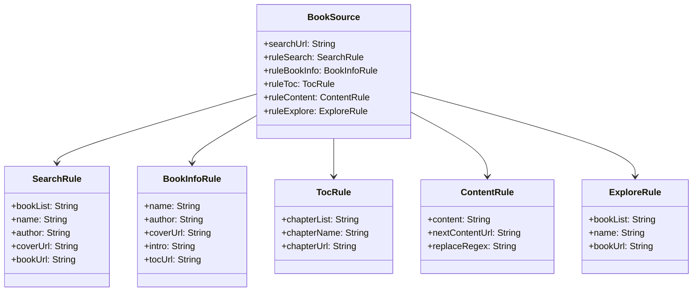
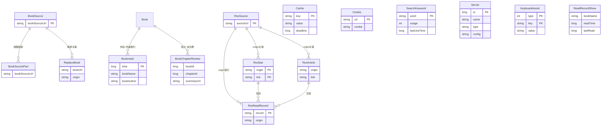

# 核心实体字段详解

> BookSource（书源）、Book、SearchBook、BookChapter 及 5 组规则的完整字段说明。
>
> **覆盖范围**：本文覆盖**核心 21 实体**（2026-08 前的既有实体）；v90-v108 扩展期新增的 **35 个实体**（AI 能力 / 朗读 / 阅读增强 / 系统管理）见 [entities-extensions.md](entities-extensions.md)。全量 56 实体 + 1 视图的权威定义以 `AppDatabase.kt` L125-147 与 `app/schemas/io.legado.app.data.AppDatabase/108.json` 为准。

---

## 1. BookSource — 书源实体

[BookSource.kt:32-103](file:///f:/myself/github/WeAgentChat/temp/legado/app/src/main/java/io/legado/app/data/entities/BookSource.kt#L32-L103)

书源是 Legado 最核心的数据对象，一个书源 = 一个网站的内容抓取配置。



### 1.1 标识与分类

| 字段 | 类型 | 说明 |
|------|------|------|
| `bookSourceUrl` | String (PK) | **主键不可重复** — 书源首页 URL（如 `https://example.com`） |
| `bookSourceName` | String | 书源名称（用户自定义标识） |
| `bookSourceGroup` | String? | 分组标签（逗号分隔多值，如 "小说,男生"） |
| `bookSourceType` | Int | 类型：0=文本, 1=音频, 2=图片, 3=文件下载, 4=视频 |
| `bookSourceComment` | String? | 备注说明（错误自动写入，以 `// Error:` 前缀） |
| `customOrder` | Int | 手动排序编号（默认0） |

### 1.2 开关控制

| 字段 | 类型 | 默认 | 说明 |
|------|------|------|------|
| `enabled` | Boolean | true | 是否启用该书源 |
| `enabledExplore` | Boolean | true | 是否启用该书源的发现功能 |
| `enabledCookieJar` | Boolean? | true | 是否启用 OkHttp Cookie 自动保存 |
| `eventListener` | Boolean | false | 是否监听事件来执行回调规则 |
| `customButton` | Boolean | false | 由书源控制的自定义按钮 |

### 1.3 网络配置

| 字段 | 类型 | 说明 |
|------|------|------|
| `header` | String? | 自定义请求头（JSON格式） |
| `loginUrl` | String? | 登录地址或登录 JS 脚本 |
| `loginUi` | String? | 登录 UI 配置 |
| `loginCheckJs` | String? | 登录状态检测 JS 代码 |
| `concurrentRate` | String? | 并发控制率（JSON格式） |
| `bookUrlPattern` | String? | 详情页 URL 正则（过滤非书籍页面） |

### 1.4 JS 扩展

| 字段 | 类型 | 说明 |
|------|------|------|
| `jsLib` | String? | **JS 库代码** — 所有规则可共享的公共 JS |
| `coverDecodeJs` | String? | 封面解密 JS（处理特殊加密的封面图） |
| `variableComment` | String? | 自定义变量说明（文档用途） |

### 1.5 排序与权重

| 字段 | 类型 | 默认 | 说明 |
|------|------|------|------|
| `weight` | Int | 0 | 智能排序权重（越大越优先） |
| `respondTime` | Long | 180000 | 响应时间(ms)，用于慢源降级 |
| `lastUpdateTime` | Long | 0 | 最后更新时间戳 |

### 1.6 URL 与规则（5组核心规则）

| 字段 | 类型 | 说明 |
|------|------|------|
| `searchUrl` | String? | 搜索页 URL 模板（含 `{{key}}`/`{{page}}`） |
| `ruleSearch` | SearchRule? | **搜索规则** — 解析搜索结果（见§2） |
| `exploreUrl` | String? | 发现页 URL 模板 |
| `exploreScreen` | String? | 发现页筛选规则 |
| `ruleExplore` | ExploreRule? | **发现规则** — 解析发现页结果（实现 BookListRule 接口） |
| `ruleBookInfo` | BookInfoRule? | **书籍详情规则** — 解析书籍信息页（见§3） |
| `ruleToc` | TocRule? | **目录规则** — 解析章节列表（见§4） |
| `ruleContent` | ContentRule? | **正文规则** — 解析章节正文（见§5） |
| `ruleReview` | ReviewRule? | 段评规则（部分书源使用） |

> ⚠️ `ruleReview: ReviewRule?` 字段当前已废弃。源码中 `getReviewRule()` 方法被注释，Converters 返回 null。

---

## 2. 规则组 1 — SearchRule 搜索规则

[SearchRule.kt](file:///f:/myself/github/WeAgentChat/temp/legado/app/src/main/java/io/legado/app/data/entities/rule/SearchRule.kt#L12-L25)

**接口：BookListRule** — 搜索结果列表的规则集，用于从搜索页 HTML 中提取每本书的信息。

| 字段 | 类型 | 书源规则示例 | 说明 |
|------|------|------------|------|
| `checkKeyWord` | String? | `"三体"` | 校验关键词（用于检测是否能正常搜索） |
| `bookList` | String? | `"div.book-list>div.item"` | **CSS选择器** — 定位每个搜索结果的容器元素 |
| `name` | String? | `"h3.title@text"` | 书名提取规则 |
| `author` | String? | `"span.author@text"` | 作者提取规则 |
| `intro` | String? | `"p.desc@text"` | 简介提取规则 |
| `kind` | String? | `"span.tag@text"` | 分类提取规则 |
| `lastChapter` | String? | `"span.latest@text"` | 最新章节标题提取规则 |
| `updateTime` | String? | `"span.time@text"` | 更新时间提取规则 |
| `bookUrl` | String? | `"a@href"` | 书籍详情页 URL 提取规则 |
| `coverUrl` | String? | `"img@src"` | 封面图 URL 提取规则 |
| `wordCount` | String? | `"span.count@text"` | 字数提取规则 |

**解析流程：** `bookList` 先定位每个书籍条目 → 在每条内依次执行其余规则提取对应字段。

---

## 3. 规则组 2 — BookInfoRule 书籍详情规则

[BookInfoRule.kt](file:///f:/myself/github/WeAgentChat/temp/legado/app/src/main/java/io/legado/app/data/entities/rule/BookInfoRule.kt#L12-L24)

用于从书籍详情页 HTML 中提取书籍元信息。

| 字段 | 类型 | 说明 |
|------|------|------|
| `init` | String? | 初始化 JS（在规则解析前执行，如登录验证） |
| `name` | String? | 书名提取规则 |
| `author` | String? | 作者提取规则 |
| `intro` | String? | 简介提取规则 |
| `kind` | String? | 分类提取规则 |
| `lastChapter` | String? | 最新章节标题提取规则 |
| `updateTime` | String? | 更新时间提取规则 |
| `coverUrl` | String? | 封面图 URL 提取规则 |
| `tocUrl` | String? | 目录页 URL 提取规则 |
| `wordCount` | String? | 总字数提取规则 |
| `canReName` | String? | 是否可重命名检测 JS |
| `downloadUrls` | String? | 下载链接提取规则（仅下载类书源） |

**与 SearchRule 的区别：** SearchRule 有 `bookList`（列表定位），BookInfoRule 直接针对整个详情页解析单本书信息。

---

## 4. 规则组 3 — TocRule 目录规则

[TocRule.kt](file:///f:/myself/github/WeAgentChat/temp/legado/app/src/main/java/io/legado/app/data/entities/rule/TocRule.kt#L9-L19)

用于从目录页 HTML 中提取完整章节列表。

| 字段 | 类型 | 说明 |
|------|------|------|
| `preUpdateJs` | String? | 目录更新前执行的 JS（如自动翻页拼接） |
| `chapterList` | String? | **CSS选择器** — 定位每个章节条目容器 |
| `chapterName` | String? | 章节名称提取规则 |
| `chapterUrl` | String? | 章节 URL 提取规则 |
| `formatJs` | String? | 格式化 JS（处理特殊 URL 格式） |
| `isVolume` | String? | 是否卷标判断规则 |
| `isVip` | String? | 是否 VIP 章节判断规则 |
| `isPay` | String? | 是否已购买判断规则 |
| `updateTime` | String? | 更新时间提取规则 |
| `nextTocUrl` | String? | 下一页目录 URL 提取规则（多页目录支持） |

---

## 5. 规则组 4 — ContentRule 正文规则

[ContentRule.kt](file:///f:/myself/github/WeAgentChat/temp/legado/app/src/main/java/io/legado/app/data/entities/rule/ContentRule.kt#L12-L24)

用于从正文页 HTML 中提取章节内容和控制显示样式。

| 字段 | 类型 | 说明 |
|------|------|------|
| `content` | String? | **正文提取规则**（CSS选择器，如 `div#content@html`） |
| `subContent` | String? | 副文规则 — 拼接在正文末尾（如歌词/注释） |
| `title` | String? | 正文中提取标题的规则（部分网站标题仅在正文中） |
| `nextContentUrl` | String? | 下一页正文 URL（单页顺序翻页） |
| `webJs` | String? | **WebView 执行 JS**（用于动态渲染页面，不为空=多页并发模式） |
| `sourceRegex` | String? | WebView 资源 URL 提取正则 |
| `replaceRegex` | String? | **正则替换规则**（%% 专用，如清理广告/排版修正） |
| `imageStyle` | String? | 图片显示模式：`DEFAULT`=居中, `FULL`=最大宽度 |
| `imageDecode` | String? | 图片解密 JS（处理加密图片 bytes） |
| `payAction` | String? | 购买操作（JS 或含 `{{js}}` 的 URL） |
| `callBackJs` | String? | 事件回调 JS |

**分页模式判断：** `webJs` 为空 → 单页顺序翻页（用 `nextContentUrl`）；`webJs` 非空 → 多页并发获取。

---

## 6. 规则组 5 — ExploreRule 发现规则

[ExploreRule.kt](file:///f:/myself/github/WeAgentChat/temp/legado/app/src/main/java/io/legado/app/data/entities/rule/ExploreRule.kt#L12-L22)

**接口：BookListRule** — 与 SearchRule 共用相同接口，用于发现页（分类浏览/榜单等）的结果解析。

| 字段 | 类型 | 说明 |
|------|------|------|
| `bookList` | String? | 发现页书籍列表容器选择器 |
| `name` | String? | 书名提取规则 |
| `author` | String? | 作者提取规则 |
| `intro` | String? | 简介提取规则 |
| `kind` | String? | 分类提取规则 |
| `lastChapter` | String? | 最新章节标题提取规则 |
| `updateTime` | String? | 更新时间提取规则 |
| `bookUrl` | String? | 书籍详情页 URL 提取规则 |
| `coverUrl` | String? | 封面图 URL 提取规则 |
| `wordCount` | String? | 字数提取规则 |

**与 SearchRule 的区别：** 字段完全相同，但 BookSource 上 `ruleSearch` 和 `ruleExplore` 分别独立配置，分别对应 `searchUrl` 和 `exploreUrl`。

---

## 7. Book — 书籍实体

[Book.kt:38-127](file:///f:/myself/github/WeAgentChat/temp/legado/app/src/main/java/io/legado/app/data/entities/Book.kt#L38-L127)

书架中的每本书，从搜索/发现添加进来后的状态持久化对象。

### 7.1 基本信息

| 字段 | 类型 | 说明 |
|------|------|------|
| `bookUrl` | String (PK) | **主键** — 详情页 URL（本地书 = 文件路径） |
| `tocUrl` | String | 目录页 URL |
| `name` | String | 书名 |
| `author` | String | 作者 |
| `kind` | String? | 分类（书源获取） |
| `customTag` | String? | 分类（用户自定义，覆盖 kind） |
| `coverUrl` | String? | 封面 URL（书源获取） |
| `customCoverUrl` | String? | 封面 URL（用户自定义，优先显示） |
| `intro` | String? | 简介（书源获取） |
| `customIntro` | String? | 简介（用户自定义） |
| `wordCount` | String? | 总字数（字符串） |

### 7.2 来源信息

| 字段 | 类型 | 说明 |
|------|------|------|
| `origin` | String | 书源 URL（`BookType.localTag` = 本地书） |
| `originName` | String | 书源名称（或本地文件名） |
| `originOrder` | Int | 书源排序 |
| `type` | Int | BookType 位标志（**运行时默认 `BookType.text` = 8**；DDL `DEFAULT 0` 仅用于迁移兼容） |

### 7.3 目录与进度

| 字段 | 类型 | 默认 | 说明 |
|------|------|------|------|
| `totalChapterNum` | Int | 0 | 总章节数 |
| `latestChapterTitle` | String? | — | 最新章节标题 |
| `latestChapterTime` | Long | 当前 | 最新章节更新时间戳 |
| `durChapterIndex` | Int | 0 | **当前阅读章节索引** |
| `durChapterPos` | Int | 0 | **当前章节内字符偏移** |
| `durChapterTitle` | String? | — | 当前章节标题 |
| `durVolumeIndex` | Int | 0 | 当前卷索引 |
| `chapterInVolumeIndex` | Int | 0 | 卷内章节索引 |
| `durChapterTime` | Long | 当前 | 最后阅读时间戳 |

### 7.4 更新与同步

| 字段 | 类型 | 默认 | 说明 |
|------|------|------|------|
| `canUpdate` | Boolean | true | 刷新书架时是否更新信息 |
| `lastCheckTime` | Long | 当前 | 最近刷新书架时间 |
| `lastCheckCount` | Int | 0 | 最近刷新发现的更新数 |
| `syncTime` | Long | 0 | WebDAV 同步时间 |
| `order` | Int | 0 | 手动排序 |
| `group` | Long | 0 | 分组 ID |

### 7.5 配置与数据

| 字段 | 类型 | 说明 |
|------|------|------|
| `charset` | String? | 字符编码（仅本地书，如 GBK/UTF-8） |
| `variable` | String? | 自定义变量（JSON格式 HashMap） |
| `readConfig` | ReadConfig? | **阅读配置**（反序/翻页动画/替换开关/模拟阅读/TTS/音频播放） |

### 7.6 运行时字段（@Ignore 不持久化）

| 字段 | 类型 | 说明 |
|------|------|------|
| `infoHtml` | String? | 信息页 HTML 缓存（避免重复请求） |
| `tocHtml` | String? | 目录页 HTML 缓存 |
| `downloadUrls` | List<String>? | 下载链接列表 |

### 7.7 ReadConfig 阅读配置子对象

[Book.kt ReadConfig](file:///f:/myself/github/WeAgentChat/temp/legado/app/src/main/java/io/legado/app/data/entities/Book.kt#L453-L470)

| 字段 | 类型 | 默认 | 说明 |
|------|------|------|------|
| `reverseToc` | Boolean | false | 目录倒序显示 |
| `pageAnim` | Int? | null | 翻页动画模式 |
| `reSegment` | Boolean | false | 是否重新分段 |
| `imageStyle` | String? | null | 图片显示模式 |
| `useReplaceRule` | Boolean? | null | 是否使用净化替换规则 |
| `delTag` | Long | 0 | 去除标签位标志（hTag=2, rubyTag=4） |
| `ttsEngine` | String? | null | TTS 朗读引擎 |
| `splitLongChapter` | Boolean | true | 是否分割超长章节 |
| `readSimulating` | Boolean | false | 模拟阅读模式 |
| `startDate` | LocalDate? | null | 模拟阅读起始日期 |
| `startChapter` | Int? | null | 模拟阅读起始章节 |
| `dailyChapters` | Int | 3 | 模拟阅读每日更新数 |
| `openCredits` | Int | 0 | 音频片头 |
| `closeCredits` | Int | 0 | 音频片尾 |
| `playMode` | Int | 0 | 音频播放模式 |
| `playSpeed` | Float | 1.0 | 音频播放速度 |

---

## 8. SearchBook — 搜索结果实体

[SearchBook.kt:30-55](file:///f:/myself/github/WeAgentChat/temp/legado/app/src/main/java/io/legado/app/data/entities/SearchBook.kt#L30-L55)

搜索结果缓存用，外键关联 BookSource，书源删除时级联删除。

| 字段 | 类型 | 说明 |
|------|------|------|
| `bookUrl` | String (PK) | 详情页 URL（主键） |
| `origin` | String (FK) | 书源 URL（外键→BookSource, CASCADE 删除） |
| `originName` | String | 书源名称 |
| `type` | Int | BookType 位标志 |
| `name` | String | 书名 |
| `author` | String | 作者 |
| `kind` | String? | 分类 |
| `coverUrl` | String? | 封面 URL |
| `intro` | String? | 简介 |
| `wordCount` | String? | 字数 |
| `latestChapterTitle` | String? | 最新章节标题 |
| `tocUrl` | String | 目录页 URL |
| `time` | Long | 搜索时间戳 |
| `variable` | String? | 自定义变量 |
| `originOrder` | Int | 书源排序 |
| `chapterWordCountText` | String? | 章节字数文本 |
| `chapterWordCount` | Int | 章节字数（数值，默认 -1） |
| `respondTime` | Int | 响应时间（默认 -1） |

**特有方法：**
- `origins` — LinkedHashSet，多名→多源合并时记录所有来源
- `toBook()` — 转为 Book 实体（加入书架时调用）
- `releaseHtmlData()` — 释放缓存的 infoHtml/tocHtml

---

## 9. BookChapter — 章节实体

[BookChapter.kt:42-59](file:///f:/myself/github/WeAgentChat/temp/legado/app/src/main/java/io/legado/app/data/entities/BookChapter.kt#L42-L59)

复合主键 `(url + bookUrl)`，外键关联 Book（CASCADE 删除）。

| 字段 | 类型 | 说明 |
|------|------|------|
| `url` | String (PK) | **章节地址**（复合主键之一） |
| `bookUrl` | String (PK, FK) | 书籍 URL（复合主键之一，外键→Book） |
| `title` | String | 章节标题 |
| `index` | Int | 章节序号（bookUrl+index 唯一索引） |
| `isVolume` | Boolean | 是否卷标 |
| `isVip` | Boolean | 是否 VIP/付费章节 |
| `isPay` | Boolean | 是否已购买 |
| `baseUrl` | String | 相对 URL 的拼接基准地址 |
| `resourceUrl` | String? | 音频真实 URL（有声书用） |
| `tag` | String? | 附加信息（更新时间/EPUB fragment ID） |
| `wordCount` | String? | 本章节字数 |
| `start` | Long? | **TXT 本地书**：章节起始字节偏移 |
| `end` | Long? | **TXT 本地书**：章节结束字节偏移 |
| `startFragmentId` | String? | **EPUB**：当前章节 fragment ID |
| `endFragmentId` | String? | **EPUB**：下一章节 fragment ID |
| `variable` | String? | 自定义变量 |
| `imgUrl` | String? | 标题段评图或视频封面 |

---

## 10. ReplaceRule — 替换净化规则

[ReplaceRule.kt:24-59](file:///f:/myself/github/WeAgentChat/temp/legado/app/src/main/java/io/legado/app/data/entities/ReplaceRule.kt#L24-L59)

独立的替换规则表，用于正文和标题的净化处理。

| 字段 | 类型 | 默认 | 说明 |
|------|------|------|------|
| `id` | Long (PK) | 时间戳 | 自增 ID |
| `name` | String | "" | 规则名称 |
| `group` | String? | null | 规则分组 |
| `pattern` | String | "" | **正则匹配模式** |
| `replacement` | String | "" | **替换内容** |
| `scope` | String? | null | 适用范围（书名/书源URL，null=全局） |
| `scopeTitle` | Boolean | false | 是否在标题上应用 |
| `scopeContent` | Boolean | true | 是否在正文上应用 |
| `excludeScope` | String? | null | 排除范围 |
| `isEnabled` | Boolean | true | 是否启用 |
| `isRegex` | Boolean | true | 是否为正则规则 |
| `timeoutMillisecond` | Long | 3000 | 正则超时时间(ms) |
| `order` | Int | MIN_VALUE | 排序权重 |

---

## 11. RssSource — RSS 订阅源实体

[RssSource.kt](file:///f:/myself/github/WeAgentChat/temp/legado/app/src/main/java/io/legado/app/data/entities/RssSource.kt)

RSS/Atom 订阅源配置，40+ 字段，实现 BaseSource 接口。

### 11.1 标识与分类

| 字段 | 类型 | 说明 |
|------|------|------|
| `sourceUrl` | String (PK) | RSS 源 URL |
| `sourceName` | String | 订阅源名称 |
| `sourceIcon` | String | 图标 URL |
| `sourceGroup` | String? | 分组标签（逗号分隔） |
| `sourceComment` | String? | 注释说明 |
| `enabled` | Boolean | 是否启用 |
| `type` | Int | 类型：0=网页, 1=图片, 2=视频 |

### 11.2 网络与登录（BaseSource 接口）

| 字段 | 类型 | 说明 |
|------|------|------|
| `jsLib` | String? | JS 库代码 |
| `enabledCookieJar` | Boolean? | 启用 CookieJar（默认 true） |
| `concurrentRate` | String? | 并发率 |
| `header` | String? | 请求头 JSON |
| `loginUrl` | String? | 登录 URL |
| `loginUi` | String? | 登录 UI |
| `loginCheckJs` | String? | 登录检测 JS |
| `coverDecodeJs` | String? | 封面解密 JS |

### 11.3 文章列表规则

| 字段 | 类型 | 说明 |
|------|------|------|
| `singleUrl` | Boolean | 是否单 URL 源（0=多文章，1=单文章） |
| `articleStyle` | Int | 文章列表 UI 样式（0-4 五种布局） |
| `ruleArticles` | String? | 文章列表提取规则 |
| `ruleNextPage` | String? | 下一页规则 |
| `sortUrl` | String? | 分类 URL |

### 11.4 文章字段规则

| 字段 | 类型 | 说明 |
|------|------|------|
| `ruleTitle` | String? | 标题提取规则 |
| `rulePubDate` | String? | 发布日期提取规则 |
| `ruleDescription` | String? | 描述提取规则 |
| `ruleImage` | String? | 图片提取规则 |
| `ruleLink` | String? | 链接提取规则 |
| `ruleContent` | String? | 正文提取规则 |

### 11.5 内容过滤与 WebView

| 字段 | 类型 | 说明 |
|------|------|------|
| `contentWhitelist` | String? | 正文 URL 白名单（正则匹配） |
| `contentBlacklist` | String? | 正文 URL 黑名单（正则匹配） |
| `shouldOverrideUrlLoading` | String? | URL 跳转拦截 JS |
| `enableJs` | Boolean | 加载文章页时是否启用 JavaScript |
| `loadWithBaseUrl` | Boolean | 使用 Base URL 加载 |
| `style` | String? | WebView 样式 CSS |
| `injectJs` | String? | 注入 JS |
| `preloadJs` | String? | 预注入 JS |
| `showWebLog` | Boolean | 输出 WebView 日志 |

### 11.6 其他配置

| 字段 | 类型 | 说明 |
|------|------|------|
| `customOrder` | Int | 手动排序 |
| `lastUpdateTime` | Long | 最后更新时间 |
| `preload` | Boolean | 启用预加载 |
| `cacheFirst` | Boolean | 优先加载缓存 |
| `searchUrl` | String? | 搜索 URL |
| `variableComment` | String? | 变量说明 |
| `startHtml` | String? | Web形式起始页HTML规则 |
| `startStyle` | String? | Web形式起始页CSS规则 |
| `startJs` | String? | Web形式起始页JS规则 |

---

## 12. RssArticle — RSS 文章实体

| 字段 | 类型 | 说明 |
|------|------|------|
| `origin` | String (复合 PK) | 关联的 RSS 源 URL |
| `sort` | String (复合 PK) | 分类/栏目标识 |
| `title` | String | 文章标题 |
| `order` | Long | 排序序号 |
| `link` | String (复合 PK) | 文章原文链接 |
| `pubDate` | String? | 发布日期字符串 |
| `description` | String? | 文章摘要 |
| `content` | String? | 已缓存的全文内容 |
| `image` | String? | 文章缩略图 |
| `group` | String | 分组名称（默认 "默认分组"） |
| `read` | Boolean | 是否已读 |
| `variable` | String? | 自定义变量 JSON |
| `type` | Int | 文章内容类型 |
| `durPos` | Int | 阅读进度位置 |

---

## 13. 其他实体概览

### BookGroup — 书籍分组

| 字段 | 类型 | 说明 |
|------|------|------|
| `groupId` | Long (PK) | 分组 ID（负数=系统内置，正数=用户自定义 2^n） |
| `groupName` | String | 分组名称 |
| `cover` | String? | 分组封面 |
| `order` | Int | 排序序号 |
| `enableRefresh` | Boolean | 是否启用刷新 |
| `show` | Boolean | 是否在书架显示 |
| `bookSort` | Int | 书籍排序方式 |
| `onlyUpdateRead` | Boolean | 仅更新已读书籍 |

### Bookmark — 书签

| 字段 | 类型 | 说明 |
|------|------|------|
| `time` | Long (PK) | 书签创建时间戳 |
| `bookName` | String | 书名 |
| `bookAuthor` | String | 作者 |
| `chapterIndex` | Int | 章节索引 |
| `chapterPos` | Int | 章节内位置 |
| `chapterName` | String | 章节名称 |
| `bookText` | String | 原文内容 |
| `content` | String | 书签/笔记内容 |

### HttpTTS — HTTP TTS 引擎

| 字段 | 类型 | 说明 |
|------|------|------|
| `id` | Long (PK) | 引擎 ID |
| `name` | String | 引擎名称 |
| `url` | String | API URL |
| `contentType` | String? | 返回音频 MIME 类型 |
| `concurrentRate` | String? | 并发率 |
| `header` | String? | 请求头 JSON |
| `loginUrl` | String? | 登录 URL |
| `loginUi` | String? | 登录 UI |
| `lastUpdateTime` | Long | 最后更新时间（默认 0） |
| `jsLib` | String? | JS库 |
| `loginCheckJs` | String? | 登录检查JS |
| `enabledCookieJar` | Boolean? | 是否启用Cookie管理（默认 false，与 BookSource/RssSource 的 true 不同） |

### RuleSub — 规则订阅

| 字段 | 类型 | 说明 |
|------|------|------|
| `id` | Long (PK AUTO) | 自增 ID |
| `name` | String | 订阅名称 |
| `url` | String | 订阅 URL |
| `type` | Int | 类型：0=书源, 1=订阅源, 3=替换规则, 4=TXT目录规则, 5=HTTP TTS, 6=字典规则（注意：2 被跳过） |
| `customOrder` | Int | 自定义排序（默认 0） |
| `autoUpdate` | Boolean | 是否自动更新 |
| `updateInterval` | Int | 更新间隔（小时，0=每次启动） |
| `update` | Long = System.currentTimeMillis() | 最近更新时间戳 |
| `silentUpdate` | Boolean = false | 静默更新（不提示用户） |
| `js` | String? = null | JS脚本 |
| `showRule` | String? = null | 显示规则 |
| `sourceUrl` | String? = null | 源地址 |

### DictRule — 字典规则

| 字段 | 类型 | 说明 |
|------|------|------|
| `name` | String (PK) | 字典名称 |
| `urlRule` | String | 查询 URL 规则（支持 `{{key}}`） |
| `showRule` | String | 结果提取/显示规则 |
| `enabled` | Boolean | 是否启用 |
| `sortNumber` | Int | 排序序号 |

### TxtTocRule — TXT 目录规则

| 字段 | 类型 | 说明 |
|------|------|------|
| `id` | Long (PK) | 规则 ID |
| `name` | String | 规则名称 |
| `rule` | String | 正则表达式 |
| `replacement` | String | 替换内容 |
| `example` | String? | 示例文本 |
| `serialNumber` | Int | 排序序号 |
| `enable` | Boolean | 是否启用 |

### BookChapterReview — 章节段评（孤立实体）

> ⚠️ 此实体存在于源码但**未注册**在 AppDatabase 的 `@Database` 注解中，属于孤立实体（幽灵条目，无对应数据库表）。可能已废弃或尚未集成，**不计入 v108 的 56 实体计数**。

| 字段 | 类型 | 说明 |
|------|------|------|
| `bookId` | Long | 书籍 ID |
| `chapterId` | Long | 章节 ID |
| `summaryUrl` | String | 段评摘要 URL |

### BaseRssArticle — RSS 文章基础接口

> RssArticle 和 RssStar 共同实现的接口，定义了 RSS 文章的公共字段。

| 字段 | 类型 | 说明 |
|------|------|------|
| `origin` | String | 关联的 RSS 源 URL |
| `link` | String | 文章原文链接 |
| `variable` | String? | 自定义变量 JSON |

---


## 14. 补充实体字段详解

> 以下实体在早期版本中仅被提及表名/类型名，此处补充完整字段说明。源码路径均为 `app/src/main/java/io/legado/app/data/entities/`。

### ReadRecord — 阅读时间记录实体

[ReadRecord.kt:6-14](file:///f:/myself/github/WeAgentChat/temp/legado/app/src/main/java/io/legado/app/data/entities/ReadRecord.kt#L6-L14)

> 表名 `readRecord`，复合主键 `(deviceId, bookName)`。按设备+书名维度记录累计阅读时长，支撑多设备阅读统计与同步。下文 `ReadRecordShow` 是其 DAO 聚合查询的展示映射类（**非 @Entity**，不是本表本体）。

| 字段 | 类型 | 注解 | 说明 |
|------|------|------|------|
| `deviceId` | String | `@PrimaryKey` | 设备唯一标识（复合主键之一） |
| `bookName` | String | `@PrimaryKey` | 书名（复合主键之二） |
| `readTime` | Long | `@ColumnInfo(defaultValue = "0")` | 累计阅读时长（毫秒） |
| `lastRead` | Long | `@ColumnInfo(defaultValue = "0")` | 最后阅读时间戳（新建对象默认当前时间） |

### ReadRecordShow — 阅读记录展示视图

[ReadRecordShow.kt:3-7](file:///f:/myself/github/WeAgentChat/temp/legado/app/src/main/java/io/legado/app/data/entities/ReadRecordShow.kt#L3-L7)

> 非 `@Entity` / `@DatabaseView` 注解的普通 data class，通常由 DAO 查询通过 `@Query` 的 SQL 聚合结果映射而来，用于展示阅读统计。

| 字段 | 类型 | 说明 |
|------|------|------|
| `bookName` | String | 书名 |
| `readTime` | Long | 累计阅读时长（毫秒） |
| `lastRead` | Long | 最后阅读时间戳 |

### KeyboardAssist — 键盘辅助实体

[KeyboardAssist.kt:10-20](file:///f:/myself/github/WeAgentChat/temp/legado/app/src/main/java/io/legado/app/data/entities/KeyboardAssist.kt#L10-L20)

> 表名 `keyboardAssists`，复合主键 `(type, key)`，用于存储输入法辅助词条（如自动补全词组）。实现了 `Parcelable`。

| 字段 | 类型 | 注解 | 说明 |
|------|------|------|------|
| `type` | Int | `@PrimaryKey`, `@ColumnInfo(defaultValue = "0")` | 辅助类型（复合主键之一） |
| `key` | String | `@PrimaryKey`, `@ColumnInfo(defaultValue = "")` | 键值（复合主键之二） |
| `value` | String | `@ColumnInfo(defaultValue = "")` | 辅助值 |
| `serialNo` | Int | `@ColumnInfo(defaultValue = "0")` | 排序序号 |
### ReplaceBook — 替换规则书籍关联

[ReplaceBook.kt:5-18](file:///f:/myself/github/WeAgentChat/temp/legado/app/src/main/java/io/legado/app/data/entities/ReplaceBook.kt#L5-L18)

> ⚠️ **幽灵条目**：非 `@Entity` 注解的普通 data class，未注册于 `@Database`，无对应数据库表，**不计入 v108 的 56 实体计数**。表示替换规则与书籍的关联关系。用于「换源」功能中展示某本书在不同书源下的搜索结果。`type` 默认值取自 `BookType.text`。

| 字段 | 类型 | 说明 |
|------|------|------|
| `bookUrl` | String | 书籍 URL |
| `origin` | String | 书源 URL |
| `originName` | String | 书源名称 |
| `type` | Int | 书籍类型（默认 `BookType.text` = 0） |
| `name` | String | 书名 |
| `author` | String | 作者 |
| `kind` | String? | 分类标签 |
| `coverUrl` | String? | 封面 URL |
| `intro` | String? | 简介 |
| `wordCount` | String? | 字数 |
| `latestChapterTitle` | String? | 最新章节标题 |
| `tocUrl` | String | 目录页 URL |
| `originOrder` | Int | 书源排序序号（默认 0） |

### RssReadRecord — RSS 阅读记录

[RssReadRecord.kt:8-27](file:///f:/myself/github/WeAgentChat/temp/legado/app/src/main/java/io/legado/app/data/entities/RssReadRecord.kt#L8-L27)

> 表名 `rssReadRecords`，单主键 `record`（文章链接），索引 `origin`。记录 RSS 文章的已读状态和阅读进度。提供 `toRssArticle()` 和 `toStar()` 转换方法。

| 字段 | 类型 | 注解 | 说明 |
|------|------|------|------|
| `record` | String | `@PrimaryKey` | 文章链接（主键） |
| `title` | String? | | 文章标题 |
| `readTime` | Long? | | 阅读时间戳 |
| `read` | Boolean | | 是否已读（默认 true） |
| `origin` | String | `@ColumnInfo(defaultValue = "")`, 索引列 | 关联的 RSS 源 URL |
| `sort` | String | `@ColumnInfo(defaultValue = "")` | 排序值 |
| `image` | String? | | 封面图 URL |
| `type` | Int | `@ColumnInfo(defaultValue = "0")` | 类型：0=网页, 1=图片, 2=视频 |
| `durPos` | Int | `@ColumnInfo(defaultValue = "0")` | 阅读进度位置 |
| `pubDate` | String? | | 发布日期 |

### RssStar — RSS 收藏

[RssStar.kt:11-34](file:///f:/myself/github/WeAgentChat/temp/legado/app/src/main/java/io/legado/app/data/entities/RssStar.kt#L11-L34)

> 表名 `rssStars`，复合主键 `(origin, link)`。实现了 `BaseRssArticle` 接口和 `variableMap` 懒加载。提供 `toRssArticle()` 和 `toRecord()` 转换方法。

| 字段 | 类型 | 注解 | 说明 |
|------|------|------|------|
| `origin` | String | `@PrimaryKey`, `BaseRssArticle` | 关联的 RSS 源 URL |
| `link` | String | `@PrimaryKey`, `BaseRssArticle` | 文章原文链接 |
| `sort` | String | | 排序值 |
| `title` | String | | 文章标题 |
| `starTime` | Long | | 收藏时间戳 |
| `pubDate` | String? | | 发布日期 |
| `description` | String? | | 文章摘要 |
| `content` | String? | | 文章内容 |
| `image` | String? | | 封面图 URL |
| `group` | String | `@ColumnInfo(defaultValue = "默认分组")` | 分组名称 |
| `variable` | String? | `BaseRssArticle` | 自定义变量 JSON |
| `type` | Int | `@ColumnInfo(defaultValue = "0")` | 类型：0=网页, 1=图片, 2=视频 |
| `durPos` | Int | `@ColumnInfo(defaultValue = "0")` | 阅读进度位置 |

> **非持久化字段**（`@Transient` + `@Ignore` + `@IgnoredOnParcel`）：`variableMap: HashMap<String, String>` -- 从 `variable` JSON 懒加载解析的键值映射。

### BookSourcePart — 书源分段规则视图

[BookSourcePart.kt:17-44](file:///f:/myself/github/WeAgentChat/temp/legado/app/src/main/java/io/legado/app/data/entities/BookSourcePart.kt#L17-L44)

> `@DatabaseView` 注解，视图名 `book_sources_part`。从 `book_sources` 表中选取书源的核心字段子集，用于书源列表展示、分组管理等轻量级查询场景，避免加载完整 BookSource 对象。

**视图定义 SQL**（[BookSourcePart.kt:11-15](file:///f:/myself/github/WeAgentChat/temp/legado/app/src/main/java/io/legado/app/data/entities/BookSourcePart.kt#L11-L15)）：

```sql
SELECT bookSourceUrl, bookSourceName, bookSourceGroup, customOrder, enabled, enabledExplore,
       (loginUrl IS NOT NULL AND TRIM(loginUrl) <> '') AS hasLoginUrl,
       lastUpdateTime, respondTime, weight,
       (exploreUrl IS NOT NULL AND TRIM(exploreUrl) <> '') AS hasExploreUrl,
       eventListener, bookSourceType
FROM book_sources
```

| 字段 | 类型 | 说明 |
|------|------|------|
| `bookSourceUrl` | String | 书源首页 URL |
| `bookSourceName` | String | 书源名称 |
| `bookSourceGroup` | String? | 分组 |
| `customOrder` | Int | 手动排序编号 |
| `enabled` | Boolean | 是否启用 |
| `enabledExplore` | Boolean | 启用发现 |
| `hasLoginUrl` | Boolean | 是否有登录地址（SQL 计算） |
| `lastUpdateTime` | Long | 最后更新时间 |
| `respondTime` | Long | 响应时间（默认 180000ms） |
| `weight` | Int | 智能排序权重 |
| `hasExploreUrl` | Boolean | 是否有发现 URL（SQL 计算） |
| `eventListener` | Boolean | 是否启用事件监听 |
| `bookSourceType` | Int | 书源类型 |

### Cache — 缓存实体

[Cache.kt:7-13](file:///f:/myself/github/WeAgentChat/temp/legado/app/src/main/java/io/legado/app/data/entities/Cache.kt#L7-L13)

> 表名 `caches`，主键 `key`，唯一索引 `key`。通用键值缓存，支持过期时间。

| 字段 | 类型 | 注解 | 说明 |
|------|------|------|------|
| `key` | String | `@PrimaryKey`, 唯一索引 | 缓存键 |
| `value` | String? | | 缓存值 |
| `deadline` | Long | | 过期截止时间戳（0=永不过期） |

### Cookie — Cookie 实体

[Cookie.kt:7-12](file:///f:/myself/github/WeAgentChat/temp/legado/app/src/main/java/io/legado/app/data/entities/Cookie.kt#L7-L12)

> 表名 `cookies`，主键 `url`，唯一索引 `url`。存储每个 URL 对应的 Cookie 字符串，供书源/RSS 源的 HTTP 请求携带。

| 字段 | 类型 | 注解 | 说明 |
|------|------|------|------|
| `url` | String | `@PrimaryKey`, 唯一索引 | URL 标识 |
| `cookie` | String | | Cookie 字符串 |

### SearchKeyword — 搜索关键词

[SearchKeyword.kt:11-20](file:///f:/myself/github/WeAgentChat/temp/legado/app/src/main/java/io/legado/app/data/entities/SearchKeyword.kt#L11-L20)

> 表名 `search_keywords`，主键 `word`，唯一索引 `word`。实现了 `Parcelable`。记录搜索关键词的使用频次，用于搜索建议排序。

| 字段 | 类型 | 注解 | 说明 |
|------|------|------|------|
| `word` | String | `@PrimaryKey`, 唯一索引 | 搜索关键词 |
| `usage` | Int | | 使用次数（默认 1） |
| `lastUseTime` | Long | | 最后使用时间戳（默认 `System.currentTimeMillis()`） |

### Server — 服务器配置

[Server.kt:15-23](file:///f:/myself/github/WeAgentChat/temp/legado/app/src/main/java/io/legado/app/data/entities/Server.kt#L15-L23)

> 表名 `servers`，主键 `id`。实现了 `Parcelable`。存储 WebDAV 等远程服务器配置，`config` 字段以 JSON 存储结构化配置（如 WebDavConfig）。内嵌枚举 `TYPE` 和数据类 `WebDavConfig`。

| 字段 | 类型 | 注解 | 说明 |
|------|------|------|------|
| `id` | Long | `@PrimaryKey` | 服务器 ID（默认 `System.currentTimeMillis()`） |
| `name` | String | | 服务器名称 |
| `type` | TYPE | | 服务器类型枚举（目前仅 `WEBDAV`） |
| `config` | String? | | JSON 格式配置字符串 |
| `sortNumber` | Int | | 排序序号 |

**内嵌类型**：

| 类型 | 定义位置 | 字段 |
|------|----------|------|
| `TYPE` 枚举 | [Server.kt:25-27](file:///f:/myself/github/WeAgentChat/temp/legado/app/src/main/java/io/legado/app/data/entities/Server.kt#L25-L27) | `WEBDAV` |
| `WebDavConfig` 数据类 | [Server.kt:50-55](file:///f:/myself/github/WeAgentChat/temp/legado/app/src/main/java/io/legado/app/data/entities/Server.kt#L50-L55) | `url: String`, `username: String`, `password: String` |

### Bookmark — 书签（增强）

[Bookmark.kt:10-24](file:///f:/myself/github/WeAgentChat/temp/legado/app/src/main/java/io/legado/app/data/entities/Bookmark.kt#L10-L24)

> 表名 `bookmarks`，主键 `time`，非唯一索引 `(bookName, bookAuthor)`。实现了 `Parcelable`。上节已有基本字段表，此处补充注解与索引信息。

**索引**：`Index(value = ["bookName", "bookAuthor"], unique = false)` -- 按书名+作者联合索引，用于快速查询某本书的所有书签。

| 字段 | 类型 | 注解 | 说明 |
|------|------|------|------|
| `time` | Long | `@PrimaryKey` | 书签创建时间戳（默认 `System.currentTimeMillis()`） |
| `bookName` | String | 索引列 | 书名 |
| `bookAuthor` | String | 索引列 | 作者 |
| `chapterIndex` | Int | | 章节索引 |
| `chapterPos` | Int | | 章节内位置 |
| `chapterName` | String | | 章节名称 |
| `bookText` | String | | 原文内容 |
| `content` | String | | 书签/笔记内容 |

### BookChapterReview — 章节段评（增强）

[BookChapterReview.kt:7-13](file:///f:/myself/github/WeAgentChat/temp/legado/app/src/main/java/io/legado/app/data/entities/BookChapterReview.kt#L7-L13)

> ⚠️ 此实体**未注册**在 AppDatabase 的 `@Database` 注解中，属于孤立实体。上节已有基本字段表，此处补充注解信息。

| 字段 | 类型 | 注解 | 说明 |
|------|------|------|------|
| `bookId` | Long | `@ColumnInfo(defaultValue = "0")` | 书籍 ID |
| `chapterId` | Long | | 章节 ID |
| `summaryUrl` | String | | 段评摘要 URL |

### 实体关系图



---

## 15. 相关代码锚点


| 实体 | 文件 |
|------|------|
| BookSource | [BookSource.kt](file:///f:/myself/github/WeAgentChat/temp/legado/app/src/main/java/io/legado/app/data/entities/BookSource.kt) |
| SearchRule | [SearchRule.kt](file:///f:/myself/github/WeAgentChat/temp/legado/app/src/main/java/io/legado/app/data/entities/rule/SearchRule.kt) |
| BookInfoRule | [BookInfoRule.kt](file:///f:/myself/github/WeAgentChat/temp/legado/app/src/main/java/io/legado/app/data/entities/rule/BookInfoRule.kt) |
| TocRule | [TocRule.kt](file:///f:/myself/github/WeAgentChat/temp/legado/app/src/main/java/io/legado/app/data/entities/rule/TocRule.kt) |
| ContentRule | [ContentRule.kt](file:///f:/myself/github/WeAgentChat/temp/legado/app/src/main/java/io/legado/app/data/entities/rule/ContentRule.kt) |
| ExploreRule | [ExploreRule.kt](file:///f:/myself/github/WeAgentChat/temp/legado/app/src/main/java/io/legado/app/data/entities/rule/ExploreRule.kt) |
| BookListRule 接口 | [BookListRule.kt](file:///f:/myself/github/WeAgentChat/temp/legado/app/src/main/java/io/legado/app/data/entities/rule/BookListRule.kt) |
| Book | [Book.kt](file:///f:/myself/github/WeAgentChat/temp/legado/app/src/main/java/io/legado/app/data/entities/Book.kt) |
| SearchBook | [SearchBook.kt](file:///f:/myself/github/WeAgentChat/temp/legado/app/src/main/java/io/legado/app/data/entities/SearchBook.kt) |
| BookChapter | [BookChapter.kt](file:///f:/myself/github/WeAgentChat/temp/legado/app/src/main/java/io/legado/app/data/entities/BookChapter.kt) |
| ReplaceRule | [ReplaceRule.kt](file:///f:/myself/github/WeAgentChat/temp/legado/app/src/main/java/io/legado/app/data/entities/ReplaceRule.kt) |
| RssSource | [RssSource.kt](file:///f:/myself/github/WeAgentChat/temp/legado/app/src/main/java/io/legado/app/data/entities/RssSource.kt) |
| RssArticle | [RssArticle.kt](file:///f:/myself/github/WeAgentChat/temp/legado/app/src/main/java/io/legado/app/data/entities/RssArticle.kt) |
| BookGroup | [BookGroup.kt](file:///f:/myself/github/WeAgentChat/temp/legado/app/src/main/java/io/legado/app/data/entities/BookGroup.kt) |
| Bookmark | [Bookmark.kt](file:///f:/myself/github/WeAgentChat/temp/legado/app/src/main/java/io/legado/app/data/entities/Bookmark.kt) |

---

## Python 重构参考

> 实体类 Python dataclass 映射

### BookSource dataclass

```python
from dataclasses import dataclass, field
from typing import Optional

@dataclass
class BookSource:
    bookSourceUrl: str = ''
    bookSourceName: str = ''
    bookSourceGroup: str = ''
    bookSourceType: int = 0
    # 规则组
    searchUrl: str = ''
    ruleSearch: Optional[SearchRule] = None
    ruleBookInfo: Optional[BookInfoRule] = None
    ruleToc: Optional[TocRule] = None
    ruleContent: Optional[ContentRule] = None
    ruleExplore: Optional[ExploreRule] = None
```

### 规则字段 dataclass

```python
@dataclass
class SearchRule:
    checkKeyWord: str = ''
    bookList: str = ''
    name: str = ''
    author: str = ''
    kind: str = ''
    intro: str = ''
    coverUrl: str = ''
    bookUrl: str = ''
    wordCount: str = ''
    lastChapter: str = ''
    tocUrl: str = ''
```
