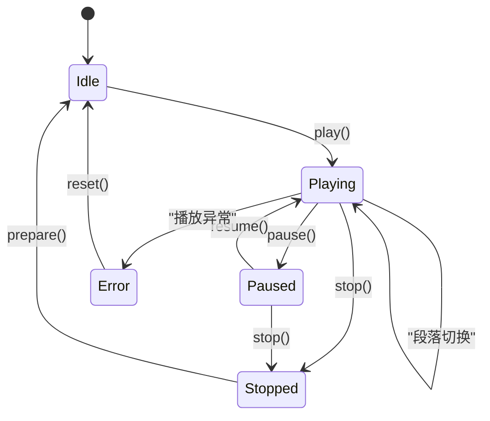

# Android Service 层

> **核心问题**：App 包含哪些后台服务？朗读/音频/视频/下载/缓存分别如何实现？
> **答案**：11 个 Service，核心是 BaseReadAloudService 抽象基类（朗读状态机+音频焦点+通知+定时），以及 AudioPlayService/VideoPlayService/DownloadService/CacheBookService/ExportBookService 等专项服务。

---

## 1. Service 全景

```
service/
├── BaseReadAloudService      — 朗读服务抽象基类（核心）
│   ├── TTSReadAloudService   — TTS 引擎朗读
│   └── HttpReadAloudService  — HTTP 在线语音朗读
├── AudioPlayService          — 音频播放服务
├── VideoPlayService          — 视频播放服务（GSY Video）
├── WebService                — Web HTTP 服务（NanoHTTPD 前台化）
├── DownloadService           — 文件下载服务
├── CacheBookService          — 书籍缓存服务（缓存章节内容）
├── ExportBookService         — 书籍导出服务（导出TXT/EPUB）
├── CheckSourceService        — 书源检验服务（批量验证书源可用性）
└── WebTileService            — 快速设置 Tile 服务（Android 7.0+）
```

---

## 2. BaseReadAloudService — 朗读核心

**文件**：[BaseReadAloudService.kt](file:///f:/myself/github/WeAgentChat/temp/legado/app/src/main/java/io/legado/app/service/BaseReadAloudService.kt)

### 全局状态

```kotlin
companion object {
    var isRun: Boolean        // 服务是否运行
    var pause: Boolean        // 是否暂停
    var timeMinute: Int       // 定时剩余分钟数
    fun isPlay() = isRun && !pause
}
```

### 生命周期状态机



```
onCreate()                     isRun=true, pause=false
    ├── observeLiveBus()        — 监听播放/暂停/跳转事件
    ├── initMediaSession()      — 媒体会话（系统通知媒体控件）
    ├── initBroadcastReceiver() — 耳机拔出广播→暂停
    ├── initPhoneStateListener()— 来电监听→暂停朗读
    ├── setTimer()              — 设置朗读定时
    └── 加载封面图 → 通知栏
    
onStartCommand(intent)
    └── IntentAction 分发:
        play / pause / resume / upTtsSpeechRate
        prevParagraph / nextParagraph
        prevChapter / nextChapter
        addTimer (每次+10分钟, 最大180) / setTimer
        stop → stopSelf()

onDestroy()
    ├── wakeLock/wifiLock.release()
    ├── abandonFocus()
    ├── postEvent(ALOUD_STATE, STOP)
    ├── notificationManager.cancel()
    ├── mediaSessionCompat.release()
    └── ReadBook.uploadProgress()    — 上传阅读进度
```

### WakeLock 策略

所有 WakeLock 均使用 `setReferenceCounted(false)` 避免引用计数带来的状态不一致。

| Service | WakeLock 类型 | Tag | 触发条件 |
|---------|--------------|-----|----------|
| **BaseReadAloudService** | `PARTIAL_WAKE_LOCK` | `legado:ReadAloudService` | `readAloudWakeLock=true` 时 play/resume |
| **BaseReadAloudService** | `WIFI_MODE_FULL_HIGH_PERF` WifiLock | `legado:AudioPlayService` | 同上 |
| **AudioPlayService** | `PARTIAL_WAKE_LOCK` | `legado:AudioPlayService` | `audioPlayUseWakeLock=true` 时 play/resume |
| **AudioPlayService** | `WIFI_MODE_FULL_HIGH_PERF` WifiLock | `legado:AudioPlayService` | 同上 |
| **WebService** | `PARTIAL_WAKE_LOCK` | `legado:WebService` | `webServiceWakeLock=true` 时 onCreate/onStartCommand |
| **WebService** | `WIFI_MODE_FULL_HIGH_PERF` WifiLock | `legado:WebService` | 同上 |

获取时机：`play()` / `resume()` / `onCreate()` / `onStartCommand("serve")`  
释放时机：`pauseReadAloud()` / `pause()` / `onDestroy()`

### 音频焦点管理

[BaseReadAloudService.kt:L429-L444](file:///f:/myself/github/WeAgentChat/temp/legado/app/src/main/java/io/legado/app/service/BaseReadAloudService.kt#L429)

```
AudioFocusRequestCompat (MediaHelp.buildAudioFocusRequestCompat)
    ├── AUDIOFOCUS_GAIN             → 恢复朗读
    ├── AUDIOFOCUS_LOSS             → 暂停朗读
    ├── AUDIOFOCUS_LOSS_TRANSIENT   → 标记需要恢复，暂停朗读
    └── AUDIOFOCUS_LOSS_TRANSIENT_CAN_DUCK → 不做处理
```

### 电话状态监听

[BaseReadAloudService.kt:L752-L781](file:///f:/myself/github/WeAgentChat/temp/legado/app/src/main/java/io/legado/app/service/BaseReadAloudService.kt#L752)

```
ReadAloudPhoneStateListener:
├── CALL_STATE_IDLE    → 若标记 needResume → 恢复朗读
├── CALL_STATE_RINGING → 正在播放 → 暂停（标记 needResume）
└── CALL_STATE_OFFHOOK → 不做处理
```

### 通知栏媒体控件

[BaseReadAloudService.kt:L599-L670](file:///f:/myself/github/WeAgentChat/temp/legado/app/src/main/java/io/legado/app/service/BaseReadAloudService.kt#L599)

使用 `NotificationCompat.MediaStyle`，5个动作按钮：
- ⏮ 上一章 / ▶/⏸ 播放暂停 / ⏭ 下一章 / ⏹ 停止 / ⏱ 定时

### 段落导航

```
prevP(): nowSpeak > 0 → 跳上一段; nowSpeak == 0 → 跳上一章
nextP(): nowSpeak < contentList.size-1 → 跳下一段; 否则 → 下一章

readAloudNumber — 全局朗读位置计数器
nowSpeak         — 当前段落索引
paragraphStartPos— 段落内起始偏移
```

---

## 3. TTSReadAloudService — TTS 朗读

**文件**：[TTSReadAloudService.kt](file:///f:/myself/github/WeAgentChat/temp/legado/app/src/main/java/io/legado/app/service/TTSReadAloudService.kt)

- 继承 `BaseReadAloudService`
- 使用 Android `TextToSpeech` API（系统 TTS 引擎）
- `AppConfig.ttsEngine` 指定引擎（默认系统引擎）
- `speechRate` 语速控制（1x-3x）

---

## 4. HttpReadAloudService — HTTP 在线朗读

**文件**：[HttpReadAloudService.kt](file:///f:/myself/github/WeAgentChat/temp/legado/app/src/main/java/io/legado/app/service/HttpReadAloudService.kt)

- 继承 `BaseReadAloudService`
- 通过 `HttpTTS` 数据库实体的 URL 规则获取音频流，适用于自定义在线 TTS 接口（如 Azure/Edge TTS）
- 使用 **ExoPlayer** 播放音频，通过 `exoPlayer.addListener(this)` 监听播放状态（STATE_READY → 播放、STATE_ENDED → 下一段、onMediaItemTransition → 段落推进）
- **双模式切换**：非流模式（`downloadAndPlayAudios`，先全部下载再播放）和流模式（`downloadAndPlayAudiosStream`，使用 CacheDataSource 边下边播）
- **缓存策略**：`SimpleCache(128MB, LRU)` 缓存目录 `cache/httpTTS/`，文件名 `MD5(标题)_MD5(TTS地址+语速+内容).mp3`，已缓存则跳过下载，销毁时清理非当前章节+超10分钟的缓存和静音文件
- **错误重试**：下载错误次数 >5 暂停，播放错误次数 ≥5 暂停

---

## 5. AudioPlayService — 音频播放

**文件**：[AudioPlayService.kt](file:///f:/myself/github/WeAgentChat/temp/legado/app/src/main/java/io/legado/app/service/AudioPlayService.kt)

- 使用 **ExoPlayer** 播放书籍音频章节，支持 `seekTo()` 恢复位置和片头跳过（`skipStartMs`）
- 由 `AudioPlay` 全局单例驱动，监听 `onPlaybackStateChanged` 四种状态（IDLE/BUFFERING/READY/ENDED）
- 每500ms循环更新播放进度、缓冲进度和歌词进度（`upPlayProgress()`）
- 支持后台播放 + 通知栏控件 + 定时器 + 片尾跳过检查

---

## 6. VideoPlayService — 视频播放

**文件**：[VideoPlayService.kt](file:///f:/myself/github/WeAgentChat/temp/legado/app/src/main/java/io/legado/app/service/VideoPlayService.kt)

- 基于 GSY Video（GSYVideoPlayer）
- 支持悬浮窗播放 (`FloatingPlayer`)
- 视频源通过书源规则解析获取

---

## 7. WebService — Web 前台服务

**文件**：[WebService.kt](file:///f:/myself/github/WeAgentChat/temp/legado/app/src/main/java/io/legado/app/service/WebService.kt)

- 将 NanoHTTPD 的 `HttpServer` 前台化，同时启动 **WebSocketServer**（端口 = HTTP 端口 + 1）
- HTTP 端口默认 1122，WebSocket 端口默认 1123，端口范围校验 1024-65530
- 网络变化时自动刷新 IP 列表（注册 NetworkChangedListener）
- 确保 Web 管理界面后台不被系统杀死，可选 WakeLock（`webServiceWakeLock` 配置）
- 常驻通知显示 Web 服务运行状态（展示所有本地 IP:Port 列表 + 复制地址/停止按钮）

---

## 8. DownloadService — 下载服务

**文件**：[DownloadService.kt](file:///f:/myself/github/WeAgentChat/temp/legado/app/src/main/java/io/legado/app/service/DownloadService.kt)

- 管理文件下载任务队列
- 通知栏显示下载进度
- 支持暂停/取消/重试

### 实现细节

基于 Android `DownloadManager` 系统服务实现通用文件下载。用户传入 URL 和文件名，系统 DownloadManager 在后台完成 HTTP 下载，服务负责进度查询、通知展示、下载完成后的文件打开。

> **注意**：此服务下载的是**通用文件**（如 APK、ZIP 等），书籍章节缓存由 CacheBookService 负责。

**核心流程**：

```
startDownload(url, fileName):
  1. 参数校验: url 和 fileName 不能为空
  2. 去重检查: 相同 URL 不能重复添加
  3. 调用系统 DownloadManager.enqueue() 提交下载
  4. 记录下载信息到 downloads Map
  5. 启动状态轮询（每秒查询 DownloadManager 状态）

removeDownload(downloadId):
  1. 从系统 DownloadManager 移除（未完成的任务）
  2. 从 downloads 和 completeDownloads 移除
  3. 取消通知

successDownload(downloadId):
  1. 标记为已完成
  2. 获取下载文件的 URI
  3. 根据文件类型打开（Intent）
```

---

## 9. CacheBookService — 书籍缓存

**文件**：[CacheBookService.kt](file:///f:/myself/github/WeAgentChat/temp/legado/app/src/main/java/io/legado/app/service/CacheBookService.kt)

- 批量缓存书籍所有章节内容到本地数据库
- 前台服务 + 进度通知
- 支持暂停/取消

### 实现细节

负责书籍章节的离线缓存（"离线缓存"功能）。从网络获取书籍目录和正文，按章节逐个下载并保存到本地文件系统。支持多线程并发下载。

**核心流程**：

```
addDownload(bookUrl, start, end):
  1. 获取或创建 CacheBookInfo
  2. 检查本地章节数量
  3. 若 chapterCount == 0:
     a. 加锁
     b. 尝试获取书籍详情 (getBookInfoAwait)
     c. 尝试获取目录 (getChapterListAwait)
     d. 若均成功，将目录存入数据库
     e. 解锁
  4. 计算实际结束索引（-1 表示最后一章）
  5. 调用 cacheBook.addDownload(start, end2) 开始下载
  6. 触发 download() 处理队列

processAllCaches()（核心下载逻辑）:
  对每本待缓存的书:
  1. 从数据库获取章节列表
  2. 对每个未缓存的章节:
     a. 调用 WebBook.getContentAwait() 获取正文
     b. 经过 ContentProcessor 处理正文
     c. 写入缓存文件: /storage/cache/book_{bookUrl}_{chapterIndex}.nb
     d. 失败章节记录到 failedChapters 并重试最多 3 次
  3. 每完成一章发送进度事件

removeDownload(bookUrl):
  1. 从 cacheBookMap 中标记停止
  2. 发送更新事件
  3. 若仍有活跃下载则继续，否则停止服务
```

---

## 10. ExportBookService — 书籍导出

**文件**：[ExportBookService.kt](file:///f:/myself/github/WeAgentChat/temp/legado/app/src/main/java/io/legado/app/service/ExportBookService.kt)

- 将书籍导出为 TXT/EPUB 等格式
- 支持自定义文件名模板（`AppConfig.bookExportFileName`）
- 支持 `exportUseReplace`（导出时应用替换规则）
- 支持 `parallelExportBook`（并发导出章节）
- **CustomExporter 多册分割导出**：按章节范围（`epubScope`）和每册最大章节数（`epubSize`）将一本书分割导出为多个 EPUB 文件，通过 `parseScope()` 解析范围字符串（如 "1-10,15,20-30"），支持导出到本地磁盘和 WebDAV 同步

### 实现细节

将书籍导出为 TXT 或 EPUB 格式。支持多线程并行导出、WebDAV 同步、自定义 EPUB 模板、分割导出。

| 格式 | 说明 | 特性 |
|------|------|------|
| TXT | 纯文本导出 | 支持图片文件导出、编码选择 |
| EPUB | 标准电子书格式 | 封面/元数据/CSS、内置/自定义模板、分割导出 |

**核心流程**：

```
processQueue()（处理导出队列）:
  对每个等待导出的书籍:
  1. 获取书籍信息和章节列表
  2. 刷新本地章节（若本地文件有修改）
  3. 根据 type 选择导出方式:
     - "epub" + epubScope → customExport()
     - "epub" → exportEpub()
     - 其他 → exportTxt()
  4. 导出完成后: 更新成功/失败消息，若 WebDAV 启用 → 上传到远程

exportTxt(path, book):
  1. 生成文件名: {bookName}_{author}.txt
  2. 写入文件头: 书名、作者、简介
  3. 并发获取所有章节内容
  4. ContentProcessor 处理（替换规则、格式转换）
  5. 追加写入文件
  6. 导出图片文件（可选）

exportEpub(path, book):
  1. 创建 EpubBook 对象
  2. 设置元数据（标题、作者、语言等）
  3. 设置封面图片
  4. 加载 CSS 资源（内置或外部模板）
  5. 遍历所有章节:
     a. 获取内容 → 处理图片路径 → 应用 ContentProcessor
     b. 创建 Resource 添加到 EpubBook
     c. 分卷组织目录结构
  6. 写入 .epub 文件
```

### 导出模式

```python
EXPORT_TXT = 1
EXPORT_EPUB = 2
```

### TXT 导出流程（5步）

```python
async def _export_txt(book, chapter_list, export_path, start_idx, end_idx, charset):
    """
    TXT 导出流程：
    1. 文件名: {bookName}.txt（可自定义 bookExportFileName 模板）
    2. 编码: exportCharset 配置（默认 UTF-8）
    3. 每章写入 [章节标题]\n{内容}\n\n
    4. 使用临时文件缓存，避免内存溢出（大书 100MB+）
    5. 支持分卷导出（episodeExportFileName JS 表达式）
    """
```

### EPUB 导出流程（7步）

```python
async def _export_epub(book, chapter_list, export_path):
    """
    EPUB 导出流程：
    1. ZIP 容器（META-INF/container.xml + mimetype）
    2. 生成 content.opf（元数据 + manifest + spine）
    3. 每章一个 XHTML 文件
    4. 支持 parallelExportBook 并行导出
    5. EPUB 分卷：自定义分隔表达式（episodeExportFileName 的 JS 表达式）
    6. 分卷规则示例：
       - "固定值" → 每 N 章一卷
       - JS 表达式 → 按逻辑分卷（如"第X卷"）
    7. 导出进度通过 event 通知
    """
```

---

## 11. CheckSourceService — 书源检验

**文件**：[CheckSourceService.kt](file:///f:/myself/github/WeAgentChat/temp/legado/app/src/main/java/io/legado/app/service/CheckSourceService.kt)

- 批量验证书源的可用性
- 检测搜索/详情/目录/正文是否正常
- 将失效书源标记为不可用

### 实现细节

对书源进行全面校验：域名可达性检测、搜索功能检测（搜索结果非空）、目录/详情/正文功能检测。支持并发校验和多维度的错误分类。

**检测维度**：

| 维度 | 方法 | 失败标签 |
|------|------|----------|
| 域名可达性 | TCP Socket 连接测试（2s 超时） | `域名失效` |
| 搜索功能 | searchBookAwait 检查结果数量 | `搜索失效` / `搜索链接规则为空` |
| 详情功能 | 对搜索结果第一本书获取详情 | — |
| 目录功能 | 获取前 2 章目录 | `搜索目录失效` / `发现目录失效` |
| 正文功能 | 获取第 1 章正文内容 | `搜索正文失效` / `发现正文失效` |
| 发现功能 | exploreBookAwait 检查发现页 | `发现失效` / `发现规则为空` |

**错误分类**：

| 异常类型 | 标签 |
|----------|------|
| TimeoutCancellationException | `校验超时` |
| ScriptException / WrappedException | `js失效` |
| NoStackTraceException | 不额外分类 |
| 其他 | `网站失效` |

**核心流程**：

```
check(ids):
  │
  ├── 并发控制: Semaphore(maxThread)
  │
  ├── 对每个书源:
  │     ├── doCheckSource(source)
  │     │     ├── 清洗标签
  │     │     ├── 域名可达性检测 (TCP Socket, 2s 超时)
  │     │     ├── 搜索检测 (searchBookAwait)
  │     │     │     └── 结果 > 0 → checkBook() 进一步检测
  │     │     └── 发现检测 (exploreBookAwait)
  │     │           └── 结果 > 0 → checkBook() 进一步检测
  │     ├── 成功? → 记录"校验成功"
  │     └── 失败? → 根据异常类型分类标记
  │
  ├── 更新通知 (进度条)
  └── 更新数据库
```

---

## 12. WebTileService — 快速设置磁贴

**文件**：[WebTileService.kt](file:///f:/myself/github/WeAgentChat/temp/legado/app/src/main/java/io/legado/app/service/WebTileService.kt)

- Android 7.0+ 快速设置面板磁贴
- 一键开关 Web 服务

---

## 13. Service 与全局单例的关系

```
┌──────────────────┬─────────────────────┐
│   Service (后台)  │   Model (全局单例)    │
├──────────────────┼─────────────────────┤
│ BaseReadAloud    │ ReadBook / ReadAloud │
│ AudioPlayService │ AudioPlay            │
│ 视频播放由 Activity│ VideoPlay           │
│ WebService       │ HttpServer (Web模块)  │
│ DownloadService  │ Download             │
│ CacheBookService │ CacheBook            │
│ ExportBookService│ BookHelp.export()    │
└──────────────────┴─────────────────────┘

Service 负责: 前台通知 / WakeLock / 生命周期绑定
Model 负责: 业务逻辑 / 数据处理 / 状态管理
```

### 前后台通信

所有 Service 通过 **EventBus** 与 Activity/Fragment 通信：
```
Service          ←── EventBus ──→  Activity/VM
(业务执行)                           (UI更新)

主要事件:
├── ALOUD_STATE (Status.PLAY/PAUSE/STOP)
├── TTS_PROGRESS (朗读进度)
├── READ_ALOUD_DS (朗读定时倒计时)
├── READ_ALOUD_PLAY (Bundle: play/pageIndex/startPos)
└── UP_PROGRESS (下载/缓存/导出进度)
```