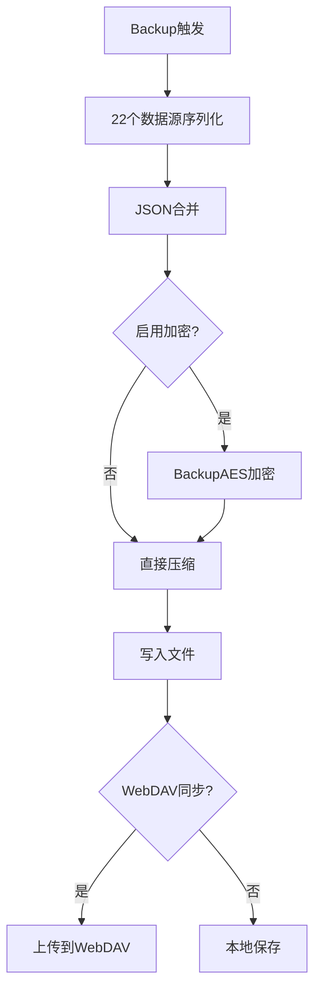

# 备份恢复系统

> **核心问题**：App 如何备份和恢复数据？备份包含哪些内容？WebDAV 如何同步？
> **答案**：Backup（20+ 数据源导出→ZIP）→ 本地文件 / SAF / WebDAV 三通道；Restore（JSON 反序列化→Room 批量写入）；支持 AES 加密敏感字段。

---

## 1. 备份架构总览



```
backup(context, path?)
    │
    ├── 数据收集 (on IO Dispatcher)
    │   ├── Room 表数据 → JSON 文件
    │   ├── 配置数据 → JSON 文件 + XML 文件
    │   └── SharedPreferences → XML (含 AES 加密 webDavPassword)
    │
    ├── ZIP 压缩 (ZipUtils.zipFiles)
    │
    ├── 发布通道 (三选一)
    │   ├── path == null       → 外部存储 (ExternalFiles)
    │   ├── path == content:// → SAF DocumentFile
    │   └── path 为目录        → 本地目录
    │
    └── WebDAV 同步 (AppWebDav.backUpWebDav)
         └── 同时上传背景图片 (ReadBookConfig.getAllPicBgStr)
```

---

## 2. Backup 备份模块

**文件**：[Backup.kt](file:///f:/myself/github/WeAgentChat/temp/legado/app/src/main/java/io/legado/app/help/storage/Backup.kt)

### 备份文件清单（22 个数据源）

[Backup.kt:L65-L89](file:///f:/myself/github/WeAgentChat/temp/legado/app/src/main/java/io/legado/app/help/storage/Backup.kt#L65)

| 文件名 | 数据来源 | 内容 |
|--------|----------|------|
| `bookshelf.json` | `bookDao.all` | 书架书籍列表 |
| `bookmark.json` | `bookmarkDao.all` | 书签列表 |
| `bookGroup.json` | `bookGroupDao.all` | 书籍分组 |
| `bookSource.json` | `bookSourceDao.all` | 书源列表 |
| `rssSources.json` | `rssSourceDao.all` | RSS 源列表 |
| `rssStar.json` | `rssStarDao.all` | RSS 收藏文章 |
| `replaceRule.json` | `replaceRuleDao.all` | 替换规则 |
| `readRecord.json` | `readRecordDao.all` | 阅读记录 |
| `searchHistory.json` | `searchKeywordDao.all` | 搜索历史 |
| `sourceSub.json` | `ruleSubDao.all` | 书源订阅 |
| `txtTocRule.json` | `txtTocRuleDao.all` | TXT 目录规则 |
| `httpTTS.json` | `httpTTSDao.all` | HTTP TTS 配置 |
| `keyboardAssists.json` | `keyboardAssistsDao.all` | 键盘辅助 |
| `dictRule.json` | `dictRuleDao.all` | 字典规则 |
| `servers.json` | `serverDao.all` (AES加密) | 远程服务器配置 |
| `readConfig.json` | `ReadBookConfig.configList` | 阅读排版方案 |
| `shareReadConfig.json` | `ReadBookConfig.shareConfig` | 共享排版方案 |
| `themeConfig.json` | `ThemeConfig.configList` | 主题配置 |
| `bookCover.json` | `BookCover.getConfig()` | 封面配置 |
| `config.xml` | `defaultSharedPreferences` | 全局设置(含AES加密密码) |
| `videoConfig.xml` | `SharedPreferences("videoConfig")` | 视频配置 |
| `DirectLinkUpload.ruleFileName` | 直链上传配置 | 直链上传配置 |

### 自动备份机制

[Backup.kt:L108-L125](file:///f:/myself/github/WeAgentChat/temp/legado/app/src/main/java/io/legado/app/help/storage/Backup.kt#L108)

```kotlin
fun autoBack(context: Context) {
    // 24h 内未备份 → 自动备份
    if (lastBackup + TimeUnit.DAYS.toMillis(1) < System.currentTimeMillis()) {
        // 检查 WebDAV 是否已有当日备份
        if (!AppWebDav.hasBackUp(backupZipFileName)) {
            backup(context, AppConfig.backupPath)
        }
    }
}
```

调用时机：`MainActivity.onDestroy()` 中 `Backup.autoBack(this)`

### 备份文件命名规范

[Backup.kt:L92-L101](file:///f:/myself/github/WeAgentChat/temp/legado/app/src/main/java/io/legado/app/help/storage/Backup.kt#L92)

```
仅保留最新: AppConfig.onlyLatestBackup → "backup.zip"
保留历史:   "backup{yyyy-MM-dd}-{deviceName}.zip"
```

### Mutex 并发控制

[Backup.kt:L127-L133](file:///f:/myself/github/WeAgentChat/temp/legado/app/src/main/java/io/legado/app/help/storage/Backup.kt#L127)

```kotlin
// 使用 Mutex 确保备份操作的原子性
suspend fun backupLocked(context: Context, path: String?) {
    mutex.withLock {
        withContext(IO) { backup(context, path) }
    }
}
```

---

## 3. Restore 恢复模块

**文件**：[Restore.kt](file:///f:/myself/github/WeAgentChat/temp/legado/app/src/main/java/io/legado/app/help/storage/Restore.kt)

### 恢复流程

```
restore(context, uri)
    │
    ├── 解压 ZIP
    │   ├── content:// → DocumentFile.openInputStream()
    │   └── 本地文件 → ZipUtils.unZipToPath()
    │
    ├── JSON 反序列化 + Room 批量写入
    │   ├── bookshelf.json → bookDao.upsert()
    │   ├── bookmark.json → bookmarkDao.upsert()
    │   ├── bookSource.json → bookSourceDao.upsert()
    │   ├── ... (与备份文件 1:1 对应)
    │   └── servers.json → AES 解密后反序列化
    │
    ├── 恢复配置
    │   ├── readConfig.json → ReadBookConfig
    │   ├── themeConfig.json → ThemeConfig
    │   ├── config.xml → SharedPreferences
    │   └── videoConfig.xml → SharedPreferences
    │
    └── 后处理
        ├── LocalBook.upBookFiles()     — 更新本地书籍文件关联
        ├── LauncherIconHelp.upIcon()   — 更新启动图标
        └── BookCover.upDefaultCover()  — 更新默认封面
```

### 关键恢复逻辑

- 书源导入时使用 `importKeepName`/`importKeepGroup`/`importKeepEnable` 控制保留策略
- 书籍恢复时检查本地文件是否存在（`isLocal`）
- 恢复后自动更新书源订阅图标

---

## 4. BackupAES — 加密模块

**文件**：[BackupAES.kt](file:///f:/myself/github/WeAgentChat/temp/legado/app/src/main/java/io/legado/app/help/storage/BackupAES.kt)

- 使用 AES-256-CBC 加密敏感字段
- 加密范围：`webDavPassword`（SharedPreferences）、`servers.json`（整体）
- 密钥基于设备 `androidId` 生成

---

## 5. ImportOldData — 旧数据迁移

**文件**：[ImportOldData.kt](file:///f:/myself/github/WeAgentChat/temp/legado/app/src/main/java/io/legado/app/help/storage/ImportOldData.kt)

- 兼容旧版本数据格式
- 从旧版备份 ZIP 中提取并转换数据
- 处理旧书源 JSON 格式 → 新版 BookSource 实体

---

## 6. BackupConfig — 备份过滤

**文件**：[BackupConfig.kt](file:///f:/myself/github/WeAgentChat/temp/legado/app/src/main/java/io/legado/app/help/storage/BackupConfig.kt)

定义哪些 SharedPreferences key 应被排除在备份之外：

```kotlin
fun keyIsNotIgnore(key: String): Boolean
// 忽略: 纯本地状态、非持久化配置
```

---

## 7. WebDAV 备份同步

**文件**：[AppWebDav.kt](file:///f:/myself/github/WeAgentChat/temp/legado/app/src/main/java/io/legado/app/help/AppWebDav.kt)

```
backUpWebDav(zipFileName)
    ├── WebDAV 地址: 从 servers 表获取（AppConfig.remoteServerId）
    ├── 存储目录: AppConfig.webDavDir / "backup" / zipFileName
    └── 同时上传背景图片: AppWebDav.upBgs()

hasBackUp(zipFileName) → Boolean   — 检查 WebDAV 是否已有同名备份
lastBackUp() → WebDavFile?         — 获取最新备份文件信息
```

### 自动同步机制

[MainActivity.kt:L312-L329](file:///f:/myself/github/WeAgentChat/temp/legado/app/src/main/java/io/legado/app/ui/main/MainActivity.kt#L312)

```
MainActivity.onPostCreate()
    → 若 AppConfig.autoCheckNewBackup
    → 查询 WebDAV 最新备份
    → 若 remote.lastModify > LocalConfig.lastBackup
    → 弹窗询问是否恢复 WebDAV 备份
```

---

## 8. 备份恢复全景图

```
┌──────────────┐     ┌──────────────┐     ┌──────────────┐
│  自动备份     │     │  手动备份     │     │  WebDAV同步   │
│ (每日一次)    │     │ (用户触发)    │     │ (自动/手动)   │
└──────┬───────┘     └──────┬───────┘     └──────┬───────┘
       │                    │                    │
       └────────────────────┼────────────────────┘
                            │
                   ┌────────▼────────┐
                   │  Backup.backup  │
                   │  (Mutex 保护)   │
                   └────────┬────────┘
                            │
            ┌───────────────┼───────────────┐
            ▼               ▼               ▼
      外部存储(.zip)    SAF(目录)      WebDAV(远程)
                            │
                   ┌────────▼────────┐
                   │  Restore.restore│
                   │  (Mutex 保护)   │
                   └────────┬────────┘
                            │
            ┌───────────────┼───────────────┐
            ▼               ▼               ▼
       Room批量写入     JSON配置恢复    SP配置恢复
```

### 线程安全保证

- `Backup.mutex` 保证同一时刻只有一个备份操作
- `Restore.mutex` 保证同一时刻只有一个恢复操作
- 备份在 `IO` Dispatcher 执行，不阻塞 UI