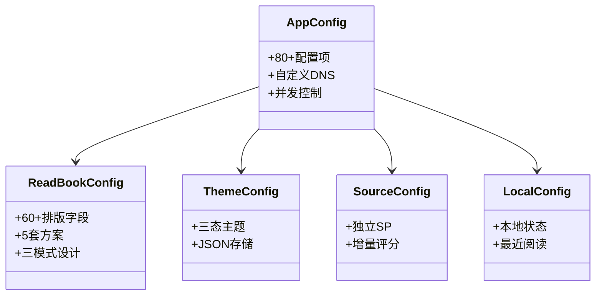

# 配置系统

> **核心问题**：App 数百个配置项如何管理？阅读排版/主题/书源评分数据存在哪里？
> **答案**：五层配置模型——AppConfig(全局SharedPreferences→属性预加载+监听器) / ReadBookConfig(JSON文件→内存) / ThemeConfig(JSON文件→内存) / SourceConfig(独立SP) / LocalConfig(本地状态SP)。

---

## 1. AppConfig — 全局配置中心

**文件**：[AppConfig.kt](file:///f:/myself/github/WeAgentChat/temp/legado/app/src/main/java/io/legado/app/help/config/AppConfig.kt)

### 架构设计

```
AppConfig object
├── SharedPreferences.OnSharedPreferenceChangeListener  — 实时监听变更
├── 属性预加载模式                                      — 启动时读取所有配置到 var
└── getter/setter 模式                                  — 读写统一入口
```

### 数据流

```
用户操作 → putPrefXxx(key, value)  → SharedPreferences
                                        │
                                        ▼
                              onSharedPreferenceChanged()
                                        │
                                        ▼
                              AppConfig.xxx = 新值  →  全局生效
```

### 核心配置项分类（共 100+ 项）

#### 网络配置

```python
# hivekey: cronet, userAgent, customHosts, webPort
# 默认值: cronet=false, userAgent=Mozilla/5.0..., webPort=1122
```

#### 书架配置

```python
# showBookname(0), bookshelfMargin(12), showUnread(true),
# showLastUpdateTime(false), showWaitUpCount(false),
# bookGroupStyle(0=卡片 1=列表), bookshelfLayout(0),
# saveTabPosition(0), bookshelfSort(0=更新时间 1=书名 ...)
# bookshelfFastScroller(false)
```

#### 搜索配置

```python
# threadCount(16), searchScope(""), searchGroup(""),
# replaceEnableDefault(true), autoChangeSource(true)
```

#### 阅读配置

```python
# readBodyToLh(true), readStyleSelect(0), comicStyleSelect(0),
# shareLayout(false), hideStatusBar(false), hideNavigationBar(false),
# textFullJustify(true), textBottomJustify(true),
# brightness/readBrightness/nightBrightness(100)
# pageTouchSlop(0), pageTouchClick(0),
# volumeKeyPage(true), mouseWheelPage(true)
# 翻页区域配置: clickActionTL(2), TC(2), TR(1), ML(2), MC(0), MR(1),
#               BL(2), BC(1), BR(1)
# 点击动作: 0=菜单 1=翻页(...方向) 2=无操作
```

#### 书源编辑配置

```python
# editTheme(0), editThemeDark(0), editTemeAuto(false),
# editFontScale(16), editNonPrintable(0), editAutoWrap(true),
# editAutoComplete(true), showBoardLine(1),
# useAntiAlias(false), adaptSpecialStyle(true), useDefaultCover(false)
```

#### 主题配置

```python
# themeMode: "0"=随系统 "1"=日间 "2"=夜间 "3"=墨水屏
# isEInkMode
```

#### TTS 配置

```python
# ttsSpeechRate(5), ttsTimer(0), ttsFollowSys(true),
# ttsEngine, contentSelectSpeakMod
```

#### 导出配置

```python
# bookExportFileName, episodeExportFileName(""),
# exportCharset("UTF-8"), exportUseReplace(true),
# exportToWebDav(false), exportNoChapterName(false),
# enableCustomExport(false), exportType(0),
# exportPictureFile(false), parallelExportBook(false)
```

#### 备份配置

```python
# backupPath, onlyLatestBackup(true), autoCheckNewBackup(true)
# webDavDir("legado"), webDavDeviceName(Build.MODEL)
```

#### 其他配置

```python
# enableReview(BuildConfig.DEBUG+false), showDiscovery(true),
# showRSS(true), autoRefreshBook(false),
# importKeepName(false), importKeepGroup(false),
# importKeepEnable(false), importShowComment(false),
# preDownloadNum(10), syncBookProgress(true),
# syncBookProgressPlus(false), enableReadRecord(true),
# optimizeRender(false), recordLog(false),
# defaultHomePage("bookshelf"), showMangaUi(true),
# disableMangaScale(true), disableMangaPageAnim(false),
# mangaPreDownloadNum(10), enableMangaHorizontalScroll(false),
# showAddToShelfAlert(true), changeSourceCheckAuthor(false),
# changeSourceLoadInfo(false), changeSourceLoadToc(false),
# batchChangeSourceDelay(0)
```

#### 界面与排版配置

| 字段 | 类型 | 说明 |
|------|------|------|
| `textSelectAble` | Boolean | 是否允许文本选择 |
| `isTransparentStatusBar` | Boolean | 是否透明状态栏 |
| `immNavigationBar` | Boolean | 是否沉浸导航栏 |
| `screenOrientation` | String | 屏幕方向 |
| `defaultBookTreeUri` | String | 默认书籍目录URI |
| `bookImportFileName` | String | 书籍导入文件名 |

### 自定义 DNS 解析

[AppConfig.kt:L133-L160](file:///f:/myself/github/WeAgentChat/temp/legado/app/src/main/java/io/legado/app/help/config/AppConfig.kt#L133)

```
customHosts (JSON字符串)
    → hostMap (Map<String, Any?>)           — 懒解析JSON
        → addressCache (Map<String, List<InetAddress>>)  — 懒解析IP
            → OkHttpClient.Builder.dns { }  — 注入自定义DNS
```

---

## 2. ReadBookConfig — 阅读排版配置

**文件**：[ReadBookConfig.kt](file:///f:/myself/github/WeAgentChat/temp/legado/app/src/main/java/io/legado/app/help/config/ReadBookConfig.kt)

### 存储机制

```
readConfig.json (filesDir/)
    → Config 列表 (最多5套方案, configList[0..4])
shareReadConfig.json (filesDir/)
    → shareConfig (共享布局方案)

当前活跃: durConfig = configList[styleSelect]
```

### Config 数据类字段

**三模式设计**：每个视觉属性有三套独立值——白天(`bgStr`/`textColor`)、夜间(`bgStrNight`/`textColorNight`)、EInk(`bgStrEInk`/`textColorEInk`)，根据 `AppConfig.themeMode` 自动切换。

| 字段 | 类型 | 默认值 | 说明 |
|------|------|--------|------|
| `name` | String | `""` | 方案名称 |
| `textSize` | Int | `20` | 文字大小 |
| `textColor` / `textColorNight` / `textColorEInk` | String | `"#3E3D3B"` / `"#ADADAD"` / `"#000000"` | 三模式文字颜色 |
| `textAccentColor` / `textAccentColorNight` / `textAccentColorEInk` | String | `"#E53935"` / `"#FE4D55"` / `"#000000"` | 三模式强调色 |
| `bgStr` / `bgStrNight` / `bgStrEInk` | String | `"#EEEEEE"` / `"#000000"` / `"#FFFFFF"` | 三模式背景色 |
| `bgAlpha` | Int | `100` | 背景透明度 |
| `bgType` / `bgTypeNight` / `bgTypeEInk` | Int | `0` | 背景类型：0=颜色, 1=assets, 2=文件 |
| `pageAnim` / `pageAnimEInk` | Int | `0` / `4` | 翻页动画（枚举值） |
| `textFont` | String | `""` | 字体路径 |
| `textBold` | Int | `0` | 0=正常, 1=粗体, 2=细体 |
| `letterSpacing` | Float | `0.1f` | 字间距 |
| `lineSpacingExtra` | Int | `12` | 行间距 |
| `paragraphSpacing` | Int | `2` | 段间距 |
| `paragraphIndent` | String | `"　　"` | 段落缩进字符串 |
| `titleMode` | Int | `0` | 0=居左, 1=居中, 2=隐藏 |
| `underlineMode` | Int | `0` | 下划线模式 |
| `paddingLeft/Right/Top/Bottom` | Int | `6/16/16/6` | 正文四边距 |
| `headerMode` / `footerMode` | Int | `0` / `0` | 页眉/页脚显示模式 |
| `isComic` | Boolean | — | 是否漫画模式（根据BookType自动判断，非用户直接配置） |
| `useZhLayout` | Boolean | 是否使用中文排版 |

### Config 完整字段清单（60+字段）

```python
@dataclass
class ReadConfig:
    name: str = ""                     # 配置名（"默认"等）

    # === 背景（三套独立）===
    bg_str: str = "#EEEEEE"            # 白天背景色
    bg_str_night: str = "#000000"      # 夜间背景色
    bg_str_eink: str = "#FFFFFF"       # 墨水屏背景色
    bg_alpha: int = 100                # 背景透明度 0-100
    bg_type: int = 0                   # 白天背景类型: 0=颜色 1=assets图片 2=其他图片
    bg_type_night: int = 0
    bg_type_eink: int = 0

    # === 文字颜色（三套独立）===
    text_color: str = "#3E3D3B"        # 白天文字色
    text_color_night: str = "#ADADAD"  # 夜间文字色
    text_color_eink: str = "#000000"   # 墨水屏文字色
    text_accent_color: str = "#E53935"      # 白天强调色
    text_accent_color_night: str = "#FE4D55"
    text_accent_color_eink: str = "#000000"
    dark_status_icon: bool = True      # 白天深色状态栏
    dark_status_icon_night: bool = False
    dark_status_icon_eink: bool = True

    # === 排版基础 ===
    page_anim: int = 0                 # 翻页动画: 0=仿真 1=滑动 2=覆盖 3=滚动 4=无 5=翻页
    page_anim_eink: int = 4
    text_font: str = ""                # 字体路径
    text_bold: int = 0                 # 0=正常 1=粗体 2=细体
    text_size: int = 20                # 字号（sp）
    letter_spacing: float = 0.1        # 字间距
    line_spacing_extra: int = 12       # 行间距（sp）
    paragraph_spacing: int = 2         # 段间距
    title_mode: int = 0                # 0=居左 1=居中 2=隐藏
    title_size: int = 0                # 0=跟随textSize
    title_top_spacing: int = 0
    title_bottom_spacing: int = 0
    paragraph_indent: str = "　　"      # 段落缩进（两个全角空格）
    underline_mode: int = 0            # 下划线

    # === 内边距 ===
    padding_bottom: int = 6
    padding_left: int = 16
    padding_right: int = 16
    padding_top: int = 6
    header_padding_bottom: int = 0
    header_padding_left: int = 16
    header_padding_right: int = 16
    header_padding_top: int = 0
    footer_padding_bottom: int = 6
    footer_padding_left: int = 16
    footer_padding_right: int = 16
    footer_padding_top: int = 6

    # === 页眉页脚 ===
    show_header_line: bool = False
    show_footer_line: bool = True
    header_mode: int = 0               # 0=分页显示 1=持续显示
    footer_mode: int = 0
    tip_header_left: int = ReadTipConfig.TIME
    tip_header_middle: int = ReadTipConfig.NONE
    tip_header_right: int = ReadTipConfig.BATTERY
    tip_footer_left: int = ReadTipConfig.CHAPTER_TITLE
    tip_footer_middle: int = ReadTipConfig.NONE
    tip_footer_right: int = ReadTipConfig.PAGE_AND_TOTAL
    tip_color: int = 0
    tip_divider_color: int = -1
```

### ReadTipConfig — 页眉页脚提示常量

```python
class ReadTipConfig:
    NONE = 0
    TIME = 1              # 当前时间
    CHAPTER_TITLE = 2     # 章节标题
    BOOK_NAME = 3         # 书名
    PAGE_CURRENT = 4      # 当前页码
    PAGE_TOTAL = 5        # 总页码
    PAGE_AND_TOTAL = 6    # 当前页/总页（如 12/345）
    BATTERY = 7           # 电量
    BOOK_PROGRESS = 8     # 阅读进度 %
    CUSTOM_TEXT = 9       # 自定义文本
    BODY_TO_LH = 10       # 大间距模式
```

### CSS 样式生成

```python
class ReaderStyleGenerator:
    """从前端视角，将 ReadConfig 转为浏览器 CSS"""

    @staticmethod
    def generate_css(config: ReadConfig) -> str:
        """生成阅读页面的 CSS"""
        return f"""
        body {{
            font-size: {config.text_size}px;
            letter-spacing: {config.letter_spacing}px;
            line-height: {config.line_spacing_extra + config.text_size}px;
            padding: {config.padding_top}px {config.padding_right}px
                     {config.padding_bottom}px {config.padding_left}px;
            color: #{config.get_text_color()};
            background: #{config.get_bg_color()};
            text-indent: {2 if config.paragraph_indent else 0}em;
        }}
        h1, h2 {{ text-align: {['left', 'center', 'none'][config.title_mode]}; }}
        """
```

---

## 3. ThemeConfig — 主题配置

**文件**：[ThemeConfig.kt](file:///f:/myself/github/WeAgentChat/temp/legado/app/src/main/java/io/legado/app/help/config/ThemeConfig.kt)

### 主题三态

```kotlin
fun getTheme() = when {
    AppConfig.isEInkMode  → Theme.EInk   // 电纸书（黑白高对比）
    AppConfig.isNightTheme → Theme.Dark  // 深色模式
    else                  → Theme.Light  // 浅色模式
}
```

### 存储结构

```
themeConfig.json (filesDir/)
    → Config 列表 (多套主题方案)
        ├── themeName          — 主题名称
        ├── isNightTheme       — 是否夜间主题
        ├── primaryColor       — 主色调
        ├── accentColor        — 强调色
        ├── backgroundColor    — 背景色
        ├── bottomBackground   — 底部背景色
        ├── transparentNavBar  — 透明导航栏
        ├── backgroundImgPath  — 背景图路径
        └── backgroundImgBlur  — 背景图模糊度
```

### 主题切换流程

```
applyDayNight()
├── applyTheme(context)     — 加载 ThemeConfig + 应用 ThemeStore
├── initNightMode()         — AppCompatDelegate.setDefaultNightMode()
├── BookCover.upDefaultCover() — 刷新默认封面色
└── postEvent(RECREATE)    — 通知 MainActivity 重建所有界面
```

---

## 4. SourceConfig — 书源评分

**文件**：[SourceConfig.kt](file:///f:/myself/github/WeAgentChat/temp/legado/app/src/main/java/io/legado/app/help/config/SourceConfig.kt)

独立 SharedPreferences `"SourceConfig"`，按书源 origin 存储评分：

```
setBookScore(origin, name, author, score)
    ├── 计算增量: newScore = score - preScore (取差值)
    ├── 写入源总分: putInt(origin, getSourceScore(origin) + newScore)
    └── 写入书得分: putInt("${origin}_${name}_${author}", score)

getSourceScore(origin) → 该源所有书评分总和
getBookScore(origin, name, author) → 单书评分
removeSource(origin) → 删除源的所有评分记录
```

---

## 5. LocalConfig — 本地状态

**文件**：[LocalConfig.kt](file:///f:/myself/github/WeAgentChat/temp/legado/app/src/main/java/io/legado/app/help/config/LocalConfig.kt)

存储在 `defaultSharedPreferences`，与 AppConfig 共用 SP 但含义不同——LocalConfig 是**本地易失状态**，不纳入备份：

| 字段 | 说明 |
|------|------|
| `privacyPolicyOk` | 隐私协议是否已同意 |
| `versionCode` | 上次展示更新日志的版本 |
| `isFirstOpenApp` | 是否首次打开 |
| `password` | 本地密码锁 |
| `lastBackup` | 上次备份时间戳 |
| `lastCheckUpdate` | 上次检查更新时间戳 |
| `appCrash` | 是否发生过崩溃 |

---

## 6. 配置系统全景图

### 五层配置模型类图



### 文本全景图

```
┌─────────────────────────────────────────────────────────────┐
│                     配置数据层                                │
├──────────────┬──────────────┬────────────┬──────────────────┤
│ AppConfig    │ ReadBookConfig│ ThemeConfig│ SourceConfig     │
│ (全局SP)     │ (JSON文件)    │ (JSON文件) │ (独立SP)         │
├──────────────┼──────────────┼────────────┼──────────────────┤
│ 80+配置项    │ 多套排版方案   │ 多套主题    │ 书源评分         │
│ 实时监听变更  │ 5套可切换     │ 日/夜/墨水  │ 按origin聚合     │
│ 属性预加载    │ shareConfig   │ 支持自定义  │                  │
├──────────────┴──────────────┴────────────┴──────────────────┤
│                     LocalConfig                             │
│                  (本地易失状态，不备份)                        │
└─────────────────────────────────────────────────────────────┘
```

### 备份覆盖情况

Backup 模块导出 [Backup.kt:L64-L89](file:///f:/myself/github/WeAgentChat/temp/legado/app/src/main/java/io/legado/app/help/storage/Backup.kt#L64)：
- AppConfig → `config.xml`（SharedPreferences 导出为 XML）
- ReadBookConfig → `readConfig.json` + `shareReadConfig.json`
- ThemeConfig → `themeConfig.json`
- SourceConfig → **不备份**（评分仅本地有效）
- LocalConfig → **不备份**（仅 `lastBackup` 相关部分写入）

---

## 7. PreferKey — 所有偏好键常量（80+）

所有配置持久化用的键名，重构时需要建立完整的配置映射。

```python
class PreferKey:
    # === 网络 ===
    cronet = "cronet"
    user_agent = "userAgent"
    custom_hosts = "customHosts"
    web_port = "webPort"

    # === 书架 ===
    show_bookname_layout = "showBooknameLayout"
    bookshelf_margin = "bookshelfMargin"
    show_unread = "showUnread"
    show_last_update_time = "showLastUpdateTime"
    show_wait_up_count = "showWaitUpCount"
    book_group_style = "bookGroupStyle"
    bookshelf_layout = "bookshelfLayout"
    save_tab_position = "saveTabPosition"
    bookshelf_sort = "bookshelfSort"
    show_bookshelf_fast_scroller = "showBookshelfFastScroller"

    # === 搜索 ===
    thread_count = "threadCount"
    search_scope = "searchScope"
    search_group = "searchGroup"
    replace_enable_default = "replaceEnableDefault"
    auto_change_source = "autoChangeSource"

    # === 阅读 ===
    read_body_to_lh = "readBodyToLh"
    read_style_select = "readStyleSelect"
    comic_style_select = "comicStyleSelect"
    share_layout = "shareLayout"
    hide_status_bar = "hideStatusBar"
    hide_navigation_bar = "hideNavigationBar"
    text_full_justify = "textFullJustify"
    text_bottom_justify = "textBottomJustify"
    brightness = "brightness"
    night_brightness = "nightBrightness"
    read_brightness = "readBrightness"
    page_touch_slop = "pageTouchSlop"
    page_touch_click = "pageTouchClick"
    volume_key_page = "volumeKeyPage"
    mouse_wheel_page = "mouseWheelPage"
    click_action_tl = "clickActionTL"
    click_action_tc = "clickActionTC"
    click_action_tr = "clickActionTR"
    click_action_ml = "clickActionML"
    click_action_mc = "clickActionMC"
    click_action_mr = "clickActionMR"
    click_action_bl = "clickActionBL"
    click_action_bc = "clickActionBC"
    click_action_br = "clickActionBR"

    # === 书源编辑 ===
    edit_theme = "editTheme"
    edit_theme_dark = "editThemeDark"
    edit_theme_auto = "editTemeAuto"
    edit_font_scale = "editFontScale"
    edit_non_printable = "editNonPrintable"
    edit_auto_wrap = "editAutoWrap"
    edit_auto_complete = "editAutoComplete"
    show_board_line = "showBoardLine"
    anti_alias = "antiAlias"
    adapt_special_style = "adaptSpecialStyle"
    use_default_cover = "useDefaultCover"

    # === 主题 ===
    theme_mode = "themeMode"

    # === TTS ===
    tts_speech_rate = "ttsSpeechRate"
    tts_timer = "ttsTimer"
    tts_follow_sys = "ttsFollowSys"
    tts_engine = "ttsEngine"
    content_select_speak_mod = "contentSelectSpeakMod"

    # === 导出 ===
    book_export_file_name = "bookExportFileName"
    episode_export_file_name = "episodeExportFileName"
    export_charset = "exportCharset"
    export_use_replace = "exportUseReplace"
    export_to_web_dav = "exportToWebDav"
    export_no_chapter_name = "exportNoChapterName"
    enable_custom_export = "enableCustomExport"
    export_type = "exportType"
    export_picture_file = "exportPictureFile"
    parallel_export_book = "parallelExportBook"

    # === 备份 ===
    backup_path = "backupPath"
    only_latest_backup = "onlyLatestBackup"
    auto_check_new_backup = "autoCheckNewBackup"
    web_dav_dir = "webDavDir"
    web_dav_device_name = "webDavDeviceName"

    # === 其他 ===
    enable_review = "enableReview"
    show_discovery = "showDiscovery"
    show_rss = "showRss"
    auto_refresh = "autoRefresh"
    pre_download_num = "preDownloadNum"
    enable_read_record = "enableReadRecord"
    optimize_render = "optimizeRender"
    record_log = "recordLog"
    default_home_page = "defaultHomePage"
    show_manga_ui = "showMangaUi"
    disable_manga_scale = "disableMangaScale"
    manga_pre_download_num = "mangaPreDownloadNum"
    show_add_to_shelf_alert = "showAddToShelfAlert"
    change_source_check_author = "changeSourceCheckAuthor"
    change_source_load_info = "changeSourceLoadInfo"
    change_source_load_toc = "changeSourceLoadToc"
    batch_change_source_delay = "batchChangeSourceDelay"
```

---

## 8. DefaultData — 默认出厂数据

**文件**：[DefaultData.kt](file:///f:/myself/github/WeAgentChat/temp/legado/app/src/main/java/io/legado/app/help/DefaultData.kt)

首次启动或版本升级时写入的默认数据。重构时必须提供等价的 JSON 文件。

| 数据文件 | 用途 | 存储表 |
|---------|------|--------|
| `httpTTS.json` | 默认 HTTP TTS 引擎列表 | `httpTTS` |
| `readConfig.json` | 默认阅读排版配置（5组） | 文件存储 |
| `shareReadConfig.json` | 共享阅读排版配置 | 文件存储 |
| `txtTocRule.json` | 默认 TXT 目录分割正则 | `txtTocRules` |
| `themeConfig.json` | 默认主题配置 | 文件存储 |
| `rssSources.json` | 默认 RSS 源 | `rssSources` |
| `coverRule.json` | 封面生成规则 | 代码加载 |
| `dictRules.json` | 默认词典规则 | `dictRules` |
| `keyboardAssists.json` | 默认键盘辅助配置 | `keyboardAssists` |

### 版本升级触发条件

```python
class DefaultData:
    @staticmethod
    def up_version():
        """当版本号变更时，选择性导入默认数据"""
        if LocalConfig.need_up_http_tts:  # = LocalConfig.versionCode < AppConst.version
            import_default_http_tts()     # → 删除旧的默认TTS，插入新的
        if LocalConfig.need_up_txt_toc_rule:
            import_default_toc_rules()
        if LocalConfig.need_up_rss_sources:
            import_default_rss_sources()
        if LocalConfig.need_up_dict_rule:
            import_default_dict_rules()
```

---

## 9. Python 重构参考

> 以下为配置系统的 Python 重构技术选型建议和伪代码实现，供 Python 重构参考。

### 9.1 备份/恢复格式

#### WebDAV 配置备份格式

备份数据为顶层 JSON 对象，包含以下键：

| 键 | 类型 | 说明 |
|----|------|------|
| `book_sources` | `[BookSource]` | 全部书源 |
| `replace_rules` | `[ReplaceRule]` | 全部替换规则 |
| `rss_sources` | `[RssSource]` | 全部 RSS 源 |
| `http_tts` | `[HttpTTS]` | HTTP TTS 配置 |
| `dict_rules` | `[DictRule]` | 字典规则 |
| `txt_toc_rules` | `[TxtTocRule]` | TXT 目录规则 |
| `rule_subs` | `[RuleSub]` | 规则订阅 |
| `book_groups` | `[BookGroup]` | 分组 |
| `config` | `AppConfig` | 全局配置（JSON 序列化） |

#### 书源导入格式

- **标准格式**：纯数组 `[BookSource, BookSource, ...]`
- **兼容格式**：包含 `book_sources` 键的 JSON 对象
- 导入时优先检测顶层是否为数组，若为对象则检查 `book_sources` 键

```python
import json
from dataclasses import dataclass, asdict
from typing import Any

@dataclass
class BackupData:
    book_sources: list[dict[str, Any]]
    replace_rules: list[dict[str, Any]]
    rss_sources: list[dict[str, Any]]
    http_tts: list[dict[str, Any]]
    dict_rules: list[dict[str, Any]]
    txt_toc_rules: list[dict[str, Any]]
    rule_subs: list[dict[str, Any]]
    book_groups: list[dict[str, Any]]
    config: dict[str, Any]

    def to_json(self) -> str:
        return json.dumps(asdict(self), ensure_ascii=False, indent=2)

    @classmethod
    def from_json(cls, data: str) -> "BackupData":
        d = json.loads(data)
        return cls(**d)

def import_book_sources(raw: str) -> list[dict[str, Any]]:
    """兼容书源导入：纯数组或带 key 的对象"""
    data = json.loads(raw)
    if isinstance(data, list):
        return data
    if isinstance(data, dict) and "book_sources" in data:
        return data["book_sources"]
    raise ValueError("无法识别的书源格式")
```

### 9.2 主题系统 Python 实现

系统内置四套预设主题，支持通过 `appConfig.theme` 切换。每个主题包含背景色、文字色和可选背景图片。

| 主题标识 | 名称 | 典型用途 |
|----------|------|----------|
| `day` | 日间白 | 默认白天阅读 |
| `night` | 夜间黑 | 夜间阅读 |
| `green` | 护眼绿 | 长时间阅读 |
| `leather` | 羊皮纸 | 仿纸质书体验 |

```python
@dataclass
class Theme:
    key: str                # 主题标识
    name: str               # 主题名称
    bg_color: int           # 背景色 ARGB
    text_color: int         # 文字色 ARGB
    bg_drawable: str | None = None  # 背景图片路径

class ThemeManager:
    _themes: dict[str, Theme] = {
        "day": Theme("day", "日间白", 0xFFFFF8F0, 0xFF3A3A3A),
        "night": Theme("night", "夜间黑", 0xFF1E1E1E, 0xFFCECECE),
        "green": Theme("green", "护眼绿", 0xFFC7EDCC, 0xFF3A3A3A),
        "leather": Theme("leather", "羊皮纸", 0xFFF5E6C8, 0xFF5C3A1E),
    }

    def get_theme(self, key: str) -> Theme:
        return self._themes.get(key, self._themes["day"])

    @property
    def current(self) -> Theme:
        return self.get_theme(app_config.theme)
```

### 9.3 阅读配置 Python 实现

阅读配置独立于全局配置，每本书可拥有独立的阅读配置。存储格式为 JSON 对象。

```python
@dataclass
class ReadConfig:
    dur_chapter_index: int = 0
    dur_chapter_pos: int = 0
    reverse_toc: bool = False
    page_anim: int = 0
    click_interval: int = 200
    hide_status_bar: bool = False
    show_title: bool = True
    show_battery: bool = True
    read_simulating: bool = False
    simulate_speed: int = 60
    read_time: int = 0
    text_size: int = 18
    bg_color: int = 0xFFFFFFFF
    text_color: int = 0xFF000000
    line_spacing: float = 1.5
    padding: int = 16
    paragraph_spacing: int = 8
    paragraph_indent: int = 2
    bold: bool = False
    font_family: str | None = None

    def to_json(self) -> str:
        return json.dumps(asdict(self), ensure_ascii=False)

    @classmethod
    def from_json(cls, data: str) -> "ReadConfig":
        d = json.loads(data)
        return cls(**{k: v for k, v in d.items() if k in cls.__dataclass_fields__})
```

### 9.4 JS 引擎选择

- **推荐**：QuickJS（Python 绑定 `python quickjs`），用于执行书源中的 JavaScript 规则
- **备选**：PyMiniRacer 或受限的 `eval()`（仅限安全表达式）
- **核心要求**：必须实现沙箱化，禁止文件读写、网络访问和系统调用

```python
from quickjs import Context

class SandboxedJS:
    def __init__(self):
        self.ctx = Context()
        self._lock_sandbox()

    def _lock_sandbox(self):
        # 移除危险全局对象
        self.ctx.eval("""
            const forbidden = ['fetch', 'XMLHttpRequest',
                'require', 'import', 'process', 'Buffer',
                'setTimeout', 'setInterval'];
            forbidden.forEach(name => {
                try { delete globalThis[name]; } catch(e) {}
            });
        """)

    def execute(self, code: str, timeout: float = 5.0) -> str:
        return self.ctx.eval(code)
```

### 9.5 HTTP 客户端选择

- **推荐**：`httpx`（原生 async/await 支持）+ `httpx-sse` 用于 SSE 流
- **备选**：`aiohttp`
- **必需支持**：代理配置、`CookieJar` 持久化、自定义 DNS 解析、请求超时控制

```python
import httpx

async def create_http_client(
    proxy: str | None = None,
    timeout: float = 30.0,
    dns_servers: list[str] | None = None,
) -> httpx.AsyncClient:
    transport = httpx.AsyncHTTPTransport(proxy=proxy, retries=3)
    limits = httpx.Limits(
        max_keepalive_connections=20,
        max_connections=100,
    )
    return httpx.AsyncClient(
        transport=transport,
        timeout=httpx.Timeout(timeout),
        limits=limits,
        follow_redirects=True,
    )
```

### 9.6 HTML 解析库

| 用途 | 推荐库 | 说明 |
|------|--------|------|
| HTML 解析 + CSS 选择器 | `BeautifulSoup4` + `lxml` | 主流方案 |
| XPath 查询 | `lxml.etree.XPath` | 高性能路径查询 |
| JSONPath 查询 | `jsonpath-ng` | 书源 JSON 规则解析 |

### 9.7 WebView 替代方案

原 Android 项目支持 WebView 执行 JS 以获取动态渲染内容。Python 重构方案：

| 方案 | 适用场景 | 性能 |
|------|----------|------|
| **Playwright** | 完整浏览器自动化 | 中等 |
| **Selenium** | 兼容性要求高 | 较低 |
| **DrissionPage** | 轻量级自动化 | 较高 |

> **注意**：WebView 方案开销大，仅在书源规则明确需要 `webView` 时启用，且应实现连接池复用以减少开销。

### 9.8 分页算法选择

- **推荐方案**：前端分页 + 后端仅返回纯文本数据
- **实现方式**：CSS `columns` 多列布局进行前端分页
- **兼容性**：前端需适配用户自定义字体和字号调整
- **优势**：后端无需处理复杂分页逻辑，减少计算开销

### 9.9 正则超时保护

Python 标准库 `re` 模块不支持超时中断，必须自行实现保护机制。

```python
import re
import threading

class RegexTimeoutError(TimeoutError):
    pass

def regex_with_timeout(pattern: str, text: str, timeout: float = 2.0):
    """带超时的正则匹配"""
    result = []
    event = threading.Event()

    def match():
        try:
            result.append(re.search(pattern, text))
        except Exception as e:
            result.append(e)
        finally:
            event.set()

    t = threading.Thread(target=match, daemon=True)
    t.start()
    if not event.wait(timeout):
        raise RegexTimeoutError(f"正则匹配超时: {pattern[:50]}...")
    if isinstance(result[0], Exception):
        raise result[0]
    return result[0]
```

> 超时后自动禁用该替换规则，避免反复触发。

### 9.10 并发控制

| 原 Android 方案 | Python 重构方案 |
|-----------------|-----------------|
| `synchronized` | `asyncio.Semaphore` |
| `ReentrantReadWriteLock` | `asyncio.Lock` + 读写分离策略 |
| `ConcurrentRateLimiter` | `asyncio.Lock` + `time.perf_counter` |

```python
import asyncio
import time

class ConcurrentRateLimiter:
    def __init__(self, max_calls: int, period: float):
        self.max_calls = max_calls
        self.period = period
        self._lock = asyncio.Lock()
        self._timestamps: list[float] = []

    async def acquire(self):
        async with self._lock:
            now = time.perf_counter()
            self._timestamps = [t for t in self._timestamps if now - t < self.period]
            if len(self._timestamps) >= self.max_calls:
                wait = self.period - (now - self._timestamps[0])
                await asyncio.sleep(wait)
            self._timestamps.append(time.perf_counter())
```

### 9.11 Cookie 存储

使用 `httpx.CookieJar` 配合数据库持久化：

```python
import json
import httpx
import aiosqlite

class CookieManager:
    def __init__(self, db_path: str):
        self.db_path = db_path
        self.jar = httpx.CookieJar()

    async def load_cookies(self, source_url: str):
        async with aiosqlite.connect(self.db_path) as db:
            row = await db.execute_fetchall(
                "SELECT cookies FROM cookies WHERE source_url = ?", (source_url,)
            )
        if row and row[0][0]:
            cookies = json.loads(row[0][0])
            for c in cookies:
                self.jar.set(c["name"], c["value"], c["domain"])

    def build_cookie_dict(self, source_url: str) -> dict[str, str]:
        """构建 Cookie 字典：临时 Cookie > CookieJar > 数据库"""
        return dict(self.jar)
```

> **优先级**：请求中手动设置的临时 Cookie > `CookieJar` 中自动保存的 Cookie > 数据库持久化的 Cookie。

### 9.12 搜索结果合并

```python
def merge_search_results(results: list[dict]) -> list[dict]:
    """使用 dict 以 bookUrl 为 key 去重"""
    seen: dict[str, dict] = {}
    for book in results:
        url = book.get("bookUrl")
        if url and url not in seen:
            seen[url] = book
    return list(seen.values())

def sort_search_results(results: list[dict], keyword: str) -> list[dict]:
    """四分类排序：精确匹配 > 标签匹配 > 包含匹配 > 其他"""
    def sort_key(book):
        name = book.get("name", "")
        if name == keyword:
            return 0
        if keyword in name.split():
            return 1
        if keyword in name:
            return 2
        return 3
    return sorted(results, key=sort_key)
```

### 9.13 缓存策略

| 缓存内容 | 存储方式 | 过期时间 |
|----------|----------|----------|
| 章节内容 | `.nb` 文件或 SQLite BLOB | 长期（用户手动清理） |
| 书籍信息 | SQLite 行记录 | 7 天 |
| 书籍目录 | SQLite 行记录 | 24 小时 |
| 搜索结果 | 内存缓存 | 30 分钟 |

### 9.14 SQLite 使用注意

- **WAL 模式**：创建连接后立即执行 `PRAGMA journal_mode=WAL` 提升并发性能
- **异步驱动**：使用 `aiosqlite` 或 SQLAlchemy 异步引擎
- **位运算分组查询**：书源分组使用位掩码存储，查询条件为 `WHERE (group_id & :gid) > 0`

```python
import aiosqlite

async def init_database(db_path: str):
    async with aiosqlite.connect(db_path) as db:
        await db.execute("PRAGMA journal_mode=WAL")
        await db.execute("PRAGMA synchronous=NORMAL")
        await db.execute("PRAGMA cache_size=-8000")  # 8MB 缓存
        await db.commit()

async def query_books_by_group(db_path: str, group_id: int):
    async with aiosqlite.connect(db_path) as db:
        cursor = await db.execute(
            "SELECT * FROM books WHERE (group_id & ?) > 0", (group_id,)
        )
        return await cursor.fetchall()
```

### 9.15 WebSocket 实现

基于 FastAPI WebSocket 实现事件推送：

```python
from fastapi import WebSocket, WebSocketDisconnect
import asyncio

class ConnectionManager:
    def __init__(self):
        self.active: dict[str, WebSocket] = {}

    async def connect(self, client_id: str, ws: WebSocket):
        await ws.accept()
        self.active[client_id] = ws

    def disconnect(self, client_id: str):
        self.active.pop(client_id, None)

    async def send_event(self, client_id: str, event: dict):
        ws = self.active.get(client_id)
        if ws:
            try:
                await ws.send_json(event)
            except Exception:
                self.disconnect(client_id)

    async def heartbeat(self, interval: int = 30):
        while True:
            await asyncio.sleep(interval)
            for cid, ws in list(self.active.items()):
                try:
                    await ws.send_json({"type": "ping"})
                except Exception:
                    self.disconnect(cid)
```

### 9.16 书源导入兼容性

```python
def normalize_book_source(source: dict) -> dict:
    """规范化书源字段，兼容新旧格式"""
    normalized = {
        "bookSourceUrl": source.get("bookSourceUrl") or source.get("sourceUrl"),
        "bookSourceName": source.get("bookSourceName") or source.get("sourceName"),
        "bookSourceGroup": source.get("bookSourceGroup") or source.get("sourceGroup"),
        "loginUrl": source.get("loginUrl", ""),
        "loginCheckUrl": source.get("loginCheckUrl", ""),
        "ruleSearch": source.get("ruleSearch") or source.get("searchRule"),
        "ruleBookInfo": source.get("ruleBookInfo") or source.get("infoRule"),
        "ruleToc": source.get("ruleToc") or source.get("tocRule"),
        "ruleContent": source.get("ruleContent") or source.get("contentRule"),
        "enabled": source.get("enabled", True),
    }
    return normalized
```

> **原则**：保留原项目所有字段名称，新版书源使用的 JSON 嵌套规则对象（如 `ruleSearch` 为对象而非字符串）需完整兼容。

### 9.17 大文件处理

```python
import mmap
import os

class LargeTextProcessor:
    CHUNK_SIZE = 1024 * 1024  # 1MB

    def __init__(self, file_path: str):
        self.file_path = file_path
        self.file_size = os.path.getsize(file_path)

    def is_large_file(self) -> bool:
        return self.file_size > 100 * 1024 * 1024  # > 100MB

    async def stream_chapters(self):
        """流式读取章节，支持大文件"""
        with open(self.file_path, "r", encoding="utf-8", errors="replace") as f:
            buffer = ""
            while True:
                chunk = f.read(self.CHUNK_SIZE)
                if not chunk:
                    if buffer.strip():
                        yield buffer.strip()
                    break
                buffer += chunk
                # 按章节标记切分...

    def read_with_mmap(self):
        """使用 mmap 加速大文件读取"""
        with open(self.file_path, "rb") as f:
            with mmap.mmap(f.fileno(), 0, access=mmap.ACCESS_READ) as m:
                return m.read().decode("utf-8", errors="replace")
```

> **章节懒加载**：只加载当前章节内容到内存，上下章节按需预加载。

### 9.18 字符编码检测

```python
CHARSET_LIST = [
    "utf-8", "gbk", "gb2312", "gb18030",
    "big5", "shift_jis", "euc-jp", "euc-kr",
]

def detect_encoding(file_path: str) -> str:
    """检测文件编码"""
    import cchardet as chardet
    with open(file_path, "rb") as f:
        raw = f.read(1024 * 64)  # 读取前 64KB 用于检测
        result = chardet.detect(raw)
        encoding = result.get("encoding", "utf-8")
        encoding = encoding.lower().replace("-", "")
        for known in CHARSET_LIST:
            if known.replace("-", "") == encoding:
                return known
        return "utf-8"
```

> **推荐** `cchardet` 替代 `chardet`（性能提升 10-50 倍）。

### 9.19 记忆召回与续读

```python
@dataclass
class ReadingProgress:
    book_id: str
    chapter_index: int
    chapter_pos: int
    updated_at: float  # time.time()

class ReadingMemory:
    def __init__(self, db_path: str):
        self.db_path = db_path

    async def save_progress(self, progress: ReadingProgress):
        async with aiosqlite.connect(self.db_path) as db:
            await db.execute("""
                INSERT INTO reading_progress (book_id, chapter_index, chapter_pos, updated_at)
                VALUES (?, ?, ?, ?)
                ON CONFLICT(book_id) DO UPDATE SET
                    chapter_index = excluded.chapter_index,
                    chapter_pos = excluded.chapter_pos,
                    updated_at = excluded.updated_at
            """, (progress.book_id, progress.chapter_index,
                  progress.chapter_pos, progress.updated_at))
            await db.commit()

    async def get_progress(self, book_id: str) -> ReadingProgress | None:
        async with aiosqlite.connect(self.db_path) as db:
            row = await db.execute_fetchall(
                "SELECT * FROM reading_progress WHERE book_id = ?", (book_id,)
            )
        if row:
            return ReadingProgress(*row[0])
        return None

    async def get_recent_reads(self, limit: int = 20):
        """获取最近阅读记录，用于书架排序"""
        async with aiosqlite.connect(self.db_path) as db:
            rows = await db.execute_fetchall(
                "SELECT book_id FROM reading_progress ORDER BY updated_at DESC LIMIT ?",
                (limit,)
            )
        return [row[0] for row in rows]
```

> **书架排序**：支持按「最后阅读时间」排序，最近读过的书排在最前。

### 9.20 事件通知系统

```python
from enum import Enum
from dataclasses import dataclass, field
import asyncio
from collections import defaultdict

class EventType(Enum):
    SEARCH_STARTED = "search_started"
    SEARCH_FINISHED = "search_finished"
    BOOK_ADDED = "book_added"
    BOOK_REMOVED = "book_removed"
    READING_PROGRESS = "reading_progress"
    SOURCE_CHECKED = "source_checked"

@dataclass
class Event:
    type: EventType
    data: dict
    timestamp: float = field(default_factory=lambda: __import__("time").time())

class EventBus:
    def __init__(self):
        self._subscribers: dict[EventType, list] = defaultdict(list)

    def subscribe(self, event_type: EventType, callback):
        self._subscribers[event_type].append(callback)

    def unsubscribe(self, event_type: EventType, callback):
        self._subscribers[event_type].remove(callback)

    async def emit(self, event: Event):
        for cb in self._subscribers.get(event.type, []):
            try:
                if asyncio.iscoroutinefunction(cb):
                    await cb(event)
                else:
                    cb(event)
            except Exception as e:
                print(f"[EventBus] callback error: {e}")

# 全局事件总线
event_bus = EventBus()

# SSE 推送适配（FastAPI）
from fastapi import Request
from fastapi.responses import StreamingResponse

async def sse_event_stream(request: Request):
    async def event_generator():
        queue: asyncio.Queue[Event] = asyncio.Queue()

        async def handler(event: Event):
            await queue.put(event)

        event_bus.subscribe(EventType.SEARCH_FINISHED, handler)
        event_bus.subscribe(EventType.READING_PROGRESS, handler)

        try:
            while True:
                if await request.is_disconnected():
                    break
                try:
                    event = await asyncio.wait_for(queue.get(), timeout=30)
                    yield f"event: {event.type.value}\ndata: {json.dumps(event.data)}\n\n"
                except asyncio.TimeoutError:
                    yield f"event: heartbeat\ndata: {}\n\n"
        finally:
            event_bus.unsubscribe(EventType.SEARCH_FINISHED, handler)
            event_bus.unsubscribe(EventType.READING_PROGRESS, handler)

    return StreamingResponse(event_generator(), media_type="text/event-stream")
```

> **前端对应**：Vue 应用内使用 EventBus 监听事件，驱动搜索状态变化、书架更新、阅读进度同步等 UI 更新。

### 9.21 数据库连接配置范例

```python
# config/database.py
import aiosqlite
from pathlib import Path

DB_CONFIG = {
    "path": str(Path.home() / ".legado" / "data.db"),
    "wal_mode": True,
    "pool_size": 5,
    "timeout": 30,
}

async def get_connection() -> aiosqlite.Connection:
    db = await aiosqlite.connect(DB_CONFIG["path"])
    if DB_CONFIG["wal_mode"]:
        await db.execute("PRAGMA journal_mode=WAL")
    await db.execute("PRAGMA synchronous=NORMAL")
    await db.execute(f"PRAGMA busy_timeout={DB_CONFIG['timeout'] * 1000}")
    db.row_factory = aiosqlite.Row
    return db
```

### 9.22 全局配置文件范例

```python
# config/app_config.py
import json
from dataclasses import dataclass, asdict
from pathlib import Path

CONFIG_PATH = Path.home() / ".legado" / "config.json"

@dataclass
class AppConfig:
    thread_count: int = 9
    download_threads: int = 5
    replace_enable: bool = False
    adapt_special_style: bool = False
    check_source_url: bool = False
    add_to_shelf: bool = False
    show_update_dialog: bool = True
    chinese_converter_type: int = 0
    language: str = "zh"
    dns_over_https: bool = False
    theme: str = "day"
    webdav_config: dict | None = None

    def save(self):
        CONFIG_PATH.parent.mkdir(parents=True, exist_ok=True)
        CONFIG_PATH.write_text(
            json.dumps(asdict(self), ensure_ascii=False, indent=2),
            encoding="utf-8",
        )

    @classmethod
    def load(cls) -> "AppConfig":
        if CONFIG_PATH.exists():
            data = json.loads(CONFIG_PATH.read_text(encoding="utf-8"))
            return cls(**{k: v for k, v in data.items()
                          if k in cls.__dataclass_fields__})
        return cls()

# 全局单例
app_config = AppConfig.load()
```