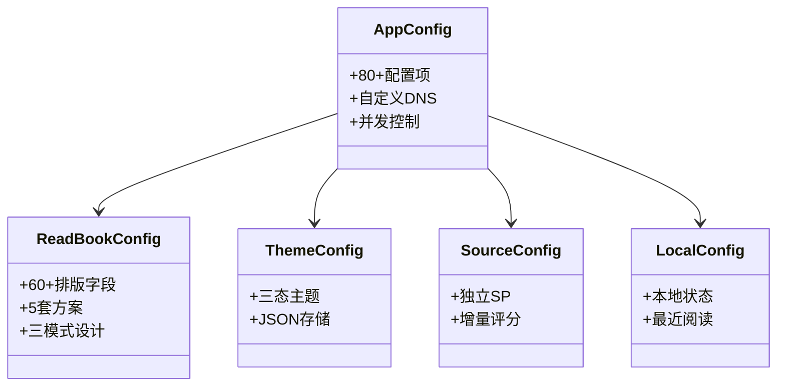

# 配置系统

> **核心问题**：App 数百个配置项如何管理？阅读排版/主题/书源评分数据存在哪里？
> **答案**：五层配置模型——AppConfig(全局SharedPreferences→属性预加载+监听器) / ReadBookConfig(JSON文件→内存) / ThemeConfig(JSON文件→内存) / SourceConfig(独立SP) / LocalConfig(本地状态SP)。

---

## 1. AppConfig — 全局配置中心

**文件**：[AppConfig.kt](file:///f:/myself/github/WeAgentChat/temp/legado/app/src/main/java/io/legado/app/help/config/AppConfig.kt)

### 架构设计

```
AppConfig object
├── SharedPreferences.OnSharedPreferenceChangeListener  — 实时监听变更
├── 属性预加载模式                                      — 启动时读取所有配置到 var
└── getter/setter 模式                                  — 读写统一入口
```

### 数据流

```
用户操作 → putPrefXxx(key, value)  → SharedPreferences
                                        │
                                        ▼
                              onSharedPreferenceChanged()
                                        │
                                        ▼
                              AppConfig.xxx = 新值  →  全局生效
```

### 核心配置项分类（共 100+ 项）

#### 网络配置

```python
# hivekey: cronet, userAgent, customHosts, webPort
# 默认值: cronet=false, userAgent=Mozilla/5.0..., webPort=1122
```

#### 书架配置

```python
# showBookname(0), bookshelfMargin(12), showUnread(true),
# showLastUpdateTime(false), showWaitUpCount(false),
# bookGroupStyle(0=卡片 1=列表), bookshelfLayout(0),
# saveTabPosition(0), bookshelfSort(0=更新时间 1=书名 ...)
# bookshelfFastScroller(false)
```

#### 搜索配置

```python
# threadCount(16), searchScope(""), searchGroup(""),
# replaceEnableDefault(true), autoChangeSource(true)
```

#### 阅读配置

```python
# readBodyToLh(true), readStyleSelect(0), comicStyleSelect(0),
# shareLayout(false), hideStatusBar(false), hideNavigationBar(false),
# textFullJustify(true), textBottomJustify(true),
# brightness/readBrightness/nightBrightness(100)
# pageTouchSlop(0), pageTouchClick(0),
# volumeKeyPage(true), mouseWheelPage(true)
# 翻页区域配置: clickActionTL(2), TC(2), TR(1), ML(2), MC(0), MR(1),
#               BL(2), BC(1), BR(1)
# 点击动作: 0=菜单 1=翻页(...方向) 2=无操作
```

#### 书源编辑配置

```python
# editTheme(0), editThemeDark(0), editTemeAuto(false),
# editFontScale(16), editNonPrintable(0), editAutoWrap(true),
# editAutoComplete(true), showBoardLine(1),
# useAntiAlias(false), adaptSpecialStyle(true), useDefaultCover(false)
```

#### 主题配置

```python
# themeMode: "0"=随系统 "1"=日间 "2"=夜间 "3"=墨水屏
# isEInkMode
```

#### TTS 配置

```python
# ttsSpeechRate(5), ttsTimer(0), ttsFollowSys(true),
# ttsEngine, contentSelectSpeakMod
```

#### 导出配置

```python
# bookExportFileName, episodeExportFileName(""),
# exportCharset("UTF-8"), exportUseReplace(true),
# exportToWebDav(false), exportNoChapterName(false),
# enableCustomExport(false), exportType(0),
# exportPictureFile(false), parallelExportBook(false)
```

#### 备份配置

```python
# backupPath, onlyLatestBackup(true), autoCheckNewBackup(true)
# webDavDir("legado"), webDavDeviceName(Build.MODEL)
```

#### 其他配置

```python
# enableReview(BuildConfig.DEBUG+false), showDiscovery(true),
# showRSS(true), autoRefreshBook(false),
# importKeepName(false), importKeepGroup(false),
# importKeepEnable(false), importShowComment(false),
# preDownloadNum(10), syncBookProgress(true),
# syncBookProgressPlus(false), enableReadRecord(true),
# optimizeRender(false), recordLog(false),
# defaultHomePage("bookshelf"), showMangaUi(true),
# disableMangaScale(true), disableMangaPageAnim(false),
# mangaPreDownloadNum(10), enableMangaHorizontalScroll(false),
# showAddToShelfAlert(true), changeSourceCheckAuthor(false),
# changeSourceLoadInfo(false), changeSourceLoadToc(false),
# batchChangeSourceDelay(0)
# customWelcome(true)  ← 默认值变更: false → true（新安装默认开启替换欢迎页）
```

#### 界面与排版配置

| 字段 | 类型 | 说明 |
|------|------|------|
| `textSelectAble` | Boolean | 是否允许文本选择 |
| `isTransparentStatusBar` | Boolean | 是否透明状态栏 |
| `immNavigationBar` | Boolean | 是否沉浸导航栏 |
| `screenOrientation` | String | 屏幕方向 |
| `defaultBookTreeUri` | String | 默认书籍目录URI |
| `bookImportFileName` | String | 书籍导入文件名 |

#### 书源/订阅源视图配置（folder-view-welcome-refactor 新增 → 现已经迁移链演进）

> 2026-08-30 核验（PreferKey.kt / AppConfig.kt 实证）：本组初版 4 键均已废弃或删除，现势活跃键如下。

| 字段 | 类型 | 默认值 | 说明 |
|------|------|--------|------|
| `sourceGroupStyle` | Int | 迁移生成 | 书源视图样式：0=列表, 1=按类型, 2=按分组（PreferKey.kt L300） |
| `sourceGroupMode` | Int | `0` | 0=标签(Tab平铺), 1=分组(文件夹) |
| `sourceLayout` | Int | `0` | 0=列表, 1=紧凑, 2-6=网格2-6列 |
| `sourceMargin` | Int | `12` | 卡片间距（dp），范围 0-60（AppConfig.kt L2834） |

- **已废弃**（仅迁移链保留，PreferKey.kt L291-297）：`sourceViewMode`、`sourceFolderStyle`、`sourceFolderMargin`
- **已删除**：`rssViewMode`（theme-rss-header-layout-sync F4：原 0 处引用已删除；订阅页双形态实际配置键 = `AppConfig.modernRssPage`，默认 `true`，消费点 RssFragment.kt L343 `usingModernRss = AppConfig.modernRssPage`）
- 迁移链（`AppConfig.migrateSourceConfigIfNeeded`，AppConfig.kt L2840-2853）：`sourceViewMode` + `sourceFolderStyle` → `sourceGroupStyle`（viewMode==0→0；folderStyle==1→1；否则→2）；`sourceFolderMargin` → `sourceMargin`

### 自定义 DNS 解析

[AppConfig.kt:L133-L160](file:///f:/myself/github/WeAgentChat/temp/legado/app/src/main/java/io/legado/app/help/config/AppConfig.kt#L133)

```
customHosts (JSON字符串)
    → hostMap (Map<String, Any?>)           — 懒解析JSON
        → addressCache (Map<String, List<InetAddress>>)  — 懒解析IP
            → OkHttpClient.Builder.dns { }  — 注入自定义DNS
```

### 配置变更记录（folder-view-welcome-refactor）

> 本次配置变更对应 spec：`docs/specs/folder-view-welcome-refactor/`（书源/订阅源文件夹视图重构 + 欢迎页增强 + 前端样式审计）。

#### 新增配置项（PreferKey + AppConfig）

| 配置项 | PreferKey | 类型 | 默认值 | 说明 |
|--------|-----------|------|--------|------|
| `sourceFolderStyle` | `sourceFolderStyle` | Int | `0` | 文件夹分组样式：0=按分组, 1=按类型 |
| `sourceFolderMargin` | `sourceFolderMargin` | Int | `8` | 文件夹视图间距（dp），范围 0-60 |
| `sourceViewMode` | `sourceViewMode` | Int | `0` | 书源视图模式：0=列表, 1=文件夹 |
| `rssViewMode` | `rssViewMode` | Int | `0` | 订阅源视图模式：0=列表, 1=文件夹 |

- `sourceViewMode` 由 `BookSourceActivity` 与 `ExploreFragment` 共用（历史快照，现已废弃，仅迁移链保留）
- `rssViewMode` 由 `RssSourceActivity` 与 `RssFragment` 共用（历史快照，PreferKey.rssViewMode 已删除；订阅页现由 AppConfig.modernRssPage 控制，默认 true，RssFragment.kt L343 消费）

> **2026-08-30 核验修正**：上方变更表为 folder-view-welcome-refactor 变更发生时的历史快照。现状：rssViewMode PreferKey 已删除（theme-rss-header-layout-sync F4，仅 PreferKey.kt L291-294 注释保留迁移链说明）；sourceViewMode / sourceFolderStyle / sourceFolderMargin 已废弃，经 AppConfig.migrateSourceConfigIfNeeded（AppConfig.kt L2840-2853）迁移为 sourceGroupStyle（0=列表/1=按类型/2=按分组）+ sourceMargin；订阅页新版/经典形态现由 AppConfig.modernRssPage（默认 true，RssFragment.kt L343 消费）控制。现势表见本节上方"书源/订阅源视图配置"。

#### 默认值变更

| 配置项 | PreferKey | 旧默认值 | 新默认值 | 说明 |
|--------|-----------|----------|----------|------|
| `customWelcome` | `customWelcome` | `false` | `true` | 新安装默认开启"替换欢迎页"功能 |

#### 菜单变更

| 菜单文件 | 变更 |
|----------|------|
| `menu/book_source.xml` | `menu_view_mode` → `menu_folder_config`（三点菜单统一入口） |
| `menu/rss_source.xml` | `menu_view_mode` → `menu_folder_config` |
| `menu/main_explore.xml` | `menu_view_mode` → `menu_folder_config` |
| `menu/main_rss.xml` | `menu_view_mode` → `menu_folder_config` |

#### 偏好页面变更

| 偏好文件 | 变更 |
|----------|------|
| `xml/pref_main.xml` | 移除 `debug_tools` Preference（从"我的"页面迁出） |
| `xml/pref_config_other.xml` | 新增 `debug_tools` Preference（迁移到"其他设置"） |

#### 自动任务变更

- `AutoTaskEditActivity`：Cron 表达式输入框改为频率选择器
  - 每天：`0 0 * * *`
  - 每小时：`0 * * * *`
  - 自定义：用户手动输入 Cron 表达式

---

## 2. ReadBookConfig — 阅读排版配置

**文件**：[ReadBookConfig.kt](file:///f:/myself/github/WeAgentChat/temp/legado/app/src/main/java/io/legado/app/help/config/ReadBookConfig.kt)

### 存储机制

```
readConfig.json (filesDir/)
    → Config 列表 (最多5套方案, configList[0..4])
shareReadConfig.json (filesDir/)
    → shareConfig (共享布局方案)

当前活跃: durConfig = configList[styleSelect]
```

### Config 数据类字段

**三模式设计**：每个视觉属性有三套独立值——白天(`bgStr`/`textColor`)、夜间(`bgStrNight`/`textColorNight`)、EInk(`bgStrEInk`/`textColorEInk`)，根据 `AppConfig.themeMode` 自动切换。

| 字段 | 类型 | 默认值 | 说明 |
|------|------|--------|------|
| `name` | String | `""` | 方案名称 |
| `textSize` | Int | `20` | 文字大小 |
| `textColor` / `textColorNight` / `textColorEInk` | String | `"#3E3D3B"` / `"#ADADAD"` / `"#000000"` | 三模式文字颜色 |
| `textAccentColor` / `textAccentColorNight` / `textAccentColorEInk` | String | `"#E53935"` / `"#FE4D55"` / `"#000000"` | 三模式强调色 |
| `bgStr` / `bgStrNight` / `bgStrEInk` | String | `"#EEEEEE"` / `"#000000"` / `"#FFFFFF"` | 三模式背景色 |
| `bgAlpha` | Int | `100` | 背景透明度 |
| `bgType` / `bgTypeNight` / `bgTypeEInk` | Int | `0` | 背景类型：0=颜色, 1=assets, 2=文件 |
| `pageAnim` / `pageAnimEInk` | Int | `0` / `4` | 翻页动画（枚举值） |
| `textFont` | String | `""` | 字体路径 |
| `textBold` | Int | `0` | 0=正常, 1=粗体, 2=细体 |
| `letterSpacing` | Float | `0.1f` | 字间距 |
| `lineSpacingExtra` | Int | `12` | 行间距 |
| `paragraphSpacing` | Int | `2` | 段间距 |
| `paragraphIndent` | String | `"　　"` | 段落缩进字符串 |
| `titleMode` | Int | `0` | 0=居左, 1=居中, 2=隐藏 |
| `underlineMode` | Int | `0` | 下划线模式 |
| `paddingLeft/Right/Top/Bottom` | Int | `6/16/16/6` | 正文四边距 |
| `headerMode` / `footerMode` | Int | `0` / `0` | 页眉/页脚显示模式 |
| `isComic` | Boolean | — | 是否漫画模式（根据BookType自动判断，非用户直接配置） |
| `useZhLayout` | Boolean | 是否使用中文排版 |

### Config 完整字段清单（60+字段）

```python
@dataclass
class ReadConfig:
    name: str = ""                     # 配置名（"默认"等）

    # === 背景（三套独立）===
    bg_str: str = "#EEEEEE"            # 白天背景色
    bg_str_night: str = "#000000"      # 夜间背景色
    bg_str_eink: str = "#FFFFFF"       # 墨水屏背景色
    bg_alpha: int = 100                # 背景透明度 0-100
    bg_type: int = 0                   # 白天背景类型: 0=颜色 1=assets图片 2=其他图片
    bg_type_night: int = 0
    bg_type_eink: int = 0

    # === 文字颜色（三套独立）===
    text_color: str = "#3E3D3B"        # 白天文字色
    text_color_night: str = "#ADADAD"  # 夜间文字色
    text_color_eink: str = "#000000"   # 墨水屏文字色
    text_accent_color: str = "#E53935"      # 白天强调色
    text_accent_color_night: str = "#FE4D55"
    text_accent_color_eink: str = "#000000"
    dark_status_icon: bool = True      # 白天深色状态栏
    dark_status_icon_night: bool = False
    dark_status_icon_eink: bool = True

    # === 排版基础 ===
    page_anim: int = 0                 # 翻页动画: 0=仿真 1=滑动 2=覆盖 3=滚动 4=无 5=翻页
    page_anim_eink: int = 4
    text_font: str = ""                # 字体路径
    text_bold: int = 0                 # 0=正常 1=粗体 2=细体
    text_size: int = 20                # 字号（sp）
    letter_spacing: float = 0.1        # 字间距
    line_spacing_extra: int = 12       # 行间距（sp）
    paragraph_spacing: int = 2         # 段间距
    title_mode: int = 0                # 0=居左 1=居中 2=隐藏
    title_size: int = 0                # 0=跟随textSize
    title_top_spacing: int = 0
    title_bottom_spacing: int = 0
    paragraph_indent: str = "　　"      # 段落缩进（两个全角空格）
    underline_mode: int = 0            # 下划线

    # === 内边距 ===
    padding_bottom: int = 6
    padding_left: int = 16
    padding_right: int = 16
    padding_top: int = 6
    header_padding_bottom: int = 0
    header_padding_left: int = 16
    header_padding_right: int = 16
    header_padding_top: int = 0
    footer_padding_bottom: int = 6
    footer_padding_left: int = 16
    footer_padding_right: int = 16
    footer_padding_top: int = 6

    # === 页眉页脚 ===
    show_header_line: bool = False
    show_footer_line: bool = True
    header_mode: int = 0               # 0=分页显示 1=持续显示
    footer_mode: int = 0
    tip_header_left: int = ReadTipConfig.TIME
    tip_header_middle: int = ReadTipConfig.NONE
    tip_header_right: int = ReadTipConfig.BATTERY
    tip_footer_left: int = ReadTipConfig.CHAPTER_TITLE
    tip_footer_middle: int = ReadTipConfig.NONE
    tip_footer_right: int = ReadTipConfig.PAGE_AND_TOTAL
    tip_color: int = 0
    tip_divider_color: int = -1
```

### ReadTipConfig — 页眉页脚提示常量

```python
class ReadTipConfig:
    NONE = 0
    TIME = 1              # 当前时间
    CHAPTER_TITLE = 2     # 章节标题
    BOOK_NAME = 3         # 书名
    PAGE_CURRENT = 4      # 当前页码
    PAGE_TOTAL = 5        # 总页码
    PAGE_AND_TOTAL = 6    # 当前页/总页（如 12/345）
    BATTERY = 7           # 电量
    BOOK_PROGRESS = 8     # 阅读进度 %
    CUSTOM_TEXT = 9       # 自定义文本
    BODY_TO_LH = 10       # 大间距模式
```

### CSS 样式生成

```python
class ReaderStyleGenerator:
    """从前端视角，将 ReadConfig 转为浏览器 CSS"""

    @staticmethod
    def generate_css(config: ReadConfig) -> str:
        """生成阅读页面的 CSS"""
        return f"""
        body {{
            font-size: {config.text_size}px;
            letter-spacing: {config.letter_spacing}px;
            line-height: {config.line_spacing_extra + config.text_size}px;
            padding: {config.padding_top}px {config.padding_right}px
                     {config.padding_bottom}px {config.padding_left}px;
            color: #{config.get_text_color()};
            background: #{config.get_bg_color()};
            text-indent: {2 if config.paragraph_indent else 0}em;
        }}
        h1, h2 {{ text-align: {['left', 'center', 'none'][config.title_mode]}; }}
        """
```

---

## 3. ThemeConfig — 主题配置

**文件**：[ThemeConfig.kt](file:///f:/myself/github/WeAgentChat/temp/legado/app/src/main/java/io/legado/app/help/config/ThemeConfig.kt)

### 主题三态

```kotlin
fun getTheme() = when {
    AppConfig.isEInkMode  → Theme.EInk   // 电纸书（黑白高对比）
    AppConfig.isNightTheme → Theme.Dark  // 深色模式
    else                  → Theme.Light  // 浅色模式
}
```

### 存储结构

```
themeConfig.json (filesDir/)
    → Config 列表 (多套主题方案)
        ├── themeName          — 主题名称
        ├── isNightTheme       — 是否夜间主题
        ├── primaryColor       — 主色调
        ├── accentColor        — 强调色
        ├── backgroundColor    — 背景色
        ├── bottomBackground   — 底部背景色
        ├── transparentNavBar  — 透明导航栏
        ├── backgroundImgPath  — 背景图路径
        └── backgroundImgBlur  — 背景图模糊度
```

### 主题切换流程

```
applyDayNight()
├── applyTheme(context)     — 加载 ThemeConfig + 应用 ThemeStore
├── initNightMode()         — AppCompatDelegate.setDefaultNightMode()
├── BookCover.upDefaultCover() — 刷新默认封面色
└── postEvent(RECREATE)    — 通知 MainActivity 重建所有界面
```

---

## 4. SourceConfig — 书源评分

**文件**：[SourceConfig.kt](file:///f:/myself/github/WeAgentChat/temp/legado/app/src/main/java/io/legado/app/help/config/SourceConfig.kt)

独立 SharedPreferences `"SourceConfig"`，按书源 origin 存储评分：

```
setBookScore(origin, name, author, score)
    ├── 计算增量: newScore = score - preScore (取差值)
    ├── 写入源总分: putInt(origin, getSourceScore(origin) + newScore)
    └── 写入书得分: putInt("${origin}_${name}_${author}", score)

getSourceScore(origin) → 该源所有书评分总和
getBookScore(origin, name, author) → 单书评分
removeSource(origin) → 删除源的所有评分记录
```

---

## 5. LocalConfig — 本地状态

**文件**：[LocalConfig.kt](file:///f:/myself/github/WeAgentChat/temp/legado/app/src/main/java/io/legado/app/help/config/LocalConfig.kt)

存储在 `defaultSharedPreferences`，与 AppConfig 共用 SP 但含义不同——LocalConfig 是**本地易失状态**，不纳入备份：

| 字段 | 说明 |
|------|------|
| `privacyPolicyOk` | 隐私协议是否已同意 |
| `versionCode` | 上次展示更新日志的版本 |
| `isFirstOpenApp` | 是否首次打开 |
| `password` | 本地密码锁 |
| `lastBackup` | 上次备份时间戳 |
| `lastCheckUpdate` | 上次检查更新时间戳 |
| `appCrash` | 是否发生过崩溃 |

---

## 6. 配置系统全景图

### 五层配置模型类图



### 文本全景图

```
┌─────────────────────────────────────────────────────────────┐
│                     配置数据层                                │
├──────────────┬──────────────┬────────────┬──────────────────┤
│ AppConfig    │ ReadBookConfig│ ThemeConfig│ SourceConfig     │
│ (全局SP)     │ (JSON文件)    │ (JSON文件) │ (独立SP)         │
├──────────────┼──────────────┼────────────┼──────────────────┤
│ 80+配置项    │ 多套排版方案   │ 多套主题    │ 书源评分         │
│ 实时监听变更  │ 5套可切换     │ 日/夜/墨水  │ 按origin聚合     │
│ 属性预加载    │ shareConfig   │ 支持自定义  │                  │
├──────────────┴──────────────┴────────────┴──────────────────┤
│                     LocalConfig                             │
│                  (本地易失状态，不备份)                        │
└─────────────────────────────────────────────────────────────┘
```

### 备份覆盖情况

Backup 模块导出 [Backup.kt:L64-L89](file:///f:/myself/github/WeAgentChat/temp/legado/app/src/main/java/io/legado/app/help/storage/Backup.kt#L64)：
- AppConfig → `config.xml`（SharedPreferences 导出为 XML）
- ReadBookConfig → `readConfig.json` + `shareReadConfig.json`
- ThemeConfig → `themeConfig.json`
- SourceConfig → **不备份**（评分仅本地有效）
- LocalConfig → **不备份**（仅 `lastBackup` 相关部分写入）

---

## 7. PreferKey — 所有偏好键常量（80+）

所有配置持久化用的键名，重构时需要建立完整的配置映射。

```python
class PreferKey:
    # === 网络 ===
    cronet = "cronet"
    user_agent = "userAgent"
    custom_hosts = "customHosts"
    web_port = "webPort"

    # === 书架 ===
    show_bookname_layout = "showBooknameLayout"
    bookshelf_margin = "bookshelfMargin"
    show_unread = "showUnread"
    show_last_update_time = "showLastUpdateTime"
    show_wait_up_count = "showWaitUpCount"
    book_group_style = "bookGroupStyle"
    bookshelf_layout = "bookshelfLayout"
    save_tab_position = "saveTabPosition"
    bookshelf_sort = "bookshelfSort"
    show_bookshelf_fast_scroller = "showBookshelfFastScroller"

    # === 搜索 ===
    thread_count = "threadCount"
    search_scope = "searchScope"
    search_group = "searchGroup"
    replace_enable_default = "replaceEnableDefault"
    auto_change_source = "autoChangeSource"

    # === 阅读 ===
    read_body_to_lh = "readBodyToLh"
    read_style_select = "readStyleSelect"
    comic_style_select = "comicStyleSelect"
    share_layout = "shareLayout"
    hide_status_bar = "hideStatusBar"
    hide_navigation_bar = "hideNavigationBar"
    text_full_justify = "textFullJustify"
    text_bottom_justify = "textBottomJustify"
    brightness = "brightness"
    night_brightness = "nightBrightness"
    read_brightness = "readBrightness"
    page_touch_slop = "pageTouchSlop"
    page_touch_click = "pageTouchClick"
    volume_key_page = "volumeKeyPage"
    mouse_wheel_page = "mouseWheelPage"
    click_action_tl = "clickActionTL"
    click_action_tc = "clickActionTC"
    click_action_tr = "clickActionTR"
    click_action_ml = "clickActionML"
    click_action_mc = "clickActionMC"
    click_action_mr = "clickActionMR"
    click_action_bl = "clickActionBL"
    click_action_bc = "clickActionBC"
    click_action_br = "clickActionBR"

    # === 书源编辑 ===
    edit_theme = "editTheme"
    edit_theme_dark = "editThemeDark"
    edit_theme_auto = "editTemeAuto"
    edit_font_scale = "editFontScale"
    edit_non_printable = "editNonPrintable"
    edit_auto_wrap = "editAutoWrap"
    edit_auto_complete = "editAutoComplete"
    show_board_line = "showBoardLine"
    anti_alias = "antiAlias"
    adapt_special_style = "adaptSpecialStyle"
    use_default_cover = "useDefaultCover"

    # === 主题 ===
    theme_mode = "themeMode"

    # === TTS ===
    tts_speech_rate = "ttsSpeechRate"
    tts_timer = "ttsTimer"
    tts_follow_sys = "ttsFollowSys"
    tts_engine = "ttsEngine"
    content_select_speak_mod = "contentSelectSpeakMod"

    # === 导出 ===
    book_export_file_name = "bookExportFileName"
    episode_export_file_name = "episodeExportFileName"
    export_charset = "exportCharset"
    export_use_replace = "exportUseReplace"
    export_to_web_dav = "exportToWebDav"
    export_no_chapter_name = "exportNoChapterName"
    enable_custom_export = "enableCustomExport"
    export_type = "exportType"
    export_picture_file = "exportPictureFile"
    parallel_export_book = "parallelExportBook"

    # === 备份 ===
    backup_path = "backupPath"
    only_latest_backup = "onlyLatestBackup"
    auto_check_new_backup = "autoCheckNewBackup"
    web_dav_dir = "webDavDir"
    web_dav_device_name = "webDavDeviceName"

    # === 其他 ===
    enable_review = "enableReview"
    show_discovery = "showDiscovery"
    show_rss = "showRss"
    auto_refresh = "autoRefresh"
    pre_download_num = "preDownloadNum"
    enable_read_record = "enableReadRecord"
    optimize_render = "optimizeRender"
    record_log = "recordLog"
    default_home_page = "defaultHomePage"
    show_manga_ui = "showMangaUi"
    disable_manga_scale = "disableMangaScale"
    manga_pre_download_num = "mangaPreDownloadNum"
    show_add_to_shelf_alert = "showAddToShelfAlert"
    change_source_check_author = "changeSourceCheckAuthor"
    change_source_load_info = "changeSourceLoadInfo"
    change_source_load_toc = "changeSourceLoadToc"
    batch_change_source_delay = "batchChangeSourceDelay"

    # === 书源/订阅源视图（folder-view-welcome-refactor 新增）===
    source_folder_style = "sourceFolderStyle"        # 已废弃, 仅迁移链保留(PreferKey L295-297)
    source_folder_margin = "sourceFolderMargin"      # 已废弃, 仅迁移链保留
    source_view_mode = "sourceViewMode"              # 已废弃, 仅迁移链保留(AppConfig.migrateSourceConfigIfNeeded)
    # rss_view_mode = "rssViewMode"                 # 已删除(theme-rss-header-layout-sync F4), 订阅页改用 modernRssPage
    source_group_style = "sourceGroupStyle"          # 活跃: 0=列表 1=按类型 2=按分组(迁移目标)
    source_group_mode = "sourceGroupMode"            # 活跃: 0=标签(Tab平铺) 1=分组(文件夹)
    source_layout = "sourceLayout"                   # 活跃: 0=列表 1=紧凑 2-6=网格2-6列
    source_margin = "sourceMargin"                   # 活跃: 卡片间距 0-60, 默认 12
    modern_rss_page = "modernRssPage"                # 活跃: 订阅页双形态分派, 默认 true(RssFragment L343)
    custom_welcome = "customWelcome"                 # 替换欢迎页, 默认值: false → true
```

---

## 8. DefaultData — 默认出厂数据

**文件**：[DefaultData.kt](file:///f:/myself/github/WeAgentChat/temp/legado/app/src/main/java/io/legado/app/help/DefaultData.kt)

首次启动或版本升级时写入的默认数据。重构时必须提供等价的 JSON 文件。

| 数据文件 | 用途 | 存储表 |
|---------|------|--------|
| `httpTTS.json` | 默认 HTTP TTS 引擎列表 | `httpTTS` |
| `readConfig.json` | 默认阅读排版配置（5组） | 文件存储 |
| `shareReadConfig.json` | 共享阅读排版配置 | 文件存储 |
| `txtTocRule.json` | 默认 TXT 目录分割正则 | `txtTocRules` |
| `themeConfig.json` | 默认主题配置 | 文件存储 |
| `rssSources.json` | 默认 RSS 源 | `rssSources` |
| `coverRule.json` | 封面生成规则 | 代码加载 |
| `dictRules.json` | 默认词典规则 | `dictRules` |
| `keyboardAssists.json` | 默认键盘辅助配置 | `keyboardAssists` |

### 版本升级触发条件

```python
class DefaultData:
    @staticmethod
    def up_version():
        """当版本号变更时，选择性导入默认数据"""
        if LocalConfig.need_up_http_tts:  # = LocalConfig.versionCode < AppConst.version
            import_default_http_tts()     # → 删除旧的默认TTS，插入新的
        if LocalConfig.need_up_txt_toc_rule:
            import_default_toc_rules()
        if LocalConfig.need_up_rss_sources:
            import_default_rss_sources()
        if LocalConfig.need_up_dict_rule:
            import_default_dict_rules()
```

---

## Python 重构参考（已迁移）

> 配置系统 Python 重构技术选型与伪代码实现（原 §9.1-9.22：备份/主题/阅读配置/JS 引擎/HTTP 客户端/HTML 解析/WebView 替代/分页/正则超时/并发/Cookie/合并/缓存/SQLite/WebSocket/书源导入/大文件/编码检测/记忆召回/事件通知/数据库连接/全局配置范例）已迁移至 [../python-ref/config-system.md](../python-ref/config-system.md)，该文件为唯一权威源。
