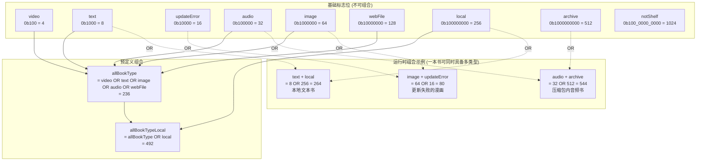

# 常量系统

> **核心问题**：Legado 13 个常量模块如何组织？各自覆盖什么职责？哪些设计模式值得复用？
> **答案**：以 Kotlin `object` 单例为载体，13 个常量模块覆盖日志/应用常量/书籍类型/源类型/偏好键/翻页动画/通知ID/意图动作/播放状态/事件总线/正则模式/主题枚举等。核心设计模式包括 NoStackTraceException 性能基类、位标志(Bitmask)枚举、@IntDef 类型安全、带容量限制同步缓冲、伴生对象单例常量、语义化重试信息、超大规模键值常量池。

---

## 1. 常量模块全景

### 文件结构

```
constant/
├── AppLog.kt          ← 日志缓冲 (object, 容量100, @Synchronized)
├── AppConst.kt        ← 应用常量 (object, 懒加载格式化/设备信息)
├── BookType.kt        ← 书籍类型位标志 (object, @IntDef(flag=true))
├── BookSourceType.kt  ← 书源内容类型 (object, @IntDef)
├── SourceType.kt      ← 源类型 (object, @IntDef, book=0/rss=1)
├── PreferKey.kt       ← 偏好键常量池 (object, 210+ const val)
├── PageAnim.kt        ← 翻页动画类型 (object, @IntDef)
├── NotificationId.kt  ← 通知ID (object, 统一规划)
├── IntentAction.kt    ← Intent动作常量 (object, 20个)
├── Status.kt          ← 播放状态 (object, STOP/PLAY/PAUSE)
├── EventBus.kt        ← 事件总线常量 (object, 40个)
├── AppPattern.kt      ← 预编译正则 (object, 27个Pattern/Regex)
└── Theme.kt           ← 主题枚举 (enum, 5值)
```

### 被引用频率分布

```mermaid
%%{init: {'themeVariables': {'fontFamily': 'Microsoft YaHei, SimHei, sans-serif'}}}%%
flowchart LR
    subgraph 高频引用["高频引用 (50+)"]
        AppLog["AppLog<br/>100文件"]
        AppConst["AppConst<br/>57文件"]
        EventBus["EventBus<br/>50文件"]
    end

    subgraph 中频引用["中频引用 (20-50)"]
        PreferKey["PreferKey<br/>41文件"]
        AppPattern["AppPattern<br/>39文件"]
        BookType["BookType<br/>27文件"]
    end

    subgraph 低频引用["低频引用 (<20)"]
        PageAnim["PageAnim<br/>15文件(估)"]
        IntentAction["IntentAction<br/>15文件"]
        NotificationId["NotificationId<br/>12文件(估)"]
        SourceType["SourceType<br/>10文件(估)"]
        BookSourceType["BookSourceType<br/>10文件(估)"]
        Theme["Theme<br/>7文件"]
        Status["Status<br/>5文件"]
    end

    高频引用 ---|"引用量递减"| 中频引用
    中频引用 ---|"引用量递减"| 低频引用
```



---

## 2. AppLog — 带容量限制同步日志缓冲

**文件**：[AppLog.kt](file:///f:/myself/github/WeAgentChat/temp/legado/app/src/main/java/io/legado/app/constant/AppLog.kt)
**引用**：100 文件

### 设计

```kotlin
object AppLog {
    private val mLogs = arrayListOf<Triple<Long, String, Throwable?>>()
    val logs get() = mLogs.toList()

    @Synchronized
    fun put(message: String?, throwable: Throwable? = null, toast: Boolean = false) {
        message ?: return
        if (toast) appCtx.toastOnUi(message)
        if (mLogs.size > 100) mLogs.removeLastOrNull()  // 容量限制
        // 记录日志 + DEBUG模式写Log.e
        mLogs.add(0, Triple(System.currentTimeMillis(), message, throwable))
    }

    @Synchronized
    fun putNotSave(message: String?, throwable: Throwable? = null, toast: Boolean = false)

    @Synchronized
    fun clear()

    fun putDebug(message: String?, throwable: Throwable? = null)  // 仅 recordLog=true 时记录
}
```

### 设计模式：带容量限制同步缓冲

| 要点 | 说明 |
|------|------|
| `@Synchronized` | 所有写操作线程安全 |
| 容量上限 100 | 超出后移除最旧记录（FIFO） |
| `Triple<Long, String, Throwable?>` | 时间戳 + 消息 + 可选异常 |
| `put` vs `putNotSave` | put 写入 LogUtils（可持久化），putNotSave 仅内存 |
| `putDebug` | 受 `AppConfig.recordLog` 控制，避免正式版性能损耗 |
| 新记录 `add(0, ...)` | 最新的在最前，方便 UI 展示 |

---

## 3. AppConst — 应用常量与懒加载

**文件**：[AppConst.kt](file:///f:/myself/github/WeAgentChat/temp/legado/app/src/main/java/io/legado/app/constant/AppConst.kt)
**引用**：57 文件

### 常量

| 常量 | 值 | 说明 |
|------|-----|------|
| `APP_TAG` | `"Legado"` | 应用标签 |
| `channelIdDownload` | `"channel_download"` | 下载通知渠道 |
| `channelIdReadAloud` | `"channel_read_aloud"` | 朗读通知渠道 |
| `channelIdWeb` | `"channel_web"` | Web 服务通知渠道 |
| `UA_NAME` | `"User-Agent"` | HTTP User-Agent 头名 |
| `MAX_THREAD` | `9` | 最大并发线程数 |
| `DEFAULT_WEBDAV_ID` | `-1L` | 默认 WebDAV 配置 ID |
| `authority` | `BuildConfig.APPLICATION_ID + ".fileProvider"` | FileProvider 授权 |

### 懒加载属性

| 属性 | 类型 | 说明 |
|------|------|------|
| `timeFormat` | `FastDateFormat` | 格式 `"HH:mm"` |
| `dateFormat` | `FastDateFormat` | 格式 `"yyyy/MM/dd HH:mm"` |
| `fileNameFormat` | `FastDateFormat` | 格式 `"yy-MM-dd-HH-mm-ss"` |
| `androidId` | `String` | 设备 Android ID |
| `appInfo` | `AppInfo` | 版本号/变体信息 |
| `charsets` | `List<String>` | 支持的字符编码列表 |

### 内部数据类

```kotlin
@Keep
data class AppInfo(
    var versionCode: Long = 0L,
    var versionName: String = "",
    var appVariant: AppVariant = AppVariant.UNKNOWN
)
```

---

## 4. BookType — 位标志枚举

**文件**：[BookType.kt](file:///f:/myself/github/WeAgentChat/temp/legado/app/src/main/java/io/legado/app/constant/BookType.kt)
**引用**：27 文件

### 位标志定义

```kotlin
object BookType {
    const val video      = 0b100           // 4   视频
    const val text       = 0b1000          // 8   文本
    const val updateError = 0b10000        // 16  更新失败
    const val audio      = 0b100000        // 32  音频
    const val image      = 0b1000000       // 64  图片
    const val webFile    = 0b10000000      // 128 仅下载网站
    const val local      = 0b100000000     // 256 本地
    const val archive    = 0b1000000000    // 512 压缩包
    const val notShelf   = 0b100_0000_0000 // 1024 未上架

    @IntDef(flag = true, value = [video, text, updateError, audio, image, webFile, local, archive, notShelf])
    annotation class Type

    const val allBookType     = video or text or image or audio or webFile
    const val allBookTypeLocal = video or text or image or audio or webFile or local
}
```

### 位标志组合关系图



### 位运算操作

```kotlin
// 判断是否包含某类型
val isAudio = bookType and BookType.audio != 0

// 添加类型
bookType = bookType or BookType.local

// 移除类型
bookType = bookType and BookType.local.inv()

// 判断是否为所有可从书源获取的类型
val isFromSource = bookType and BookType.allBookType != 0
```

---

## 5. BookSourceType — 书源内容类型

**文件**：[BookSourceType.kt](file:///f:/myself/github/WeAgentChat/temp/legado/app/src/main/java/io/legado/app/constant/BookSourceType.kt)

```kotlin
object BookSourceType {
    const val default = 0  // 文本
    const val audio = 1    // 音频
    const val image = 2    // 图片
    const val file = 3     // 仅下载
    const val video = 4    // 视频

    @IntDef(default, audio, image, file, video)
    annotation class Type
}
```

**与 BookType 的关系**：BookSourceType 是书源的**单一内容类型**声明，BookType 是书籍实例的**位标志组合**状态。一个书源声明 `BookSourceType.image`，但使用该源的书籍可以同时有 `BookType.image or BookType.local`。

---

## 6. SourceType — 源类型

**文件**：[SourceType.kt](file:///f:/myself/github/WeAgentChat/temp/legado/app/src/main/java/io/legado/app/constant/SourceType.kt)

```kotlin
object SourceType {
    const val book = 0  // 书源
    const val rss = 1   // 订阅源

    @IntDef(book, rss)
    annotation class Type
}
```

**使用场景**：数据库查询区分书源/订阅源，UI 页面切换（书架 vs 订阅）。

---

## 7. PreferKey — 超大规模键值常量池

**文件**：[PreferKey.kt](file:///f:/myself/github/WeAgentChat/temp/legado/app/src/main/java/io/legado/app/constant/PreferKey.kt)
**引用**：41 文件

### 分组概览（210+ 常量）

| 分组 | 数量(约) | 代表性常量 | 说明 |
|------|---------|-----------|------|
| 界面主题 | 15 | `themeMode`, `fontScale`, `language`, `transparentStatusBar` | 全局外观配置 |
| 阅读配置 | 25 | `readBodyToLh`, `textFullJustify`, `shareLayout`, `readStyleSelect` | 阅读排版 |
| 翻页动画 | 1 | `pageAnim` (实际值由 PageAnim 定义) | 翻页效果类型 |
| 点击区域 | 9 | `clickActionTL` ~ `clickActionBR` | 九宫格点击行为 |
| TTS | 8 | `ttsEngine`, `ttsSpeechRate`, `readAloudByPage`, `ttsTimer` | 朗读引擎配置 |
| 漫画 | 12 | `mangaPreDownloadNum`, `enableMangaEInk`, `hideMangaTitle` | 漫画阅读配置 |
| WebDAV | 5 | `webDavUrl`, `webDavAccount`, `webDavPassword`, `webDavDir` | 云同步配置 |
| 导出 | 6 | `exportType`, `exportCharset`, `exportNoChapterName` | 书籍导出配置 |
| 换源 | 4 | `changeSourceCheckAuthor`, `changeSourceLoadToc` | 换源策略 |
| 欢迎页 | 8 | `customWelcome`, `welcomeImage`, `welcomeShowText` | 启动欢迎页 |
| 颜色配置 | 14 | `cPrimary`, `cBackground`, `bgImage`, `cNPrimary` | 日间/夜间主题色 |
| 其他 | 100+ | `recordLog`, `threadCount`, `webPort`, `brightness` | 杂项 |

### 设计模式：伴生对象单例常量

```
意图：将 SharedPreferences 的字符串键集中管理，避免硬编码散落各处
结构：object PreferKey { const val xxx = "xxx" } → AppConfig 通过键名读写
约束：键名与值名一致（const val brightness = "brightness"），保持可搜索性
风险：210+ 常量单文件，分组靠注释维持，无编译期分组校验
```

---

## 8. PageAnim — 翻页动画类型

**文件**：[PageAnim.kt](file:///f:/myself/github/WeAgentChat/temp/legado/app/src/main/java/io/legado/app/constant/PageAnim.kt)

```kotlin
object PageAnim {
    const val coverPageAnim = 0       // 覆盖
    const val slidePageAnim = 1       // 滑动
    const val simulationPageAnim = 2  // 仿真
    const val scrollPageAnim = 3      // 滚动
    const val noAnim = 4              // 无动画

    @IntDef(coverPageAnim, slidePageAnim, simulationPageAnim, scrollPageAnim, noAnim)
    annotation class Type
}
```

---

## 9. NotificationId — 通知ID统一规划

**文件**：[NotificationId.kt](file:///f:/myself/github/WeAgentChat/temp/legado/app/src/main/java/io/legado/app/constant/NotificationId.kt)

```kotlin
object NotificationId {
    const val ReadAloudService = 101   // 朗读服务前台通知
    const val AudioPlayService = 102   // 音频播放服务
    const val CacheBookService = 103   // 缓存下载服务
    const val ExportBookService = 104  // 导出服务
    const val WebService = 105         // Web 服务
    const val DownloadService = 106    // 下载服务
    const val CheckSourceService = 107 // 校验书源服务
    const val VideoPlayService = 108   // 视频播放服务
    const val Download = 10000         // 下载进度通知
    const val ExportBook = 201         // 导出进度通知
}
```

**设计原则**：通知 ID 不能重复，101-108 分配给前台服务，10000+ 分配给进度通知。

---

## 10. IntentAction — Intent 动作常量

**文件**：[IntentAction.kt](file:///f:/myself/github/WeAgentChat/temp/legado/app/src/main/java/io/legado/app/constant/IntentAction.kt)
**引用**：15 文件

```kotlin
object IntentAction {
    const val start = "start"             // 开始播放
    const val play = "play"               // 播放
    const val playNew = "playNew"         // 播放新书籍
    const val stop = "stop"               // 停止
    const val resume = "resume"           // 恢复
    const val pause = "pause"             // 暂停
    const val addTimer = "addTimer"       // 添加定时器
    const val setTimer = "setTimer"       // 设置定时器
    const val prevParagraph = "prevParagraph" // 上一段
    const val nextParagraph = "nextParagraph" // 下一段
    const val upTtsSpeechRate = "upTtsSpeechRate" // 更新TTS语速
    const val upTtsProgress = "upTtsProgress"     // 更新TTS进度
    const val adjustProgress = "adjustProgress"   // 调整进度
    const val setSpeed = "setSpeed"               // 设置播放速度
    const val prev = "prev"               // 上一首/章
    const val next = "next"               // 下一首/章
    const val moveTo = "moveTo"           // 跳转到位置
    const val init = "init"               // 初始化
    const val remove = "remove"           // 移除
    const val stopPlay = "stopPlay"       // 停止播放
}
```

**使用场景**：Service 与 Activity 之间的 Intent 通信，主要用于朗读/音频/视频播放控制。

---

## 11. Status — 播放状态

**文件**：[Status.kt](file:///f:/myself/github/WeAgentChat/temp/legado/app/src/main/java/io/legado/app/constant/Status.kt)
**引用**：5 文件

```kotlin
object Status {
    const val STOP = 0   // 停止
    const val PLAY = 1   // 播放中
    const val PAUSE = 3  // 暂停 (注意: 跳过了2)
}
```

**注意**：`PAUSE = 3` 跳过了 2，这是历史遗留，新增状态不应使用 2。

---

## 12. EventBus — 事件总线常量

**文件**：[EventBus.kt](file:///f:/myself/github/WeAgentChat/temp/legado/app/src/main/java/io/legado/app/constant/EventBus.kt)
**引用**：50 文件

### 分组

| 分组 | 常量 | 说明 |
|------|------|------|
| 书架 | `UP_BOOKSHELF`, `BOOKSHELF_REFRESH`, `REFRESH_BOOK_INFO`, `REFRESH_BOOK_CONTENT`, `REFRESH_BOOK_TOC` | 书架数据变更通知 |
| 朗读 | `ALOUD_STATE`, `TTS_PROGRESS`, `READ_ALOUD_DS`, `READ_ALOUD_PLAY` | 朗读状态与进度 |
| 音频 | `AUDIO_DS`, `AUDIO_STATE`, `AUDIO_PROGRESS`, `AUDIO_BUFFER_PROGRESS`, `AUDIO_SIZE`, `AUDIO_SPEED`, `AUDIO_SUB_TITLE` | 音频播放控制 |
| 系统 | `BATTERY_CHANGED`, `TIME_CHANGED`, `MEDIA_BUTTON`, `NOTIFY_MAIN`, `RECREATE` | 系统事件 |
| 配置 | `UP_CONFIG`, `TIP_COLOR`, `SOURCE_CHANGED` | 配置变更通知 |
| 下载 | `UP_DOWNLOAD`, `UP_DOWNLOAD_STATE`, `SAVE_CONTENT`, `EXPORT_BOOK` | 下载与导出状态 |
| 校验 | `CHECK_SOURCE`, `CHECK_SOURCE_DONE`, `SEARCH_RESULT` | 书源校验进度 |
| 阅读 | `UPDATE_READ_ACTION_BAR`, `UP_SEEK_BAR` | 阅读 UI 更新 |
| 漫画 | `UP_MANGA_CONFIG` | 漫画配置变更 |
| Web | `WEB_SERVICE`, `VIDEO_SUB_TITLE`, `UP_VIDEO_INFO` | Web 服务与视频 |
| 播放模式 | `PLAY_MODE_CHANGED` | 播放模式切换 |

---

## 13. AppPattern — 预编译正则模式

**文件**：[AppPattern.kt](file:///f:/myself/github/WeAgentChat/temp/legado/app/src/main/java/io/legado/app/constant/AppPattern.kt)
**引用**：39 文件

### Pattern（预编译 java.util.regex.Pattern）

| 常量 | 用途 |
|------|------|
| `JS_PATTERN` | 匹配 `<js>...</js>` 和 `@js:...` 规则 |
| `WebJS_PATTERN` | 匹配 `@webjs:...` 规则 |
| `EXP_PATTERN` | 匹配 `{{...}}` 模板表达式 |
| `imgPattern` | 匹配 HTML `` 标签 |
| `titleNumPattern` | 匹配 `"第X章"` 章节号 |

### Regex（Kotlin 预编译正则）

| 常量 | 用途 |
|------|------|
| `useHtmlRegex` | 匹配 `<usehtml>...</usehtml>` 标记 |
| `dataUriRegex` | 匹配 Data URI 图片 |
| `imgRegex` | 提取图片 URL |
| `wordCountRegex` | 提取字数信息 |
| `noWordCountRegex` | 不计入字数的空白字符 |
| `domainRegex` | 提取 URL 域名 |
| `nameRegex` | 书名清洗（去掉作者后缀） |
| `authorRegex` | 作者名清洗 |
| `fileNameRegex` / `fileNameRegex2` | 文件名非法字符过滤 |
| `splitGroupRegex` | 分组分隔符（逗号/分号） |
| `debugMessageSymbolRegex` | 调试信息符号清理 |
| `bookFileRegex` | 本地书籍扩展名（txt/epub/umd/pdf/mobi/azw3/azw） |
| `archiveFileRegex` | 压缩文件扩展名（zip/rar/7z） |
| `bdRegex` | 所有标点 |
| `rnRegex` | 换行符 |
| `notReadAloudRegex` | 不发音段落判断 |
| `xmlContentTypeRegex` | XML 内容类型匹配 |
| `semicolonRegex` / `equalsRegex` / `spaceRegex` / `LFRegex` | 基础分隔符 |
| `regexCharRegex` | 正则特殊字符转义 |

### 设计模式

```
意图：避免运行时重复编译正则表达式
结构：object 级 val，类加载时一次性编译
优势：Pattern/Regex 编译开销仅一次，后续调用直接使用
注意：JS_PATTERN 使用 Pattern.CASE_INSENSITIVE，WebJS_PATTERN 要求内容≥5字符
```

---

## 14. Theme — 主题枚举

**文件**：[Theme.kt](file:///f:/myself/github/WeAgentChat/temp/legado/app/src/main/java/io/legado/app/constant/Theme.kt)
**引用**：7 文件

```kotlin
enum class Theme {
    Dark,        // 深色
    Light,       // 浅色
    Auto,        // 跟随系统
    Transparent, // 透明（沉浸式）
    EInk         // 墨水屏
}
```

**特殊说明**：这是常量模块中唯一的 `enum class`（其他均为 `object`）。`Transparent` 和 `EInk` 是阅读场景专用主题，`Auto` 跟随系统暗色模式。

---

## 15. 设计模式总结

### 模式1：NoStackTraceException 性能基类模式

详见 [exception-system.md](./exception-system.md)。异常系统与常量系统的交汇点——`NoStackTraceException` 本身定义在 exception 包，但其设计理念（消除不必要开销）与常量模块的预编译正则、懒加载等模式一脉相承。

### 模式2：位标志(Bitmask)枚举模式

```
适用：一个实体可同时具备多种互不排斥的属性
实现：const val 用 2^n 赋值，@IntDef(flag=true) 声明
操作：AND 判断包含 / OR 添加 / AND NOT 移除
项目实例：BookType（9 个标志位）
```

### 模式3：@IntDef 类型安全模式

```
适用：限制整型参数的合法取值范围
实现：object 内 const val 定义值 + @IntDef 注解声明合法集合
编译期：Android Lint 检测非法赋值
项目实例：BookType / BookSourceType / SourceType / PageAnim（4 个模块）
```

### 模式4：带容量限制同步缓冲模式

```
适用：需要线程安全的有限容量内存缓冲
实现：@Synchronized 修饰写方法 + size 判断 + FIFO 淘汰
项目实例：AppLog（容量 100）
```

### 模式5：伴生对象单例常量模式

```
适用：全局唯一的常量集合
实现：Kotlin object 声明，天然单例，无状态
项目实例：全部 12 个 object 常量模块
```

### 模式6：ConcurrentException 语义化重试信息

```
适用：异常需要携带恢复指导信息
实现：子类额外属性 waitTime:Long
项目实例：ConcurrentException + CacheBook 延迟重试
```

### 模式7：PreferKey 超大规模键值常量池

```
适用：SharedPreferences 键名集中管理
实现：210+ const val 单 object，分组靠注释
优势：全局搜索可定位任何配置项的使用位置
风险：文件膨胀，无编译期分组校验
```
