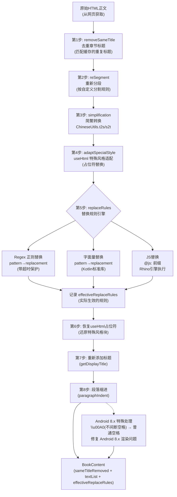
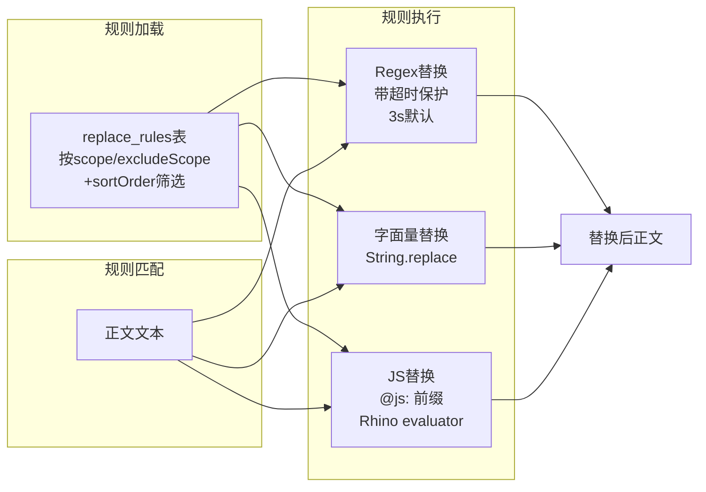

# 内容处理管线

> 正文获取后的核心后处理模块——ContentProcessor 八步管线 + ReplaceAnalyzer 替换规则引擎。

---

## 内容处理八步管线流程



---

## 替换规则处理流程



---

## 1. ContentProcessor 架构

[ContentProcessor.kt](file:///f:/myself/github/WeAgentChat/temp/legado/app/src/main/java/io/legado/app/help/book/ContentProcessor.kt)

### 1.1 单例工厂模式

每本书独立一个 ContentProcessor 实例，按 `bookName + bookOrigin` 为键缓存：

```
ContentProcessor.get(bookName, bookOrigin):
  1. 用 "bookName+bookOrigin" 作为 key 查找 WeakReference 缓存
  2. 命中缓存 → 返回已有实例
  3. 未命中 → 新建实例，初始化规则加载
```

**关键设计：**
- **WeakReference 缓存** — 防止内存泄漏，GC 可自动回收
- **每书独立实例** — 不同书的替换规则不同
- **全局刷新** — `upReplaceRules()` 遍历所有缓存实例，重新加载规则

### 1.2 实例初始化

```
ContentProcessor 构造函数:
  1. upReplaceRules()      → 加载标题/正文替换规则
  2. upRemoveSameTitle()   → 加载已缓存章节文件名集合（用于去重判断）
```

### 1.3 规则加载 SQL

替换规则从 `replace_rules` 表加载，核心查询逻辑：

```sql
-- 加载正文替换规则（scopeContent=1）
SELECT * FROM replace_rules
WHERE isEnabled = 1 AND scopeContent = 1
  AND (scope LIKE '%' || :bookName || '%'
       OR scope LIKE '%' || :bookOrigin || '%'
       OR scope IS NULL OR scope = '')
  AND (excludeScope IS NULL
       OR (excludeScope NOT LIKE '%' || :bookName || '%'
           AND excludeScope NOT LIKE '%' || :bookOrigin || '%'))
ORDER BY sortOrder
```

**匹配规则：**
- `scope` 字段匹配书名或书源 URL → 规则生效
- `excludeScope` 字段排除特定书名或书源 → 规则不生效
- `sortOrder` 控制替换顺序

---

## 2. getContent() 八步管线

[ContentProcessor.getContent()](file:///f:/myself/github/WeAgentChat/temp/legado/app/src/main/java/io/legado/app/help/book/ContentProcessor.kt)

```
函数签名:
  getContent(book, chapter, content, includeTitle, useReplace, chineseConvert, reSegment) → BookContent

返回值 BookContent:
  - sameTitleRemoved: Boolean         — 是否成功去重标题
  - textList: List<String>            — 分段后的文本行列表
  - effectiveReplaceRules: List?      — 实际生效的替换规则
```

### 管线执行顺序（严格顺序）：

```
原始正文内容 (String content)
    │
    ├─ 步骤1: 去重标题 (sameTitleRemoved)
    │     检查 NR 缓存文件 → 正则匹配标题开头 → 移除匹配部分
    │     二次匹配: 替换后标题 → 去重
    │
    ├─ 步骤2: 重新分段 (reSegment)
    │     仅当 book.getReSegment()=true 时执行
    │     ContentHelp.reSegment(content, chapter.title)
    │
    ├─ 步骤3: 简繁转换 (chineseConvert)
    │     可选：简→繁 或 繁→简
    │
    ├─ 步骤4: useHtml 特殊风格适配
    │     <usehtml>...</usehtml> → 占位符 → 替换规则后恢复
    │
    ├─ 步骤5: 替换规则引擎（核心）
     │     每行执行自定义 trim: str.trim { it.code <= 0x20 || it == '　' }
     │     移除控制字符(code<=0x20)和全角空格(U+3000)，比标准 trim 更激进
     │     逐条执行 contentReplaceRules
    │     ├─ isRegex=true  → 正则+超时保护(3s默认)
    │     ├─ isRegex=false → 字面量替换
    │     └─ @js: 前缀 → Rhino JS 脚本替换
    │     记录 effectiveReplaceRules
    │
    ├─ 步骤6: 恢复 useHtml 占位符
    │     将步骤4的占位符还原为原始 HTML 块
    │
    ├─ 步骤7: 重新添加标题
    │     如果去重了标题，将处理后的标题插回内容开头
    │
    └─ 步骤8: 段落缩进
          为每行添加缩进空格（根据配置）
          第一行(标题)无缩进，其余行+paragraphIndent
            │
            ▼
         Android 8.x 特殊后处理:
           在 API 26-27 上，\u00A0（不间断空格）替换为普通空格
           修复 Android 8.x 渲染问题
            │
            ▼
         BookContent(textList, sameTitleRemoved, effectiveReplaceRules)
```

---

## 3. 步骤详解

### 3.1 去重标题算法

**目的：** 正文中通常包含章节标题本身，需要去除避免重复显示。

```
算法流程:
1. 检查 NR 缓存文件是否存在（该章节是否已缓存）
   - 已缓存 → 跳过去重（已处理过）
   - 未缓存 → 执行去重

2. 第一次匹配（使用原始标题）:
   正则: "^(\\s|\\p{P}|${bookName})*${chapterTitle}(\\s)*"
   - \\s|\\p{P} → 空白字符或标点符号
   - ${bookName} → 书名（可能出现在标题前）
   - ${chapterTitle} → 转义后的章节标题（空白字符转 \\s*）
   - 匹配成功 → 移除匹配内容，sameTitleRemoved=true

3. 第二次匹配（第一次失败 + useReplace=true + book.getUseReplaceRule()=true 时）:
   先对章节标题应用标题替换规则得到 displayTitle
   再用 displayTitle 构建相同正则模式匹配
   匹配成功 → 移除匹配内容
```

### 3.2 重新分段

```
仅在 book.getReSegment() = true 时执行
ContentHelp.reSegment(content, chapter.title):
  1. 构建引号内词条字典（makeDict）
  2. 按换行符分割，识别错误分段并重新黏合
  3. 处理引号配对，纠正 " " 方向
  4. 根据句末标点、对话模式等规则，在合适位置插入换行符
  5. 随机分段以减少过长段落（forceSplit + reduceLength）
```

### 3.3 简繁转换

| 值 | 含义 | 方法 |
|---|------|------|
| 0 | 不转换 | — |
| 1 | 繁体→简体 | `ChineseUtils.t2s()` |
| 2 | 简体→繁体 | `ChineseUtils.s2t()` |

### 3.4 useHtml 特殊风格适配

```
仅在 AppConfig.adaptSpecialStyle 启用时执行

正则: <usehtml>.*?</usehtml> (DOT_MATCHES_ALL)

流程:
1. 将 <usehtml>...</usehtml> 块提取为占位符
   占位符格式: "特殊格式的占位不应该被看见{N}。"
2. 占位期间内容不参与替换规则处理
3. 替换规则执行完毕后恢复原内容（步骤6）
```

---

## 4. 替换规则引擎 — ReplaceAnalyzer

[ReplaceAnalyzer.kt](file:///f:/myself/github/WeAgentChat/temp/legado/app/src/main/java/io/legado/app/help/book/ReplaceAnalyzer.kt)

### 4.1 ReplaceRule 数据结构

[ReplaceRule.kt](file:///f:/myself/github/WeAgentChat/temp/legado/app/src/main/java/io/legado/app/data/entities/ReplaceRule.kt)

| 字段 | 类型 | 默认值 | 说明 |
|------|------|--------|------|
| `id` | Long (PK, autoGenerate) | `System.currentTimeMillis()` | 主键 |
| `name` | String | `""` | 规则名称 |
| `group` | String? | `null` | 分组标签 |
| `pattern` | String | `""` | 匹配内容（字面量/正则） |
| `replacement` | String | `""` | 替换为（支持 `@js:` 脚本） |
| `scope` | String? | `null` | 作用范围（书名逗号列表） |
| `scopeTitle` | Boolean | `false` | 作用于标题 |
| `scopeContent` | Boolean | `true` | 作用于正文 |
| `excludeScope` | String? | `null` | 排除范围（书名逗号列表） |
| `isEnabled` | Boolean | `true` | 是否启用 |
| `isRegex` | Boolean | `true` | 是否正则模式 |
| `timeoutMillisecond` | Long | `3000` | 超时时间（毫秒） |
| `sortOrder` | Int | `Int.MIN_VALUE` | 排序号 |

### 4.2 两种替换模式

| 模式 | isRegex | 方法 | 说明 |
|------|---------|------|------|
| 正则模式 | `true` | `mContent.replace(name, regex, replacement, timeout, chapter, replaceBook)` | 带超时保护的复杂正则替换，支持 `@js:` 脚本替换 |
| 字面量模式 | `false` | `mContent.replace(pattern, replacement)` | Kotlin 标准字面量替换 |

### 4.3 JS 脚本替换

replacement 以 `@js:` 开头时，使用 Rhino 引擎执行 JS 脚本：

```
JS 上下文注入对象:
  - result   — 匹配组内容
  - chapter  — 当前章节对象
  - book     — 当前书籍对象（ReplaceBook）
  - java     — RegexJsExtensions 扩展对象
```

### 4.4 正则替换超时保护

```
超时机制:
  - timeoutMillisecond <= 0 → 使用默认值 3000ms
  - 通过 kotlinx.coroutines.selects.select + onTimeout 实现
  - 超时后:
    1. 禁用该规则（isEnabled = false）
    2. 写入数据库更新
    3. 内容替换为错误信息
    4. 3秒后仍未结束 → 重启应用
```

### 4.5 正则有效性校验

```
isValid():
  1. pattern 为空 → false
  2. isRegex=true 时:
     a. Pattern.compile(pattern) 编译测试 → 失败则 false
     b. pattern 以 | 结尾（非转义的 \|）→ false
  3. 其他 → true
```

### 4.6 标题替换规则

标题替换通过 `BookChapter.getDisplayTitle()` 实现：

```
getDisplayTitle(replaceRules, useReplace, chineseConvert, replaceBook):
  1. 移除 \r\n
  2. 简繁转换
  3. 应用标题替换规则
     - 替换结果为空字符串时保持原标题不变（isNotBlank() 检查）
     - 超时 → 禁用规则 + 更新数据库
```

### 4.7 替换规则的生效范围

```
scope 字段三种取值:
  - null/空 → 全局规则，对所有书生效
  - "书名" → 仅匹配该书名
  - "书源URL" → 仅匹配该书源

scopeTitle / scopeContent 标识:
  - scopeTitle=true  → 规则在目录/章节标题上应用
  - scopeContent=true → 规则在正文内容上应用

excludeScope 排除:
  - null → 不排除
  - 包含书名或书源 → 该规则不生效
```

---

## 5. ReplaceAnalyzer 导入导出

### 5.1 兼容双格式解析

| 旧字段 | 映射到 | 说明 |
|--------|--------|------|
| `regex` | `pattern` | 正则表达式变为匹配内容 |
| `replaceSummary` | `name` | 替换摘要变为规则名称 |
| `replacement` | `replacement` | 保持不变 |
| `isRegex` | `isRegex` | 是否正则 |
| `useTo` | `scope` | 作用范围 |
| `enable` | `isEnabled` | 是否启用 |
| `serialNumber` | `order(sortOrder)` | 排序号 |

---

## 6. HTML 格式化规范

[HtmlFormatter.kt](file:///f:/myself/github/WeAgentChat/temp/legado/app/src/main/java/io/legado/app/utils/HtmlFormatter.kt)

| 步骤 | 正则 | 替换为 | 说明 |
|------|------|--------|------|
| 1 | `(&nbsp;)+` | `" "` | 不间断空格 → 空格 |
| 2 | `(&ensp;|&emsp;)` | `" "` | 半方/全方空格 → 空格 |
| 3 | `(&thinsp;\|&zwnj;\|&zwj;\|\u2009\|\u200C\|\u200D)` | `""` | 细空格/零宽连字 → 移除 |
| 4 | `</?(?:div\|p\|br\|hr\|h\d\|article\|dd\|dl)[^>]*>` | `"\n"` | 块级标签 → 换行 |
| 5 | `<!--[^>]*-->` | `""` | HTML 注释 → 移除 |
| 6 | `</?(?!img)[a-zA-Z]+(?=[ >])[^<>]*>` | `""` | 非 img 标签全部移除 |
| 7 | `\s*\n+\s*` | `"\n　　"` | 缩减换行，保留缩进 |
| 8 | `^[\n\s]+` | `"　　"` | 开头空白 → 缩进 |
| 9 | `[\n\s]+$` | `""` | 结尾空白 → 移除 |

**图片特殊处理**（`formatKeepImg`）：
- 保留 `` 标签
- 提取图片 URL（支持 `src`、`data-src`、`data-original`、`data-srcset` 属性）
- 相对 URL 转换为绝对 URL
- 支持 `{param}` 参数表达式

---

## 7. 分页策略

[BookContent.kt:73-127](file:///f:/myself/github/WeAgentChat/temp/legado/app/src/main/java/io/legado/app/help/book/BookContent.kt#L73-L127)

正文获取支持两种分页模式：

### 7.1 单页顺序翻页

```
适用于: ContentRule.webJs 为空
策略: 获取第1页 → 展示 → 翻页时获取第2页 → ...
规则: ruleContent 仅对第一页生效
```

### 7.2 多页并发获取

```
适用于: ContentRule.webJs 不为空
策略: 一次性并发获取所有分页，合并后展示
并发控制: threadCount 控制并发数
```

---

## 8. 关键设计决策

| 决策 | 选择 | 原因 |
|------|------|------|
| 实例缓存 | WeakReference | 避免内存泄漏 |
| 规则存储 | CopyOnWriteArrayList | 线程安全，读写分离 |
| 去重缓存 | HashSet + nr 文件 | O(1) 查找，持久化到文件系统 |
| 正则替换 | 协程 + select + onTimeout | 防止恶意正则导致 ANR |
| 非正则替换 | Kotlin `String.replace()` | 标准库实现，简单可靠 |
| 超时处理 | 禁用规则 + 更新 DB | 防止反复触发超时 |
| JS 替换 | Rhino 引擎 | 支持动态替换逻辑 |
| HTML 特殊块 | 占位符替换 | 避免替换规则破坏 HTML 结构 |

---

## 9. 相关代码锚点

| 功能 | 文件 | 行号 |
|------|------|------|
| ContentProcessor 定义 | [ContentProcessor.kt](file:///f:/myself/github/WeAgentChat/temp/legado/app/src/main/java/io/legado/app/help/book/ContentProcessor.kt) | L1 |
| getContent() 管线 | [ContentProcessor.kt](file:///f:/myself/github/WeAgentChat/temp/legado/app/src/main/java/io/legado/app/help/book/ContentProcessor.kt) | L104-176 |
| 去重标题正则 | [ContentProcessor.kt](file:///f:/myself/github/WeAgentChat/temp/legado/app/src/main/java/io/legado/app/help/book/ContentProcessor.kt) | L145-167 |
| 替换规则应用 | [ReplaceAnalyzer.kt](file:///f:/myself/github/WeAgentChat/temp/legado/app/src/main/java/io/legado/app/help/book/ReplaceAnalyzer.kt) | L1 |
| ReplaceRule 实体 | [ReplaceRule.kt](file:///f:/myself/github/WeAgentChat/temp/legado/app/src/main/java/io/legado/app/data/entities/ReplaceRule.kt) | L1 |
| ReplaceRuleDao 查询 | [ReplaceRuleDao.kt](file:///f:/myself/github/WeAgentChat/temp/legado/app/src/main/java/io/legado/app/data/dao/ReplaceRuleDao.kt) | L1 |
| BookContent 数据结构 | [BookContent.kt](file:///f:/myself/github/WeAgentChat/temp/legado/app/src/main/java/io/legado/app/help/book/BookContent.kt) | L1 |
| 分页策略 | [BookContent.kt](file:///f:/myself/github/WeAgentChat/temp/legado/app/src/main/java/io/legado/app/help/book/BookContent.kt) | L73-127 |
| reSegment 实现 | [ContentHelp.kt](file:///f:/myself/github/WeAgentChat/temp/legado/app/src/main/java/io/legado/app/help/book/ContentHelp.kt) | L1 |
| 正则替换超时 | [RegexExtensions.kt](file:///f:/myself/github/WeAgentChat/temp/legado/app/src/main/java/io/legado/app/utils/RegexExtensions.kt) | L1 |
| HTML 格式化 | [HtmlFormatter.kt](file:///f:/myself/github/WeAgentChat/temp/legado/app/src/main/java/io/legado/app/utils/HtmlFormatter.kt) | L1 |

---

## Python 重构参考

### P1. ContentProcessor

```python
import re
from typing import Optional, List
from dataclasses import dataclass, field


@dataclass
class ReplaceRule:
    id: int = 0
    name: str = ""
    group: Optional[str] = None
    pattern: str = ""
    replacement: str = ""
    scope: Optional[str] = None
    scope_title: bool = False
    scope_content: bool = True
    exclude_scope: Optional[str] = None
    is_enabled: bool = True
    is_regex: bool = True
    timeout_ms: int = 3000
    order: int = 0

    def get_valid_timeout(self) -> int:
        return self.timeout_ms if self.timeout_ms > 0 else 3000

    def is_valid(self) -> bool:
        if not self.pattern:
            return False
        if self.is_regex:
            try:
                re.compile(self.pattern)
            except re.error:
                return False
            if self.pattern.endswith('|') and not self.pattern.endswith('\\|'):
                return False
        return True


@dataclass
class BookContent:
    same_title_removed: bool
    text_list: List[str]
    effective_replace_rules: Optional[List[ReplaceRule]]


class ContentProcessor:
    """每本书独立一个实例，单例工厂管理"""

    _processors: dict = {}

    @classmethod
    def get(cls, book_name: str, book_origin: str) -> "ContentProcessor":
        key = book_name + book_origin
        if key not in cls._processors:
            cls._processors[key] = ContentProcessor(book_name, book_origin)
        return cls._processors[key]

    @classmethod
    def up_replace_rules_all(cls):
        for proc in cls._processors.values():
            proc.up_replace_rules()

    def __init__(self, book_name: str, book_origin: str):
        self.book_name = book_name
        self.book_origin = book_origin
        self.title_replace_rules: List[ReplaceRule] = []
        self.content_replace_rules: List[ReplaceRule] = []
        self.remove_same_title_cache: set = set()
        self.up_replace_rules()
        self._up_remove_same_title()

    def up_replace_rules(self):
        """从数据库加载替换规则（按书名/书源过滤）"""
        self.title_replace_rules = self._find_rules_by_scope(
            self.book_name, self.book_origin, scope_title=True
        )
        self.content_replace_rules = self._find_rules_by_scope(
            self.book_name, self.book_origin, scope_content=True
        )

    def _find_rules_by_scope(self, name: str, origin: str,
                             scope_title: bool = False,
                             scope_content: bool = False) -> List[ReplaceRule]:
        """模拟 ReplaceRuleDao 的 SQL 过滤逻辑"""
        results = []
        for rule in DATABASE.replace_rules:
            if not rule.is_enabled:
                continue
            if scope_title and not rule.scope_title:
                continue
            if scope_content and not rule.scope_content:
                continue
            scope_ok = (rule.scope is None or rule.scope == ""
                        or name in rule.scope or origin in rule.scope)
            exclude_ok = (rule.exclude_scope is None
                          or (name not in rule.exclude_scope
                              and origin not in rule.exclude_scope))
            if scope_ok and exclude_ok:
                results.append(rule)
        results.sort(key=lambda r: r.order)
        return results

    def _up_remove_same_title(self):
        """加载已缓存章节的 nr 文件名集合"""
        self.remove_same_title_cache = self._get_chapter_nr_files()

    def get_content(self, book: dict, chapter: dict, content: str,
                    include_title: bool = True,
                    use_replace: bool = True,
                    chinese_convert: bool = True,
                    re_segment: bool = True) -> BookContent:
        m_content = content
        same_title_removed = False
        effective_replace_rules = None

        if content != "null":
            # ===== 步骤 1：去重标题 =====
            file_name = f"{chapter['url']}.nr"
            if file_name not in self.remove_same_title_cache:
                name = re.escape(book["name"])
                title = re.escape(chapter["title"])
                title = title.replace(r"\ ", r"\s*")
                pattern = rf"^(\s|\p{{P}}|{name})*{title}(\s)*"
                match = re.search(pattern, m_content)
                if match:
                    m_content = m_content[match.end():]
                    same_title_removed = True
                elif use_replace and book.get("use_replace_rule", False):
                    display_title = self._get_display_title(chapter, chinese_convert=False)
                    display_title = re.escape(display_title)
                    pattern2 = rf"^(\s|\p{{P}}|{name})*{display_title}(\s)*"
                    match = re.search(pattern2, m_content)
                    if match:
                        m_content = m_content[match.end():]
                        same_title_removed = True

            # ===== 步骤 2：重新分段 =====
            if re_segment and book.get("re_segment", False):
                m_content = re_segment_content(m_content, chapter["title"])

            # ===== 步骤 3：简繁转换 =====
            if chinese_convert:
                converter_type = APP_CONFIG.chinese_converter_type
                if converter_type == 1:
                    m_content = chinese_t2s(m_content)
                elif converter_type == 2:
                    m_content = chinese_s2t(m_content)

            # ===== 步骤 4：useHtml 特殊风格适配 =====
            use_html_map = {}
            if APP_CONFIG.adapt_special_style:
                def replace_usehtml(m):
                    placeholder = f"特殊格式的占位不应该被看见{len(use_html_map)}。"
                    use_html_map[placeholder] = "\n" + m.group(0).replace("\n", "") + "\n"
                    return placeholder
                m_content = re.sub(
                    r"<usehtml>.*?</usehtml>",
                    replace_usehtml, m_content, flags=re.DOTALL
                )

            # ===== 步骤 5：替换规则引擎 =====
            if use_replace and book.get("use_replace_rule", False):
                effective_replace_rules = []
                lines = [line.strip() for line in m_content.split("\n")]
                m_content = "\n".join(lines)

                for rule in self.content_replace_rules:
                    if not rule.pattern:
                        continue
                    try:
                        if rule.is_regex:
                            tmp = regex_replace_with_timeout(
                                m_content, rule.name, rule.pattern,
                                rule.replacement, rule.get_valid_timeout(),
                                chapter, book
                            )
                        else:
                            tmp = m_content.replace(rule.pattern, rule.replacement)

                        if m_content != tmp:
                            effective_replace_rules.append(rule)
                            m_content = tmp
                    except RegexTimeoutException:
                        rule.is_enabled = False
                        _update_rule_in_db(rule)
                        m_content = f"{rule.name}\n{rule.pattern}\n替换超时"
                    except Exception as e:
                        print(f"替换净化: 规则 {rule.name} 替换出错: {e}")

            # ===== 步骤 6：恢复 useHtml 块 =====
            for placeholder, original in use_html_map.items():
                m_content = m_content.replace(placeholder, original)

        # ===== 步骤 7：重新添加标题 =====
        if include_title:
            title_text = self._get_display_title(
                chapter,
                use_replace=use_replace and book.get("use_replace_rule", False)
            )
            m_content = title_text + "\n" + m_content

        # ===== 步骤 8：段落缩进 =====
        paragraph_indent = READ_BOOK_CONFIG.paragraph_indent
        contents = []
        for i, line in enumerate(m_content.split("\n")):
            paragraph = line.strip()
            if not paragraph:
                continue
            if i == 0 and include_title:
                contents.append(paragraph)
            else:
                contents.append(f"{paragraph_indent}{paragraph}")

        return BookContent(
            same_title_removed=same_title_removed,
            text_list=contents,
            effective_replace_rules=effective_replace_rules
        )

    def _get_display_title(self, chapter: dict,
                           use_replace: bool = True,
                           chinese_convert: bool = True) -> str:
        """获取处理后显示的标题"""
        display_title = chapter["title"]

        if chinese_convert:
            converter_type = APP_CONFIG.chinese_converter_type
            if converter_type == 1:
                display_title = chinese_t2s(display_title)
            elif converter_type == 2:
                display_title = chinese_s2t(display_title)

        if use_replace:
            for rule in self.title_replace_rules:
                if not rule.pattern:
                    continue
                try:
                    if rule.is_regex:
                        new_title = regex_replace_with_timeout(
                            display_title, rule.name, rule.pattern,
                            rule.replacement, rule.get_valid_timeout(),
                            chapter, None
                        )
                    else:
                        new_title = display_title.replace(rule.pattern, rule.replacement)
                    if new_title.strip():
                        display_title = new_title
                except RegexTimeoutException:
                    rule.is_enabled = False
                    _update_rule_in_db(rule)
                except Exception:
                    pass

        return display_title


# ===== 辅助函数 =====

class RegexTimeoutException(Exception):
    pass


def regex_replace_with_timeout(text: str, name: str, regex: str,
                                replacement: str, timeout: int,
                                chapter: dict = None,
                                book: dict = None) -> str:
    """
    带超时保护的正则替换

    特性：
    - replacement 以 @js: 开头时执行 JS 脚本替换
    - 超时触发 RegexTimeoutException
    """
    is_js = replacement.startswith("@js:")
    replacement_body = replacement[4:] if is_js else replacement
    compiled = re.compile(regex)

    def perform_replace() -> str:
        if is_js:
            def js_replacer(m):
                result = m.group(0)
                js_context = {
                    "result": result,
                    "chapter": chapter,
                    "book": book,
                    "java": RegexJsExtensions(name)
                }
                return execute_js(replacement_body, js_context)
            return compiled.sub(js_replacer, text)
        else:
            return compiled.sub(replacement_body.replace("\\", "\\\\"), text)

    return perform_replace()


def re_segment_content(content: str, chapter_title: str) -> str:
    """重新分段（ContentHelp.reSegment 的简化实现）"""
    return content


def chinese_t2s(text: str) -> str:
    """繁体→简体"""
    return text


def chinese_s2t(text: str) -> str:
    """简体→繁体"""
    return text
```

### P2. ReplaceAnalyzer 导入导出

```python
import json
import time


def json_to_replace_rules(json_str: str) -> List[ReplaceRule]:
    """从 JSON 数组解析替换规则列表"""
    rules = []
    items = json.loads(json_str)
    for item in items:
        rule = json_to_replace_rule(json.dumps(item))
        if rule and rule.pattern:
            rules.append(rule)
    return rules


def json_to_replace_rule(json_str: str) -> Optional[ReplaceRule]:
    """
    兼容双格式解析

    格式一（标准）：字段对应 ReplaceRule 实体
    格式二（旧版）：
        regex       → pattern
        replaceSummary → name
        useTo       → scope
        enable      → isEnabled
        serialNumber → order
    """
    try:
        data = json.loads(json_str)
        rule = ReplaceRule(
            id=data.get("id", int(time.time() * 1000)),
            name=data.get("name", ""),
            group=data.get("group"),
            pattern=data.get("pattern", ""),
            replacement=data.get("replacement", ""),
            scope=data.get("scope"),
            scope_title=data.get("scopeTitle", False),
            scope_content=data.get("scopeContent", True),
            exclude_scope=data.get("excludeScope"),
            is_enabled=data.get("isEnabled", True),
            is_regex=data.get("isRegex", True),
            timeout_ms=data.get("timeoutMillisecond", 3000),
            order=data.get("sortOrder", data.get("order", 0))
        )
        if rule.pattern:
            return rule

        # 旧版兼容
        rule = ReplaceRule(
            id=data.get("id", int(time.time() * 1000)),
            name=data.get("replaceSummary", ""),
            pattern=data.get("regex", ""),
            replacement=data.get("replacement", ""),
            is_regex=data.get("isRegex", True),
            scope=data.get("useTo"),
            is_enabled=data.get("enable", True),
            order=data.get("serialNumber", 0)
        )
        return rule if rule.pattern else None

    except (json.JSONDecodeError, KeyError):
        return None
```

### P3. HTML 格式化

```python
import re


def format_html(html: str) -> str:
    """基础 HTML 格式化：移除标签，清理空白"""
    if not html:
        return ""

    rules = [
        (r"(&nbsp;)+", " "),
        (r"(&ensp;|&emsp;)", " "),
        (r"(&thinsp;|&zwnj;|&zwj;|\u2009|\u200C|\u200D)", ""),
        (r"</?(?:div|p|br|hr|h\d|article|dd|dl)[^>]*>", "\n"),
        (r"<!--[^>]*-->", ""),
        (r"</?(?!img)[a-zA-Z]+(?=[ >])[^<>]*>", ""),
        (r"\s*\n+\s*", "\n　　"),
        (r"^[\n\s]+", "　　"),
        (r"[\n\s]+$", ""),
    ]
    result = html
    for pattern, repl in rules:
        result = re.sub(pattern, repl, result)
    return result


def format_keep_img(html: str, base_url: str = None) -> str:
    """保留图片的 HTML 格式化"""
    result = format_html(html)

    img_pattern = re.compile(
        r']*\ssrc\s*=\s*[\'"]([^\'">]+)[\'"][^>]*>',
        re.IGNORECASE
    )

    def replace_img(m):
        src = m.group(1)
        if base_url and not src.startswith(("http://", "https://", "data:")):
            from urllib.parse import urljoin
            src = urljoin(base_url, src)
        return f''

    return img_pattern.sub(replace_img, result)
```
