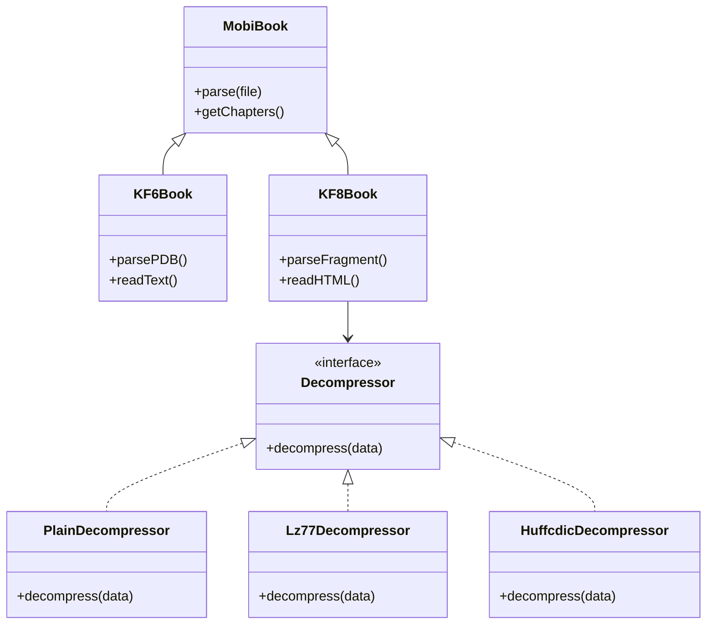
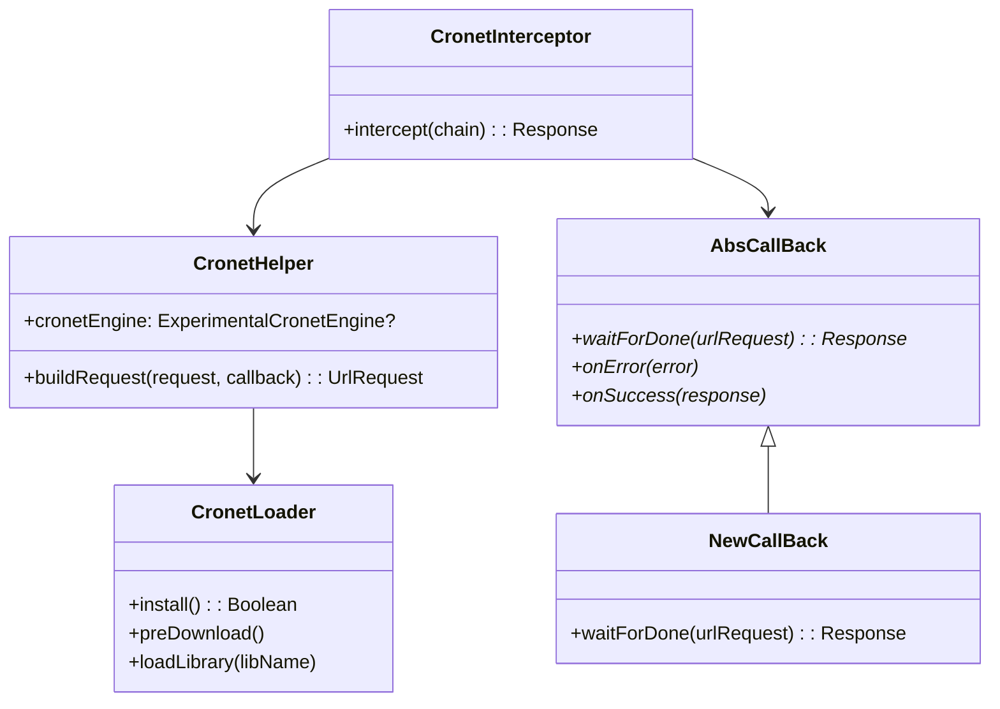

# 自定义库层

> **核心问题**：`lib/` 目录下有哪些自研库？各自是什么功能、如何实现？
> **答案**：6 个自研库——MOBI 解析引擎（5个核心解析文件 + entities/decompress/utils 等辅助，共33个Kotlin文件，KF6/KF8 双格式）、WebDAV 客户端（HTTP协议封装）、主题引擎（Material Design 动态着色）、阿里云TTS、Preference 工具、权限管理。

---

## 目录结构

```
lib/
├── mobi/           ← MOBI 电子书解析引擎（纯 Kotlin 自研，5核心文件 + 25实体 + 4解压 + 工具类等共33文件）
│   ├── PDBFile.kt       — PDB 二进制容器
│   ├── MobiReader.kt    — 格式识别与头部解析入口
│   ├── MobiBook.kt      — 抽象基类（解压/NCX/封面）
│   ├── KF6Book.kt       — KF6/MOBI6 格式处理
│   ├── KF8Book.kt       — KF8/AZW3 格式处理
│   ├── entities/   ← 25 个数据类（MobiHeader/NCX/TOC/KF8Section...）
│   ├── decompress/ ← 4 种解压算法（Plain/Lz77/Huffcdic+CDIC）
│   └── utils/      ← ByteBuffer 扩展 + 位运算工具
├── webdav/         ← WebDAV 客户端（HTTP PROPFIND/GET/PUT/DELETE）
├── theme/          ← Material Design 动态主题引擎
├── aliyun/         ← 阿里云 TTS Token 管理
├── prefs/          ← SharedPreferences 封装
└── permission/     ← 动态权限申请 Activity
```

---

## 1. lib/mobi/ — MOBI 电子书解析引擎

> **5 个核心 Kotlin 解析文件 + 25 个实体类 + 4 种解压算法 + 工具类，共 33 个文件，零第三方依赖，从二进制字节流解析 Amazon Kindle 格式。**

[PDBFile.kt](file:///f:/myself/github/WeAgentChat/temp/legado/app/src/main/java/io/legado/app/lib/mobi/PDBFile.kt)
[MobiReader.kt](file:///f:/myself/github/WeAgentChat/temp/legado/app/src/main/java/io/legado/app/lib/mobi/MobiReader.kt)
[MobiBook.kt](file:///f:/myself/github/WeAgentChat/temp/legado/app/src/main/java/io/legado/app/lib/mobi/MobiBook.kt)
[KF6Book.kt](file:///f:/myself/github/WeAgentChat/temp/legado/app/src/main/java/io/legado/app/lib/mobi/KF6Book.kt)
[KF8Book.kt](file:///f:/myself/github/WeAgentChat/temp/legado/app/src/main/java/io/legado/app/lib/mobi/KF8Book.kt)

### 1.1 架构层次



```
ParcelFileDescriptor (Android 文件句柄)
    │
    ▼
PDBFile (PDB 格式容器: 读取 Section 0~N 原始字节)
    │
    ▼
MobiReader (入口: 解析 Header + 分派 KF6/KF8)
    │
    ├─► KF6Book extends MobiBook
    │   ├── sections: List<KF6Section>
    │   └── 解析 MOBI6 HTML 内容
    │
    └─► KF8Book extends MobiBook
        ├── sections: List<KF8Section>
        ├── sectionIdMap: LinkedHashMap<Int, ArrayList<TOC>>  (目录→章节映射)
        ├── skelTable: List<Skeleton>
        ├── fragTable: List<Fragment>
        └── 解析 KF8 HTML+CSS 内容
```

### 1.2 PDBFile — PDB 二进制容器

[PDBFile.kt:L1-L48](file:///f:/myself/github/WeAgentChat/temp/legado/app/src/main/java/io/legado/app/lib/mobi/PDBFile.kt)

```kotlin
class PDBFile(pfd: ParcelFileDescriptor) {
    val recordCount: Int      // Section 数量
    val recordOffsets: IntArray  // 每个 Section 的文件偏移量
    fun getRecordData(index: Int): ByteBuffer  // 读取 Section 数据
}
```

PDB 文件格式 = 头信息 + N 个 Record（每个 4096 字节对齐）。

### 1.3 MobiReader — 格式识别 + 分派

[MobiReader.kt:L16-L50](file:///f:/myself/github/WeAgentChat/temp/legado/app/src/main/java/io/legado/app/lib/mobi/MobiReader.kt)

```kotlin
class MobiReader {
    fun readMobi(pfd: ParcelFileDescriptor): MobiBook {
        val pdbFile = PDBFile(pfd)
        // 1. 读取 Record0 → PalmDoc Header + MOBI Header + EXTH
        var mobiEntryHeaders = readMobiEntryHeaders(record0)
        
        // 2. 判断是否 KF8
        var isKF8 = mobi.version >= 8
        
        // 3. 若非KF8，检查 EXTH boundary 字段（旧MOBI内嵌KF8）
        if (!isKF8) {
            val boundary = exth["boundary"] as? Int
            // 在 boundary 偏移量重新读取 KF8 headers
        }
        
        // 4. 分派
        return if (isKF8) KF8Book(...) else KF6Book(...)
    }
}
```

### 1.4 头部解析层级

MobiReader 实现了完整的二进制解析管线：

```
Record0 ByteBuffer
    │
    ├── readPalmDocHeader (16 bytes)
    │   ├── compression: 1=Plain | 2=Lz77 | 17480=Huffcdic
    │   ├── numTextRecords
    │   └── encryption
    │
    ├── readMobiHeader (可变长)
    │   ├── identifier: "MOBI"
    │   ├── encoding: 65001=UTF8 | 1252=Windows-1252
    │   ├── version: ≥8 = KF8
    │   ├── title (offset+length → 指定编码解码)
    │   ├── language (locale_region + locale_language → mobiLangMap 语言映射)
    │   └── exthFlag bit 0b100_0000 → 是否包含 EXTH
    │
    ├── readExth (扩展元数据, 可选)
    │   ├── magic: "EXTH"
    │   ├── 23种记录类型 (creator/publisher/description/isbn/subject/asin...)
    │   └── many 标记 → 多值字段用 List<String>
    │
    └── readKF8Header (KF8专用, version≥8)
        ├── fdst → 资源表偏移
        ├── frag → 片段表偏移
        ├── skel → 骨架表偏移
        └── guide → 引导表偏移
```

**完整实体类清单**（25个）：

| 实体 | 作用 |
|------|------|
| `PalmDocHeader` | PalmDoc 压缩头 |
| `MobiHeader` | MOBI 文件头 |
| `MobiEntryHeaders` | 组合头部容器 |
| `ExthRecordType` | EXTH 字段类型定义 |
| `KF8Header` | KF8 特有头部 |
| `FdstHeader` | 资源表 |
| `Skeleton` | KF8 骨架 |
| `Fragment` | KF8 片段 |
| `KF8Section` | KF8 章节 |
| `KF6Section` | KF6 章节 |
| `KF8Pos` | KF8 位置标识 |
| `KF8Resource` | KF8 资源引用 |
| `NCX` | 导航控制XML |
| `TOC` | 目录条目（树形） |
| `MobiMetadata` | 元数据聚合 |
| `IndexData` / `IndexEntry` / `IndexTag` / `IndxHeader` | 索引数据 |
| `TagxHeader` / `TagxTag` | 标签信息 |
| `Ptagx` | 页面标签 |

### 1.5 解压引擎（decompress/）

三种压缩算法，策略模式：

```kotlin
interface Decompressor {
    fun decompress(data: ByteArray): ByteArray
}
```

| 实现 | compression值 | 算法描述 |
|------|:---:|------|
| `PlainDecompressor` | 1 | 无压缩，直接返回 |
| `Lz77Decompressor` | 2 | LZ77 滑动窗口解压（窗口大小=max(4096, recordSize)） |
| `HuffcdicDecompressor` | 17480 | Huffman+CDIC 字典压缩（最复杂的压缩格式） |

[MobiBook.kt:L50-L55](file:///f:/myself/github/WeAgentChat/temp/legado/app/src/main/java/io/legado/app/lib/mobi/MobiBook.kt#L50-L55)

```kotlin
private val decompressor: Decompressor = when (val compression = palmdoc.compression) {
    1    -> PlainDecompressor()
    2    -> Lz77Decompressor(max(4096, palmdoc.recordSize))
    17480 -> HuffcdicDecompressor(this, mobi)
    else -> error("unknown compression")
}
```

### 1.6 KF8Book — KF8 章节处理

[KF8Book.kt:L1-L272](file:///f:/myself/github/WeAgentChat/temp/legado/app/src/main/java/io/legado/app/lib/mobi/KF8Book.kt)

KF8 格式使用 Fragment（片段）概念组织内容：

```
初始化流程:
readFdstTable() → 读取资源偏移表
readSkelTable() → 读取骨架表（章节结构）
readFragTable()  → 读取片段表（内容片段）
processSections() → 合并骨架+片段 → sections[]
processNCX()      → 解析目录树
processSectionsMap() → 建立 section_id → TOC 映射
```

**URI 解析**（KF8 内部引用）：
- 位置引用 `kindle:pos:fid:XXXX:off:YYYY` → KF8Pos(fid, off)
- 资源引用 `kindle:embed:XXXX?type=YYYY` → KF8Resource(type, id)
- 通过 `getSectionByHref()` / `getResourceByHref()` 解析

### 1.7 KF6Book — KF6/MOBI6 章节处理

[KF6Book.kt:L1-L140](file:///f:/myself/github/WeAgentChat/temp/legado/app/src/main/java/io/legado/app/lib/mobi/KF6Book.kt)

KF6 较简单，主要处理：
- 遍历所有 text records → 合并为完整 HTML
- NCX 解析 → 目录
- 按 `mbp:pagebreak` 分页

### 1.8 mobiLangMap 语言映射

[MobiReader.kt:L189-L229](file:///f:/myself/github/WeAgentChat/temp/legado/app/src/main/java/io/legado/app/lib/mobi/MobiReader.kt#L189-L229)

MOBI 语言编码 → ISO 语言代码的静态映射表（`Map<Byte, Map<Byte, String>>`，key 为 locale_language，value 为 locale_region→locale 字符串），覆盖广泛的语言编码（含 zh/zh-TW/zh-CN/zh-HK/zh-SG 等中文变体）。

### 1.9 调用入口（LocalBook → MobiReader）

```
LocalBook.kt
  ├── 根据文件扩展名 .mobi/.azw/.azw3 分发
  └── MobiFile.kt
      └── MobiReader().readMobi(pfd)
          └── KF6Book / KF8Book
              ├── sections → 章节内容
              ├── toc → 目录
              └── metadata → 书籍信息
```

---

## 2. lib/webdav/ — WebDAV 客户端

> **直接基于 OkHttp + Jsoup XML 解析，实现 WebDAV 协议（RFC 4918）的核心方法。**

[WebDav.kt:L1-L456](file:///f:/myself/github/WeAgentChat/temp/legado/app/src/main/java/io/legado/app/lib/webdav/WebDav.kt)

### 2.1 架构

```kotlin
open class WebDav(
    val path: String,              // dav:// 或 davs:// URL
    val authorization: Authorization  // Basic/Digest 认证
) {
    // 内部 OkHttpClient（添加认证拦截器）
    private val webDavClient: OkHttpClient
}
```

### 2.2 支持的协议方法

| 方法 | HTTP 请求 | 用途 |
|------|----------|------|
| `listDirectory()` | PROPFIND | 列出目录内容 → `List<WebDavFile>` |
| `getWebDavFile()` | PROPFIND Depth=0 | 获取自身文件/目录属性信息 → `WebDavFile?` |
| `exists()` | PROPFIND Depth=0 | 检查文件/目录是否存在 |
| `check()` | PROPFIND | 验证认证有效性（response.code != 401 即通过） |
| `get()` | GET | 下载文件 |
| `getInputStream()` | GET | 获取流（大文件流式下载） |
| `put()` | PUT | 上传文件 |
| `delete()` | DELETE | 删除文件/目录 |
| `mkDir()` | MKCOL | 创建目录 |
| `copy()` | COPY | 复制文件 |
| `move()` | MOVE | 移动/重命名文件 |
| `getQuota()` | PROPFIND | 获取存储配额 |

### 2.3 PROPFIND 解析

通过 Jsoup 解析多状态 XML 响应：

```xml
<!-- PROPFIND 请求体 -->
<propfind xmlns="DAV:">
    <prop>
        <displayname/>        <!-- 显示名 -->
        <resourcetype/>       <!-- 资源类型: 目录/文件 -->
        <getcontentlength/>   <!-- 文件大小 -->
        <creationdate/>       <!-- 创建时间 -->
        <getlastmodified/>    <!-- 修改时间 -->
    </prop>
</propfind>
```

[WebDav.kt:L58-L69](file:///f:/myself/github/WeAgentChat/temp/legado/app/src/main/java/io/legado/app/lib/webdav/WebDav.kt#L58-L69)

### 2.4 URL 转换

```
dav://example.com/books
  → http://example.com/books  (明文)

davs://example.com/books
  → https://example.com/books  (TLS加密)
```

[WebDav.kt:L85-L92](file:///f:/myself/github/WeAgentChat/temp/legado/app/src/main/java/io/legado/app/lib/webdav/WebDav.kt#L85-L92)

### 2.5 认证方式

```kotlin
class Authorization(serverID: String) {
    val name: String   // "Authorization"
    val data: String   // "Basic base64(user:pass)" 或 "Digest ..."
}
```

认证信息存储在 AppConfig 中（通过 `AnalyzeUrl.serverID` 定位）。

### 2.6 使用场景

```
备份恢复系统
├── Backup.kt → 导出到本地 JSON
├── Restore.kt → 从本地 JSON 恢复
└── WebDavService (AppWebDav.kt)
    ├── WebDav.put() → 备份上传
    └── WebDav.get() → 备份下载

远程书籍
└── RemoteBookWebDav.kt
    └── WebDav.listDirectory() → 浏览 WebDAV 目录
```

---

## 3. lib/theme/ — Material Design 动态主题引擎

> **Forked from afollestad/aesthetic (AIDE)，纯 Kotlin 重写，支持链式 API + SharedPreferences 持久化。**

[ThemeStore.kt:L1-L352](file:///f:/myself/github/WeAgentChat/temp/legado/app/src/main/java/io/legado/app/lib/theme/ThemeStore.kt)
[TintHelper.kt:L1-L487](file:///f:/myself/github/WeAgentChat/temp/legado/app/src/main/java/io/legado/app/lib/theme/TintHelper.kt)

### 3.1 组件清单

| 文件 | 职责 |
|------|------|
| `ThemeStore.kt` (20KB/352行) | 主题颜色持久化存储（17个颜色属性） |
| `ThemeStoreInterface.kt` | ThemeStore 接口定义 |
| `ThemeStorePrefKeys.kt` | SharedPreferences Key 常量 |
| `TintHelper.kt` (17KB/487行) | 视图着色引擎（Button/EditText/SeekBar/Switch/FAB/SearchView...） |
| `ThemeUtils.kt` | 颜色解析工具 |
| `ViewUtils.kt` | 视图背景/颜色过渡 |
| `Selector.kt` | 状态选择器（按下/选中/禁用颜色） |

### 3.2 ThemeStore — 链式 API 存储

[ThemeStore.kt:L20-L120](file:///f:/myself/github/WeAgentChat/temp/legado/app/src/main/java/io/legado/app/lib/theme/ThemeStore.kt#L20-L120)

支持 17 个颜色属性，每个属性有三种设置方式：

```kotlin
ThemeStore.editTheme(context)
    .primaryColor(0xFF1976D2)              // 直接颜色值
    .primaryColorRes(R.color.primary)       // 颜色资源引用
    .primaryColorAttr(R.attr.colorPrimary)  // 属性引用
    .accentColor(0xFFFF4081)
    .statusBarColor(Color.BLACK)
    .navigationBarColor(Color.BLACK)
    .textColorPrimary(0xFFFFFFFF)
    .textColorSecondary(0xFFBDBDBD)
    .backgroundColor(0xFF303030)
    .apply()  // 通过 EventBus + SpannedGridLayoutManager 通知全局
```

**17 个可配颜色属性**：

| 属性 | Key | 说明 |
|------|-----|------|
| `primaryColor` | 主题色 | AppBar/Tab 等主色调 |
| `primaryColorDark` | 深色主题色 | 状态栏默认颜色 |
| `accentColor` | 强调色 | FAB/开关/滑块等交互元素 |
| `statusBarColor` | 状态栏颜色 | Android 5+ |
| `navigationBarColor` | 导航栏颜色 | Android 5+ |
| `textColorPrimary` | 主文字色 | 标题等 |
| `textColorPrimaryInverse` | 反色主文字 | 深色背景上的浅色文字 |
| `textColorSecondary` | 次文字色 | 副标题等 |
| `backgroundColor` | 背景色 | 页面背景 |
| `cardViewBackgroundColor` | 卡片背景色 | CardView |
| `iconColorActive` | 活动图标色 | 底部导航选中图标 |
| `iconColorInactive` | 非活动图标色 | 底部导航未选中图标 |
| `dividerColor` | 分割线色 | RecyclerView 分割线 |
| `titleTextColor` | 标题文字色 | Toolbar 标题 |
| `collapsedTitleTextColor` | 折叠标题色 | CollapsingToolbar |
| `subTitleTextColor` | 副标题色 | Toolbar 副标题 |
| `fabColor` | FAB 颜色 | 浮动操作按钮 |

### 3.3 ThemeStore — 单键模式

[ThemeStore.kt:L292-L352](file:///f:/myself/github/WeAgentChat/temp/legado/app/src/main/java/io/legado/app/lib/theme/ThemeStore.kt#L292-L352)

额外支持 `primaryColorKey()` / `accentColorKey()` 单键设色：

```kotlin
// 一键切换预设主题
ThemeStore.primaryColorKey(context, Cyan)
// 预定义: Red/Pink/Purple/DeepPurple/Indigo/Blue/LightBlue/
//         Cyan/Teal/Green/LightGreen/Lime/Yellow/Amber/Orange/DeepOrange/Brown
```

### 3.4 TintHelper — 视图着色引擎

[TintHelper.kt:L1-L120](file:///f:/myself/github/WeAgentChat/temp/legado/app/src/main/java/io/legado/app/lib/theme/TintHelper.kt#L1-L120)

根据 view 类型分发不同的着色逻辑：

```kotlin
object TintHelper {
    fun setTintSelector(view: View, @ColorInt color: Int, darker: Boolean, useDarkTheme: Boolean) {
        when (view) {
            is Button       → { /* 背景色 + Ripple + 文字色 */ }
            is FloatingActionButton → { /* RippleColor + backgroundTintList + icon */ }
            is CheckBox     → { /* buttonTintList + hintTextColor */ }
            is RadioButton  → { /* buttonTintList */ }
            is Switch / SwitchCompat → { /* thumbTintList + trackTintList */ }
            is SeekBar      → { /* thumb + progressTintList */ }
            is ProgressBar  → { /* indeterminateTintList + progressTintList */ }
            is EditText / AppCompatEditText → { /* backgroundTintList + textColorHint */ }
            is SearchView   → { /* query text color + hint color */ }
            is ImageView    → { /* setColorFilter */ }
            is TextView     → { /* setTextColor */ }
            is CheckedTextView → { /* checkMarkTintList */ }
        }
    }
}
```

**颜色状态列表生成**：

```kotlin
// 生成 normal/disabled 双状态 ColorStateList
getDisabledColorStateList(normal, disabled)

// 生成 normal/pressed/activated/checked/disabled 五状态 ColorStateList
ColorStateList(
    states = [-enabled, +enabled, +enabled+pressed, +enabled+activated, +enabled+checked],
    colors = [disabled, normal, pressed, activated, checked]
)
```

**暗色/亮色自适应**：
- 根据 `isColorLight(color)` 判断
- 亮色主题 → 使用深色 Ripple + 深色按钮文字
- 暗色主题 → 使用浅色 Ripple + 浅色按钮文字

### 3.5 Selector — 状态选择器

生成适配主题色的 Drawable 状态选择器，例如按钮点击效果：

```kotlin
Selector.getRippleDrawable(
    normalColor,       // 正常状态色
    rippleColor,       // Ripple 波纹色
    isLight, darker    // 亮暗判定 + 变深/变浅方向
)
```

### 3.6 主题变更通知流

```
ThemeStore.editTheme(...).apply()
  → SharedPreferences.Editor.commit()
  → EventBus.post(ThemeChangedEvent)
      ├── 所有 BaseActivity.recreate()
      ├── Widget 重新着色
      └── StatusBar/NavigationBar 重新着色
```

---

## 4. lib/aliyun/ — 阿里云 TTS Token 管理

[ALiYun.kt:L1-L9](file:///f:/myself/github/WeAgentChat/temp/legado/app/src/main/java/io/legado/app/lib/aliyun/ALiYun.kt)

```kotlin
object ALiYun {
    fun getToken() {
        // 获取阿里云智能语音交互 Token
        // 用于 HttpReadAloudService 的阿里云 TTS 引擎
    }
}
```

轻量级工具，为 [HttpReadAloudService](file:///f:/myself/github/WeAgentChat/temp/legado/app/src/main/java/io/legado/app/service/HttpReadAloudService.kt) 提供 Token 认证。

---

## 5. lib/cronet/ — Chromium Cronet 网络引擎封装

> **8个Kotlin文件，封装 Chromium Cronet 网络引擎，提供 OkHttp 兼容的拦截器，支持 QUIC/HTTP2/Brotli，动态下载 .so 库，证书信任绕过。**

### 5.1 文件清单

| 文件 | 职责 |
|------|------|
| `CronetHelper.kt` | Cronet 引擎初始化 + OkHttp Request→Cronet UrlRequest 转换 + 域名映射 + 证书验证禁用 |
| `CronetInterceptor.kt` | OkHttp Interceptor 实现，优先 Cronet 失败回退 OkHttp |
| `CronetLoader.kt` | Cronet .so 原生库的下载/MD5校验/动态加载（object单例） |
| `AbsCallBack.kt` | Cronet UrlRequest.Callback 抽象基类，桥接异步→同步 Response |
| `CallbackResult.kt` | 回调步骤值容器（data class） |
| `NewCallBack.kt` | API≥N 的 AbsCallBack 实现（基于 CompletableFuture） |

### 5.2 架构



### 5.3 核心流程

```
OkHttp Chain
  → CronetInterceptor.intercept()
    → CronetLoader.install() 检查 .so 是否就绪
      → 未就绪 → 降级 chain.proceed() (OkHttp 原生)
    → cronetEngine 非空 → buildRequest() 转换请求
      → customHost() 域名→IP映射 (AppConfig.hostMap + AnalyzeUrl.customIp)
      → BodyUploadProvider / LargeBodyUploadProvider (>32KB)
    → API≥N: NewCallBack(CompletableFuture) / API<N: OldCallback
    → Cronet 请求成功 → 返回 OkHttp Response
    → Cronet 失败 → 降级 chain.proceed() (仅 ERR_CERT_*/ERR_SSL_* 静默)
```

### 5.4 CronetLoader — 动态 .so 加载

[CronetLoader.kt](file:///f:/myself/github/WeAgentChat/temp/legado/app/src/main/java/io/legado/app/lib/cronet/CronetLoader.kt)

```
.so URL: https://storage.googleapis.com/chromium-cronet/android/{version}/Release/cronet/libs/{abi}/libcronet.{version}.so
MD5: assets/cronet.json 按 CPU ABI 读取
加载策略: System.loadLibrary → 失败 → 删历史文件 → 校验本地MD5 → 匹配则 System.load(path) → 不匹配则重新下载
CPU ABI: 反射 ApplicationInfo.primaryCpuAbi, 失败回退 Build.SUPPORTED_ABIS[0]
```

### 5.5 证书信任绕过

`disableCertificateVerify()`: 通过反射替换 `X509Util.sDefaultTrustManager/sTestTrustManager` 为 `SSLHelper.unsafeTrustManagerExtensions`，实现全站证书信任。

### 5.6 与其他模块的依赖

```
CronetInterceptor
├── 被注入到: OkHttp 客户端构建链 (model/webBook/WebBook 等)
├── 依赖: AppConfig.hostMap (自定义域名映射)
├── 依赖: AnalyzeUrl.customIp (URL 级域名映射)
└── 依赖: SSLHelper (证书信任)
```

---

## 6. lib/permission/ — 运行时权限管理

> **3个核心文件 + 7个辅助文件，串行化权限请求队列，支持6种请求类型，Activity Result API。**

### 6.1 文件清单

| 文件 | 职责 |
|------|------|
| `RequestManager.kt` | 权限请求队列管理器（internal object），Stack<Request> 串行化 |
| `Permissions.kt` | 权限常量定义 + 分组（object） |
| `PermissionActivity.kt` | 透明 Activity，处理6种权限请求 UI |

### 6.2 RequestManager — 串行化队列

```kotlin
object RequestManager : OnPermissionsResultCallback {
    val stack = Stack<Request>()
    fun pushRequest(request?)  // 入栈，当前请求>5秒视为失效则立即启动
    // 回调: onPermissionsGranted/onPermissionsDenied/onError → startNextRequest()
}
```

### 6.3 6种请求类型

| 类型 | 说明 |
|------|------|
| TYPE_PERMISSION | 普通 Android 权限请求 |
| TYPE_SETTINGS | 跳转系统设置页 |
| TYPE_ALL_FILES | Android 11+ 所有文件管理权限 |
| TYPE_NOTIFICATION | Android 13+ 通知权限 |
| TYPE_BATTERY_OPTIMIZATION | 电池优化白名单 |
| TYPE_SYSTEM_ALERT_WINDOW | 悬浮窗权限 |

### 6.4 Permissions — 权限常量

```kotlin
object Permissions {
    const val POST_NOTIFICATIONS = "android.permission.POST_NOTIFICATIONS"
    // ... 其他权限常量

    object Group {
        val STORAGE    // API≥R: MANAGE_EXTERNAL_STORAGE; 否则: READ+WRITE_EXTERNAL_STORAGE
        val CAMERA     // CAMERA
        val LOCATION   // ACCESS_FINE + ACCESS_COARSE
        // ... 其他分组
    }
}
```

### 6.5 PermissionActivity — 透明 Activity

- 拒绝计数持久化到 `SharedPreferences("permission_deny_count")`
- 拒绝>5次自动跳过
- 通知权限: API≥TIRAMISU直接请求; API≥O跳转通知频道; 低版本跳转应用设置
- 电池优化: 直接打开 `RequestIgnoreBatteryOptimizations`
- 进出动画均为0（透明过渡）

---

## 7. lib/dialogs/ — 对话框 DSL 封装

> **3个文件，提供 Kotlin DSL 风格的对话框 API，支持墨水屏模式适配。**

### 7.1 文件清单

| 文件 | 职责 |
|------|------|
| `AlertBuilder.kt` | 对话框构建器接口，DSL 风格 API（泛型返回类型） |
| `AndroidAlertBuilder.kt` | Android 原生实现（委托 AlertDialog.Builder） |
| `AndroidDialogs.kt` | Context/Fragment 扩展函数（alert/progressDialog） |

### 7.2 AlertBuilder 接口

```kotlin
interface AlertBuilder<D> {
    fun setTitle(title: CharSequence)
    fun positiveButton(text: String, onClicked: ((DialogInterface) -> Unit)? = null)
    fun negativeButton(text: String, onClicked: ((DialogInterface) -> Unit)? = null)
    fun items(items: List<CharSequence>, onItemSelected: (Int) -> Unit)
    fun singleChoiceItems(items: List<CharSequence>, checkedItem: Int, onClick: ((Int) -> Unit)?)
    fun multiChoiceItems(items: List<CharSequence>, checkedItems: BooleanArray, onClick: ((Int, Boolean) -> Unit))
    fun build(): D
    fun show(): D
    // 便捷: okButton/cancelButton/yesButton/noButton
}
```

### 7.3 墨水屏适配

`AndroidAlertBuilder.show()`:
- `AppConfig.isEInkMode` 时: 禁用暗化(dimAmount=0f)、禁用窗口动画、使用 `bg_eink_border_dialog` 背景
- 正常模式: 调用 `applyTint()` 为对话框着色

### 7.4 顶层扩展函数

```kotlin
// Context 扩展
context.alert(title?, message?, init?)  // 显示 AlertDialog
context.progressDialog(title?, message?)  // 水平进度对话框
context.indeterminateProgressDialog(title?, message?)  // 不确定进度

// Fragment 扩展 (委托给 Activity)
fragment.alert(...)
fragment.progressDialog(...)
```

---

## 8. lib/prefs/ — 偏好设置控件与偏好存储

> **12个文件，自定义 Preference 控件体系，支持颜色选择/滑块/长按/底部栏着色。底层 SharedPreferences 读写封装（splitties appCtx + 类型安全委托 prefs(context)）供 ThemeStore / AppConfig 等配置系统使用。**

### 8.1 文件清单

| 文件 | 职责 |
|------|------|
| `Preference.kt` | 自定义 Preference 基类，支持长按回调 + 底部栏着色 |
| `PreferenceFragment.kt` | 自定义 PreferenceFragmentCompat，替换默认对话框 |
| `ColorPreference.kt` | 颜色选择偏好控件（ColorPickerDialog） |
| `SeekBarPreference.kt` | 滑块偏好控件（带+/-按钮，min/max范围） |
| `EditTextPreferenceDialog.kt` | 自定义 EditText 对话框 |
| `ListPreferenceDialog.kt` | 自定义 List 选择对话框 |
| `MultiSelectListPreferenceDialog.kt` | 自定义多选对话框 |
| `ColorPickerDialog*.kt` | 颜色选择器对话框（预设色/自定义/Alpha/色相深浅） |

### 8.2 Preference 基类

```kotlin
open class Preference(context, attrs) : androidx.preference.Preference(context, attrs) {
    var isBottomBackground: Boolean  // XML属性，启用时根据背景明暗自动调整文字色
    fun onLongClick(listener)        // 长按监听

    companion object {
        fun bindView(...)  // 统一渲染 title/summary/icon/widget, icon着色为accentColor
    }
}
```

### 8.3 ColorPreference — 颜色选择

```kotlin
class ColorPreference : Preference, ColorPickerDialogListener {
    var onSaveColor: ((color: Int) -> Boolean)?  // 颜色保存拦截
    var presets: IntArray?                        // 预设色板

    // XML属性: cpv_showDialog / cpv_dialogType / cpv_colorShape / cpv_allowPresets
    //          cpv_allowCustom / cpv_showAlphaSlider / cpv_showColorShades
    //          cpv_previewSize / cpv_colorPresets
}
```

选择器功能：预设色网格 + 自定义色 HSV + Alpha 滑块 + 色相深浅条

### 8.4 SeekBarPreference — 滑块

```kotlin
class SeekBarPreference : Preference {
    var value: Int  // 当前值, setter自动coerceIn + persistInt + 更新UI
    // XML属性: NumberPickerPreference_MinValue (默认0) / MaxValue (默认1000)
    // +/- 按钮: seekPlus/seekReduce → progressAdd(±1)
    // onStopTrackingTouch: callChangeListener验证后赋值
}
```

### 8.5 PreferenceFragment — 对话框替换

```kotlin
abstract class PreferenceFragment : PreferenceFragmentCompat() {
    override fun onDisplayPreferenceDialog(preference) {
        // 拦截对话框显示，路由到自定义实现:
        // EditTextPreference → EditTextPreferenceDialog
        // ListPreference → ListPreferenceDialog
        // MultiSelectListPreference → MultiSelectListPreferenceDialog
    }
}
```

---

## 9. 各库完整依赖关系

```
App 启动初始化
│
├── lib/permission/ → 动态权限申请 (所有需要权限的模块)
│   ├── lib/cronet/ → WRITE_EXTERNAL_STORAGE (下载.so)
│   └── 文件导入/导出 → READ/WRITE_EXTERNAL_STORAGE
│
├── lib/cronet/CronetInterceptor
│   ├── 被注入到 OkHttp 客户端链
│   ├── 依赖 AppConfig.hostMap (自定义域名映射)
│   └── 依赖 SSLHelper (证书信任)
│
├── lib/dialogs/
│   ├── 所有 AlertDialog/alert() 调用点
│   └── 墨水屏模式适配
│
├── lib/prefs/
│   ├── ConfigActivity → 各 ConfigFragment
│   ├── ThemeConfigFragment → ColorPreference
│   └── ReadBookConfig → SeekBarPreference
│
├── lib/theme/ThemeStore
│   ├── 初始化时读取 SharedPreferences
│   ├── 应用到所有 Activity/Widget
│   └── TintHelper → 视图着色
│
├── lib/webdav/WebDav
│   ├── Backup/Restore → 备份上传/下载
│   └── RemoteBookWebDav → 远程书籍浏览
│
├── lib/mobi/MobiReader
│   └── model/localBook/MobiFile → LocalBook 导入入口
│
└── lib/prefs/ → ThemeStore / AppConfig 底层存储
```