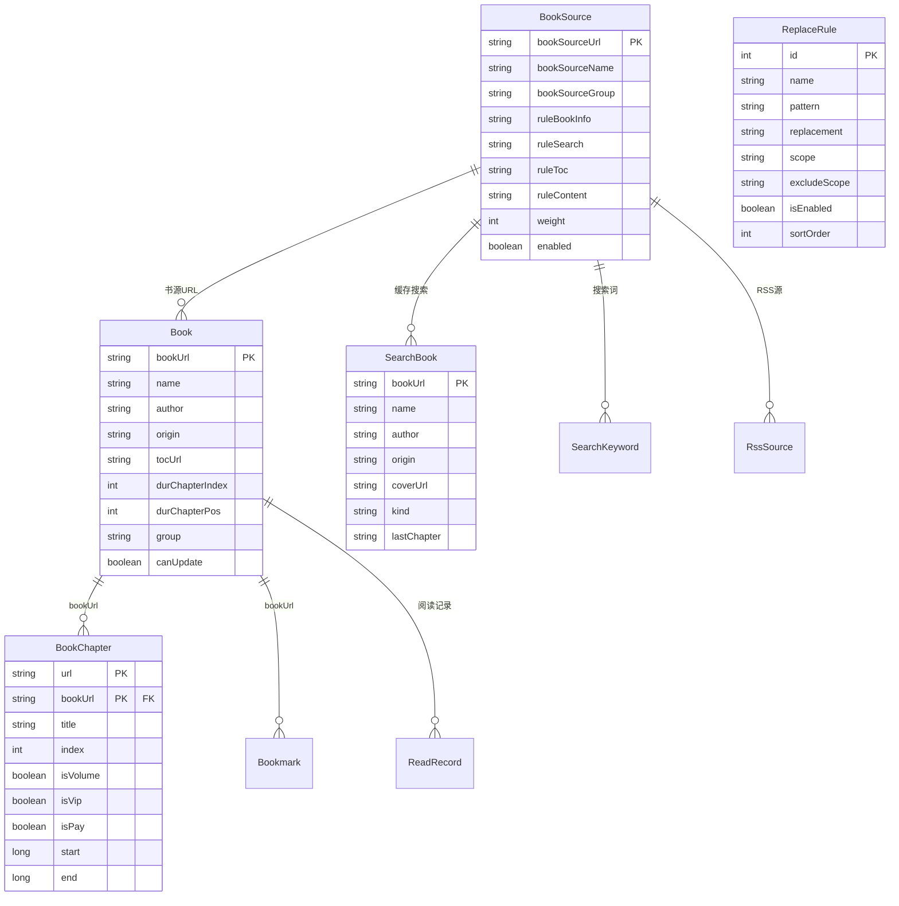
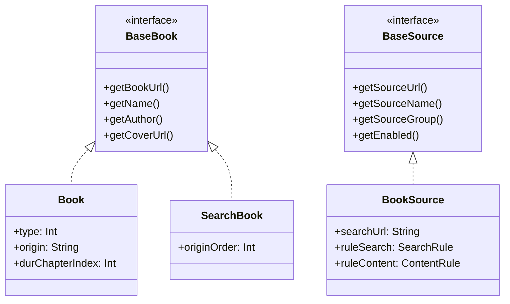

# 数据层模块

> Room 数据库层——21 个实体、1 个视图、21 个 DAO、版本 108 迁移链（以 AppDatabase.kt version 字段为准）、位标志类型系统、TypeConverter 序列化。

---

## 核心实体关系图 (ER)



---

## 1. AppDatabase 定义

[AppDatabase.kt:69-149](file:///f:/myself/github/WeAgentChat/temp/legado/app/src/main/java/io/legado/app/data/AppDatabase.kt#L69-L149)

```kotlin
@Database(
    entities = [Book, BookGroup, BookSource, BookChapter,
        ReplaceRule, SearchBook, SearchKeyword, Cookie,
        RssSource, Bookmark, RssArticle, RssReadRecord,
        RssStar, TxtTocRule, ReadRecord, HttpTTS, Cache,
        RuleSub, DictRule, KeyboardAssist, Server],
    views = [BookSourcePart],
    version = 108,
    autoMigrations = [v43→v44, v44→v45, ..., v88→v89]  // 共46步AutoMigration（v89起改用手动 Migration）
)
abstract class AppDatabase : RoomDatabase() {
    abstract val bookDao: BookDao             // 21 个 DAO
    abstract val bookGroupDao: BookGroupDao
    abstract val bookSourceDao: BookSourceDao
    // ... 共 21 个 DAO 声明
}

// 全局单例
val appDb: AppDatabase by lazy {
    Room.databaseBuilder(appCtx, AppDatabase::class.java, "legado.db")
        .addMigrations(*migrations)   // 手动迁移
        .addCallback(AppDatabase.dbCallback)  // onCreate回调→预置数据
        .build()
}
```

---

## 2. 实体关系总览

```
核心实体关系:
  books (1) ──┬── (N) chapters          ← bookUrl FK CASCADE
              ├── (N) bookmarks          ← 逻辑关联 (bookName+bookAuthor)
              └── (N) searchBooks        ← 逻辑关联

  book_sources (1) ── (N) searchBooks    ← origin FK CASCADE

  rssSources (1) ── (N) rssArticles      ← 逻辑关联 (origin)

  replace_rules — 独立表，通过 scope 字段匹配

辅助实体:
  book_groups      — 书籍分组
  search_keywords  — 搜索历史
  readRecord       — 阅读时间记录
  cookies          — Cookie 存储
  txtTocRules      — TXT 目录规则
  dictRules        — 字典规则
  ruleSubs         — 规则订阅
  caches           — 缓存键值对
  keyboardAssists  — 键盘辅助
  servers          — 远程服务器配置
  httpTTS          — HTTP TTS 引擎
```

### 2.1 核心接口

**BaseBook 接口** — Book/SearchBook 实现:



```
bookUrl: String      — 唯一标识
name: String         — 书名
author: String       — 作者
kind: String?        — 分类
wordCount: String?   — 字数（字符串形式）
variable: String?    — 自定义变量 JSON
infoHtml: String?    — 信息页HTML（运行时）
tocHtml: String?     — 目录页HTML（运行时）
```

**BaseSource 接口** — BookSource/RssSource/HttpTTS 实现:
```
jsLib: String?              — JS 库代码
enabledCookieJar: Boolean?  — 启用 CookieJar
concurrentRate: String?     — 并发率 JSON
header: String?             — 自定义请求头 JSON
loginUrl: String?           — 登录地址/JS
loginUi: String?            — 登录UI配置
```

---

## 3. BookType 位标志系统

书籍类型使用**二进制位标志**，每本书可同时拥有多个类型：

```kotlin
const val video       = 0b0000000100  // = 4   视频
const val text        = 0b0000001000  // = 8   文本
const val updateError = 0b0000010000  // = 16  更新失败
const val audio       = 0b0000100000  // = 32  音频
const val image       = 0b0001000000  // = 64  图片
const val webFile     = 0b0010000000  // = 128 仅下载(文件类)
const val local       = 0b0100000000  // = 256 本地书籍
const val archive     = 0b1000000000  // = 512 压缩包
const val notShelf    = 0b10000000000 // = 1024 未正式加入书架
```

**位运算查询示例：**
```sql
-- 查询所有文本类书籍
SELECT * FROM books WHERE (type & 8) > 0;
-- 查询所有音频或视频类书籍
SELECT * FROM books WHERE (type & (4 | 32)) > 0;
```

---

## 4. 核心表结构

### 4.1 books — 书籍表

[Book.kt:34-38](file:///f:/myself/github/WeAgentChat/temp/legado/app/src/main/java/io/legado/app/data/entities/Book.kt#L34-L38)

```
主键: bookUrl (String)
关键字段:
  - name: String              — 书名
  - author: String            — 作者
  - origin: String            — 书源URL
  - tocUrl: String            — 目录页URL
  - coverUrl: String?         — 封面URL
  - type: Int                 — BookType 位标志
  - group: Long               — 分组ID
  - durChapterIndex: Int      — 当前阅读章节索引
  - durChapterPos: Int        — 当前章节字符偏移
  - durChapterTitle: String   — 当前章节标题
  - totalChapterNum: Int      — 总章节数
  - wordCount: String?        — 字数
  - variable: String?         — 自定义变量 JSON
  - canUpdate: Boolean        — 是否可更新
```

### 4.2 book_sources — 书源表

[BookSource.kt:32-98](file:///f:/myself/github/WeAgentChat/temp/legado/app/src/main/java/io/legado/app/data/entities/BookSource.kt#L32-L98)

```
主键: bookSourceUrl (String) — 不可重复
核心规则字段:
  - ruleSearch: SearchRule?     — 搜索规则
  - ruleBookInfo: BookInfoRule? — 书籍详情规则
  - ruleToc: TicTocRule?        — 目录规则
  - ruleContent: ContentRule?   — 正文规则
  - ruleExplore: ExploreRule?   — 发现规则

配置字段:
  - searchUrl: String?          — 搜索URL模板
  - enabled: Boolean            — 是否启用
  - weight: Int                 — 权重(排序)
  - bookSourceGroup: String?    — 分组
  - header: String?             — 自定义请求头
  - loginUrl: String?           — 登录地址/JS
  - comment: String?            — 备注
```

### 4.3 chapters — 章节表

[BookChapter.kt:30-42](file:///f:/myself/github/WeAgentChat/temp/legado/app/src/main/java/io/legado/app/data/entities/BookChapter.kt#L30-L42)

```
复合主键: (url + bookUrl)
关键字段:
  - title: String            — 章节标题
  - index: Int               — 章节序号
  - isVolume: Boolean        — 是否卷标
  - isVip: Boolean           — 是否付费章节
  - isPay: Boolean           — 是否已购买
  - start: Long              — TXT本地书字节偏移起始
  - end: Long                — TXT本地书字节偏移结束
  - tag: String?             — EpubFragment 标识
  - wordCount: String?       — 字数
```

### 4.4 bookmarks — 书签表

```
主键: time (Long) — 书签时间戳
关键字段:
  - bookName: String         — 书名
  - bookAuthor: String       — 作者
  - chapterIndex: Int        — 章节索引
  - chapterPos: Int          — 章节内位置
  - chapterName: String      — 章节名
  - bookText: String         — 书签文本
  - content: String          — 书签内容/备注
索引: (bookName, bookAuthor)
```

### 4.5 replace_rules — 替换净化规则表

```
关键字段:
  - pattern: String          — 正则匹配模式
  - replacement: String      — 替换内容
  - scope: String?           — 适用范围(书名/书源URL)
  - excludeScope: String?    — 排除范围
  - scopeTitle: Boolean      — 是否标题规则
  - scopeContent: Boolean    — 是否正文规则
  - isEnabled: Boolean       — 是否启用
  - sortOrder: Int           — 排序权重
```

---

## 5. DAO 层设计模式

### 5.1 核心 DAO 示例

[BookDao.kt:18-19](file:///f:/myself/github/WeAgentChat/temp/legado/app/src/main/java/io/legado/app/data/dao/BookDao.kt#L18-L19)

```
@Dao
interface BookDao {
    @Query("SELECT * FROM books ORDER BY durChapterTime DESC")
    fun observeAll(): Flow<List<Book>>           // Flow 响应式

    @Insert(onConflict = OnConflictStrategy.REPLACE)
    fun insert(book: Book)                       // REPLACE 策略

    @Update
    fun update(book: Book)
}
```

**设计模式总结：**
- 响应式查询返回 `Flow<T>`，UI 层自动感知数据变化
- 核心实体使用 `OnConflictStrategy.REPLACE`
- 批量操作使用 `@Insert` / `@Update` 可变参数

---

## 6. 迁移策略

[AppDatabase.kt:78-125](file:///f:/myself/github/WeAgentChat/temp/legado/app/src/main/java/io/legado/app/data/AppDatabase.kt#L78-L125)

### 6.1 AutoMigration (v43 起)

```kotlin
// 绝大多数迁移使用 AutoMigration，只需声明 from/to:
autoMigrations = [
    AutoMigration(from = 43, to = 44),
    AutoMigration(from = 44, to = 45),
    // ... 共 46 个
    AutoMigration(from = 88, to = 89)
]
```

### 6.2 手动迁移 (5 处需要 AutoMigrationSpec)

```
需要 AutoMigrationSpec 的场景:
  1. 新增表需设置默认值（AutoMigration 不支持）
  2. 列重命名
  3. 复杂数据迁移
  4. 非标准 SQLite 类型转换

5 处 AutoMigrationSpec:
  1. Migration_54_55
  2. Migration_64_65
  3. Migration_80_81
  4. Migration_83_84
  5. Migration_84_85

手动迁移示例:
  DatabaseMigration 类中定义 Migration(from, to) { db -> ... }
  在 addMigrations() 中注册
```

### 6.3 Schema 输出

```
Room Schema 自动输出到: app/schemas/io.legado.app.data.AppDatabase/
版本 108 的 schema 文件: 108.json
新增迁移必须更新 schema 文件
```

---

## 7. TypeConverter — JSON 序列化

规则类字段（SearchRule/BookInfoRule/ContentRule 等）通过 JSON 存储：

```kotlin
// Room 自动调用 TypeConverter 序列化
// 注意：使用项目全局单例 GSON (io.legado.app.utils.GSON)，而非 Gson()
// GSON 是项目全局单例工具类，避免每次调用创建新 Gson 实例
@TypeConverter
fun searchRuleToJson(value: SearchRule?): String? {
    return GSON.toJson(value)
}

@TypeConverter
fun jsonToSearchRule(value: String?): SearchRule? {
    return GSON.fromJson(value, SearchRule::class.java)
}
```

**使用 TypeConverter 的字段：**
- BookSource 中的 5 个规则字段
- Book 中的 variable (HashMap<String, String>)
- RssSource 中的规则字段
- 各实体中的 JSON 配置字段

---

## 8. 索引设计

核心索引（在 Entity 中通过 `@Index` 注解声明）：

| 表 | 索引字段 | 说明 |
|----|----------|------|
| chapters | bookUrl | 按书籍查章节 |
| searchBooks | origin | 按书源查搜索结果 |
| replace_rules | id | 主键索引（源码仅 `Index(value = ["id"])`） |
| bookmarks | bookName, bookAuthor | 按书籍查书签 |
| readRecord | bookName | 按书名查阅读时间 |

---

## 9. 相关代码锚点

| 功能 | 文件 | 行号 |
|------|------|------|
| AppDatabase 定义 | [AppDatabase.kt](file:///f:/myself/github/WeAgentChat/temp/legado/app/src/main/java/io/legado/app/data/AppDatabase.kt) | L69-149 |
| AutoMigration 列表 | [AppDatabase.kt](file:///f:/myself/github/WeAgentChat/temp/legado/app/src/main/java/io/legado/app/data/AppDatabase.kt) | L78-125 |
| DAO 抽象方法 | [AppDatabase.kt](file:///f:/myself/github/WeAgentChat/temp/legado/app/src/main/java/io/legado/app/data/AppDatabase.kt) | L129-149 |
| Book 实体 | [Book.kt](file:///f:/myself/github/WeAgentChat/temp/legado/app/src/main/java/io/legado/app/data/entities/Book.kt) | L34-38 |
| BookChapter 实体 | [BookChapter.kt](file:///f:/myself/github/WeAgentChat/temp/legado/app/src/main/java/io/legado/app/data/entities/BookChapter.kt) | L30-42 |
| BookSource 实体 | [BookSource.kt](file:///f:/myself/github/WeAgentChat/temp/legado/app/src/main/java/io/legado/app/data/entities/BookSource.kt) | L32-98 |
| ReplaceRule 实体 | [ReplaceRule.kt](file:///f:/myself/github/WeAgentChat/temp/legado/app/src/main/java/io/legado/app/data/entities/ReplaceRule.kt) | L1 |
| BookDao | [BookDao.kt](file:///f:/myself/github/WeAgentChat/temp/legado/app/src/main/java/io/legado/app/data/dao/BookDao.kt) | L18-19 |
| BookSourceDao | [BookSourceDao.kt](file:///f:/myself/github/WeAgentChat/temp/legado/app/src/main/java/io/legado/app/data/dao/BookSourceDao.kt) | L20-21 |