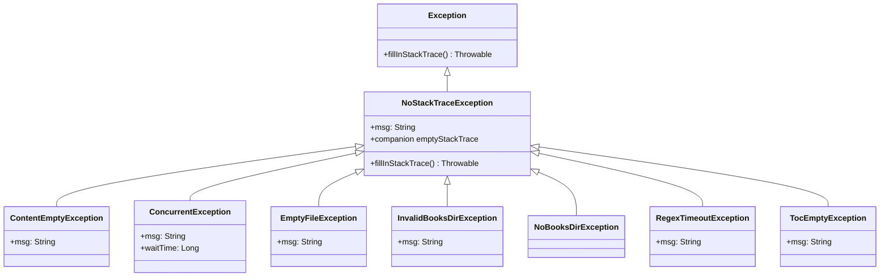
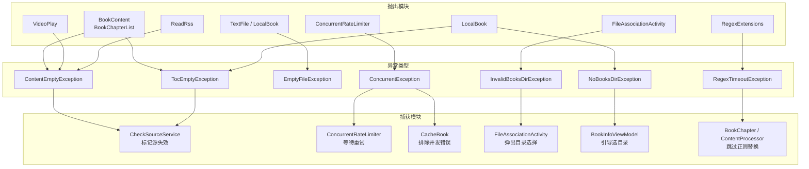

# 异常体系

> **核心问题**：Legado 高频抛出业务异常（内容为空、目录为空、并发限流等），若每次都填充完整堆栈，JVM 需遍历整个调用链构建 `StackTraceElement[]`，在书源校验（单次可触发数百次异常）和缓存批量下载场景下造成显著 CPU 与内存开销。
>
> **答案**：定义 `NoStackTraceException` 基类，覆写 `fillInStackTrace()` 使其直接返回空堆栈数组，所有业务异常均继承此基类。既保留了异常的类型语义（可按类型匹配处理），又消除了堆栈填充的性能代价。

---

## 异常继承关系



---

## NoStackTraceException 详解

[NoStackTraceException.kt](file:///f:/myself/github/WeAgentChat/temp/legado/app/src/main/java/io/legado/app/exception/NoStackTraceException.kt#L1)

### 核心原理

JVM 抛出异常时，默认调用 `fillInStackTrace()` 遍历当前线程的完整调用链，为每一帧创建 `StackTraceElement` 对象。对于 Legado 的业务异常，堆栈信息无诊断价值（异常含义已由类型和消息完全表达），但填充代价很高：

- 每次 `fillInStackTrace()` 需要 `O(栈深度)` 时间和空间
- 书源校验一次可触发数百次异常，缓存批量下载同理
- 高频场景下堆栈填充成为主要 CPU 和 GC 压力来源

### 源码实现

```kotlin
// L6-L15
open class NoStackTraceException(msg: String) : Exception(msg) {

    override fun fillInStackTrace(): Throwable {
        stackTrace = emptyStackTrace   // L9: 直接赋值空数组，跳过 JVM 默认填充
        return this
    }

    companion object {
        private val emptyStackTrace = emptyArray<StackTraceElement>()  // L14: 静态空数组，零分配
    }
}
```

**关键设计点**：

| 设计点 | 说明 |
|--------|------|
| `open class` | 允许业务异常继承，形成类型层次 |
| 覆写 `fillInStackTrace()` | 阻止 JVM 默认堆栈填充，将 `O(栈深度)` 降为 `O(1)` |
| `companion object` 缓存空数组 | `emptyArray<StackTraceElement>()` 只创建一次，所有实例共享，零额外分配 |
| 继承 `Exception(msg)` | 保留标准异常的消息机制，`message` 属性可用 |
| 返回 `this` | 符合 `Throwable.fillInStackTrace()` 的返回值契约 |

### 直接使用场景

`NoStackTraceException` 不仅作为基类，还被项目广泛直接实例化，用于"不需要专门子类"的快速失败场景：

| 模块 | 用途 |
|------|------|
| `WebDav` | URL 为空时快速失败（`"url不能为空"`） |
| `BookExtensions` | 非压缩包书籍 / 非本地书籍校验 |
| `AppWebDav` | WebDav 未配置 / 网络未连接 |
| `JsExtensions` | 内容获取失败 / source 为空 |
| `ReplaceAnalyzer` | 替换规则格式不对 |
| `SourceVerificationHelp` | 验证参数为空 / 验证结果为空 |
| `WebJsExtensions` | JS Bridge 参数空值守卫（大量使用） |
| `LegadoDataUrlLoader` | 漫画图片解密失败 |
| `AppUpdateGitHub/Gitee` | 版本检查失败 / 已是最新版本 |
| `BackstageWebView` | JS 执行超时 |
| `ImportOldData` | 导入格式错误 |
| `ReplaceRule` | 规则异常声明 |

---

## 业务异常详解

### ContentEmptyException — 内容为空

[ContentEmptyException.kt](file:///f:/myself/github/WeAgentChat/temp/legado/app/src/main/java/io/legado/app/exception/ContentEmptyException.kt#L1)

| 属性 | 值 |
|------|-----|
| 源文件行范围 | L1-L6 |
| 构造参数 | `msg: String` |
| 语义 | 书籍正文 / RSS 正文 / 视频正文内容为空 |

**抛出点**：

| 模块 | 场景 | 消息 |
|------|------|------|
| `BookContent` (L205) | 网络书源获取正文为空 | `"内容为空"` |
| `VideoPlay` (L197, L255) | 视频正文为空 | `"正文为空"` |
| `ReadRss` (L87) | RSS 阅读正文为空 | `"正文为空"` |

**捕获点**：

| 模块 | 处理方式 |
|------|---------|
| `CheckSourceService` (L266) | 标记源分组为 `"${bookType}正文失效"` |

---

### ConcurrentException — 并发限流

[ConcurrentException.kt](file:///f:/myself/github/WeAgentChat/temp/legado/app/src/main/java/io/legado/app/exception/ConcurrentException.kt#L1)

| 属性 | 值 |
|------|-----|
| 源文件行范围 | L1-L8 |
| 构造参数 | `msg: String`, `waitTime: Long` |
| 语义 | 并发请求数超过限流阈值，需等待后重试 |
| 独有字段 | `waitTime: Long` — 建议等待时间（毫秒） |

**抛出点**：

| 模块 | 场景 |
|------|------|
| `ConcurrentRateLimiter` (L92) | 并发数超过 `maxConcurrent` 阈值 |

**捕获点**：

| 模块 | 处理方式 |
|------|---------|
| `ConcurrentRateLimiter` (L107, L117) | 内部捕获后执行等待重试逻辑 |
| `CacheBook` (L261) | 排除 `ConcurrentException`，不将其计入缓存错误 |

**设计特点**：这是唯一携带额外字段（`waitTime`）的异常子类，捕获方可据此计算重试等待时间。

---

### EmptyFileException — 文件为空

[EmptyFileException.kt](file:///f:/myself/github/WeAgentChat/temp/legado/app/src/main/java/io/legado/app/exception/EmptyFileException.kt#L1)

| 属性 | 值 |
|------|-----|
| 源文件行范围 | L1-L6 |
| 构造参数 | `msg: String` |
| 语义 | 本地文件大小为零或内容读取长度为 -1 |

**抛出点**：

| 模块 | 场景 | 消息 |
|------|------|------|
| `TextFile` (L95) | TXT 文件读取长度为 -1 | `"Unexpected Empty Txt File"` |
| `LocalBook` (L245) | 本地书籍文件大小为 0 | `"Unexpected empty File"` |

---

### InvalidBooksDirException — 书籍目录无效

[InvalidBooksDirException.kt](file:///f:/myself/github/WeAgentChat/temp/legado/app/src/main/java/io/legado/app/exception/InvalidBooksDirException.kt#L1)

| 属性 | 值 |
|------|-----|
| 源文件行范围 | L1-L3 |
| 构造参数 | `msg: String` |
| 语义 | 用户选择的书籍存储目录不符合要求（非 SAF 授权权、目录不存在、无法创建子目录） |

**抛出点**：

| 模块 | 场景 |
|------|------|
| `FileAssociationActivity` (L158) | 目录权限不足 |
| `FileAssociationActivity` (L168) | 无法获取目录 DocumentFile |
| `FileAssociationActivity` (L182) | 无法创建子目录 |

**捕获点**：

| 模块 | 处理方式 |
|------|---------|
| `FileAssociationActivity` (L201) | 捕获后弹出目录选择器（`localBookTreeSelect.launch`） |

---

### NoBooksDirException — 无书籍目录

[NoBooksDirException.kt](file:///f:/myself/github/WeAgentChat/temp/legado/app/src/main/java/io/legado/app/exception/NoBooksDirException.kt#L1)

| 属性 | 值 |
|------|-----|
| 源文件行范围 | L1-L6 |
| 构造参数 | 无参（硬编码字符串资源 `R.string.no_books_dir`） |
| 语义 | 未配置默认书籍存储目录 |
| 设计特点 | 唯一无参构造的异常子类，消息直接从字符串资源获取，确保多语言支持 |

**抛出点**：

| 模块 | 场景 |
|------|------|
| `LocalBook` (L413) | 获取书籍目录 URI 为 null |
| `LocalBook` (L439) | 默认书籍目录 URI 为空 |
| `LocalBook` (L493) | 获取缓存目录 URI 为 null |

**捕获点**：

| 模块 | 处理方式 |
|------|---------|
| `BookInfoViewModel` (L333) | 发送 `"selectBooksDir"` 事件，引导用户选择目录 |

---

### RegexTimeoutException — 正则超时

[RegexTimeoutException.kt](file:///f:/myself/github/WeAgentChat/temp/legado/app/src/main/java/io/legado/app/exception/RegexTimeoutException.kt#L1)

| 属性 | 值 |
|------|-----|
| 源文件行范围 | L1-L3 |
| 构造参数 | `msg: String` |
| 语义 | 用户自定义正则表达式执行超时（防 ReDoS 攻击） |

**抛出点**：

| 模块 | 场景 |
|------|------|
| `RegexExtensions` (L75) | 正则匹配超过超时阈值 |

**捕获点**：

| 模块 | 处理方式 |
|------|---------|
| `BookChapter` (L156) | 静默忽略（`catch (_: RegexTimeoutException)`），跳过正则替换 |
| `ContentProcessor` (L182) | 捕获后记录日志，跳过该替换规则 |

**设计意义**：防止用户书源中的恶意/低效正则导致应用卡死，是安全防护机制的核心一环。

---

### TocEmptyException — 目录为空

[TocEmptyException.kt](file:///f:/myself/github/WeAgentChat/temp/legado/app/src/main/java/io/legado/app/exception/TocEmptyException.kt#L1)

| 属性 | 值 |
|------|-----|
| 源文件行范围 | L1-L6 |
| 构造参数 | `msg: String` |
| 语义 | 书籍章节目录为空 |

**抛出点**：

| 模块 | 场景 | 消息 |
|------|------|------|
| `BookChapterList` (L122) | 网络书源获取章节列表为空 | `R.string.chapter_list_empty` |
| `LocalBook` (L143) | 本地书籍解析章节列表为空 | `R.string.chapter_list_empty` |

**捕获点**：

| 模块 | 处理方式 |
|------|---------|
| `CheckSourceService` (L267) | 标记源分组为 `"${bookType}目录失效"` |

---

## 异常使用场景分析



### 按模块汇总

| 抛出模块 | 抛出的异常 | 捕获模块 | 捕获的异常 |
|---------|-----------|---------|-----------|
| `BookContent` | ContentEmptyException | `CheckSourceService` | ContentEmptyException, TocEmptyException |
| `BookChapterList` | TocEmptyException | `ConcurrentRateLimiter` | ConcurrentException |
| `VideoPlay` | ContentEmptyException | `CacheBook` | ConcurrentException（排除） |
| `ReadRss` | ContentEmptyException | `FileAssociationActivity` | InvalidBooksDirException |
| `ConcurrentRateLimiter` | ConcurrentException | `BookInfoViewModel` | NoBooksDirException |
| `TextFile` | EmptyFileException | `BookChapter` | RegexTimeoutException |
| `LocalBook` | EmptyFileException, NoBooksDirException, TocEmptyException | `ContentProcessor` | RegexTimeoutException |
| `FileAssociationActivity` | InvalidBooksDirException | | |
| `RegexExtensions` | RegexTimeoutException | | |

### 按异常类型汇总

| 异常类型 | 抛出点数 | 捕获点数 | 典型处理策略 |
|---------|---------|---------|-------------|
| ContentEmptyException | 4 | 1 | 标记源失效 |
| ConcurrentException | 1 | 3 | 等待重试 / 排除不计错误 |
| EmptyFileException | 2 | 0 | 向上传播由调用方统一处理 |
| InvalidBooksDirException | 3 | 1 | 弹出目录选择器 |
| NoBooksDirException | 3 | 1 | 引导用户选择目录 |
| RegexTimeoutException | 1 | 2 | 静默跳过 / 记录日志 |
| TocEmptyException | 2 | 1 | 标记源失效 |

---

## 源文件引用表

| 文件 | 行号范围 | 说明 |
|------|---------|------|
| [NoStackTraceException.kt](file:///f:/myself/github/WeAgentChat/temp/legado/app/src/main/java/io/legado/app/exception/NoStackTraceException.kt#L1) | L1-L17 | 基类，覆写 fillInStackTrace() |
| [ContentEmptyException.kt](file:///f:/myself/github/WeAgentChat/temp/legado/app/src/main/java/io/legado/app/exception/ContentEmptyException.kt#L1) | L1-L6 | 内容为空 |
| [ConcurrentException.kt](file:///f:/myself/github/WeAgentChat/temp/legado/app/src/main/java/io/legado/app/exception/ConcurrentException.kt#L1) | L1-L8 | 并发限流，含 waitTime 字段 |
| [EmptyFileException.kt](file:///f:/myself/github/WeAgentChat/temp/legado/app/src/main/java/io/legado/app/exception/EmptyFileException.kt#L1) | L1-L6 | 文件为空 |
| [InvalidBooksDirException.kt](file:///f:/myself/github/WeAgentChat/temp/legado/app/src/main/java/io/legado/app/exception/InvalidBooksDirException.kt#L1) | L1-L3 | 书籍目录无效 |
| [NoBooksDirException.kt](file:///f:/myself/github/WeAgentChat/temp/legado/app/src/main/java/io/legado/app/exception/NoBooksDirException.kt#L1) | L1-L6 | 无书籍目录，硬编码字符串资源 |
| [RegexTimeoutException.kt](file:///f:/myself/github/WeAgentChat/temp/legado/app/src/main/java/io/legado/app/exception/RegexTimeoutException.kt#L1) | L1-L3 | 正则超时 |
| [TocEmptyException.kt](file:///f:/myself/github/WeAgentChat/temp/legado/app/src/main/java/io/legado/app/exception/TocEmptyException.kt#L1) | L1-L6 | 目录为空 |
