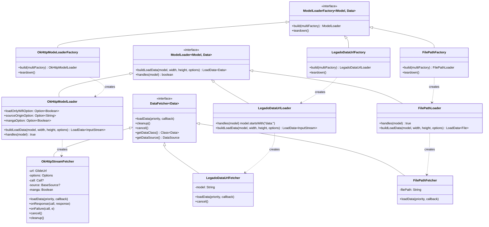
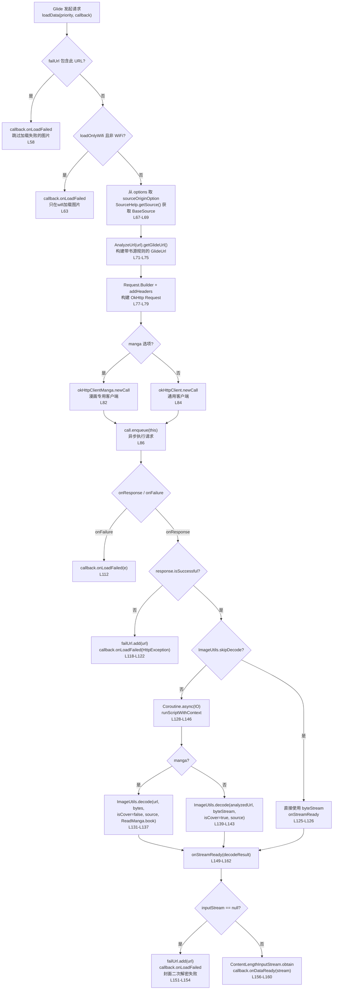
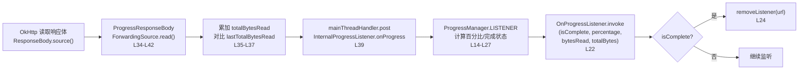
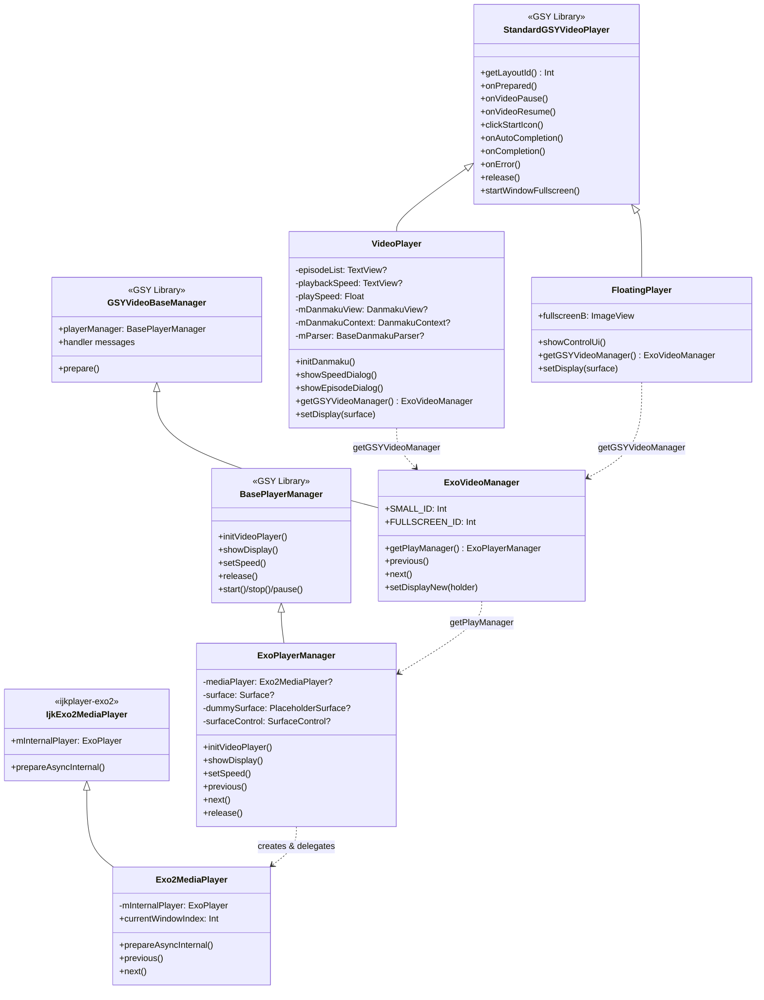
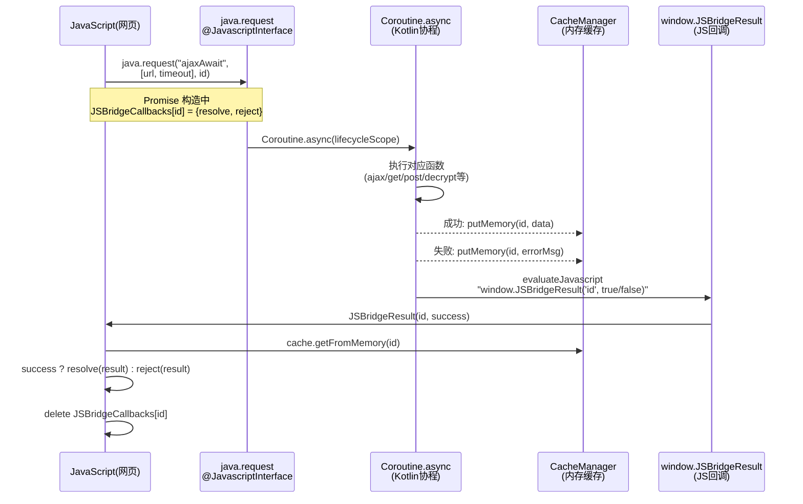

# Glide图片加载 · 视频播放 · WebView池化

> **核心问题**：Legado 需要加载来源各异的图片资源（有的需要二次解密、有的走漫画专用通道、有的需要下载进度回调）、播放含弹幕的视频流、以及高效执行大量 WebView 规则解析任务。如何让图片加载支持书源定制解密、视频播放支持弹幕/选集/倍速/浮窗、WebView 实例安全复用且 JS 桥接安全防注入？
>
> **答案**：通过 26 个文件的三模块设计——Glide 层用三组 ModelLoader+Fetcher 覆盖远程/数据URL/本地路径三种数据源，OkHttpStreamFetcher 内嵌 AnalyzeUrl 解密链；视频层采用四层架构（VideoPlayer → ExoVideoManager → ExoPlayerManager → Exo2MediaPlayer），弹幕系统由 BiliDanmukuParser + DanmakuAdapter 解析与渲染；WebView 层通过 WebViewPool 对象池 + MutableContextWrapper 动态上下文实现实例复用，WebJsExtensions 以变量名随机化+Promise回调实现安全异步JS桥接。

---

## 目录

- [架构总览](#架构总览)
- [Glide图片加载模块](#glide图片加载模块)
  - [1. ModelLoader+Fetcher 继承体系](#1-modelloaderfetcher-继承体系)
  - [2. OkHttpStreamFetcher 图片加载完整流程](#2-okhttpstreamfetcher-图片加载完整流程)
  - [3. LegadoGlideModule 注册中心](#3-legadoglidemodule-注册中心)
  - [4. ImageLoader 统一入口API](#4-imageloader-统一入口api)
  - [5. BlurTransformation 模糊变换](#5-blurtransformation-模糊变换)
  - [6. AsyncRecycleBitmapPool 异步回收](#6-asyncrecyclebitmappool-异步回收)
  - [7. ProgressManager 下载进度回调](#7-progressmanager-下载进度回调)
  - [8. 辅助组件](#8-辅助组件)
- [GSY视频播放模块](#gsy视频播放模块)
  - [1. 四层架构继承体系](#1-四层架构继承体系)
  - [2. VideoPlayer 主播放器](#2-videoplayer-主播放器)
  - [3. FloatingPlayer 浮窗播放器](#3-floatingplayer-浮窗播放器)
  - [4. 弹幕系统](#4-弹幕系统)
  - [5. 选集与倍速对话框](#5-选集与倍速对话框)
- [WebView池化与JS桥接模块](#webview池化与js桥接模块)
  - [1. WebViewPool 对象池机制](#1-webviewpool-对象池机制)
  - [2. PooledWebView 动态Context切换](#2-pooledwebview-动态context切换)
  - [3. WebJsExtensions JS-Native桥接](#3-webjsbrige-js-native桥接)
- [文件索引](#文件索引)

---

## 架构总览

三个模块位于 `io.legado.app.help` 包下，分别处理媒体加载、视频播放和 WebView 规则执行三大场景。

```
┌──────────────────────────────────────────────────────────────────┐
│                         上层调用者                                 │
│   UI层(Activity/Fragment) / WebBook / VideoPlay / ImageLoader    │
└──────┬─────────────────────┬──────────────────┬─────────────────┘
       │                     │                  │
┌──────▼──────┐    ┌────────▼────────┐  ┌──────▼──────────┐
│ Glide模块    │    │ GSY视频模块      │  │ WebView模块      │
│ 10+3文件     │    │ 10文件          │  │ 3文件            │
│ 图片加载/    │    │ 视频+弹幕/      │  │ 对象池/JS桥接    │
│ 解密/进度    │    │ 选集/倍速       │  │ 变量名随机化     │
└──────┬──────┘    └────────┬────────┘  └──────┬──────────┘
       │                    │                   │
┌──────▼──────┐    ┌────────▼────────┐  ┌──────▼──────────┐
│ OkHttp +    │    │ ExoPlayer +     │  │ VisibleWebView  │
│ AnalyzeUrl  │    │ DanmakuView     │  │ MutableContext   │
│ ImageUtils  │    │ GSYVideoPlayer  │  │ CacheManager     │
└─────────────┘    └─────────────────┘  └─────────────────┘
```

---

# Glide图片加载模块

源码目录：`app/src/main/java/io/legado/app/help/glide/`

Glide 模块替换了 Glide 默认的 HTTP 加载器，注入 Legado 自有的 OkHttp 客户端与书源解密链路，同时扩展了 data: URL 和本地文件路径两种数据源，并提供了模糊变换、异步位图回收和下载进度回调等能力。

## 1. ModelLoader+Fetcher 继承体系

Glide 的核心扩展点在于 `ModelLoader` + `DataFetcher` + `ModelLoaderFactory` 三件套。Legado 注册了三组，覆盖全部图片加载场景。



### 三组对比

| 组别 | Model | Data | 用途 | 注册方式 |
|------|-------|------|------|----------|
| OkHttp | `GlideUrl` | `InputStream` | 远程HTTP图片，支持书源解密 | `registry.replace` |
| LegadoDataUrl | `String` | `InputStream` | `data:` 协议的漫画图片 | `registry.prepend` |
| FilePath | `String` | `File` | 本地文件路径加载 | `registry.prepend` |

### 源文件引用

- [OkHttpModelLoader.kt](file:///f:/myself/github/WeAgentChat/temp/legado/app/src/main/java/io/legado/app/help/glide/OkHttpModelLoader.kt#L9) — `object OkHttpModelLoader` 定义（L9-L27）
- [OkHttpStreamFetcher.kt](file:///f:/myself/github/WeAgentChat/temp/legado/app/src/main/java/io/legado/app/help/glide/OkHttpStreamFetcher.kt#L35) — `class OkHttpStreamFetcher` 定义（L35-L163）
- [OkHttpModeLoaderFactory.kt](file:///f:/myself/github/WeAgentChat/temp/legado/app/src/main/java/io/legado/app/help/glide/OkHttpModeLoaderFactory.kt#L11) — `object OkHttpModeLoaderFactory` 定义（L11-L20）
- [LegadoDataUrlLoader.kt](file:///f:/myself/github/WeAgentChat/temp/legado/app/src/main/java/io/legado/app/help/glide/LegadoDataUrlLoader.kt#L19) — `class LegadoDataUrlLoader` 定义（L19-L91）
- [FilePathLoader.kt](file:///f:/myself/github/WeAgentChat/temp/legado/app/src/main/java/io/legado/app/help/glide/FilePathLoader.kt#L12) — `class FilePathLoader` 定义（L12-L55）

---

## 2. OkHttpStreamFetcher 图片加载完整流程

这是 Glide 图片加载的核心流程，从远程 URL 到 InputStream，内嵌书源解密和失败跳过机制。



### 关键机制

- **失败URL缓存**：`failUrl`（L52-L53）为 `HashSet<String>`，非漫画模式下加载失败的 URL 会被跳过，避免重复请求
- **书源解密**：`AnalyzeUrl(url, source).getGlideUrl()`（L71-L75）将书源规则注入 URL 解析链，`ImageUtils.decode`（L131-L143）完成二次解密
- **漫画/封面双通道**：`manga` 选项决定使用 `okHttpClientManga` 还是 `okHttpClient`（L81-L85），以及解密参数差异
- **协程清理**：`cleanup()` 中 `coroutineContext.cancel()`（L94）确保解密协程随请求生命周期终止

---

## 3. LegadoGlideModule 注册中心

### 源文件

[LegadoGlideModule.kt](file:///f:/myself/github/WeAgentChat/temp/legado/app/src/main/java/io/legado/app/help/glide/LegadoGlideModule.kt#L21) — `class LegadoGlideModule` 定义（L21-L51）

### 注册逻辑

`@GlideModule` 注解标记（L20），Glide 通过注解处理器自动发现此类。

| 方法 | 注册操作 | 说明 |
|------|----------|------|
| `registerComponents` (L23) | `registry.replace(GlideUrl, InputStream, OkHttpModeLoaderFactory)` | 替换默认 HTTP 加载器为 OkHttp |
| `registerComponents` (L29) | `registry.prepend(String, InputStream, LegadoDataUrlLoader.Factory)` | 前置 data: URL 加载器 |
| `registerComponents` (L34) | `registry.prepend(String, File, FilePathLoader.Factory)` | 前置文件路径加载器 |
| `applyOptions` (L41) | `setBitmapPool(AsyncRecycleBitmapPool)` | 异步位图回收 |
| `applyOptions` (L47) | `setDiskCache(1000MB)` | 磁盘缓存 1GB |
| `applyOptions` (L48-L49) | `setLogLevel(Log.ERROR)` | 非调试模式仅输出 ERROR |

---

## 4. ImageLoader 统一入口API

### 源文件

[ImageLoader.kt](file:///f:/myself/github/WeAgentChat/temp/legado/app/src/main/java/io/legado/app/help/glide/ImageLoader.kt#L22) — `object ImageLoader` 定义（L22-L108）

### API 一览

| 方法 | 返回类型 | 说明 |
|------|----------|------|
| `load(context, path: String?)` | `RequestBuilder<Drawable>` | 自动判断路径类型（L27-L38） |
| `load(fragment, lifecycle, path)` | `RequestBuilder<Drawable>` | Fragment 生命周期绑定（L41-L55） |
| `loadBitmap(context, path)` | `RequestBuilder<Bitmap>` | 加载为 Bitmap（L57-L70） |
| `loadFile(context, path)` | `RequestBuilder<File>` | 加载为文件缓存（L72-L83） |
| `load(context, resId: Int?)` | `RequestBuilder<Drawable>` | 资源 ID（L85-L87） |
| `load(context, file: File?)` | `RequestBuilder<Drawable>` | 文件对象（L89-L91） |
| `load(context, uri: Uri?)` | `RequestBuilder<Drawable>` | URI（L93-L95） |
| `load(context, drawable: Drawable?)` | `RequestBuilder<Drawable>` | Drawable（L97-L99） |
| `load(context, bitmap: Bitmap?)` | `RequestBuilder<Drawable>` | Bitmap（L101-L103） |
| `load(context, bytes: ByteArray?)` | `RequestBuilder<Drawable>` | 字节数组（L105-L107） |

### 路径类型判断逻辑

`load(context, path: String?)` 方法（L27-L38）按优先级判断：

1. `path.isNullOrEmpty()` → 直接加载（Glide 显示占位）
2. `path.isDataUrl()` → data: 协议，走 `LegadoDataUrlLoader`
3. `path.isAbsUrl()` → 绝对 URL，走 `OkHttpModelLoader`
4. `path.isContentScheme()` → content:// 协议，转 Uri 加载
5. 否则 → 尝试 `File(path)`，失败则回退为 String 加载

---

## 5. BlurTransformation 模糊变换

### 源文件

[BlurTransformation.kt](file:///f:/myself/github/WeAgentChat/temp/legado/app/src/main/java/io/legado/app/help/glide/BlurTransformation.kt#L14) — `class BlurTransformation` 定义（L14-L29）

继承 `BitmapTransformation`，核心逻辑只有一行：

```kotlin
override fun transform(pool, toTransform, outWidth, outHeight): Bitmap {
    return toTransform.stackBlur(radius)  // L24
}
```

- **radius**：模糊半径，`@IntRange(0..25)`（L15），0 为无模糊，25 为最大模糊
- **stackBlur**：使用 `io.legado.app.utils.stackBlur` 扩展函数，即 Stack Blur 算法（O(n) 复杂度）
- **diskCacheKey**：固定为 `"blur transformation"`（L28），同 radius 的变换共享缓存

---

## 6. AsyncRecycleBitmapPool 异步回收

### 源文件

[AsyncRecycleBitmapPool.kt](file:///f:/myself/github/WeAgentChat/temp/legado/app/src/main/java/io/legado/app/help/glide/AsyncRecycleBitmapPool.kt#L9) — `class AsyncRecycleBitmapPool` 定义（L9-L23）

通过 `by delegate` 委托模式（L9），将 `BitmapPool` 的所有方法委托给内部 `delegate`，仅覆写 `put` 方法：

```kotlin
override fun put(bitmap: Bitmap) {
    globalExecutor.execute {   // L20
        delegate.put(bitmap)   // L21
    }
}
```

- **构造器**（L11-L17）：若 `maxSize > 0` 使用 `LruBitmapPool`，否则使用 `BitmapPoolAdapter`（空实现）
- **异步回收**：`put` 操作提交到 `globalExecutor` 线程池，避免在主线程阻塞

---

## 7. ProgressManager 下载进度回调

### 源文件

- [ProgressManager.kt](file:///f:/myself/github/WeAgentChat/temp/legado/app/src/main/java/io/legado/app/help/glide/progress/ProgressManager.kt#L10) — `object ProgressManager` 定义（L10-L61）
- [ProgressResponseBody.kt](file:///f:/myself/github/WeAgentChat/temp/legado/app/src/main/java/io/legado/app/help/glide/progress/ProgressResponseBody.kt#L11) — `class ProgressResponseBody` 定义（L11-L53）
- [OnProgressListener.kt](file:///f:/myself/github/WeAgentChat/temp/legado/app/src/main/java/io/legado/app/help/glide/progress/OnProgressListener.kt#L3) — `typealias OnProgressListener` 定义（L3）

### 进度回调流程



### 关键机制

- **ConcurrentHashMap**：`listenersMap`（L11）使用线程安全的 `ConcurrentHashMap<String, OnProgressListener>`，key 为去参 URL
- **URL 去参**：`getUrlNoOption()`（L53-L59）用 `AnalyzeUrl.paramPattern` 正则去掉 URL 中的 `{@…}` 参数部分
- **完成自动移除**：百分比 >= 100 时自动 `removeListener`（L23-L25）
- **主线程回调**：`ProgressResponseBody` 通过 `Handler(Looper.getMainLooper())`（L51）确保回调在主线程

### OnProgressListener 签名

```kotlin
typealias OnProgressListener = (
    isComplete: Boolean,
    percentage: Int,
    bytesRead: Long,
    totalBytes: Long
) -> Unit
```

---

## 8. 辅助组件

### GlideHeaders

[GlideHeaders.kt](file:///f:/myself/github/WeAgentChat/temp/legado/app/src/main/java/io/legado/app/help/glide/GlideHeaders.kt#L5) — `class GlideHeaders` 定义（L5-L10）

实现 `com.bumptech.glide.load.model.Headers` 接口，封装自定义请求头 `MutableMap<String, String>`，供 `GlideUrl` 构造时使用。

---

# GSY视频播放模块

源码目录：`app/src/main/java/io/legado/app/help/gsyVideo/`

基于 GSYVideoPlayer 库封装的视频播放子系统，采用四层架构从 UI 到播放引擎逐层解耦，同时集成了弹幕渲染、选集切换和倍速播放功能。

## 1. 四层架构继承体系



### 各层职责

| 层级 | 类 | 职责 |
|------|-----|------|
| UI层 | `VideoPlayer` / `FloatingPlayer` | 布局渲染、手势交互、弹幕控制、全屏切换 |
| 管理层 | `ExoVideoManager` | 播放器生命周期管理、消息派发、上下集切换 |
| 适配层 | `ExoPlayerManager` | Surface 管理、缓存策略、静音/音量控制 |
| 引擎层 | `Exo2MediaPlayer` | ExoPlayer 实例创建与配置、多窗口(Timeline)切换 |

### 源文件引用

- [VideoPlayer.kt](file:///f:/myself/github/WeAgentChat/temp/legado/app/src/main/java/io/legado/app/help/gsyVideo/VideoPlayer.kt#L34) — `class VideoPlayer` 定义（L34-L553）
- [FloatingPlayer.kt](file:///f:/myself/github/WeAgentChat/temp/legado/app/src/main/java/io/legado/app/help/gsyVideo/FloatingPlayer.kt#L16) — `class FloatingPlayer` 定义（L16-L171）
- [ExoVideoManager.kt](file:///f:/myself/github/WeAgentChat/temp/legado/app/src/main/java/io/legado/app/help/gsyVideo/ExoVideoManager.kt#L12) — `class ExoVideoManager` 定义（L12-L74）
- [ExoPlayerManager.kt](file:///f:/myself/github/WeAgentChat/temp/legado/app/src/main/java/io/legado/app/help/gsyVideo/ExoPlayerManager.kt#L25) — `class ExoPlayerManager` 定义（L25-L277）
- [Exo2MediaPlayer.kt](file:///f:/myself/github/WeAgentChat/temp/legado/app/src/main/java/io/legado/app/help/gsyVideo/Exo2MediaPlayer.kt#L27) — `class Exo2MediaPlayer` 定义（L27-L130）

---

## 2. VideoPlayer 主播放器

### 核心功能

**弹幕生命周期**（与播放器状态同步）：

| 播放器事件 | 弹幕操作 | 代码位置 |
|-----------|----------|----------|
| `onPrepared` | `mDanmakuView.prepare(parser, context)` | L143-L153 |
| `onVideoPause` | `mDanmakuView.pause()` | L156-L163 |
| `onVideoResume` | `mDanmakuView.resume()` | L166-L174 |
| `onCompletion` | `mDanmakuView.release()` | L190-L196 |
| `onSeekComplete` | `mDanmakuView.seekTo(time)` | L199-L208 |
| 全屏切换 | 同步 `mDanmakuStartSeekPosition` | L456-L490 |

**手势交互**（L92-L123）：

- 双击 → `touchDoubleUp`
- 单击 → `onClickUiToggle`（非拖拽/调音量/调亮度时）
- 长按 → `VideoPlay.longPressSpeed / 10.0f` 倍速播放（L110-L113）

**选集切换**（L376-L395）：

- `showEpisodeDialog()` 弹出 `ChoiceEpisodeDialog`
- 回调中设置 `VideoPlay.chapterInVolumeIndex` 并调用 `VideoPlay.startPlay`

**倍速选择**（L397-L422）：

- 支持 0.5X ~ 3.0X 共 8 档（L403）
- 变速时同步调整弹幕滚动速度 `mDanmakuContext.setScrollSpeedFactor`（L138）

### Surface 管理

`setDisplay()` (L515-L524) 根据 View 类型选择不同的 Surface 设置方式：
- `SurfaceView` → `gsyVideoManager.setDisplayNew(surfaceView)`
- 其他 → `gsyVideoManager.setDisplay(surface)`
- null → `gsyVideoManager.setDisplayNew(null)`

### 播放器转移

`setSurfaceToPlay()` (L529-L533) 用于浮窗/全屏切换时转移播放器所有权：添加 TextureView → 设置 Listener → 校验状态。

---

## 3. FloatingPlayer 浮窗播放器

### 源文件

[FloatingPlayer.kt](file:///f:/myself/github/WeAgentChat/temp/legado/app/src/main/java/io/legado/app/help/gsyVideo/FloatingPlayer.kt#L16) — `class FloatingPlayer` 定义（L16-L171）

### 与 VideoPlayer 的差异

| 特性 | VideoPlayer | FloatingPlayer |
|------|-------------|----------------|
| 布局 | `video_layout_controller` / `video_layout_controller_full` | `video_layout_floating` |
| 弹幕 | 完整弹幕生命周期 | 无弹幕 |
| 全屏 | 支持 `startWindowFullscreen` | 不支持 (`getFullWindowPlayer` 返回 null) |
| 进度条 | 完整进度+时间显示 | 仅底部进度条（L88-L97） |
| 控制 UI | 双击/长按/选集/倍速 | 仅显示/隐藏控制按钮（L99-L105） |

`showControlUi()` (L99-L105) 实现简单的 UI 切换：`mStartButton` 不可见时显示全部控件，否则隐藏。

---

## 4. 弹幕系统

### 源文件

- [DanmakuAdapter.kt](file:///f:/myself/github/WeAgentChat/temp/legado/app/src/main/java/io/legado/app/help/gsyVideo/DanmakuAdapter.kt#L20) — `class DanmakuAdapter` 定义（L20-L78）
- [BiliDanmukuParser.kt](file:///f:/myself/github/WeAgentChat/temp/legado/app/src/main/java/io/legado/app/help/gsyVideo/BiliDanmukuParser.kt#L24) — `class BiliDanmukuParser` 定义（L24-L287）

### DanmakuAdapter

继承 `BaseCacheStuffer.Proxy`，负责图文混排弹幕的绘制准备：

- `prepareDrawing()` (L24-L55)：检查弹幕是否含 `Spanned`，若是则异步加载远程图片（B站 favicon），创建 `ImageSpan` 混排内容
- `releaseResource()` (L59-L61)：清理 `ImageSpan` 占用资源（TODO 未实现完整）
- `createSpannable()` (L64-L77)：构建图文混排 SpannableStringBuilder，附加背景色

### BiliDanmukuParser

继承 `BaseDanmakuParser`，解析 B站 XML 格式弹幕：

**SAX 解析流程**：

| 回调 | 逻辑 | 行号 |
|------|------|------|
| `startElement` | 解析 `<d p="...">` 标签的 `p` 属性 | L72-L110 |
| `characters` | 填充弹幕文本，处理特殊弹幕（TYPE_SPECIAL） | L131-L254 |
| `endElement` | 将完整弹幕加入 `Danmakus` 集合 | L114-L129 |

**`p` 属性格式**（L81-L89）：

```
<d p="23.826,1,25,16777215,1422201084,0,057075e9,757076900">弹幕文本</d>
```

| 索引 | 含义 |
|------|------|
| 0 | 出现时间（秒） |
| 1 | 类型（1=右→左滚动，5=顶端固定，4=底端固定，7=高级弹幕） |
| 2 | 字号 |
| 3 | 颜色 |
| 4 | 时间戳 |
| 5 | 弹幕池 ID |
| 6 | 用户 hash |
| 7 | 弹幕 ID |

**特殊弹幕（TYPE_SPECIAL）**：以 JSON 数组格式 `[beginX, beginY, alpha, duration, text, ...]` 表示（L138-L253），支持位移动画、旋转、路径运动等高级效果。

---

## 5. 选集与倍速对话框

### ChoiceEpisodeDialog

[ChoiceEpisodeDialog.kt](file:///f:/myself/github/WeAgentChat/temp/legado/app/src/main/java/io/legado/app/help/gsyVideo/ChoiceEpisodeDialog.kt#L17) — `class ChoiceEpisodeDialog` 定义（L17-L80）

- 数据类型：`List<BookChapter>`
- 列表项显示：`item.title`（L55）
- 布局：`switch_episode_video_dialog`，宽度 40% 屏幕，右侧对齐
- 回调：`onItemClick(position)` 和 `finishDialog()`
- 支持初始选中位置：`setSelectionFromTop(initialSelection, 0)`（L58）

### ChoiceSpeedDialog

[ChoiceSpeedDialog.kt](file:///f:/myself/github/WeAgentChat/temp/legado/app/src/main/java/io/legado/app/help/gsyVideo/ChoiceSpeedDialog.kt#L15) — `class ChoiceSpeedDialog` 定义（L15-L73)

- 数据类型：`List<Float>`
- 列表项显示：`item.toString() + "X"`（L51）
- 布局：`switch_speed_video_dialog`，宽度 30% 屏幕，右侧对齐
- 回调：`onItemClick(value: Float)` 和 `finishDialog()`

### SwitchVideoAdapter

[SwitchVideoAdapter.kt](file:///f:/myself/github/WeAgentChat/temp/legado/app/src/main/java/io/legado/app/help/gsyVideo/SwitchVideoAdapter.kt#L11) — `class SwitchVideoAdapter` 定义（L11-L24）

通用列表适配器，支持泛型 `<T>` 和自定义 `titleProvider` 闭包，两个对话框共用。

---

# WebView池化与JS桥接模块

源码目录：`app/src/main/java/io/legado/app/help/webView/`

WebView 实例创建和销毁开销巨大（每个实例约 30-50MB 内存），Legado 通过对象池复用 WebView 实例，并通过 `MutableContextWrapper` 实现动态上下文切换，通过变量名随机化防止 JS 注入攻击。

## 1. WebViewPool 对象池机制

### 源文件

[WebViewPool.kt](file:///f:/myself/github/WeAgentChat/temp/legado/app/src/main/java/io/legado/app/help/webView/WebViewPool.kt#L26) — `object WebViewPool` 定义（L26-L194）

### acquire/release 流程

```mermaid
flowchart TD
    subgraph "acquire(context)"
        A["WebViewPool.acquire(context)"] --> B{idlePool 非空?}
        B -- 是 --> C["idlePool.pop()<br/>复用闲置实例<br/>L45"]
        B -- 否 --> D{needInitialize?}
        D -- 是 --> E["needInitialize = false<br/>startCleanupTimer()<br/>L48-L49"]
        D -- 否 --> F["createNewWebView()<br/>创建新实例<br/>L51"]
        E --> F
        C --> G["pooledWebView.upContext(context)<br/>切换到调用方 Context<br/>L53"]
        F --> G
        G --> H["settings.setDarkeningAllowed<br/>设置夜间模式<br/>L54"]
        H --> I{inUsePool 为空?}
        I -- 是 --> J["realWebView.resumeTimers()<br/>恢复 WebView 定时器<br/>L56"]
        I -- 否 --> K["跳过"]
        J --> L
        K --> L["isInUse = true<br/>inUsePool[id] = pooledWebView<br/>L58-L60"]
    end

    subgraph "release(pooledWebView)"
        M["WebViewPool.release(pooledWebView)"] --> N{inUsePool.remove 成功?}
        N -- 否 --> O["realWebView.destroy()<br/>直接销毁<br/>L68"]
        N -- 是 --> P["重置 WebView 状态<br/>移除父视图/停止加载/清除焦点<br/>清除监听器/表单/匹配/动画<br/>L72-L91"]
        P --> Q["upContext(appCtx)<br/>切换回应用全局 Context<br/>L92"]
        Q --> R{idlePool 已满?}
        R -- 是 --> S["realWebView.destroy()<br/>池满销毁<br/>L95"]
        R -- 否 --> T["设置 WebViewClient<br/>onPageFinished 时重置 JS 环境<br/>L98-L122"]
        T --> U["loadUrl(BLANK_HTML)<br/>加载空白页触发重置<br/>L122"]
        U --> V["onPageFinished 回调<br/>JS 禁用→启用重置<br/>idlePool.push<br/>L100-L122"]
    end
```



### 关键参数

| 参数 | 值 | 说明 | 行号 |
|------|-----|------|------|
| `CACHED_WEB_VIEW_MAX_NUM` | `max(threadCount/10, 5)` | 池总容量 | L35 |
| `IDLE_TIME_OUT` | 5 分钟 | 闲置超时（非最后实例） | L36 |
| `IDLE_TIME_OUT_LAST` | 30 分钟 | 闲置超时（最后实例） | L37 |
| 清理周期 | 30 秒 | 定时扫描间隔 | L160 |

### 清理定时器

`startCleanupTimer()` (L156-L193) 在协程中每 30 秒扫描 `idlePool`：
- 栈底（index=0）使用 30 分钟超时（`IDLE_TIME_OUT_LAST`），保留最后一个实例更久
- 栈中其他使用 5 分钟超时（`IDLE_TIME_OUT`）
- 清空后取消定时器协程，重置 `needInitialize`

### WebView 预初始化

`preInitWebView()` (L138-L153) 配置：
- `javaScriptEnabled = true`
- `mixedContentMode = MIXED_CONTENT_ALWAYS_ALLOW`
- `domStorageEnabled = true`
- `mediaPlaybackRequiresUserGesture = false`
- `builtInZoomControls = true` + `displayZoomControls = false`
- `textZoom = 100`

---

## 2. PooledWebView 动态Context切换

### 源文件

[PooledWebView.kt](file:///f:/myself/github/WeAgentChat/temp/legado/app/src/main/java/io/legado/app/help/webView/PooledWebView.kt#L7) — `class PooledWebView` 定义（L7-L21）

### 核心机制

```kotlin
fun upContext(context: Context): PooledWebView {
    (realWebView.context as MutableContextWrapper).let {
        if (it.baseContext != context) {
            it.baseContext = context  // L17
        }
    }
    return this
}
```

**问题**：WebView 创建时绑定的 Context 不可更改（Android WebView 限制），但 WebViewPool 需要在不同 Activity 间复用 WebView 实例。

**解决方案**：创建 WebView 时传入 `MutableContextWrapper(appCtx)`（L127），这是 Android 提供的 Context 包装器，允许运行时替换 `baseContext`。当 `acquire` 时切换到调用方 Activity 的 Context，`release` 时切回 `appCtx`。

### 字段

| 字段 | 类型 | 说明 | 行号 |
|------|------|------|------|
| `realWebView` | `VisibleWebView` | 真正的 WebView 实例 | L8 |
| `id` | `String` | 唯一标识，格式 `web_{timestamp}_{random}` | L9 |
| `isInUse` | `Boolean` | 是否正在被使用 | L11 |
| `lastUseTime` | `Long` | 最后使用时间戳 | L12 |

---

## 3. WebJsExtensions JS-Native桥接

### 源文件

[WebJsExtensions.kt](file:///f:/myself/github/WeAgentChat/temp/legado/app/src/main/java/io/legado/app/help/webView/WebJsExtensions.kt#L19) — `class WebJsExtensions` 定义（L19-L420)

### 继承关系

`WebJsExtensions` 继承 `RssJsExtensions`，在 RSS 扩展基础上增加了 `upConfig` 回调和 `request` 异步桥接方法。

### JS-Native 异步桥接时序



### 变量名随机化

[WebJsExtensions.kt](file:///f:/myself/github/WeAgentChat/temp/legado/app/src/main/java/io/legado/app/help/webView/WebJsExtensions.kt#L212) — companion object 中的变量名生成（L211-L419）

每次进程启动时，所有 JS 桥接变量名都会重新随机生成，防止恶意网页猜测变量名进行注入：

| 属性 | 生成规则 | 用途 | 行号 |
|------|----------|------|------|
| `uuid` | `UUID.randomUUID().replace('-', randomLetter()).chunked(6)` | 基础随机 ID | L216-L218 |
| `uuid2` | 同上 | 二级随机 ID | L219-L221 |
| `nameUrl` | `"https://" + uuid[0] + ".com/" + uuid2[0] + ".js"` | 伪装脚本 URL | L222 |
| `nameJava` | `randomLetter() + uuid[1] + uuid2[1]` | Java 桥接对象名 | L223 |
| `nameCache` | `randomLetter() + uuid[2] + uuid2[2]` | 缓存对象名 | L224 |
| `nameSource` | `randomLetter() + uuid[3] + uuid2[3]` | 书源对象名 | L225 |
| `nameBasic` | `randomLetter() + uuid[4] + uuid2[4]` | 基础功能对象名 | L226 |
| `JSBridgeResult` | `randomLetter() + uuid[5] + uuid2[5]` | 结果回调函数名 | L227 |

### JS_INJECTION 注入脚本

`JS_INJECTION` (L234-L367) 是注入到 WebView 的完整 JS 环境，包含：

1. **变量迁移**：从 `window` 上取出 `java`/`source`/`cache` 并删除原引用（L238-L243），防止网页直接访问
2. **异步函数**：每个 `xxxAwait` 函数返回 `Promise`，通过 `requestId` 生成唯一请求 ID，注册到 `JSBridgeCallbacks`（L244-L355）
3. **结果回调**：`window.JSBridgeResult(id, success)` 从 `CacheManager` 取结果，resolve/reject 对应 Promise（L356-L367）

### request() Native 端分发

`request(funName, jsParam, id)` (L42-L161) 是 JS 调用 Native 的统一入口：

| funName | 对应操作 | 参数 | 行号 |
|---------|---------|------|------|
| `run` | `analyzeRule.evalJS(p0)` | jsCode | L53-L57 |
| `ajaxAwait` | `ajax(url, timeout)` | url, timeout | L59-L63 |
| `connectAwait` | `connect(url, header, timeout)` | url, header, timeout | L65-L70 |
| `getAwait` | `get(url, header, timeout)` | url, header, timeout | L72-L78 |
| `headAwait` | `head(url, header, timeout)` | url, header, timeout | L80-L86 |
| `postAwait` | `post(url, body, header, timeout)` | url, body, header, timeout | L88-L94 |
| `webViewAwait` | `webView(url, header, js, newTab)` | url, header, js, newTab | L96-L101 |
| `webViewGetSourceAwait` | `webViewGetSource(...)` | 多参数 | L103-L110 |
| `decryptStrAwait` | `createSymmetricCrypto().decryptStr()` | transformation, key, iv, data | L112-L117 |
| `encryptBase64Await` | `createSymmetricCrypto().encryptBase64()` | transformation, key, iv, data | L119-L124 |
| `encryptHexAwait` | `createSymmetricCrypto().encryptHex()` | transformation, key, iv, data | L126-L131 |
| `createSignHexAwait` | `createSign().signHex()` | algorithm, publicKey, privateKey, data | L133-L138 |
| `downloadFileAwait` | `downloadFile(url)` | url | L140-L142 |
| `readTxtFileAwait` | `readTxtFile(path)` | path | L144-L146 |
| `importScriptAwait` | `importScript(path)` | path | L148-L150 |
| `getStringAwait` | `analyzeRule.getString(rule, content)` | rule, content | L152-L154 |

### JS_INJECTION2 精简版

`JS_INJECTION2` (L370-L395) 仅包含 `run` 函数和回调机制，用于不需要完整扩展能力的场景。

### basicJs 基础注入

`basicJs` (L398-L418) 注入 `screen.orientation.lock/unlock` 和 `window.close` 的兼容实现，通过 `nameBasic` 对象桥接到 Native。

---

## 文件索引

### Glide 图片加载模块 (13 文件)

| 文件 | 类型 | 核心职责 |
|------|------|----------|
| [OkHttpStreamFetcher.kt](file:///f:/myself/github/WeAgentChat/temp/legado/app/src/main/java/io/legado/app/help/glide/OkHttpStreamFetcher.kt#L35) | DataFetcher | 远程图片加载+书源解密 |
| [OkHttpModelLoader.kt](file:///f:/myself/github/WeAgentChat/temp/legado/app/src/main/java/io/legado/app/help/glide/OkHttpModelLoader.kt#L9) | ModelLoader | GlideUrl→InputStream 映射 |
| [OkHttpModeLoaderFactory.kt](file:///f:/myself/github/WeAgentChat/temp/legado/app/src/main/java/io/legado/app/help/glide/OkHttpModeLoaderFactory.kt#L11) | ModelLoaderFactory | OkHttpModelLoader 工厂 |
| [LegadoGlideModule.kt](file:///f:/myself/github/WeAgentChat/temp/legado/app/src/main/java/io/legado/app/help/glide/LegadoGlideModule.kt#L21) | AppGlideModule | Glide 注册中心+配置 |
| [LegadoDataUrlLoader.kt](file:///f:/myself/github/WeAgentChat/temp/legado/app/src/main/java/io/legado/app/help/glide/LegadoDataUrlLoader.kt#L19) | ModelLoader+Fetcher | data: URL 漫画图片加载 |
| [ImageLoader.kt](file:///f:/myself/github/WeAgentChat/temp/legado/app/src/main/java/io/legado/app/help/glide/ImageLoader.kt#L22) | object | 统一图片加载入口 |
| [GlideHeaders.kt](file:///f:/myself/github/WeAgentChat/temp/legado/app/src/main/java/io/legado/app/help/glide/GlideHeaders.kt#L5) | Headers | 自定义请求头封装 |
| [FilePathLoader.kt](file:///f:/myself/github/WeAgentChat/temp/legado/app/src/main/java/io/legado/app/help/glide/FilePathLoader.kt#L12) | ModelLoader+Fetcher | 本地文件路径加载 |
| [BlurTransformation.kt](file:///f:/myself/github/WeAgentChat/temp/legado/app/src/main/java/io/legado/app/help/glide/BlurTransformation.kt#L14) | BitmapTransformation | Stack Blur 模糊变换 |
| [AsyncRecycleBitmapPool.kt](file:///f:/myself/github/WeAgentChat/temp/legado/app/src/main/java/io/legado/app/help/glide/AsyncRecycleBitmapPool.kt#L9) | BitmapPool | 异步位图回收 |
| [ProgressResponseBody.kt](file:///f:/myself/github/WeAgentChat/temp/legado/app/src/main/java/io/legado/app/help/glide/progress/ProgressResponseBody.kt#L11) | ResponseBody | OkHttp 响应体进度拦截 |
| [ProgressManager.kt](file:///f:/myself/github/WeAgentChat/temp/legado/app/src/main/java/io/legado/app/help/glide/progress/ProgressManager.kt#L10) | object | 进度监听器管理 |
| [OnProgressListener.kt](file:///f:/myself/github/WeAgentChat/temp/legado/app/src/main/java/io/legado/app/help/glide/progress/OnProgressListener.kt#L3) | typealias | 进度回调函数签名 |

### GSY 视频播放模块 (10 文件)

| 文件 | 类型 | 核心职责 |
|------|------|----------|
| [VideoPlayer.kt](file:///f:/myself/github/WeAgentChat/temp/legado/app/src/main/java/io/legado/app/help/gsyVideo/VideoPlayer.kt#L34) | StandardGSYVideoPlayer | 主视频播放器+弹幕+手势 |
| [FloatingPlayer.kt](file:///f:/myself/github/WeAgentChat/temp/legado/app/src/main/java/io/legado/app/help/gsyVideo/FloatingPlayer.kt#L16) | StandardGSYVideoPlayer | 浮窗播放器 |
| [SwitchVideoAdapter.kt](file:///f:/myself/github/WeAgentChat/temp/legado/app/src/main/java/io/legado/app/help/gsyVideo/SwitchVideoAdapter.kt#L11) | ArrayAdapter | 通用列表适配器 |
| [ExoVideoManager.kt](file:///f:/myself/github/WeAgentChat/temp/legado/app/src/main/java/io/legado/app/help/gsyVideo/ExoVideoManager.kt#L12) | GSYVideoBaseManager | 播放器管理器 |
| [ExoPlayerManager.kt](file:///f:/myself/github/WeAgentChat/temp/legado/app/src/main/java/io/legado/app/help/gsyVideo/ExoPlayerManager.kt#L25) | BasePlayerManager | ExoPlayer 适配层 |
| [Exo2MediaPlayer.kt](file:///f:/myself/github/WeAgentChat/temp/legado/app/src/main/java/io/legado/app/help/gsyVideo/Exo2MediaPlayer.kt#L27) | IjkExo2MediaPlayer | ExoPlayer 引擎封装 |
| [DanmakuAdapter.kt](file:///f:/myself/github/WeAgentChat/temp/legado/app/src/main/java/io/legado/app/help/gsyVideo/DanmakuAdapter.kt#L20) | BaseCacheStuffer.Proxy | 弹幕图文混排适配 |
| [BiliDanmukuParser.kt](file:///f:/myself/github/WeAgentChat/temp/legado/app/src/main/java/io/legado/app/help/gsyVideo/BiliDanmukuParser.kt#L24) | BaseDanmakuParser | B站 XML 弹幕解析器 |
| [ChoiceSpeedDialog.kt](file:///f:/myself/github/WeAgentChat/temp/legado/app/src/main/java/io/legado/app/help/gsyVideo/ChoiceSpeedDialog.kt#L15) | Dialog | 倍速选择对话框 |
| [ChoiceEpisodeDialog.kt](file:///f:/myself/github/WeAgentChat/temp/legado/app/src/main/java/io/legado/app/help/gsyVideo/ChoiceEpisodeDialog.kt#L17) | Dialog | 选集对话框 |

### WebView 池化与 JS 桥接模块 (3 文件)

| 文件 | 类型 | 核心职责 |
|------|------|----------|
| [WebViewPool.kt](file:///f:/myself/github/WeAgentChat/temp/legado/app/src/main/java/io/legado/app/help/webView/WebViewPool.kt#L26) | object | WebView 对象池(acquire/release/清理) |
| [PooledWebView.kt](file:///f:/myself/github/WeAgentChat/temp/legado/app/src/main/java/io/legado/app/help/webView/PooledWebView.kt#L7) | data class | 池化 WebView 包装+动态 Context |
| [WebJsExtensions.kt](file:///f:/myself/github/WeAgentChat/temp/legado/app/src/main/java/io/legado/app/help/webView/WebJsExtensions.kt#L19) | RssJsExtensions | JS-Native 桥接+变量名随机化 |
