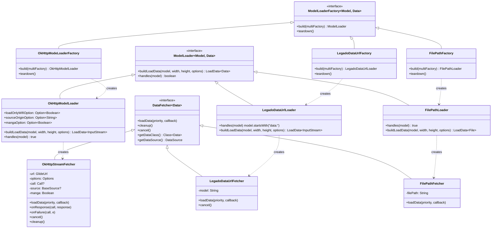
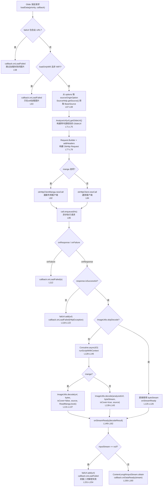
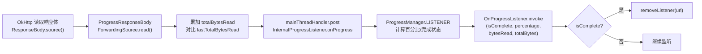

# Glide图片加载模块

源码目录：`app/src/main/java/io/legado/app/help/glide/`

Glide 模块替换了 Glide 默认的 HTTP 加载器，注入 Legado 自有的 OkHttp 客户端与书源解密链路，同时扩展了 data: URL 和本地文件路径两种数据源，并提供了模糊变换、异步位图回收和下载进度回调等能力。

> 主索引：[glide-video-webview.md](./glide-video-webview.md)（三模块拆分后本文件为 Glide 模块权威文档）

## 1. ModelLoader+Fetcher 继承体系

Glide 的核心扩展点在于 `ModelLoader` + `DataFetcher` + `ModelLoaderFactory` 三件套。Legado 注册了三组，覆盖全部图片加载场景。



### 三组对比

| 组别 | Model | Data | 用途 | 注册方式 |
|------|-------|------|------|----------|
| OkHttp | `GlideUrl` | `InputStream` | 远程HTTP图片，支持书源解密 | `registry.replace` |
| LegadoDataUrl | `String` | `InputStream` | `data:` 协议的漫画图片 | `registry.prepend` |
| FilePath | `String` | `File` | 本地文件路径加载 | `registry.prepend` |

### 源文件引用

- [OkHttpModelLoader.kt](file:///f:/myself/github/WeAgentChat/temp/legado/app/src/main/java/io/legado/app/help/glide/OkHttpModelLoader.kt#L9) — `object OkHttpModelLoader` 定义（L9-L27）
- [OkHttpStreamFetcher.kt](file:///f:/myself/github/WeAgentChat/temp/legado/app/src/main/java/io/legado/app/help/glide/OkHttpStreamFetcher.kt#L41) — `class OkHttpStreamFetcher` 定义（L41 起）
- [OkHttpModeLoaderFactory.kt](file:///f:/myself/github/WeAgentChat/temp/legado/app/src/main/java/io/legado/app/help/glide/OkHttpModeLoaderFactory.kt#L11) — `object OkHttpModeLoaderFactory` 定义（L11-L20）
- [LegadoDataUrlLoader.kt](file:///f:/myself/github/WeAgentChat/temp/legado/app/src/main/java/io/legado/app/help/glide/LegadoDataUrlLoader.kt#L19) — `class LegadoDataUrlLoader` 定义（L19-L91）
- [FilePathLoader.kt](file:///f:/myself/github/WeAgentChat/temp/legado/app/src/main/java/io/legado/app/help/glide/FilePathLoader.kt#L12) — `class FilePathLoader` 定义（L12-L55）

---

## 2. OkHttpStreamFetcher 图片加载完整流程

这是 Glide 图片加载的核心流程，从远程 URL 到 InputStream，内嵌书源解密和失败跳过机制。



### 关键机制

- **失败URL缓存**：`failUrl` 为 `HashSet<String>`，非漫画模式下加载失败的 URL 会被跳过，避免重复请求
- **书源解密**：`AnalyzeUrl(url, source).getGlideUrl()` 将书源规则注入 URL 解析链，`ImageUtils.decode` 完成二次解密
- **漫画/封面双通道**：`manga` 选项决定使用 `okHttpClientManga` 还是 `okHttpClient`，以及解密参数差异
- **协程清理**：`cleanup()` 中 `coroutineContext.cancel()` 确保解密协程随请求生命周期终止

> 注：流程图中的行号为编写时快照，源码演进后可能偏移数行，以 `OkHttpStreamFetcher.kt` 当前内容为准。

---

## 3. LegadoGlideModule 注册中心

### 源文件

[LegadoGlideModule.kt](file:///f:/myself/github/WeAgentChat/temp/legado/app/src/main/java/io/legado/app/help/glide/LegadoGlideModule.kt#L24) — `class LegadoGlideModule` 定义（L24 起）

### 注册逻辑

`@GlideModule` 注解标记（L23），Glide 通过注解处理器自动发现此类。

| 方法 | 注册操作 | 说明 |
|------|----------|------|
| `registerComponents` (L26) | `registry.replace(GlideUrl, InputStream, OkHttpModeLoaderFactory)` | 替换默认 HTTP 加载器为 OkHttp |
| `registerComponents` (L29) | `registry.prepend(String, InputStream, LegadoDataUrlLoader.Factory)` | 前置 data: URL 加载器 |
| `registerComponents` (L34) | `registry.prepend(String, File, FilePathLoader.Factory)` | 前置文件路径加载器 |
| `applyOptions` (L41) | `setBitmapPool(AsyncRecycleBitmapPool)` | 异步位图回收 |
| `applyOptions` (L47) | `setDiskCache(1000MB)` | 磁盘缓存 1GB |
| `applyOptions` (L48-L49) | `setLogLevel(Log.ERROR)` | 非调试模式仅输出 ERROR |

---

## 4. ImageLoader 统一入口API

### 源文件

[ImageLoader.kt](file:///f:/myself/github/WeAgentChat/temp/legado/app/src/main/java/io/legado/app/help/glide/ImageLoader.kt#L22) — `object ImageLoader` 定义（L22-L108）

### API 一览

| 方法 | 返回类型 | 说明 |
|------|----------|------|
| `load(context, path: String?)` | `RequestBuilder<Drawable>` | 自动判断路径类型（L27-L38） |
| `load(fragment, lifecycle, path)` | `RequestBuilder<Drawable>` | Fragment 生命周期绑定（L41-L55） |
| `loadBitmap(context, path)` | `RequestBuilder<Bitmap>` | 加载为 Bitmap（L57-L70） |
| `loadFile(context, path)` | `RequestBuilder<File>` | 加载为文件缓存（L72-L83） |
| `load(context, resId: Int?)` | `RequestBuilder<Drawable>` | 资源 ID（L85-L87） |
| `load(context, file: File?)` | `RequestBuilder<Drawable>` | 文件对象（L89-L91） |
| `load(context, uri: Uri?)` | `RequestBuilder<Drawable>` | URI（L93-L95） |
| `load(context, drawable: Drawable?)` | `RequestBuilder<Drawable>` | Drawable（L97-L99） |
| `load(context, bitmap: Bitmap?)` | `RequestBuilder<Drawable>` | Bitmap（L101-L103） |
| `load(context, bytes: ByteArray?)` | `RequestBuilder<Drawable>` | 字节数组（L105-L107） |

### 路径类型判断逻辑

`load(context, path: String?)` 方法（L27-L38）按优先级判断：

1. `path.isNullOrEmpty()` → 直接加载（Glide 显示占位）
2. `path.isDataUrl()` → data: 协议，走 `LegadoDataUrlLoader`
3. `path.isAbsUrl()` → 绝对 URL，走 `OkHttpModelLoader`
4. `path.isContentScheme()` → content:// 协议，转 Uri 加载
5. 否则 → 尝试 `File(path)`，失败则回退为 String 加载

---

## 5. BlurTransformation 模糊变换

### 源文件

[BlurTransformation.kt](file:///f:/myself/github/WeAgentChat/temp/legado/app/src/main/java/io/legado/app/help/glide/BlurTransformation.kt#L14) — `class BlurTransformation` 定义（L14-L29）

继承 `BitmapTransformation`，核心逻辑只有一行：

```kotlin
override fun transform(pool, toTransform, outWidth, outHeight): Bitmap {
    return toTransform.stackBlur(radius)  // L24
}
```

- **radius**：模糊半径，`@IntRange(0..25)`（L15），0 为无模糊，25 为最大模糊
- **stackBlur**：使用 `io.legado.app.utils.stackBlur` 扩展函数，即 Stack Blur 算法（O(n) 复杂度）
- **diskCacheKey**：固定为 `"blur transformation"`（L28），同 radius 的变换共享缓存

---

## 6. AsyncRecycleBitmapPool 异步回收

### 源文件

[AsyncRecycleBitmapPool.kt](file:///f:/myself/github/WeAgentChat/temp/legado/app/src/main/java/io/legado/app/help/glide/AsyncRecycleBitmapPool.kt#L9) — `class AsyncRecycleBitmapPool` 定义（L9-L23）

通过 `by delegate` 委托模式（L9），将 `BitmapPool` 的所有方法委托给内部 `delegate`，仅覆写 `put` 方法：

```kotlin
override fun put(bitmap: Bitmap) {
    globalExecutor.execute {   // L20
        delegate.put(bitmap)   // L21
    }
}
```

- **构造器**（L11-L17）：若 `maxSize > 0` 使用 `LruBitmapPool`，否则使用 `BitmapPoolAdapter`（空实现）
- **异步回收**：`put` 操作提交到 `globalExecutor` 线程池，避免在主线程阻塞

---

## 7. ProgressManager 下载进度回调

### 源文件

- [ProgressManager.kt](file:///f:/myself/github/WeAgentChat/temp/legado/app/src/main/java/io/legado/app/help/glide/progress/ProgressManager.kt#L10) — `object ProgressManager` 定义（L10-L61）
- [ProgressResponseBody.kt](file:///f:/myself/github/WeAgentChat/temp/legado/app/src/main/java/io/legado/app/help/glide/progress/ProgressResponseBody.kt#L11) — `class ProgressResponseBody` 定义（L11-L53）
- [OnProgressListener.kt](file:///f:/myself/github/WeAgentChat/temp/legado/app/src/main/java/io/legado/app/help/glide/progress/OnProgressListener.kt#L3) — `typealias OnProgressListener` 定义（L3）

### 进度回调流程



### 关键机制

- **ConcurrentHashMap**：`listenersMap` 使用线程安全的 `ConcurrentHashMap<String, OnProgressListener>`，key 为去参 URL
- **URL 去参**：`getUrlNoOption()` 用 `AnalyzeUrl.paramPattern` 正则去掉 URL 中的 `{@…}` 参数部分
- **完成自动移除**：百分比 >= 100 时自动 `removeListener`
- **主线程回调**：`ProgressResponseBody` 通过 `Handler(Looper.getMainLooper())` 确保回调在主线程

### OnProgressListener 签名

```kotlin
typealias OnProgressListener = (
    isComplete: Boolean,
    percentage: Int,
    bytesRead: Long,
    totalBytes: Long
) -> Unit
```

---

## 8. 辅助组件

### GlideHeaders

[GlideHeaders.kt](file:///f:/myself/github/WeAgentChat/temp/legado/app/src/main/java/io/legado/app/help/glide/GlideHeaders.kt#L5) — `class GlideHeaders` 定义（L5-L10）

实现 `com.bumptech.glide.load.model.Headers` 接口，封装自定义请求头 `MutableMap<String, String>`，供 `GlideUrl` 构造时使用。

---

## 文件索引（13 文件）

| 文件 | 类型 | 核心职责 |
|------|------|----------|
| [OkHttpStreamFetcher.kt](file:///f:/myself/github/WeAgentChat/temp/legado/app/src/main/java/io/legado/app/help/glide/OkHttpStreamFetcher.kt#L41) | DataFetcher | 远程图片加载+书源解密 |
| [OkHttpModelLoader.kt](file:///f:/myself/github/WeAgentChat/temp/legado/app/src/main/java/io/legado/app/help/glide/OkHttpModelLoader.kt#L9) | ModelLoader | GlideUrl→InputStream 映射 |
| [OkHttpModeLoaderFactory.kt](file:///f:/myself/github/WeAgentChat/temp/legado/app/src/main/java/io/legado/app/help/glide/OkHttpModeLoaderFactory.kt#L11) | ModelLoaderFactory | OkHttpModelLoader 工厂 |
| [LegadoGlideModule.kt](file:///f:/myself/github/WeAgentChat/temp/legado/app/src/main/java/io/legado/app/help/glide/LegadoGlideModule.kt#L24) | AppGlideModule | Glide 注册中心+配置 |
| [LegadoDataUrlLoader.kt](file:///f:/myself/github/WeAgentChat/temp/legado/app/src/main/java/io/legado/app/help/glide/LegadoDataUrlLoader.kt#L19) | ModelLoader+Fetcher | data: URL 漫画图片加载 |
| [ImageLoader.kt](file:///f:/myself/github/WeAgentChat/temp/legado/app/src/main/java/io/legado/app/help/glide/ImageLoader.kt#L22) | object | 统一图片加载入口 |
| [GlideHeaders.kt](file:///f:/myself/github/WeAgentChat/temp/legado/app/src/main/java/io/legado/app/help/glide/GlideHeaders.kt#L5) | Headers | 自定义请求头封装 |
| [FilePathLoader.kt](file:///f:/myself/github/WeAgentChat/temp/legado/app/src/main/java/io/legado/app/help/glide/FilePathLoader.kt#L12) | ModelLoader+Fetcher | 本地文件路径加载 |
| [BlurTransformation.kt](file:///f:/myself/github/WeAgentChat/temp/legado/app/src/main/java/io/legado/app/help/glide/BlurTransformation.kt#L14) | BitmapTransformation | Stack Blur 模糊变换 |
| [AsyncRecycleBitmapPool.kt](file:///f:/myself/github/WeAgentChat/temp/legado/app/src/main/java/io/legado/app/help/glide/AsyncRecycleBitmapPool.kt#L9) | BitmapPool | 异步位图回收 |
| [ProgressResponseBody.kt](file:///f:/myself/github/WeAgentChat/temp/legado/app/src/main/java/io/legado/app/help/glide/progress/ProgressResponseBody.kt#L11) | ResponseBody | OkHttp 响应体进度拦截 |
| [ProgressManager.kt](file:///f:/myself/github/WeAgentChat/temp/legado/app/src/main/java/io/legado/app/help/glide/progress/ProgressManager.kt#L10) | object | 进度监听器管理 |
| [OnProgressListener.kt](file:///f:/myself/github/WeAgentChat/temp/legado/app/src/main/java/io/legado/app/help/glide/progress/OnProgressListener.kt#L3) | typealias | 进度回调函数签名 |
