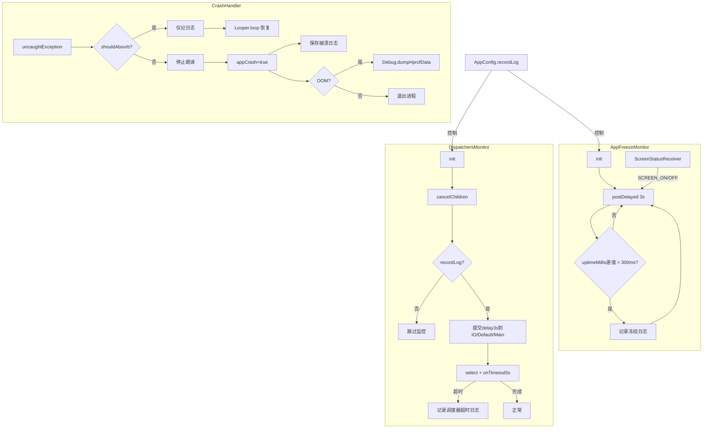
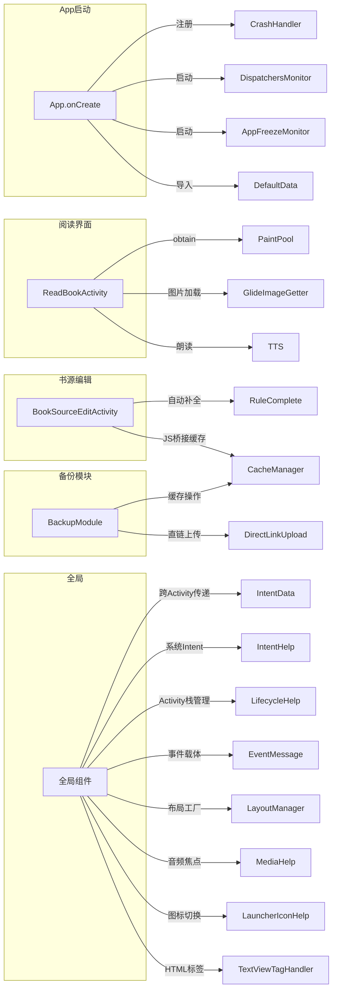

# Help 辅助层

> **核心问题**：`help/` 目录下有哪些辅助工具类？各自如何实现？
> **答案**：20+ 辅助类，覆盖应用监控（ANR/崩溃/协程调度）、数据传递（Intent/事件总线）、渲染优化（Paint池/Canvas录制）、规则辅助（补全/大数据）、媒体管理（TTS/音频焦点）、缓存系统（三级LRU+Room+文件）、默认数据管理等。

---

## 目录结构

```
help/
├── AppFreezeMonitor.kt     — 应用冻结检测（Doze/App Standby）
├── CrashHandler.kt         — 全局崩溃处理器
├── DispatchersMonitor.kt   — 协程调度器超时监控
├── DirectLinkUpload.kt     — 直链上传服务
├── ExecutorService.kt      — 全局单线程 Executor
├── EventMessage.kt         — 通用事件消息载体
├── IntentData.kt           — 跨 Activity 大对象传递
├── IntentHelp.kt           — 常用系统 Intent 构建
├── LifecycleHelp.kt        — Activity/Service 生命周期追踪
├── LayoutManager.kt        — RecyclerView LayoutManager 工厂
├── MediaHelp.kt            — 音频焦点管理 + MediaSession
├── PaintPool.kt            — Paint 对象池
├── RuleBigDataHelp.kt      — 规则大数据持久化
├── RuleComplete.kt         — 规则自动补全
├── TTS.kt                  — 系统 TTS 封装
├── LauncherIconHelp.kt     — 桌面图标动态更换
├── GlideImageGetter.kt     — HTML  Glide 图片加载
├── CacheManager.kt         — 三级缓存（内存LRU+Room+文件）
├── TextViewTagHandler.kt   — HTML 自定义标签处理
├── DefaultData.kt          — 默认数据管理与版本升级
├── book/                   — 书籍辅助（6文件）
├── config/                 — 配置辅助（7文件，AppConfig/ThemeConfig/ReadBookConfig等）
├── content/                — 内容辅助（2文件，WebBook/BookContent等）
├── coroutine/              — 协程工具（4文件，详见 tools-infrastructure.md）
├── crypto/                 — 加密工具（3文件，详见 tools-infrastructure.md）
├── glide/                  — Glide 集成（13文件）
├── gsyVideo/               — GSYVideo 集成（9文件）
├── http/                   — HTTP 辅助（2文件，SSLHelper/OkHttpHelper）
├── update/                 — 版本更新（4文件）
├── webView/                — WebView 池化（3文件）
├── rhino/                  — Rhino 绑定（2文件）
└── source/                 — 源辅助（2文件，SourceAnalyzer/BookListWait）
```

> 子目录 `config/`、`content/`、`http/`、`coroutine/`、`crypto/` 等的详细说明见其他文档（config-system.md、content-pipeline.md、tools-infrastructure.md）。

---

## 模块总览

```mermaid
graph TB
    subgraph 监控
        AFM[AppFreezeMonitor]
        CH[CrashHandler]
        DM[DispatchersMonitor]
    end
    subgraph 数据传递
        ID[IntentData]
        EM[EventMessage]
        IH[IntentHelp]
    end
    subgraph 生命周期与布局
        LH[LifecycleHelp]
        LM[LayoutManager]
    end
    subgraph 渲染优化
        PP[PaintPool]
        GIG[GlideImageGetter]
        TTH[TextViewTagHandler]
    end
    subgraph 规则辅助
        RC[RuleComplete]
        RBD[RuleBigDataHelp]
    end
    subgraph 媒体管理
        TTS[TTS]
        MH[MediaHelp]
        LIH[LauncherIconHelp]
    end
    subgraph 缓存系统
        CM[CacheManager]
        ACM[AppCacheManager]
        WCM[WebCacheManager]
    end
    subgraph 其他
        DLU[DirectLinkUpload]
        ES[ExecutorService]
        DD[DefaultData]
    end

    App --> AFM & CH & DM & DD
    ReadBookActivity --> PP & GIG & TTS
    书源编辑 --> RC & CM
    备份模块 --> DLU & CM
    全局 --> ID & IH & LH & EM & LM & MH & LIH & TTH

    CM -->|内存层| LRU[LruCache 50MB]
    CM -->|数据库层| Room[Room CacheDao]
    CM -->|文件层| ACache[ACache ByteArray]
    WCM -->|JS桥接| CM
    ACM --> CM
```



---

## 1. 应用监控三件套

### 1.1 AppFreezeMonitor — 应用冻结检测

[AppFreezeMonitor.kt](file:///f:/myself/github/WeAgentChat/temp/legado/app/src/main/java/io/legado/app/help/AppFreezeMonitor.kt)

**类型**：`object` 单例

| API | 说明 |
|-----|------|
| `init(context)` | 初始化监控 |
| `handler` | 独立 HandlerThread 的 Handler |
| `screenStatusReceiver` | 屏幕状态广播接收器 |

**实现原理**：每 3 秒 `handler.postDelayed` 对比 `SystemClock.uptimeMillis()` 差值，超出 300ms 判定为冻结。内部类 `ScreenStatusReceiver` 监听 `ACTION_SCREEN_ON/OFF`。仅在 `AppConfig.recordLog=true` 时激活。

**监控流程**：



### 1.2 CrashHandler — 全局崩溃处理

[CrashHandler.kt](file:///f:/myself/github/WeAgentChat/temp/legado/app/src/main/java/io/legado/app/help/CrashHandler.kt)

**类型**：普通类（需 Context 构造），实现 `Thread.UncaughtExceptionHandler`

| API | 说明 |
|-----|------|
| 构造自动注册为默认 Handler | |
| `saveCrashInfo2File(ex)` | 保存崩溃日志（companion） |
| `doHeapDump(manually)` | OOM 堆转储（companion） |

**关键实现**：
- `uncaughtException` 先判断 `shouldAbsorb`（过滤 `CannotDelairBroadcastException` 和特定 `SecurityException`），可吸收的异常仅记日志并 `Looper.loop()` 恢复
- 不可吸收的：停止朗读 → 标记 `appCrash=true` → 保存崩溃日志 → OOM 时 `Debug.dumpHprofData`
- 日志保存至 `AppConfig.backupPath/crash/` 和 `externalCacheDir/crash/`，自动清理 7 天前文件

### 1.3 DispatchersMonitor — 协程调度器监控

[DispatchersMonitor.kt](file:///f:/myself/github/WeAgentChat/temp/legado/app/src/main/java/io/legado/app/help/DispatchersMonitor.kt)

**类型**：`object` 单例

| API | 说明 |
|-----|------|
| `init()` | 启动/重启监控 |

**实现原理**：对 `Dispatchers.IO/Default/Main` 各提交 `delay(3000)` 任务，用 `select` + `onTimeout(5000)` 检测超时。5 秒未完成则记录日志。`init()` 先 `cancelChildren` 再按 `AppConfig.recordLog` 决定是否启动。

---

## 2. 数据传递

### 2.1 IntentData — 跨 Activity 大对象传递

[IntentData.kt](file:///f:/myself/github/WeAgentChat/temp/legado/app/src/main/java/io/legado/app/help/IntentData.kt)

**类型**：`object` 单例

| API | 说明 |
|-----|------|
| `put(key, data)` → String | 存储大对象 |
| `put(data)` → String | 自动生成时间戳 key |
| `get<T>(key)` → T? | 一次性取出后自动移除 |

**关键**：`MutableMap<String, Any>` 存储；`@Synchronized` 线程安全；`get` 后立即 `remove`（一次性消费语义）。

### 2.2 EventMessage — 通用事件载体

[EventMessage.kt](file:///f:/myself/github/WeAgentChat/temp/legado/app/src/main/java/io/legado/app/help/EventMessage.kt)

| 字段/方法 | 说明 |
|-----------|------|
| `what: Int?` | 事件类型 |
| `tag: String?` | 事件标签 |
| `obj: Any?` | 事件数据 |
| `isFrom(tag)` / `maybeFrom(vararg tags)` | 来源判断 |
| `obtain(tag/what/obj)` | 工厂方法（类似 Android Message.obtain） |

### 2.3 IntentHelp — 常用 Intent

[IntentHelp.kt](file:///f:/myself/github/WeAgentChat/temp/legado/app/src/main/java/io/legado/app/help/IntentHelp.kt)

**类型**：`object` 单例

| API | 说明 |
|-----|------|
| `getBrowserIntent(url)` | 打开浏览器 |
| `openTTSSetting()` | 打开 TTS 设置 |
| `toInstallUnknown(context)` | 跳转安装未知来源设置 |

---

## 3. 生命周期与布局

### 3.1 LifecycleHelp — 生命周期追踪

[LifecycleHelp.kt](file:///f:/myself/github/WeAgentChat/temp/legado/app/src/main/java/io/legado/app/help/LifecycleHelp.kt)

**类型**：`object` 单例，实现 `Application.ActivityLifecycleCallbacks`

| API | 说明 |
|-----|------|
| `activitySize()` | 当前 Activity 数量 |
| `isExistActivity(clazz)` | Activity 是否存在 |
| `finishActivity(vararg classes)` | 结束指定 Activity |
| `setOnAppFinishedListener(callback)` | 应用退出回调 |
| `onServiceCreate/Destroy(service)` | Service 生命周期追踪 |

**关键**：`WeakReference` 持有列表；`onActivityDestroyed/onServiceDestroy` 中检测列表为空时触发 `onAppFinished`。

### 3.2 LayoutManager — 布局管理器工厂

[LayoutManager.kt](file:///f:/myself/github/WeAgentChat/temp/legado/app/src/main/java/io/legado/app/help/LayoutManager.kt)

**类型**：`object` 单例

| API | 说明 |
|-----|------|
| `linear()` / `linear(orientation, reverseLayout)` | LinearLayoutManager 工厂 |
| `grid(spanCount)` / `grid(spanCount, orientation, reverseLayout)` | GridLayoutManager 工厂 |
| `staggeredGrid(spanCount, orientation)` | StaggeredGridLayoutManager 工厂 |

工厂模式：`LayoutManagerFactory` 接口 + `create(recyclerView)` 返回对应 LayoutManager。

---

## 4. 渲染优化

### 4.1 PaintPool — Paint 对象池

[PaintPool.kt](file:///f:/myself/github/WeAgentChat/temp/legado/app/src/main/java/io/legado/app/help/PaintPool.kt)

**类型**：`object` 单例，继承 `BaseSafeObjectPool<Paint>(8)`

池容量 8；`create()` 返回新 `Paint()`；`recycle()` 时用空 Paint 重置状态再归还。用于阅读界面频繁创建 Paint 的场景。

### 4.2 GlideImageGetter — HTML 图片加载

[GlideImageGetter.kt](file:///f:/myself/github/WeAgentChat/temp/legado/app/src/main/java/io/legado/app/help/GlideImageGetter.kt)

**类型**：普通类，实现 `Html.ImageGetter` + `Drawable.Callback`

| API | 说明 |
|-----|------|
| 构造 `(context, textView, lifecycle, availableWidth, sourceOrigin?)` | |
| `start()` / `stop()` / `clear()` | 控制 GIF 动画与资源释放 |

**三路加载**：
1. Base64 SVG → `SvgUtils.createDrawable` + 尺寸计算
2. 已缓存 → 直接返回
3. 网络/本地 → Glide 加载

`GlideUrlDrawable` 支持 GIF 动画；`sourceOrigin` 传入书源用于 `AnalyzeUrl` 解析带认证的图片 URL；尺寸计算支持百分比宽度、center/right 对齐。

### 4.3 TextViewTagHandler — HTML 自定义标签

[TextViewTagHandler.kt](file:///f:/myself/github/WeAgentChat/temp/legado/app/src/main/java/io/legado/app/help/TextViewTagHandler.kt)

**类型**：普通类，实现 `Html.TagHandler`

| 标签 | 渲染方式 |
|------|----------|
| `<button>` | 格式 `name@onclick:action` → `RoundedButtonSpan`（圆角矩形+居中文字+ClickableSpan） |
| `<hr>` | 替换为 `HR_PLACE_CHAR` → `HorizontalRuleSpan`（ReplacementSpan 绘制横线） |

`RoundedButtonSpan` 使用 `GradientDrawable` 绘制圆角背景，配色取自 `ThemeStore.accentColor`。

---

## 5. 规则辅助

### 5.1 RuleComplete — 规则自动补全

[RuleComplete.kt](file:///f:/myself/github/WeAgentChat/temp/legado/app/src/main/java/io/legado/app/help/RuleComplete.kt)

**类型**：`object` 单例

| API | 说明 |
|-----|------|
| `autoComplete(rules, preRule?, type)` | type: 1=文字 2=链接 3=图片 |

**三层正则补全**：
- `needComplete` 匹配尾部 `&&`/`%%`/`||`/行尾需补全位置
- `notComplete` 跳过含 JS/JSON/模板的复杂规则
- XPath 补全 `//text()`/`//@href`/`//@src`；JSOUP/CSS 补全 `@text`/`@href`/`@src`
- 分离 `##` 尾部正则不参与补全

### 5.2 RuleBigDataHelp — 规则大数据持久化

[RuleBigDataHelp.kt](file:///f:/myself/github/WeAgentChat/temp/legado/app/src/main/java/io/legado/app/help/RuleBigDataHelp.kt)

**类型**：`object` 单例

| API | 说明 |
|-----|------|
| `putBookVariable(bookUrl, key, value)` | 书籍级变量存储 |
| `getBookVariable(bookUrl, key)` | 书籍级变量读取 |
| `putChapterVariable(bookUrl, chapterUrl, key, value)` | 章节级变量存储 |
| `getChapterVariable(bookUrl, chapterUrl, key)` | 章节级变量读取 |
| `getDanmakuFile(bookUrl, chapterUrl)` | 弹幕文件获取 |
| `putRssVariable(origin, link, key, value)` | RSS源变量存储 |
| `clearInvalid()` | 清理无效数据 |

**文件目录结构**：`externalFiles/ruleData/{book,rss}/`；key/url 经 MD5 编码为文件名；变量以 `.txt` 存储；`bookUrl.txt`/`origin.txt` 保留原始 URL；`clearInvalid` 遍历文件检查 DAO 中源是否仍存在。

---

## 6. 媒体管理

### 6.1 TTS — 系统 TTS 封装

[TTS.kt](file:///f:/myself/github/WeAgentChat/temp/legado/app/src/main/java/io/legado/app/help/TTS.kt)

**类型**：普通类

| API | 说明 |
|-----|------|
| `speak(text)` | 朗读文本 |
| `stop()` | 停止 |
| `clearTts()` | 释放 TTS 引擎 |
| `isSpeaking` | 是否正在朗读 |
| `setSpeakStateListener(listener)` | 状态监听 |

**关键**：懒初始化 `TextToSpeech`；文本按 `\n` 分段逐段 `QUEUE_ADD`；朗读出错重建 TTS 引擎；`onDone` 后 60 秒无新朗读自动 `shutdown` 释放资源。

### 6.2 MediaHelp — 音频焦点管理

[MediaHelp.kt](file:///f:/myself/github/WeAgentChat/temp/legado/app/src/main/java/io/legado/app/help/MediaHelp.kt)

**类型**：`object` 单例

| API | 说明 |
|-----|------|
| `MEDIA_SESSION_ACTIONS` | 支持的 PlaybackState 动作位掩码 |
| `buildAudioFocusRequestCompat(listener)` | 构建音频焦点请求 |
| `requestFocus(focusRequest)` | 请求音频焦点 |
| `playSilentSound(context)` | Android 8 Oreo hack，播放静音音频激活媒体按钮 |

### 6.3 LauncherIconHelp — 桌面图标更换

[LauncherIconHelp.kt](file:///f:/myself/github/WeAgentChat/temp/legado/app/src/main/java/io/legado/app/help/LauncherIconHelp.kt)

**类型**：`object` 单例

| API | 说明 |
|-----|------|
| `changeIcon(icon)` | 切换启动器图标（Launcher1-7） |

预注册 7 个 `ComponentName`，`changeIcon` 启用目标组件、禁用其余；使用 `DONT_KILL_APP` 避免杀进程；仅 Android 8+ 支持。

---

## 7. 缓存系统

### 7.1 CacheManager — 三级缓存

[CacheManager.kt](file:///f:/myself/github/WeAgentChat/temp/legado/app/src/main/java/io/legado/app/help/CacheManager.kt)

**类型**：`object` 单例（`@Keep` 供 JS 调用）

| API | 说明 |
|-----|------|
| `put(key, value, saveTime)` | 写入（内存+持久） |
| `putMemory(key, value)` | 仅写内存 |
| `getFromMemory(key)` | 从内存读 |
| `get(key)` / `get(key, onlyDisk)` | 读取 |
| `putFile` / `getFile` / `delete` | 文件缓存操作 |

**三级缓存**：
1. 内存层：`LruCache<String, Any>(50MB)`，`sizeOf` 按字符串内存计算
2. 数据库层：`appDb.cacheDao` Room 存储，带 `deadline` 过期
3. 文件层：`ACache` 存储 ByteArray

**缓存读写流程**：

```mermaid
flowchart TB
    subgraph 写入流程 put
        PUT[put key/value/saveTime] --> MEM_W[写入内存 LruCache]
        PUT --> DB_W[写入 Room CacheDao<br/>deadline=now+saveTime]
        PUT -->|onlyDisk=false| SKIP_FILE[跳过文件层]
    end

    subgraph 读取流程 get
        GET[get key] --> MEM_R{内存命中?}
        MEM_R -->|命中| RETURN_MEM[返回内存值]
        MEM_R -->|未命中| DB_R{数据库命中?}
        DB_R -->|命中+未过期| RESTORE_MEM[回填内存 LruCache] --> RETURN_DB[返回数据库值]
        DB_R -->|命中+已过期| DB_DEL[删除过期记录] --> FILE_R
        DB_R -->|未命中| FILE_R{文件层命中?}
        FILE_R -->|命中| RESTORE_ALL[回填内存+数据库] --> RETURN_FILE[返回文件值]
        FILE_R -->|未命中| RETURN_NULL[返回 null]
    end

    subgraph 消费者
        JS[JS脚本] -->|@Keep| CM[CacheManager]
        WEBVIEW[WebView] -->|JS桥接| WCM[WebCacheManager] --> CM
        APP[应用代码] -->|直接调用| CM
        SOURCE[书源变量] --> ACM[AppCacheManager] --> CM
    end
```

### 7.2 AppCacheManager — 应用缓存

管理 `QueryTTF` 缓存（LruCache(4)）和源变量缓存。`clearSourceVariables()` 清除 `v_`/`userInfo_`/`loginHeader_`/`sourceVariable_` 前缀缓存。

### 7.3 WebCacheManager — WebView JS 桥接

`@JavascriptInterface` 注解的安全代理，暴露 `CacheManager` 的方法给 WebView 中的 JavaScript 调用。

---

## 8. 其他辅助

### 8.1 DirectLinkUpload — 直链上传

[DirectLinkUpload.kt](file:///f:/myself/github/WeAgentChat/temp/legado/app/src/main/java/io/legado/app/help/DirectLinkUpload.kt)

**类型**：`object` 单例

| API | 说明 |
|-----|------|
| `upLoad(fileName, file, contentType, rule)` | 上传文件并获取下载链接 |
| `getRule()` / `putConfig(rule)` / `delConfig()` | 规则管理 |
| `defaultRules` | 内置默认规则 |

**上传流程**：读取规则 → 可选 ZIP 压缩 → `AnalyzeUrl.upload()` → `AnalyzeRule.getString(downloadUrlRule)` 提取下载链接。规则通过 `ACache` 持久化。

### 8.2 ExecutorService — 全局单线程 Executor

仅一行：`val globalExecutor: ExecutorService by lazy { Executors.newSingleThreadExecutor() }`，供非协程场景的后台顺序执行。

### 8.3 DefaultData — 默认数据管理

[DefaultData.kt](file:///f:/myself/github/WeAgentChat/temp/legado/app/src/main/java/io/legado/app/help/DefaultData.kt)

**类型**：`object` 单例

| API | 说明 |
|-----|------|
| `upVersion()` | 版本升级时按需导入默认数据 |
| `httpTTS` / `readConfigs` / `txtTocRules` / ... | 懒加载的默认数据列表 |

所有默认数据从 `assets/defaultData/` JSON 文件懒加载；`upVersion` 在版本号变更时按 `LocalConfig.needUp*` 标志导入。

---

## 9. 与其他模块的依赖关系


