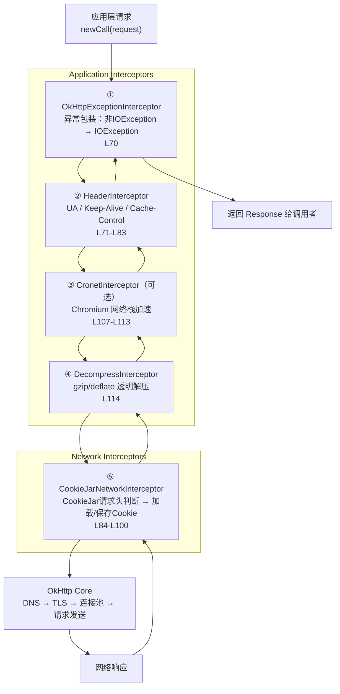
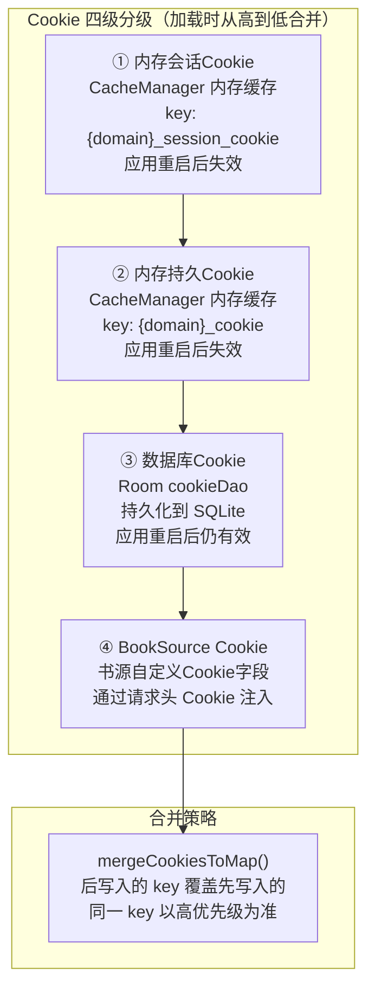
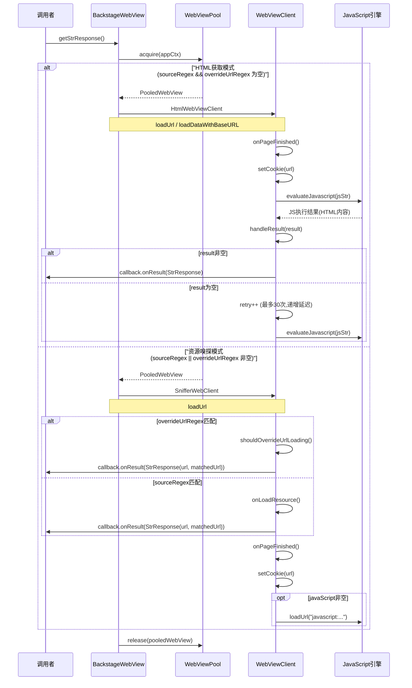
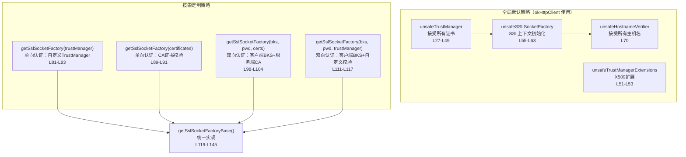

# HTTP辅助层

> **核心问题**：Legado 作为书源引擎，需要与成千上万个结构各异的网站交互——有的自签证书、有的需要 Cookie 会话、有的动态渲染、有的用 Cronet 加速。如何在一个统一的 HTTP 层中兼容这些异构需求，同时保持书源规则引擎的简洁调用接口？
>
> **答案**：通过 14 个文件的分层设计，将 OkHttp 基础能力、SSL 信任策略、Cookie 四级分级、WebView 双模式渲染、Cronet 加速引擎封装为统一门面。上层（WebBook / RssReadByHttp）只需调用 `okHttpClient` 或 `BackstageWebView.getStrResponse()`，底层复杂性全部内聚在拦截器链与分层存储中。

---

## 目录

- [架构总览](#架构总览)
- [1. okHttpClient 拦截器链](#1-okhttpclient-拦截器链)
- [2. CookieManager 会话/持久分层机制](#2-cookiemanager-会话持久分层机制)
- [3. BackstageWebView 双模式详解](#3-backstagewebview-双模式详解)
- [4. SSLHelper 信任策略](#4-sslhelper-信任策略)
- [5. DecompressInterceptor 解压流程](#5-decompressinterceptor-解压流程)
- [6. Cronet 加速引擎封装](#6-cronet-加速引擎封装)
- [7. OkHttpUtils 请求工具集](#7-okhttputils-请求工具集)
- [8. ObsoleteUrlFactory 兼容桥](#8-obsoleteurlfactory-兼容桥)
- [9. StrResponse 字符串响应封装](#9-strresponse-字符串响应封装)
- [10. 辅助组件](#10-辅助组件)
- [文件索引](#文件索引)

---

## 架构总览

HTTP 辅助层位于 `io.legado.app.help.http` 包下，是 Legado 网络请求的核心基础设施。上层调用者（WebBook、RssReadByHttp、AnalyzeUrl 等）通过本层获取统一的 HTTP 能力，无需关心底层差异。

```
┌─────────────────────────────────────────────────────┐
│                    上层调用者                          │
│  WebBook / RssReadByHttp / AnalyzeUrl / BookSource   │
└──────────────┬──────────────────┬────────────────────┘
               │                  │
       ┌───────▼───────┐  ┌──────▼──────────┐
       │  okHttpClient  │  │ BackstageWebView │
       │  (标准HTTP)     │  │  (JS渲染/嗅探)   │
       └───────┬───────┘  └──────┬──────────┘
               │                  │
    ┌──────────▼──────────────────▼──────────┐
    │           拦截器链 & 分层存储              │
    │  ExceptionIntercept → Header → CookieJar │
    │  → Cronet → Decompress                   │
    │  + SSLHelper + CookieManager(4级)        │
    └─────────────────────────────────────────┘
```

---

## 1. okHttpClient 拦截器链

### 源文件

[HttpHelper.kt](file:///f:/myself/github/WeAgentChat/temp/legado/app/src/main/java/io/legado/app/help/http/HttpHelper.kt#L51) — `okHttpClient` 懒加载定义（L51-L127）

### 拦截器链路图



### 关键配置参数

| 参数 | 值 | 行号 |
|------|-----|------|
| connectTimeout | 15s | L59 |
| writeTimeout | 15s | L60 |
| readTimeout | 60s | L61 |
| callTimeout | 60s | L62 |
| retryOnConnectionFailure | true | L65 |
| followRedirects | true | L68 |
| followSslRedirects | true | L69 |
| SSL策略 | unsafeSSLSocketFactory + unsafeHostnameVerifier | L64, L66 |
| ConnectionSpec | MODERN_TLS + COMPATIBLE_TLS + CLEARTEXT | L52-L56 |
| DNS缓存 | AppConfig.addressCache 命中则直连 | L101-L106 |

### 拦截器详解

#### ① OkHttpExceptionInterceptor（L70）

[OkHttpExceptionInterceptor.kt](file:///f:/myself/github/WeAgentChat/temp/legado/app/src/main/java/io/legado/app/help/http/OkHttpExceptionInterceptor.kt#L7)

将 OkHttp 内部抛出的非 `IOException`（如 `RuntimeException`、`Error`）包装为 `IOException`，确保上层只需捕获 `IOException` 即可覆盖所有网络异常场景。

```kotlin
// L10-L18
override fun intercept(chain: Interceptor.Chain): Response {
    try {
        return chain.proceed(chain.request())
    } catch (e: IOException) {
        throw e
    } catch (e: Throwable) {
        throw IOException(e)
    }
}
```

#### ② HeaderInterceptor（L71-L83）

匿名拦截器，统一注入请求头：

- **UA 头**：若请求未带 `UA_NAME` 头，注入 `AppConfig.userAgent`；若值为 `"null"` 则移除（L74-L78）
- **Keep-Alive**：`Keep-Alive: 300`（L79）
- **Connection**：`Connection: Keep-Alive`（L80）
- **Cache-Control**：`Cache-Control: no-cache`（L81）

#### ③ CronetInterceptor（可选，L107-L113）

当 `AppConfig.isCronet` 开启且 `Cronet.loader.install()` 成功时，将 [Cronet](file:///f:/myself/github/WeAgentChat/temp/legado/app/src/main/java/io/legado/app/help/http/Cronet.kt#L7) 拦截器插入应用拦截器链，使用 Chromium 网络栈替代 OkHttp 的网络层。

#### ④ DecompressInterceptor（L114）

[DecompressInterceptor.kt](file:///f:/myself/github/WeAgentChat/temp/legado/app/src/main/java/io/legado/app/help/http/DecompressInterceptor.kt#L14) — 详见[第5节](#5-decompressinterceptor-解压流程)。

#### ⑤ CookieJarNetworkInterceptor（L84-L100）

网络拦截器，根据请求头中的 `CookieJar` 标记决定是否启用 Cookie 管理：

1. **请求阶段**：若请求带 `CookieJar` 头 → 移除该标记头 → 调用 `CookieManager.loadRequest()` 注入 Cookie（L86-L91）
2. **响应阶段**：若启用了 CookieJar → 调用 `CookieManager.saveResponse()` 保存响应 Cookie（L94-L98）

### okHttpClientManga（L129-L147）

漫画专用客户端，在 `okHttpClient` 基础上新增两个拦截器：

1. **限流拦截器**（位置 1）：`ReadManga.rateLimiter.withLimitBlocking` 控制漫画请求频率（L140-L143）
2. **进度拦截器**（位置 2）：`ProgressResponseBody` 包装响应体，支持下载进度监听（L132-L138）

### 代理客户端（L152-L191）

`getProxyClient(proxy)` 函数支持 HTTP/SOCKS4/SOCKS5 代理，代理实例按 `proxy` 字符串缓存在 `proxyClientCache`（L25-L27）中。

代理 URL 格式：`(http|socks4|socks5)://host:port(@username@password)`

---

## 2. CookieManager 会话/持久分层机制

### 源文件

- [CookieManager.kt](file:///f:/myself/github/WeAgentChat/temp/legado/app/src/main/java/io/legado/app/help/http/CookieManager.kt) — Cookie 管理门面
- [CookieStore.kt](file:///f:/myself/github/WeAgentChat/temp/legado/app/src/main/java/io/legado/app/help/http/CookieStore.kt) — Cookie 持久化存储
- [api/CookieManagerInterface.kt](file:///f:/myself/github/WeAgentChat/temp/legado/app/src/main/java/io/legado/app/help/http/api/CookieManagerInterface.kt) — 抽象接口

### 四级 Cookie 优先级



### Cookie 加载流程

`CookieStore.getCookie(url)` [CookieStore.kt#L69](file:///f:/myself/github/WeAgentChat/temp/legado/app/src/main/java/io/legado/app/help/http/CookieStore.kt#L69)：

1. 调用 `getCookieNoSession(url)` 获取持久 Cookie（先查内存缓存 `CacheManager.getFromMemory("${domain}_cookie")`，未命中则查数据库 `appDb.cookieDao.get(domain)`）—— [CookieManager.kt#L131-L141](file:///f:/myself/github/WeAgentChat/temp/legado/app/src/main/java/io/legado/app/help/http/CookieManager.kt#L131)
2. 获取会话 Cookie `CookieManager.getSessionCookie(domain)`（从 `CacheManager.getFromMemory("${domain}_session_cookie")`）—— [CookieManager.kt#L81-L83](file:///f:/myself/github/WeAgentChat/temp/legado/app/src/main/java/io/legado/app/help/http/CookieManager.kt#L81)
3. `mergeCookiesToMap()` 合并，后写入覆盖先写入—— [CookieManager.kt#L101-L107](file:///f:/myself/github/WeAgentChat/temp/legado/app/src/main/java/io/legado/app/help/http/CookieManager.kt#L101)
4. 溢出保护：若合并后 Cookie 总长度 > 4096，随机删除 key 直至不超限—— [CookieStore.kt#L78-L83](file:///f:/myself/github/WeAgentChat/temp/legado/app/src/main/java/io/legado/app/help/http/CookieStore.kt#L78)

### Cookie 保存流程

`CookieManager.saveResponse(response)` [CookieManager.kt#L29](file:///f:/myself/github/WeAgentChat/temp/legado/app/src/main/java/io/legado/app/help/http/CookieManager.kt#L29)：

1. 从响应头解析 `Cookie.parseAll(url, headers)`—— [CookieManager.kt#L43](file:///f:/myself/github/WeAgentChat/temp/legado/app/src/main/java/io/legado/app/help/http/CookieManager.kt#L43)
2. 非持久 Cookie（`!it.persistent`）→ 会话 Cookie，存入 `CacheManager.putMemory("${domain}_session_cookie")`—— [CookieManager.kt#L45-L46](file:///f:/myself/github/WeAgentChat/temp/legado/app/src/main/java/io/legado/app/help/http/CookieManager.kt#L45)
3. 持久 Cookie → `CookieStore.replaceCookie()` 合并写入内存 + 数据库—— [CookieManager.kt#L48-L49](file:///f:/myself/github/WeAgentChat/temp/legado/app/src/main/java/io/legado/app/help/http/CookieManager.kt#L48)

### CookieStore 双写

`CookieStore.setCookie(url, cookie)` [CookieStore.kt#L26](file:///f:/myself/github/WeAgentChat/temp/legado/app/src/main/java/io/legado/app/help/http/CookieStore.kt#L26)：

- **内存写**：`CacheManager.putMemory("${domain}_cookie", cookie)`（L29）
- **数据库写**：`appDb.cookieDao.insert(Cookie(domain, cookie))`（L30-L31）

### CookieManagerInterface

[api/CookieManagerInterface.kt](file:///f:/myself/github/WeAgentChat/temp/legado/app/src/main/java/io/legado/app/help/http/api/CookieManagerInterface.kt#L3) 定义 6 个核心操作：

| 方法 | 行号 | 说明 |
|------|------|------|
| `setCookie(url, cookie?)` | L8 | 保存 Cookie |
| `replaceCookie(url, cookie)` | L12 | 合并替换 Cookie |
| `getCookie(url)` | L16 | 获取合并后的 Cookie |
| `removeCookie(url)` | L20 | 删除 Cookie |
| `cookieToMap(cookie)` | L25 | Cookie 字符串 → Map |
| `mapToCookie(cookieMap)` | L26 | Map → Cookie 字符串 |

### WebView Cookie 同步

- **OkHttp → WebView**：`CookieManager.applyToWebView(url)` 将 OkHttp Cookie 同步到 WebView CookieManager—— [CookieManager.kt#L143-L151](file:///f:/myself/github/WeAgentChat/temp/legado/app/src/main/java/io/legado/app/help/http/CookieManager.kt#L143)
- **WebView → OkHttp**：`CookieStore.setWebCookie(url, cookie)` 将 WebView Cookie 同步回来—— [CookieStore.kt#L37-L49](file:///f:/myself/github/WeAgentChat/temp/legado/app/src/main/java/io/legado/app/help/http/CookieStore.kt#L37)
- **BackstageWebView 自动同步**：`onPageFinished` 回调中调用 `CookieManager.getInstance().getCookie(url)` → `CookieStore.setCookie(tag, cookie)`—— [BackstageWebView.kt#L183-L190](file:///f:/myself/github/WeAgentChat/temp/legado/app/src/main/java/io/legado/app/help/http/BackstageWebView.kt#L183)

---

## 3. BackstageWebView 双模式详解

### 源文件

[BackstageWebView.kt](file:///f:/myself/github/WeAgentChat/temp/legado/app/src/main/java/io/legado/app/help/http/BackstageWebView.kt) — 后台 WebView（392 行）

### 模式选择逻辑

[BackstageWebView.kt#L161-L165](file:///f:/myself/github/WeAgentChat/temp/legado/app/src/main/java/io/legado/app/help/http/BackstageWebView.kt#L161)：

```kotlin
if (sourceRegex.isNullOrBlank() && overrideUrlRegex.isNullOrBlank()) {
    webView.webViewClient = HtmlWebViewClient()   // HTML获取模式
} else {
    webView.webViewClient = SnifferWebClient()     // 资源嗅探模式
}
```

### 双模式时序图



### HTML获取模式 — HtmlWebViewClient

[BackstageWebView.kt#L192-L302](file:///f:/myself/github/WeAgentChat/temp/legado/app/src/main/java/io/legado/app/help/http/BackstageWebView.kt#L192)

**触发条件**：`sourceRegex` 和 `overrideUrlRegex` 均为空（L161）

**工作流程**：

1. 加载页面（`loadUrl` 或 `loadDataWithBaseURL`）
2. `onPageFinished` 回调触发后，延迟 `100ms + delayTime` 执行 JS（L218）
3. 默认 JS 为 `document.documentElement.outerHTML`（L384），获取完整渲染后 DOM
4. **重试机制**（`EvalJsRunnable`，L230-L300）：
   - 若 JS 返回空或 `"null"`，按递增间隔重试（200ms → 400ms → 600ms → 800ms → 1000ms，L236）
   - 最多重试 30 次，超时则报错 `NoStackTraceException("js执行超时")`（L264-L265）
5. **重定向感知**：跟踪 `shouldOverrideUrlLoading` 中的 `isRedirect` 标记，构建包含 `priorResponse(code=302)` 的 StrResponse（L280-L298）

**JS注入增强**（`isRule = true` 时，L114-L131）：
- 注入 `WebCacheManager`（nameCache）、`BaseSource`（nameSource）、`WebJsExtensions`（nameJava）三个 JavaScript Interface
- 注入 `getInjectionString` 前缀到 JS 执行字符串（L238-L240）
- 设置 `WebChromeClient` 监听控制台日志，转发到 `Debug.log()`（L118-L126）

### 资源嗅探模式 — SnifferWebClient

[BackstageWebView.kt#L304-L381](file:///f:/myself/github/WeAgentChat/temp/legado/app/src/main/java/io/legado/app/help/http/BackstageWebView.kt#L304)

**触发条件**：`sourceRegex` 或 `overrideUrlRegex` 非空（L163-L164）

**两种嗅探路径**：

| 嗅探方式 | 回调方法 | 匹配字段 | 行号 |
|----------|----------|----------|------|
| URL重写嗅探 | `shouldOverrideUrlLoading` | `overrideUrlRegex` | L306-L338 |
| 资源加载嗅探 | `onLoadResource` | `sourceRegex` | L340-L352 |

**URL重写嗅探**（L324-L338）：拦截 WebView 的 URL 跳转，若跳转 URL 匹配 `overrideUrlRegex`，立即返回匹配的 URL 作为结果。典型场景：视频网站通过 302 重定向暴露真实媒体地址。

**资源加载嗅探**（L340-L352）：拦截 WebView 的资源加载请求，若资源 URL 匹配 `sourceRegex`，立即返回匹配的资源 URL。典型场景：音频/视频网站通过 `<video>` 或 `<audio>` 标签加载媒体资源。

### 通用配置

| 配置项 | 说明 | 行号 |
|--------|------|------|
| WebView 池 | `WebViewPool.acquire()` / `release()` | L153, L170 |
| 禁止图片加载 | `settings.blockNetworkImage = true` | L158 |
| UA 设置 | 优先 `headerMap[UA_NAME]`，否则 `AppConfig.userAgent` | L159 |
| 缓存策略 | `cacheFirst=true` 时 `LOAD_CACHE_ELSE_NETWORK` | L160 |
| SSL 错误 | 忽略所有 SSL 错误 `handler.proceed()` | L227, L368 |
| 超时 | 默认 60s，可自定义 | L71 |
| JS默认延迟 | `javaScript==null && delayTime==0` 时设 900ms | L90-L91 |

---

## 4. SSLHelper 信任策略

### 源文件

[SSLHelper.kt](file:///f:/myself/github/WeAgentChat/temp/legado/app/src/main/java/io/legado/app/help/http/SSLHelper.kt) — SSL 辅助（194 行）

### 信任层级



### 全局默认策略（宽松模式）

OkHttp 客户端默认使用"信任一切"策略，这是为了兼容大量自签证书的电子书网站：

- `unsafeTrustManager`（L27-L49）：`X509TrustManager` 实现，`checkClientTrusted` 和 `checkServerTrusted` 均为空操作，`getAcceptedIssuers` 返回空数组
- `unsafeSSLSocketFactory`（L55-L63）：基于 `SSLContext("SSL")` + `unsafeTrustManager` 创建
- `unsafeHostnameVerifier`（L70）：`HostnameVerifier { _, _ -> true }`，接受所有主机名
- `unsafeTrustManagerExtensions`（L51-L53）：`X509TrustManagerExtensions` 包装，用于某些 Android API 需要

> **安全警告**（源码注释 L23-L26）：此方案存在安全漏洞，仅在阅读场景下可接受，生产级应用不应采用。

### 定制策略（严格模式）

四种 `getSslSocketFactory` 重载（L81-L117），最终都汇聚到 `getSslSocketFactoryBase()`（L119-L145）：

1. **prepareKeyManager**（L147-L159）：加载 BKS 客户端证书，用于双向认证
2. **prepareTrustManager**（L161-L184）：加载 X.509 CA 证书到 KeyStore → TrustManagerFactory → TrustManager[]
3. **chooseTrustManager**（L186-L193）：从 TrustManager[] 中选取 `X509TrustManager` 实现

---

## 5. DecompressInterceptor 解压流程

### 源文件

[DecompressInterceptor.kt](file:///f:/myself/github/WeAgentChat/temp/legado/app/src/main/java/io/legado/app/help/http/DecompressInterceptor.kt#L14)（45 行）

### 解压流程图

```
请求阶段:
  request.header("Accept-Encoding") == null && request.header("Range") == null ?
  ├─ Yes → transparentDecompress = true, 注入 "Accept-Encoding: gzip, deflate"
  └─ No  → transparentDecompress = false, 保持原始请求头

响应阶段:
  transparentDecompress && response.promisesBody() && body != EMPTY ?
  ├─ Yes → 检查 Content-Encoding 头
  │       ├─ "gzip"    → GZIPInputStream 解压
  │       ├─ "deflate" → InflaterInputStream(nowrap=true) 解压
  │       └─ 其他      → 原样返回（含 br 等）
  └─ No  → 原样返回
```

### 关键实现细节

- **透明解压**：仅在请求未显式指定 `Accept-Encoding` 时才自动注入并处理解压（L20-L23），避免与 OkHttp 内置解压冲突
- **移除响应头**：解压后移除 `Content-Encoding` 和 `Content-Length`（L40-L41），因为内容长度已变化
- **deflate nowrap**：使用 `Inflater(true)` 处理 deflate（L35），兼容部分服务器的非标准 zlib 格式

---

## 6. Cronet 加速引擎封装

### 源文件

[Cronet.kt](file:///f:/myself/github/WeAgentChat/temp/legado/app/src/main/java/io/legado/app/help/http/Cronet.kt#L7)（29 行）

### 封装结构

```kotlin
object Cronet {
    val loader: LoaderInterface?          // CronetLoader 懒加载（L9-L11）
    fun preDownload()                     // 预下载 Cronet 库（L13-L15）
    val interceptor: Interceptor?         // CronetInterceptor(cookieJar)（L17-L19）

    interface LoaderInterface {           // 加载器抽象接口（L21-L26）
        fun install(): Boolean
        fun preDownload()
    }
}
```

### 集成方式

Cronet 拦截器在 `okHttpClient` 构建时条件插入（[HttpHelper.kt#L107-L113](file:///f:/myself/github/WeAgentChat/temp/legado/app/src/main/java/io/legado/app/help/http/HttpHelper.kt#L107)）：

1. `AppConfig.isCronet` 开关控制是否启用
2. `Cronet.loader?.install()` 尝试加载 Cronet 库（动态下载 so 库）
3. 加载成功后，`Cronet.interceptor` 作为应用拦截器插入链路
4. `CronetInterceptor` 构造时传入 `cookieJar`，确保 Cookie 一致性

Cronet 基于 Chromium 网络栈，提供 QUIC/HTTP2 等现代协议支持和更优的网络性能。

---

## 7. OkHttpUtils 请求工具集

### 源文件

[OkHttpUtils.kt](file:///f:/myself/github/WeAgentChat/temp/legado/app/src/main/java/io/legado/app/help/http/OkHttpUtils.kt)（198 行）

### 扩展函数一览

| 函数 | 行号 | 说明 |
|------|------|------|
| `OkHttpClient.newCallResponse(retry, builder)` | L29-L43 | 带重试的协程请求，返回 `Response` |
| `OkHttpClient.newCallResponseBody(retry, builder)` | L45-L50 | 带重试的协程请求，返回 `ResponseBody` |
| `OkHttpClient.newCallStrResponse(retry, builder)` | L52-L59 | 带重试的协程请求，返回 `StrResponse` |
| `Call.await()` | L61-L77 | OkHttp Call 的协程挂起扩展，支持取消 |
| `ResponseBody.text(encode?)` | L79-L95 | 智能编码检测响应体文本 |
| `ResponseBody.decompressed()` | L97-L111 | ZIP 压缩包解压（仅处理 `application/zip`） |
| `Request.Builder.addHeaders(headers)` | L113-L117 | 批量添加请求头 |
| `Request.Builder.get(url, queryMap, encoded)` | L119-L129 | 构建带查询参数的 GET 请求 |
| `Request.Builder.get(url, encodedQuery)` | L131-L135 | 构建带编码查询串的 GET 请求 |
| `Request.Builder.postForm(encodedForm)` | L139-L141 | 构建表单 POST 请求（编码字符串） |
| `Request.Builder.postForm(form, encoded)` | L144-L154 | 构建表单 POST 请求（Map 参数） |
| `Request.Builder.postMultipart(type, form)` | L156-L191 | 构建多部分 POST 请求 |
| `Request.Builder.postJson(json?)` | L193-L198 | 构建 JSON POST 请求 |

### 编码检测三级策略

`ResponseBody.text()` [OkHttpUtils.kt#L79](file:///f:/myself/github/WeAgentChat/temp/legado/app/src/main/java/io/legado/app/help/http/OkHttpUtils.kt#L79)：

1. **显式指定**：若 `encode` 参数非空，直接使用（L83-L85）
2. **HTTP 头判断**：`contentType().charset()` 从 Content-Type 头提取（L88-L89）
3. **内容嗅探**：`EncodingDetect.getHtmlEncode(responseBytes)` 基于字节流判断编码（L93）

---

## 8. ObsoleteUrlFactory 兼容桥

### 源文件

[ObsoleteUrlFactory.kt](file:///f:/myself/github/WeAgentChat/temp/legado/app/src/main/java/io/legado/app/help/http/ObsoleteUrlFactory.kt#L71)（1201 行）

### 定位

OkHttp 3.14 移除了 `OkUrlFactory`，此类提供等价功能，使 `HttpURLConnection` API 可以使用 OkHttp 实现（源码注释 L60-L68）。

### 核心结构

| 组件 | 行号 | 说明 |
|------|------|------|
| `ObsoleteUrlFactory` | L71 | 主类，实现 `URLStreamHandlerFactory` |
| `OkHttpURLConnection` | L132-L576 | HTTP 协议的 HttpURLConnection 适配 |
| `OutputStreamRequestBody` | L578-L646 | 请求体抽象基类 |
| `BufferedRequestBody` | L648-L676 | 缓冲式请求体 |
| `StreamedRequestBody` | L678-L697 | 流式请求体（Pipe 8192） |
| `DelegatingHttpsURLConnection` | L699-L961 | HTTPS 委托抽象类 |
| `OkHttpsURLConnection` | L963-L997 | HTTPS 协议适配 |
| `UnexpectedException` | L999-L1011 | 非 IOException/Error 异常包装 |

### CookieJar 集成

在 `buildCall()` 中（L323-L407），`ObsoleteUrlFactory` 独立添加了与 `okHttpClient` 相同的 CookieJar 网络拦截器（L381-L397），确保通过 `HttpURLConnection` 路径发出的请求也能享受 Cookie 管理。

---

## 9. StrResponse 字符串响应封装

### 源文件

[StrResponse.kt](file:///f:/myself/github/WeAgentChat/temp/legado/app/src/main/java/io/legado/app/help/http/StrResponse.kt#L16)（89 行）

### 三种构造方式

| 构造器 | 行号 | 场景 |
|--------|------|------|
| `StrResponse(rawResponse, body)` | L25-L28 | OkHttp 标准响应 → 字符串体 |
| `StrResponse(url, body)` | L30-L43 | 纯 URL + 内容（构造虚拟 200 响应） |
| `StrResponse(rawResponse, errorBody)` | L45-L48 | 错误响应 |

### 核心属性与方法

| 成员 | 行号 | 说明 |
|------|------|------|
| `raw: Response` | L17 | 原始 OkHttp Response |
| `body: String?` | L18 | 字符串响应体 |
| `errorBody: ResponseBody?` | L20 | 错误响应体 |
| `callTime: Int` | L21 | 请求调用次数 |
| `url(): String` | L56-L61 | 优先取 `networkResponse` 的 URL（重定向后的真实 URL） |
| `code(): Int` | L67-L69 | HTTP 状态码 |
| `isSuccessful()` | L79 | 是否成功 |

---

## 10. 辅助组件

### OkhttpUncaughtExceptionHandler

[OkhttpUncaughtExceptionHandler.kt](file:///f:/myself/github/WeAgentChat/temp/legado/app/src/main/java/io/legado/app/help/http/OkhttpUncaughtExceptionHandler.kt#L5)（10 行）

OkHttp Dispatcher 线程的未捕获异常处理器，将异常记录到 `AppLog.put()`（L8），避免线程静默崩溃。在 `okHttpClient` 构建时设置为 Dispatcher 线程工厂的 `uncaughtExceptionHandler`（[HttpHelper.kt#L123](file:///f:/myself/github/WeAgentChat/temp/legado/app/src/main/java/io/legado/app/help/http/HttpHelper.kt#L123)）。

### RequestMethod

[RequestMethod.kt](file:///f:/myself/github/WeAgentChat/temp/legado/app/src/main/java/io/legado/app/help/http/RequestMethod.kt#L3)（5 行）

HTTP 请求方法枚举：`GET`, `POST`, `HEAD`。

### cookieJar（HttpHelper 顶层变量）

[HttpHelper.kt#L29](file:///f:/myself/github/WeAgentChat/temp/legado/app/src/main/java/io/legado/app/help/http/HttpHelper.kt#L29)（L29-L49）

OkHttp 的 `CookieJar` 实现，但仅做轻量保存（`CacheManager.putMemory`），**未在 okHttpClient 中启用**（L63 注释 `//.cookieJar(cookieJar = cookieJar)`）。实际 Cookie 管理由网络拦截器中的 `CookieManager` 完成。此 `cookieJar` 主要传给 `CronetInterceptor` 使用。

---

## 文件索引

| 文件 | 行数 | 核心职责 |
|------|------|----------|
| [HttpHelper.kt](file:///f:/myself/github/WeAgentChat/temp/legado/app/src/main/java/io/legado/app/help/http/HttpHelper.kt) | 191 | HTTP 门面：okHttpClient / 代理客户端 / cookieJar |
| [OkHttpUtils.kt](file:///f:/myself/github/WeAgentChat/temp/legado/app/src/main/java/io/legado/app/help/http/OkHttpUtils.kt) | 198 | OkHttp 扩展函数：协程请求 / 编码检测 / 请求构建 |
| [OkHttpExceptionInterceptor.kt](file:///f:/myself/github/WeAgentChat/temp/legado/app/src/main/java/io/legado/app/help/http/OkHttpExceptionInterceptor.kt) | 20 | 异常包装拦截器 |
| [OkhttpUncaughtExceptionHandler.kt](file:///f:/myself/github/WeAgentChat/temp/legado/app/src/main/java/io/legado/app/help/http/OkhttpUncaughtExceptionHandler.kt) | 10 | Dispatcher 线程异常日志 |
| [SSLHelper.kt](file:///f:/myself/github/WeAgentChat/temp/legado/app/src/main/java/io/legado/app/help/http/SSLHelper.kt) | 194 | SSL 信任策略：全局宽松 / 按需严格 |
| [CookieManager.kt](file:///f:/myself/github/WeAgentChat/temp/legado/app/src/main/java/io/legado/app/help/http/CookieManager.kt) | 169 | Cookie 管理门面：加载/保存/合并/同步 |
| [CookieStore.kt](file:///f:/myself/github/WeAgentChat/temp/legado/app/src/main/java/io/legado/app/help/http/CookieStore.kt) | 137 | Cookie 持久化：双写内存+数据库 |
| [api/CookieManagerInterface.kt](file:///f:/myself/github/WeAgentChat/temp/legado/app/src/main/java/io/legado/app/help/http/api/CookieManagerInterface.kt) | 28 | Cookie 操作抽象接口 |
| [DecompressInterceptor.kt](file:///f:/myself/github/WeAgentChat/temp/legado/app/src/main/java/io/legado/app/help/http/DecompressInterceptor.kt) | 45 | gzip/deflate 透明解压拦截器 |
| [ObsoleteUrlFactory.kt](file:///f:/myself/github/WeAgentChat/temp/legado/app/src/main/java/io/legado/app/help/http/ObsoleteUrlFactory.kt) | 1201 | HttpURLConnection → OkHttp 兼容桥 |
| [BackstageWebView.kt](file:///f:/myself/github/WeAgentChat/temp/legado/app/src/main/java/io/legado/app/help/http/BackstageWebView.kt) | 392 | 后台 WebView：HTML 获取 / 资源嗅探双模式 |
| [Cronet.kt](file:///f:/myself/github/WeAgentChat/temp/legado/app/src/main/java/io/legado/app/help/http/Cronet.kt) | 29 | Cronet 加速引擎封装 |
| [RequestMethod.kt](file:///f:/myself/github/WeAgentChat/temp/legado/app/src/main/java/io/legado/app/help/http/RequestMethod.kt) | 5 | GET/POST/HEAD 枚举 |
| [StrResponse.kt](file:///f:/myself/github/WeAgentChat/temp/legado/app/src/main/java/io/legado/app/help/http/StrResponse.kt) | 89 | 字符串响应封装 |
