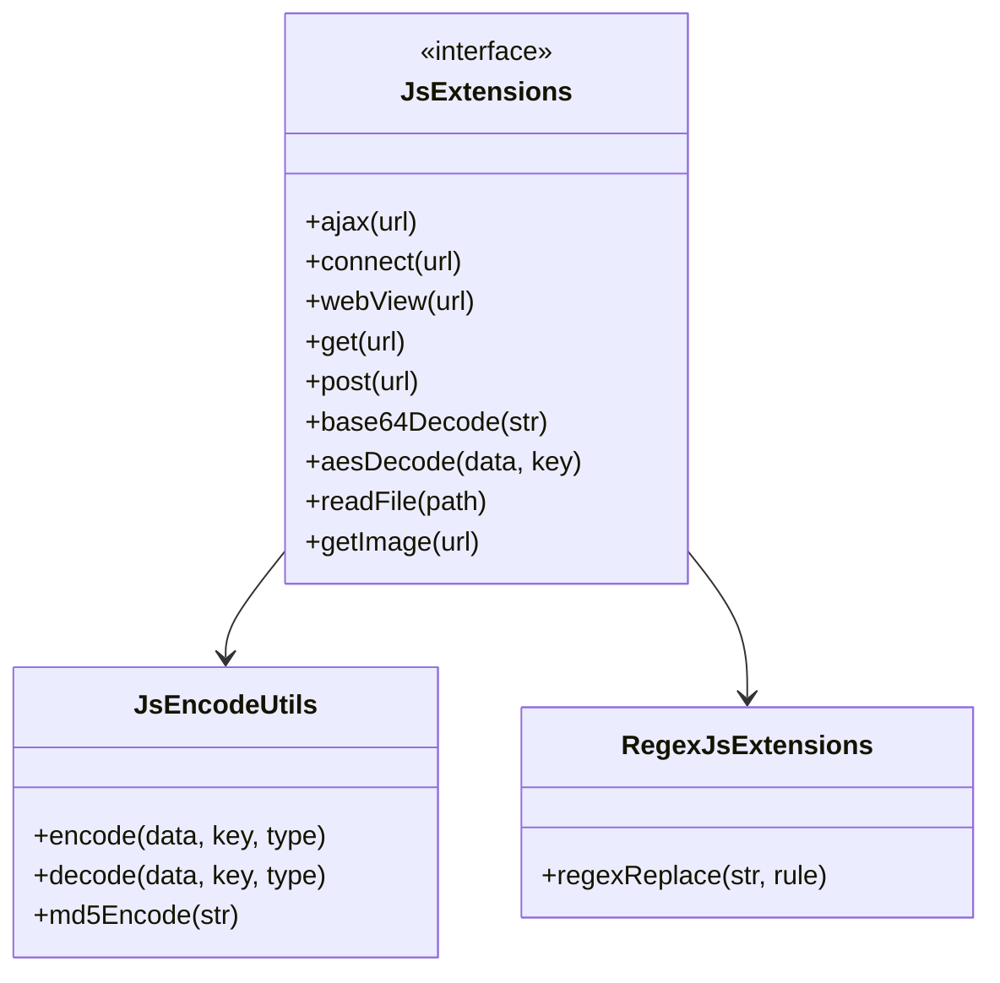

# JS 扩展函数体系

> **核心问题**：书源规则中的 JavaScript 能调用哪些 Java 方法？如何访问网络、操作文件、编码转换？
> **答案**：`JsExtensions` 接口定义了 30+ JS 可调用方法——ajax(网络请求) / webView(WebView渲染) / encode/decode(编码) / cache(缓存) / file(文件IO) / cookie / dict(字典) / python(调用Python) / openUrl/videoPlayer(打开界面)。

---

## 1. 接口层次结构

**文件**：[JsExtensions.kt](file:///f:/myself/github/WeAgentChat/temp/legado/app/src/main/java/io/legado/app/help/JsExtensions.kt)



```
JsExtensions (interface)
├── JsEncodeUtils (父接口)
│   ├── 编码/解码方法
│   └── 加解密方法
├── RegexJsExtensions (独立类)
│   └── 正则扩展方法
└── JsExtensions (主接口)
    ├── 网络访问 (ajax/connect/webView)
    ├── 文件操作 (cache/file/read/fileStr)
    ├── UI 交互 (toast/openUrl/openVideoPlayer)
    ├── 编码工具 (base64/hex/md5/sha)
    └── 高级功能 (python/dict/verify)
```

---

## 2. 网络访问系列

### ajax — 单请求网络访问

```kotlin
fun ajax(url: Any): String?                         // 最简单: ajax("https://...")
fun ajax(url: Any, callTimeout: Long?): String?     // 带超时: ajax(url, 5000)

// 实现流程:
AnalyzeUrl(url, source=getSource(), callTimeout, coroutineContext)
    → getStrResponse()
    → body (返回页面HTML/JSON)
    → onFailure → 捕获异常 + AppLog 记录
```

**JS 调用示例**：
```javascript
var html = java.ajax("https://example.com");
var json = JSON.parse(java.ajax("https://api.example.com"));
```

### ajaxAll — 并发网络访问

```kotlin
fun ajaxAll(urlList: Array<String>): Array<StrResponse>
fun ajaxAll(urlList: Array<String>, skipRateLimit: Boolean): Array<StrResponse>

// 实现:
urlList.asFlow()
    .mapAsync(AppConfig.threadCount) { url ->
        AnalyzeUrl(url, source, coroutineContext).getStrResponseAwait(skipRateLimit)
    }
    .flowOn(IO).toList()
```

**特点**：使用 Flow + mapAsync 实现并发，线程池大小 = `AppConfig.threadCount`。

### ajaxTestAll — 并发测试网络

```kotlin
fun ajaxTestAll(urlList: Array<String>, timeout: Int): Array<StrResponse>
fun ajaxTestAll(urlList: Array<String>, timeout: Int, skipRateLimit: Boolean): Array<StrResponse>

// 与 ajaxAll 的区别:
// - 自定义 timeout 参数
// - isTest=true (跳过某些书源配置检查)
```

### 核心方法

| 方法 | 签名 | 说明 |
|------|------|------|
| getSource | `getSource(): BaseSource?` | 获取当前书源/RSS源，所有方法依赖此获取配置 |
| getTag | `getTag(): String?` | 获取当前标签，用于日志和调试 |

### Jsoup 直连方法

| 方法 | 签名 | 说明 |
|------|------|------|
| get | `get(urlStr, headers?, timeout?)` | Jsoup GET请求，支持重定向拦截和并发率限制 |
| head | `head(urlStr, headers?, timeout?)` | Jsoup HEAD请求 |
| post | `post(urlStr, body?, headers?, timeout?)` | Jsoup POST请求，支持body和header |

**关键特性**：
- 使用 Jsoup.connect() 而非 AnalyzeUrl，不走WebView
- followRedirects=false 拦截重定向
- ConcurrentRateLimiter 限流（基于书源配置）
- enabledCookieJar=true 时自动注入 cookieJarHeader

### connect — 完整响应访问

```kotlin
fun connect(urlStr: String): StrResponse
fun connect(urlStr: String, header: String?): StrResponse
fun connect(urlStr: String, header: String?, callTimeout: Long?): StrResponse

// 返回 StrResponse:
class StrResponse(val url: String, val body: String) {
    val header: Map<String, String>?  // 响应头
    val encoding: String              // 编码
}
```

`connect` 与 `ajax` 的区别：
- `ajax` → 返回 `String` (只取 body)
- `connect` → 返回 `StrResponse` (含响应头/编码等)

### webView 系列 — WebView 渲染

```kotlin
// 基础 WebView
fun webView(html: String?, url: String?, js: String?): String?
fun webView(html, url, js, cacheFirst): String?

// 获取资源 URL (拦截特定请求)
fun webViewGetSource(html, url, js, sourceRegex): String?
fun webViewGetSource(html, url, js, sourceRegex, cacheFirst, delayTime): String?

// 获取跳转 URL (拦截重定向)
fun webViewGetOverrideUrl(html, url, js, overrideUrlRegex): String?
fun webViewGetOverrideUrl(html, url, js, overrideUrlRegex, cacheFirst, delayTime): String?
```

**用途**：处理需要 JS 渲染的页面（Cloudflare 防护、动态加载）。

**实现**：[BackstageWebView.kt](file:///f:/myself/github/WeAgentChat/temp/legado/app/src/main/java/io/legado/app/help/http/BackstageWebView.kt)
```kotlin
// webView(sourceRegex) → setSourceRegex → WebViewClient.shouldInterceptRequest()
// 拦截匹配正则的 URL 对应的资源内容

// webViewGetOverrideUrl(overrideUrlRegex) → WebViewClient.shouldOverrideUrlLoading()
// 拦截浏览器即将跳转的 URL
```

### WebView 线程安全

```kotlin
fun webView(...) {
    if (isMainThread) {
        error("webView must be called on a background thread")
    }
}
```

---

## 3. 浏览器验证系列（6个）

| 函数 | 说明 |
|------|------|
| `startBrowser(url, title)` | 弹出内置浏览器窗口，手动验证反爬 |
| `startBrowser(url, title, html)` | 带 HTML 内容的浏览器验证 |
| `startBrowserAwait(url, title)` | 等待浏览器验证结果 |
| `startBrowserAwait(url, title, refetchAfterSuccess, html)` | 验证成功后重新获取 |
| `getVerificationCode(imageUrl)` | 弹出图片验证码对话框，返回用户输入 |
| `getWebViewUA()` | 获取 WebView 默认 User-Agent |

---

## 4. Cookie 操作系列（3个）

| 函数 | 说明 |
|------|------|
| `getCookie(tag)` | 获取指定域名的全部 Cookie 字符串 |
| `getCookie(tag, key)` | 获取指定域名的指定 Cookie key 的值 |
| `setCookie()` | 通过 AnalyzeUrl 隐式设置 |

---

## 5. 编码/解码系列 (JsEncodeUtils)

**文件**：[JsEncodeUtils.kt](file:///f:/myself/github/WeAgentChat/temp/legado/app/src/main/java/io/legado/app/help/JsEncodeUtils.kt)

### 基础编码

| 方法 | 功能 |
|------|------|
| `base64Decode(str)` | Base64 解码 |
| `base64Decode(str, charset)` | Base64 解码为指定编码字符串 |
| `base64Decode(str, flags)` | 带 flags 的 Base64 解码 |
| `base64DecodeToByteArray(str)` | Base64 解码为字节数组 |
| `base64DecodeToByteArray(str, flags)` | 带 flags 解码为字节数组 |
| `base64Encode(str)` | Base64 编码（flags=2, NO_WRAP） |
| `base64Encode(str, flags)` | 带 flags 的 Base64 编码 |
| `md5Encode(str)` | MD5 32 位小写 |
| `md5Encode16(str)` | MD5 16 位小写 |
| `encodeURI(str)` | URL 编码（UTF-8） |
| `encodeURI(str, enc)` | 指定字符集的 URL 编码 |
| `hexDecodeToByteArray(hex)` | Hex 字符串解码为字节数组 |
| `hexDecodeToString(hex)` | Hex 解码为 UTF-8 字符串 |
| `hexEncodeToString(utf8)` | UTF-8 编码为 Hex 字符串 |
| `strToBytes(str)` | 字符串转字节数组（UTF-8） |
| `strToBytes(str, charset)` | 指定编码转字节数组 |
| `bytesToStr(bytes)` | 字节数组转字符串（UTF-8） |
| `bytesToStr(bytes, charset)` | 指定编码的字节数组转字符串 |

### 高级编码

| 方法 | 功能 |
|------|------|
| `aesEncode(data, key, transformation, iv)` | AES 加密 |
| `aesDecode(data, key, transformation, iv)` | AES 解密 |
| `rsaEncode(data, publicKey)` | RSA 公钥加密 |
| `rsaDecode(data, privateKey)` | RSA 私钥解密 |
| `decodeGbk(str)` / `encodeGbk(str)` | GBK 编码转换 |
| `escape(str)` / `unescape(str)` | JS 风格转义 |

---

## 6. 加密解密系列（6+）

### 新版（推荐使用）

| 函数 | 说明 |
|------|------|
| `createSymmetricCrypto(transformation, key)` | 创建对称加密对象。transformation = "AES/CBC/PKCS5Padding" |
| `createSymmetricCrypto(transformation, key, iv)` | 带 IV 的对称加密 |
| `createAsymmetricCrypto(transformation)` | 创建非对称加密对象 |
| `createSign(algorithm)` | 创建签名对象 |

### 旧版（兼容保留）

| 函数 | 说明 |
|------|------|
| `aesDecodeToString` / `aesDecodeToBase64String` | AES 解密 |
| `aesEncodeToString` / `aesEncodeToBase64String` | AES 加密 |
| `desDecodeToString` / `desEncodeToString` | DES 加解密 |
| `tripleDESDecodeStr` / `tripleDESEncodeBase64Str` | 3DES 加解密 |

---

## 7. 摘要/HMAC 系列（4个）

| 函数 | 说明 |
|------|------|
| `digestHex(data, algorithm)` | 摘要算法，输出16进制（如 `digestHex("xxx", "SHA-256")`） |
| `digestBase64Str(data, algorithm)` | 摘要算法，输出Base64 |
| `HMacHex(data, algorithm, key)` | HMAC，输出16进制 |
| `HMacBase64(data, algorithm, key)` | HMAC，输出Base64 |

---

## 8. 文件操作系列（11+个）

| 函数 | 说明 |
|------|------|
| `getFile(path)` | 获取文件对象（相对路径→缓存目录，安全检查防止目录穿越） |
| `readFile(path)` | 读取文件为字节数组 |
| `readTxtFile(path)` | 读取文本文件（自动检测编码） |
| `readTxtFile(path, charset)` | 指定编码读取 |
| `deleteFile(path)` | 删除文件（支持递归） |
| `downloadFile(url)` | 从 URL 下载文件到缓存目录，返回相对路径 |
| `cacheFile(urlStr)` | 缓存网络文本文件（带MD5缓存键） |
| `cacheFile(urlStr, saveTime)` | 带存活时间的文件缓存 |
| `unzipFile` / `un7zFile` / `unrarFile` / `unArchiveFile` | 解压缩文件 |
| `getTxtInFolder(path)` | 读取文件夹内所有文本文件并拼接 |
| `getZipStringContent(url, path)` | 从网络 ZIP 中读取指定文件内容 |
| `getZipByteArrayContent(url, path)` | 从网络 ZIP 中读取指定文件为字节数组 |
| `getRarStringContent` / `get7zStringContent` | 从 RAR/7z 中读取 |

---

## 9. 时间格式化系列（3个）

| 函数 | 说明 |
|------|------|
| `timeFormatUTC(time, format, sh)` | UTC 时间格式化（sh=时区偏移小时数） |
| `timeFormat(time)` | 本地时间格式化（yyyy-MM-dd HH:mm:ss） |
| `toNumChapter(s)` | 章节数转数字。正则：`^(第)([一二三四五六七八九十百千零〇0-9]+)([章节卷])(.*)` |

---

## 10. 其他工具函数（12个）

| 函数 | 说明 |
|------|------|
| `htmlFormat(str)` | HTML 格式化（保留 img 标签） |
| `t2s(text)` | 繁体转简体 |
| `s2t(text)` | 简体转繁体 |
| `toURL(urlStr)` | 解析 URL 为 JsURL 对象（含 protocol/host/path/query 等属性） |
| `toURL(url, baseUrl)` | 带 Base URL 的 URL 解析 |
| `queryTTF(data)` | 解析 TTF 字体文件，返回字体查询对象（支持 URL/Base64/ByteArray 自动判断） |
| `queryTTF(data, useCache)` | 带缓存开关的 TTF 解析 |
| `replaceFont(text, errorTTF, correctTTF)` | 字体替换（反混淆）。用 correct 字体的轮廓数据替换 error 字体中的错误字形 |
| `replaceFont(text, errorTTF, correctTTF, filter)` | 带 filter 参数，删除错误字体中不存在的字符 |
| `importScript(path)` | 导入外部 JavaScript 脚本（支持 HTTP URL 或本地相对路径） |
| `randomUUID()` | 生成 UUID |
| `androidId()` | 获取设备标识 |
| `openUrl(url)` | 打开应用跳转或网页（legado:// yuedu:// 特殊处理） |
| `openVideoPlayer(url, title)` | 打开内置视频播放器 |
| `openVideoPlayer(url, title, isFloat)` | 悬浮窗播放 |

---

## 11. 调试/配置系列（7个）

| 函数 | 说明 |
|------|------|
| `log(msg)` | 输出调试日志（同时返回 msg 本身，支持链式调用） |
| `logType(any)` | 输出对象类型 |
| `toast(msg)` | 弹窗提示 |
| `longToast(msg)` | 长时间弹窗 |
| `getReadBookConfig()` | 获取当前阅读配置（JSON 字符串） |
| `getThemeMode()` | 获取主题模式（"0", "1", "2"） |
| `getThemeConfig()` | 获取主题配置（JSON 字符串） |

---

## 12. JS 环境绑定变量

在规则引擎的 JS 执行环境中，以下变量可用：

```javascript
// 在 AnalyzeRule 中（搜索/书籍信息/目录/正文规则内）
java         // JsExtensions 对象, 以上所有函数的宿主
cookie       // String, Cookie字符串
cache        // String, 缓存路径
source       // BaseSource/NativeBaseSource, 当前书源（可访问 bookSourceUrl, bookSourceName 等属性）
book         // BaseBook/NativeBaseBook, 当前书籍（可访问 name, author, bookUrl 等属性）
result       // String, 上一步规则结果
baseUrl      // String, 当前基础URL
chapter      // BookChapter, 当前章节
title        // String, 章节标题
src          // String, 资源URL
nextChapterUrl  // String, 下一章URL
rssArticle   // RssArticle, 当前 RSS 文章对象
fromBookInfo // Boolean，是否来自书籍信息

// 在 AnalyzeUrl 中（URL 模板 {{js}} 内）
java, baseUrl, cookie, cache, page, key, speakText, speakSpeed,
book, source, result, infoMap
```

---

## 13. 编码检测

**文件**：[EncodingDetect.kt](file:///f:/myself/github/WeAgentChat/temp/legado/app/src/main/java/io/legado/app/utils/EncodingDetect.kt)

```kotlin
fun detectCharset(bytes: ByteArray): String?  // 检测编码: UTF-8/GBK/GB2312/GB18030...
fun autoDecode(bytes: ByteArray): String      // 自动检测并解码
```

---

## 5. 文件操作系列

```kotlin
// 文件路径 (相对路径限定在 ExternalCache 目录)
fun getFile(path: String): File
fun getFile(name: String, extension: String): File

// 文件 IO
fun readFile(file: File): String              // 读取文本文件
fun readFileBytes(file: File): ByteArray      // 读取二进制文件
fun writeFile(file: File, content: String)    // 写入文本
fun writeFile(file: File, bytes: ByteArray)   // 写入二进制

// 缓存 (ACache 磁盘缓存)
fun cachePut(key: String, value: String)      // 写入缓存
fun cacheGet(key: String): String?            // 读取缓存
fun cacheRemove(key: String)                  // 删除缓存
```

**安全性**：所有文件操作限定在 `/android/data/{package}/cache/` 下（相对路径）。

---

## 6. 正则扩展 (RegexJsExtensions)

**文件**：[RegexJsExtensions.kt](file:///f:/myself/github/WeAgentChat/temp/legado/app/src/main/java/io/legado/app/help/RegexJsExtensions.kt)

提供 JavaScript 兼容的正则表达式方法：

```kotlin
fun regexExec(regex: String, str: String, group: Int): String?   // 执行正则匹配并返回捕获组
fun regexMatch(regex: String, str: String): String?              // 匹配返回整个结果
fun regexMatches(regex: String, str: String): Boolean            // 判断是否匹配
fun regexReplace(regex: String, replacement: String, str: String): String  // 替换
fun regexSplit(regex: String, str: String): List<String>         // 分割
fun regexFindAll(regex: String, str: String): List<String>       // 查找所有匹配
fun regexCount(regex: String, str: String): Int                  // 匹配计数
```

---

## 7. UI 交互系列

```kotlin
// Toast 提示
@JavascriptInterface
fun toast(msg: String)                                // 短提示
@JavascriptInterface
fun longToast(msg: String)                            // 长提示

// 打开链接
@JavascriptInterface
fun openUrl(url: String)                              // 浏览器打开
@JavascriptInterface
fun openUrl(url: String, title: String)               // 带标题打开

// 打开内置视频播放器
@JavascriptInterface
fun openVideoPlayer(url: String, title: String)
@JavascriptInterface
fun openVideoPlayer(url: String, title: String, isFloat: Boolean)
```

---

## 8. 高级功能

```kotlin
// 字典查词
fun dict(book: Book, word: String): String?

// 书源登录
fun login(source: BookSource): Boolean
fun getLoginInfo(source: BookSource): String?

// 验证码识别
fun ocr(image: Bitmap): String?

// Python 调用 (通过 QPython 等)
fun python(code: String): String?
fun python(code: String, args: Map<String, String>): String?
```

---

## 9. NativeBaseSource — Rhino 绑定的 Java 对象

**文件**：[NativeBaseSource.kt](file:///f:/myself/github/WeAgentChat/temp/legado/app/src/main/java/io/legado/app/help/rhino/NativeBaseSource.kt)

### 作用

在 Rhino JS 引擎中，将 BookSource/RssSource 实体包装为 JS 可直接访问的 Java 对象：

```kotlin
object NativeBaseSource {
    val factory = object : RhinoWrapFactory.WrapperFactory {
        override fun wrap(obj: Any): Scriptable {
            // 将 BookSource/RssSource 包装为 NativeJavaObject
            // JS 中通过 source.key / source.bookSourceUrl 访问字段
            // 自动注入 JsExtensions / JsEncodeUtils 方法
        }
    }
}
```

### App.kt 注册

```kotlin
fun initRhino() {
    RhinoWrapFactory.register(BookSource::class.java, NativeBaseSource.factory)  // 可读写
    RhinoWrapFactory.register(RssSource::class.java, NativeBaseSource.factory)   // 可读写
    RhinoWrapFactory.register(HttpTTS::class.java, NativeBaseSource.factory)     // 可读写
    RhinoWrapFactory.register(ExploreRule::class.java, ReadOnlyJavaObject.factory)
    RhinoWrapFactory.register(SearchRule::class.java, ReadOnlyJavaObject.factory)
    RhinoWrapFactory.register(BookInfoRule::class.java, ReadOnlyJavaObject.factory)
    RhinoWrapFactory.register(ContentRule::class.java, ReadOnlyJavaObject.factory)
    RhinoWrapFactory.register(BookChapter::class.java, ReadOnlyJavaObject.factory)
    RhinoWrapFactory.register(Book.ReadConfig::class.java, ReadOnlyJavaObject.factory)
}
```

### JS 调用视图

```javascript
// 书源规则 JS 块中:
var source = java.getSource();         // 获取当前书源
source.bookSourceUrl                   // 直接访问字段
java.ajax(source.searchUrl + key)     // 调用 Java 方法

// 书源 login 规则:
var loginInfo = source.getLoginInfo()  // 读取上次登录信息（cookies/token）
java.openUrl(source.loginUrl, "login") // 打开登录页面
```

---

## 10. JsEncodeUtils 完整方法清单

```kotlin
interface JsEncodeUtils {
    // 编码
    fun encodeURI(str: String): String
    fun decodeURI(str: String): String
    fun base64Decode(str: String): String
    fun base64Encode(str: String): String
    fun md5Encode(str: String): String
    fun sha256Encode(str: String): String
    fun hexEncode(str: String): String
    fun hexDecode(str: String): String
    fun escape(str: String): String
    fun unescape(str: String): String
    fun strToBytes(str: String, charset: String?): ByteArray
    fun bytesToStr(bytes: ByteArray, charset: String?): String

    // 压缩
    fun gzip(data: ByteArray): ByteArray
    fun ungzip(data: ByteArray): ByteArray

    // 加解密
    fun aesEncode(data: ByteArray, key: ByteArray, transformation: String?, iv: ByteArray?): ByteArray
    fun aesDecode(data: ByteArray, key: ByteArray, transformation: String?, iv: ByteArray?): ByteArray
    fun rsaEncode(data: ByteArray, publicKey: ByteArray): ByteArray
    fun rsaDecode(data: ByteArray, privateKey: ByteArray): ByteArray
}
```

---

## 11. CoroutineContext 传递

JS 代码执行时，协程上下文从 `RhinoScriptEngine` 传递到 JS 方法：

```kotlin
// JsExtensions.kt:L94-L96
private val context: CoroutineContext
    get() = rhinoContextOrNull?.coroutineContext ?: EmptyCoroutineContext
```

所有网络请求在书源规则 JS 块执行时，共享同一个协程 scope，可以被正确取消（`rhinoContextOrNull?.ensureActive()`）。

---

## Python 重构参考

> JS 扩展函数在 Python 重构中的对应实现

### 网络请求映射

| Legado JS 函数 | Python 对应 |
|---------------|-------------|
| `ajax(url)` | `httpx.get/post(url)` |
| `ajaxAll([urls])` | `asyncio.gather(*[httpx.get(u) for u in urls])` |
| `connect(url)` | WebSocket: `websockets.connect(url)` |
| `webView(url)` | `playwright.page.goto(url)` |

### 编码解码映射

| Legado JS 函数 | Python 对应 |
|---------------|-------------|
| `crypto.encode(str, key)` | `cryptography` / `pycryptodome` |
| `base64Decode(str)` | `base64.b64decode(str)` |
| `md5Encode(str)` | `hashlib.md5(str.encode()).hexdigest()` |

### 文件操作映射

| Legado JS 函数 | Python 对应 |
|---------------|-------------|
| `readFile(path)` | `pathlib.Path(path).read_text()` |
| `writeFile(path, text)` | `pathlib.Path(path).write_text(text)` |
| `getImage(url)` | `httpx.get(url).content` |