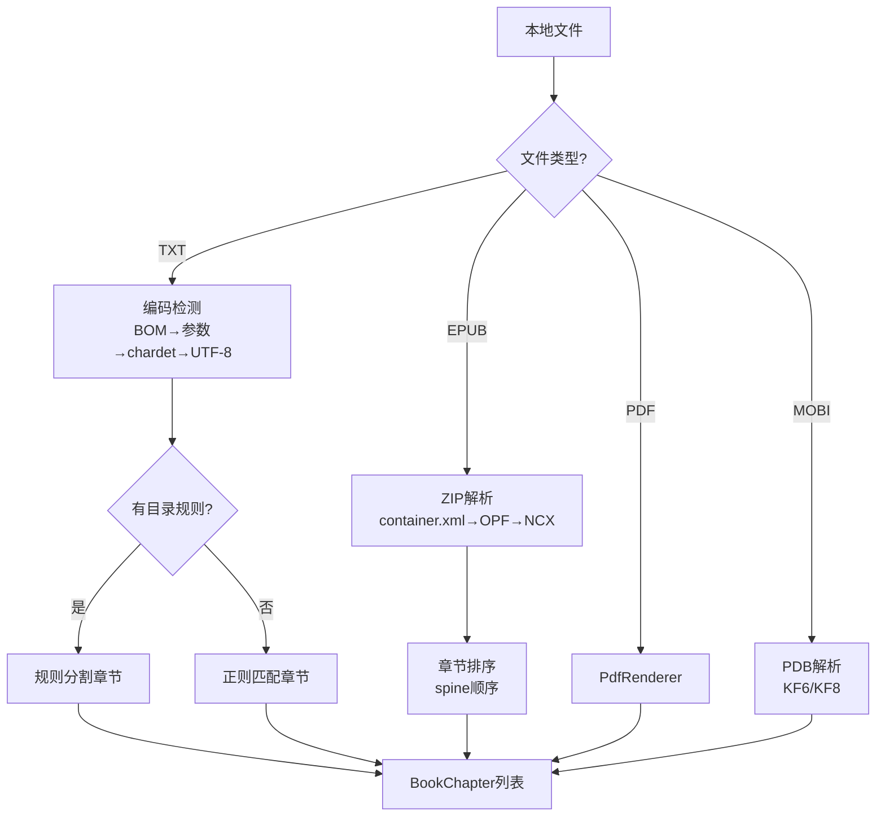

# 本地书籍解析模块

> LocalBook 门面模式统一入口，支持 TXT/EPUB/PDF/MOBI/UMD 五种格式——TXT 目录规则自动选择是核心算法。

---

## 1. 架构总览 — LocalBook 门面

[LocalBook.kt:69](file:///f:/myself/github/WeAgentChat/temp/legado/app/src/main/java/io/legado/app/model/localBook/LocalBook.kt#L69)

```
LocalBook (门面)
  ├── isEpub()  → EpubFile  (EPUB懒加载解析)
  ├── isUmd()   → UmdFile   (UMD漫画格式)
  ├── isPdf()   → PdfFile   (PDF渲染)
  ├── isMobi()  → MobiFile  (Mobi/Kindle格式)
  └── else      → TextFile  (TXT编码检测+章节分割)
```

### 1.1 BaseLocalBookParse 接口

```
interface BaseLocalBookParse:
  upBookInfo(book)             → 从文件中解析书名/作者等元信息
  getChapterList(book)         → 获取章节目录列表
  getContent(book, chapter)    → 获取章节正文
  getImage(book, href)         → 获取内嵌图片(EPUB专用)
```

### 1.2 类型分发



[LocalBook.kt:120-213](file:///f:/myself/github/WeAgentChat/temp/legado/app/src/main/java/io/legado/app/model/localBook/LocalBook.kt#L120-L213)

```
getChapterList(book):
  when:
    isEpub(book) → EpubFile.getChapterList(book)
    isUmd(book)  → UmdFile.getChapterList(book)
    isPdf(book)  → PdfFile.getChapterList(book)
    isMobi(book) → MobiFile.getChapterList(book)
    else         → TextFile.getChapterList(book)
```

### 1.3 文件导入 — importFile

[LocalBook.kt:241-272](file:///f:/myself/github/WeAgentChat/temp/legado/app/src/main/java/io/legado/app/model/localBook/LocalBook.kt#L241-L272)

```
importFile(filePath):
  1. 根据扩展名判断类型
  2. 创建 Book 对象（bookUrl=文件路径）
  3. analyzeNameAuthor() → 从文件名解析书名和作者
  4. upBookInfo() → 从文件内容解析元信息
  5. getChapterList() → 生成章节目录
  6. 写入数据库
```

### 1.4 数据模型

```
Book:
  - bookUrl: str         # 文件路径/URI
  - tocUrl: str          # 目录规则（TXT）或章节列表
  - originName: str      # 原始文件名 如 "三体.epub"
  - name: str            # 解析后的书名
  - author: str          # 解析后的作者
  - charset: str         # 字符编码（TXT 特有）
  - type: int            # BookType 位标志
  - coverUrl: str        # 封面路径
  - intro: str           # 简介
  - totalChapterNum: int # 章节总数
  - durChapterIndex: int # 当前阅读章节索引

BookChapter:
  - url: str             # 章节唯一标识
  - title: str           # 章节标题
  - index: int           # 章节序号
  - bookUrl: str         # 所属书籍
  - start: long          # TXT: 字节偏移起始
  - end: long            # TXT: 字节偏移结束
  - startFragmentId: str # EPUB: 起始 fragment ID
  - endFragmentId: str   # EPUB: 结束 fragment ID
  - isVolume: bool       # 是否是卷名
  - wordCount: str       # 字数统计
  - variable: str        # JSON 变量（如 nextUrl）
```

---

## 2. TXT 解析完整流程

[TextFile.kt:26](file:///f:/myself/github/WeAgentChat/temp/legado/app/src/main/java/io/legado/app/model/localBook/TextFile.kt#L26)

### 2.1 编码检测（四级降级策略）

```
编码检测顺序（严格按优先级）:

1. BOM 检测:
   ├── EF BB BF       → UTF-8
   ├── FF FE          → UTF-16 LE
   └── FE FF          → UTF-16 BE

2. 参数指定编码:
   └── book.charset（用户手动指定的编码）→ 跳过自动检测

3. chardet 自动检测:
   └── 使用 CharsetDetector（icu4j 移植版）
       ├── 检测前 8000 字节
       ├── 返回匹配度最高的编码
       └── 失败则 fallback 到 UTF-8

4. 默认 UTF-8
```

**核心源码逻辑**（TextFile.kt）：

```kotlin
// getChapterList() 中首次读取时的编码检测
val buffer = ByteArray(bufferSize)  // 512000 bytes
val length = bis.read(buffer)
if (book.charset.isNullOrBlank() || modified) {
    book.charset = EncodingDetect.getEncode(buffer.copyOf(length))
    // EncodingDetect.getEncode 内部使用 CharsetDetector.setText().detect()
}
// book.fileCharset() 最终转为 java.nio.charset.Charset
```

### 2.2 BOM 跳过

读取文件头 3 字节检测 UTF-8 BOM，跳过 BOM 再开始解析：

```kotlin
bufferStart = 3
bis.read(buffer, 0, 3)
if (Utf8BomUtils.hasBom(buffer)) {  // [0xEF, 0xBB, 0xBF]
    bufferStart = 0   // buffer[0..2] 是 BOM，从 index=3 开始才是内容
    curOffset = 3
}
```

### 2.3 章节分割 — 核心算法

TXT 章节解析是 Legado 最复杂的算法之一，分为**有规则分割**和**无规则分割**两种模式。

#### 2.3.1 无规则分割（analyze_no_rule）

[TextFile.kt:89-154](file:///f:/myself/github/WeAgentChat/temp/legado/app/src/main/java/io/legado/app/model/localBook/TextFile.kt#L89-L154)

当用户未指定目录规则或规则为空时使用：

```
参数: maxLengthWithNoToc = 10 * 1024 字节
缓冲区: bufferSize = 512000 字节

算法:
1. 每次读满 bufferSize 字节
2. 每 maxLengthWithNoToc 字节寻找最近的换行符 (0x0A)
3. 在换行符处切分章节
4. 章节标题自动命名为 "第{blockPos}章({chapterPos})"
5. 文件末尾剩余内容 < 100 字节 → 合并到上一章

关键数据结构:
  BookChapter(url, title, index, bookUrl, start: Long, end: Long)
  start/end 为字节偏移量，正文获取时按偏移读取
```

#### 2.3.2 有规则分割（analyze_with_rule）

[TextFile.kt 目录规则处理](file:///f:/myself/github/WeAgentChat/temp/legado/app/src/main/java/io/legado/app/model/localBook/TextFile.kt)

使用正则规则匹配章节标题：

**规则结构（TxtTocRule）：**
```
- name: String        — 规则名称（如"常见格式"）
- rule: String        — 正则表达式
- replacement: String? — JS 净化脚本（对匹配标题做进一步处理）
```

**默认规则示例：**
```
"^[ 　\\t]{0,4}(?:序章|楔子|正文(?!完|结)|终章|后记|尾声|番外|
  第\\s{0,4}[\\d〇零一二两三四五六七八九十百千万壹贰叁肆伍陆柒捌玖拾佰仟]+?
  \\s{0,4}(?:章|节(?!课)|卷|集(?![合和])|部(?![分赛游])|篇(?!张))).{0,30}$"
```

**有规则分割核心流程**：

```
输入:
  - rule_regex: str (正则表达式)
  - js_replacement: str (可选的 JS 净化脚本)

流程:
1. 编译正则 pattern = compile(rule_regex, MULTILINE)
2. 以 buffer_size(512000) 为单位分块处理大文件
3. 用正则逐行匹配每个 block
4. 对每个匹配到的标题位置:
   a. 计算上一章内容区间 [seekPos, matcher.start())
   b. 调用 replacement() 净化标题文本
   c. 根据上下文创建/更新 BookChapter

关键上下文决策树:

情况1: seekPos == 0 && chapterStart != 0
  ├── toc 为空 → 序章/前言处理:
  │     ├── 创建"前言"章节
  │     └── 前 600 字作为 book.intro
  └── toc 不为空 → 上一章剩余内容追加到上一章末尾

情况2: 正常匹配
  ├── toc 不为空 → 上一章 end 修正，创建新章
  ├── toc 为空   → 直接创建第一章
  └── 章节过长(>102400) → splitLongChapter 拆分

情况3: seekPos == 0 && chapterStart == 0
  └── block 开头即是标题，正常创建

5. 最后一个 block 处理完成后，检查末章是否过长需拆分
```

#### 2.3.3 章节拆分（splitLongChapter）

当章节超过 `maxLengthWithToc(102400)` 字节时启用：

```
if getSplitLongChapter() and (end - start) > maxLengthWithToc:
    1. 标记当前章节为卷(isVolume = true)
    2. 用无规则分割法重新切分该区间
    3. 子章节命名为 "{原标题}(1)", "{原标题}(2)" ...
```

### 2.4 标题净化（JS 引擎）

匹配到的正则结果可经 JS 引擎处理后作为最终标题：

```javascript
// 用户自定义的 JS 替换脚本（存储在 txtTocRule.replacement 中）
// 可用变量：
//   result       - 匹配到的原始文本
//   book         - 替换用的 Book 信息
//   index        - 当前章节序号
//   prevTitle    - 上一章节标题
//   prevLength   - 上一章节内容长度
//   lastVolumeTitle - 上一个卷名
//   java.putVolume("标题") - 插入卷标记

// 简单示例：去除标题中的空格
result.replace(/\s+/g, "")
```

### 2.5 自动选规则算法（getTocRule）

[TextFile.kt:497-535](file:///f:/myself/github/WeAgentChat/temp/legado/app/src/main/java/io/legado/app/model/localBook/TextFile.kt#L497-L535)

```
getTocRule(book):
  1. 读取前 bufferSize(512000) 字节 → 解码为字符串
  2. 遍历所有启用的 TxtTocRule
  3. 对每个规则:
     a. 对整个字符串执行正则匹配
     b. 统计匹配数 csNum
     c. 统计误匹配数 numE（相邻章节字数 < 100 的视为误匹配）
     d. 要求 csNum >= numE * 3（有效匹配远多于误匹配）
     e. 取匹配数最大的规则，但要求超过前一名 >= 2
     f. 若 maxNum > 70，提前终止（足够精确）
  4. 选择最佳规则 → 存入 book.tocUrl
```

**匹配结果存储格式**：

```
ruleRegex + replacement → 存储为 "rule\0replacement"
book.tocUrl = rule + spaceChars("🫅🈳🏻") + replacement
```

### 2.6 文件读取缓冲优化

```
缓冲策略:
  - txtBufferSize = 8 * 1024 * 1024 (8MB)
  - 以 8MB 为基准对齐读入缓冲区
  - 按 start 计算所在块: bufferStart = txtBufferSize * (start / txtBufferSize)

章节内容读取(getContent):
  if 章节完全在缓冲区内:
      直接从缓冲区拷贝 [start - bufferStart, end - bufferStart]
  else (跨缓冲区边界):
      重新打开文件流 seek(start), 逐字节读取

  返回前:
      去除前导换行/空白
      替换为全角空格缩进 "　　"
```

### 2.7 总字数统计

```
getWordCount:
  1. 若 AppConfig.tocCountWords 为 false 则跳过
  2. 从数据库读取已存储的章节字数缓存
  3. 按 getFileName() 匹配填充到新解析的章节列表
```

---

## 3. EPUB 解析

[EpubFile.kt:35](file:///f:/myself/github/WeAgentChat/temp/legado/app/src/main/java/io/legado/app/model/localBook/EpubFile.kt#L35)

### 3.1 懒加载策略

```
EpubBook 对象懒加载（首次使用时创建）:

getChapterList(book):
  1. 创建 EpubBook(book.bookUrl) → 解析 container.xml/opf/ncx
  2. 提取 spine 中的章节列表
  3. 为每个章节创建 BookChapter
     字段特殊: tag → 用于标识 epub fragment ID

getContent(book, chapter):
  1. EpubBook.getResourceByFragment(BookChapter.tag)
  2. 返回 xhtml 内容
```

### 3.2 核心数据结构

```
EpubBook:
  - spine: List<EpubSpine>     — 书脊（阅读顺序）
  - resources: Map<String, Resource> — 资源映射
  - metadata: title/author/cover 等

BookChapter 特殊字段:
  - tag: String?               — EPUB 内部 fragment ID
  - startFragmentId: String?   — 起始 fragment ID
  - endFragmentId: String?     — 结束 fragment ID
```

### 3.3 ZIP 结构

EPUB 本质是一个 ZIP 压缩包，标准目录结构如下：

```
book.epub
├── mimetype                    # 固定内容 "application/epub+zip"（不压缩）
├── META-INF/
│   └── container.xml           # 指向 OPF 文件路径
└── OEBPS/                      # 内容目录（名称可变）
    ├── content.opf             # 元数据 + manifest + spine
    ├── toc.ncx                 # （可选）NCX 传统目录
    ├── xhtml/
    │   ├── chapter_001.xhtml
    │   ├── chapter_002.xhtml
    │   └── ...
    └── images/
        ├── cover.jpg
        └── ...
```

### 3.4 container.xml 解析

```xml
<?xml version="1.0"?>
<container version="1.0"
           xmlns="urn:oasis:names:tc:opendocument:xmlns:container">
  <rootfiles>
    <rootfile full-path="OEBPS/content.opf"
              media-type="application/oebps-package+xml"/>
  </rootfiles>
</container>
```

**关键字段**：
- `rootfile.full-path`：OPF 文件在 ZIP 内的相对路径

### 3.5 OPF 解析

```xml
<?xml version="1.0" encoding="utf-8"?>
<package xmlns="http://www.idpf.org/2007/opf"
         unique-identifier="bookid" version="2.0">

  <!-- metadata: 元数据 -->
  <metadata xmlns:dc="http://purl.org/dc/elements/1.1/">
    <dc:title>三体</dc:title>
    <dc:creator>刘慈欣</dc:creator>
    <dc:language>zh-CN</dc:language>
    <dc:identifier id="bookid">urn:uuid:...</dc:identifier>
    <meta name="cover" content="cover-image"/>
  </metadata>

  <!-- manifest: 资源清单 -->
  <manifest>
    <item id="cover"        href="images/cover.jpg"       media-type="image/jpeg"/>
    <item id="ncx"          href="toc.ncx"                 media-type="application/x-dtbncx+xml"/>
    <item id="chapter_001"  href="xhtml/chapter_001.xhtml" media-type="application/xhtml+xml"/>
    <item id="chapter_002"  href="xhtml/chapter_002.xhtml" media-type="application/xhtml+xml"/>
    <item id="css"          href="styles/main.css"         media-type="text/css"/>
  </manifest>

  <!-- spine: 阅读顺序 -->
  <spine toc="ncx">
    <itemref idref="cover" linear="no"/>
    <itemref idref="chapter_001"/>
    <itemref idref="chapter_002"/>
  </spine>
</package>
```

**OPF 三段核心**：

| 段 | 作用 | 关键属性 |
|------|------|---------|
| metadata | 书籍元信息 | dc:title, dc:creator, dc:language, dc:identifier, dc:description |
| manifest | 所有资源文件清单 | id, href, media-type |
| spine | 阅读顺序（章节排列） | itemref.idref → manifest item.id, itemref.linear |

### 3.6 NCX 目录解析（可选）

```xml
<?xml version="1.0" encoding="utf-8"?>
<!DOCTYPE ncx PUBLIC "-//NISO//DTD ncx 2005-1//EN"
  "http://www.dtd.org/NISO/2005/ncx-2005-1.dtd">
<ncx xmlns="http://www.dtd.org/NISO/2005/ncx" version="2005-1">
  <navMap>
    <navPoint id="navpoint_1" playOrder="1">
      <navLabel><text>第一章 科学边界</text></navLabel>
      <content src="xhtml/chapter_001.xhtml"/>
      <!-- 子节点 -->
      <navPoint id="navpoint_1_1" playOrder="2">
        <navLabel><text>1.1 汪淼</text></navLabel>
        <content src="xhtml/chapter_001.xhtml#sec_1_1"/>
      </navPoint>
    </navPoint>
    <navPoint id="navpoint_2" playOrder="3">
      <navLabel><text>第二章 三体问题</text></navLabel>
      <content src="xhtml/chapter_002.xhtml"/>
    </navPoint>
  </navMap>
</ncx>
```

**NCX 解析要点**：
- `navMap > navPoint`：目录条目，可递归嵌套
- `navLabel > text`：显示的目录标题
- `content.src`：对应的资源路径，可含 `#fragmentId`
- `playOrder`：播放顺序（即阅读顺序）
- **多级目录**：子 `navPoint` 即二级/三级目录

### 3.7 章节解析

Legado 使用 `epublib`（第三方库 + 自修改版）解析 EPUB。

**章节列表生成逻辑**（两者选一）：

```
方式 A（有 NCX）：parseMenu()
  ├── 先 parseFirstPage(): 扫描第一章前的所有内容（封面、引言、扉页）
  │     以 firstRef.completeHref 为终止标志
  │     → 逐个创建 BookChapter，title 从 <title> 标签获取
  ├── 然后 parseMenu(): 递归遍历 NCX navPoint 树
  │     → 每个 navPoint → 一个 BookChapter
  │     → children 不为空 → isVolume = true
  │     → 设置 startFragmentId / endFragmentId 精确位置
  └── 设置 nextUrl 指针 → chapter.putVariable("nextUrl", nextUrl)

方式 B（无 NCX）：spineReferences
  ├── 直接按 spine 顺序遍历
  ├── 每个 resource → 一个 BookChapter
  ├── title 优先用 resource.title，没有则从 <title> 标签解析
  └── 首章节 title 为空时设 "封面"
```

**FragmentId 精确位置定位**：

```
当 XHTML 文件中包含多个章节时，通过锚点(#)精确定位：
  - startFragmentId: 当前章节的起始锚点
  - endFragmentId: 下一章节的起始锚点（当前章节的结束边界）

用于 getContent() 中精确截取正文：
  1. 按 startFragmentId 找对应 Element → 取 outerHtml
  2. 按 endFragmentId 截断尾部
  3. 若需跨越多个 XHTML 文件，合并内容后截取
```

### 3.8 章节内容读取

```
getContent(chapter):
  1. 获取当前章节的 XHTML resource href
  2. 获取下一章节的 XHTML resource href（from nextUrl variable）
  3. 按 spine 顺序遍历资源：
     a. 跳过 start 之前的所有 resource
     b. 对目标 resource 调用 getBody():
        - Jsoup 解析 → 去除 script/style →
        - 处理 startFragmentId 截取起始 →
        - 处理 endFragmentId 截取结束 →
        - 去除 H1-H6 标签（可配置） →
        - 转换 <image xlink:href> 为  →
        - 解析相对路径为绝对路径 →
     c. 若需跨文件（includeNextChapterResource），合并内容
  4. 去除 display:none 元素
  5. 去除 title 标签
  6. 去除重复封面图
  7. 处理 ruby 注音标签（可配置）
  8. 返回 HtmlFormatter.formatKeepImg(html)
```

---

## 4. PDF 解析

[PdfFile.kt](file:///f:/myself/github/WeAgentChat/temp/legado/app/src/main/java/io/legado/app/model/localBook/PdfFile.kt)

### 4.1 解析方案

Android 原生使用 `PdfRenderer` + `ParcelFileDescriptor` 渲染 PDF，将每页渲染为 Bitmap 图片展示。

**核心限制**：
- PDF 不是流式文档，无法提取纯文本
- 每个"章节" = 固定 10 页的图片集合
- 无文本目录提取，章节标题自动命名为 `分段_{index}`

### 4.2 章节生成

```kotlin
// 以 PAGE_SIZE = 10 页为一个分段
val chapterCount = ceil(renderer.pageCount / PAGE_SIZE)
for (i in 0 until chapterCount) {
    chapter.title = "分段_${i}"
    chapter.url = "pdf_${i}"
}
```

### 4.3 内容读取

```kotlin
// 返回 HTML img 标签，src 为页码索引
getContent(chapter):
    start = chapter.index * PAGE_SIZE
    end = min((chapter.index + 1) * PAGE_SIZE, pageCount)
    for i in start..end:
        append("")

// getImage(href) 渲染对应页码Bitmap:
    index = href.toInt()
    page = renderer.openPage(index)
    bitmap = createBitmap(screenWidth, screenWidth * page.height / page.width)
    page.render(bitmap)
    return bitmap.toInputStream()
```

---

## 5. MOBI 解析

[MobiFile.kt](file:///f:/myself/github/WeAgentChat/temp/legado/app/src/main/java/io/legado/app/model/localBook/MobiFile.kt)

### 5.1 格式概述

MOBI 格式基于 Palm DOC 数据库（PDB）格式，结构如下：

```
PDB Header (78 bytes)
  ├── name: str[32]        # 数据库名称
  ├── attributes: u16      # 属性标志
  ├── version: u16         # 版本
  ├── ctime: u32           # 创建时间
  ├── mtime: u32           # 修改时间
  ├── btime: u32           # 备份时间
  ├── mod_num: u32         # 修改号
  ├── app_info_id: u32     # app info offset
  ├── sort_info_id: u32    # sort info offset
  ├── type: str[4]         # "BOOK"
  ├── creator: str[4]      # "MOBI" 或 "PDOC"
  ├── unique_id_seed: u32  # 唯一 ID
  ├── next_record_list: u32
  └── num_records: u16     # 记录数

Record List (8 bytes each)
  ├── record_offset: u32   # 记录偏移
  └── record_attr: u8      # 记录属性

Mobi Header (PalmDoc + MOBI headers)
  ├── PalmDoc Header (16 bytes)
  │   ├── compression: u16   # 0=无 1=PalMDOC 2=HUFF/CDIC
  │   ├── text_length: u16
  │   ├── record_count: u16
  │   ├── record_size: u16   # 通常 4096
  │   └── encryption: u16    # 0=无
  │
  └── MOBI Header (可变)
      ├── header_length: u32
      ├── mobi_type: u32      # 2=Mobipocket 3=HTML 4=KF8
      ├── text_encoding: u32  # 1252=Latin1 65001=UTF-8
      ├── title: str          # 书名
      ├── author: str         # 作者
      ├── exth_flags: u32
      └── exth_header: (可选) EXTH 扩展头
          ├── header_length: u32
          ├── record_count: u32
          ├── records[]
          │   ├── type: u32   # 100=作者 105=封面 106=ISBN ...
          │   └── data
          └──

Content Records
  ├── Record 0: text (HTML)
  ├── Record 1: text ...
  ├── ...
  ├── Record N: text ...
  ├── INDEX: 索引记录（目录/词表）
  ├── FLIS: 词频信息
  └── FDST: 数据流信息
```

### 5.2 两种子格式

Legado 的 MobiReader 区分两种格式：

| 类型 | 说明 | 解析方式 |
|------|------|---------|
| **KF6** (KF6Book) | 传统 MOBI（使用 PalmDoc 压缩） | Huffcdic/Lz77 解压 → HTML → 提取文本 |
| **KF8** (KF8Book) | Kindle Format 8（含 EPUB-like 结构） | 类似 EPUB，解析 text 和 media 资源 |

### 5.3 目录解析

```
getChapterList():
  if mobiBook is KF8Book:
    → getChapterListKF8()
  else:
    → getChapterListKF6()

两者逻辑基本相同：
  1. 检查 sectionIdMap[0] 是否有内容
  2. 若否 → 第一个 section 作为"卷首"，<title> 标签文本作为标题
  3. 遍历 TOC 树：
     a. 每个 TOC ref → 一个 BookChapter
     b. url = "{index}:{href}"（索引用于定位）
     c. subitems != null → isVolume = true
     d. 卷与子章指向同一 href → 卷标记为 "skip:{url}"
     e. 设置 nextUrl 指针
```

---

## 6. UMD 解析

[UmdFile.kt](file:///f:/myself/github/WeAgentChat/temp/legado/app/src/main/java/io/legado/app/model/localBook/UmdFile.kt)

UMD 是一种国产电子书格式，解析相对简单：

```kotlin
class UmdFile(var book: Book) {
    private var umdBook: UmdBook? = null

    private fun readUmd(): UmdBook? {
        val input = LocalBook.getBookInputStream(book)
        return UmdReader().read(input)
    }

    private fun getChapterList(): ArrayList<BookChapter> {
        // 直接从 UmdBook.chapters.titles 获取标题列表
        umdBook?.chapters?.titles?.forEachIndexed { index, _ ->
            val title = umdBook!!.chapters.getTitle(index)
            chapter.title = title
            chapter.url = index.toString()
        }
    }

    private fun getContent(chapter: BookChapter): String? {
        return umdBook?.chapters?.getContentString(chapter.index)
    }
}
```

---

## 7. 文件名解析书名作者

[LocalBook.kt:347-385](file:///f:/myself/github/WeAgentChat/temp/legado/app/src/main/java/io/legado/app/model/localBook/LocalBook.kt#L347-L385)

```
analyzeNameAuthor(book):
  从文件名解析书名和作者:
    "三体 - 刘慈欣.txt" → name="三体", author="刘慈欣"
    "三体_刘慈欣.txt"   → name="三体", author="刘慈欣"
    "三体（刘慈欣）.txt" → name="三体", author="刘慈欣"

  支持的分隔符: - _ （ ） 《 》
```

---

## 8. 关键设计要点总结

| 格式 | 编码 | 目录来源 | 内容结构 | 性能瓶颈 |
|------|------|---------|---------|---------|
| TXT | BOM → 参数 → chardet → UTF-8 | 正则规则 + 自动选优 | 字节偏移量定位 | 大文件正则匹配 |
| EPUB | ZIP 内 UTF-8（多数） | NCX 层级目录 / spine | 分段 XHTML 合并 | ZIP 随机读 + Jsoup 解析 |
| PDF | 二进制渲染 | 固定页数分段 | 图片渲染（无法提取文本） | 页面渲染速度 |
| MOBI | UTF-8 / Latin1 | INDX 索引记录 | HTML 片段 + 解压 | Huffcdic 解压 |
| UMD | 编码 | UmdBook.chapters | 预分割段落 | — |

**核心设计模式**：

1. **单例缓存**：每个解析器类都维护一个静态单例，避免重复打开文件
2. **懒加载**：首次访问时才初始化解析器（`get() { if (field == null) field = readXxx() }`）
3. **缓冲读写**：TXT 使用 8MB 缓冲区 + 字节对齐，减少磁盘 IO
4. **ParcelFileDescriptor**：EPUB/PDF/MOBI 共享同一文件描述符，避免多线程冲突
5. **内容格式化管线**：EPUB/MOBI 的 HTML 内容经统一格式化后输出（去标签、转图片路径、去 display:none）

---

## 9. 相关代码锚点

| 功能 | 文件 | 行号 |
|------|------|------|
| LocalBook object | [LocalBook.kt](file:///f:/myself/github/WeAgentChat/temp/legado/app/src/main/java/io/legado/app/model/localBook/LocalBook.kt) | L69 |
| getChapterList 分发 | [LocalBook.kt](file:///f:/myself/github/WeAgentChat/temp/legado/app/src/main/java/io/legado/app/model/localBook/LocalBook.kt) | L120-170 |
| getContent 分发 | [LocalBook.kt](file:///f:/myself/github/WeAgentChat/temp/legado/app/src/main/java/io/legado/app/model/localBook/LocalBook.kt) | L172-213 |
| importFile 导入 | [LocalBook.kt](file:///f:/myself/github/WeAgentChat/temp/legado/app/src/main/java/io/legado/app/model/localBook/LocalBook.kt) | L241-272 |
| 文件名解析 | [LocalBook.kt](file:///f:/myself/github/WeAgentChat/temp/legado/app/src/main/java/io/legado/app/model/localBook/LocalBook.kt) | L347-385 |
| TextFile 类定义 | [TextFile.kt](file:///f:/myself/github/WeAgentChat/temp/legado/app/src/main/java/io/legado/app/model/localBook/TextFile.kt) | L26 |
| TXT编码检测 | [TextFile.kt](file:///f:/myself/github/WeAgentChat/temp/legado/app/src/main/java/io/legado/app/model/localBook/TextFile.kt) | L89-116 |
| TXT无规则分割 | [TextFile.kt](file:///f:/myself/github/WeAgentChat/temp/legado/app/src/main/java/io/legado/app/model/localBook/TextFile.kt) | L394-L492 |
| 目录规则自动选 | [TextFile.kt](file:///f:/myself/github/WeAgentChat/temp/legado/app/src/main/java/io/legado/app/model/localBook/TextFile.kt) | L497-535 |
| EpubFile 类定义 | [EpubFile.kt](file:///f:/myself/github/WeAgentChat/temp/legado/app/src/main/java/io/legado/app/model/localBook/EpubFile.kt) | L35 |
| EPUB目录解析 | [EpubFile.kt](file:///f:/myself/github/WeAgentChat/temp/legado/app/src/main/java/io/legado/app/model/localBook/EpubFile.kt) | L125-359 |
| PdfFile 类定义 | [PdfFile.kt](file:///f:/myself/github/WeAgentChat/temp/legado/app/src/main/java/io/legado/app/model/localBook/PdfFile.kt) | L1 |
| MobiFile 类定义 | [MobiFile.kt](file:///f:/myself/github/WeAgentChat/temp/legado/app/src/main/java/io/legado/app/model/localBook/MobiFile.kt) | L1 |
| UmdFile 类定义 | [UmdFile.kt](file:///f:/myself/github/WeAgentChat/temp/legado/app/src/main/java/io/legado/app/model/localBook/UmdFile.kt) | L1 |

---

## Python 重构参考

### P1. TXT 文件解析器

```python
import re
from typing import Optional, List


class BookChapter:
    """章节数据类"""
    def __init__(self, title="", start=0, end=0, url="",
                 is_volume=False, word_count=None):
        self.url = url
        self.title = title
        self.start = start
        self.end = end
        self.is_volume = is_volume
        self.word_count = word_count
        self.start_fragment_id = None
        self.end_fragment_id = None
        self.index = 0
        self.book_url = ""


class TxtFileParser:
    """TXT 文件解析器"""

    # 常量
    BUFFER_SIZE = 512000  # 首检/分块缓冲区
    MAX_LENGTH_NO_TOC = 10 * 1024  # 无规则分章大小
    MAX_LENGTH_WITH_TOC = 102400   # 有规则单章上限
    TXT_BUFFER_SIZE = 8 * 1024 * 1024  # 内容读取缓冲区
    OVER_RULE_COUNT = 2  # 规则选择阈值

    def __init__(self, book_path: str, charset: str = None):
        self.book_path = book_path
        self.charset = charset
        self.txt_buffer = None
        self.buffer_start = -1
        self.buffer_end = -1

    # =============================================
    # P1.1 编码检测
    # =============================================
    def detect_encoding(self, first_chunk: bytes) -> str:
        """四级降级编码检测"""
        # 1. BOM 检测
        if first_chunk.startswith(b'\xef\xbb\xbf'):
            return 'utf-8-sig'
        if first_chunk.startswith(b'\xff\xfe'):
            return 'utf-16-le'
        if first_chunk.startswith(b'\xfe\xff'):
            return 'utf-16-be'

        # 2. 参数指定编码（由调用者传入）
        if self.charset:
            try:
                first_chunk.decode(self.charset)
                return self.charset
            except UnicodeDecodeError:
                pass

        # 3. chardet 自动检测
        import chardet
        result = chardet.detect(first_chunk)
        if result and result['encoding'] and result['confidence'] > 0.5:
            return result['encoding']

        # 4. 默认 UTF-8
        return 'utf-8'

    # =============================================
    # P1.2 获取目录规则
    # =============================================
    def get_toc_rule(self, content: str, rules: list) -> dict:
        """
        从多个目录规则中选择最佳匹配

        rules: [{"name": ..., "rule": ..., "replacement": ...}, ...]
        returns: {"rule": ..., "replacement": ...} or None
        """
        best_rule = None
        max_count = -1

        for rule in rules:
            try:
                pattern = re.compile(rule['rule'], re.MULTILINE)
            except re.error:
                continue

            cs_num = 0  # 有效匹配数
            num_e = 0   # 误匹配数（相邻章节字数 < 100）
            start = 0

            for m in pattern.finditer(content):
                content_len = m.start() - start
                if start == 0 or content_len > 1000:
                    title = self.replace_title(m.group(), rule.get('replacement'))
                    if title:
                        cs_num += 1
                    start = m.end()
                elif content_len < 100:
                    num_e += 1

            if cs_num >= num_e * 3 and (cs_num > max_count + self.OVER_RULE_COUNT):
                max_count = cs_num
                best_rule = rule
                if max_count > 70:
                    break  # 够精确，提前终止

        return best_rule

    # =============================================
    # P1.3 章节解析（有规则）
    # =============================================
    def analyze_with_rule(self, rule_regex: str, js_replacement: str = None):
        """使用正则规则解析章节目录"""
        pattern = re.compile(rule_regex, re.MULTILINE)
        toc = []
        book_word_count = 0

        with open(self.book_path, 'rb') as f:
            # BOM 跳过
            cur_offset = 0
            header = f.read(3)
            if header.startswith(b'\xef\xbb\xbf'):
                cur_offset = 3
            else:
                f.seek(0)

            buffer_start = 3 if cur_offset == 3 else 0
            remaining = b''
            last_chapter_word_count = 0
            last_volume_title = ""

            while True:
                chunk = f.read(self.BUFFER_SIZE - buffer_start)
                if not chunk:
                    break

                block_data = remaining + chunk
                length = len(block_data)

                # 调整到最后一个完整行
                if length == self.BUFFER_SIZE:
                    for i in range(length - 1, -1, -1):
                        if block_data[i] == 0x0a:
                            end = i
                            break
                    else:
                        end = length
                else:
                    end = length

                block_content = block_data[:end].decode(self.charset or 'utf-8', errors='replace')
                remaining = block_data[end:]
                buffer_start = length - end

                seek_pos = 0
                for m in pattern.finditer(block_content):
                    chapter_start = m.start()
                    chapter_content = block_content[seek_pos:chapter_start]
                    chapter_content_len = len(chapter_content)
                    chapter_bytes = chapter_content.encode(self.charset or 'utf-8')
                    chapter_length = len(chapter_bytes)
                    title_bytes = m.group().encode(self.charset or 'utf-8')
                    title_length = len(title_bytes)

                    if seek_pos == 0 and chapter_start != 0:
                        if not toc:
                            # 序章/前言
                            title = self.replace_title("前言", js_replacement)
                            if title:
                                toc.append(BookChapter(
                                    title=title,
                                    start=cur_offset,
                                    end=cur_offset + chapter_length
                                ))
                            # 简介取前600字
                            book_intro = chapter_content[:600]

                        title = self.replace_title(m.group(), js_replacement)
                        if not title:
                            continue
                        toc.append(BookChapter(
                            title=title,
                            start=cur_offset + chapter_length + title_length,
                            end=cur_offset + chapter_length + title_length
                        ))
                    else:
                        # 处理上一章
                        if toc:
                            last_ch = toc[-1]
                            if not chapter_content.strip():
                                last_ch.is_volume = True
                                last_volume_title = last_ch.title
                            else:
                                last_ch.is_volume = False
                            last_ch.end = last_ch.start + chapter_length
                            last_ch.word_count = chapter_content_len

                        title = self.replace_title(m.group(), js_replacement)
                        if not title:
                            continue
                        toc.append(BookChapter(
                            title=title,
                            start=(toc[-1].end + title_length) if toc else (cur_offset + title_length),
                            end=(toc[-1].end + title_length) if toc else (cur_offset + title_length)
                        ))

                    book_word_count += chapter_content_len
                    seek_pos += chapter_content_len + len(m.group())

                # block 末尾剩余
                word_count = len(block_content) - seek_pos
                book_word_count += word_count
                last_chapter_word_count += word_count
                cur_offset += length

                if toc:
                    toc[-1].end = cur_offset
                    toc[-1].word_count = last_chapter_word_count

            return toc, book_word_count

    # =============================================
    # P1.4 章节解析（无规则）
    # =============================================
    def analyze_no_rule(self, file_start: int = 0, file_end: int = None):
        """无目录规则时按固定大小切分"""
        toc = []
        book_word_count = 0

        with open(self.book_path, 'rb') as f:
            if file_start == 0:
                header = f.read(3)
                if not header.startswith(b'\xef\xbb\xbf'):
                    f.seek(0)
                    cur_offset = 0
                else:
                    cur_offset = 3
            else:
                f.seek(file_start)
                cur_offset = file_start

            block_pos = 0
            last_chapter_word_count = 0
            remaining = b''
            buffer_start = 0

            while True:
                max_read = min(self.BUFFER_SIZE - buffer_start,
                              file_end - cur_offset - buffer_start) if file_end else self.BUFFER_SIZE - buffer_start
                if max_read <= 0:
                    break

                chunk = f.read(int(max_read))
                if not chunk:
                    break

                block_pos += 1
                data = remaining + chunk
                length = len(data)

                chapter_offset = 0
                chapter_pos = 0
                str_remaining = length

                while str_remaining > 0:
                    chapter_pos += 1
                    if str_remaining > self.MAX_LENGTH_NO_TOC:
                        end = length
                        for i in range(chapter_offset + self.MAX_LENGTH_NO_TOC, length):
                            if data[i] == 0x0a:  # 换行符
                                end = i
                                break

                        content = data[chapter_offset:end].decode(self.charset or 'utf-8', errors='replace')
                        book_word_count += len(content)

                        toc.append(BookChapter(
                            title=f"第{block_pos}章({chapter_pos})",
                            start=toc[-1].end if toc else cur_offset,
                            end=(toc[-1].end if toc else cur_offset) + (end - chapter_offset)
                        ))

                        str_remaining -= (end - chapter_offset)
                        chapter_offset = end
                    else:
                        remaining = data[length - str_remaining:length]
                        length -= str_remaining
                        buffer_start = str_remaining
                        str_remaining = 0

                cur_offset += length

            # 处理剩余内容
            if remaining:
                content = remaining.decode(self.charset or 'utf-8', errors='replace')
                book_word_count += len(content)
                if len(remaining) > 100 or not toc:
                    toc.append(BookChapter(
                        title=f"第{block_pos}章({chapter_pos})",
                        start=toc[-1].end if toc else cur_offset,
                        end=(toc[-1].end if toc else cur_offset) + len(remaining)
                    ))
                elif toc:
                    toc[-1].end += len(remaining)
                    toc[-1].word_count = last_chapter_word_count + len(content)

        return toc, book_word_count

    # =============================================
    # P1.5 获取章节内容
    # =============================================
    def get_content(self, chapter: BookChapter) -> str:
        """根据字节偏移读取章节正文"""
        start = chapter.start
        end = chapter.end

        if self.txt_buffer is None or start > self.buffer_end or end < self.buffer_start:
            # 重新加载缓冲区
            buffer_size = 8 * 1024 * 1024
            self.buffer_start = buffer_size * (start // buffer_size)
            with open(self.book_path, 'rb') as f:
                f.seek(self.buffer_start)
                self.txt_buffer = f.read(buffer_size)
            self.buffer_end = self.buffer_start + len(self.txt_buffer)

        count = end - start
        if start < self.buffer_end and end > self.buffer_end:
            # 跨缓冲区边界
            with open(self.book_path, 'rb') as f:
                f.seek(start)
                buffer = f.read(count)
        else:
            # 在缓冲区内
            offset_in_buffer = int(start - self.buffer_start)
            buffer = self.txt_buffer[offset_in_buffer:offset_in_buffer + count]

        text = buffer.decode(self.charset or 'utf-8', errors='replace')
        # 去除前导空白，替换为全角空格缩进
        text = re.sub(r'^[\n\s]+', '　　', text)
        return text

    # =============================================
    # P1.6 标题净化
    # =============================================
    def replace_title(self, matched: str, js_code: str = None, **context) -> str:
        """
        对匹配到的标题进行 JS 净化
        若 js_code 为空，直接返回原始匹配
        """
        if not js_code:
            return matched

        # 使用 Python 内置 exec 模拟 JS 引擎执行
        # 实际重构中可使用 PyMiniRacer 或类似沙箱
        local_vars = {
            'result': matched,
            'index': context.get('index', 0),
            'prevTitle': context.get('prev_title'),
            'prevLength': context.get('prev_length', -1),
            'lastVolumeTitle': context.get('last_volume_title', ''),
        }

        try:
            exec(js_code, {}, local_vars)
            return str(local_vars.get('result', matched))
        except Exception:
            return matched
```

### P2. EPUB 文件解析器

```python
import re
import zipfile
import xml.etree.ElementTree as ET
from bs4 import BeautifulSoup
from urllib.parse import urljoin


class EpubFileParser:
    """EPUB 文件解析器"""

    NSMAP = {
        'container': 'urn:oasis:names:tc:opendocument:xmlns:container',
        'opf': 'http://www.idpf.org/2007/opf',
        'dc': 'http://purl.org/dc/elements/1.1/',
        'ncx': 'http://www.dtd.org/NISO/2005/ncx',
    }

    def __init__(self, epub_path: str):
        self.epub_path = epub_path
        self.zip_file = None
        self.opf_path = None
        self.opf_xml = None
        self.manifest = {}  # {id: {href, media_type}}
        self.spine = []     # [idref, ...]
        self.ncx_path = None
        self.ncx_tree = None

    # =============================================
    # P2.1 解析 container.xml 获取 OPF 路径
    # =============================================
    def parse_container(self):
        """从 META-INF/container.xml 获取 OPF 路径"""
        with zipfile.ZipFile(self.epub_path, 'r') as zf:
            container_xml = zf.read('META-INF/container.xml')

        root = ET.fromstring(container_xml)
        rootfile = root.find('.//container:rootfile', self.NSMAP)
        self.opf_path = rootfile.get('full-path')

    # =============================================
    # P2.2 解析 OPF 文件
    # =============================================
    def parse_opf(self):
        """解析 content.opf 获取元数据、manifest、spine"""
        with zipfile.ZipFile(self.epub_path, 'r') as zf:
            opf_content = zf.read(self.opf_path)

        root = ET.fromstring(opf_content)

        # metadata
        metadata = root.find('opf:metadata', self.NSMAP)
        self.title = self._get_dc_text(metadata, 'title')
        self.creator = self._get_dc_text(metadata, 'creator')
        self.language = self._get_dc_text(metadata, 'language')
        desc_elem = metadata.find('dc:description', self.NSMAP)
        self.description = desc_elem.text if desc_elem is not None else None

        # manifest
        manifest = root.find('opf:manifest', self.NSMAP)
        for item in manifest.findall('opf:item', self.NSMAP):
            item_id = item.get('id')
            href = item.get('href')
            media_type = item.get('media-type')
            self.manifest[item_id] = {
                'href': urljoin(self.opf_path, href),
                'media_type': media_type
            }
            if media_type == 'application/x-dtbncx+xml':
                self.ncx_path = self.manifest[item_id]['href']

        # spine
        spine = root.find('opf:spine', self.NSMAP)
        self.spine_toc = spine.get('toc')
        for itemref in spine.findall('opf:itemref', self.NSMAP):
            idref = itemref.get('idref')
            linear = itemref.get('linear', 'yes')
            self.spine.append({
                'idref': idref,
                'linear': linear == 'yes'
            })

    def _get_dc_text(self, parent, tag):
        elem = parent.find(f'dc:{tag}', self.NSMAP)
        return elem.text if elem is not None else ''

    # =============================================
    # P2.3 解析 NCX 目录
    # =============================================
    def parse_ncx(self):
        """解析 toc.ncx 获取层级目录"""
        if not self.ncx_path:
            return None

        with zipfile.ZipFile(self.epub_path, 'r') as zf:
            ncx_content = zf.read(self.ncx_path)

        soup = BeautifulSoup(ncx_content, 'xml')

        def parse_nav_point(nav_point):
            label = nav_point.find('text')
            content = nav_point.find('content')
            result = {
                'label': label.text if label else '',
                'src': content.get('src') if content else '',
                'children': []
            }
            for child in nav_point.find_all('navPoint', recursive=False):
                result['children'].append(parse_nav_point(child))
            return result

        nav_map = soup.find('navMap')
        toc = []
        if nav_map:
            for nav_point in nav_map.find_all('navPoint', recursive=False):
                toc.append(parse_nav_point(nav_point))

        return toc

    # =============================================
    # P2.4 生成章节列表
    # =============================================
    def get_chapter_list(self):
        """获取完整章节列表"""
        self.parse_container()
        self.parse_opf()
        ncx = self.parse_ncx()

        chapter_list = []

        if ncx:
            # 方式 A: 使用 NCX 目录
            first_ref = self._get_first_ref_from_ncx(ncx)
            self._parse_first_page(chapter_list, first_ref)
            self._parse_menu(chapter_list, ncx, level=0)
        else:
            # 方式 B: 使用 spine
            for i, sp in enumerate(self.spine):
                item = self.manifest.get(sp['idref'])
                if not item:
                    continue
                chapter = BookChapter(
                    url=item['href'],
                    title=self._extract_title_from_xhtml(item['href']),
                    index=i
                )
                if i > 0:
                    chapter_list[-1].put_variable('nextUrl', chapter.url)
                chapter_list.append(chapter)

        return chapter_list

    def _parse_first_page(self, chapter_list, first_ref_href):
        """解析第一章前的所有内容"""
        base_dir = '/'.join(self.opf_path.split('/')[:-1]) + '/'

        for sp in self.spine:
            item = self.manifest.get(sp['idref'])
            if not item:
                continue
            href = item['href']
            clean_href = href.split('#')[0]
            ref_clean = first_ref_href.split('#')[0]

            if clean_href == urljoin(base_dir, ref_clean):
                break

            title = self._extract_title_from_xhtml(href)
            chapter = BookChapter(
                url=href,
                title=title or '--卷首--'
            )
            if chapter_list:
                fragment = href.split('#')
                if len(fragment) > 1:
                    chapter.start_fragment_id = fragment[1]
                    chapter_list[-1].end_fragment_id = fragment[1]
                chapter_list[-1].put_variable('nextUrl', chapter.url)
            chapter_list.append(chapter)

    def _parse_menu(self, chapter_list, refs, level):
        """递归解析 NCX 目录"""
        for ref in refs:
            if ref.get('src'):
                chapter = BookChapter(
                    url=ref['src'],
                    title=ref['label']
                )
                fragment = ref['src'].split('#')
                if len(fragment) > 1:
                    chapter.start_fragment_id = fragment[1]
                if chapter_list:
                    chapter_list[-1].end_fragment_id = chapter.start_fragment_id
                    chapter_list[-1].put_variable('nextUrl', chapter.url)
                chapter.is_volume = bool(ref.get('children'))
                chapter_list.append(chapter)

            if ref.get('children'):
                self._parse_menu(chapter_list, ref['children'], level + 1)

    # =============================================
    # P2.5 获取章节内容
    # =============================================
    def get_content(self, chapter):
        """读取章节正文内容"""
        with zipfile.ZipFile(self.epub_path, 'r') as zf:
            next_url = chapter.get_variable('nextUrl', '')
            next_href = next_url.split('#')[0] if next_url else ''
            current_href = chapter.url.split('#')[0]

            start_fragment = chapter.start_fragment_id
            end_fragment = chapter.end_fragment_id

            elements_html = []
            found_current = False
            include_next = bool(end_fragment)

            for sp in self.spine:
                item = self.manifest.get(sp['idref'])
                if not item:
                    continue

                if not found_current:
                    if item['href'] != current_href:
                        continue
                    found_current = True

                xhtml_content = zf.read(item['href']).decode('utf-8', errors='replace')
                soup = BeautifulSoup(xhtml_content, 'html.parser')

                body = soup.find('body')
                if body:
                    if start_fragment:
                        start_elem = soup.find(id=start_fragment)
                        # 截取从 start_fragment 开始的 html
                    elements_html.append(str(body))

                if next_href and item['href'] == next_href:
                    break

        html = '\n'.join(elements_html)
        return self._format_content(html)

    def _format_content(self, html):
        """格式化正文内容"""
        soup = BeautifulSoup(html, 'html.parser')

        for tag in soup.find_all('title'):
            tag.decompose()

        for tag in soup.find_all(style=re.compile(r'display:\s*none', re.I)):
            tag.decompose()

        for img in soup.find_all('img'):
            src = img.get('src', '')
            if src:
                img['src'] = urljoin(self.opf_path, src)

        return str(soup)

    def _extract_title_from_xhtml(self, href):
        """从 XHTML 文件的 <title> 标签提取标题"""
        try:
            with zipfile.ZipFile(self.epub_path, 'r') as zf:
                content = zf.read(href).decode('utf-8', errors='replace')
            soup = BeautifulSoup(content, 'html.parser')
            title_tag = soup.find('title')
            return title_tag.text.strip() if title_tag else ''
        except Exception:
            return ''

    def _get_first_ref_from_ncx(self, ncx):
        """获取 NCX 中第一个有 src 的条目"""
        for ref in ncx:
            if ref.get('src'):
                return ref['src']
            if ref.get('children'):
                result = self._get_first_ref_from_ncx(ref['children'])
                if result:
                    return result
        return ''
```

### P3. PDF 文件解析器

```python
import math


class PdfFileParser:
    """PDF 文件解析器"""

    PAGE_SIZE = 10  # 每段页数（与 Legado 一致）

    def __init__(self, pdf_path: str):
        import fitz  # PyMuPDF
        self.doc = fitz.open(pdf_path)
        self.total_pages = len(self.doc)

    def get_chapter_list(self):
        """生成章节列表"""
        count = math.ceil(self.total_pages / self.PAGE_SIZE)
        chapters = []
        for i in range(count):
            chapters.append(BookChapter(
                title=f"分段_{i}",
                url=f"pdf_{i}",
                index=i,
                start=i * self.PAGE_SIZE,
                end=min((i + 1) * self.PAGE_SIZE, self.total_pages)
            ))
        return chapters

    def get_content(self, chapter) -> str:
        """提取章节文本（若 PDF 有文本层）"""
        text_parts = []
        start = chapter.start
        end = chapter.end

        for page_num in range(start, end):
            page = self.doc[page_num]
            text = page.get_text()
            if text.strip():
                text_parts.append(text)

        return '\n\n'.join(text_parts)

    def get_book_info(self) -> dict:
        """从 PDF 元数据获取书名"""
        metadata = self.doc.metadata
        return {
            'title': metadata.get('title', ''),
            'author': metadata.get('author', ''),
        }

    def close(self):
        self.doc.close()
```

> **注意**：若 PDF 为扫描版（纯图片无文字），需额外集成 OCR（如 PaddleOCR / Tesseract）。

### P4. MOBI 文件解析器

```python
import struct


class MobiFileParser:
    """MOBI 文件解析器"""

    def __init__(self, mobi_path: str):
        self.mobi_path = mobi_path
        self.raw = open(mobi_path, 'rb').read()
        self.records = []
        self.sections = []
        self.toc = []
        self.metadata = {}
        self._parse_pdb()
        self._parse_mobi_header()

    # =============================================
    # P4.1 PDB 头解析
    # =============================================
    def _parse_pdb(self):
        """解析 PDB 文件头"""
        data = self.raw
        self.pdb_name = data[0:32].decode('latin-1').rstrip('\x00')
        self.pdb_attrs = struct.unpack_from('>H', data, 32)[0]
        self.pdb_version = struct.unpack_from('>H', data, 34)[0]
        self.pdb_type = data[60:64].decode('ascii')
        self.pdb_creator = data[64:68].decode('ascii')
        self.num_records = struct.unpack_from('>H', data, 76)[0]

        record_list_offset = 78
        self.record_offsets = []
        for i in range(self.num_records):
            offset = struct.unpack_from('>I', data, record_list_offset + i * 8)[0]
            self.record_offsets.append(offset)

    # =============================================
    # P4.2 MOBI 头解析
    # =============================================
    def _parse_mobi_header(self):
        """解析 MOBI 头（在第一条记录中）"""
        first_rec_offset = self.record_offsets[0]
        data = self.raw[first_rec_offset:]

        self.compression = struct.unpack_from('>H', data, 0)[0]

        # MOBI header (偏移 16 字节)
        mobi_offset = 16
        self.mobi_header_len = struct.unpack_from('>I', data, mobi_offset)[0]
        self.mobi_type = struct.unpack_from('>I', data, mobi_offset + 4)[0]

        # EXTH header
        exth_offset = mobi_offset + self.mobi_header_len
        if exth_offset + 4 < len(data):
            exth_id = struct.unpack_from('>I', data, exth_offset)[0]
            if exth_id == 0x45585448:  # "EXTH"
                exth_len = struct.unpack_from('>I', data, exth_offset + 4)[0]
                self._parse_exth(data, exth_offset + 8, exth_offset + exth_len)

    def _parse_exth(self, data, start, end):
        """解析 EXTH 扩展头"""
        pos = start
        while pos + 8 <= end:
            rec_type = struct.unpack_from('>I', data, pos)[0]
            rec_len = struct.unpack_from('>I', data, pos + 4)[0]
            rec_data = data[pos + 8:pos + rec_len]

            if rec_type == 100:  # author
                self.metadata['author'] = rec_data.decode('utf-8', errors='replace').rstrip('\x00')
            elif rec_type == 105:  # cover offset
                self.metadata['cover_offset'] = struct.unpack_from('>I', rec_data, 0)[0]

            pos += rec_len

    def get_chapter_list(self):
        """获取章节列表（简化版，需解析 INDX/CTOC 索引记录）"""
        return []

    def get_content(self, chapter):
        """获取章节内容（需要解压记录）"""
        pass

    def close(self):
        if hasattr(self, 'raw'):
            del self.raw
```

> **重构建议**：Python 环境下建议直接使用 `calibre` 生态中的 `ebooklib` 或 `mobi` 库：
> ```bash
> pip install mobi  # 或使用 calibre 的 ebook-convert 命令行
> ```

### P5. 本地书籍路由

```python
import os


class LocalBookRouter:
    """本地书籍解析路由"""

    SUFFIX_MAP = {
        '.epub': EpubFileParser,
        '.pdf':  PdfFileParser,
        '.mobi': MobiFileParser,
        '.azw3': MobiFileParser,
        '.umd':  None,  # UMD 小众格式，可自行实现
        '.txt':  TxtFileParser,
    }

    @classmethod
    def get_parser(cls, book_path: str):
        _, ext = os.path.splitext(book_path.lower())
        parser_cls = cls.SUFFIX_MAP.get(ext, TxtFileParser)
        return parser_cls(book_path)

    @classmethod
    def get_chapter_list(cls, book_path: str):
        parser = cls.get_parser(book_path)
        return parser.get_chapter_list()

    @classmethod
    def get_content(cls, book_path: str, chapter):
        parser = cls.get_parser(book_path)
        return parser.get_content(chapter)
```
