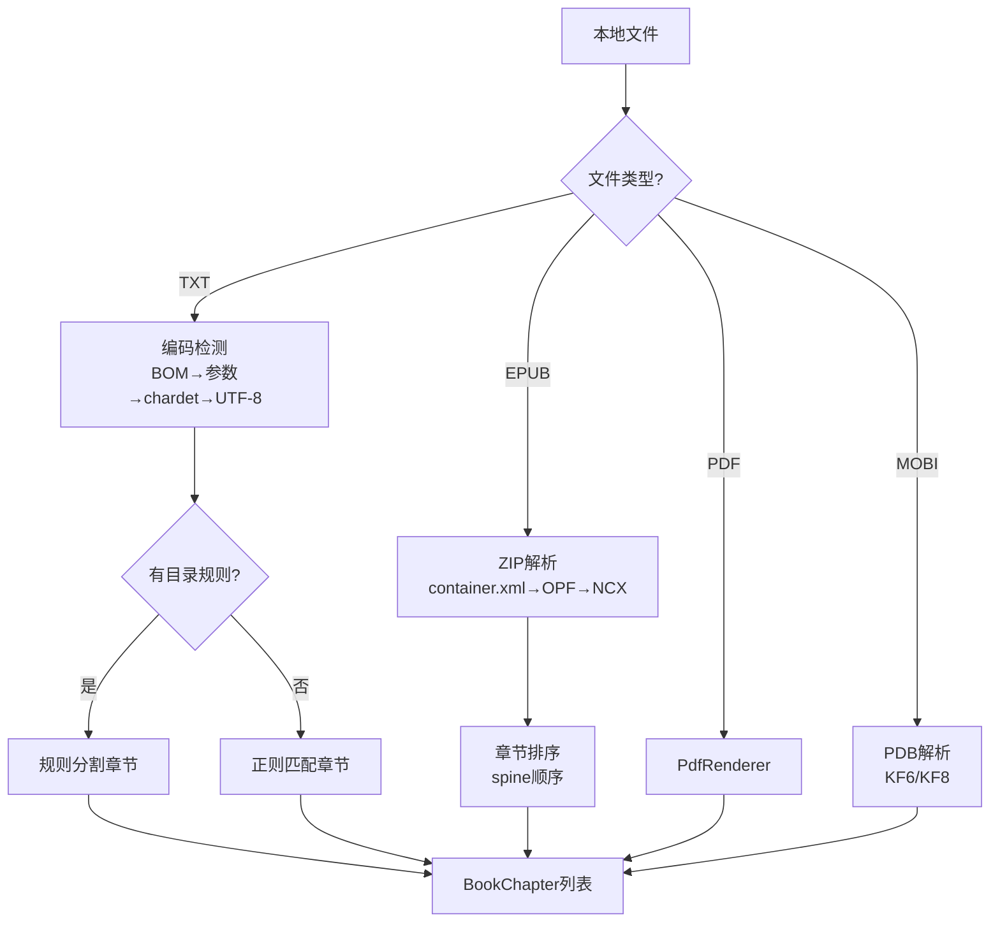
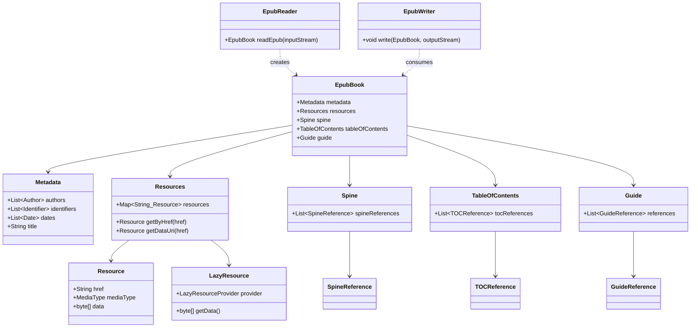
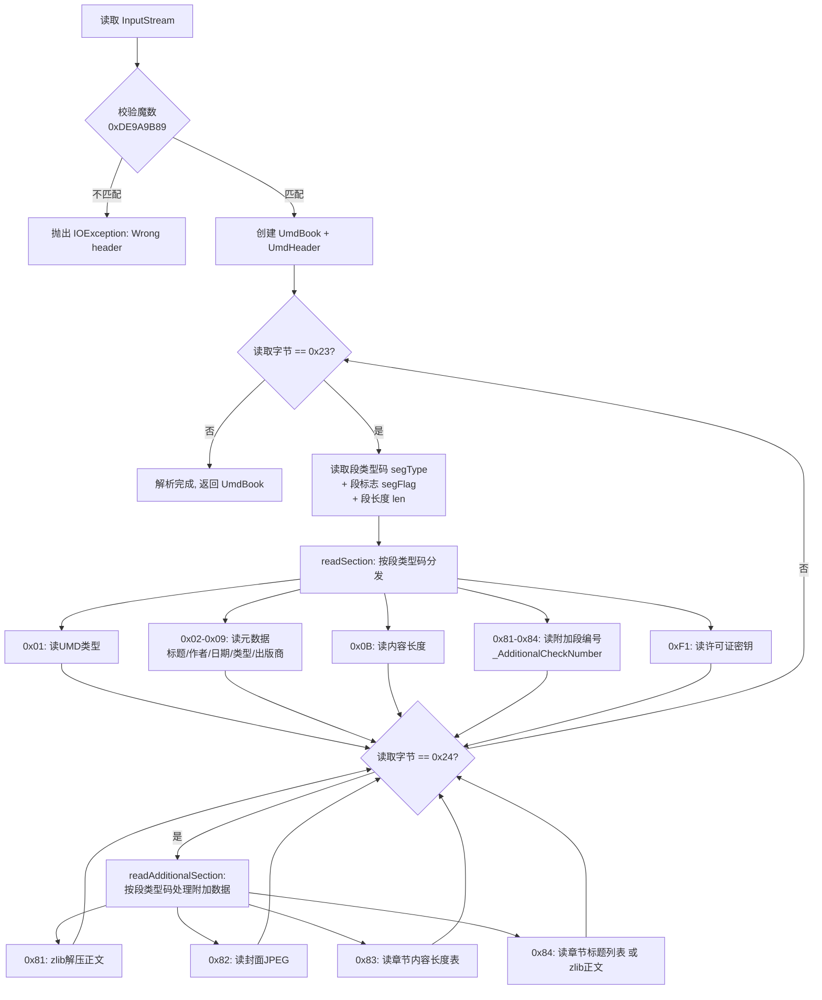

# 本地书籍解析模块

> LocalBook 门面模式统一入口，支持 TXT/EPUB/PDF/MOBI/UMD 五种格式——TXT 目录规则自动选择是核心算法。

---

## 1. 架构总览 — LocalBook 门面

[LocalBook.kt:69](file:///f:/myself/github/WeAgentChat/temp/legado/app/src/main/java/io/legado/app/model/localBook/LocalBook.kt#L69)

```
LocalBook (门面)
  ├── isEpub()  → EpubFile  (EPUB懒加载解析)
  ├── isUmd()   → UmdFile   (UMD漫画格式)
  ├── isPdf()   → PdfFile   (PDF渲染)
  ├── isMobi()  → MobiFile  (Mobi/Kindle格式)
  └── else      → TextFile  (TXT编码检测+章节分割)
```

### 1.1 BaseLocalBookParse 接口

```
interface BaseLocalBookParse:
  upBookInfo(book)             → 从文件中解析书名/作者等元信息
  getChapterList(book)         → 获取章节目录列表
  getContent(book, chapter)    → 获取章节正文
  getImage(book, href)         → 获取内嵌图片(EPUB专用)
```

### 1.2 类型分发



[LocalBook.kt:120-213](file:///f:/myself/github/WeAgentChat/temp/legado/app/src/main/java/io/legado/app/model/localBook/LocalBook.kt#L120-L213)

```
getChapterList(book):
  when:
    isEpub(book) → EpubFile.getChapterList(book)
    isUmd(book)  → UmdFile.getChapterList(book)
    isPdf(book)  → PdfFile.getChapterList(book)
    isMobi(book) → MobiFile.getChapterList(book)
    else         → TextFile.getChapterList(book)
```

### 1.3 文件导入 — importFile

[LocalBook.kt:241-272](file:///f:/myself/github/WeAgentChat/temp/legado/app/src/main/java/io/legado/app/model/localBook/LocalBook.kt#L241-L272)

```
importFile(filePath):
  1. 根据扩展名判断类型
  2. 创建 Book 对象（bookUrl=文件路径）
  3. analyzeNameAuthor() → 从文件名解析书名和作者
  4. upBookInfo() → 从文件内容解析元信息
  5. getChapterList() → 生成章节目录
  6. 写入数据库
```

### 1.4 数据模型

```
Book:
  - bookUrl: str         # 文件路径/URI
  - tocUrl: str          # 目录规则（TXT）或章节列表
  - originName: str      # 原始文件名 如 "三体.epub"
  - name: str            # 解析后的书名
  - author: str          # 解析后的作者
  - charset: str         # 字符编码（TXT 特有）
  - type: int            # BookType 位标志
  - coverUrl: str        # 封面路径
  - intro: str           # 简介
  - totalChapterNum: int # 章节总数
  - durChapterIndex: int # 当前阅读章节索引

BookChapter:
  - url: str             # 章节唯一标识
  - title: str           # 章节标题
  - index: int           # 章节序号
  - bookUrl: str         # 所属书籍
  - start: long          # TXT: 字节偏移起始
  - end: long            # TXT: 字节偏移结束
  - startFragmentId: str # EPUB: 起始 fragment ID
  - endFragmentId: str   # EPUB: 结束 fragment ID
  - isVolume: bool       # 是否是卷名
  - wordCount: str       # 字数统计
  - variable: str        # JSON 变量（如 nextUrl）
```

---

## 2. TXT 解析完整流程

[TextFile.kt:26](file:///f:/myself/github/WeAgentChat/temp/legado/app/src/main/java/io/legado/app/model/localBook/TextFile.kt#L26)

### 2.1 编码检测（四级降级策略）

```
编码检测顺序（严格按优先级）:

1. BOM 检测:
   ├── EF BB BF       → UTF-8
   ├── FF FE          → UTF-16 LE
   └── FE FF          → UTF-16 BE

2. 参数指定编码:
   └── book.charset（用户手动指定的编码）→ 跳过自动检测

3. chardet 自动检测:
   └── 使用 CharsetDetector（icu4j 移植版）
       ├── 检测前 8000 字节
       ├── 返回匹配度最高的编码
       └── 失败则 fallback 到 UTF-8

4. 默认 UTF-8
```

**核心源码逻辑**（TextFile.kt）：

```kotlin
// getChapterList() 中首次读取时的编码检测
val buffer = ByteArray(bufferSize)  // 512000 bytes
val length = bis.read(buffer)
if (book.charset.isNullOrBlank() || modified) {
    book.charset = EncodingDetect.getEncode(buffer.copyOf(length))
    // EncodingDetect.getEncode 内部使用 CharsetDetector.setText().detect()
}
// book.fileCharset() 最终转为 java.nio.charset.Charset
```

### 2.2 BOM 跳过

读取文件头 3 字节检测 UTF-8 BOM，跳过 BOM 再开始解析：

```kotlin
bufferStart = 3
bis.read(buffer, 0, 3)
if (Utf8BomUtils.hasBom(buffer)) {  // [0xEF, 0xBB, 0xBF]
    bufferStart = 0   // buffer[0..2] 是 BOM，从 index=3 开始才是内容
    curOffset = 3
}
```

### 2.3 章节分割 — 核心算法

TXT 章节解析是 Legado 最复杂的算法之一，分为**有规则分割**和**无规则分割**两种模式。

#### 2.3.1 无规则分割（analyze_no_rule）

[TextFile.kt:89-154](file:///f:/myself/github/WeAgentChat/temp/legado/app/src/main/java/io/legado/app/model/localBook/TextFile.kt#L89-L154)

当用户未指定目录规则或规则为空时使用：

```
参数: maxLengthWithNoToc = 10 * 1024 字节
缓冲区: bufferSize = 512000 字节

算法:
1. 每次读满 bufferSize 字节
2. 每 maxLengthWithNoToc 字节寻找最近的换行符 (0x0A)
3. 在换行符处切分章节
4. 章节标题自动命名为 "第{blockPos}章({chapterPos})"
5. 文件末尾剩余内容 < 100 字节 → 合并到上一章

关键数据结构:
  BookChapter(url, title, index, bookUrl, start: Long, end: Long)
  start/end 为字节偏移量，正文获取时按偏移读取
```

#### 2.3.2 有规则分割（analyze_with_rule）

[TextFile.kt 目录规则处理](file:///f:/myself/github/WeAgentChat/temp/legado/app/src/main/java/io/legado/app/model/localBook/TextFile.kt)

使用正则规则匹配章节标题：

**规则结构（TxtTocRule）：**
```
- name: String        — 规则名称（如"常见格式"）
- rule: String        — 正则表达式
- replacement: String? — JS 净化脚本（对匹配标题做进一步处理）
```

**默认规则示例：**
```
"^[ 　\\t]{0,4}(?:序章|楔子|正文(?!完|结)|终章|后记|尾声|番外|
  第\\s{0,4}[\\d〇零一二两三四五六七八九十百千万壹贰叁肆伍陆柒捌玖拾佰仟]+?
  \\s{0,4}(?:章|节(?!课)|卷|集(?![合和])|部(?![分赛游])|篇(?!张))).{0,30}$"
```

**有规则分割核心流程**：

```
输入:
  - rule_regex: str (正则表达式)
  - js_replacement: str (可选的 JS 净化脚本)

流程:
1. 编译正则 pattern = compile(rule_regex, MULTILINE)
2. 以 buffer_size(512000) 为单位分块处理大文件
3. 用正则逐行匹配每个 block
4. 对每个匹配到的标题位置:
   a. 计算上一章内容区间 [seekPos, matcher.start())
   b. 调用 replacement() 净化标题文本
   c. 根据上下文创建/更新 BookChapter

关键上下文决策树:

情况1: seekPos == 0 && chapterStart != 0
  ├── toc 为空 → 序章/前言处理:
  │     ├── 创建"前言"章节
  │     └── 前 600 字作为 book.intro
  └── toc 不为空 → 上一章剩余内容追加到上一章末尾

情况2: 正常匹配
  ├── toc 不为空 → 上一章 end 修正，创建新章
  ├── toc 为空   → 直接创建第一章
  └── 章节过长(>102400) → splitLongChapter 拆分

情况3: seekPos == 0 && chapterStart == 0
  └── block 开头即是标题，正常创建

5. 最后一个 block 处理完成后，检查末章是否过长需拆分
```

#### 2.3.3 章节拆分（splitLongChapter）

当章节超过 `maxLengthWithToc(102400)` 字节时启用：

```
if getSplitLongChapter() and (end - start) > maxLengthWithToc:
    1. 标记当前章节为卷(isVolume = true)
    2. 用无规则分割法重新切分该区间
    3. 子章节命名为 "{原标题}(1)", "{原标题}(2)" ...
```

### 2.4 标题净化（JS 引擎）

匹配到的正则结果可经 JS 引擎处理后作为最终标题：

```javascript
// 用户自定义的 JS 替换脚本（存储在 txtTocRule.replacement 中）
// 可用变量：
//   result       - 匹配到的原始文本
//   book         - 替换用的 Book 信息
//   index        - 当前章节序号
//   prevTitle    - 上一章节标题
//   prevLength   - 上一章节内容长度
//   lastVolumeTitle - 上一个卷名
//   java.putVolume("标题") - 插入卷标记

// 简单示例：去除标题中的空格
result.replace(/\s+/g, "")
```

### 2.5 自动选规则算法（getTocRule）

[TextFile.kt:497-535](file:///f:/myself/github/WeAgentChat/temp/legado/app/src/main/java/io/legado/app/model/localBook/TextFile.kt#L497-L535)

```
getTocRule(book):
  1. 读取前 bufferSize(512000) 字节 → 解码为字符串
  2. 遍历所有启用的 TxtTocRule
  3. 对每个规则:
     a. 对整个字符串执行正则匹配
     b. 统计匹配数 csNum
     c. 统计误匹配数 numE（相邻章节字数 < 100 的视为误匹配）
     d. 要求 csNum >= numE * 3（有效匹配远多于误匹配）
     e. 取匹配数最大的规则，但要求超过前一名 >= 2
     f. 若 maxNum > 70，提前终止（足够精确）
  4. 选择最佳规则 → 存入 book.tocUrl
```

**匹配结果存储格式**：

```
ruleRegex + replacement → 存储为 "rule\0replacement"
book.tocUrl = rule + spaceChars("🫅🈳🏻") + replacement
```

### 2.6 文件读取缓冲优化

```
缓冲策略:
  - txtBufferSize = 8 * 1024 * 1024 (8MB)
  - 以 8MB 为基准对齐读入缓冲区
  - 按 start 计算所在块: bufferStart = txtBufferSize * (start / txtBufferSize)

章节内容读取(getContent):
  if 章节完全在缓冲区内:
      直接从缓冲区拷贝 [start - bufferStart, end - bufferStart]
  else (跨缓冲区边界):
      重新打开文件流 seek(start), 逐字节读取

  返回前:
      去除前导换行/空白
      替换为全角空格缩进 "　　"
```

### 2.7 总字数统计

```
getWordCount:
  1. 若 AppConfig.tocCountWords 为 false 则跳过
  2. 从数据库读取已存储的章节字数缓存
  3. 按 getFileName() 匹配填充到新解析的章节列表
```

---

## 3. EPUB 解析

[EpubFile.kt:35](file:///f:/myself/github/WeAgentChat/temp/legado/app/src/main/java/io/legado/app/model/localBook/EpubFile.kt#L35)

### 3.1 懒加载策略

```
EpubBook 对象懒加载（首次使用时创建）:

getChapterList(book):
  1. 创建 EpubBook(book.bookUrl) → 解析 container.xml/opf/ncx
  2. 提取 spine 中的章节列表
  3. 为每个章节创建 BookChapter
     字段特殊: tag → 用于标识 epub fragment ID

getContent(book, chapter):
  1. EpubBook.getResourceByFragment(BookChapter.tag)
  2. 返回 xhtml 内容
```

### 3.2 核心数据结构

```
EpubBook:
  - spine: List<EpubSpine>     — 书脊（阅读顺序）
  - resources: Map<String, Resource> — 资源映射
  - metadata: title/author/cover 等

BookChapter 特殊字段:
  - tag: String?               — EPUB 内部 fragment ID
  - startFragmentId: String?   — 起始 fragment ID
  - endFragmentId: String?     — 结束 fragment ID
```

### 3.3 ZIP 结构

EPUB 本质是一个 ZIP 压缩包，标准目录结构如下：

```
book.epub
├── mimetype                    # 固定内容 "application/epub+zip"（不压缩）
├── META-INF/
│   └── container.xml           # 指向 OPF 文件路径
└── OEBPS/                      # 内容目录（名称可变）
    ├── content.opf             # 元数据 + manifest + spine
    ├── toc.ncx                 # （可选）NCX 传统目录
    ├── xhtml/
    │   ├── chapter_001.xhtml
    │   ├── chapter_002.xhtml
    │   └── ...
    └── images/
        ├── cover.jpg
        └── ...
```

### 3.4 container.xml 解析

```xml
<?xml version="1.0"?>
<container version="1.0"
           xmlns="urn:oasis:names:tc:opendocument:xmlns:container">
  <rootfiles>
    <rootfile full-path="OEBPS/content.opf"
              media-type="application/oebps-package+xml"/>
  </rootfiles>
</container>
```

**关键字段**：
- `rootfile.full-path`：OPF 文件在 ZIP 内的相对路径

### 3.5 OPF 解析

```xml
<?xml version="1.0" encoding="utf-8"?>
<package xmlns="http://www.idpf.org/2007/opf"
         unique-identifier="bookid" version="2.0">

  <!-- metadata: 元数据 -->
  <metadata xmlns:dc="http://purl.org/dc/elements/1.1/">
    <dc:title>三体</dc:title>
    <dc:creator>刘慈欣</dc:creator>
    <dc:language>zh-CN</dc:language>
    <dc:identifier id="bookid">urn:uuid:...</dc:identifier>
    <meta name="cover" content="cover-image"/>
  </metadata>

  <!-- manifest: 资源清单 -->
  <manifest>
    <item id="cover"        href="images/cover.jpg"       media-type="image/jpeg"/>
    <item id="ncx"          href="toc.ncx"                 media-type="application/x-dtbncx+xml"/>
    <item id="chapter_001"  href="xhtml/chapter_001.xhtml" media-type="application/xhtml+xml"/>
    <item id="chapter_002"  href="xhtml/chapter_002.xhtml" media-type="application/xhtml+xml"/>
    <item id="css"          href="styles/main.css"         media-type="text/css"/>
  </manifest>

  <!-- spine: 阅读顺序 -->
  <spine toc="ncx">
    <itemref idref="cover" linear="no"/>
    <itemref idref="chapter_001"/>
    <itemref idref="chapter_002"/>
  </spine>
</package>
```

**OPF 三段核心**：

| 段 | 作用 | 关键属性 |
|------|------|---------|
| metadata | 书籍元信息 | dc:title, dc:creator, dc:language, dc:identifier, dc:description |
| manifest | 所有资源文件清单 | id, href, media-type |
| spine | 阅读顺序（章节排列） | itemref.idref → manifest item.id, itemref.linear |

### 3.6 NCX 目录解析（可选）

```xml
<?xml version="1.0" encoding="utf-8"?>
<!DOCTYPE ncx PUBLIC "-//NISO//DTD ncx 2005-1//EN"
  "http://www.dtd.org/NISO/2005/ncx-2005-1.dtd">
<ncx xmlns="http://www.dtd.org/NISO/2005/ncx" version="2005-1">
  <navMap>
    <navPoint id="navpoint_1" playOrder="1">
      <navLabel><text>第一章 科学边界</text></navLabel>
      <content src="xhtml/chapter_001.xhtml"/>
      <!-- 子节点 -->
      <navPoint id="navpoint_1_1" playOrder="2">
        <navLabel><text>1.1 汪淼</text></navLabel>
        <content src="xhtml/chapter_001.xhtml#sec_1_1"/>
      </navPoint>
    </navPoint>
    <navPoint id="navpoint_2" playOrder="3">
      <navLabel><text>第二章 三体问题</text></navLabel>
      <content src="xhtml/chapter_002.xhtml"/>
    </navPoint>
  </navMap>
</ncx>
```

**NCX 解析要点**：
- `navMap > navPoint`：目录条目，可递归嵌套
- `navLabel > text`：显示的目录标题
- `content.src`：对应的资源路径，可含 `#fragmentId`
- `playOrder`：播放顺序（即阅读顺序）
- **多级目录**：子 `navPoint` 即二级/三级目录

### 3.7 章节解析

Legado 使用 `epublib`（第三方库 + 自修改版）解析 EPUB。

**章节列表生成逻辑**（两者选一）：

```
方式 A（有 NCX）：parseMenu()
  ├── 先 parseFirstPage(): 扫描第一章前的所有内容（封面、引言、扉页）
  │     以 firstRef.completeHref 为终止标志
  │     → 逐个创建 BookChapter，title 从 <title> 标签获取
  ├── 然后 parseMenu(): 递归遍历 NCX navPoint 树
  │     → 每个 navPoint → 一个 BookChapter
  │     → children 不为空 → isVolume = true
  │     → 设置 startFragmentId / endFragmentId 精确位置
  └── 设置 nextUrl 指针 → chapter.putVariable("nextUrl", nextUrl)

方式 B（无 NCX）：spineReferences
  ├── 直接按 spine 顺序遍历
  ├── 每个 resource → 一个 BookChapter
  ├── title 优先用 resource.title，没有则从 <title> 标签解析
  └── 首章节 title 为空时设 "封面"
```

**FragmentId 精确位置定位**：

```
当 XHTML 文件中包含多个章节时，通过锚点(#)精确定位：
  - startFragmentId: 当前章节的起始锚点
  - endFragmentId: 下一章节的起始锚点（当前章节的结束边界）

用于 getContent() 中精确截取正文：
  1. 按 startFragmentId 找对应 Element → 取 outerHtml
  2. 按 endFragmentId 截断尾部
  3. 若需跨越多个 XHTML 文件，合并内容后截取
```

### 3.8 章节内容读取

```
getContent(chapter):
  1. 获取当前章节的 XHTML resource href
  2. 获取下一章节的 XHTML resource href（from nextUrl variable）
  3. 按 spine 顺序遍历资源：
     a. 跳过 start 之前的所有 resource
     b. 对目标 resource 调用 getBody():
        - Jsoup 解析 → 去除 script/style →
        - 处理 startFragmentId 截取起始 →
        - 处理 endFragmentId 截取结束 →
        - 去除 H1-H6 标签（可配置） →
        - 转换 <image xlink:href> 为  →
        - 解析相对路径为绝对路径 →
     c. 若需跨文件（includeNextChapterResource），合并内容
  4. 去除 display:none 元素
  5. 去除 title 标签
  6. 去除重复封面图
  7. 处理 ruby 注音标签（可配置）
  8. 返回 HtmlFormatter.formatKeepImg(html)
```

---

## 4. PDF 解析

[PdfFile.kt](file:///f:/myself/github/WeAgentChat/temp/legado/app/src/main/java/io/legado/app/model/localBook/PdfFile.kt)

### 4.1 解析方案

Android 原生使用 `PdfRenderer` + `ParcelFileDescriptor` 渲染 PDF，将每页渲染为 Bitmap 图片展示。

**核心限制**：
- PDF 不是流式文档，无法提取纯文本
- 每个"章节" = 固定 10 页的图片集合
- 无文本目录提取，章节标题自动命名为 `分段_{index}`

### 4.2 章节生成

```kotlin
// 以 PAGE_SIZE = 10 页为一个分段
val chapterCount = ceil(renderer.pageCount / PAGE_SIZE)
for (i in 0 until chapterCount) {
    chapter.title = "分段_${i}"
    chapter.url = "pdf_${i}"
}
```

### 4.3 内容读取

```kotlin
// 返回 HTML img 标签，src 为页码索引
getContent(chapter):
    start = chapter.index * PAGE_SIZE
    end = min((chapter.index + 1) * PAGE_SIZE, pageCount)
    for i in start..end:
        append("")

// getImage(href) 渲染对应页码Bitmap:
    index = href.toInt()
    page = renderer.openPage(index)
    bitmap = createBitmap(screenWidth, screenWidth * page.height / page.width)
    page.render(bitmap)
    return bitmap.toInputStream()
```

---

## 5. MOBI 解析

[MobiFile.kt](file:///f:/myself/github/WeAgentChat/temp/legado/app/src/main/java/io/legado/app/model/localBook/MobiFile.kt)

### 5.1 格式概述（指针）

> MOBI 二进制格式的完整解析——PDB 容器（PDBFile）、MobiReader 格式识别与分派、头部解析层级、解压引擎（Plain/Lz77/Huffcdic）、KF6/KF8 章节处理——已在 [custom-libraries.md §1 lib/mobi/](custom-libraries.md) 详述，本节不重复，仅保留 LocalBook 侧调用视角。

MOBI 格式基于 Palm DOC 数据库（PDB）容器：

```
PDB Header → Record List → PalmDoc/MOBI Header（含 EXTH 扩展头） → Content Records（正文/索引/FLIS/FDST）
```

### 5.2 两种子格式

Legado 的 MobiReader 区分两种格式（识别与分派入口见 [custom-libraries.md §1.3](custom-libraries.md)）：

| 类型 | 说明 | 解析方式 |
|------|------|---------|
| **KF6** (KF6Book) | 传统 MOBI（使用 PalmDoc 压缩） | Huffcdic/Lz77 解压 → HTML → 提取文本 |
| **KF8** (KF8Book) | Kindle Format 8（含 EPUB-like 结构） | 类似 EPUB，解析 text 和 media 资源 |

### 5.3 目录解析

```
getChapterList():
  if mobiBook is KF8Book:
    → getChapterListKF8()
  else:
    → getChapterListKF6()

两者逻辑基本相同：
  1. 检查 sectionIdMap[0] 是否有内容
  2. 若否 → 第一个 section 作为"卷首"，<title> 标签文本作为标题
  3. 遍历 TOC 树：
     a. 每个 TOC ref → 一个 BookChapter
     b. url = "{index}:{href}"（索引用于定位）
     c. subitems != null → isVolume = true
     d. 卷与子章指向同一 href → 卷标记为 "skip:{url}"
     e. 设置 nextUrl 指针
```

---

## 6. UMD 解析

[UmdFile.kt](file:///f:/myself/github/WeAgentChat/temp/legado/app/src/main/java/io/legado/app/model/localBook/UmdFile.kt)

UMD 是一种国产电子书格式，解析相对简单：

```kotlin
class UmdFile(var book: Book) {
    private var umdBook: UmdBook? = null

    private fun readUmd(): UmdBook? {
        val input = LocalBook.getBookInputStream(book)
        return UmdReader().read(input)
    }

    private fun getChapterList(): ArrayList<BookChapter> {
        // 直接从 UmdBook.chapters.titles 获取标题列表
        umdBook?.chapters?.titles?.forEachIndexed { index, _ ->
            val title = umdBook!!.chapters.getTitle(index)
            chapter.title = title
            chapter.url = index.toString()
        }
    }

    private fun getContent(chapter: BookChapter): String? {
        return umdBook?.chapters?.getContentString(chapter.index)
    }
}
```

---

## 7. 文件名解析书名作者

[LocalBook.kt:347-385](file:///f:/myself/github/WeAgentChat/temp/legado/app/src/main/java/io/legado/app/model/localBook/LocalBook.kt#L347-L385)

```
analyzeNameAuthor(book):
  从文件名解析书名和作者:
    "三体 - 刘慈欣.txt" → name="三体", author="刘慈欣"
    "三体_刘慈欣.txt"   → name="三体", author="刘慈欣"
    "三体（刘慈欣）.txt" → name="三体", author="刘慈欣"

  支持的分隔符: - _ （ ） 《 》
```

---

## 8. 关键设计要点总结

| 格式 | 编码 | 目录来源 | 内容结构 | 性能瓶颈 |
|------|------|---------|---------|---------|
| TXT | BOM → 参数 → chardet → UTF-8 | 正则规则 + 自动选优 | 字节偏移量定位 | 大文件正则匹配 |
| EPUB | ZIP 内 UTF-8（多数） | NCX 层级目录 / spine | 分段 XHTML 合并 | ZIP 随机读 + Jsoup 解析 |
| PDF | 二进制渲染 | 固定页数分段 | 图片渲染（无法提取文本） | 页面渲染速度 |
| MOBI | UTF-8 / Latin1 | INDX 索引记录 | HTML 片段 + 解压 | Huffcdic 解压 |
| UMD | 编码 | UmdBook.chapters | 预分割段落 | — |

**核心设计模式**：

1. **单例缓存**：每个解析器类都维护一个静态单例，避免重复打开文件
2. **懒加载**：首次访问时才初始化解析器（`get() { if (field == null) field = readXxx() }`）
3. **缓冲读写**：TXT 使用 8MB 缓冲区 + 字节对齐，减少磁盘 IO
4. **ParcelFileDescriptor**：EPUB/PDF/MOBI 共享同一文件描述符，避免多线程冲突
5. **内容格式化管线**：EPUB/MOBI 的 HTML 内容经统一格式化后输出（去标签、转图片路径、去 display:none）

---

## 9. 相关代码锚点

| 功能 | 文件 | 行号 |
|------|------|------|
| LocalBook object | [LocalBook.kt](file:///f:/myself/github/WeAgentChat/temp/legado/app/src/main/java/io/legado/app/model/localBook/LocalBook.kt) | L69 |
| getChapterList 分发 | [LocalBook.kt](file:///f:/myself/github/WeAgentChat/temp/legado/app/src/main/java/io/legado/app/model/localBook/LocalBook.kt) | L120-170 |
| getContent 分发 | [LocalBook.kt](file:///f:/myself/github/WeAgentChat/temp/legado/app/src/main/java/io/legado/app/model/localBook/LocalBook.kt) | L172-213 |
| importFile 导入 | [LocalBook.kt](file:///f:/myself/github/WeAgentChat/temp/legado/app/src/main/java/io/legado/app/model/localBook/LocalBook.kt) | L241-272 |
| 文件名解析 | [LocalBook.kt](file:///f:/myself/github/WeAgentChat/temp/legado/app/src/main/java/io/legado/app/model/localBook/LocalBook.kt) | L347-385 |
| TextFile 类定义 | [TextFile.kt](file:///f:/myself/github/WeAgentChat/temp/legado/app/src/main/java/io/legado/app/model/localBook/TextFile.kt) | L26 |
| TXT编码检测 | [TextFile.kt](file:///f:/myself/github/WeAgentChat/temp/legado/app/src/main/java/io/legado/app/model/localBook/TextFile.kt) | L89-116 |
| TXT无规则分割 | [TextFile.kt](file:///f:/myself/github/WeAgentChat/temp/legado/app/src/main/java/io/legado/app/model/localBook/TextFile.kt) | L394-L492 |
| 目录规则自动选 | [TextFile.kt](file:///f:/myself/github/WeAgentChat/temp/legado/app/src/main/java/io/legado/app/model/localBook/TextFile.kt) | L497-535 |
| EpubFile 类定义 | [EpubFile.kt](file:///f:/myself/github/WeAgentChat/temp/legado/app/src/main/java/io/legado/app/model/localBook/EpubFile.kt) | L35 |
| EPUB目录解析 | [EpubFile.kt](file:///f:/myself/github/WeAgentChat/temp/legado/app/src/main/java/io/legado/app/model/localBook/EpubFile.kt) | L125-359 |
| PdfFile 类定义 | [PdfFile.kt](file:///f:/myself/github/WeAgentChat/temp/legado/app/src/main/java/io/legado/app/model/localBook/PdfFile.kt) | L1 |
| MobiFile 类定义 | [MobiFile.kt](file:///f:/myself/github/WeAgentChat/temp/legado/app/src/main/java/io/legado/app/model/localBook/MobiFile.kt) | L1 |
| UmdFile 类定义 | [UmdFile.kt](file:///f:/myself/github/WeAgentChat/temp/legado/app/src/main/java/io/legado/app/model/localBook/UmdFile.kt) | L1 |

---

## Python 重构参考（已迁移）

> 本模块的 Python 重构参考（TXT/EPUB/PDF/MOBI 解析器与本地书籍路由，P1-P5）已迁移至 [../python-ref/local-book.md](../python-ref/local-book.md)，该文件为唯一权威源。

---

---

## 附录A: epublib 模块参考

> 源码路径: `modules/book/src/main/java/me/ag2s/epublib/`

### domain/ 类列表（29 文件）

| 类名 | 职责 |
|------|------|
| `EpubBook` | EPUB 书籍顶层容器，持有 Metadata/Resources/Spine/TOC/Guide |
| `Metadata` | 书籍元数据（标题/作者/日期/标识符/发布者等） |
| `Author` | 作者信息（firstname/lastname） |
| `Identifier` | 书籍唯一标识符（ISBN/UUID 等） |
| `Date` | 出版/修改日期 |
| `Resource` | EPUB 内资源（HTML/CSS/图片/字体），含 href/mediatype/data |
| `LazyResource` | 延迟加载资源，仅在读时从 ZIP 提取数据 |
| `LazyResourceProvider` | LazyResource 的数据提供接口 |
| `Resources` | 资源集合管理器，支持 DataURI 内联解码（Base64） |
| `ResourceReference` | 对 Resource 的弱引用封装 |
| `TitledResourceReference` | 带标题的资源引用 |
| `Spine` | 阅读顺序列表（线性 spine 引用集合） |
| `SpineReference` | Spine 中单条引用 |
| `TableOfContents` | 目录树结构 |
| `TOCReference` | 目录条目（标题+href+子条目） |
| `Guide` | 指南引用集合（封面/目录/序言等语义引用） |
| `GuideReference` | 单条指南引用 |
| `MediaType` | MIME 类型封装（如 application/xhtml+xml） |
| `MediaTypes` | 预定义常用 MediaType 常量集合 |
| `Relator` | MARC21 角色代码映射（作者/编者/插图等） |
| `ManifestProperties` | EPUB3 manifest item properties 基类 |
| `ManifestItemProperties` | EPUB3 manifest item 属性枚举 |
| `ManifestItemRefProperties` | EPUB3 manifest itemref 属性枚举 |
| `ResourceInputStream` | 资源输入流封装 |
| `EpubResourceProvider` | EPUB ZIP 资源提供器 |
| `FileResourceProvider` | 文件系统资源提供器 |

### epub/ 类列表（17 文件）

| 类名 | 职责 |
|------|------|
| `EpubReader` | EPUB 读取入口，从 ZIP 解析 EpubBook |
| `EpubWriter` | EPUB 写入入口，将 EpubBook 序列化为 ZIP |
| `EpubWriterProcessor` | 写入处理器（清理/修复 HTML 等） |
| `EpubProcessorSupport` | 读写处理公共基类 |
| `BookProcessor` | 书籍处理器接口 |
| `BookProcessorPipeline` | 多 BookProcessor 串联管道 |
| `ResourcesLoader` | 资源加载器（ZIP→Resources） |
| `PackageDocumentReader` | OPF package document 解析器 |
| `PackageDocumentWriter` | OPF package document 生成器 |
| `PackageDocumentMetadataReader` | OPF 元数据读取 |
| `PackageDocumentMetadataWriter` | OPF 元数据写入 |
| `PackageDocumentBase` | OPF 读写公共常量/工具 |
| `NCXDocumentV2` | EPUB2 NCX 导航文档处理 |
| `NCXDocumentV3` | EPUB3 导航文档处理 |
| `HtmlProcessor` | HTML 清理/规范化处理 |
| `DOMUtil` | DOM 文档工具方法 |

### browsersupport/ 类列表（5 文件）

| 类名 | 职责 |
|------|------|
| `Navigator` | 浏览器导航接口 |
| `NavigationHistory` | 导航历史记录栈 |
| `NavigationEventListener` | 导航事件监听接口 |
| `NavigationEvent` | 导航事件对象 |
| `package-info.java` | 包文档 |

### util/ 类列表（11 文件）

| 类名 | 职责 |
|------|------|
| `IOUtil` | IO 流读写工具 |
| `ResourceUtil` | 资源路径/类型推断工具 |
| `StringUtil` | 字符串工具（截取/匹配/编解码） |
| `URLEncodeUtil` | URL 编解码工具 |
| `CollectionUtil` | 集合操作工具 |
| `NoCloseWriter` | 防关闭 Writer 包装 |
| `NoCloseOutputStream` | 防关闭 OutputStream 包装 |
| `commons/io/BOMInputStream` | BOM 自动检测输入流 |
| `commons/io/ByteOrderMark` | BOM 标记常量 |
| `commons/io/XmlStreamReader` | XML 编码自动检测读取器 |
| `commons/io/XmlStreamReaderException` | XML 编码检测异常 |

### util/zip/ 类列表（6 文件）

| 类名 | 职责 |
|------|------|
| `AndroidZipFile` | Android 兼容 ZIP 文件读取（支持 ENOTTY 回退） |
| `AndroidZipEntry` | Android 兼容 ZIP 条目 |
| `ZipFileWrapper` | ZIP 文件统一包装器（自动选择实现） |
| `ZipEntryWrapper` | ZIP 条目统一包装器 |
| `ZipConstants` | ZIP 格式常量 |
| `ZipException` | ZIP 操作异常 |

### 核心类关系图



---

## 附录B: umdlib 模块参考

> 源码路径: `modules/book/src/main/java/me/ag2s/umdlib/`

### domain/ 类列表（5 文件）

| 类名 | 职责 |
|------|------|
| `UmdBook` | UMD 书籍顶层容器，持有 Header/Chapters/Cover/End |
| `UmdHeader` | 头部信息（类型/标题/作者/日期/出版商等） |
| `UmdChapters` | 章节内容与标题列表（含 zlib 解压后的正文） |
| `UmdCover` | 封面图片（JPEG 字节数组） |
| `UmdEnd` | 文件结尾标记 |

### tool/ 类列表（3 文件）

| 类名 | 职责 |
|------|------|
| `UmdUtils` | Unicode 字节→字符串转换 + zlib 解压缩 |
| `StreamReader` | Little-Endian 流读取器（readByte/readShortLe/readIntLe/readHex 等） |
| `WrapOutputStream` | UMD 构建用输出流包装器 |

### umd/ 类列表（1 文件）

| 类名 | 职责 |
|------|------|
| `UmdReader` | UMD 格式解析入口，从 InputStream 读取并构建 UmdBook |

### 段类型码对照表

| 段类型码 (十进制) | 十六进制 | 含义 | 数据说明 |
|:---:|:---:|------|------|
| 1 | 0x01 | 文件头版本 (DCTS_CMD_ID_VERSION) | UMD 类型 + 2 字节随机数 |
| 2 | 0x02 | 文件标题 | Unicode 编码标题 |
| 3 | 0x03 | 作者 | Unicode 编码作者名 |
| 4 | 0x04 | 年 | 出版年份 |
| 5 | 0x05 | 月 | 出版月份 |
| 6 | 0x06 | 日 | 出版日期 |
| 7 | 0x07 | 小说类型 | 如玄幻/都市等分类 |
| 8 | 0x08 | 出版商 | Unicode 编码 |
| 9 | 0x09 | 零售商 | Unicode 编码 |
| 10 | 0x0A | 内容 ID (CONTENT ID) | HEX 编码标识符 |
| 11 | 0x0B | 内容长度 (DCTS_CMD_ID_FILE_LENGTH) | 4 字节 LE 整数 |
| 12 | 0x0C | 文件结束标记 | 整个文件长度 |
| 13 | 0x0D | 保留段 | — |
| 14 | 0x0E | 图片数据（主段） | 1 字节序号 |
| 15 | 0x0F | 图片数据（主段） | 原始字节 |
| 129 | 0x81 | 正文数据（附加段） | zlib 压缩正文 |
| 130 | 0x82 | 封面图片（附加段） | JPEG 字节数组 |
| 131 | 0x83 | 章节偏移（附加段） | 每 4 字节 LE 为一章内容长度 |
| 132 | 0x84 | 章节标题+正文（附加段） | 标题列表 或 zlib 压缩正文 |
| 135 | 0x87 | 页面偏移 (Page Offset) | 字体大小+屏幕宽+4字节指针 |
| 240 | 0xF0 | CDS KEY | 加密密钥 |
| 241 | 0xF1 | 许可证 (LICENCE KEY) | 16 字节 HEX |

### UMD 解析流程



---

## 附录C: Base64 解码参考

### 使用场景

项目中 Base64 解码出现在两个场景，均使用 `android.util.Base64`：

| # | 场景 | 源码位置 | 触发条件 |
|---|------|---------|---------|
| 1 | EPUB 内联 DataURI 解码 | `epublib/domain/Resources.java` | EPUB 资源的 href 以 `data:` 开头时，提取内联 Base64 数据 |
| 2 | 在线导入 DataURL 书籍 | `app/.../model/localBook/LocalBook.kt` | 导入 URL 为 `data:` 协议（如 `data:application/epub+zip;base64,...`）时 |

### 技术要点

| 要点 | 说明 |
|------|------|
| 依赖类 | `android.util.Base64`（Android SDK 内置，非 java.util.Base64） |
| 解码标志 | `Base64.DEFAULT` — 标准 RFC 4648 编码，含换行填充 |
| 编码格式 | RFC 4648 Table 1（标准 Base64 字母表 `A-Za-z0-9+/`，`=` 填充） |
| DataURI 正则 | `data:([\w/\-\.]+);base64,(.*)` — 捕获组1为 MIME 类型，捕获组2为 Base64 数据 |
| 截取方式 | `str.substringAfter("base64,")` — 直接截取 `base64,` 之后的内容 |
| 返回类型 | `byte[]` 字节数组 |
| 异常处理 | 输入非法时 `Base64.decode()` 返回空数组或抛出 `IllegalArgumentException` |

### 场景1: EPUB DataURI 解码流程

```
EpubReader.readEpub()
  → ResourcesLoader.loadResources()
    → Resources.getByHref(href)
      → href 以 "data:" 开头?
        → Pattern 匹配 "data:{MIME};base64,{DATA}"
        → Base64.decode(group(2), Base64.DEFAULT) → byte[]
        → new Resource(byte[], MediaType)
```

### 场景2: 在线导入 DataURL 解码流程

```
LocalBook.saveBookFile(str, fileName)
  → str.isDataUrl() == true?
    → str.substringAfter("base64,") → 提取编码部分
    → Base64.decode(extracted, Base64.DEFAULT) → byte[]
    → ByteArrayInputStream(byte[]) → InputStream
    → saveBookFile(inputStream, fileName)
```
