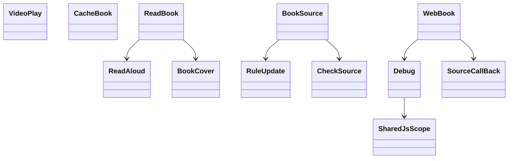
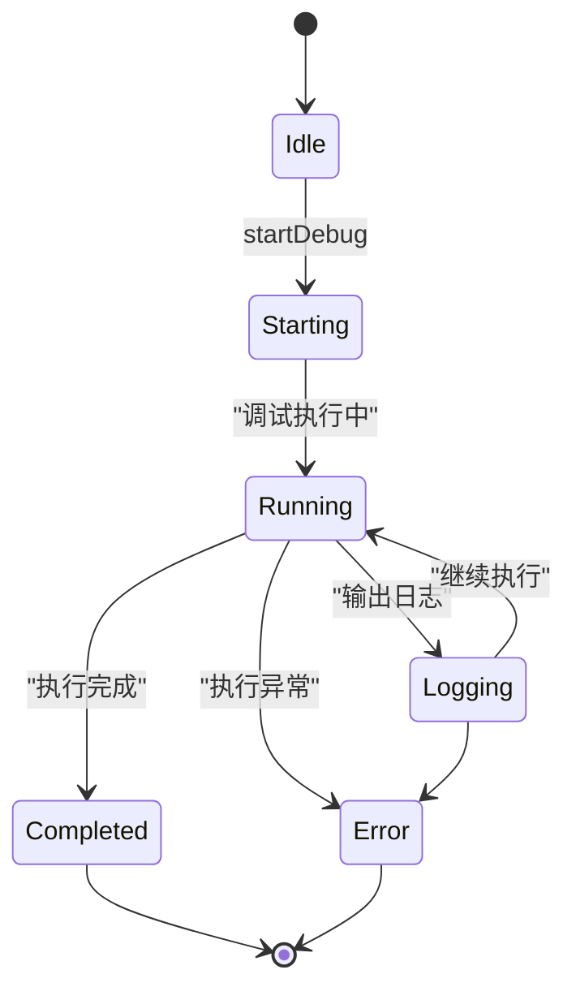

# Model 层全局单例

> **核心问题**：除 ReadBook/ReadManga/AudioPlay 外还有哪些全局单例？各自管理什么？
> **答案**：Model 层有 10 个全局单例——ReadAloud(朗读调度)、VideoPlay(视频播放)、BookCover(封面计算)、CheckSource(书源检验)、Debug(调试输出)、RuleUpdate(规则订阅更新)、SharedJsScope(共享JS作用域)、SourceCallBack(源回调)、ImageProvider(图片提供)、Download(下载)。

---

## 1. 单例全景

### 10 单例关系类图



### 文件结构

```
model/
├── ReadBook.kt        ← 阅读核心 (已文档化)→ reading-engine.md
├── ReadManga.kt       ← 漫画阅读 (已文档化)→ reading-engine.md
├── AudioPlay.kt       ← 音频播放 (已文档化)→ reading-engine.md
├── ReadAloud.kt       ← ⭐ 朗读控制调度
├── VideoPlay.kt       ← ⭐ 视频播放
├── BookCover.kt       ← ⭐ 封面计算引擎
├── CheckSource.kt     ← ⭐ 书源检验配置
├── Debug.kt           ← ⭐ 调试输出引擎
├── RuleUpdate.kt      ← ⭐ 规则订阅更新
├── SharedJsScope.kt   ← ⭐ 共享JS作用域(LRU)
├── SourceCallBack.kt  ← 书源回调接口
├── ImageProvider.kt   ← 图片内容提供器
├── Download.kt        ← 文件下载管理
├── CacheBook.kt       ← ⭐ 缓存管理 (已文档化)→ web-service.md
└── ...
```

---

## 2. ReadAloud — 朗读控制调度

**文件**：[ReadAloud.kt:L22-L80](file:///f:/myself/github/WeAgentChat/temp/legado/app/src/main/java/io/legado/app/model/ReadAloud.kt#L22)

### 职责

作为朗读的**业务门面**，不直接执行朗读，而是决定使用哪个 Service：

```kotlin
fun getReadAloudClass(): Class<*> {
    val engine = ttsEngine          // 从 Book.ttsEngine || AppConfig.ttsEngine
    if (engine.isNullOrBlank()) → TTSReadAloudService (系统TTS)
    if (engine.isNumeric()) {
        val httpTTS = appDb.httpTTSDao.get(engine.toLong())
        if (httpTTS != null) → HttpReadAloudService (HTTP在线TTS)
    }
    → TTSReadAloudService (默认)
}
```

### 两种启动方式

```kotlin
// 方式1：直接启动 Service (前台服务)
fun play(context, play, pageIndex, startPos)
    → Intent(aloudClass, action=play, extras: play/pageIndex/startPos)
    → context.startForegroundServiceCompat(intent)

// 方式2：通过 EventBus (Service 已启动时)
fun playByEventBus(play, pageIndex, startPos)
    → postEvent(READ_ALOUD_PLAY, Bundle)

fun pause/resume/stop/prevParagraph/nextParagraph/prevChapter/nextChapter
fun upTtsSpeechRate/addTimer/setTimer
```

### 切换引擎

```kotlin
fun upReadAloudClass() {
    stop(appCtx)
    aloudClass = getReadAloudClass()  // 重新选择 Service 类型
}
```

---

## 3. VideoPlay — 视频播放

**文件**：[VideoPlay.kt](file:///f:/myself/github/WeAgentChat/temp/legado/app/src/main/java/io/legado/app/model/VideoPlay.kt)

### 架构

继承 `CoroutineScope(MainScope())`，主线程协程作用域化管理。

### 视频来源

视频URL通过书源规则解析（类似网络书），支持：
- BookSource 书源视频章节
- RssSource 订阅源视频
- RssStar 收藏视频

### 核心配置

```kotlin
// 存储在 video_config SharedPreferences
var autoPlay: Boolean       // 是否自动播放
var startFull: Boolean      // 直接全屏（需先启用自动播放）
var longPressSpeed: Int     // 长按倍速值(m/s)

// 视频进度记忆: video_pos_{md5(url)}
// 视频缓存: externalCache/video_temp/
```

### Player 管理

- 全屏播放器：`ExoVideoManager` (GSY Video 的 ExoPlayer 适配)
- 悬浮窗播放器：`FloatingPlayer`
- 视频播放器：`VideoPlayer`

### 弹幕支持

- 从视频源获取弹幕 URL → 下载 Bilibili XML 格式弹幕
- `BiliDanmukuParser` 解析 → `DanmakuAdapter` 渲染

### 音轨/字幕

- 通过书源规则获取音轨/字幕 URL 列表
- 使用 GSY Video 多音轨/多字幕切换

---

## 4. BookCover — 封面计算引擎

**文件**：[BookCover.kt](file:///f:/myself/github/WeAgentChat/temp/legado/app/src/main/java/io/legado/app/model/BookCover.kt)

### 职责

为无封面的书籍自动生成封面图（绘制书名+作者）：

### 配置数据模型

```kotlin
// 封面规则配置 (coverRule.json)
Config {
    name: String              // 配置名称
    textSize: Int            // 文字大小
    textColor: Int           // 文字颜色
    bgColor: String          // 背景色
    bgImage: String          // 背景图路径
    drawBookName: Boolean    // 绘制书名
    drawBookAuthor: Boolean  // 绘制作者
    borderRadius: Int        // 圆角
    padding: Int             // 内边距
    ...
}
```

### 核心流程

```
load(coverUrl, bookName, bookAuthor)
    ├── coverUrl 有值 → Glide 加载远程封面
    ├── customCover(book) → 自定义 coverRule 绘制
    ├── defaultCover → 默认封面色绘制
    │   ├── 描 bookName (drawBookName=true)
    │   ├── 描 bookAuthor (drawBookAuthor=true)
    │   └── 返回 BitmapDrawable
    └── Glide 缓存 key = "bookCover_{coverUrl}_{width}x{height}"

upDefaultCover()
    ← AppConfig.defaultCover/defaultCoverDark
    ← ThemeConfig 切换时重新计算
```

### 封面规则来源

1. **全局规则**：`AppConfig.coverRuleConfig` (JSON)
2. **书源规则**：`BookSource.coverRule`
3. **书籍规则**：`Book.customCoverRule`
4. **默认规则**：`BookCover.defaultDrawable`

优先级：书籍 > 书源 > 全局 > 默认

---

## 5. CheckSource — 书源检验配置

**文件**：[CheckSource.kt](file:///f:/myself/github/WeAgentChat/temp/legado/app/src/main/java/io/legado/app/model/CheckSource.kt)

### 配置项（存储在 CacheManager 内存缓存）

| 配置 | 默认值 | 说明 |
|------|--------|------|
| `timeout` | 180s | 检验超时 |
| `checkDomain` | false | 检验域名 |
| `checkSearch` | true | 检验搜索 |
| `checkDiscovery` | true | 检验发现 |
| `checkInfo` | true | 检验详情 |
| `checkCategory` | true | 检验目录 |
| `checkContent` | true | 检验正文 |
| `wSourceComment` | true | 写入检验结果注释 |
| `keyword` | "我的" | 搜索关键字 |
| `summary` | (计算) | 配置摘要字符串 |

### 执行流程

```kotlin
start(context, selectedSources)
    → IntentData.put("checkSourceSelectedIds", [sourceUrls])
    → context.startService<CheckSourceService>(action=start)
```

CheckSourceService 读取 IntentData 中的书源列表，逐个执行检验：
Search → Discovery → Info → Category → Content，输出结果。

---

## 6. Debug — 调试输出引擎

**文件**：[Debug.kt](file:///f:/myself/github/WeAgentChat/temp/legado/app/src/main/java/io/legado/app/model/Debug.kt)

### 调试状态机

#### Debug 状态图



#### 文本描述

```
callback == null → 非调试模式，log() 不做任何输出
callback != null → 调试模式，log() 通过 callback 输出到 UI
```

### 数据结构

```python
class Debug:
    callback: Callback | None = None
    debug_source: str | None = None      # 当前调试的书源 URL
    tasks: CompositeCoroutine            # 管理的协程集合
    debug_message_map: dict[str, str]    # 书源校验结果消息
    debug_time_map: dict[str, int]       # 书源校验时间
    is_checking: bool                    # 是否在校验模式
    start_time: int                      # 调试开始时间
```

### 核心方法

```python
def log(source_url: str | None, msg: str, print: bool = True,
        is_html: bool = False, show_time: bool = True, state: int = 1):
    """
    输出调试日志
    @param source_url: 书源URL（仅当等于 debug_source 时输出）
    @param msg: 日志消息
    @param print: 是否输出到 callback
    @param is_html: 是否先 HTML 格式化
    @param show_time: 是否添加时间戳 `[mm:ss.SSS]`
    @param state: 状态码
    """

def log(msg: str):
    """简化重载版本，source_url=None, state=1"""

def startChecking(source):
    """开始校验模式"""

def finishChecking():
    """完成校验模式"""

def getRespondTime(sourceUrl: str) -> int:
    """获取书源响应时间（从 debug_time_map 中读取）"""

def updateFinalMessage(sourceUrl: str, state: int):
    """更新书源最终消息（根据 state 设置成功/失败消息到 debug_message_map）"""
```

### 调试日志状态码

| 状态码 | 含义 |
|--------|------|
| 1 | 普通日志 |
| 10/20/30/40 | 不发送到 WebSocket 的隐藏日志（notPrintState） |
| -1 | 错误，调试结束 |
| 1000 | 成功完成，调试结束 |

### 调试入口

```python
# 书源调试（WebSocket → BookSourceDebugWebSocket）
def start_debug(scope, book_source, key):
    """根据 key 格式自动决定调试步骤"""
    # key 是绝对URL → infoDebug → tocDebug → contentDebug
    # key 含 `::` → exploreDebug → infoDebug → ...
    # key 以 `++` 开头 → 直接目录页调试
    # key 以 `--` 开头 → 直接正文页调试
    # 其他 → searchDebug → infoDebug → tocDebug → contentDebug

# RSS 调试（WebSocket → RssSourceDebugWebSocket）
def start_debug(scope, rss_source, key):
    # 同上，但使用 Rss 模块
```

### Callback 接口

```python
class Callback(ABC):
    @abstractmethod
    def print_log(self, state: int, msg: str): ...
    # 用于 WebSocket 推送
```

---

## 7. RuleUpdate — 规则订阅更新

**文件**：[RuleUpdate.kt](file:///f:/myself/github/WeAgentChat/temp/legado/app/src/main/java/io/legado/app/model/RuleUpdate.kt)

### 职责

管理书源/RSS源/替换规则的远程订阅更新。

### 缓存架构

```kotlin
object RuleUpdate {
    val cacheBookSourceMap = ConcurrentHashMap<String, List<BookSource>>()     // URL→书源列表
    val cacheRssSourceMap = ConcurrentHashMap<String, List<RssSource>>()       // URL→RSS源列表
    val cacheReplaceRuleMap = ConcurrentHashMap<String, List<ReplaceRule>>()   // URL→替换规则列表
}
```

### 更新流程

```
cacheSource(ruleSub)
    ├── 检查更新间隔 (updateInterval 小时)
    │   └── 未到间隔 → return false
    ├── GET 订阅URL
    │   ├── url 含 "#requestWithoutUA" → header UA_NAME = "null"
    │   └── 正常 → 使用默认 UA
    ├── GSON 反序列化
    │   ├── type=0 → List<BookSource>
    │   ├── type=1 → List<RssSource>
    │   └── type=2 → List<ReplaceRule>
    ├── silentUpdate == true
    │   ├── 对比 lastUpdateTime → 自动插入/更新到 DB
    │   └── upRules = true → postEvent(SOURCE_CHANGED)
    └── silentUpdate == false
        └── 缓存到 cacheMap → UI 展示变更列表，用户确认导入
```

---

## 8. SharedJsScope — 共享 JS 作用域

**文件**：[SharedJsScope.kt](file:///f:/myself/github/WeAgentChat/temp/legado/app/src/main/java/io/legado/app/model/SharedJsScope.kt)

### 设计目的

多个书源可以共享同一个 JS 库作用域，避免重复下载/解析。

### 架构

```kotlin
object SharedJsScope {
    val cacheFolder = File(cacheDir, "shareJs")
    val aCache = ACache.get(cacheFolder)                         // 磁盘缓存
    val scopeMap = LruCache<String, WeakReference<Scriptable>>(16) // 内存LRU缓存
}
```

### 获取流程

```
getScope(jsLib, coroutineContext)
    ├── jsLib 为空 → return null
    ├── MD5(jsLib) → key
    ├── scopeMap[key]?.get() → 缓存命中 → return scope
    ├── jsLib 是 JSONObject (多文件)?
    │   ├── values.forEach:
    │   │   ├── isAbsUrl → GET下载 → aCache缓存(ACache)
    │   │   └── else → 直接 eval
    │   └── RhinoScriptEngine.run { getRuntimeScope() }
    ├── else (单文件字符串):
    │   └── RhinoScriptEngine.eval(jsLib, scope)
    └── scope is ScriptableObject → preventExtensions()  // 阻止隐式全局变量
    └── scopeMap.put(key, WeakReference(scope))           // LRU 缓存(16个)
```

### 特点

- **LRU 上限 16**：防止内存泄漏
- **WeakReference**：作用域可被 GC 回收
- **preventExtensions**：防止 JS 中意外创建全局变量
- **ACache 磁盘缓存**：下载的 JS 库持久化

### SharedJsScope 完整架构

```python
class SharedJsScope:
    """
    JS 执行作用域共享
    - 不同规则之间复用 compiled script
    - 共享 java 绑定对象
    - Rhino 的 ScriptableObject 共享
    """
    shared_scope: ScriptableObject  # 共享的顶级作用域

    # 三层缓存:
    # 1. scopeMap: LruCache<String, WeakReference<Scriptable>>(16) — 内存LRU缓存
    # 2. aCache: ACache(cacheFolder) — 磁盘缓存（下载的 JS 库持久化）
    # 3. cacheFolder: File(cacheDir, "shareJs") — 缓存目录
```

---

## 9. SourceCallBack — 书源回调

**文件**：[SourceCallBack.kt](file:///f:/myself/github/WeAgentChat/temp/legado/app/src/main/java/io/legado/app/model/SourceCallBack.kt)

### 职责

书源规则执行过程中的全局回调接口：

```kotlin
class SourceCallBack {
    var onGetHeaderMap: (() -> Map<String, String>)?   // 获取请求头
    var onGetCookie: (() -> String)?                    // 获取 Cookie
    var onRedirect: ((url: String) -> Unit)?            // 重定向回调
    var onLogin: ((source: BookSource) -> Unit)?        // 需登录回调
    var onError: ((error: String) -> Unit)?             // 错误回调
}
```

---

## 10. 外部生命周期调用关系

```
┌────────────────┐
│   BaseActivity  │─── onDestroy → CoroutineContainer.release()
│   (ViewModel)   │─── 调用 Model 单例方法
└───────┬────────┘
        │ 通过 Intent / EventBus
┌───────▼────────┐
│   Service 层   │─── BaseReadAloudService / AudioPlayService / VideoPlayService
│   (前台Service) │─── 读取 Model 单例状态 (ReadBook/AudioPlay/VideoPlay)
└───────┬────────┘
        │ EventBus
┌───────▼────────┐
│   Model 单例   │─── ReadAloud / VideoPlay / BookCover / CheckSource / Debug / RuleUpdate
│   (业务逻辑)   │─── 线程安全、无生命周期
└────────────────┘
```