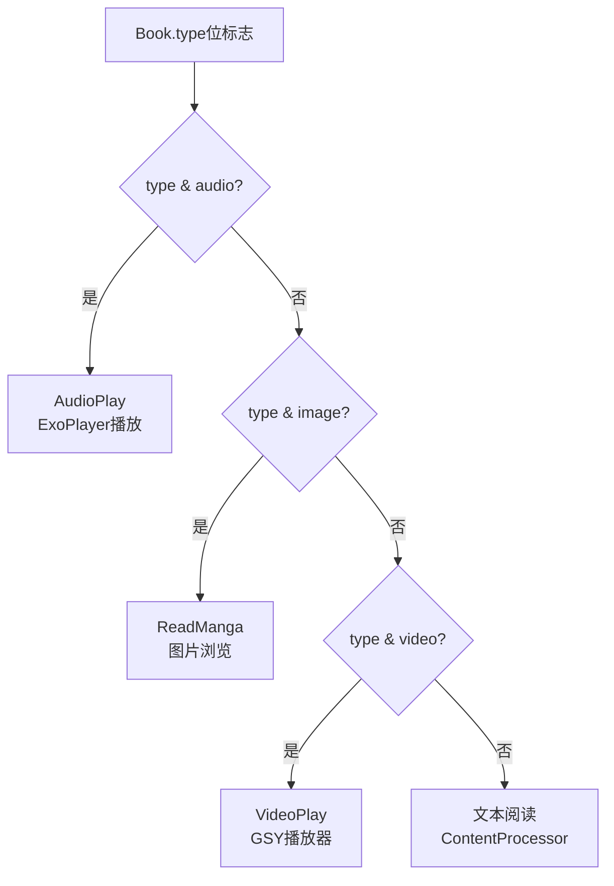

# 多媒体阅读（漫画+音频）

> ReadManga 漫画阅读实现、AudioPlay 音频播放实现、BookType 位标志。
> 主文档：[reading-engine.md](./reading-engine.md)

---

## 1. BookType 位标志

Legado 使用位标志（bit flags）来标识书籍类型，决定使用哪种阅读引擎：

```python
class BookType:
    """书籍类型位标志 — 对应 Legado Book"""
    TEXT = 0          # 默认：文字书
    IMAGE = 1         # 图片书（漫画）
    AUDIO = 2         # 有声书
    PDF = 3           # PDF 文件
    EPUB = 4          # EPUB 电子书
    CBZ = 5           # CBZ 漫画档案
    TXT = 6           # 本地 TXT 文件
```

### 1.1 类型判断方法

```python
def is_text(self) -> bool:
    """是否为文字书"""
    return self.book_type == BookType.TEXT

def is_image(self) -> bool:
    """是否为图片书（漫画）"""
    return self.book_type == BookType.IMAGE

def is_audio(self) -> bool:
    """是否为有声书"""
    return self.book_type == BookType.AUDIO

def is_pdf(self) -> bool:
    """是否为 PDF"""
    return self.book_type == BookType.PDF
```

### 1.2 引擎选择逻辑



---

## 2. ReadManga — 漫画阅读

[ReadManga.kt:45](file:///f:/myself/github/WeAgentChat/temp/legado/app/src/main/java/io/legado/app/model/ReadManga.kt#L45)

### 2.1 关键差异（vs ReadBook）

| 维度 | ReadBook（文字） | ReadManga（漫画） |
|------|-----------------|------------------|
| 章节内容 | 文本段落列表 | 图片 URL 列表 |
| 排版方式 | Canvas 文字排版 | 图片加载 + 缩放适配 |
| 分页依据 | 字符偏移（durChapterPos） | 图片索引 |
| 预加载 | 文本缓存 | 图片异步加载 + 内存缓存 |
| 翻页动画 | 6 种 PageDelegate | 6 种 PageDelegate（共用） |
| 缓存格式 | `.nb` 文本文件 | 图片文件（JPEG/PNG/WebP） |

### 2.2 图片显示模式（imageStyle）

```python
class ImageStyle:
    """图片显示模式 — 对应 Book.IMG_STYLE_*"""
    FULL = "1"       # 整页填充：每页显示一张图片，自适应缩放
    SINGLE = "2"     # 单页模式：类似文字书，每页一张图，强制 pageAnim=0
    SCROLL = "3"     # 滚动浏览：纵向连续滚动查看所有图片
```

**imageStyle 设置优先级**：
1. `book.getImageStyle()` — 书籍自定义设置
2. `bookSource.getContentRule().imageStyle` — 书源规则
3. 默认值 — 图片/PDF 类书籍默认 `IMG_STYLE_FULL`

### 2.3 ReadManga 核心实现

[ReadManga.kt:154-240](file:///f:/myself/github/WeAgentChat/temp/legado/app/src/main/java/io/legado/app/model/ReadManga.kt#L154-L240)

```python
class ReadManga:
    """
    漫画阅读引擎 — 对应 Legado ReadManga.kt

    与 ReadBook 共享三章缓存策略和翻页框架，
    但内容加载和渲染逻辑完全不同。
    """

    # 与 ReadBook 相同的状态字段
    book: Optional[Book] = None
    book_source: Optional[BookSource] = None
    dur_chapter_index: int = 0
    dur_chapter_pos: int = 0       # 漫画中 = 当前图片索引
    chapter_size: int = 0

    # 三章缓存（与 ReadBook 相同结构）
    prev_text_chapter: Optional[TextChapter] = None
    cur_text_chapter: Optional[TextChapter] = None
    next_text_chapter: Optional[TextChapter] = None

    # 漫画特有
    _image_provider: Optional[ImageProvider] = None
    _loading_images: dict[str, bool] = {}  # 图片加载状态

    def load_content(self, index: int, up_content: bool = True,
                     reset_page_offset: bool = False, success: callable = None):
        """
        加载漫画章节 — 与 ReadBook 类似，但内容为图片 URL 列表

        流程：
        1. 从数据库获取 BookChapter
        2. 从缓存/网络获取内容（图片 URL 列表）
        3. 创建 TextChapter（pages = 图片列表）
        4. 异步加载图片到内存缓存
        5. 回调通知 UI
        """
        chapter = get_chapter_from_db(self.book.book_url, index)
        if chapter is None:
            return

        if not self._add_loading(index):
            return

        content = BookHelp.get_content(self.book, chapter)

        if content is not None:
            self._content_load_finish(
                self.book, chapter, content,
                up_content, reset_page_offset, success=success
            )
        else:
            self._download(self._download_scope, chapter, reset_page_offset)

    def _content_load_finish(self, book, chapter, content, up_content=True,
                              reset_page_offset=False, canceled=False, success=None):
        """
        漫画内容加载完成处理

        与 ReadBook 的区别：
        - 内容是图片 URL 列表（而非文本段落）
        - 每个 URL 对应一页（IMG_STYLE_FULL/SINGLE）
        - 需要异步加载图片到内存
        """
        self._remove_loading(chapter.index)

        if canceled or chapter.index not in range(
                self.dur_chapter_index - 1, self.dur_chapter_index + 2):
            return

        # 解析图片 URL 列表
        image_urls = self._parse_image_urls(content)

        # 创建 TextChapter（每张图 = 一页）
        text_chapter = self._create_manga_chapter(
            book, chapter, image_urls
        )

        # 异步预加载图片
        self._preload_images(image_urls)

        # 赋值到三章缓存（与 ReadBook 相同逻辑）
        offset = chapter.index - self.dur_chapter_index
        if offset == 0:
            self.cur_text_chapter = text_chapter
            self.call_back and self.call_back.up_content(offset, reset_page_offset)
            self._cur_page_changed()
        elif offset == -1:
            self.prev_text_chapter = text_chapter
        elif offset == 1:
            self.next_text_chapter = text_chapter

        if success:
            success()

    def _parse_image_urls(self, content: str) -> list[str]:
        """
        解析图片 URL 列表

        从章节内容中提取所有图片 URL。
        支持多种格式：
        - JSON 数组: ["url1", "url2", ...]
        - 换行分隔: url1\nurl2\n...
        - HTML img 标签: ...
        """
        urls = []
        content = content.strip()

        if content.startswith("["):
            # JSON 数组格式
            import json
            try:
                urls = json.loads(content)
            except json.JSONDecodeError:
                pass
        else:
            # 换行分隔或 HTML
            for line in content.split("\n"):
                line = line.strip()
                if line and (line.startswith("http") or line.startswith("//")):
                    urls.append(line)

        return urls

    def _preload_images(self, image_urls: list[str]):
        """
        预加载图片到内存缓存

        策略：
        - 当前页图片优先加载
        - 前后各 2 页图片预加载
        - 使用 ImageProvider 异步加载
        - 加载完成后回调通知 UI 刷新
        """
        if self._image_provider is None:
            return

        for i, url in enumerate(image_urls):
            # 优先加载当前页附近的图片
            if abs(i - self.dur_chapter_pos) <= 2:
                self._image_provider.load_image(url, priority="high")
            else:
                self._image_provider.load_image(url, priority="low")

    def _create_manga_chapter(self, book, chapter, image_urls):
        """创建漫画 TextChapter（每张图 = 一页）"""
        pages = []
        for i, url in enumerate(image_urls):
            page = TextPage(
                index=i,
                chapter_position=i,  # 漫画中 position = 图片索引
                char_size=1,          # 每页 1 张图
                lines=[url]           # 存储图片 URL
            )
            pages.append(page)

        tc = TextChapter(
            chapter=chapter,
            position=chapter.index,
            title=chapter.title,
            chapters_size=self.chapter_size,
            same_title_removed=False,
            is_vip=chapter.is_vip,
            is_pay=chapter.is_pay,
        )
        tc._pages = pages
        tc.is_completed = True
        return tc
```

### 2.4 图片加载与缓存

```python
class ImageProvider:
    """
    图片提供器 — 对应 Legado ImageProvider

    负责图片的异步加载、内存缓存、磁盘缓存。
    """

    # 内存缓存（LruCache）
    _memory_cache: dict[str, bytes] = {}

    # 磁盘缓存路径
    _disk_cache_dir: str = "image_cache"

    def load_image(self, url: str, priority: str = "normal") -> Optional[bytes]:
        """
        加载图片

        优先级：
        1. 内存缓存命中 → 直接返回
        2. 磁盘缓存命中 → 加载到内存并返回
        3. 网络下载 → 存入磁盘+内存缓存并返回
        """
        # 1. 内存缓存
        if url in self._memory_cache:
            return self._memory_cache[url]

        # 2. 磁盘缓存
        disk_path = self._get_disk_cache_path(url)
        if os.path.exists(disk_path):
            data = read_file(disk_path)
            self._memory_cache[url] = data
            return data

        # 3. 网络下载（异步）
        asyncio.create_task(self._download_image(url, priority))
        return None

    async def _download_image(self, url: str, priority: str):
        """异步下载图片"""
        try:
            data = await http_get(url)
            self._memory_cache[url] = data
            disk_path = self._get_disk_cache_path(url)
            write_file(disk_path, data)
        except Exception as e:
            log_error(f"图片下载失败: {url}", e)

    @classmethod
    def clear(cls):
        """清空内存缓存"""
        cls._memory_cache.clear()
```

---

## 3. AudioPlay — 音频播放

[AudioPlay.kt:38](file:///f:/myself/github/WeAgentChat/temp/legado/app/src/main/java/io/legado/app/model/AudioPlay.kt#L38)

### 3.1 两种播放模式

```
AudioPlay
  │
  ├── TTS 朗读 (BaseReadAloudService)
  │     - 文本 → 语音（系统 TTS 引擎）
  │     - 支持前后章节连续朗读
  │     - 朗读进度 = ReadBook.durChapterPos
  │     - 翻页自动触发朗读下一页
  │
  └── HTTP 音频流 (HttpReadAloudService)
        - 在线音频源播放
        - 支持书源规则提取音频 URL
        - 独立的播放进度管理
        - 支持后台播放（通知栏控制）
```

### 3.2 AudioPlay 核心状态

[AudioPlay.kt:171-222](file:///f:/myself/github/WeAgentChat/temp/legado/app/src/main/java/io/legado/app/model/AudioPlay.kt#L171-L222)

```python
class AudioPlay:
    """
    音频播放引擎 — 对应 Legado AudioPlay.kt

    与 ReadBook 共享书籍/章节状态管理，
    但播放逻辑独立于文字阅读。
    """

    # 书籍状态（与 ReadBook 相同）
    book: Optional[Book] = None
    book_source: Optional[BookSource] = None
    dur_chapter_index: int = 0
    chapter_size: int = 0

    # 播放状态
    play_state: int = PlayState.STOPPED
    chapter_index: int = 0          # 当前播放章节
    audio_url: str = ""             # 当前播放的音频 URL

    # TTS 特有
    tts_engine: Optional[TTSEngine] = None
    is_tts: bool = False            # 是否为 TTS 模式

    # HTTP 音频特有
    media_player: Optional[MediaPlayer] = None
    duration: int = 0               # 音频总时长（ms）
    current_position: int = 0       # 当前播放位置（ms）

    # 回调
    call_back: Optional[AudioCallBack] = None


class PlayState:
    """播放状态"""
    STOPPED = 0     # 已停止
    PLAYING = 1     # 播放中
    PAUSED = 2      # 已暂停
    ERROR = 3       # 播放错误
```

### 3.3 TTS 朗读模式

```python
class BaseReadAloudService:
    """
    TTS 朗读服务基类 — 对应 Legado BaseReadAloudService

    将文字内容通过系统 TTS 引擎转为语音朗读。
    """

    def start_read_aloud(self, book: Book, chapter_index: int, chapter_pos: int):
        """
        开始朗读

        流程：
        1. 从 ReadBook 获取当前章节内容
        2. 将 durChapterPos 对应的页面文本提取出来
        3. 通过 TTS 引擎逐段朗读
        4. 朗读完当前页 → 自动翻到下一页继续
        5. 朗读完当前章 → 自动翻到下一章继续
        """
        self.book = book
        self.chapter_index = chapter_index
        self.chapter_pos = chapter_pos

        text = self._get_current_page_text()
        if text:
            self.tts_engine.speak(text, on_done=self._on_page_read_done)

    def _on_page_read_done(self):
        """当前页朗读完成"""
        # 尝试翻到下一页
        if ReadBook.move_to_next_page():
            text = self._get_current_page_text()
            self.tts_engine.speak(text, on_done=self._on_page_read_done)
        elif ReadBook.move_to_next_chapter(up_content=True):
            # 跨章
            text = self._get_current_page_text()
            self.tts_engine.speak(text, on_done=self._on_page_read_done)
        else:
            # 已到书末
            self.stop_read_aloud()

    def stop_read_aloud(self):
        """停止朗读"""
        self.tts_engine.stop()
        self.play_state = PlayState.STOPPED

    def pause_read_aloud(self):
        """暂停朗读"""
        self.tts_engine.pause()
        self.play_state = PlayState.PAUSED

    def resume_read_aloud(self):
        """恢复朗读"""
        self.tts_engine.resume()
        self.play_state = PlayState.PLAYING
```

### 3.4 HTTP 音频流模式

```python
class HttpReadAloudService:
    """
    HTTP 音频流播放服务 — 对应 Legado HttpReadAloudService

    通过书源规则提取音频 URL，使用 MediaPlayer 播放。
    """

    def play(self, audio_url: str):
        """
        播放音频

        流程：
        1. 通过 AnalyzeUrl 解析音频 URL（处理重定向、Header 等）
        2. 使用 MediaPlayer 播放音频流
        3. 监听播放完成事件 → 自动播放下一章
        """
        self.audio_url = audio_url
        self.media_player.set_data_source(audio_url)
        self.media_player.prepare_async()
        self.play_state = PlayState.PLAYING

    def on_completion(self):
        """当前章节音频播放完成"""
        # 自动播放下一章
        if ReadBook.move_to_next_chapter(up_content=True):
            self._load_and_play_next()

    def _load_and_play_next(self):
        """加载并播放下一章音频"""
        chapter = get_chapter_from_db(self.book.book_url, self.dur_chapter_index)
        if chapter is None:
            return

        # 通过书源规则提取音频 URL
        content = BookHelp.get_content(self.book, chapter)
        if content:
            audio_url = self._extract_audio_url(content)
            if audio_url:
                self.play(audio_url)

    def _extract_audio_url(self, content: str) -> Optional[str]:
        """
        从章节内容中提取音频 URL

        使用书源的 contentRule.audioUrl 规则提取。
        支持 CSS/XPath/JSONPath/正则/JS 五种解析方式。
        """
        if self.book_source is None:
            return None

        audio_rule = self.book_source.get_content_rule().audio_url
        if not audio_rule:
            return None

        return analyze_url(content, audio_rule)

    def seek_to(self, position: int):
        """跳转到指定播放位置（ms）"""
        if self.media_player:
            self.media_player.seek_to(position)

    def get_duration(self) -> int:
        """获取音频总时长（ms）"""
        if self.media_player:
            return self.media_player.get_duration()
        return 0

    def get_current_position(self) -> int:
        """获取当前播放位置（ms）"""
        if self.media_player:
            return self.media_player.get_current_position()
        return 0
```

### 3.5 AudioCallBack 接口

```python
class AudioCallBack:
    """音频播放回调接口"""

    def on_play_state_changed(self, state: int):
        """播放状态变化回调"""
        pass

    def on_chapter_changed(self, chapter_index: int):
        """章节变化回调"""
        pass

    def on_duration_changed(self, duration: int):
        """时长变化回调"""
        pass

    def on_position_changed(self, position: int):
        """播放位置变化回调"""
        pass

    def on_error(self, error: Exception):
        """播放错误回调"""
        pass
```

---

## 4. Python 重构参考

### 4.1 BookType 与引擎路由

```python
from enum import IntEnum


class BookType(IntEnum):
    """书籍类型"""
    TEXT = 0
    IMAGE = 1
    AUDIO = 2
    PDF = 3
    EPUB = 4
    CBZ = 5
    TXT = 6


def get_reading_engine(book: 'Book'):
    """根据书籍类型选择阅读引擎"""
    if book.is_image():
        return ReadManga()
    elif book.is_audio():
        return AudioPlay()
    else:
        return ReadBook()
```

### 4.2 ReadManga 简化实现

```python
class ReadManga:
    """漫画阅读引擎（Python 重构参考）"""

    def __init__(self):
        self.book = None
        self.book_source = None
        self.dur_chapter_index = 0
        self.dur_chapter_pos = 0
        self.chapter_size = 0
        self.prev_text_chapter = None
        self.cur_text_chapter = None
        self.next_text_chapter = None
        self.call_back = None

    def reset_data(self, book: 'Book'):
        """打开漫画书籍"""
        self.book = book
        self.chapter_size = get_chapter_count(book.book_url)
        self.dur_chapter_index = book.dur_chapter_index
        self.dur_chapter_pos = book.dur_chapter_pos
        self._clear_text_chapter()
        self.load_content_triple(reset_page_offset=True)

    def load_content(self, index: int, up_content: bool = True,
                     reset_page_offset: bool = False, success=None):
        """加载漫画章节"""
        chapter = get_chapter_from_db(self.book.book_url, index)
        if chapter is None:
            return

        content = BookHelp.get_content(self.book, chapter)
        if content is not None:
            self._content_load_finish(
                self.book, chapter, content,
                up_content, reset_page_offset, success=success
            )
        else:
            self._download(chapter, reset_page_offset)

    def _content_load_finish(self, book, chapter, content,
                              up_content=True, reset_page_offset=False,
                              canceled=False, success=None):
        """漫画内容加载完成"""
        if canceled or chapter.index not in range(
                self.dur_chapter_index - 1, self.dur_chapter_index + 2):
            return

        image_urls = self._parse_image_urls(content)
        text_chapter = self._create_manga_chapter(book, chapter, image_urls)

        offset = chapter.index - self.dur_chapter_index
        if offset == 0:
            self.cur_text_chapter = text_chapter
            if up_content:
                self.call_back and self.call_back.up_content(offset, reset_page_offset)
            self._cur_page_changed()
        elif offset == -1:
            self.prev_text_chapter = text_chapter
        elif offset == 1:
            self.next_text_chapter = text_chapter

        if success:
            success()

    def _parse_image_urls(self, content: str) -> list[str]:
        """解析图片 URL 列表"""
        import json
        urls = []
        content = content.strip()

        if content.startswith("["):
            try:
                urls = json.loads(content)
            except json.JSONDecodeError:
                pass
        else:
            for line in content.split("\n"):
                line = line.strip()
                if line and (line.startswith("http") or line.startswith("//")):
                    urls.append(line)
        return urls

    def _create_manga_chapter(self, book, chapter, image_urls):
        """创建漫画 TextChapter"""
        pages = []
        for i, url in enumerate(image_urls):
            pages.append(TextPage(
                index=i,
                chapter_position=i,
                char_size=1,
                lines=[url]
            ))

        tc = TextChapter(
            chapter=chapter,
            position=chapter.index,
            title=chapter.title,
            chapters_size=self.chapter_size,
        )
        tc._pages = pages
        tc.is_completed = True
        return tc

    def move_to_next_page(self) -> bool:
        """翻到下一页（下一张图）"""
        if self.cur_text_chapter is None:
            return False
        next_pos = self.cur_text_chapter.get_next_page_length(self.dur_chapter_pos)
        if next_pos >= 0:
            self.dur_chapter_pos = next_pos
            self.call_back and self.call_back.up_content()
            return True
        return False

    def move_to_prev_page(self) -> bool:
        """翻到上一页（上一张图）"""
        if self.cur_text_chapter is None:
            return False
        prev_pos = self.cur_text_chapter.get_prev_page_length(self.dur_chapter_pos)
        if prev_pos >= 0:
            self.dur_chapter_pos = prev_pos
            self.call_back and self.call_back.up_content()
            return True
        return False

    def _clear_text_chapter(self):
        self.prev_text_chapter = None
        self.cur_text_chapter = None
        self.next_text_chapter = None

    def _cur_page_changed(self):
        self.call_back and self.call_back.page_changed()
```

### 4.3 AudioPlay 简化实现

```python
class AudioPlay:
    """音频播放引擎（Python 重构参考）"""

    def __init__(self):
        self.book = None
        self.book_source = None
        self.dur_chapter_index = 0
        self.chapter_size = 0
        self.play_state = PlayState.STOPPED
        self.audio_url = ""
        self.is_tts = False
        self.call_back = None

    def reset_data(self, book: 'Book'):
        """打开有声书"""
        self.book = book
        self.chapter_size = get_chapter_count(book.book_url)
        self.dur_chapter_index = book.dur_chapter_index
        self.play()

    def play(self):
        """播放当前章节音频"""
        chapter = get_chapter_from_db(self.book.book_url, self.dur_chapter_index)
        if chapter is None:
            return

        content = BookHelp.get_content(self.book, chapter)
        if content:
            audio_url = self._extract_audio_url(content)
            if audio_url:
                self.audio_url = audio_url
                self.play_state = PlayState.PLAYING
                self.call_back and self.call_back.on_play_state_changed(self.play_state)
                self.call_back and self.call_back.on_chapter_changed(self.dur_chapter_index)

    def pause(self):
        """暂停"""
        self.play_state = PlayState.PAUSED
        self.call_back and self.call_back.on_play_state_changed(self.play_state)

    def resume(self):
        """恢复"""
        self.play_state = PlayState.PLAYING
        self.call_back and self.call_back.on_play_state_changed(self.play_state)

    def stop(self):
        """停止"""
        self.play_state = PlayState.STOPPED
        self.call_back and self.call_back.on_play_state_changed(self.play_state)

    def next_chapter(self):
        """播放下一章"""
        if self.dur_chapter_index < self.chapter_size - 1:
            self.dur_chapter_index += 1
            self.play()

    def prev_chapter(self):
        """播放上一章"""
        if self.dur_chapter_index > 0:
            self.dur_chapter_index -= 1
            self.play()

    def _extract_audio_url(self, content: str) -> Optional[str]:
        """从章节内容中提取音频 URL"""
        if self.book_source is None:
            return None
        audio_rule = self.book_source.get_content_rule().audio_url
        if not audio_rule:
            return None
        return analyze_url(content, audio_rule)


class PlayState(IntEnum):
    """播放状态"""
    STOPPED = 0
    PLAYING = 1
    PAUSED = 2
    ERROR = 3
```

### 4.4 Web 端多媒体重构建议

```
漫画阅读（ReadManga → Vue3）:
  - 图片懒加载: IntersectionObserver + 虚拟列表
  - 图片缓存: Service Worker Cache API
  - 翻页: 复用 PageDelegate 动画框架
  - 预加载: 前后各 2 张图片预加载
  - 缩放: CSS transform: scale() + 手势缩放

音频播放（AudioPlay → Web Audio API）:
  - TTS: Web Speech API (speechSynthesis)
  - HTTP 音频: HTML5 <audio> 元素
  - 后台播放: Service Worker + Media Session API
  - 进度保存: 播放位置（ms）→ durChapterPos 映射
  - 通知栏控制: Media Session API (play/pause/next/prev)
```
