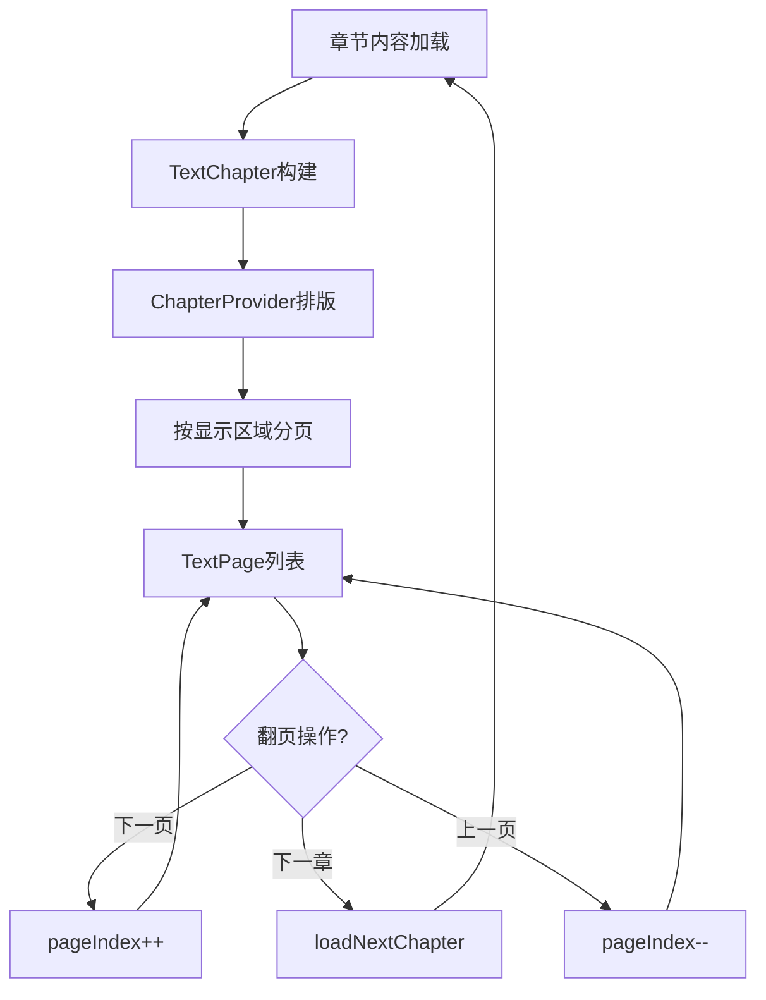

# 阅读引擎分页算法详解

> durChapterPos 字符偏移分页机制、TextChapter 数据结构、页面计算算法、6 种翻页动画实现。
> 主文档：[reading-engine.md](./reading-engine.md)

---

## 1. durChapterPos 字符偏移分页机制

### 1.1 核心概念

`durChapterPos` 是 ReadBook 中用于标记阅读位置的核心字段，它表示 **字符偏移量**（char offset），而非页面索引号。

```
章节内容（字符流）:
  "第一章 开端\n这是第一段内容...\n这是第二段内容...\n..."

  字符偏移:  0   5   10   15   20   25   30   ...
            ↑              ↑              ↑
          页0起始        页1起始        页2起始

  durChapterPos = 15 → 当前在第1页
```

**设计优势**：
- 排版参数变化（字号、边距等）时，字符偏移不变，只需重新排版即可恢复到正确位置
- 页面索引会随排版参数变化而变化，但字符偏移是内容固有的，与排版无关
- 跨设备同步进度时，字符偏移比页面索引更可靠

### 1.2 核心方法

| 方法 | 返回值 | 说明 |
|------|--------|------|
| `getNextPageLength(pos)` | `int` | 下一页的起始字符偏移，无下一页返回 -1 |
| `getPrevPageLength(pos)` | `int` | 上一页的起始字符偏移，无上一页返回 -1 |
| `getPageIndexByCharIndex(pos)` | `int` | 将字符偏移转换为 0-based 页面索引 |
| `getReadLength(pageIndex)` | `int` | 获取指定页的起始字符偏移 |
| `containPos(pos)` | `bool` | 检查字符偏移是否在当前排版范围内 |

### 1.3 durPageIndex 计算属性

`durPageIndex` 是一个计算属性（非存储字段），通过 `curTextChapter.getPageIndexByCharIndex(durChapterPos)` 从字符偏移实时计算：

```python
@property
def dur_page_index(self) -> int:
    """获取当前页号（计算属性，非存储字段）"""
    if self.cur_text_chapter:
        return self.cur_text_chapter.get_page_index_by_char_index(self.dur_chapter_pos)
    return self.dur_chapter_pos
```

---

## 2. TextChapter 数据结构

### 2.1 完整结构

```python
class TextChapter:
    """
    排版后的章节数据 — 对应 Legado TextChapter

    不是 BookChapter entity，而是阅读器使用的章节对象，
    包含排版完成后的分页信息。
    """
    chapter: BookChapter           # 原始章节实体
    position: int                  # 章节位置索引
    title: str                     # 章节标题（经替换规则处理后）
    chapters_size: int             # 总章节数
    same_title_removed: bool       # 是否去除了重复标题
    is_vip: bool                   # 是否付费章节
    is_pay: bool                   # 是否已购买
    effective_replace_rules: Optional[list]  # 生效的替换规则列表

    _pages: list[TextPage] = field(default_factory=list)  # 排版后的页面列表
    is_completed: bool = False     # 内容是否加载完成
    layout_channel: Channel        # 排版进度通道（逐页通知）

    @property
    def pages(self) -> list[TextPage]:
        """所有页面"""
        return self._pages

    @property
    def page_size(self) -> int:
        """总页数"""
        return len(self._pages)

    @property
    def last_index(self) -> int:
        """最后一页的索引"""
        return len(self._pages) - 1

    @property
    def last_read_length(self) -> int:
        """最后一页的起始字符偏移（用于跳转到章末）"""
        return self.get_read_length(self.last_index)
```

### 2.2 TextPage 结构

```python
class TextPage:
    """排版后的一页数据"""
    index: int = 0                 # 页面索引（0-based）
    chapter_position: int = 0      # 该页起始字符偏移
    char_size: int = 0             # 该页字符数
    lines: list = field(default_factory=list)  # 该页的文字行数据
```

### 2.3 核心查询方法

```python
def get_read_length(self, page_index: int) -> int:
    """获取指定页的起始字符偏移"""
    if page_index < 0 or not self._pages:
        return 0
    idx = min(page_index, self.last_index)
    return self._pages[idx].chapter_position


def get_page_index_by_char_index(self, char_index: int) -> int:
    """根据字符偏移获取页面索引（二分查找优化）"""
    if not self._pages:
        return -1
    for i, page in enumerate(self._pages):
        end_pos = page.chapter_position + page.char_size
        if char_index < end_pos:
            return page.index
    return self.last_index


def get_next_page_length(self, length: int) -> int:
    """获取下一页的起始字符偏移，无下一页返回 -1"""
    page_idx = self.get_page_index_by_char_index(length)
    if page_idx + 1 >= self.page_size:
        return -1
    return self.get_read_length(page_idx + 1)


def get_prev_page_length(self, length: int) -> int:
    """获取上一页的起始字符偏移，无上一页返回 -1"""
    page_idx = self.get_page_index_by_char_index(length)
    if page_idx - 1 < 0:
        return -1
    return self.get_read_length(page_idx - 1)


def get_page(self, index: int) -> Optional[TextPage]:
    """获取指定索引的页面"""
    if 0 <= index < len(self._pages):
        return self._pages[index]
    return None


def contain_pos(self, pos: int) -> bool:
    """检查字符偏移是否在当前排版范围内"""
    if not self._pages or not self.is_completed:
        return False
    last_page = self._pages[-1]
    return pos < last_page.chapter_position + last_page.char_size
```

---

## 3. 页面计算算法



### 3.1 前端分页（Android 原生实现）

Legado 使用 Android Canvas API 进行精确排版，核心是 `ChapterProvider` + `TextChapterLayout`。

```python
class ChapterProvider:
    """
    排版提供器 — 对应 Legado ChapterProvider

    Android 原生实现通过 Android Paint + StaticLayout 进行精确字符测量和换行排版。
    关键参数均来自 ReadBookConfig（用户可动态调整）：

    排版参数：
    - viewWidth / viewHeight: 阅读视图实际宽高（像素 px）
    - paddingLeft/Top/Right/Bottom: 边距（dp 转 px）
    - visibleWidth / visibleHeight: 减去边距后的可见区域
    - lineSpacingExtra: 行间距（0.1sp 为单位）
    - paragraphSpacing: 段落间距（px）
    - titleTopSpacing / titleBottomSpacing: 标题上下间距
    - textSize / titleSize: 正文字号 / 标题字号
    - typeface: 字体（支持 TTF 外部字体）
    - doublePage: 双页模式（横屏/平板）
    """

    view_width: int = 0
    view_height: int = 0
    padding_left: int = 0
    padding_top: int = 0
    padding_right: int = 0
    padding_bottom: int = 0
    visible_width: int = 0    # viewWidth - paddingLeft - paddingRight
    visible_height: int = 0   # viewHeight - paddingTop - paddingBottom
    visible_right: int = 0
    visible_bottom: int = 0

    line_spacing_extra: float = 0.0
    paragraph_spacing: int = 0
    title_top_spacing: int = 0
    title_bottom_spacing: int = 0

    double_page: bool = False


def update_layout_params(width: int, height: int):
    """
    更新排版参数 — 对应 ChapterProvider.upLayout()

    每当视图尺寸变化时（横竖屏切换、字体大小调整等）调用。
    双页模式计算：
    - "0": 禁用
    - "1": 强制启用
    - "2": 横屏时启用（滚动模式除外）
    - "3": 横屏或平板时启用（滚动模式除外）
    """
    if width <= 0 or height <= 0:
        return

    # 双页模式下每页宽度减半
    if ChapterProvider.double_page:
        ChapterProvider.visible_width = (width // 2
            - ChapterProvider.padding_left - ChapterProvider.padding_right)
    else:
        ChapterProvider.visible_width = (width
            - ChapterProvider.padding_left - ChapterProvider.padding_right)

    ChapterProvider.visible_height = height - ChapterProvider.padding_top - ChapterProvider.padding_bottom
```

### 3.2 后端估算分页（Python 实现方案）

在 Python 服务端，没有 Android Canvas 做精确排版，可以采用基于字符密度的估算分页：

```python
import math


def estimate_page_count(content: str, page_params: PageParams) -> int:
    """
    基于字符密度的后端估算分页

    适用于服务端返回分页元数据、前端使用 CSS columns 或自定义渲染的混合方案。
    对于中文文本（等宽），这种方法足够准确；
    对于英文或其他西文文本，需要结合平均字宽估算。

    Args:
        content: 章节内容（去除标题、经 ContentProcessor 处理后的纯文本）
        page_params: 分页参数

    Returns:
        估算的总页数
    """
    # 1. 计算每行可容纳的字数
    chars_per_line = (page_params.page_width
                      - page_params.padding_left - page_params.padding_right) // page_params.font_size

    # 2. 计算每页可容纳的行数
    lines_per_page = ((page_params.page_height
                       - page_params.padding_top - page_params.padding_bottom)
                      // (page_params.font_size + page_params.line_height))

    # 3. 计算每页字符数
    chars_per_page = chars_per_line * lines_per_page

    # 4. 计算总页数
    total_pages = math.ceil(len(content) / chars_per_page)

    return max(total_pages, 1)


def get_page_content(content: str, page_index: int, page_params: PageParams) -> str:
    """
    根据估算分页获取指定页的内容切片

    注意：估算模式下，前端实际渲染可能有偏差。
    推荐方案：服务端返回完整章节内容，前端（Vue3）使用 CSS column-count
    或基于 JavaScript 的分页实现精确排版。
    """
    chars_per_line = ((page_params.page_width - page_params.padding_left - page_params.padding_right)
                      // page_params.font_size)
    lines_per_page = ((page_params.page_height - page_params.padding_top - page_params.padding_bottom)
                      // (page_params.font_size + page_params.line_height))
    chars_per_page = chars_per_line * lines_per_page

    start = page_index * chars_per_page
    end = start + chars_per_page

    return content[start:end]


@dataclass
class PageParams:
    """
    分页参数 — 对应 ReadBookConfig 中的分页相关设置

    这些参数由前端采集并传递给后端，用于服务端估算分页。
    在纯前端分页方案中，这些参数只在前端使用。
    """
    font_size: int = 16           # 字号（px 或 sp）
    page_width: int = 1080        # 阅读器视图宽度（px）
    page_height: int = 1920       # 阅读器视图高度（px）
    line_height: int = 8          # 行间距（px）
    paragraph_spacing: int = 16   # 段落间距（px）
    padding_left: int = 30        # 左边距（px）
    padding_right: int = 30       # 右边距（px）
    padding_top: int = 20         # 上边距（px）
    padding_bottom: int = 20      # 下边距（px）
```

### 3.3 分页模式

| 模式 | 值 | 说明 |
|------|:---:|------|
| 无动画 | 0 | 直接切换，无翻页动画 |
| 仿真 | 1 | 模拟纸质书翻页效果 |
| 滑动 | 2 | 左右滑动切换 |
| 滚动 | 3 | 上下滚动阅读（不分页，连续滚动） |
| 覆盖 | 4 | 新页从右向左覆盖旧页 |

---

## 4. 翻页动画实现

> 本章为翻页动画实现细节的**唯一权威源**；主文档 [reading-engine.md](./reading-engine.md) §13 仅保留动画模式对照索引，不重复实现细节。

### 4.1 六种动画模式对照

| 代码 | 名称 | 对应实现类 | 说明 |
|:---:|------|-----------|------|
| 0 | 无动画 | NoAnimPageDelegate.kt | 直接切换，适合快速阅读 |
| 1 | 仿真 | SimulationPageDelegate.kt | 模拟纸质书卷曲翻页效果 |
| 2 | 滑动 | SlidePageDelegate.kt | 左右滑动，类似电子书阅读器 |
| 3 | 滚动 | ScrollPageDelegate.kt | 纵向连续滚动，不分页 |
| 4 | 覆盖 | CoverPageDelegate.kt | 新页面从右侧滑入覆盖旧页 |
| 5 | 水平翻页 | HorizontalPageDelegate.kt | 横向逐页翻动 |

### 4.2 动画优先级

```python
@property
def page_anim(self) -> int:
    """
    翻页动画模式 — 对应 ReadBook.pageAnim()

    优先级：book.getPageAnim() → ReadBookConfig.pageAnim（全局默认）
    """
    if self.book:
        return self.book.get_page_anim()
    return get_read_book_config("pageAnim", 1)
```

### 4.3 各动画模式详解

#### 0 - 无动画（NoAnimPageDelegate）

直接切换页面，无过渡效果。适用于：
- 追求极致翻页速度的用户
- 性能较低的设备
- 调试场景

#### 1 - 仿真翻页（SimulationPageDelegate）

模拟真实纸质书的翻页效果，核心算法：
- 基于贝塞尔曲线计算翻页卷曲路径
- 支持从右下角/左下角/右上角/左上角四个方向翻页
- 翻页过程中显示背面内容（阴影+纹理）
- 触摸点跟随手指实时更新卷曲角度

```
触摸点 P(x, y)
  │
  ├── 计算翻页方向（根据 P 相对于页面中心的位置）
  ├── 计算贝塞尔曲线控制点
  ├── 绘制当前页剩余可见区域
  ├── 绘制翻页卷曲部分（含阴影）
  └── 绘制下一页内容
```

#### 2 - 滑动翻页（SlidePageDelegate）

左右滑动切换页面，类似常见电子书阅读器：
- 手指拖动时，当前页随手指水平移动
- 下一页从右侧逐渐露出
- 松手后根据滑动距离自动完成或回弹
- 支持快速滑动（fling）自动翻页

#### 3 - 滚动模式（ScrollPageDelegate）

纵向连续滚动，不分页：
- 整个章节内容作为连续流渲染
- 滚动位置通过 `durChapterPos` 字符偏移标记
- 跨章时自动加载下一章内容并拼接
- 不触发 `moveToNextPage` / `moveToPrevPage`，而是直接修改 `durChapterPos`

#### 4 - 覆盖翻页（CoverPageDelegate）

新页面从右侧滑入覆盖旧页面：
- 旧页面保持不动
- 新页面从右侧边缘开始，逐渐覆盖旧页面
- 动画结束后旧页面被替换
- 与滑动翻页的区别：旧页面不移动

#### 5 - 水平翻页（HorizontalPageDelegate）

横向逐页翻动：
- 类似真实翻书，但无卷曲效果
- 当前页整体向左移出，新页从右侧整体移入
- 支持双页模式下的同步翻页

### 4.4 PageDelegate 基类

所有翻页动画继承自 `PageDelegate` 基类：

```python
class PageDelegate:
    """翻页动画基类"""

    # 翻页状态
    STATE_IDLE = 0        # 空闲
    STATE_TOUCH = 1       # 触摸中
    STATE_MOVE = 2        # 移动中
    STATE_ANIM = 3        # 动画中
    STATE_ABORT = 4       # 中止

    # 翻页方向
    DIRECTION_NEXT = 1    # 下一页
    DIRECTION_PREV = -1   # 上一页

    def on_touch_event(self, event: TouchEvent) -> bool:
        """处理触摸事件"""
        ...

    def on_draw(self, canvas: Canvas):
        """绘制页面"""
        ...

    def on_page_change(self, direction: int):
        """页面变化回调"""
        ...
```

---

## 5. Python 重构参考

### 5.1 TextChapter 完整实现

```python
from dataclasses import dataclass, field
from typing import Optional, List
import asyncio


@dataclass
class TextPage:
    """排版后的一页数据"""
    index: int = 0                 # 页面索引（0-based）
    chapter_position: int = 0      # 该页起始字符偏移
    char_size: int = 0             # 该页字符数
    lines: list = field(default_factory=list)  # 该页的文字行数据


@dataclass
class TextChapter:
    """排版后的章节数据 — 对应 Legado TextChapter"""
    chapter: 'BookChapter' = None
    position: int = 0
    title: str = ""
    chapters_size: int = 0
    same_title_removed: bool = False
    is_vip: bool = False
    is_pay: bool = False
    effective_replace_rules: Optional[list] = None

    _pages: List[TextPage] = field(default_factory=list)
    is_completed: bool = False
    layout_channel: asyncio.Queue = field(default_factory=asyncio.Queue)

    @property
    def pages(self) -> List[TextPage]:
        return self._pages

    @property
    def page_size(self) -> int:
        return len(self._pages)

    @property
    def last_index(self) -> int:
        return len(self._pages) - 1

    @property
    def last_read_length(self) -> int:
        return self.get_read_length(self.last_index)

    def get_read_length(self, page_index: int) -> int:
        """获取指定页的起始字符偏移"""
        if page_index < 0 or not self._pages:
            return 0
        idx = min(page_index, self.last_index)
        return self._pages[idx].chapter_position

    def get_page_index_by_char_index(self, char_index: int) -> int:
        """根据字符偏移获取页面索引"""
        if not self._pages:
            return -1
        for i, page in enumerate(self._pages):
            end_pos = page.chapter_position + page.char_size
            if char_index < end_pos:
                return page.index
        return self.last_index

    def get_next_page_length(self, length: int) -> int:
        """获取下一页的起始字符偏移，无下一页返回 -1"""
        page_idx = self.get_page_index_by_char_index(length)
        if page_idx + 1 >= self.page_size:
            return -1
        return self.get_read_length(page_idx + 1)

    def get_prev_page_length(self, length: int) -> int:
        """获取上一页的起始字符偏移，无上一页返回 -1"""
        page_idx = self.get_page_index_by_char_index(length)
        if page_idx - 1 < 0:
            return -1
        return self.get_read_length(page_idx - 1)

    def get_page(self, index: int) -> Optional[TextPage]:
        """获取指定索引的页面"""
        if 0 <= index < len(self._pages):
            return self._pages[index]
        return None

    def contain_pos(self, pos: int) -> bool:
        """检查字符偏移是否在当前排版范围内"""
        if not self._pages or not self.is_completed:
            return False
        last_page = self._pages[-1]
        return pos < last_page.chapter_position + last_page.char_size
```

### 5.2 后端估算分页完整实现

```python
import math
from dataclasses import dataclass


@dataclass
class PageParams:
    """分页参数 — 对应 ReadBookConfig"""
    font_size: int = 16
    page_width: int = 1080
    page_height: int = 1920
    line_height: int = 8
    paragraph_spacing: int = 16
    padding_left: int = 30
    padding_right: int = 30
    padding_top: int = 20
    padding_bottom: int = 20


def estimate_page_count(content: str, page_params: PageParams) -> int:
    """基于字符密度的后端估算分页"""
    chars_per_line = (page_params.page_width
                      - page_params.padding_left - page_params.padding_right) // page_params.font_size
    lines_per_page = ((page_params.page_height
                       - page_params.padding_top - page_params.padding_bottom)
                      // (page_params.font_size + page_params.line_height))
    chars_per_page = chars_per_line * lines_per_page
    total_pages = math.ceil(len(content) / chars_per_page)
    return max(total_pages, 1)


def get_page_content(content: str, page_index: int, page_params: PageParams) -> str:
    """根据估算分页获取指定页的内容切片"""
    chars_per_line = ((page_params.page_width - page_params.padding_left - page_params.padding_right)
                      // page_params.font_size)
    lines_per_page = ((page_params.page_height - page_params.padding_top - page_params.padding_bottom)
                      // (page_params.font_size + page_params.line_height))
    chars_per_page = chars_per_line * lines_per_page

    start = page_index * chars_per_page
    end = start + chars_per_page
    return content[start:end]


def build_text_chapter_pages(content: str, page_params: PageParams) -> List[TextPage]:
    """
    根据估算分页构建 TextPage 列表

    用于后端构建 TextChapter 的 _pages 字段。
    前端应使用精确排版（CSS columns / Canvas）覆盖此估算结果。
    """
    chars_per_line = ((page_params.page_width - page_params.padding_left - page_params.padding_right)
                      // page_params.font_size)
    lines_per_page = ((page_params.page_height - page_params.padding_top - page_params.padding_bottom)
                      // (page_params.font_size + page_params.line_height))
    chars_per_page = chars_per_line * lines_per_page

    if chars_per_page <= 0:
        return [TextPage(index=0, chapter_position=0, char_size=len(content))]

    pages = []
    total = len(content)
    page_count = math.ceil(total / chars_per_page)

    for i in range(page_count):
        start = i * chars_per_page
        end = min(start + chars_per_page, total)
        pages.append(TextPage(
            index=i,
            chapter_position=start,
            char_size=end - start,
        ))

    return pages
```

### 5.3 前端分页方案建议

```
推荐方案：纯前端分页（Vue3）

1. 服务端返回：
   - 完整章节内容（经 ContentProcessor 处理后的段落列表）
   - 估算分页元数据（pageParams + totalPages，仅供参考）

2. 前端渲染：
   方案 A — CSS column-count（最简单）：
     .chapter-content {
       column-width: var(--page-width);
       column-gap: 0;
       height: var(--page-height);
       overflow: hidden;
     }

   方案 B — Canvas 精确排版（最精确，接近 Android 原生）：
     - 使用 measureText() 精确计算每行字数
     - 模拟 StaticLayout 的换行逻辑
     - 生成 TextPage 列表

   方案 C — 虚拟滚动（滚动模式）：
     - 使用 IntersectionObserver 懒加载
     - durChapterPos 映射到 scrollTop

3. 进度同步：
   - 前端计算精确的 durChapterPos（字符偏移）
   - 通过 API 同步到后端
   - 后端只存储字符偏移，不存储页面索引
```
