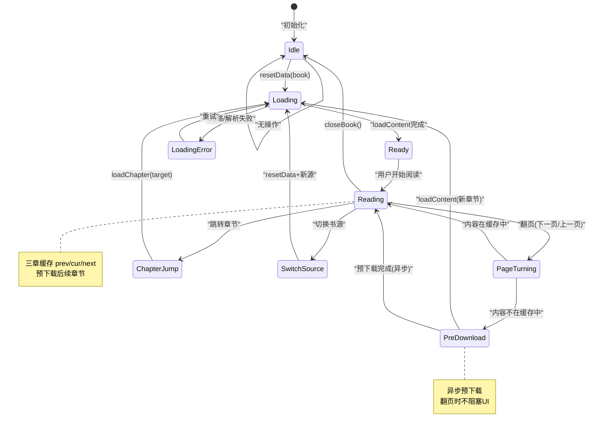
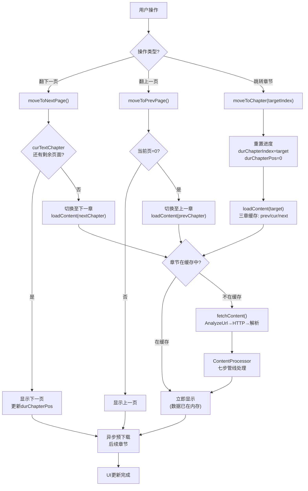

# 阅读引擎模块

> ReadBook/ReadManga/AudioPlay 三态全局单例架构，三章缓存 + 预下载 + 翻页跳章完整流程。
> 对应源码：`io.legado.app.model.ReadBook`（核心单例 1064 行）

---

## ReadBook 生命周期状态机



> **多 Activity 共享保护**：ReadBook 是全局单例 `object`，多 Activity 共享状态。修改状态需 `@Synchronized` 或 `Mutex` 保护，防止并发竞态。

---

## 翻页/跳章流程图



---

## 1. 三态阅读架构

```
全局单例（object）:
  ├── ReadBook   — 文字阅读核心
  ├── ReadManga  — 漫画阅读（图片模式）
  └── AudioPlay  — 音频播放（TTS + 有声书）

设计思想:
  - 全局单例 → 多 Activity 共享状态，换页面不丢失阅读进度
  - 双版本方法 → xxx() 加 xxxAwait()，满足同步和协程两种调用模式
  - 三章缓存 → prev/cur/next 三个 TextChapter 预加载
  - 预下载机制 → 翻页后自动预下载后续章节
```

---

## 2. ReadBook 核心状态

[ReadBook.kt:61-96](file:///f:/myself/github/WeAgentChat/temp/legado/app/src/main/java/io/legado/app/model/ReadBook.kt#L61-L96)

```python
from dataclasses import dataclass, field
from typing import Optional
import asyncio
from enum import Enum


class ReadBook:
    """
    阅读引擎状态机 — 对应 Legado ReadBook.kt

    整个应用的阅读功能由这个单例对象集中管理。
    注意：这是一个对象单例，不是类实例。
    """

    # ============================================================
    # 2.1.1 书籍核心状态
    # ============================================================

    # 当前阅读的书籍，None 表示没有打开任何书
    book: Optional[Book] = None

    # 当前书籍的书源（如果是在线书的话）
    book_source: Optional[BookSource] = None

    # 是否在书架中（影响保存行为）
    in_bookshelf: bool = False

    # 是否为本地书籍
    is_local_book: bool = True

    # ============================================================
    # 2.1.2 章节与分页状态
    # ============================================================

    # 数据库中的章节总数
    chapter_size: int = 0

    # 模拟阅读模式下的章节总数（模拟分章时使用）
    simulated_chapter_size: int = 0

    # 当前章节索引（持久化的值）
    dur_chapter_index: int = 0

    # 当前阅读位置（字符偏移量，持久化的值）
    dur_chapter_pos: int = 0

    # 当前章节内容是否发生了变化
    chapter_changed: bool = False

    # 消息文本（加载失败时的错误提示）
    msg: Optional[str] = None

    # ============================================================
    # 2.1.3 三章缓存（prev / cur / next）
    # ============================================================

    # 上一章 TextChapter（排版完成的对象，包含分页信息）
    prev_text_chapter: Optional[TextChapter] = None

    # 当前章 TextChapter
    cur_text_chapter: Optional[TextChapter] = None

    # 下一章 TextChapter
    next_text_chapter: Optional[TextChapter] = None

    # ============================================================
    # 2.1.4 并发控制
    # ============================================================

    # 正在加载中（含下载）的章节索引集合
    _loading_chapters: list[int] = field(default_factory=list)

    # 每个章节的加载任务映射（可取消）
    _chapter_loading_jobs: dict[int, CoroutineTask] = field(default_factory=dict)

    # 三章各自的加载锁
    _prev_chapter_loading_lock: asyncio.Lock = field(default_factory=asyncio.Lock)
    _cur_chapter_loading_lock: asyncio.Lock = field(default_factory=asyncio.Lock)
    _next_chapter_loading_lock: asyncio.Lock = field(default_factory=asyncio.Lock)

    # 阅读记录
    _read_record: ReadRecord = field(default_factory=ReadRecord)

    # 阅读开始时间戳（用于计算阅读时长）
    read_start_time: int = 0  # 初始化为当前毫秒时间戳

    # ============================================================
    # 2.1.5 进度跳转缓存
    # ============================================================

    # 跳转前的进度备份（用于恢复）
    last_book_progress: Optional[BookProgress] = None

    # Web 端的阅读进度
    web_book_progress: Optional[BookProgress] = None

    # ============================================================
    # 2.1.6 预下载状态
    # ============================================================

    # 预下载任务句柄
    _pre_download_task: Optional[asyncio.Task] = None

    # 已下载的章节索引集合
    downloaded_chapters: set[int] = field(default_factory=set)

    # 下载失败的章节及其失败次数
    download_fail_chapters: dict[int, int] = field(default_factory=dict)

    # 内容处理器（对应于每本书的替换规则 + 标题规则）
    content_processor: Optional[ContentProcessor] = None

    # 下载作用域
    _download_scope = asyncio.Queue()  # 实际使用独立的 asyncio 事件循环

    # 预下载信号量（控制并发下载数）
    _pre_download_semaphore = asyncio.Semaphore(2)

    # ============================================================
    # 2.1.7 回调接口
    # ============================================================

    call_back: Optional[CallBack] = None
```

### 2.2 Book / BookChapter / BookProgress 数据模型

```python
@dataclass
class Book:
    """书籍 — 对应 Legado Book entity"""
    book_url: str                      # 书籍唯一标识 URL
    name: str                          # 书名
    author: str                        # 作者
    cover_url: str                     # 封面 URL
    origin: str                        # 书源 URL
    intro: str = ""                    # 简介
    kind: str = ""                     # 分类
    word_count: str = ""               # 字数

    # 阅读进度（持久化字段）
    dur_chapter_index: int = 0          # 当前章节索引
    dur_chapter_pos: int = 0            # 当前章节内的字符偏移
    dur_chapter_time: int = 0           # 最后阅读时间戳
    dur_chapter_title: str = ""         # 当前章节标题

    total_chapter_num: int = 0          # 总章节数
    last_check_time: int = 0            # 最后检查更新时间
    last_check_count: int = 0           # 自动检测章节数


@dataclass
class BookChapter:
    """章节 — 对应 Legado BookChapter entity"""
    url: str                           # 章节 URL
    book_url: str                      # 所属书籍 URL
    title: str                         # 章节标题
    index: int = 0                     # 章节序号
    is_volume: bool = False            # 是否是一级卷标
    is_vip: bool = False               # 是否付费
    is_pay: bool = False               # 是否已购买


@dataclass
class BookProgress:
    """阅读进度快照 — 对应 Legado BookProgress entity"""
    name: str                          # 书名
    author: str                        # 作者
    dur_chapter_index: int             # 章节索引
    dur_chapter_pos: int               # 字符偏移
    dur_chapter_time: int              # 时间戳
    dur_chapter_title: Optional[str]   # 章节标题
```

---

## 3. openBook / resetData / upData

### 3.1 resetData — 打开书籍

[ReadBook.kt:98-126](file:///f:/myself/github/WeAgentChat/temp/legado/app/src/main/java/io/legado/app/model/ReadBook.kt#L98-L126)

```python
def reset_data(self, book: Book):
    """
    打开书籍 — 对应 ReadBook.resetData()

    流程：
    1. 释放之前的资源（取消所有协程 + 清空缓存）
    2. 设置当前书籍
    3. 从数据库加载章节数量
    4. 设置持久化进度（durChapterIndex / durChapterPos）
    5. 识别书籍类型（本地/在线）
    6. 识别书源
    7. 清空三章缓存
    8. 回调通知前端更新
    9. 触发加载当前章节内容
    """
    # 1. 释放之前的全部资源
    self._release_and_cancel()

    # 2. 设置当前书籍
    self.book = book

    # 3. 加载章节数量
    self.chapter_size = get_chapter_count(book.book_url)

    # 4. 模拟阅读模式下的章节数
    if book.is_read_simulating():
        self.simulated_chapter_size = book.simulated_total_chapter_num()
    else:
        self.simulated_chapter_size = self.chapter_size

    # 5. 初始化内容处理器（加载替换规则）
    self.content_processor = ContentProcessor.get(book)

    # 6. 设置持久化进度
    self.dur_chapter_index = book.dur_chapter_index
    self.dur_chapter_pos = book.dur_chapter_pos

    # 7. 识别本地/在线
    self.is_local_book = book.is_local()

    # 8. 清空三章缓存
    self._clear_text_chapter()

    # 9. 初始化阅读记录
    self._read_record.book_name = book.name
    self._read_record.read_time = get_read_time(book.name) or 0
    self.read_start_time = current_time_millis()

    # 10. 识别书源
    self._up_web_book(book)

    # 11. 清空下载状态
    self._loading_chapters.clear()
    self.downloaded_chapters.clear()
    self.download_fail_chapters.clear()

    # 12. 回调通知
    self.call_back and self.call_back.up_content()
    self.call_back and self.call_back.up_menu_view()
    self.call_back and self.call_back.up_page_anim()

    # 13. 触发内容加载
    self.load_content(reset_page_offset=True)
```

### 3.2 upData vs resetData

```
upData: 更新数据（目录刷新场景）— 不清空三章缓存，仅更新复用部分
resetData: 完全重置（切换书籍场景）— 清空所有状态，重新加载
```

```python
def up_data(self, book: Book):
    """
    刷新书籍数据（不释放所有资源，只更新部分）— 对应 ReadBook.upData()
    """
    self._release_and_cancel()
    self.book = book
    self.chapter_size = get_chapter_count(book.book_url)

    if book.is_read_simulating():
        self.simulated_chapter_size = book.simulated_total_chapter_num()
    else:
        self.simulated_chapter_size = self.chapter_size

    # 如果章节索引发生变化，清空三章缓存
    if self.dur_chapter_index != book.dur_chapter_index:
        self.dur_chapter_index = book.dur_chapter_index
        self.dur_chapter_pos = book.dur_chapter_pos
        self._clear_text_chapter()

    # 清理未完成的加载
    if self.cur_text_chapter and not self.cur_text_chapter.is_completed:
        self.cur_text_chapter = None
    if self.next_text_chapter and not self.next_text_chapter.is_completed:
        self.next_text_chapter = None
    if self.prev_text_chapter and not self.prev_text_chapter.is_completed:
        self.prev_text_chapter = None

    self.call_back and self.call_back.up_menu_view()
    self._up_web_book(book)
    self._loading_chapters.clear()
    self.downloaded_chapters.clear()
    self.download_fail_chapters.clear()
```

### 3.3 _up_web_book — 书源与图片样式识别

[ReadBook.kt 内部方法](file:///f:/myself/github/WeAgentChat/temp/legado/app/src/main/java/io/legado/app/model/ReadBook.kt)

```python
def _up_web_book(self, book: Book):
    """识别书源和图片样式 — 对应 ReadBook.upWebBook()"""
    if book.is_local():
        self.book_source = None
        if not book.get_image_style() and (book.is_image() or book.is_pdf()):
            book.set_image_style(Book.IMG_STYLE_FULL)
    else:
        source = get_book_source(book.origin)
        if source:
            self.book_source = source
            if not book.get_image_style():
                image_style = source.get_content_rule().image_style
                if not image_style and (book.is_image() or book.is_pdf()):
                    image_style = Book.IMG_STYLE_FULL
                book.set_image_style(image_style)
                if image_style == Book.IMG_STYLE_SINGLE:
                    book.set_page_anim(0)  # 单页模式
        else:
            self.book_source = None
```

---

## 4. 三章缓存机制

### 4.1 缓存窗口

```
当前阅读位置 durChapterIndex = 50

  [prev_text_chapter]  ← index=49（上一章，已解析）
  [cur_text_chapter]   ← index=50（当前章，正在显示）
  [next_text_chapter]  ← index=51（下一章，预加载完成）

移动:
  翻到下一章 → prev ← cur, cur ← next, next ← 重新加载 index=52
  翻到上一章 → next ← cur, cur ← prev, prev ← 重新加载 index=48
```

### 4.2 加载流程

[ReadBook.kt:534-596](file:///f:/myself/github/WeAgentChat/temp/legado/app/src/main/java/io/legado/app/model/ReadBook.kt#L534-L596)

```python
def load_content(self, index: int, up_content: bool = True,
                 reset_page_offset: bool = False, success: callable = None):
    """
    加载指定章节的内容 — 对应 ReadBook.loadContent()

    流程：
    1. 从数据库获取 BookChapter 记录
    2. 检查是否已在加载队列中（addLoading 防重复）
    3. 尝试从本地缓存读取内容（BookHelp.getContent）
    4. 缓存未命中 → 从网络下载（download → CacheBook）
    5. 内容加载完成 → contentLoadFinish 处理

    并发控制：
    - addLoading 确保同一章节不会重复加载
    - 每个 loadingChapters 超过 N±1 范围在 contentLoadFinish 中被提前返回
    - 三章各自独立的 Mutex 锁
    """
    chapter = get_chapter_from_db(self.book.book_url, index)
    if chapter is None:
        return

    if not self._add_loading(index):
        return

    content = BookHelp.get_content(self.book, chapter)

    if content is not None:
        self._content_load_finish(
            self.book, chapter, content,
            up_content, reset_page_offset,
            success=success
        )
    else:
        self._download(self._download_scope, chapter, reset_page_offset)


def load_or_up_content(self, success: callable = None):
    """
    首次启动时的懒加载 — 对应 ReadBook.loadOrUpContent()

    当前章节已加载 → 直接通知更新 UI
    未加载 → 触发加载
    前后章节不存在 → 触发加载
    """
    if self.cur_text_chapter is None:
        self.load_content(self.dur_chapter_index, success=success)
    else:
        self.call_back and self.call_back.up_content()

    if self.next_text_chapter is None:
        self.load_content(self.dur_chapter_index + 1)
    if self.prev_text_chapter is None:
        self.load_content(self.dur_chapter_index - 1)


def load_content_triple(self, reset_page_offset: bool, success: callable = None):
    """
    同时加载前后三章 — 对应 ReadBook.loadContent() 无参版本

    在目录跳转后调用，一次性加载当前 + 前1 + 后1 章
    """
    self.load_content(self.dur_chapter_index, reset_page_offset=reset_page_offset, success=success)
    self.load_content(self.dur_chapter_index + 1, reset_page_offset=reset_page_offset)
    self.load_content(self.dur_chapter_index - 1, reset_page_offset=reset_page_offset)
```

---

## 5. contentLoadFinish — 内容加载完成核心

[ReadBook.kt:693-783](file:///f:/myself/github/WeAgentChat/temp/legado/app/src/main/java/io/legado/app/model/ReadBook.kt#L693-L783)

```python
@thread_safe
def _content_load_finish(self, book: Book, chapter: BookChapter,
                          content: str, up_content: bool = True,
                          reset_page_offset: bool = False,
                          canceled: bool = False, success: callable = None):
    """
    内容加载完成处理器 — 对应 ReadBook.contentLoadFinish()

    此方法在下载线程中执行，涉及大量计算，需要 thread_safe 保护。
    """
    # 1. 从 loading 队列中移除
    self._remove_loading(chapter.index)

    # 2. 范围检查：只有 N±1 范围内的章节才触发 UI 更新
    if canceled or chapter.index not in range(
            self.dur_chapter_index - 1, self.dur_chapter_index + 2):
        return

    # 3. 取消该章节已有的加载任务
    if chapter.index in self._chapter_loading_jobs:
        self._chapter_loading_jobs[chapter.index].cancel()

    # 4. 启动异步处理任务
    async def process_content():
        # 4a. 获取内容处理器
        cp = ContentProcessor.get(book.name, book.origin)

        # 4b. 获取显示标题（应用 replace rules + 简繁转换）
        display_title = chapter.get_display_title(
            cp.get_title_replace_rules(),
            book.get_use_replace_rule(),
            replace_book=book.to_replace_book()
        )

        # 4c. 内容处理管线
        book_content = cp.get_content(
            book, chapter, content,
            include_title=False  # 标题单独显示
        )

        # 4d. 创建 TextChapter（含异步排版）
        text_chapter = ChapterProvider.get_text_chapter_async(
            self, book, chapter, display_title,
            book_content, self.simulated_chapter_size
        )

        # 4e. 根据 offset（相对于 durChapterIndex 的偏移量）进行赋值和 UI 回调
        offset = chapter.index - self.dur_chapter_index

        if offset == 0:  # 当前章
            async with self._cur_chapter_loading_lock:
                await run_on_main(lambda: setattr(self, 'cur_text_chapter', text_chapter))

            self.call_back and self.call_back.up_menu_view()

            available = False
            for page in text_chapter.layout_channel:
                page_index = page.index
                if not available and page.contain_pos(self.dur_chapter_pos):
                    if up_content:
                        self.call_back and self.call_back.up_content(offset, reset_page_offset)
                    available = True
                if up_content and self._is_scroll():
                    if max(page_index - 3, 0) < self.dur_page_index:
                        self.call_back and self.call_back.up_content(offset, False)
                self.call_back and self.call_back.on_layout_page_completed(page_index, page)

            if up_content:
                self.call_back and self.call_back.up_content(
                    offset, not available and reset_page_offset)

            self._cur_page_changed()
            self.call_back and self.call_back.content_load_finish()

        elif offset == -1:  # 上一章
            async with self._prev_chapter_loading_lock:
                await run_on_main(lambda: setattr(self, 'prev_text_chapter', text_chapter))
            for _ in text_chapter.layout_channel:
                pass
            if up_content:
                self.call_back and self.call_back.up_content(offset, reset_page_offset)

        elif offset == 1:  # 下一章
            async with self._next_chapter_loading_lock:
                await run_on_main(lambda: setattr(self, 'next_text_chapter', text_chapter))
            for page in text_chapter.layout_channel:
                if page.index > 1:
                    continue
                if up_content:
                    self.call_back and self.call_back.up_content(offset, reset_page_offset)

        if success:
            success()

    # 5. 启动任务
    task = create_task(process_content())
    self._chapter_loading_jobs[chapter.index] = task
```

### 5.1 下载方法（缓存未命中时）

```python
def _download(self, scope, chapter: BookChapter,
               reset_page_offset: bool, semaphore: Semaphore = None):
    """从网络下载章节内容 — 对应 ReadBook.download()"""
    book = self.book
    if book is None:
        self._remove_loading(chapter.index)
        return

    book_source = self.book_source
    if book_source is not None:
        CacheBook.get_or_create(book_source, book).download(scope, chapter, semaphore)
    else:
        msg = "无内容" if book.is_local() else "没有书源"
        self._content_load_finish(
            book, chapter, f"加载正文失败\n{msg}",
            reset_page_offset=reset_page_offset
        )


async def _download_index(self, index: int):
    """预下载单个章节 — 对应 ReadBook.downloadIndex()"""
    if index < 0:
        return
    if index > self.chapter_size - 1:
        self._up_toc()
        return

    book = self.book
    if book is None:
        return

    chapter = get_chapter_from_db(book.book_url, index)
    if chapter is None:
        return

    if BookHelp.has_content(book, chapter):
        self.downloaded_chapters.add(chapter.index)
    else:
        await asyncio.sleep(1)  # 预下载延迟
        if self._add_loading(index):
            self._download(self._download_scope, chapter, False, self._pre_download_semaphore)


@thread_safe
def _add_loading(self, index: int) -> bool:
    """防重复加载 — 对应 ReadBook.addLoading()"""
    if index in self._loading_chapters:
        return False
    self._loading_chapters.append(index)
    return True


@thread_safe
def _remove_loading(self, index: int):
    """移除加载标记 — 对应 ReadBook.removeLoading()"""
    if index in self._loading_chapters:
        self._loading_chapters.remove(index)
```

---

## 6. 翻页与跳章

[ReadBook.kt:304-419](file:///f:/myself/github/WeAgentChat/temp/legado/app/src/main/java/io/legado/app/model/ReadBook.kt#L304-L419)

### 6.1 durChapterPos 的含义

`durChapterPos` 是 **字符偏移量**（char offset），不是页面索引号。
- 每页拥有 `chapterPosition` 属性，表示该页起始位置的字符偏移
- `getNextPageLength(pos)`：返回下一页的起始字符偏移，没有下一页返回 -1
- `getPrevPageLength(pos)`：返回上一页的起始字符偏移，没有上一页返回 -1
- `getPageIndexByCharIndex(pos)`：将字符偏移转换为页面索引

> 分页算法与翻页动画的详细实现见 [reading-engine-pagination.md](./reading-engine-pagination.md)

### 6.2 moveToNextPage / moveToPrevPage（同章翻页）

```python
def move_to_next_page(self) -> bool:
    """
    翻到下一页（同章内）— 对应 ReadBook.moveToNextPage()

    Returns:
        True = 有下一页（已翻页）, False = 没有下一页（需要跨章）
    """
    if self.cur_text_chapter is None:
        return False

    next_page_pos = self.cur_text_chapter.get_next_page_length(self.dur_chapter_pos)
    if next_page_pos >= 0:
        self.dur_chapter_pos = next_page_pos
        self.call_back and self.call_back.cancel_select()
        self.call_back and self.call_back.up_content()
        self._save_read(page_changed=True)
        return True
    return False


def move_to_prev_page(self) -> bool:
    """
    翻到上一页（同章内）— 对应 ReadBook.moveToPrevPage()

    Returns:
        True = 有上一页（已翻页）, False = 需要跨章
    """
    if self.cur_text_chapter is None:
        return False

    prev_page_pos = self.cur_text_chapter.get_prev_page_length(self.dur_chapter_pos)
    if prev_page_pos >= 0:
        self.dur_chapter_pos = prev_page_pos
        self.call_back and self.call_back.up_content()
        self._save_read(page_changed=True)
        return True
    return False
```

### 6.3 moveToNextChapter / moveToPrevChapter（跨章翻页）

```python
def move_to_next_chapter(self, up_content: bool,
                          up_content_in_place: bool = True) -> bool:
    """
    翻到下一章 — 对应 ReadBook.moveToNextChapter()

    三章引用关系变化（左移）：
        操作前: [prev] [cur] [next]
        操作后: [old_cur] [old_next] [None]
    """
    if self.dur_chapter_index >= self.simulated_chapter_size - 1:
        return False  # 没有下一章

    # 1. 更新位置
    self.dur_chapter_pos = 0
    self.dur_chapter_index += 1

    # 2. 清除过期任务
    self._clear_expired_chapter_loading_job()

    # 3. 引用左移
    self.prev_text_chapter = self.cur_text_chapter
    self.cur_text_chapter = self.next_text_chapter
    self.next_text_chapter = None

    # 4. 当前章节处理
    if self.cur_text_chapter is None:
        if up_content_in_place:
            self.call_back and self.call_back.up_content()
        self.load_content(self.dur_chapter_index, up_content, reset_page_offset=False)
    elif up_content and up_content_in_place:
        self.call_back and self.call_back.up_content()

    # 5. 预加载再下一章
    self.load_content(self.dur_chapter_index + 1, up_content, False)

    # 6. 持久化 + 回调
    self._save_read()
    self.call_back and self.call_back.up_menu_view()
    self._cur_page_changed()
    return True


def move_to_prev_chapter(self, up_content: bool,
                          to_last: bool = True,
                          up_content_in_place: bool = True) -> bool:
    """
    翻到上一章 — 对应 ReadBook.moveToPrevChapter()

    三章引用关系变化（右移）：
        操作前: [prev] [cur] [next]
        操作后: [None] [old_prev] [old_cur]

    Args:
        to_last: 是否定位到上一章的最后一页
    """
    if self.dur_chapter_index <= 0:
        return False  # 没有上一章

    # 1. 计算目标位置
    if to_last:
        self.dur_chapter_pos = (
            self.prev_text_chapter.last_read_length if self.prev_text_chapter
            else 999999  # 默认最大值，由排版自动定位
        )
    else:
        self.dur_chapter_pos = 0

    self.dur_chapter_index -= 1

    # 2. 清除过期任务
    self._clear_expired_chapter_loading_job()

    # 3. 引用右移
    self.next_text_chapter = self.cur_text_chapter
    self.cur_text_chapter = self.prev_text_chapter
    self.prev_text_chapter = None

    # 4. 当前章处理
    if self.cur_text_chapter is None:
        if up_content_in_place:
            self.call_back and self.call_back.up_content()
        self.load_content(self.dur_chapter_index, up_content, reset_page_offset=False)
    elif up_content and up_content_in_place:
        self.call_back and self.call_back.up_content()

    # 5. 预加载再上一章
    self.load_content(self.dur_chapter_index - 1, up_content, False)

    # 6. 持久化 + 回调
    self._save_read()
    self.call_back and self.call_back.up_menu_view()
    self._cur_page_changed()
    return True
```

### 6.4 openChapter / skipToPage / setPageIndex

```python
def open_chapter(self, index: int, dur_chapter_pos: int = 0,
                  up_content: bool = True, success: callable = None):
    """
    跳转到指定章节 — 对应 ReadBook.openChapter()

    与 moveToNextChapter/moveToPrevChapter 不同：
    - 直接调用 clearTextChapter 清空三章缓存
    - 然后触发 loadContent 重新加载
    - 用于目录选择、进度跳转等场景
    """
    if index < self.chapter_size:
        self._clear_text_chapter()
        if up_content:
            self.call_back and self.call_back.up_content()
        self.dur_chapter_index = index
        self.dur_chapter_pos = dur_chapter_pos
        self._save_read()
        self.load_content(reset_page_offset=True, success=success)


def skip_to_page(self, index: int, success: callable = None):
    """跳转到指定页 — 对应 ReadBook.skipToPage()"""
    if self.cur_text_chapter:
        self.dur_chapter_pos = self.cur_text_chapter.get_read_length(index) or index
        self.call_back and self.call_back.up_content(success=success)
        self._cur_page_changed()
        self._save_read(page_changed=True)


def set_page_index(self, index: int):
    """精确设置页面索引 — 对应 ReadBook.setPageIndex()"""
    old_index = self.dur_page_index
    self._recycle_recorders(old_index, index)
    if self.cur_text_chapter:
        self.dur_chapter_pos = self.cur_text_chapter.get_read_length(index) or index
    self._save_read(page_changed=True)
    self._cur_page_changed(page_changed=True)


@property
def dur_page_index(self) -> int:
    """获取当前页号（计算属性，非存储字段）— 将 durChapterPos（字符偏移）转换为 0-based 页面索引"""
    if self.cur_text_chapter:
        return self.cur_text_chapter.get_page_index_by_char_index(self.dur_chapter_pos)
    return self.dur_chapter_pos


@property
def content_load_finish(self) -> bool:
    """内容是否加载完成"""
    return self.cur_text_chapter is not None or self.msg is not None
```

### Await 版本方法

ReadBook 提供了以下 Await 挂起函数版本，与 Coroutine 版本功能一致但可直接在协程中挂起调用：

| 方法 | 返回类型 | 说明 |
|------|---------|------|
| contentLoadFinishAwait() | Unit | contentLoadFinish() 的挂起版本，等待内容加载完成 |
| moveToNextChapterAwait() | Unit | moveToNextChapter() 的挂起版本，等待章节切换完成 |

> 设计模式：Legado 的双版本方法模式（xxx() 返回 Coroutine + xxxAwait() 挂起函数），ReadBook 遵循此约定。

### 辅助方法

| 方法 | 说明 |
|------|------|
| clearSearchResult() | 清除三章缓存的搜索结果高亮 |
| setCharset(charset: String) | 设置本地书籍字符编码并重新加载章节列表 |
| recycleRecorders() | 根据 optimizeRender 配置回收前后页 Recorder 对象以优化内存 |

### 关键计算属性

| 属性 | 类型 | 说明 |
|------|------|------|
| isLayoutAvailable | Boolean | 排版是否已到达当前阅读位置 |
| isScroll | Boolean | 是否为滚动模式 |

---

## 7. 预下载策略

[ReadBook.kt:938-967](file:///f:/myself/github/WeAgentChat/temp/legado/app/src/main/java/io/legado/app/model/ReadBook.kt#L938-L967)

### 7.1 触发时机

每次 `curPageChanged()` 被调用时触发预下载检查。

```
翻页 → curPageChanged()
         │
         ▼
    preDownload()
         │
         ├── 本地书籍 → 跳过（return）
         ├── AppConfig.preDownloadNum < 2 → 仅 upToc（目录更新）
         └── 正常模式 →
               ├── 向后: 从 index+2 到 index+preDownloadNum（默认 10 章）
               └── 向前: 从 index-2 回到 index-min(5, preDownloadNum)
```

### 7.2 完整实现

```python
def _pre_download(self):
    """
    预下载邻近章节 — 对应 ReadBook.preDownload()

    核心策略：
    - 默认预下载：当前章节的前 3 章和后 10 章
    - 从缓存读取，不存在则从网络获取
    - 使用独立 downloadScope（IO 线程）异步执行
    - 已下载或失败超过 3 次的章节不再尝试
    - 向后下载范围 = durChapterIndex+2 ~ durChapterIndex+preDownloadNum
    - 向前下载范围 = durChapterIndex-2 ~ durChapterIndex-min(5, preDownloadNum)

    参数来源：AppConfig.preDownloadNum（默认 10）
    """
    if self.book and self.book.is_local():
        return  # 本地书籍不需要预下载

    pre_download_num = get_app_config("preDownloadNum", 10)

    # 预下载数量 < 2 时，仅检查目录更新
    if pre_download_num < 2:
        self._up_toc()
        return

    # 取消已有任务
    if self._pre_download_task:
        self._pre_download_task.cancel()

    async def pre_download_task():
        # 向后预下载
        async def download_forward():
            max_index = min(
                self.dur_chapter_index + pre_download_num,
                self.chapter_size
            )
            for i in range(self.dur_chapter_index + 2, max_index + 1):
                if i in self.downloaded_chapters:
                    continue
                if self.download_fail_chapters.get(i, 0) >= 3:
                    continue
                await self._download_index(i)

        # 向前预下载
        async def download_backward():
            min_index = self.dur_chapter_index - min(5, pre_download_num)
            for i in range(self.dur_chapter_index - 2, min_index - 1, -1):
                if i in self.downloaded_chapters:
                    continue
                if self.download_fail_chapters.get(i, 0) >= 3:
                    continue
                await self._download_index(i)

        # 并行执行
        await asyncio.gather(download_forward(), download_backward())

    self._pre_download_task = asyncio.create_task(pre_download_task())


def cancel_pre_download_task(self):
    """取消预下载 — 对应 ReadBook.cancelPreDownloadTask()"""
    if self.content_load_finish:
        if self._pre_download_task:
            self._pre_download_task.cancel()
```

### 7.3 目录更新（upToc）

当预下载发现章节数不足时，触发目录更新检查：

```python
def _up_toc(self):
    """
    目录更新 — 对应 ReadBook.upToc()

    触发条件（需全部满足）：
    1. book_source 不为空
    2. book.can_update() 允许更新
    3. chapterSize - durChapterIndex - 1 < 3（剩余章节不足 3 章）
    4. 距离上次检查超过 10 分钟（600000ms）
    """
    book_source = self.book_source
    book = self.book

    if book_source is None or book is None:
        return
    if not book.can_update():
        return
    if self.chapter_size - self.dur_chapter_index - 1 >= 3:
        return
    if current_time_millis() - book.last_check_time < 600000:
        return

    book.last_check_time = current_time_millis()
    old_book = copy_book(book)

    new_chapter_list = WebBook.get_chapter_list(self, book_source, book)

    if len(new_chapter_list) > self.chapter_size:
        update_book_in_db(old_book, book)
        delete_chapters(old_book.book_url)
        insert_chapters(new_chapter_list)
        self._on_chapter_list_updated(book, False)
        if self.next_text_chapter is None:
            self.load_content(self.dur_chapter_index + 1)
```

---

## 8. 阅读进度保存

[ReadBook.kt:908-933](file:///f:/myself/github/WeAgentChat/temp/legado/app/src/main/java/io/legado/app/model/ReadBook.kt#L908-L933)

### 8.1 保存时机

阅读进度在每次翻页时通过 `saveRead()` 保存到数据库，通过 `Executor` 在后台线程执行（非协程，使用全局线程池）。

```python
def _save_read(self, page_changed: bool = False):
    """
    持久化阅读进度 — 对应 ReadBook.saveRead()

    去抖规则：
    - 每次翻页（同章内）pageChanged=True，仅在章节变化时才更新durChapterTitle
    - 跨章翻页 pageChanged=False → 总是更新标题
    """
    book = self.book
    if book is None:
        return

    executor.submit(self._do_save_read, book, page_changed)


def _do_save_read(self, book: Book, page_changed: bool):
    """实际的保存操作，在后台线程执行"""
    try:
        book.last_check_count = 0
        dur_time = current_time_millis()
        book.dur_chapter_time = dur_time

        chapter_changed = book.dur_chapter_index != self.dur_chapter_index
        book.dur_chapter_index = self.dur_chapter_index
        book.dur_chapter_pos = self.dur_chapter_pos

        # 只有在跨章变化时才更新 durChapterTitle
        if not page_changed or chapter_changed:
            chapter = get_chapter_from_db(book.book_url, self.dur_chapter_index)
            if chapter:
                cp = ContentProcessor.get(book.name, book.origin)
                book.dur_chapter_title = chapter.get_display_title(
                    cp.get_title_replace_rules(),
                    book.get_use_replace_rule(),
                    replace_book=book.to_replace_book()
                )
                SourceCallBack.callback_book(
                    SourceCallBack.SAVE_READ,
                    self.book_source, book, chapter, str(dur_time)
                )

        book.update()

    except Exception as e:
        log_error(f"保存书籍阅读进度信息出错\n{e}", e)
```

### 8.2 阅读时长统计

```python
def _up_read_time(self):
    """更新阅读时长 — 对应 ReadBook.upReadTime()"""
    if not is_enable_read_record():
        return
    executor.submit(self._do_up_read_time)


def _do_up_read_time(self):
    current = current_time_millis()
    elapsed = current - self.read_start_time
    self._read_record.read_time += elapsed
    self.read_start_time = current
    self._read_record.last_read = current
    insert_read_record(self._read_record)
```

### 8.3 进度跳转快照

```python
def save_current_book_progress(self):
    """
    保存跳转前的进度快照 — 对应 ReadBook.saveCurrentBookProgress()

    用于"返回"功能：用户在目录/搜索页面跳转前保存当前进度，跳转后可以恢复。
    注意：连续跳转时只保留第一次的快照（lastBookProgress 不为 None 时跳过）。
    """
    if self.last_book_progress is not None:
        return  # 避免连续跳转覆盖最初的进度记录
    if self.book:
        self.last_book_progress = BookProgress(self.book)


def restore_last_book_progress(self):
    """恢复到跳转前的进度 — 对应 ReadBook.restoreLastBookProgress()"""
    if self.last_book_progress:
        self.set_progress(self.last_book_progress)
        self.last_book_progress = None


def set_progress(self, progress: BookProgress):
    """设置阅读进度（带范围检查）— 对应 ReadBook.setProgress()"""
    if (progress.dur_chapter_index < self.chapter_size
            and (self.dur_chapter_index != progress.dur_chapter_index
                 or self.dur_chapter_pos != progress.dur_chapter_pos)):
        self.dur_chapter_index = progress.dur_chapter_index
        self.dur_chapter_pos = progress.dur_chapter_pos
        self._save_read()
        self._clear_text_chapter()
        self.call_back and self.call_back.up_content()
        self.load_content(reset_page_offset=True)
```

---

## 9. 章节标题处理

```python
def get_display_title(self, title_replace_rules: list[ReplaceRule],
                       use_replace: bool = True,
                       replace_book: ReplaceBook = None) -> str:
    """
    获取显示用标题 — 对应 kotlin BookChapterExtensions.getDisplayTitle()

    处理流程：
    1. 应用 titleReplaceRules 替换规则
    2. 简繁转换（取决于 AppConfig.chineseConverterType）
       - 0: 不转换
       - 1: 繁体 → 简体 (t2s)
       - 2: 简体 → 繁体 (s2t)
    """
    title = self.title

    if use_replace and title_replace_rules:
        for rule in title_replace_rules:
            if rule.pattern:
                title = apply_single_replace(title, rule, replace_book)

    converter_type = get_app_config("chineseConverterType", 0)
    if converter_type == 1:
        title = chinese_traditional_to_simplified(title)
    elif converter_type == 2:
        title = chinese_simplified_to_traditional(title)

    return title
```

---

## 10. 内容处理管线（ContentProcessor）

```python
class ContentProcessor:
    """
    内容处理器 — 对应 Legado ContentProcessor.kt

    每本书拥有独立的 ContentProcessor 实例（按 bookName + bookOrigin 区分），
    使用 WeakReference 缓存，防止内存泄漏。

    核心功能：
    1. 去除重复标题（sameTitleRemoval）
    2. 重新分段（reSegment）
    3. 简繁转换
    4. 替换规则净化（contentReplaceRules）
    5. Html 特殊样式保留
    6. 段落缩进
    """

    def __init__(self, book_name: str, book_origin: str):
        self.book_name = book_name
        self.book_origin = book_origin
        self._title_replace_rules: list[ReplaceRule] = []
        self._content_replace_rules: list[ReplaceRule] = []
        self._remove_same_title_cache: set[str] = set()
        self._load_rules()

    def _load_rules(self):
        """
        从数据库加载替换规则

        分类加载：
        - titleReplaceRules: scope = "title" 且匹配 book_name/origin
        - contentReplaceRules: scope = "content" 且匹配 book_name/origin
        """
        self._title_replace_rules = get_enabled_replace_rules(
            scope="title", book_name=self.book_name, book_origin=self.book_origin
        )
        self._content_replace_rules = get_enabled_replace_rules(
            scope="content", book_name=self.book_name, book_origin=self.book_origin
        )
        self._load_remove_same_title_cache()

    def get_content(self, book: Book, chapter: BookChapter,
                    content: str,
                    include_title: bool = True,
                    use_replace: bool = True,
                    chinese_convert: bool = True,
                    re_segment: bool = True) -> BookContent:
        """
        内容处理主管线 — 对应 ContentProcessor.getContent()

        管线步骤（按顺序）：
        ┌──────────────────────────────────────────────────┐
        │  1. 去除重复标题                                  │
        │     ↓                                             │
        │  2. 重新分段 (reSegment)                          │
        │     ↓                                             │
        │  3. 简繁转换                                      │
        │     ↓                                             │
        │  4. HTML 特殊样式占位替换                          │
        │     ↓                                             │
        │  5. 替换规则净化（逐条执行 contentReplaceRules）    │
        │     ↓                                             │
        │  6. 恢复 HTML 特殊样式                             │
        │     ↓                                             │
        │  7. 段落缩进处理（每行 trim + 缩进标记）            │
        │     ↓                                             │
        │  8. 返回 BookContent                               │
        └──────────────────────────────────────────────────┘
        """
        if content == "null":
            return BookContent(False, [])

        m_content = content
        same_title_removed = False
        effective_rules = None

        # Step 1: 去除重复标题
        file_name = chapter.get_file_name("nr")
        if file_name not in self._remove_same_title_cache:
            title = self._escape_regex(chapter.title)
            book_name_quoted = re.escape(book.name)
            pattern = re.compile(
                r"^(\s|\p{P}|" + book_name_quoted + r")*" + title + r"(\s)*"
            )
            match = pattern.match(m_content)
            if match:
                m_content = m_content[match.end():]
                same_title_removed = True
            elif use_replace and book.get_use_replace_rule():
                display_title = chapter.get_display_title(
                    self._title_replace_rules, chinese_convert=False,
                    replace_book=book.to_replace_book()
                )
                title_escaped = re.escape(display_title)
                pattern2 = re.compile(
                    r"^(\s|\p{P}|" + book_name_quoted + r")*" + title_escaped + r"(\s)*"
                )
                match2 = pattern2.match(m_content)
                if match2:
                    m_content = m_content[match2.end():]
                    same_title_removed = True

        # Step 2: 重新分段
        if re_segment and book.get_re_segment():
            m_content = re_segment_content(m_content, chapter.title)

        # Step 3: 简繁转换
        if chinese_convert:
            converter_type = get_app_config("chineseConverterType", 0)
            if converter_type == 1:
                m_content = chinese_traditional_to_simplified(m_content)
            elif converter_type == 2:
                m_content = chinese_simplified_to_traditional(m_content)

        # Step 4: HTML 特殊样式占位
        html_placeholders = {}
        if is_adapt_special_style():
            html_placeholders = self._extract_html_special_styles(m_content)
            for placeholder, original in html_placeholders.items():
                m_content = m_content.replace(original, placeholder)

        # Step 5: 替换规则净化
        if use_replace and book.get_use_replace_rule():
            effective_rules = []
            m_content = "\n".join(line.strip() for line in m_content.split("\n"))
            for rule in self._content_replace_rules:
                if not rule.pattern:
                    continue
                try:
                    result = apply_replace_regex(m_content, rule, chapter, book.to_replace_book())
                    if result != m_content:
                        effective_rules.append(rule)
                        m_content = result
                except Exception as e:
                    log_error(f"替换净化: 规则 {rule.name} 替换出错", e)

        # Step 6: 恢复 HTML 特殊样式
        for placeholder, original in html_placeholders.items():
            m_content = m_content.replace(placeholder, original)

        # Step 7: 段落缩进处理
        if include_title:
            title = chapter.get_display_title(
                self._title_replace_rules,
                use_replace=use_replace and book.get_use_replace_rule(),
                replace_book=book.to_replace_book()
            )
            m_content = title + "\n" + m_content

        paragraphs = []
        lines = m_content.split("\n")
        for i, line in enumerate(lines):
            line = line.strip()
            if not line:
                continue
            if i == 0 and include_title:
                paragraphs.append(line)  # 标题行不缩进
            else:
                paragraphs.append(f"{INDENT_STRING}{line}")  # 正文行缩进

        return BookContent(same_title_removed, paragraphs, effective_rules)
```

---

## 11. 回调接口（CallBack）

[ReadBook.kt:1034-1062](file:///f:/myself/github/WeAgentChat/temp/legado/app/src/main/java/io/legado/app/model/ReadBook.kt#L1034-L1062)

ReadBook 通过 `CallBack` 接口与前端（Activity）通信，所有 UI 更新都通过回调进行。

```python
class CallBack(LayoutProgressListener):
    """
    前端回调接口 — 对应 ReadBook.CallBack

    ReadBook 与前端 Activity 的唯一通信桥梁。
    前端通过 register(callback) 注册，通过 unregister(callback) 注销。
    整个生命周期内只有一个 callback 实例。
    """

    def up_menu_view(self):
        """更新菜单/状态栏视图"""

    def up_content(self, relative_position: int = 0,
                   reset_page_offset: bool = True,
                   success: callable = None):
        """
        更新正文内容

        Args:
            relative_position: 相对于当前章的偏移量
                - 0: 当前章
                - 1: 下一章
                - -1: 上一章
            reset_page_offset: 滚动模式是否重置滚动位置
            success: 更新完成回调
        """

    async def up_content_await(self, relative_position: int = 0,
                                reset_page_offset: bool = True,
                                success: callable = None):
        """upContent 的可等待版本 — 用于协程环境"""

    def page_changed(self):
        """页面变化回调（TTS 朗读同步、阅读时长统计、预下载触发）"""

    def content_load_finish(self):
        """当前章节排版完成回调"""

    def on_layout_page_completed(self, page_index: int, page: TextPage):
        """排版进度回调 — 逐页通知"""

    def on_layout_completed(self):
        """排版全部完成回调"""

    def on_layout_exception(self, exception: Exception):
        """排版异常回调"""

    def cancel_select(self):
        """取消文本选择状态"""

    def load_chapter_list(self, book: Book):
        """重新加载章节列表"""

    def up_page_anim(self, up_recorder: bool = False):
        """更新翻页动画模式"""

    def notify_book_changed(self):
        """书籍变更通知（在 unregister 时由旧 ReadBook 调用）"""

    def sure_new_progress(self, progress: BookProgress):
        """确认新进度（用于 WebDAV 进度同步确认弹窗）"""
```

### SourceCallBack 事件回调

ReadBook 在关键操作节点通过 SourceCallBack 向书源发送事件回调：

| 事件 | 触发时机 | 回调参数 |
|------|---------|---------|
| SAVE_READ | saveRead() 保存阅读进度时 | bookSource, book, chapter, durTime |

> SourceCallBack 是书源与阅读引擎的双向通信机制，允许书源在用户阅读过程中接收事件通知并执行自定义逻辑。

---

## 12. 生命周期管理

```python
def register(self, callback: CallBack):
    """注册回调 — 对应 ReadBook.register()"""
    if self.call_back:
        self.call_back.notify_book_changed()
    self.call_back = callback


def unregister(self, callback: CallBack):
    """注销回调 + 释放资源 — 对应 ReadBook.unregister()"""
    if self.call_back is callback:
        self.call_back = None
    self._release_and_cancel()


def _release_and_cancel(self):
    """
    释放所有资源 — 对应 ReadBook.releaseAndCancel()

    清理项：
    1. 取消预下载任务
    2. 取消 downloadScope 下的所有子协程
    3. 取消主协程作用域下的所有子协程
    4. 清空 ImageProvider 缓存
    5. 清除所有章节加载任务
    6. 关闭 CacheBook（如果缓存服务未运行）
    7. 清空消息文本
    """
    self.msg = None

    if self._pre_download_task:
        self._pre_download_task.cancel()

    cancel_all_children(self._download_scope)
    cancel_all_children(self._main_scope)

    ImageProvider.clear()
    self._clear_expired_chapter_loading_job(clear_all=True)

    if not is_cache_book_service_running():
        CacheBook.close()


def _clear_expired_chapter_loading_job(self, clear_all: bool = False):
    """
    清除过期章节加载任务 — 对应 ReadBook.clearExpiredChapterLoadingJob()

    逻辑：
    - clear_all=True → 清除所有任务
    - 否则只清除不在 durChapterIndex-1..durChapterIndex+1 范围内的任务
    """
    expired = []
    for index, job in self._chapter_loading_jobs.items():
        if clear_all or index not in range(
                self.dur_chapter_index - 1, self.dur_chapter_index + 2):
            job.cancel()
            expired.append(index)

    for index in expired:
        del self._chapter_loading_jobs[index]


def _clear_text_chapter(self):
    """清空三章缓存 — 对应 ReadBook.clearTextChapter()"""
    self._clear_expired_chapter_loading_job(clear_all=True)
    self.prev_text_chapter = None
    self.cur_text_chapter = None
    self.next_text_chapter = None


def _on_chapter_list_updated(self, new_book: Book, load_content: bool = True):
    """章节列表更新回调 — 对应 ReadBook.onChapterListUpdated()"""
    if not is_same_name_author(new_book, self.book):
        return

    self.book = new_book
    self.chapter_size = new_book.total_chapter_num
    self.simulated_chapter_size = new_book.simulated_total_chapter_num()

    if (self.simulated_chapter_size > 0
            and self.dur_chapter_index > self.simulated_chapter_size - 1):
        self.dur_chapter_index = self.simulated_chapter_size - 1

    self.call_back and self.call_back.up_menu_view()

    if self.call_back is None:
        self._clear_text_chapter()
    elif load_content:
        self.load_content_triple(reset_page_offset=True)
```

---

## 13. 翻页动画模式

```python
@property
def page_anim(self) -> int:
    """
    翻页动画模式 — 对应 ReadBook.pageAnim()

    优先级：book.getPageAnim() → ReadBookConfig.pageAnim（全局默认）
    """
    if self.book:
        return self.book.get_page_anim()
    return get_read_book_config("pageAnim", 1)
```

### 动画模式对照

| 代码 | 名称 | 对应实现类 | 说明 |
|:---:|------|-----------|------|
| 0 | 无动画 | NoAnimPageDelegate.kt | 直接切换，适合快速阅读 |
| 1 | 仿真 | SimulationPageDelegate.kt | 模拟纸质书卷曲翻页效果 |
| 2 | 滑动 | SlidePageDelegate.kt | 左右滑动，类似电子书阅读器 |
| 3 | 滚动 | ScrollPageDelegate.kt | 纵向连续滚动，不分页 |
| 4 | 覆盖 | CoverPageDelegate.kt | 新页面从右侧滑入覆盖旧页 |
| 5 | 水平翻页 | HorizontalPageDelegate.kt | 横向逐页翻动 |

> 翻页动画的详细实现见 [reading-engine-pagination.md](./reading-engine-pagination.md)

---

## 14. 重构注意事项

### 14.1 核心差异（Android → Python）

| 维度 | Android (Kotlin) | Python (FastAPI) |
|------|-----------------|------------------|
| 排版引擎 | Android Canvas + Paint + StaticLayout（精确像素级） | 前端 Vue3 CSS columns / 后端字符估算 |
| 并发模型 | CoroutineScope(MainScope) + Coroutine.async | asyncio + create_task |
| 线程安全 | @Synchronized 注解 + Mutex | asyncio.Lock + threading.Lock |
| 缓存模型 | 文件系统（`book_cache/{folder}/{filename}.nb`） | 文件系统 / Redis |
| 单例 | `object ReadBook` Kotlin 对象单例 | Python 模块级单例 |
| 回调 | Kotlin 接口（CallBack） | 协议/回调函数 |
| 配置 | ReadBookConfig（Preference） | 数据库配置表 |
| 字体 | Typeface（TTF 文件） | CSS font-face |

### 14.2 关键实现点

1. **分页方案选择**：推荐纯前端分页（Vue3 CSS column-count 或 canvas 渲染），服务端只返回原始内容和估算元数据
2. **三章缓存策略**：前端浏览器缓存也应遵循 prev/cur/next 三章策略，避免内存过度消耗
3. **预下载**：基于 HTTP Range / 流式下载，服务端提供批量缓存 API
4. **进度保存**：Web 端需要 `beforeunload` 事件触发最终保存 + 定期心跳保存（30秒间隔）
5. **并行请求限制**：使用 `asyncio.Semaphore(2)` 控制预下载并发，避免过多连接
6. **章节加载取消**：前端翻页/跳转时需要取消正在加载的章节，避免过时数据覆盖正确缓存

### 14.3 边界情况处理

| 场景 | 处理方式 |
|------|---------|
| 加载过程中切换章节 | 取消当前加载任务，新章节优先 |
| 章节加载失败 | 显示错误信息，保留当前章节不变 |
| 本地书籍没有缓存 | 从本地文件系统读取（LocalBook.getContent） |
| 模拟阅读模式 | chapterIndex 映射到真实章节索引 |
| 目录更新后章节偏移 | 使用 JaccardSimilarity 算法匹配章节名 |
| 预下载网络错误 | 重试最多 3 次，超过标记为失败 |
| 双页模式排版 | 可见区域宽度减半，行高自适应 |

---

## 15. 相关代码锚点

| 功能 | 文件 | 行号 |
|------|------|------|
| ReadBook object 定义 | [ReadBook.kt](file:///f:/myself/github/WeAgentChat/temp/legado/app/src/main/java/io/legado/app/model/ReadBook.kt) | L61 |
| 核心状态字段 | [ReadBook.kt](file:///f:/myself/github/WeAgentChat/temp/legado/app/src/main/java/io/legado/app/model/ReadBook.kt) | L62-96 |
| resetData() | [ReadBook.kt](file:///f:/myself/github/WeAgentChat/temp/legado/app/src/main/java/io/legado/app/model/ReadBook.kt) | L98-126 |
| moveToNextPage() | [ReadBook.kt](file:///f:/myself/github/WeAgentChat/temp/legado/app/src/main/java/io/legado/app/model/ReadBook.kt) | L304-318 |
| moveToNextChapter() | [ReadBook.kt](file:///f:/myself/github/WeAgentChat/temp/legado/app/src/main/java/io/legado/app/model/ReadBook.kt) | L334-360 |
| moveToPrevChapter() | [ReadBook.kt](file:///f:/myself/github/WeAgentChat/temp/legado/app/src/main/java/io/legado/app/model/ReadBook.kt) | L393-419 |
| loadContent(index) | [ReadBook.kt](file:///f:/myself/github/WeAgentChat/temp/legado/app/src/main/java/io/legado/app/model/ReadBook.kt) | L568-596 |
| contentLoadFinish() | [ReadBook.kt](file:///f:/myself/github/WeAgentChat/temp/legado/app/src/main/java/io/legado/app/model/ReadBook.kt) | L693-783 |
| saveRead() | [ReadBook.kt](file:///f:/myself/github/WeAgentChat/temp/legado/app/src/main/java/io/legado/app/model/ReadBook.kt) | L908-933 |
| preDownload() | [ReadBook.kt](file:///f:/myself/github/WeAgentChat/temp/legado/app/src/main/java/io/legado/app/model/ReadBook.kt) | L938-967 |
| CallBack 接口 | [ReadBook.kt](file:///f:/myself/github/WeAgentChat/temp/legado/app/src/main/java/io/legado/app/model/ReadBook.kt) | L1034-1062 |
| ReadManga 核心 | [ReadManga.kt](file:///f:/myself/github/WeAgentChat/temp/legado/app/src/main/java/io/legado/app/model/ReadManga.kt) | L45, L154-240 |
| AudioPlay 核心 | [AudioPlay.kt](file:///f:/myself/github/WeAgentChat/temp/legado/app/src/main/java/io/legado/app/model/AudioPlay.kt) | L38, L171-222 |

---

## 13. BookType 位标志系统

书籍类型使用位标志组合，支持多种类型同时标记：

```python
# 书籍类型位标志
TEXT = 1       # 文本（默认）
AUDIO = 2      # 音频/有声书
IMAGE = 4      # 图片/漫画
LOCAL = 8      # 本地文件
VIDEO = 16     # 视频
UPDATE_ERROR = 32
WEB_DAV = 64
NOT_SHELF = 128
FILE = 256

# 书源类型（字符串分类）
SOURCE_TYPE = {
    "novel": "文本",
    "audio": "音频",
    "image": "图片",
    "video": "视频",
    "comic": "漫画",
    "web": "网页",
    "music": "音乐",
}
```

---

## 14. BookHelp — 书籍辅助核心

**文件**：[BookHelp.kt](file:///f:/myself/github/WeAgentChat/temp/legado/app/src/main/java/io/legado/app/help/book/BookHelp.kt)

BookHelp 是书籍操作的**归一入口**，被 ReadBook、CacheBook、DownloadService、ContentProcessor 到处调用。

### 章节内容管理

```python
class BookHelp:
    @staticmethod
    def has_content(book: Book, chapter: BookChapter) -> bool:
        """检查章节内容是否已缓存"""
        # 检查两个地方：
        # 1. content.source(书源URL) 路径下的缓存文件
        # 2. durChapter 的 cacheDir()

    @staticmethod
    def get_content(book: Book, chapter: BookChapter) -> str:
        """获取章节内容"""
        # 缓存文件路径: {bookDir}/{chapter.getFileName()}
        # 读取失败 → return ""

    @staticmethod
    def save_content(book: Book, chapter: BookChapter, content: str):
        """保存章节内容到缓存"""
        # 缓存路径: bookDir = book_cache/{book.getFolderName()}/
        # 文件名: chapter.getFileName()（非固定 {index}.nb）
        # ⚠️ saveImages() 调用在源码中已被注释掉
        # 图片不再随章节内容保存时自动下载
        # 图片下载由 CacheBook 服务单独处理

    @staticmethod
    def del_content(book: Book, chapter: BookChapter):
        """删除章节缓存"""
```

### 图片管理

```python
    @staticmethod
    def save_images(book_source, book, chapter, content, download_type) -> str:
        """
        下载并替换章节内容中的图片
        @param download_type: 0=离线下载, 1=缓存下载
        @return: 替换图片 URL 为本地路径后的内容
        """
        # 1. 从内容中提取所有  标签
        # 2. 对每一个 img，调用 save_image()
        # 3. 将 src 替换为本地路径
        # 4. download_type==1 时并发下载（max_thread）
        # 5. 缓存前5章图片（preNum 参数）

    @staticmethod
    def get_image(book_url: str, img_url: str) -> bytes | None:
        """获取已缓存的图片"""

    @staticmethod
    def is_image_exist(book_url: str, img_url: str) -> bool:
        """检查图片是否已缓存"""
```

### 缓存清理

```python
    @staticmethod
    def clear_cache(book: Book):
        """清理书籍所有缓存（章节+图片+封面）"""
        # 删除 {bookDir} 整个目录

    @staticmethod
    def clear_invalid_cache(book: Book):
        """清理无效缓存（章节索引不在 chapterList 中的缓存文件）"""
```

### 进度恢复（Jaccard 相似度）

```python
    @staticmethod
    def get_dur_chapter(book: Book, chapters: list[BookChapter]) -> BookChapter | None:
        """
        获取当前阅读章节（用于换源后的进度恢复）

        算法流程：
        1. 根据比例估算初始位置
           estimated = int(durChapterIndex * chapters.size / oldChapterSize)
        2. 在估算位置 ±10 章范围内搜索
        3. 使用 Jaccard 相似度匹配章节标题：
           Jaccard(title1, title2) = |intersection| / |union|
           阈值：> 0.96 即匹配 → 取交集最大的
        4. 若相似度不足，回退到章节索引匹配
           直接返回 chapters[durChapterIndex]（若索引有效）
        """
```

### 缓存目录结构

```python
# 缓存目录完整结构
book_cache/
├── {folderName}/              # = bookDir，由 book.getFolderName() 决定
│   ├── {fileName}             # 章节内容，fileName 由 bookChapter.getFileName() 决定（非固定 {index}.nb）
│   ├── {fileName}
│   ├── ...
│   ├── images/                # 图片缓存目录（非 img/）
│   │   ├── {md5(imgUrl)}      # 图片缓存文件
│   │   ├── ...
│   └── cover.jpg              # 封面缓存
```

---

## 16. 子文档索引

| 子文档 | 内容 |
|--------|------|
| [reading-engine-pagination.md](./reading-engine-pagination.md) | 分页算法详解：durChapterPos 字符偏移分页机制、TextChapter 数据结构、页面计算算法、6 种翻页动画实现 |
| [reading-engine-media.md](./reading-engine-media.md) | 多媒体阅读：ReadManga 漫画阅读实现、AudioPlay 音频播放实现、BookType 位标志 |
