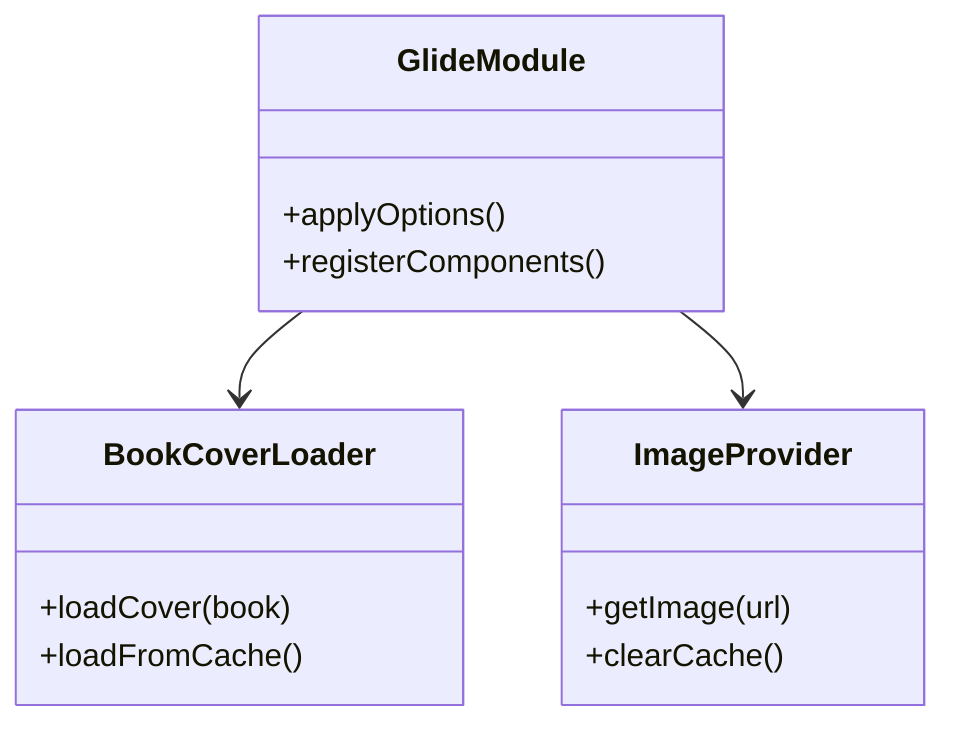

# 远程书籍 & 第三方集成

> **核心问题**：如何浏览 WebDAV 上的书籍？如何集成 Glide/GSY Video/ExoPlayer 等第三方库？
> **答案**：RemoteBook(WebDAV文件→数据模型) → RemoteBookManager(浏览) → RemoteBookWebDav(具体操作)；Glide(图片加载)、GSY Video(视频播放)、ExoPlayer(音频播放) 三大集成。

---

## 1. 远程书籍 (RemoteBook)

### 数据模型

**文件**：[RemoteBook.kt](file:///f:/myself/github/WeAgentChat/temp/legado/app/src/main/java/io/legado/app/model/remote/RemoteBook.kt)

```kotlin
data class RemoteBook(
    val filename: String,       // 文件名
    val path: String,           // 完整 WebDAV 路径
    val size: Long,             // 文件大小
    val lastModify: Long,       // 最后修改时间
    var contentType: String,    // 类型: "folder" 或文件扩展名
    var isOnBookShelf: Boolean  // 是否已在本地书架
)
```

### 从 WebDavFile 构造

```kotlin
constructor(webDavFile: WebDavFile) : this(
    webDavFile.displayName, webDavFile.path,
    webDavFile.size, webDavFile.lastModify
) {
    if (!webDavFile.isDir) {
        contentType = webDavFile.displayName.substringAfterLast(".")
        isOnBookShelf = LocalBook.isOnBookShelf(webDavFile.displayName)
    }
}
```

### RemoteBookManager — 远程书管理

浏览 WebDAV 目录结构，展示远程书籍列表：
- 目录导航（进入/返回上级）
- 文件类型过滤（仅显示支持的书籍格式：TXT/EPUB/PDF/MOBI/UMD）
- 导入到本地书架（从 WebDAV 下载 + 导入本地书模块）

### RemoteBookWebDav — WebDAV 文件操作

- `getFileList(path)` → 获取目录下的文件列表
- `downloadFile(path)` → 下载远程文件到本地
- `deleteFile(path)` → 删除远程文件
- `rename(from, to)` → 重命名

---

## 2. Glide 图片加载集成



**目录**：`help/glide/` 下 11 个文件

| 组件 | 文件 | 功能 |
|------|------|------|
| `ImageLoader` | `help/glide/ImageLoader.kt` | 图片加载统一入口（缓存策略/默认封面/错误图） |
| `LegadoGlideModule` | `help/glide/LegadoGlideModule.kt` | Glide Module 注册自定义组件 |
| `OkHttpModelLoader` | `help/glide/OkHttpModelLoader.kt` | OkHttp 作为 Glide 的网络加载器 |
| `OkHttpStreamFetcher` | `help/glide/OkHttpStreamFetcher.kt` | OkHttp 数据流获取器 |
| `OkHttpModeLoaderFactory` | `help/glide/OkHttpModeLoaderFactory.kt` | 工厂模式创建不同的 OkHttpLoader |
| `ProgressResponseBody` | `help/glide/progress/ProgressResponseBody.kt` | 下载进度包装 ResponseBody |
| `ProgressManager` | `help/glide/progress/ProgressManager.kt` | 进度监听管理器 |
| `OnProgressListener` | `help/glide/progress/OnProgressListener.kt` | 进度回调接口 |
| `GlideHeaders` | `help/glide/GlideHeaders.kt` | 自定义请求头注入 |
| `LegadoDataUrlLoader` | `help/glide/LegadoDataUrlLoader.kt` | Data URL (base64) 加载器 |
| `FilePathLoader` | `help/glide/FilePathLoader.kt` | 本地文件路径加载器 |
| `BlurTransformation` | `help/glide/BlurTransformation.kt` | 高斯模糊变换 |
| `AsyncRecycleBitmapPool` | `help/glide/AsyncRecycleBitmapPool.kt` | 异步回收 Bitmap 池 |

### 漫画下载进度

漫画使用专用的 `okHttpClientManga`，通过 `ProgressResponseBody` 将下载进度透传给 Glide：

```
okHttpClientManga
    → ProgressResponseBody(url, LISTENER, response.body)
    → OnProgressListener → UI 进度条更新
```

### 缓存策略

- `AppConfig.bitmapCacheSize` — Bitmap 缓存大小（MB），默认 50
- `AppConfig.imageRetainNum` — 漫画图片保留数量，默认 0（全部保留）
- `AppConfig.loadCoverOnlyWifi` — 仅 WiFi 加载封面

---

## 3. GSY Video 视频播放

**目录**：`help/gsyVideo/` 下 9 个文件

| 组件 | 文件 | 功能 |
|------|------|------|
| `VideoPlayer` | `help/gsyVideo/VideoPlayer.kt` | 视频播放器封装（全屏/小窗切换） |
| `FloatingPlayer` | `help/gsyVideo/FloatingPlayer.kt` | 悬浮窗播放器 |
| `ExoVideoManager` | `help/gsyVideo/ExoVideoManager.kt` | 视频管理器（缓存管理） |
| `ExoPlayerManager` | `help/gsyVideo/ExoPlayerManager.kt` | ExoPlayer 实例管理 |
| `Exo2MediaPlayer` | `help/gsyVideo/Exo2MediaPlayer.kt` | ExoPlayer2 适配器 |
| `SwitchVideoAdapter` | `help/gsyVideo/SwitchVideoAdapter.kt` | 视频源切换适配器 |
| `DanmakuAdapter` | `help/gsyVideo/DanmakuAdapter.kt` | 弹幕适配器 |
| `BiliDanmukuParser` | `help/gsyVideo/BiliDanmukuParser.kt` | B站弹幕格式解析器 |
| `ChoiceSpeedDialog` | `help/gsyVideo/ChoiceSpeedDialog.kt` | 倍速选择对话框 |
| `ChoiceEpisodeDialog` | `help/gsyVideo/ChoiceEpisodeDialog.kt` | 剧集选择对话框 |

### 视频来源

视频源通过书源规则解析（类似网络书章节），支持：
- 直接 URL 播放
- 弹幕文件加载（Bilibili XML 格式）
- 倍速播放（0.5x-3x）
- 悬浮窗播放
- 剧集切换

---

## 4. ExoPlayer 音频播放

**目录**：`help/exoplayer/` 下 2 个文件

| 组件 | 文件 | 功能 |
|------|------|------|
| `ExoPlayerHelper` | `help/exoplayer/ExoPlayerHelper.kt` | ExoPlayer 构建辅助 |
| `InputStreamDataSource` | `help/exoplayer/InputStreamDataSource.kt` | InputStream 数据源（供 ExoPlayer 读取 OkHttp 流） |

`AudioPlayService` 使用 ExoPlayer 作为音频引擎。

---

## 5. 加密模块

**目录**：`help/crypto/` 下 3 个文件

| 组件 | 文件 | 功能 |
|------|------|------|
| `SymmetricCryptoAndroid` | `help/crypto/SymmetricCryptoAndroid.kt` | 对称加密（AES-256） |
| `AsymmetricCrypto` | `help/crypto/AsymmetricCrypto.kt` | 非对称加密（RSA） |
| `Sign` | `help/crypto/Sign.kt` | 数字签名（MD5/SHA） |

用途：
- 备份中的 `servers.json` 加密（AES）
- `BackupAES` 中 `webDavPassword` 加密
- 书源 HTTPS 证书验证（需要时）

---

## 6. 其他 Help 工具

| 组件 | 文件 | 功能 |
|------|------|------|
| `Coroutine` / `CompositeCoroutine` | `help/coroutine/` | 协程工具类（async/IO/Main/超时） |
| `CoroutineContainer` | `help/coroutine/CoroutineContainer.kt` | Activity 级协程容器 |
| `CacheManager` | `help/CacheManager.kt` | 内存缓存管理器（LRU） |
| `CrashHandler` | `help/CrashHandler.kt` | 全局崩溃捕获 |
| `AppFreezeMonitor` | `help/AppFreezeMonitor.kt` | UI 冻结检测 |
| `DispatchersMonitor` | `help/DispatchersMonitor.kt` | 协程调度器监控 |
| `ConcurrentRateLimiter` | `help/ConcurrentRateLimiter.kt` | 并发速率限制器（漫画下载限速） |
| `DirectLinkUpload` | `help/DirectLinkUpload.kt` | 直链上传配置 |
| `DefaultData` | `help/DefaultData.kt` | 默认数据（初始主题/排版方案） |
| `ExecutorService` | `help/ExecutorService.kt` | 线程池管理 |
| `LayoutManager` | `help/LayoutManager.kt` | 布局管理器 |
| `PaintPool` | `help/PaintPool.kt` | Paint 对象池（减少 GC） |
| `RuleComplete` | `help/RuleComplete.kt` | 书源规则自动补全 |
| `IntentHelp` / `IntentData` | `help/IntentHelp.kt` | 意图构建辅助 / 意图数据传递 |
| `MediaHelp` | `help/MediaHelp.kt` | 媒体会话辅助 |
| `LauncherIconHelp` | `help/LauncherIconHelp.kt` | 动态图标切换 |
| `LifecycleHelp` | `help/LifecycleHelp.kt` | 生命周期辅助 |

---

## 7. 更新系统

**目录**：`help/update/` 下 4 个文件

| 组件 | 文件 | 功能 |
|------|------|------|
| `AppUpdate` | `help/update/AppUpdate.kt` | 更新检查入口 |
| `AppUpdateGitee` | `help/update/AppUpdateGitee.kt` | Gitee 仓库更新源 |
| `AppUpdateGitHub` | `help/update/AppUpdateGitHub.kt` | GitHub 仓库更新源 |
| `AppReleaseInfo` | `help/update/AppReleaseInfo.kt` | 发布信息数据类 |

### 更新流程

```
MainActivity.onPostCreate()
    → 版本号相同 && autoUpdateVariant
    → 距上次检查超过24h
    → AppUpdate.giteeUpdate.check()
    → 有更新 → 弹出 UpdateDialog
        → 下载 APK → 安装
```

- `AppConfig.updateToVariant` — 选择更新变体（默认/OSS）
- `AppConfig.autoUpdateVariant` — 是否自动检查更新

---

## 8. WebView 组件

**目录**：`help/webView/` 下 3 个文件

| 组件 | 文件 | 功能 |
|------|------|------|
| `WebViewPool` | `help/webView/WebViewPool.kt` | WebView 对象池 |
| `PooledWebView` | `help/webView/PooledWebView.kt` | 池化 WebView 包装 |
| `WebJsExtensions` | `help/webView/WebJsExtensions.kt` | WebView JS 扩展 |

---

## 9. 第三方库全景

| 库 | 版本 | 用途 |
|----|------|------|
| **OkHttp** | 3.x | HTTP 网络请求 |
| **jsoup** | 1.16.2 ⚠️锁定 | HTML 解析（CSS选择器 + XPath） |
| **rhino** | 1.8.1 ⚠️锁定 | JavaScript 执行引擎 |
| **Room** | 2.x | SQLite ORM（数据库） |
| **Glide** | 4.x | 图片加载（封面/漫画） |
| **GSY Video** | — | 视频播放器 |
| **ExoPlayer** | — | 音频播放器 |
| **NanoHTTPD** | — | 内嵌 HTTP 服务器 |
| **Cronet** | Google | HTTP/2 加速（可选） |
| **SARDINE** | — | WebDAV 客户端 |
| **ZXing** | — | 二维码生成/扫描 |
| **Material Design** | — | UI 组件库 |