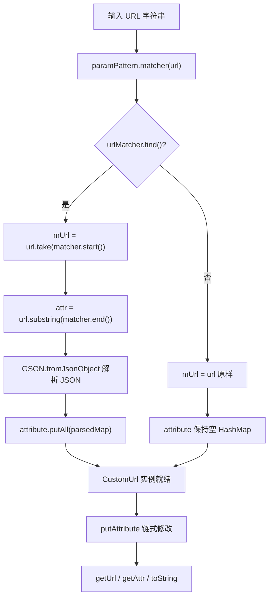

# Rhino 模块深度分析

> **核心问题**：Legado 如何在 Android 上安全地执行用户编写的 JavaScript 书源规则，同时支持协程挂起、沙箱隔离和递归保护？
>
> **答案**：通过定制 Rhino JS 引擎，构建三层防护体系：(1) RhinoClassShutter 类名白名单 + RhinoWrapFactory/ProtectedNativeJavaClass 属性级过滤实现沙箱；(2) RhinoContext + RhinoContextFactory（内联于 RhinoScriptEngine.init）实现指令计数器中断与递归深度上限；(3) RhinoExtensions.suspendContinuation 利用 Rhino Continuation 机制桥接 Kotlin 协程，让 JS 脚本能 await 异步操作。

---

## 1. 模块总览

modules/rhino/ 是 Legado 对 Mozilla Rhino 1.8.1 的封装层，提供 JSR-223 兼容的脚本引擎接口，并叠加安全沙箱、协程桥接、递归保护三大定制能力。
### 源文件索引

| 文件 | 行数 | 职责 |
|------|------|------|
| com/script/rhino/RhinoScriptEngine.kt | ~240 | 引擎单例，JSR-223 入口，ContextFactory 初始化 |
| com/script/rhino/RhinoExtensions.kt | ~48 | 协程桥接（suspendContinuation、runScriptWithContext） |
| com/script/rhino/RhinoContext.kt | ~30 | 扩展 Context，挂载协程上下文与递归计数 |
| com/script/rhino/RhinoClassShutter.kt | ~130 | 类名黑白名单，沙箱核心 |
| com/script/rhino/RhinoWrapFactory.kt | ~91 | Java→JS 类型桥接 + 安全过滤 |
| com/script/rhino/RhinoTopLevel.kt | ~111 | 顶层作用域，提供 bindings/scope/sync 函数 |
| com/script/rhino/RhinoErrors.kt | ~3 | 中断/递归错误类型 |
| com/script/rhino/RhinoCompiledScript.kt | ~95 | 编译后脚本的执行与挂起执行 |
| com/script/rhino/JavaObjectWrapFactory.kt | ~7 | Java→JS 包装策略接口 |
| com/script/rhino/ReadOnlyJavaObject.kt | ~30 | 只读 Java 对象包装（屏蔽 setter） |
| com/script/rhino/ProtectedNativeJavaClass.kt | ~38 | 受保护 Java 类包装（按方法名过滤） |
| com/script/rhino/JavaAdapter.kt | ~65 | JS 实现 Java 接口的桥接构造器 |
| com/script/rhino/JSAdapter.kt | ~220 | JS 动态代理（__get__/__put__ 等 hook） |
| com/script/rhino/InterfaceImplementor.kt | ~80 | java.lang.reflect.Proxy 实现 JS→Java 接口 |
| com/script/rhino/ExternalScriptable.kt | ~240 | ScriptContext→Scriptable 适配器 |
| com/script/rhino/VMBridgeReflect.kt | ~16 | 反射访问 Rhino 内部 VMBridge |
| com/script/rhino/ClassNameMatcher.kt | ~36 | 二分+前缀匹配的类名过滤器 |
| com/script/rhino/CollectionExtensions.kt | ~18 | fastBinarySearch 扩展函数 |
| com/script/ScriptEngine.kt | ~50 | JSR-223 引擎接口定义 |
| com/script/AbstractScriptEngine.kt | ~105 | 引擎接口默认实现 |
| com/script/Invocable.kt | ~14 | JSR-223 可调用接口 |
| com/script/Compilable.kt | ~12 | JSR-223 可编译接口 |
| com/script/CompiledScript.kt | ~50 | 编译脚本基类 |
| com/script/ScriptBindings.kt | ~30 | 继承 NativeObject 的绑定容器 |
| com/script/Bindings.kt | ~16 | JSR-223 Bindings 接口 |
| com/script/SimpleBindings.kt | ~55 | Bindings 默认实现（HashMap 委托） |
| com/script/ScriptContext.kt | ~28 | JSR-223 上下文接口 |
| com/script/SimpleScriptContext.kt | ~105 | ScriptContext 默认实现 |
| com/script/ScriptException.kt | ~45 | 脚本异常（含文件名/行号/列号） |
| com/script/ScriptBindingsExtensions.kt | ~12 | buildScriptBindings 工具函数 |
| io/legado/app/help/rhino/NativeBaseSource.kt | ~38 | 书源对象只读包装 |
| io/legado/app/model/analyzeRule/CustomUrl.kt | ~45 | 自定义 URL 模板解析 |
---

## 2. 架构与继承关系

`mermaid
classDiagram
    direction TB

    class ScriptEngine {
        <<interface>>
        +eval(reader, scope, coroutineContext)
        +evalSuspend(reader, scope)
        +createBindings()
        +getRuntimeScope(context)
        +getRuntimeScope(bindings)
    }

    class AbstractScriptEngine {
        <<abstract>>
        #context: ScriptContext
    }

    class Invocable {
        <<interface>>
        +invokeFunction(name, args)
        +invokeMethod(obj, name, args)
        +getInterface(clazz)
    }

    class Compilable {
        <<interface>>
        +compile(script): CompiledScript
    }

    class RhinoScriptEngine {
        <<object>>
        -topLevel: RhinoTopLevel
        -indexedProps: Map
        -implementor: InterfaceImplementor
        +eval(js, bindingsConfig)
        +eval(reader, scope, coroutineContext)
        +evalSuspend(reader, scope)
        +compile(script): RhinoCompiledScript
    }

    class CompiledScript {
        <<abstract>>
        +eval(scope, coroutineContext)
        +evalSuspend(scope)
    }

    class RhinoCompiledScript {
        -engine: RhinoScriptEngine
        -script: Script
        +eval(scope, coroutineContext)
        +evalSuspend(scope)
    }

    class Context {
        <<Rhino>>
    }

    class RhinoContext {
        +coroutineContext: CoroutineContext?
        +allowScriptRun: Boolean
        +recursiveCount: Int
        +ensureActive()
        +checkRecursive()
    }

    class RhinoTopLevel {
        +scriptEngine: RhinoScriptEngine
        +bindings()$
        +scope()$
        +sync()$
    }

    class ImporterTopLevel {
        <<Rhino>>
    }

    ScriptEngine <|.. AbstractScriptEngine
    AbstractScriptEngine <|-- RhinoScriptEngine
    Invocable <|.. RhinoScriptEngine
    Compilable <|.. RhinoScriptEngine
    CompiledScript <|-- RhinoCompiledScript
    Context <|-- RhinoContext
    ImporterTopLevel <|-- RhinoTopLevel

    RhinoScriptEngine --> RhinoTopLevel : creates
    RhinoScriptEngine --> RhinoContext : uses
    RhinoScriptEngine --> InterfaceImplementor : delegates
    RhinoCompiledScript --> RhinoScriptEngine : references
`
---

## 3. 脚本生命周期：编译 -> 执行 -> 缓存

`mermaid
flowchart TB
    subgraph compile [编译阶段]
        A[JS 源码字符串] --> B[RhinoScriptEngine.compile]
        B --> C[cx.compileReader]
        C --> D[RhinoCompiledScript]
    end

    subgraph sync [同步执行]
        D --> E[调用方式?]
        E -->|同步| F[eval scope, coroutineContext]
        F --> G[cx.evaluateReader]
        G --> H[unwrapReturnValue]
    end

    subgraph suspend [挂起执行]
        E -->|挂起| I[evalSuspend scope]
        I --> J[cx.executeScriptWithContinuations]
        J --> K[ContinuationPending?]
        K -->|是| L[捕获 applicationState 为挂起函数]
        L --> M[suspendFunction 执行]
        M --> N[cx.resumeContinuation]
        N --> K
        K -->|否| H
    end

    subgraph security [安全检查]
        F --> O[RhinoContext.checkRecursive]
        F --> P[RhinoContext.ensureActive]
        I --> O
        I --> P
        G --> Q[RhinoClassShutter 拦截类访问]
        G --> R[RhinoWrapFactory 拦截对象包装]
    end
`

### 3.1 编译流程

RhinoScriptEngine.compile() (RhinoScriptEngine.kt:195-209) 调用 cx.compileReader() 将 JS 源码编译为 Rhino Script 对象，封装为 RhinoCompiledScript 返回。编译结果可缓存复用，避免重复解析。

### 3.2 同步执行流程

eval(reader, scope, coroutineContext) (RhinoScriptEngine.kt:73-106) 执行步骤：

1. Context.enter() 获取 RhinoContext 实例（由 ContextFactory.makeContext() 创建，RhinoScriptEngine.kt:217-225）
2. 设置 cx.coroutineContext、cx.allowScriptRun = true、递增 cx.recursiveCount
3. cx.checkRecursive() 检查递归深度上限（10层，RhinoContext.kt:25-28）
4. cx.evaluateReader(scope, reader, filename, 1, null) 执行脚本
5. unwrapReturnValue() 处理返回值（解包 Wrapper、ConsString->String、Undefined->null）
6. finally 块恢复状态并 Context.exit()

### 3.3 挂起执行流程（协程桥接）

evalSuspend() (RhinoScriptEngine.kt:108-143) 是 Legado 的核心创新，使用 Rhino Continuation API 实现 JS->Kotlin 协程桥接：

1. cx.executeScriptWithContinuations(script, scope) 以解释模式启动脚本
2. 当 JS 中调用 suspendContinuation { ... } 时，cx.captureContinuation() 捕获当前执行状态，抛出 ContinuationPending
3. applicationState 被设为 suspend { supervisorScope { block() } } 挂起 Lambda
4. 外层 while(true) 循环捕获 ContinuationPending，执行挂起函数，再通过 cx.resumeContinuation() 恢复 JS 执行
5. 循环直到脚本正常完成
---

## 4. 安全沙箱：RhinoClassShutter

### 4.1 类名过滤机制

RhinoClassShutter (RhinoClassShutter.kt:46-129) 实现 ClassShutter 接口，在 JS 尝试访问任何 Java 类时进行拦截：

- **精确类名黑名单**（RhinoClassShutter.kt:53-98）：java.lang.Runtime、java.lang.ProcessBuilder、java.io.File、java.security.AccessController、android.os.Process 等约 50 个危险类
- **前缀匹配黑名单**（RhinoClassShutter.kt:100-114）：android.system、java.lang.reflect、org.mozilla、com.script、sun 等约 15 个包前缀
- **实现匹配黑名单**（RhinoClassShutter.kt:119-134）：ClassLoader、Class、Member、Context、ObjectInputStream/ObjectOutputStream、okio.FileSystem/Path/FileHandle、android.content.Context 等类型的 isAssignableFrom 检查

### 4.2 ClassNameMatcher 高效匹配

ClassNameMatcher (ClassNameMatcher.kt:5-36) 使用二分搜索 + 前缀匹配：

1. 黑名单排序后，对目标类名做 fastBinarySearch（CollectionExtensions.kt:3-18）
2. 精确命中 -> 返回 true（被屏蔽）
3. 未命中时取前一条记录，检查是否为该类名的前缀 + . 分隔符 -> 包级屏蔽
4. LRU 缓存（64 条）加速重复查询

### 4.3 属性级过滤

- **ProtectedNativeJavaClass** (ProtectedNativeJavaClass.kt:7-38)：对 System 类屏蔽 load/loadLibrary/exit 方法
- **ReadOnlyJavaObject** (ReadOnlyJavaObject.kt:5-30)：屏蔽所有 setXxx 方法调用，put() 为空操作
- **NativeBaseSource** (NativeBaseSource.kt:7-38)：书源对象的只读包装，仅允许 setVariable，其他 setter 屏蔽
---

## 5. 线程模型与中断保护

### 5.1 ContextFactory 定制

RhinoScriptEngine.init 块（RhinoScriptEngine.kt:215-262）通过 ContextFactory.initGlobal() 注册全局 ContextFactory：

`mermaid
sequenceDiagram
    participant Caller as caller
    participant RSE as RhinoScriptEngine
    participant CF as ContextFactory
    participant RC as RhinoContext
    participant RS as RhinoClassShutter
    participant RWF as RhinoWrapFactory

    Caller->>RSE: eval(js, bindings)
    RSE->>CF: Context.enter()
    CF->>RC: makeContext()
    Note over RC: languageVersion=ES6, interpretedMode=true, classShutter=RS, wrapFactory=RWF, instructionObserver=10000, maxStackDepth=1000
    RC-->>RSE: cx (RhinoContext)
    RSE->>RC: allowScriptRun=true, recursiveCount++
    RSE->>RC: checkRecursive()
    RSE->>RC: evaluateReader(scope, reader, ...)

    loop per 10000 instructions
        CF->>RC: observeInstructionCount()
        RC->>RC: ensureActive()
        Note over RC: check coroutine cancellation
    end

    RC-->>RSE: result
    RSE->>RC: allowScriptRun=false, recursiveCount--
    RSE->>CF: Context.exit()
`

关键配置（RhinoScriptEngine.kt:219-225）：
- languageVersion = VERSION_ES6：支持 ES6 语法
- interpretedMode = true：解释模式（Continuation API 必需）
- instructionObserverThreshold = 10000：每 10000 条字节码指令触发一次 observeInstructionCount
- maximumInterpreterStackDepth = 1000：解释器栈深度上限

### 5.2 指令计数器中断

observeInstructionCount() (RhinoScriptEngine.kt:232-235) 在每 10000 条指令时调用 RhinoContext.ensureActive()，检查协程是否被取消。取消时抛出 RhinoInterruptError（RhinoErrors.kt:3），在 superDoTopCall 中被捕获并转换为 CancellationException 重新抛出（RhinoScriptEngine.kt:255-257）。

### 5.3 递归深度保护

RhinoContext.recursiveCount (RhinoContext.kt:12) 追踪脚本嵌套执行深度。checkRecursive() (RhinoContext.kt:25-28) 在深度 >= 10 时抛出 RhinoRecursionError（RhinoErrors.kt:5），防止书源规则通过递归调用自身造成栈溢出。

### 5.4 未授权执行拦截

cx.allowScriptRun (RhinoContext.kt:11) 标记当前是否通过正规 API 进入脚本执行。superDoTopCall() (RhinoScriptEngine.kt:246-260) 中检查此标志，未设置时直接 error，防止通过反射等绕过安全检查执行脚本。
---

## 6. 类型桥接

### 6.1 Java -> JS 包装

RhinoWrapFactory (RhinoWrapFactory.kt:46-91) 在 Java 对象进入 JS 作用域时拦截：

1. wrapAsJavaObject() (RhinoWrapFactory.kt:50-61)：先查 RhinoClassShutter.visibleToScripts()，不可见返回 null；再查注册的 JavaObjectWrapFactory，有则委托，否则走默认包装
2. wrapJavaClass() (RhinoWrapFactory.kt:63-75)：类不可见时包装为 NativeJavaPackage（空壳），可见时委托 RhinoClassShutter.wrapJavaClass() 生成 ProtectedNativeJavaClass
3. register() (RhinoWrapFactory.kt:85-89)：注册自定义包装策略（如 ReadOnlyJavaObject.factory、NativeBaseSource.factory）

### 6.2 JS -> Java 接口实现

三种机制：

| 机制 | 文件 | 用途 |
|------|------|------|
| JavaAdapter | JavaAdapter.kt:50-93 | new JavaAdapter(Interface, jsObj) 语法糖 |
| JSAdapter | JSAdapter.kt:63-220 | JS 端动态代理（__get__/__put__/__has__/__delete__/__getIds__） |
| InterfaceImplementor | InterfaceImplementor.kt:39-95 | java.lang.reflect.Proxy + InvocationHandler，将 Java 接口调用转发到 JS 函数 |

### 6.3 返回值解包

unwrapReturnValue() (RhinoScriptEngine.kt:188-195) 处理 JS->Java 返回值：
- Wrapper.unwrap()：解包 Java 对象
- ConsString.toString()：Rhino 惰性字符串转为 Java String
- Undefined -> null
---

## 7. 协程桥接详解

### 7.1 suspendContinuation

RhinoExtensions.kt:12-26 的 suspendContinuation 是 JS 脚本调用 Kotlin 挂起函数的桥梁：

    JS 调用 suspendContinuation { result = java.ajax(url) }
      -> cx.captureContinuation() 暂停 JS 执行
      -> applicationState = suspend { supervisorScope { block() } }
      -> 抛出 ContinuationPending
      -> RhinoScriptEngine.evalSuspend 捕获
      -> 执行 suspend 函数（可挂起等待网络等）
      -> cx.resumeContinuation() 恢复 JS 执行

降级路径：若 captureContinuation() 抛出 IllegalStateException（非解释模式），回退到 runBlocking { block() } 同步执行。

### 7.2 runScriptWithContext

两个重载版本（RhinoExtensions.kt:28-42）：

- **非挂起版** runScriptWithContext(context, block)：手动设置 RhinoContext.coroutineContext，执行同步代码块
- **挂起版** runScriptWithContext(block)：自动从 currentCoroutineContext() 获取协程上下文并注入

两者都将 ContinuationInterceptor 从上下文中移除（minusKey），避免调度器冲突。

### 7.3 VMBridgeReflect

VMBridgeReflect (VMBridgeReflect.kt:5-16) 通过反射获取 Rhino 内部的 VMBridge.instance 和 contextLocal（ThreadLocal）。evalSuspend 中使用 VMBridgeReflect.contextLocal.asContextElement() 创建协程 ThreadLocal 元素，确保 Continuation 恢复时在正确的线程上下文中执行。

---

## 8. CustomUrl 模板引擎

### 8.1 职责概述

CustomUrl (CustomUrl.kt:7-49) 是 Legado URL 模板系统的核心解析器，负责将「URL + JSON 属性 Map」的混合格式拆分为纯 URL 和属性字典两部分。书源规则中，URL 经常以 `http://example.com/api,{"method":"POST","charset":"utf-8","headers":{...}}` 的形式书写，逗号后面紧跟 JSON 对象用于指定请求参数。CustomUrl 将这种混合字符串解析为结构化的 `mUrl` + `attribute` 两个字段，供后续 AnalyzeUrl 等组件使用。

### 8.2 paramPattern 正则解析

AnalyzeUrl.paramPattern (AnalyzeUrl.kt:768) 定义了拆分正则：

```kotlin
val paramPattern: Pattern = Pattern.compile("\\s*,\\s*(?=\\{)")
```

- **匹配目标**：逗号后面紧跟 `{` 的位置（正向前瞻 `(?=\\{)`）
- **逗号前后的空白**：`\\s*,\\s*` 允许逗号两侧有任意空白
- **拆分策略**：找到首个匹配位置，`urlMatcher.start()` 之前为纯 URL，`urlMatcher.end()` 之后为 JSON 属性字符串

CustomUrl.init (CustomUrl.kt:13-22) 的解析流程：

1. `paramPattern.matcher(url)` 对输入字符串匹配
2. 若找到匹配：`url.substring(urlMatcher.end())` 提取 JSON 部分，`url.take(urlMatcher.start())` 提取纯 URL
3. JSON 部分经 `GSON.fromJsonObject<Map<String, Any>>()` 反序列化后写入 `attribute` HashMap
4. 若无匹配：整个输入作为 `mUrl`，`attribute` 为空

### 8.3 链式操作

| 方法 | 行号 | 行为 |
|------|------|------|
| `putAttribute(key, value)` | 25-32 | 向 attribute 中写入键值对；value 为 null 时移除该键；返回 this 支持链式调用 |
| `getUrl()` | 34-36 | 返回纯 URL 部分 mUrl |
| `getAttr()` | 38-40 | 返回 attribute 的只读 Map 视图 |
| `toString()` | 42-47 | 重建完整字符串：若 attribute 非空则 `mUrl + "," + GSON.toJson(attribute)`，否则仅 mUrl |

`putAttribute` 的 null 移除语义使得它可以同时用于添加和删除属性，链式调用模式如：

```kotlin
CustomUrl(url).putAttribute("method", "POST").putAttribute("charset", null).getUrl()
```

### 8.4 与 RhinoScriptEngine 的集成点

CustomUrl 本身不直接调用 RhinoScriptEngine，但它是 AnalyzeUrl 解析链的前置步骤：

1. 书源 JS 规则通过 `suspendContinuation` 调用 Kotlin 层的 `java.ajax(url)` 等异步方法
2. 这些方法接收的 URL 字符串可能是混合格式，内部由 AnalyzeUrl 使用 `paramPattern` 解析
3. CustomUrl 作为更轻量的替代，用于 RemoteBookWebDav 等不需要 AnalyzeUrl 完整解析逻辑的场景（RemoteBookWebDav.kt:79：`book.origin = BookType.webDavTag + CustomUrl(putUrl)`）

### 8.5 CustomUrl 解析流程



---

## 9. 关键设计决策

### ADR-1: 采用 Rhino Continuation 而非 Promise/Future 实现异步桥接

| 项目 | 内容 |
|------|------|
| **背景** | JS 书源规则需要调用 Kotlin 层的异步操作（网络请求、数据库查询等），需要一种机制让 JS 执行暂停、等待异步结果、再恢复执行 |
| **决策** | 使用 Rhino 内置的 Continuation API（captureContinuation / resumeContinuation）桥接 Kotlin 协程 |
| **替代方案** | (1) 在 JS 层引入 Promise/Future 模式，让脚本以 `ajax(url).then(...)` 链式调用；(2) 使用 Rhino 的生成器（Generator）机制；(3) 完全同步阻塞（runBlocking） |
| **理由** | Continuation 是 Rhino 原生提供的执行状态快照/恢复机制，可零侵入地暂停和恢复 JS 调用栈的任意位置，无需修改用户书源脚本的编写方式。JS 端仍以同步风格 `var result = java.ajax(url)` 书写，降低了书源编写门槛。Promise 模式需用户改写为异步风格，对非专业用户不友好；runBlocking 会阻塞线程，在 Android 上易导致 ANR |
| **代价** | Continuation API 要求必须开启解释模式（setInterpretedMode(true)），关闭 JIT 优化，脚本执行性能下降约 2-5 倍；Rhino Continuation 为非标准 API，升级 Rhino 版本时可能存在兼容性风险 |

### ADR-2: 解释模式必须开启

| 项目 | 内容 |
|------|------|
| **背景** | Rhino 支持解释模式和编译模式两种执行方式，编译模式将 JS 编译为 JVM 字节码，性能更高 |
| **决策** | 在 ContextFactory.makeContext() 中强制设置 `cx.setInterpretedMode(true)` |
| **替代方案** | 仅在需要 Continuation 时动态切换为解释模式，普通 eval 使用编译模式 |
| **理由** | Rhino 的 Continuation API 依赖解释器内部的执行栈快照机制，编译模式下 `captureContinuation()` 会抛出 IllegalStateException。由于 Legado 的 evalSuspend 和 eval 可能交替执行（evalSuspend 内部也可能调用 eval），运行时无法可靠判断当前脚本是否需要 Continuation，统一使用解释模式是最安全的方案 |
| **代价** | 所有脚本均以解释模式执行，包括不需要异步操作的简单规则，整体执行性能低于编译模式 |

### ADR-3: 递归深度上限设为 10

| 项目 | 内容 |
|------|------|
| **背景** | 书源规则可能通过 JS 调用 Kotlin 层再触发另一条规则的 JS 执行，形成递归调用链 |
| **决策** | RhinoContext.checkRecursive() 在 `recursiveCount >= 10` 时抛出 RhinoRecursionError |
| **替代方案** | (1) 不设上限，依赖 JVM 栈溢出保护；(2) 更高上限如 20-50；(3) 动态计算基于可用栈空间 |
| **理由** | Android 主线程默认栈大小约 1MB，每次 JS->Kotlin->JS 嵌套约消耗 50-100KB 栈空间（含 Rhino 解释器栈帧 + Kotlin 协程栈帧），10 层嵌套约 500KB-1MB，接近安全边界。实际书源规则极少超过 3-4 层嵌套，10 层既覆盖正常需求又防止恶意/错误递归。JVM 栈溢出抛出 StackOverflowError 无法被优雅处理，RhinoRecursionError 则能提供清晰的错误信息 |
| **代价** | 极少数复杂的递归书源规则可能被误拦截，需要用户重构规则逻辑 |

### ADR-4: 类名过滤采用二分搜索 + LRU 缓存

| 项目 | 内容 |
|------|------|
| **背景** | RhinoClassShutter.visibleToScripts() 在每次 JS 访问 Java 类时被调用，属于高频热路径 |
| **决策** | ClassNameMatcher 使用排序数组 + fastBinarySearch + 64 条 LRU 缓存 |
| **替代方案** | (1) HashSet 精确匹配 + 前缀遍历；(2) Trie 树结构；(3) 正则表达式匹配 |
| **理由** | 黑名单为静态不可变列表（约 50 个精确类名 + 15 个包前缀），排序后二分搜索的 O(log n) 查找优于 HashSet 的 O(n) 前缀匹配。LRU 缓存覆盖高频重复查询（如 `java.lang.String` 等基础类），将热路径降至 O(1)。Trie 树在 Android 上增加内存开销和初始化复杂度，对 65 条规则的规模收益不明显 |
| **代价** | 二分搜索需维护排序不变性（新增黑名单条目时需手动插入正确位置）；LRU 缓存在极端情况下可能被冷类名冲刷 |

---

## 10. 陷阱与约束

### 10.1 Rhino 1.8.1 不可升级

Rhino 1.8.1 是当前锁定版本，不可升级。原因：(1) Android 6（API 23）以下设备缺少 `Arrays.setAll()` 方法，Rhino 1.8.1 之后的版本依赖该方法，升级将导致低版本设备启动崩溃；(2) Continuation API 在新版 Rhino 中行为可能有变化，缺乏官方兼容性保证。任何涉及 Rhino 依赖变更的修改都必须在 Android 6 设备上验证。

### 10.2 Continuation API 与优化模式互斥

`cx.captureContinuation()` 仅在解释模式下可用。若 `setInterpretedMode(false)` 或未设置，调用 `captureContinuation()` 将抛出 IllegalStateException。suspendContinuation 的降级路径（RhinoExtensions.kt:35-36）捕获此异常后回退到 `runBlocking { block() }`，但这意味着在编译模式下异步操作将阻塞当前线程。修改 ContextFactory.makeContext() 时绝不能移除 `setInterpretedMode(true)`。

### 10.3 Context.exit() 必须与 enter() 配对

Rhino 使用 ThreadLocal 存储 Context 引用。`Context.enter()` 推入当前线程的 Context 栈，`Context.exit()` 弹出。若在 finally 块中遗漏 `Context.exit()`，ThreadLocal 中残留的 Context 引用将导致后续同一线程上的脚本执行获取到脏状态的 RhinoContext（如 allowScriptRun=true、coroutineContext 指向已结束的协程）。RhinoExtensions.kt 中 suspendContinuation 和 runScriptWithContext 均在 finally 中调用 `Context.exit()` 确保配对。

### 10.4 suspendContinuation 的降级路径风险

当 captureContinuation() 抛出 IllegalStateException 时（如脚本通过 eval 同步路径执行而非 evalSuspend），suspendContinuation 回退到 `runBlocking { block() }`（RhinoExtensions.kt:36）。在 Android 主线程上 runBlocking 会导致 ANR。此降级路径的存在意味着：JS 脚本中调用 `suspendContinuation` 时，若外层不是通过 evalSuspend 而是通过 eval 执行，将触发同步阻塞。开发者在新增 JS 可调用的异步 API 时，必须确保调用路径经过 evalSuspend。

### 10.5 ThreadLocal 在协程恢复时的漂移

Rhino 的 VMBridge 内部使用 ThreadLocal 存储当前 Context 引用。Kotlin 协程挂起后恢复可能在不同的线程上执行（尤其是使用 Dispatchers.IO 时），导致 ThreadLocal 中的 Context 引用丢失或指向错误实例。evalSuspend 中通过 `VMBridgeReflect.contextLocal.asContextElement()` 将 ThreadLocal 绑定为协程上下文元素，确保恢复时自动恢复正确的 Context。修改协程调度逻辑时，必须验证 ThreadLocal 传播是否仍然正确。

### 10.6 recursiveCount 在异常路径下的恢复

RhinoContext.recursiveCount 是 Int 类型，eval/evalSuspend 在进入时递增、finally 中递减。若某次脚本执行因未捕获的异常提前退出 finally 块（如 ThreadDeath 或直接 System.exit），recursiveCount 将无法递减，导致后续同一线程上的脚本执行可能因递归计数虚高而触发 RhinoRecursionError。当前代码已通过 try-finally 保护，但需注意不要在 finally 块中抛出新的异常覆盖原始异常。

### 10.7 observeInstructionCount 与协程取消的竞态

observeInstructionCount 在每 10000 条指令时检查协程是否被取消。但在高频率指令执行中，协程取消信号和指令计数器检查之间存在竞态窗口：协程已取消但脚本仍在执行，直到下一个 10000 条指令边界。在极端情况下，最多延迟 10000 条指令的执行时间。降低 instructionObserverThreshold 可减小窗口但增加性能开销，当前 10000 是经验平衡值。

### 10.8 RhinoClassShutter 黑名单排序不变性

ClassNameMatcher 依赖二分搜索，要求数组保持排序状态。BLACK_LIST 和 PREFIX_BLACK_LIST 数组在源码中以硬编码方式维护排序顺序。新增黑名单条目时，必须确保插入到正确的排序位置，而非简单追加到数组末尾。违反排序不变性将导致二分搜索返回错误结果，使本应被拦截的危险类逃过沙箱检查。
