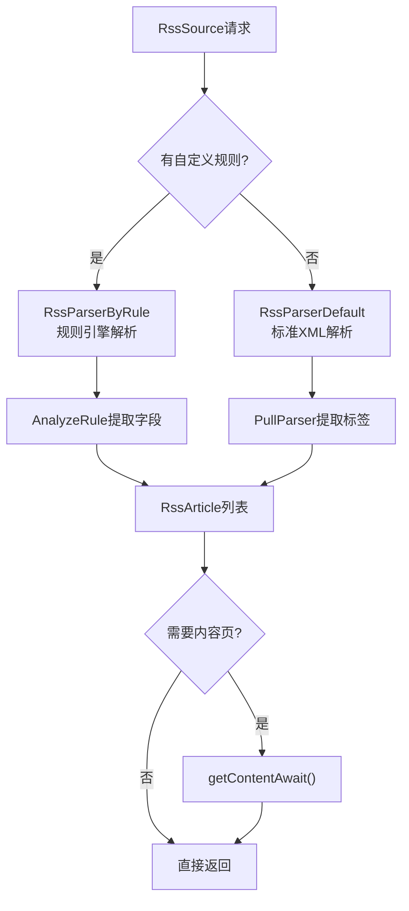
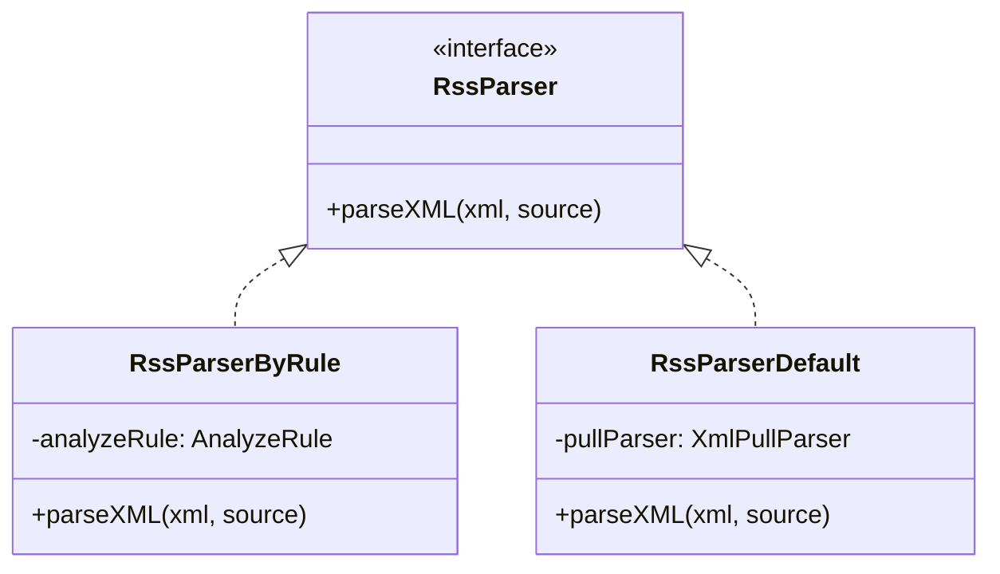

# RSS 子系统

> **核心问题**：如何订阅 RSS 源？文章列表如何解析？内容如何获取？
> **答案**：Rss object(单例) → AnalyzeUrl 获取 XML → RssParserByRule(规则解析) 或 RssParserDefault(标准RSS) → RssArticle 列表；内容通过 AnalyzeRule 执行 ruleContent 提取。

---

## 1. 架构概览

```
RssFragment / RssArticlesActivity (UI)
    │
    ▼
Rss object (单例调度)
    ├── getArticles(scope, sortName, sortUrl, rssSource, page)
    │       │
    │       ▼
    │   AnalyzeUrl.getStrResponseAwait()        ← 获取 RSS XML/JSON
    │       │
    │       ├── loginCheckJs ? → evalJS()       ← 登录检测
    │       │
    │       ▼
    │   RssParserByRule.parseXML()              ← 规则解析
    │       │ ruleArticles 为空?
    │       └→ RssParserDefault.parseXML()      ← 标准 RSS 解析
    │
    └── getContent(scope, rssArticle, ruleContent, rssSource)
            │
            ▼
        AnalyzeUrl.getStrResponseAwait()         ← 获取文章详情
            │
            ▼
        AnalyzeRule.getString(ruleContent)       ← 内容提取
```

---

## 2. 数据实体

### RssSource — RSS 源

[data/entities/RssSource.kt](file:///f:/myself/github/WeAgentChat/temp/legado/app/src/main/java/io/legado/app/data/entities/RssSource.kt)

```kotlin
@Entity
data class RssSource(
    var sourceUrl: String,            // 源 URL (主键)
    var sourceName: String,           // 源名称
    var sourceGroup: String?,         // 源分组
    var enabled: Boolean,             // 是否启用
    var header: String?,              // 自定义请求头 (JSON)
    var loginUrl: String?,            // 登录 URL
    var loginUi: String?,             // 登录 UI 配置
    var loginCheckJs: String?,        // 登录检查 JS
    var sourceComment: String?,       // 备注
    var type: Int,                    // 类型 (0=网页, 1=图片, 2=视频)
    var customOrder: Int,             // 排序号

    // === 起始页 ===
    var startHtml: String?,           // web形式起始页HTML
    var startStyle: String?,          // 起始页样式
    var startJs: String?,             // 起始页JS

    // === 文章样式 ===
    var articleStyle: Int,            // 文章样式(0=图文, 1=纯文字, 2=网页)
    var singleUrl: Boolean,           // 是否单URL模式(文章列表=内容页)

    // === 解析规则 ===
    var ruleArticles: String?,        // 文章列表规则 (如 "//item" / "//entry")
    var ruleTitle: String?,           // 标题规则
    var rulePubDate: String?,         // 发布日期规则
    var ruleLink: String?,            // 链接规则
    var ruleDescription: String?,     // 描述规则
    var ruleImage: String?,           // 图片规则 (自动从描述中提取)
    var ruleContent: String?,         // 文章正文规则
    var ruleNextPage: String?,        // 下一页规则 (值为"PAGE"表示自带分页)

    // === 内容过滤 ===
    var contentWhitelist: String?,    // 内容白名单
    var contentBlacklist: String?,    // 内容黑名单
    var shouldOverrideUrlLoading: String?, // URL拦截规则

    // === WebView 配置 ===
    var style: String?,               // 自定义CSS样式
    var enableJs: Boolean,            // 是否启用JS
    var loadWithBaseUrl: Boolean,     // 是否使用baseUrl加载
    var injectJs: String?,            // 注入JS
    var preloadJs: String?,           // 预加载JS
    var showWebLog: Boolean,          // 是否显示Web日志

    // === 其他配置 ===
    var preload: Boolean,             // 是否预加载
    var cacheFirst: Boolean,          // 是否缓存优先
    var searchUrl: String?,           // 搜索URL
    var variableComment: String?,     // 变量注释
)
```

### RssArticle — RSS 文章

[data/entities/RssArticle.kt](file:///f:/myself/github/WeAgentChat/temp/legado/app/src/main/java/io/legado/app/data/entities/RssArticle.kt)

```kotlin
@Entity
data class RssArticle(
    var origin: String,               // 源 URL
    var sort: String,                 // 分类名
    var link: String,                 // 文章链接
    var title: String,                // 标题
    var description: String?,         // 摘要
    var content: String?,             // 正文
    var image: String?,               // 配图 URL
    var order: Int,                   // 序号
    var pubDate: String?,             // 发布日期
    var read: Boolean,                // 是否已读
    var star: Boolean                 // 是否收藏 (RssStar)
)
```

### RssStar — 收藏文章

```kotlin
// RssArticle 收藏后插入 RssStar 表
// 独立于 RssSource，移除 RSS 源后收藏仍保留
```

---

## 3. Rss — 核心调度器

**文件**：[Rss.kt](file:///f:/myself/github/WeAgentChat/temp/legado/app/src/main/java/io/legado/app/model/rss/Rss.kt)

### getArticles — 获取文章列表

```
getArticles(scope, sortName, sortUrl, rssSource, page, key)
    │
    ├── AnalyzeUrl(sortUrl, page, key, baseUrl, source)  — URL模板解析
    │       ├── page 参数注入
    │       ├── key 搜索关键字注入
    │       └── hasLoginHeader = false (RSS 不使用 Cookie)
    │
    ├── analyzeUrl.getStrResponseAwait()                  — 获取 XML/JSON
    │
    ├── loginCheckJs ?
    │   ├── analyzeUrl.evalJS(checkJs, response) as StrResponse  — JS 登录检测
    │   └── 失败时 evalJS(checkJs, errResponse)                    — 错误时也检
    │
    ├── checkRedirect(rssSource, res)                     — 检测 HTTP 重定向
    │
    └── RssParserByRule.parseXML(...)                     — 解析文章列表
```

### getContent — 获取文章内容

```
getContent(scope, rssArticle, ruleContent, rssSource)
    │
    ├── AnalyzeUrl(rssArticle.link, baseUrl=origin)       — 请求文章 URL
    ├── analyzeUrl.getStrResponseAwait()                  — 获取 HTML
    ├── AnalyzeRule(rssArticle, rssSource)                — 创建规则分析器
    │   ├── analyzeRule.setContent(body)
    │   ├── analyzeRule.setBaseUrl(absoluteURL)
    │   └── analyzeRule.setRedirectUrl(res.url)
    └── analyzeRule.getString(ruleContent)                — 执行规则提取
```

### 多线路多集（type=2 视频源，rss-cms-multiroute-nojs）

`type=2 且 ruleRoutes/ruleEpisodes 非空`时走多线路按需采集模式（ruleContent 不参与）：

- **数据规范化**：`Rss.normalizeMacCmsBody(body)` 在 `setContent` 前调用——检测 MacCMS 扁平字段（`vod_play_from`/`vod_play_url` 含 `$$$`）时在响应 JSON **顶层增量注入** `routes: [{name, episodes:[{title,url}]}]`（原字段不动、非 JSON/无特征/routes 已存在时零侵入），调用点 2 处（`getRoutesContentAwait`/`getEpisodesAwait`）
- **规则写法（列表范式，与书源目录同构）**：`ruleRoutes: $.routes[*].name`、`ruleEpisodes: $.routes[{routeIndex}].episodes`（`{routeIndex}` 占位符先替换再解析，对五种模式透明）
- **ruleRoutes 采集**：`getStringList` 优先（结果逐项按 `\n` 展开兼容旧 replaceRegex 转行产物），空则回落 `getString`+`\n` 分割（旧写法 `$.list[0].vod_play_from##\$\$\$##\n`）
- **集数解析**（`parseEpisodesResult`）：JSON 数组 `[{"title","url"}]`/`["url"]` → 多线路串兜底（含 `$$$` 时按 routeIndex 隐式分组，越界回落首组记 WARN）→ CMS 段解析（`parseEpisodesByLines`：行含 `$` 按 `#` 分集、`$` limit=2 拆名/址，缺名补"第N集"；纯 URL 行兼容不变）
- **切换线路**：`getEpisodesAwait`（VideoPlay.switchToRoute）重新请求详情+按 routeIndex 取对应线路集数

### 登录检测

[loginCheckJs](file:///f:/myself/github/WeAgentChat/temp/legado/app/src/main/java/io/legado/app/model/rss/Rss.kt#L53) 用于检测 RSS 源是否失效/需登录：

```javascript
// 示例 loginCheckJs (在 JS 块中执行):
// 检查返回内容中是否有 "未登录" 或 "验证码" 关键字
if (result.body.includes("未登录")) {
    result.code = 500  // 模拟 500 状态码
}
result
```

---

## 4. RssParserByRule — 规则解析器

**文件**：[RssParserByRule.kt](file:///f:/myself/github/WeAgentChat/temp/legado/app/src/main/java/io/legado/app/model/rss/RssParserByRule.kt)

### RSS 文章解析流水线



### 解析器策略类图



### 解析流程

```
parseXML(sortName, sortUrl, redirectUrl, body, rssSource, ruleData)
    │
    ├── ruleArticles 为空 → RssParserDefault.parseXML()   — 标准 RSS
    │
    ├── ruleArticles.startsWith("-") ? reverse = true      — 反转列表
    │
    ├── AnalyzeRule.setContent(body)
    │   .setBaseUrl(sortUrl)
    │   .setRedirectUrl(redirectUrl)
    │
    ├── analyzeRule.getElements(ruleArticles)              — 获取文章节点
    │   规则示例: "//item" / "//entry" / "//channel/item"
    │
    ├── 分页检测
    │   ├── ruleNextPage == "PAGE" → nextUrl = sortUrl (自带分页)
    │   └── ruleNextPage 为规则    → analyzeRule.getString()
    │
    ├── 拆分字段规则 (splitSourceRule)
    │   ├── ruleTitle       → 标题规则 (支持 && 串联)
    │   ├── rulePubDate     → 日期规则
    │   ├── ruleDescription → 描述规则
    │   ├── ruleImage       → 图片规则
    │   └── ruleLink        → 链接规则
    │
    └── for (item in collections)
        └── getItem() → RssArticle 对象
            ├── title    = analyzeRule.getString(ruleTitle, item)
            ├── link     = analyzeRule.getString(ruleLink, item)
            ├── pubDate  = analyzeRule.getString(rulePubDate, item)
            ├── description = 从 HTML 中提取纯文本
            ├── image    = ruleImage 规则 || 从描述中自动提取 
            └── variable = ruleData.getVariable()  (JS 变量持久化)
```

### 图片自动提取

[getImageUrlFromHtml](file:///f:/myself/github/WeAgentChat/temp/legado/app/src/main/java/io/legado/app/model/rss/RssParserByRule.kt#L117)

```kotlin
// 当没有配置 ruleImage 时，自动从 description HTML 中提取第一个 ：
fun getImageUrl(html: String): String? {
    val pattern = "]+src=[\"']([^\"']+)[\"']".toPattern()
    return pattern.matcher(html).let { if (it.find()) it.group(1) else null }
}
```

### 规则解析器完整流程（RssParserByRule 伪代码）

```python
async def parse_rss_by_rule(
    sort_name: str, sort_url: str, redirect_url: str,
    body: str, rss_source: RssSource, rule_data: RuleData
) -> tuple[list[RssArticle], str | None]:
    if not body:
        raise NoStackTraceException("获取网页内容失败")

    rule_articles = rss_source.rule_articles
    reverse = False
    if rule_articles.startswith("-"):
        reverse = True
        rule_articles = rule_articles[1:]

    # 使用规则引擎提取文章列表元素
    analyze_rule = AnalyzeRule(rule_data, rss_source)
    analyze_rule.set_content(body).set_base_url(sort_url)
    analyze_rule.set_redirect_url(redirect_url)
    collections = analyze_rule.get_elements(rule_articles)

    # 下一页
    next_url = None
    if rss_source.rule_next_page:
        if rss_source.rule_next_page.upper() == "PAGE":
            next_url = sort_url
        else:
            next_url = analyze_rule.get_string(rss_source.rule_next_page)
            if next_url:
                next_url = NetworkUtils.get_absolute_url(sort_url, next_url)

    # 对每个元素提取字段
    article_list = []
    for index, item in enumerate(collections):
        article = RssArticle()
        analyze_rule.set_content(item)
        article.title = analyze_rule.get_string(rule_title)
        article.pub_date = analyze_rule.get_string(rule_pub_date)
        article.description = analyze_rule.get_string(rule_description)
        article.image = analyze_rule.get_string(rule_image)
        article.link = analyze_rule.get_string(rule_link, is_url=True)
        article.sort = sort_name
        article.origin = rss_source.source_url
        if article.title:
            article_list.append(article)

    if reverse:
        article_list.reverse()
    return (article_list, next_url)
```

### RSS 文章内容获取

```python
async def get_rss_article_content(
    rss_article: RssArticle, rule_content: str, rss_source: RssSource
) -> str:
    analyze_url = AnalyzeUrl(
        rss_article.link,
        base_url=rss_article.origin,
        source=rss_source,
        rule_data=rss_article
    )
    res = await analyze_url.get_str_response_await()
    analyze_rule = AnalyzeRule(rss_article, rss_source)
    analyze_rule.set_content(res.body)\
        .set_base_url(NetworkUtils.get_absolute_url(rss_article.origin, rss_article.link))\
        .set_redirect_url(res.url)
    return analyze_rule.get_string(rule_content)
```

---

## 5. RssParserDefault — 标准 RSS 解析

**文件**：[RssParserDefault.kt](file:///f:/myself/github/WeAgentChat/temp/legado/app/src/main/java/io/legado/app/model/rss/RssParserDefault.kt)

### 标准 RSS/Atom 解析

使用 `XmlPullParser` 解析标准格式：

```kotlin
// 解析标签:
RSS_ITEM           = "item" / "entry"           // 文章节点
RSS_ITEM_TITLE     = "title"                    // 标题
RSS_ITEM_LINK      = "link"                     // 链接
RSS_ITEM_THUMBNAIL = "thumbnail" + url 属性      // 缩略图
RSS_ITEM_ENCLOSURE = "enclosure" + type 属性     // 附件(图片/音频)
RSS_ITEM_DESCRIPTION = "description" / "summary" // 摘要
RSS_ITEM_CONTENT   = "content" / "content:encoded" // 正文
RSS_ITEM_PUB_DATE  = "pubDate" / "published"    // 日期
```

### 默认解析器标签映射（RssParserDefault）

当 `ruleArticles` 为空时，使用 XML PullParser 解析标准 RSS 2.0/Atom XML：

| XML 标签 | RSSArticle 字段 |
|-----------|----------------|
| `<item><title>` | `title` |
| `<item><link>` | `link` |
| `<item><description>` | `description`（同时从中提取 img src 作为 image） |
| `<item><content:encoded>` | `content`（优先，同时提取 image） |
| `<item><pubDate>` | `pubDate`（使用 next() 提取 TEXT 节点，跳过 XML 标签） |
| `<item><media:thumbnail url="">` | `image`（取 `url` 属性） |
| `<enclosure type="image/" url="">` | `image`（取 `url` 属性） |

### Next Page 检测

[link rel="next" in RSS/Atom feed](file:///f:/myself/github/WeAgentChat/temp/legado/app/src/main/java/io/legado/app/model/rss/RssParserDefault.kt#L103)

```kotlin
// 检测 <link rel="next" href="..."> 实现自动翻页
if (xmlPullParser.getAttributeValue(null, RSS_LINK_REL) == "next") {
    nextUrl = xmlPullParser.getAttributeValue(null, RSS_LINK_HREF)
}
```

---

## 6. UI 层

### RssFragment — RSS 文章流

```
RssFragment (MainActivity Tab3)
    ├── RssAdapter (DiffRecyclerAdapter<RssArticle>)
    ├── RssSourceAdapter (顶部 Tab 栏)
    │   └── 点击切换 RSS 源
    ├── 下拉刷新 → Rss.getArticles()
    ├── 上拉加载更多 → Rss.getArticles(page+1)
    ├── 点击文章 → RssArticlesActivity(WebView)
    └── 长按文章 → 收藏(RssStar) / 标为已读
```

### RssFragment modern/classic 双模式（F-4/6.x）

> 以下断言经 [RssFragment.kt](file:///f:/myself/github/WeAgentChat/temp/legado/app/src/main/java/io/legado/app/ui/main/rss/RssFragment.kt) 源码核验（2026-08-30，行号为当日快照）。

**模式开关与分派**：

- 开关：`AppConfig.modernRssPage`（AppConfig.kt L414-L415，**默认 true** = 现代形态）；Fragment 侧字段 `usingModernRss`（RssFragment.kt L148）
- 分派入口 `applyRssMode()`（L342-L352）：`usingModernRss = AppConfig.modernRssPage` → 统一 `resetRssModeState()`（L355-L380，取消跨模式 collector / 清分组类型标签 / 隔离 sortHostViewModel / 重置 `classicHeaderReady`）→ 分发到 `applyModernRssMode()`（L422）或 `applyClassicRssMode()`（L383）→ `invalidateOptionsMenu()`
- onResume 检测配置变化重建（L241/L301 `usingModernRss != AppConfig.modernRssPage`），重建后以新配置初始化，不循环重建
- `classicHeaderReady`（L161）：per-mode header 挂载标志，S5 模式切换时释放（L379），`getHeaderCount()` 幂等兜底防重复挂载（L1013-L1016）

**classic 路径 — applyClassicRssMode（L383-L419）**：

- `recyclerView` 可见（L393）+ Compose 顶栏 `initComposeTopBar()`（L395）+ 分组胶囊标签 `initTabLayout()`（L396，D1）+ Compose 文件夹网格 `initFolderComposeView()`（L397，folder-compose-refactor，卡片间距跟随 `AppConfig.sourceMargin`，L175）
- 文件夹/标签模式由 `sourceGroupStyle`+`sourceGroupMode` 驱动（L179-L184：`isFolderViewMode` = style!=0 且 mode==1；标签模式 = style!=0 且 mode==0）
- **z 序双保险**（L388-L391）：`rss_fragment_container`/`rss_web_container` 为全屏 z 序最高层，切 classic 时无条件 `isGone = true`，否则 modern 容器残留会盖住经典列表（真机实锤 2026-08-28）
- **500ms 二次收敛**（L407-L418）：`postDelayed(500)` 校验 modern 容器/胶囊是否被竞态重新渲染，是则强制再次清空（`destroyModernRssChildren` + 清空顶栏 primaryItems/tags）——守卫"经典顶栏+modern 内容"混合态

**modern 路径 — applyModernRssMode（L422-L432）**：

- `recyclerView.gone()`，初始化 `initModernRssView()`（L452 起：顶栏 Mode.RSS + 源选择 titleSelect → SourceSelectDialog + 源标签 primaryBar 点击切源）+ `observeRssSources()`
- 内容双分支（L450 注释 + L471-L477）：可现代渲染的源（`canRenderInModernPage()`）内嵌 **RssArticlesFragment** 文章列表；否则 `openRssLegacy` 走 **WebView 单源渲染**（`rssWebContainer`）

**资源与作用域**：

- `destroyModernRssChildren()`（L434-L446）：销毁 rssWebView（stopLoading→about:blank→destroy）+ `commitNow` 同步移除内嵌 Fragment（commit 异步窗口期会残留覆盖经典列表）
- WebView 池隔离：离开订阅页 `WebViewPool.scheduleDestroyScope(WebViewPool.Scope.RSS)`（L321）/ `destroyScope(WebViewPool.Scope.RSS)`（L337），详见 [webview-pool.md](./webview-pool.md)

**历史迁移**：旧偏好键 `PreferKey.rssViewMode` 已删除（0 引用，PreferKey.kt L292 注释），分组展示迁移链为 `sourceGroupStyle`（L300，0=列表/1=按类型/2=按分组）+ `sourceGroupMode` + `sourceMargin`（L307，卡片间距）。

### RssArticlesActivity — 文章阅读

```
RssArticlesActivity
    ├── WebView 加载文章内容
    │   ├── 应用阅读主题 (字体/背景/间距)
    │   ├── 应用替换规则 (ReplaceRule)
    │   └── 支持 JS 注入 (如屏蔽广告)
    ├── 浮动操作按钮 → 收藏/分享
    └── BottomSheet → 切换文章/目录
```

### RssSourceActivity — RSS 源管理

```
RssSourceActivity
    ├── 源列表 (拖拽排序)
    ├── 导入/导出 (Backup 集成)
    ├── 订阅更新 (RuleUpdate 集成)
    └── 源编辑 → RssSourceEditActivity
```

---

## 7. 与书源规则的对比

| 特性 | BookSource (书源) | RssSource (RSS) |
|------|-------------------|-----------------|
| 搜索 | ruleSearch (搜索页) | 不适用 (直接获取列表) |
| 发现 | ruleExplore (发现页) | 同上 |
| 列表 | ruleBookList (搜索结果) | ruleArticles |
| 详情 | ruleBookInfo | ruleContent (直接获取正文) |
| 目录 | ruleToc | 无 (列表即是所有文章) |
| 正文 | ruleContent | ruleContent |
| 登录 | loginUrl + loginUi | loginUrl + loginCheckJs |
| 分页 | nextPage 规则 | ruleNextPage (或 "PAGE") |
| 解析引擎 | AnalyzeRule (5种) | AnalyzeRule + XmlPullParser |

---

## 8. 数据流总结

```
┌────────────────────┐
│   RssFragment      │  ← 用户选择 RSS 源
│   (ViewModel)      │
└────────┬───────────┘
         │ Coroutine.async
┌────────▼───────────┐
│   Rss.getArticles  │  ← 单例调度
│   AnalyzeUrl       │      URL 模板: {page} / {key} 注入
└────────┬───────────┘
         │ OkHttp
┌────────▼───────────┐
│   XML/JSON 响应    │
└────────┬───────────┘
         │
    ┌────┴────┐
    │ 分叉判断  │
    └────┬────┘
         │
    ruleArticles 有值? 
    ├── YES → RssParserByRule.parseXML()
    │          ├── AnalyzeRule.getElements(ruleArticles)
    │          ├── getItem() × N  → List<RssArticle>
    │          └── nextUrl (分页)
    └── NO  → RssParserDefault.parseXML()
               └── XmlPullParser 逐元素解析
                        │
               ┌────────▼────────┐
               │ List<RssArticle> │
               │ nextUrl: String? │
               └────────┬────────┘
                        │
               ┌────────▼────────┐
               │ RssAdapter      │  ← DiffUtil 异步更新
               │ setItems()      │
               └─────────────────┘
```