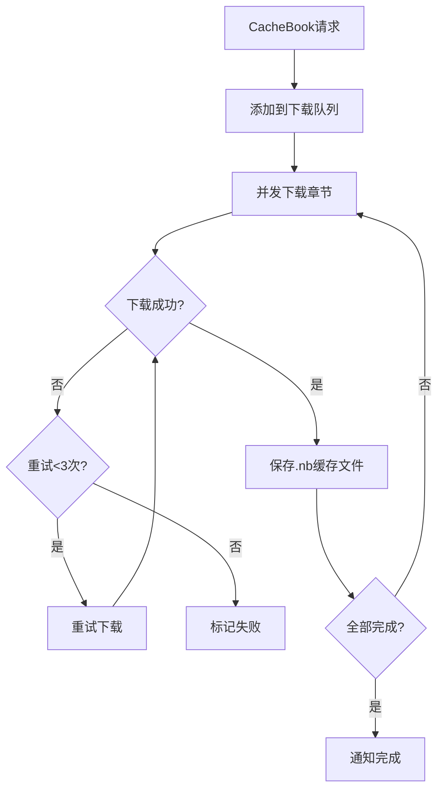

# 服务层与辅助模块

> App 初始化、WebDAV 同步、下载缓存、TTS 朗读、RSS 子系统、JS 扩展函数。

---

## 1. App.kt — 应用初始化

[App.kt:70-127](file:///f:/myself/github/WeAgentChat/temp/legado/app/src/main/java/io/legado/app/App.kt#L70-L127)

### 1.1 初始化流程

```
App.onCreate():
  主线程同步初始化:
    1. CrashHandler 注册 + LogUtils 初始化（全局崩溃处理器 + 日志系统）
    2. AppConfig SP 监听器注册（SharedPreferences 变更监听）

  异步初始化（在 IO 协程中顺序执行）:
    3. Cronet 引擎初始化（OkHttp HTTP/2 支持）
    4. 通知渠道创建（3个渠道: 下载/朗读/Web服务）
    5. Room 数据库初始化（appDb 懒加载触发）
    6. Rhino JS 引擎初始化（WrapFactory 注册）
    7. 缓存大小检查（超出限制则清理）
    8. 简繁转换库初始化
    9. WebDAV 自动同步检测

  延迟初始化:
    10. Web 服务器启动（用户首次打开 Web 管理时）
```

### 1.2 通知渠道

[App.kt:178-221](file:///f:/myself/github/WeAgentChat/temp/legado/app/src/main/java/io/legado/app/App.kt#L178-L221)

```
3 个通知渠道:
  1. 下载通知   — DownloadService 进度
  2. 朗读通知   — TTS 朗读 / 后台播放 (channelIdReadAloud)
  3. Web服务通知 — 更新检查、同步状态 (channelIdWeb)
```

### 1.3 Rhino 初始化

[App.kt:223-234](file:///f:/myself/github/WeAgentChat/temp/legado/app/src/main/java/io/legado/app/App.kt#L223-L234)

```
initRhino():
  注册自定义 Rhino WrapFactory
  使得 JS 可通过 java 对象调用 JsExtensions 中的所有方法
```

---

## 2. AppWebDav — WebDAV 同步

[AppWebDav.kt:40](file:///f:/myself/github/WeAgentChat/temp/legado/app/src/main/java/io/legado/app/help/AppWebDav.kt#L40)

### 2.1 同步机制

```
WebDAV 同步内容:
  - 书架数据 (books.json)
  - 书源数据 (bookSources.json)
  - RSS 源数据 (rssSources.json)
  - 阅读进度 (bookProgress.json)
  - 替换规则 (replaceRules.json)

同步策略:
  - 比较本地和远程的时间戳
  - 时间戳更新的 → 覆盖旧的
  - 冲突时以远程为准
```

### 2.2 核心方法

| 方法 | 功能 |
|------|------|
| `upConfig()` | 配置 WebDAV 连接参数并验证 |
| `uploadBookProgress()` | 上传当前阅读进度 |
| `getBookProgress()` | 获取指定书的远程进度 |
| `downloadAllBookProgress()` | 下载全部书籍进度（比较时间戳） |
| `exportBookSources()` | 导出书源到 WebDAV |
| `importBookSources()` | 从 WebDAV 导入书源 |

---

## 3. DownloadService — 文件下载

基于 Android `DownloadManager` 系统服务：

```
功能: 通用文件下载（APK/ZIP/图片等），非书籍章节缓存
特性:
  - 去重检测（相同URL不重复下载）
  - 进度通知（每秒轮询 DownloadManager 状态）
  - 自动打开下载完成的文件
  - 支持暂停/取消
```

---

## 4. CacheBook — 章节缓存服务

```
功能: 书籍章节离线缓存（"离线缓存"按钮触发）
流程:
  1. 获取书籍目录
  2. 按章节逐个下载并保存到本地文件系统
  3. 多线程并发下载（Semaphore 控制并发数）
  4. 下载进度通知
  5. 失败重试机制
```

### CacheBook 完整架构

```
CacheBook 单例
├── cacheBookMap: ConcurrentHashMap<String, CacheBookModel>
│   └── CacheBookModel(bookSource, book)
│       ├── waitDownloadSet: LinkedHashSet<Int>      # 待下载章节索引
│       ├── onDownloadSet: LinkedHashSet<Int>         # 正在下载的章节索引
│       ├── tasks: CompositeCoroutine                 # 协程集合
│       ├── isStopped: Boolean
│       └── waitingRetry: Boolean
├── workingState: MutableStateFlow<Boolean>           # 暂停/恢复
├── successDownloadSet: Set<String>                   # 下载成功的 chapter.primaryStr()
├── errorDownloadMap: Map<String, Int>                # 下载失败次数 (< 3 次重试)
├── mutex: Mutex                                      # 启动锁
└── 下载统计: downloadSummary / isRun / waitCount / onDownloadCount
```

### 核心下载流程



```python
# CacheBookModel.download() — 从 waitDownloadSet 取一个章节下载
def download(scope, context):
    chapter_index = waitDownloadSet.first_or_null()
    chapter = db.get_chapter(book.book_url, chapter_index)

    if BookHelp.has_content(book, chapter):
        # 已有缓存 → 只下载图片
        content = BookHelp.get_content(book, chapter)
        BookHelp.save_images(book_source, book, chapter, content, 1)
    else:
        # 从网络获取 → WebBook.getContent()
        content = await WebBook.get_content_await(book_source, book, chapter)

    # 错误处理：3 次重试
    on_error(chapter, error):
        if error_download_map[chapter.primary_str()] < 3:
            wait_download_set.add(chapter.index)  # 重新入队
```

### .nb 缓存文件格式

```python
# .nb 文件格式
# 纯文本 UTF-8 编码
# 文件名: {chapterIndex}.nb
# 内容: 经过 ContentProcessor 处理后的文本
# 目录: /cache/book_{md5(bookUrl)}/
# 连续读取时使用 mmap 优化
```

> **重构方案**：使用 SQLite BLOB 或文件系统缓存均可。推荐文件系统：`cache/books/{book_hash}/{chapter_index}.txt`

---

## 5. TTS 朗读服务

### 5.1 三种朗读引擎

| 引擎 | 类 | 说明 |
|------|-----|------|
| 系统TTS | `TTSReadAloudService` | 调用 Android TextToSpeech API |
| HTTP TTS | `HttpReadAloudService` | 配置 HTTP TTS 服务端点 |
| 基类 | `BaseReadAloudService` | 朗读状态管理+前后章节切换 |

### 5.2 朗读状态

```
BaseReadAloudService 状态:
  playState: READY / PLAYING / PAUSED / STOPPED
  chapterIndex: 当前朗读章节索引
  chapterPos: 当前朗读位置（字符偏移）
  sentenceList: 分词后的句子列表
```

---

## 6. RSS 子系统

参见本文档对应章节

### 6.1 架构概览

```
RssSource (源管理)
    │
    ├── ruleArticles 为空 → RssParserDefault (XML PullParser 解析标准 RSS/Atom)
    │
    └── ruleArticles 非空 → RssParserByRule (规则引擎解析)
         │
         ├── AnalyzeUrl → HTTP请求
         ├── AnalyzeRule → 规则提取字段
         │    ├── ruleTitle → 标题
         │    ├── rulePubDate → 时间
         │    ├── ruleDescription → 描述
         │    ├── ruleImage → 图片
         │    ├── ruleLink → 链接
         │    └── ruleContent → 正文
         └── ruleNextPage → 翻页
              ├── "PAGE" → 使用当前排序URL
              └── 其他规则 → 提取下一页URL
```

### 6.2 RSS 调试

```
Debug 单例管理调试会话:
  startDebug(scope, rssSource, key):
    key 格式:
      "name::url" → 访问分类页
      纯 URL      → 直接访问内容页
      搜索关键字   → 使用 searchUrl 搜索
      空          → 使用第一个排序URL

  调试日志通过 WebSocket 实时推送:
    state=1      → 普通日志
    state=-1     → 错误，调试结束
    state=1000   → 成功完成
```

---

## 7. JS 扩展函数清单

参见本文档对应章节

书源 JS 可通过 `java` 对象调用 70+ 个 Java 方法：

### 7.1 网络请求（8个）

| 函数 | 说明 |
|------|------|
| `ajax(url)` | 访问网络，返回 response body |
| `ajax(url, timeout)` | 带超时的网络访问 |
| `ajaxAll(urls)` | 并发访问多个 URL |
| `ajaxAll(urls, skipRateLimit)` | 跳过并发率限制 |
| `ajaxTestAll(urls, timeout)` | 测试模式并发访问 |
| `connect(urlStr)` | 返回完整响应对象（含 header） |
| `connect(urlStr, header, timeout)` | 自定义 header 的连接 |

### 7.2 WebView 执行（5个）

| 函数 | 说明 |
|------|------|
| `webView(html, url, js)` | 无头 WebView 执行 JS 取返回值 |
| `webViewGetSource(html, url, js, sourceRegex)` | 提取页面中特定资源 URL |
| `webViewGetOverrideUrl(html, url, js, overrideUrlRegex)` | 监控 WebView 中的 URL 跳转 |

### 7.3 编解码（15+）

| 函数 | 说明 |
|------|------|
| `base64Decode(str)` / `base64Encode(str)` | Base64 编解码 |
| `md5(str)` / `sha1(str)` | 哈希 |
| `hexDecode(str)` / `hexEncode(str)` | 十六进制 |
| `unicodeDecode(str)` / `unicodeEncode(str)` | Unicode |
| `urlDecode(str)` / `urlEncode(str, charset)` | URL 编解码 |

### 7.4 字符串处理（10+）

| 函数 | 说明 |
|------|------|
| `trim(str)` / `replace(str, regex, replacement)` | 字符串处理 |
| `split(str, separator)` / `substring(str, start, end)` | 分割/截取 |
| `indexOf(str, sub)` / `lastIndexOf(str, sub)` | 查找 |
| `parseInt(str)` / `parseFloat(str)` | 解析数字 |

---

## 8. 相关代码锚点

| 功能 | 文件 | 行号 |
|------|------|------|
| App 类定义 | [App.kt](file:///f:/myself/github/WeAgentChat/temp/legado/app/src/main/java/io/legado/app/App.kt) | L66 |
| App.onCreate 初始化 | [App.kt](file:///f:/myself/github/WeAgentChat/temp/legado/app/src/main/java/io/legado/app/App.kt) | L70-127 |
| 通知渠道创建 | [App.kt](file:///f:/myself/github/WeAgentChat/temp/legado/app/src/main/java/io/legado/app/App.kt) | L178-221 |
| Rhino 初始化 | [App.kt](file:///f:/myself/github/WeAgentChat/temp/legado/app/src/main/java/io/legado/app/App.kt) | L223-234 |
| WebDAV object | [AppWebDav.kt](file:///f:/myself/github/WeAgentChat/temp/legado/app/src/main/java/io/legado/app/help/AppWebDav.kt) | L40 |
| WebDAV 配置更新 | [AppWebDav.kt](file:///f:/myself/github/WeAgentChat/temp/legado/app/src/main/java/io/legado/app/help/AppWebDav.kt) | L74-92 |
| 上传阅读进度 | [AppWebDav.kt](file:///f:/myself/github/WeAgentChat/temp/legado/app/src/main/java/io/legado/app/help/AppWebDav.kt) | L242-261 |
| 下载全部进度 | [AppWebDav.kt](file:///f:/myself/github/WeAgentChat/temp/legado/app/src/main/java/io/legado/app/help/AppWebDav.kt) | L306-336 |
| JsExtensions 接口 | [JsExtensions.kt](file:///f:/myself/github/WeAgentChat/temp/legado/app/src/main/java/io/legado/app/help/JsExtensions.kt) | L1 |
| JS 扩展完整清单 | 参见本文档第 7 节 | — |
| RSS 完整链路 | 参见本文档第 6 节 | — |

---

## 9. Python 重构参考

> 以下为 7 个 Android Service 的 Python 伪代码实现，供 Python 重构参考。源码分析基于本文档。

### 9.1 下载服务（DownloadService）

基于 Android `DownloadManager` 系统服务实现通用文件下载。用户传入 URL 和文件名，系统 DownloadManager 在后台完成 HTTP 下载，服务负责进度查询、通知展示、下载完成后的文件打开。

> **注意**：此服务下载的是**通用文件**（如 APK、ZIP 等），书籍章节缓存由 CacheBookService 负责。

```python
from dataclasses import dataclass, field
from typing import Dict, Set, Optional
from enum import Enum
import asyncio
import time


class DownloadStatus(Enum):
    PAUSED = "已暂停"
    PENDING = "等待下载"
    RUNNING = "下载中"
    SUCCESSFUL = "下载成功"
    FAILED = "下载失败"
    UNKNOWN = "未知状态"


@dataclass
class DownloadInfo:
    url: str
    file_name: str
    notification_id: int
    start_time: int = field(default_factory=lambda: int(time.time() * 1000))


class DownloadManager:
    """
    文件下载管理器
    基于系统 DownloadManager 的封装
    """

    def __init__(self):
        # 下载任务映射: download_id -> DownloadInfo
        self.downloads: Dict[int, DownloadInfo] = {}
        # 已完成下载集合
        self.complete_downloads: Set[int] = set()
        # 状态轮询任务
        self._poll_task: Optional[asyncio.Task] = None

    def start_download(self, url: str, file_name: str) -> Optional[int]:
        """
        开始下载文件

        流程:
        1. 参数校验: url 和 file_name 不能为空
        2. 去重检查: 相同 URL 不能重复添加
        3. 调用系统 DownloadManager.enqueue() 提交下载
        4. 记录下载信息到 self.downloads
        5. 启动状态轮询
        """
        if not url or not file_name:
            self._stop_if_empty()
            return None

        # 去重检查
        if any(info.url == url for info in self.downloads.values()):
            print("已在下载列表")
            return None

        try:
            download_id = self._enqueue_download(url, file_name)
            self.downloads[download_id] = DownloadInfo(
                url=url,
                file_name=file_name,
                notification_id=1000 + len(self.downloads),
            )
            self._query_state()
            if self._poll_task is None:
                self._start_polling()
            return download_id
        except Exception as e:
            print(f"下载出错: {self._format_error(e)}")
            return None

    def remove_download(self, download_id: int):
        """取消/移除下载任务"""
        if download_id not in self.complete_downloads:
            self._system_remove(download_id)
        self.downloads.pop(download_id, None)
        self.complete_downloads.discard(download_id)
        self._cancel_notification(download_id)

    def _query_state(self):
        """查询所有下载任务的当前状态，状态为 SUCCESSFUL 时调用 success_download()"""
        if not self.downloads:
            return
        for download_id in list(self.downloads.keys()):
            status, progress, total = self._system_query(download_id)
            if status == DownloadStatus.SUCCESSFUL:
                self._success_download(download_id)
            self._update_notification(download_id, status, progress, total)

    def _success_download(self, download_id: int):
        """下载成功回调：标记已完成，获取 URI，根据文件类型打开"""
        if download_id not in self.complete_downloads:
            self.complete_downloads.add(download_id)
            info = self.downloads.get(download_id)
            if info:
                self._open_downloaded_file(download_id, info.file_name)

    def _stop_if_empty(self):
        """下载列表为空时停止服务"""
        if not self.downloads:
            self.stop()

    def _start_polling(self):
        """启动每秒轮询下载状态"""
        async def poll_loop():
            while True:
                self._query_state()
                await asyncio.sleep(1)
        self._poll_task = asyncio.create_task(poll_loop())
```

### 9.2 缓存服务（CacheBookService）

负责书籍章节的离线缓存。从网络获取书籍目录和正文，按章节逐个下载并保存到本地文件系统。支持多线程并发下载。

```python
from dataclasses import dataclass, field
from typing import Optional, Dict
from enum import Enum
from concurrent.futures import ThreadPoolExecutor


class CacheStatus(Enum):
    WAITING = "等待"
    DOWNLOADING = "下载中"
    COMPLETED = "已完成"
    FAILED = "失败"


@dataclass
class CacheBookInfo:
    """单个书籍的缓存状态"""
    book_url: str
    book_name: str
    chapter_total: int = 0
    chapter_done: int = 0
    status: CacheStatus = CacheStatus.WAITING
    failed_chapters: list = field(default_factory=list)


class CacheBookStore:
    """缓存书籍状态管理器，维护全局 cacheBookMap"""

    def __init__(self):
        self.cache_book_map: Dict[str, CacheBookInfo] = {}

    def get_or_create(self, book_url: str) -> Optional[CacheBookInfo]:
        if book_url not in self.cache_book_map:
            self.cache_book_map[book_url] = CacheBookInfo(book_url=book_url)
        return self.cache_book_map[book_url]

    @property
    def download_summary(self) -> str:
        done = sum(1 for c in self.cache_book_map.values()
                   if c.status == CacheStatus.COMPLETED)
        total = len(self.cache_book_map)
        return f"缓存进度: {done}/{total}"

    @property
    def is_run(self) -> bool:
        return any(
            c.status in (CacheStatus.WAITING, CacheStatus.DOWNLOADING)
            for c in self.cache_book_map.values()
        )


class CacheBookService:
    """
    书籍缓存服务

    功能:
    - 接收缓存请求（书籍 URL + 章节范围）
    - 自动获取书籍目录（若本地不存在）
    - 多线程并发下载章节内容
    - 实时通知进度
    """

    def __init__(self, max_thread: int = 4):
        self.is_run = False
        self.max_thread = max_thread
        self._executor = ThreadPoolExecutor(max_workers=max_thread)
        self._download_task: Optional[asyncio.Task] = None
        self._notification_content = "服务启动中"
        self._lock = asyncio.Lock()
        self.store = CacheBookStore()

    async def start(self):
        self.is_run = True
        asyncio.create_task(self._notification_loop())

    async def stop(self):
        self.is_run = False
        self._executor.shutdown(wait=False)
        self.store.cache_book_map.clear()

    async def _notification_loop(self):
        """每秒更新通知和发送事件"""
        while self.is_run:
            self._notification_content = self.store.download_summary
            self._update_notification()
            await asyncio.sleep(1)

    async def add_download(self, book_url: str, start: int, end: int):
        """
        添加缓存任务

        完整流程:
        1. 获取或创建 CacheBookInfo
        2. 检查本地章节数量
        3. 若 chapter_count == 0 → 加锁获取书籍详情和目录
        4. 计算实际结束索引（-1 表示最后一章）
        5. 调用 cacheBook.addDownload(start, end2) 开始下载
        6. 触发 download() 处理队列
        """
        cache_book = self.store.get_or_create(book_url)
        if not cache_book:
            return

        chapter_count = await self._get_chapter_count(book_url)
        if chapter_count == 0:
            cache_book.status = CacheStatus.DOWNLOADING
            async with self._lock:
                book_info = await self._get_book_info(book_url)
                if not book_info:
                    self._remove_download(book_url)
                    return
                toc = await self._get_chapter_list(book_url)
                if toc is None:
                    self._remove_download(book_url)
                    return
                await self._save_chapters(book_url, toc)

        end_idx = min(end, cache_book.chapter_total - 1) if end >= 0 else cache_book.chapter_total - 1
        cache_book.status = CacheStatus.WAITING
        cache_book.chapter_done = 0
        cache_book.chapter_total = end_idx - start + 1

        if self._download_task is None:
            await self._start_download()

    def remove_download(self, book_url: Optional[str]):
        """移除缓存任务：标记停止，若仍有活跃下载则继续，否则停止服务"""
        if book_url and book_url in self.store.cache_book_map:
            self.store.cache_book_map[book_url].status = CacheStatus.FAILED
        if not self.store.is_run:
            self.stop()

    async def _process_all_caches(self):
        """
        处理所有缓存任务（核心下载逻辑）

        对每本待缓存的书:
        1. 从数据库获取章节列表
        2. 对每个未缓存的章节: 调用 WebBook.getContentAwait() → ContentProcessor 处理 → 写入缓存文件
        3. 失败章节记录到 failed_chapters 并重试最多 3 次
        4. 每完成一章发送进度事件
        """
        loop = asyncio.get_event_loop()
        for book_url, info in list(self.store.cache_book_map.items()):
            if info.status == CacheStatus.FAILED:
                continue
            chapters = await self._get_chapter_list(book_url)
            for i, chapter in enumerate(chapters):
                if info.status == CacheStatus.FAILED:
                    break
                for retry in range(3):
                    try:
                        content = await loop.run_in_executor(
                            self._executor, self._download_chapter, book_url, chapter
                        )
                        if content:
                            await self._save_chapter_cache(book_url, i, content)
                            info.chapter_done += 1
                            break
                    except Exception:
                        if retry == 2:
                            info.failed_chapters.append(i)
                        continue
            info.status = CacheStatus.COMPLETED
```

### 9.3 书源检测服务（CheckSourceService）

对书源进行全面校验：域名可达性检测、搜索功能检测、目录/详情/正文功能检测。支持并发校验和多维度的错误分类。

```python
from dataclasses import dataclass, field
from typing import Optional, List


@dataclass
class BookSource:
    """书源数据模型"""
    book_source_url: str
    book_source_name: str = ""
    book_source_type: int = 0
    search_url: Optional[str] = None
    explore_url: Optional[str] = None
    groups: list = field(default_factory=list)
    respond_time: int = 0
    error_comment: str = ""

    def add_group(self, group_name: str):
        if group_name not in self.groups:
            self.groups.append(group_name)

    def remove_group(self, group_name: str):
        if group_name in self.groups:
            self.groups.remove(group_name)

    def remove_invalid_groups(self):
        valid_groups = {"搜索失效", "搜索链接规则为空", "发现失效",
                        "发现规则为空", "域名失效", "网站失效",
                        "js失效", "校验超时"}
        self.groups = [g for g in self.groups if g in valid_groups]

    def get_invalid_group_names(self) -> str:
        invalid = [g for g in self.groups if g not in {"推荐", "精选"}]
        return "、".join(invalid)

    def add_error_comment(self, error: Exception):
        self.error_comment = f"[{type(error).__name__}] {str(error)}"


class CheckSourceConfig:
    """校验配置"""
    timeout: int = 15
    keyword: str = "测试"
    check_domain: bool = True
    check_search: bool = True
    check_info: bool = True
    check_category: bool = True
    check_content: bool = True
    check_discovery: bool = True
    w_source_comment: bool = True


class CheckSourceService:
    """
    书源检测服务

    检测维度:
    1. 域名可达性 - TCP Socket 连接测试
    2. 搜索功能 - searchBookAwait 并检查结果数量
    3. 详情功能 - 对搜索结果的第一本书获取详情
    4. 目录功能 - 获取前 2 章目录
    5. 正文功能 - 获取第 1 章正文内容
    6. 发现功能 - exploreBookAwait 检查发现页
    """

    def __init__(self, config: Optional[CheckSourceConfig] = None):
        self.config = config or CheckSourceConfig()
        self.max_thread = 4
        self._check_task: Optional[asyncio.Task] = None
        self._origin_size = 0
        self._finish_count = 0
        self._debug_info = {}

    async def start(self, source_ids: List[str]):
        """开始校验书源列表：并发校验所有书源，每个完成时更新通知+写数据库"""
        if self._check_task and not self._check_task.done():
            print("已有书源在校验,等完成后再试")
            return

        async def check_flow():
            self._origin_size = len(source_ids)
            self._finish_count = 0
            sem = asyncio.Semaphore(self.max_thread)
            tasks = []
            for sid in source_ids:
                source = await self._get_book_source(sid)
                if source:
                    tasks.append(self._check_one_source(source, sem))
            for coro in asyncio.as_completed(tasks):
                source = await coro
                if source:
                    self._finish_count += 1
                    await self._save_source(source)

        self._check_task = asyncio.create_task(check_flow())

    async def _check_one_source(self, source: BookSource, sem: asyncio.Semaphore) -> Optional[BookSource]:
        """校验单个书源（带超时），失败根据异常类型分类标记"""
        async with sem:
            try:
                await asyncio.wait_for(self._do_check_source(source), timeout=self.config.timeout)
                self._debug_info[source.book_source_url] = "校验成功"
            except asyncio.TimeoutError:
                source.add_group("校验超时")
            except (ScriptError, JsError):
                source.add_group("js失效")
            except NoStackTraceError:
                pass
            except Exception as e:
                source.add_group("网站失效")
                if self.config.w_source_comment:
                    source.add_error_comment(e)
            return source

    async def _do_check_source(self, source: BookSource):
        """
        执行完整的书源校验（核心逻辑）

        步骤:
        1. 清洗标签
        2. 域名检测 (TCP Socket, 2s 超时)
        3. 搜索检测 (searchBookAwait)
        4. 发现检测 (exploreBookAwait)
        5. 若有问题标签 → 抛出异常
        """
        source.remove_invalid_groups()
        if self.config.w_source_comment:
            source.error_comment = ""

        # 域名检测
        if self.config.check_domain:
            domain = source.book_source_url
            if not domain.lower().startswith("http"):
                raise NoStackTraceError("源地址不是http链接")
            reachable = await self._is_domain_reachable(domain)
            if reachable:
                source.remove_group("域名失效")
            else:
                source.add_group("域名失效")
                raise NoStackTraceError("源地址不可访问")

        # 搜索检测
        if self.config.check_search:
            keyword = source.get_check_keyword(self.config.keyword)
            if source.search_url:
                source.remove_group("搜索链接规则为空")
                search_result = await self._search_books(source, keyword)
                if search_result:
                    source.remove_group("搜索失效")
                    await self._check_book(search_result[0].to_book(), source)
                else:
                    source.add_group("搜索失效")
            else:
                source.add_group("搜索链接规则为空")

        # 发现检测
        if self.config.check_discovery and source.explore_url:
            explore_urls = source.get_explore_kinds()
            first_url = next((u.url for u in explore_urls if u.url), None)
            if first_url:
                source.remove_group("发现规则为空")
                explore_result = await self._explore_books(source, first_url)
                if explore_result:
                    source.remove_group("发现失效")
                    await self._check_book(explore_result[0].to_book(), source, is_search=False)
            else:
                source.add_group("发现规则为空")

        final_msg = source.get_invalid_group_names()
        if final_msg:
            raise NoStackTraceError(final_msg)

    async def _check_book(self, book, source: BookSource, is_search: bool = True):
        """校验书籍的详情、目录、正文"""
        book_type = "搜索" if is_search else "发现"
        try:
            if self.config.check_info and not book.toc_url:
                await self._get_book_info(source, book)
            if self.config.check_category and source.book_source_type != "file":
                toc = await self._get_chapter_list(source, book)
                toc = [c for c in toc if not (c.is_volume and c.url.startswith(c.title))][:2]
                if not toc:
                    raise TocEmptyError()
                if self.config.check_content and toc:
                    await self._get_chapter_content(source, book, toc[0],
                        toc[1].url if len(toc) > 1 else toc[0].url)
            source.remove_group(f"{book_type}目录失效")
            source.remove_group(f"{book_type}正文失效")
        except TocEmptyError:
            source.add_group(f"{book_type}目录失效")
            raise
        except ContentEmptyError:
            source.add_group(f"{book_type}正文失效")
            raise

    async def _is_domain_reachable(self, domain: str) -> bool:
        """检测域名是否可达（TCP Socket 连接测试，超时 2s）"""
        try:
            from urllib.parse import urlparse
            parsed = urlparse(domain.split("#")[0])
            host = parsed.hostname
            port = parsed.port or 80
            _, writer = await asyncio.wait_for(asyncio.open_connection(host, port), timeout=2.0)
            writer.close()
            await writer.wait_closed()
            return True
        except Exception:
            return False
```

### 9.4 WebService（Web 服务管理）

管理 Legado 的 HTTP 服务器和 WebSocket 服务器。提供局域网内的 Web 管理界面、书籍上传、书源调试等功能。

```python
import asyncio
import socket
from typing import Optional, List


class WebServiceConfig:
    """Web 服务配置"""
    port: int = 1122
    use_wake_lock: bool = False
    websocket_timeout: int = 30


class WebService:
    """
    Web 服务管理器

    职责:
    - 启动/停止 HTTP 和 WebSocket 服务器
    - 监听网络变化，更新地址通知
    - 电源管理: WakeLock + WifiLock 防止休眠
    """

    def __init__(self, config: Optional[WebServiceConfig] = None):
        self.config = config or WebServiceConfig()
        self.is_run = False
        self.host_address = ""
        self.http_server: Optional[HttpServer] = None
        self.websocket_server: Optional[WebSocketServer] = None
        self._notification_list: List[str] = []
        self._use_wake_lock = False

    async def start(self):
        """
        启动 Web 服务

        流程:
        1. 获取本机局域网 IP 地址列表
        2. 若 useWakeLock 启用 → 获取 WakeLock + WifiLock
        3. 创建 HttpServer(port) 并 start()
        4. 创建 WebSocketServer(port + 1) 并 start(timeout=30s)
        5. 构建通知: 所有 IP:port 列表
        6. 注册网络变化监听（自动刷新地址列表）
        """
        if self.is_run:
            self.stop()

        addresses = self._get_local_ips()
        if not addresses:
            print("无法获取 IP 地址，服务无法启动")
            return

        if self._use_wake_lock:
            self._acquire_wake_lock()

        port = self.config.port
        self.http_server = HttpServer(port)
        self.websocket_server = WebSocketServer(port + 1)

        try:
            await asyncio.gather(
                self.http_server.start(),
                self.websocket_server.start(timeout=self.config.websocket_timeout)
            )
        except Exception as e:
            print(f"Web 服务启动失败: {e}")
            await self.stop()
            return

        self._notification_list = [f"http://{addr}:{port}" for addr in addresses]
        self.host_address = self._notification_list[0]
        self.is_run = True
        self._update_notification()
        self._start_network_monitor()

    async def stop(self):
        """停止 Web 服务：释放 WakeLock + 停止两个服务器 + 取消网络监听"""
        if self._use_wake_lock:
            self._release_wake_lock()
        if self.http_server and self.http_server.is_alive:
            await self.http_server.stop()
        if self.websocket_server and self.websocket_server.is_alive:
            await self.websocket_server.stop()
        self.is_run = False
        self._network_monitor_task.cancel()
        self._update_notification()

    async def _on_network_changed(self):
        """网络变化回调：重新获取 IP 地址列表，更新通知"""
        addresses = self._get_local_ips()
        self._notification_list.clear()
        if addresses:
            self._notification_list = [f"http://{addr}:{self.config.port}" for addr in addresses]
            self.host_address = self._notification_list[0]
        else:
            self.host_address = "网络不可用"
            self._notification_list.append(self.host_address)
        self._update_notification()

    @staticmethod
    def _get_local_ips() -> List:
        """获取本机所有局域网 IP 地址（过滤非回环 IPv4）"""
        results = []
        hostname = socket.gethostname()
        for info in socket.getaddrinfo(hostname, None):
            addr = info[4][0]
            if addr.startswith("192.168.") or addr.startswith("10.") or addr.startswith("172."):
                results.append(addr)
        return results
```

### 9.5 TTS 朗读服务（ReadAloudService）

朗读服务分为 TTS 引擎朗读和 HTTP TTS 在线朗读两种实现，共享相同的抽象基类 `BaseReadAloudService`。支持语速控制、定时关闭、进度同步、媒体控制、音频焦点管理。

```python
from abc import ABC, abstractmethod
from dataclasses import dataclass
from typing import List, Optional
from enum import Enum
import asyncio
import re


class ReadAloudStatus(Enum):
    PLAY = "playing"
    PAUSE = "paused"
    STOP = "stopped"


@dataclass
class ReadAloudState:
    """朗读状态"""
    is_run: bool = False
    is_pause: bool = True
    time_minute: int = 0
    now_speak: int = 0
    read_aloud_number: int = 0
    page_index: int = 0
    paragraph_start_pos: int = 0


class BaseReadAloudService(ABC):
    """
    朗读服务抽象基类

    核心功能:
    - 朗读控制: play / pause / resume / stop
    - 段落导航: prevP / nextP
    - 章节导航: prevChapter / nextChapter
    - 定时关闭: setTimer / addTimer
    - 媒体控制: MediaSession (锁屏控制)
    - 音频焦点: AudioFocus (与其他音频应用协作)
    - 电话监听: 来电自动暂停
    - 进度同步: 当前朗读位置高亮
    - WakeLock: 防止息屏后停止朗读
    """

    def __init__(self):
        self.state = ReadAloudState()
        self.content_list: List[str] = []
        self.text_chapter = None
        self.page_changed = False
        self.read_aloud_by_page = False
        self.cover = None
        self._use_wake_lock = False
        self._timer_task = None

    async def create(self):
        """服务创建：初始化 MediaSession、注册广播接收器、电话监听、设置定时器"""
        self.state.is_run = True
        self.state.is_pause = False
        self._init_media_session()
        self._register_broadcast_receiver()
        self._init_phone_state_listener()
        self._setup_timer()
        cover = await self._load_book_cover()
        if cover:
            self.cover = cover
            self._update_notification()

    async def destroy(self):
        """服务销毁：释放 WakeLock、放弃音频焦点、取消广播、释放 MediaSession、上传进度"""
        self._release_wake_lock()
        self.state.is_run = False
        self.state.is_pause = True
        self._abandon_audio_focus()
        self._unregister_broadcast_receiver()
        self._send_status_event(ReadAloudStatus.STOP)
        self._media_session.release()
        self._unregister_phone_state_listener()
        await self._upload_read_progress()

    @abstractmethod
    async def play(self):
        """开始朗读（子类实现）"""
        self._acquire_wake_lock()
        self.state.is_run = True
        self.state.is_pause = False
        self._update_notification()
        self._update_media_session(ReadAloudStatus.PLAY)
        self._send_status_event(ReadAloudStatus.PLAY)

    @abstractmethod
    async def play_stop(self):
        """停止朗读（子类实现）"""
        ...

    async def pause_read_aloud(self, abandon_focus: bool = True):
        """暂停朗读：释放 WakeLock、放弃音频焦点、更新通知/MediaSession"""
        self._release_wake_lock()
        self.state.is_pause = True
        if abandon_focus:
            self._abandon_audio_focus()
        self._update_notification()
        self._update_media_session(ReadAloudStatus.PAUSE)
        self._send_status_event(ReadAloudStatus.PAUSE)
        await self._upload_read_progress()

    async def resume_read_aloud(self):
        """恢复朗读：若 pageChanged → 重新 play()"""
        self.state.is_pause = False
        if self.page_changed:
            await self.play()
        else:
            self._update_notification()
            self._update_media_session(ReadAloudStatus.PLAY)
            self._send_status_event(ReadAloudStatus.PLAY)

    def prev_paragraph(self):
        """上一段落：nowSpeak > 0 → 跳上一段; == 0 → 上一章"""
        if self.state.now_speak > 0:
            self.play_stop()
            self.state.now_speak -= 1
            self.state.read_aloud_number -= (
                len(self.content_list[self.state.now_speak]) + 1
                + self.state.paragraph_start_pos
            )
            self.state.paragraph_start_pos = 0
            self._update_tts_progress(self.state.read_aloud_number + 1)
            self.play()
        else:
            self._move_to_prev_chapter()

    def next_paragraph(self):
        """下一段落：非最后一段 → 跳下一段; 最后一段 → 下一章"""
        if self.state.now_speak < len(self.content_list) - 1:
            self.play_stop()
            self.state.read_aloud_number += (
                len(self.content_list[self.state.now_speak]) + 1
                - self.state.paragraph_start_pos
            )
            self.state.paragraph_start_pos = 0
            self.state.now_speak += 1
            self._update_tts_progress(self.state.read_aloud_number + 1)
            self.play()
        else:
            self._next_chapter()

    def set_timer(self, minute: int):
        """设置定时关闭（倒计时协程，timeMinute == 0 时停止朗读）"""
        self.state.time_minute = minute
        self._start_timer()

    def add_timer(self):
        """增加定时时间（每调用 +10 分钟，范围 0~180，循环）"""
        if self.state.time_minute == 180:
            self.state.time_minute = 0
        else:
            self.state.time_minute += 10
            if self.state.time_minute > 180:
                self.state.time_minute = 180
        self._start_timer()


class TTSReadAloudService(BaseReadAloudService):
    """
    系统 TTS 引擎朗读
    使用 Android TextToSpeech API 实现。
    支持: 自定义 TTS 引擎、语速控制、段落逐句朗读
    """

    def __init__(self):
        super().__init__()
        self.tts_engine = None
        self.tts_init_finished = False
        self._speak_task = None

    async def play(self):
        """
        开始 TTS 朗读

        流程:
        1. 确保 TTS 已初始化
        2. 请求音频焦点
        3. 逐段调用 tts.speak(text, QUEUE_ADD):
           - 第一段用 QUEUE_FLUSH（清空队列）
           - 后续用 QUEUE_ADD（追加队列）
        4. UtteranceProgressListener 监听:
           - onStart: 更新当前朗读位置，翻页
           - onDone: 调用 nextParagraph()
           - onError: 记录错误
        """
        if not self.tts_init_finished:
            return
        if not self._request_audio_focus():
            return
        if not self.content_list:
            ReadBook.read_aloud()
            return

        await super().play()

        async def speak_loop():
            for i in range(self.state.now_speak, len(self.content_list)):
                text = self.content_list[i]
                if self.state.paragraph_start_pos > 0 and i == self.state.now_speak:
                    text = text[self.state.paragraph_start_pos:]
                if re.match(r'^[^\w]+$', text):
                    continue
                queue_mode = "flush" if i == self.state.now_speak else "add"
                result = self.tts_engine.speak(text, queue_mode, utterance_id=str(i))
                if result != "success":
                    self._clear_tts()
                    await self._init_tts()
                    return

        self._speak_task = asyncio.create_task(speak_loop())

    async def play_stop(self):
        if self.tts_engine:
            self.tts_engine.stop()


class HttpReadAloudService(BaseReadAloudService):
    """
    HTTP TTS 在线朗读
    使用 ExoPlayer 播放从 HTTP TTS 服务获取的音频。
    支持: 自定义 TTS 服务、预下载下一章节、流式播放、音频缓存(128MB LRU)、错误重试
    """

    def __init__(self):
        super().__init__()
        self.speech_rate = 5
        self._exo_player = None
        self._download_task = None
        self._download_error_no = 0
        self._play_error_no = 0
        self._tts_cache_dir = "cache/httpTTS/"
        self._audio_cache = None
        self._lock = asyncio.Lock()

    async def play(self):
        """
        开始 HTTP TTS 朗读

        流程:
        1. 停止 ExoPlayer
        2. 请求音频焦点
        3. 根据配置选择模式:
           - streamReadAloudAudio=True → downloadAndPlayAudiosStream()
           - streamReadAloudAudio=False → downloadAndPlayAudios()
        """
        self.page_changed = False
        self._exo_player.stop()
        if not self._request_audio_focus():
            return
        if not self.content_list:
            ReadBook.read_aloud()
            return

        await super().play()

        if self._get_pref("streamReadAloudAudio"):
            await self._download_and_play_stream()
        else:
            await self._download_and_play()

    async def _download_and_play(self):
        """
        下载并播放（非流式模式）

        流程:
        1. 清空 ExoPlayer 媒体列表
        2. 遍历 contentList:
           a. 计算 MD5 文件名
           b. 检查本地缓存文件
           c. 无缓存 → 调用 getSpeakStream() 下载 → 保存到本地
           d. 添加 MediaItem 到 ExoPlayer
        3. 预下载下一章节的前 10 段
        """
        self._exo_player.clear_media_items()
        self._download_task.cancel()

        async def download_task():
            async with self._lock:
                http_tts = ReadAloud.http_tts
                for i, content in enumerate(self.content_list):
                    if i < self.state.now_speak:
                        continue
                    text = content
                    if self.state.paragraph_start_pos > 0 and i == self.state.now_speak:
                        text = text[self.state.paragraph_start_pos:]
                    file_name = self._md5_speak_name(text)
                    speak_text = self._clean_text(text)
                    if not speak_text:
                        self._create_silent_sound(file_name)
                    elif not self._has_speak_file(file_name):
                        try:
                            stream = await self._get_speak_stream(http_tts, speak_text)
                            if stream:
                                self._save_speak_file(file_name, stream)
                            else:
                                self._create_silent_sound(file_name)
                        except Exception:
                            self.pause_read_aloud()
                            return
                    self._exo_player.add_media_item(MediaItem.from_file(file_name))
                await self._pre_download_audios(http_tts)

        self._download_task = asyncio.create_task(download_task())

    async def _get_speak_stream(self, http_tts, speak_text: str):
        """
        从 HTTP TTS 服务获取音频流

        流程:
        1. 构造 AnalyzeUrl（包含 speakText、speakSpeed 参数）
        2. 发送请求获取 Response
        3. 检查 Content-Type（application/json 或 text/ → 返回错误）
        4. 错误重试最多 5 次
        """
        url = http_tts.url.format(speakText=speak_text, speakSpeed=self.speech_rate)
        for attempt in range(5):
            try:
                response = await self._http_get(url)
                if response.content_type == "application/json" or response.content_type.startswith("text/"):
                    raise NoStackTraceError(response.body.decode())
                self._download_error_no = 0
                return response.body_stream
            except (TimeoutError, ConnectionError):
                self._download_error_no += 1
                if self._download_error_no > 5:
                    raise
            except Exception:
                self._download_error_no += 1
                if self._download_error_no > 5:
                    raise
            await asyncio.sleep(1)
        return None

    def _md5_speak_name(self, content: str) -> str:
        """生成 TTS 音频缓存文件名 (MD5)"""
        import hashlib
        chapter_md5 = hashlib.md5(self.text_chapter.title.encode()).hexdigest()[:16]
        content_md5 = hashlib.md5(
            f"{ReadAloud.http_tts.url}-|-{self.speech_rate}-|-{content}".encode()
        ).hexdigest()[:16]
        return f"{chapter_md5}_{content_md5}"

    def _clean_text(self, text: str) -> str:
        """清除不需要朗读的字符"""
        return re.sub(r'[^\u4e00-\u9fff\w\s]', '', text)

    async def _pre_download_audios(self, http_tts):
        """预下载下一章节的前 10 段内容并缓存"""
        next_chapter = ReadBook.next_text_chapter
        if not next_chapter:
            return
        content = next_chapter.get_need_read_aloud(0, self.read_aloud_by_page, 0, 1)
        paragraphs = [p for p in content.split("\n") if p][:10]
        for text in paragraphs:
            file_name = self._md5_speak_name(text)
            speak_text = self._clean_text(text)
            if speak_text and not self._has_speak_file(file_name):
                try:
                    stream = await self._get_speak_stream(http_tts, speak_text)
                    if stream:
                        self._save_speak_file(file_name, stream)
                except Exception:
                    pass

    async def play_stop(self):
        if self._exo_player:
            self._exo_player.stop()
```

### 9.6 音频播放服务（AudioPlayService）

负责有声书的音频播放，基于 ExoPlayer 实现。支持媒体控制、进度同步、片头片尾跳过、定时关闭等功能。

```python
class AudioPlayService:
    """
    音频播放服务（有声书）
    使用 ExoPlayer 播放音频书籍。
    URL 支持: 单个 URL (http/https/m3u8 等) / JSON 数组 (多段音频播放列表)
    """

    def __init__(self):
        self.is_run = False
        self.is_pause = True
        self.time_minute = 0
        self.play_speed = 1.0
        self.url = ""
        self._exo_player = None
        self._position = 0
        self._timer_task = None
        self._progress_task = None

    async def play(self):
        """
        播放音频

        流程:
        1. 获取 WakeLock（防止息屏）
        2. 请求音频焦点
        3. 根据 url 类型: JSON 数组 → 多段 MediaSource; 普通 URL → 单个 MediaItem
        4. 设置播放倍速
        5. 处理片头跳过 (openCredits)
        6. 启动进度更新循环（每 500ms）
        """
        if not self._request_audio_focus():
            return

        if self._is_json_array(self.url):
            media_source = self._create_multi_source(self.url)
            self._exo_player.set_media_source(media_source)
            self._position = 0
        else:
            analyze_url = AnalyzeUrl(self.url, ...)
            media_item = analyze_url.get_media_item()
            self._exo_player.set_media_item(media_item)

        self._exo_player.play_when_ready = True

        # 片头跳过
        skip_start_ms = (AudioPlay.book.get_open_credits() or 0) * 1000
        seek_pos = skip_start_ms if self._position == 0 else self._position
        self._exo_player.seek_to(seek_pos)
        self._exo_player.prepare()

    async def pause(self, abandon_focus: bool = True):
        """暂停播放：保存当前播放位置，释放资源"""
        self.is_pause = True
        self._release_wake_lock()
        if abandon_focus:
            self._abandon_audio_focus()
        self._position = self._exo_player.current_position
        if self._exo_player.is_playing:
            self._exo_player.pause()

    async def resume(self):
        """恢复播放：若播放器已空闲 → 重新 play()"""
        self.is_pause = False
        if self._exo_player.playback_state == "idle":
            self._position = 0
            await self.play()
        else:
            self._exo_player.play()

    def adjust_progress(self, position: int):
        """调整播放进度"""
        self._position = position
        self._exo_player.seek_to(position)

    def set_speed(self, speed: float):
        """设置播放速度"""
        self.play_speed = speed
        self._exo_player.set_playback_speed(speed)

    async def _progress_loop(self):
        """
        进度更新循环（每 500ms）

        1. 更新当前播放位置
        2. 发送进度事件
        3. 片尾跳过检测 (closeCredits): 距结尾 < skipEnds 秒 → 自动跳到下一章
        """
        skip_ends = AudioPlay.book.get_close_credits() or 0
        while True:
            await asyncio.sleep(0.5)
            dur_pos = self._exo_player.current_position
            AudioPlay.play_position_changed(dur_pos)
            if skip_ends > 0:
                duration = self._exo_player.duration
                if duration > 0 and dur_pos >= duration - skip_ends * 1000:
                    AudioPlay.next()
                    break
```

### 9.7 导出书籍服务（ExportBookService）

将书籍导出为 TXT 或 EPUB 格式。支持多线程并行导出、WebDAV 同步、自定义 EPUB 模板、分割导出。

| 格式 | 说明 | 特性 |
|------|------|------|
| TXT | 纯文本导出 | 支持图片文件导出、编码选择 |
| EPUB | 标准电子书格式 | 封面/元数据/CSS、内置/自定义模板、分割导出 |

```python
import asyncio
from concurrent.futures import ThreadPoolExecutor
from typing import Dict, Optional
from dataclasses import dataclass


@dataclass
class ExportConfig:
    path: str
    export_type: str  # "txt" 或 "epub"
    epub_size: int = 1  # 每个 EPUB 包含章节数
    epub_scope: Optional[str] = None  # 导出范围 "1,3-5,10"


class ExportBookService:
    """
    书籍导出服务

    功能:
    - TXT 导出: 遍历章节 → ContentProcessor 处理 → 写入文件
    - EPUB 导出: 构建 EpubBook 对象 → 设置元数据/CSS → 写入
    - 分割导出: 超大书籍按章节数分割为多个 EPUB
    - WebDAV 同步: 导出完成后上传到 WebDAV
    """

    def __init__(self, max_workers: int = 4):
        self.export_progress: Dict[str, int] = {}
        self.export_message: Dict[str, str] = {}
        self._wait_queue = {}
        self._export_task = None
        self._executor = ThreadPoolExecutor(max_workers=max_workers)

    async def add_export(self, book_url: str, config: ExportConfig):
        """添加导出任务：检查是否已在导出中 → 加入等待队列 → 触发处理"""
        if book_url not in self.export_progress:
            self._wait_queue[book_url] = config
            self.export_message[book_url] = "等待中"
            await self._process_queue()

    async def _process_queue(self):
        """
        处理导出队列（核心逻辑）

        对每个等待导出的书籍:
        1. 获取书籍信息和章节列表
        2. 刷新本地章节（若本地文件有修改）
        3. 根据 type 选择导出方式: epub / txt
        4. 导出完成后: 更新成功/失败消息，若 WebDAV 启用 → 上传到远程
        """
        while self._wait_queue:
            book_url, config = self._wait_queue.popitem(last=False)
            self.export_progress[book_url] = 0

            book = await self._get_book(book_url)
            if not book:
                self.export_message[book_url] = "获取书籍信息出错"
                continue

            if book.is_local_modified():
                await self._refresh_chapters(book)

            try:
                if config.export_type == "epub" and config.epub_scope:
                    await self._custom_export(config.path, book, config)
                elif config.export_type == "epub":
                    await self._export_epub(config.path, book)
                else:
                    await self._export_txt(config.path, book)
                self.export_message[book_url] = "导出成功"
            except Exception as e:
                self.export_message[book_url] = str(e)
            finally:
                self.export_progress.pop(book_url, None)

    async def _export_txt(self, path: str, book):
        """
        TXT 格式导出

        流程:
        1. 生成文件名: {bookName}_{author}.txt
        2. 写入文件头: 书名、作者、简介
        3. 并发获取所有章节内容
        4. ContentProcessor 处理（替换规则、格式转换）
        5. 追加写入文件
        """
        file_name = f"{book.name}_{book.author}.txt"
        file_path = os.path.join(path, file_name)

        with open(file_path, "w", encoding="utf-8") as f:
            header = f"{book.name}\n作者: {book.author}\n简介: {book.intro}\n\n"
            f.write(header)

            chapters = await self._get_all_chapters(book.book_url)
            sem = asyncio.Semaphore(self.max_workers)

            async def fetch_and_write(chapter, index):
                async with sem:
                    content = await self._get_chapter_content(book, chapter)
                    processed = ContentProcessor.process(
                        book, chapter, content, include_title=True, use_replace=True)
                    return f"\n\n{processed}"

            results = await asyncio.gather(*[
                fetch_and_write(ch, i) for i, ch in enumerate(chapters)
            ])
            for result in results:
                f.write(result)

    async def _export_epub(self, path: str, book):
        """
        EPUB 格式导出

        流程:
        1. 创建 EpubBook 对象，设置元数据（标题、作者、语言等）
        2. 设置封面图片
        3. 加载 CSS 资源（内置或外部模板）
        4. 遍历所有章节: 获取内容 → 处理图片路径 → ContentProcessor → 创建 Resource
        5. 分卷组织目录结构
        6. 写入 .epub 文件
        """
        epub_book = EpubBook()
        epub_book.version = "2.0"
        epub_book.metadata.titles = [book.name]
        epub_book.metadata.authors = [book.author]
        epub_book.metadata.language = "zh"

        await self._set_cover(book, epub_book)
        content_model = self._load_assets(epub_book)

        chapters = await self._get_all_chapters(book.book_url)
        parent_section = None

        for i, chapter in enumerate(chapters):
            content = await self._get_chapter_content(book, chapter)
            content_fix, resources = self._fix_images(book, content, chapter)
            processed = ContentProcessor.process(
                book, chapter, content_fix, include_title=False, use_replace=True)
            title = chapter.get_display_title()
            resource = ResourceUtil.create_chapter_resource(
                title, processed, content_model, f"Text/chapter_{i}.html")
            epub_book.resources.add_all(resources)

            if chapter.is_volume:
                parent_section = epub_book.add_section(title, resource)
            elif parent_section:
                epub_book.add_section(parent_section, title, resource)
            else:
                epub_book.add_section(title, resource)

            self.export_progress[book.book_url] = i

        output_path = os.path.join(path, f"{book.name}.epub")
        EpubWriter().write(epub_book, output_path)
```

### 9.8 服务层数据流总结

```
┌─────────────────────────────────────────────────────────────────┐
│                         Service Layer                           │
├─────────────────────────────────────────────────────────────────┤
│                                                                 │
│  DownloadService         CacheBookService     CheckSourceService│
│  ┌─────────────────┐    ┌───────────────┐    ┌───────────────┐  │
│  │ 系统 Download    │    │ 书籍章节缓存   │    │ 书源校验       │  │
│  │ 文件下载          │    │ 离线下载       │    │ 并发检测       │  │
│  │ 通知进度          │    │ 多线程并发     │    │ 分类标记       │  │
│  └─────────────────┘    └───────────────┘    └───────────────┘  │
│                                                                 │
│  WebService             BaseReadAloudService (抽象基类)          │
│  ┌─────────────────┐    ┌──────────────────────────────────┐    │
│  │ HttpServer       │    │  TTSReadAloudService              │    │
│  │   REST API       │    │  ┌──────────────────────┐        │    │
│  │  Web UI          │    │  │ Android TTS Engine   │        │    │
│  │ WebSocketServer  │    │  │                      │        │    │
│  │  ┌─────────────┐ │    │  HttpReadAloudService            │    │
│  │  │书源调试WS    │ │    │  ┌──────────────────────┐        │    │
│  │  │ 搜索推送WS   │ │    │  │ ExoPlayer + HTTP TTS │        │    │
│  │  └─────────────┘ │    │  └──────────────────────┘        │    │
│  └─────────────────┘    └──────────────────────────────────┘    │
│                                                                 │
│  AudioPlayService       ExportBookService                       │
│  ┌─────────────────┐    ┌──────────────────────────┐           │
│  │ 有声书播放       │    │ TXT/EPUB 导出             │           │
│  │ ExoPlayer        │    │ 分割导出                  │           │
│  │ 片头片尾跳过     │    │ WebDAV 同步               │           │
│  │ 定时关闭         │    │ 多线程并行               │           │
│  └─────────────────┘    └──────────────────────────┘           │
│                                                                 │
└─────────────────────────────────────────────────────────────────┘
```

---

## 10. 网络性能与稳定性优化 + 延伸版本功能借鉴（2026-07）

> 本节汇总 2026-07 服务层相关的缓存优化 + 延伸版本功能借鉴。Spec：[specs/network-perf-stability/](../../specs/network-perf-stability/)。

### 10.1 缓存定期清理（LRU 化）

网络层与服务层多处无界 Map 缓存改为 LRU，避免内存泄漏：

| 缓存 | 文件 | 上限 | 说明 |
|------|------|------|------|
| BookSource 内存缓存 | `SourceHelp.kt` | — | 新增内存缓存，减少数据库查询（热路径优化） |
| failUrl 缓存 | `OkHttpStreamFetcher.kt` | 200 | 图片加载失败 URL 缓存 |
| stringRuleCache | `AnalyzeRule.kt` | 64 | 规则解析缓存 |
| 代理客户端缓存 | `HttpHelper.kt` | 20 | 代理 OkHttpClient 复用 |
| DNS IP 缓存 | `HttpHelper.kt` | 100 | 自定义 DNS 解析缓存 |
| ConcurrentRateLimiter | `ConcurrentRateLimiter.kt` | — | 新增 `clearRecord` 方法，删源时清理限流记录 |

> 网络层细节详见 [network-layer.md](../architecture/network-layer.md) 第 13 节。

### 10.2 调试工具集（F-P0-1）

借鉴来源：阅读Sigma / 喵公子阅读。新增 7 个调试 Activity，全部采用 Jetpack Compose 构建：

| Activity | 功能 |
|----------|------|
| 编码转换 | Base64 / URL / Unicode / Hex 互转 |
| HTTP 请求 | 自定义 URL / Header / Body 发起请求 |
| curl 转换 | curl 命令解析与转换 |
| ping 工具 | 网络连通性检测 |
| 正则测试 | 正则表达式匹配测试 |
| 时间戳转换 | Unix 时间戳与日期互转 |
| 辅助工具 | 其他调试辅助功能 |

### 10.3 备份选择器（F-P0-2）

借鉴来源：蛋蛋Max。支持选择性备份指定数据类型，避免全量备份：

- **BackupSelectorConfig**：备份选择器配置，控制各数据类型的勾选状态
- **新增 3 个实体**：
  - `CoverGalleryGroup`：书封画廊分组
  - `Image`：图片资源
  - `ReadRecordDetail`：阅读记录明细
- **BackupController**：备份控制器，按选择配置导出对应数据
- **HttpServer 路由**：Web 端备份选择 API（与 10.4 联动）

### 10.4 Web 端备份管理（F-P0-3）

借鉴来源：蛋蛋Max。Vue3 Web 端新增备份管理页面：

- 新增 Vue 组件：备份选择、导出、导入
- 新增路由：`/backup`
- 新增 API：与 `BackupController` 对接，支持选择性备份的 Web 操作

### 10.5 订阅源页面选择器（F-P0-4）

借鉴来源：阅读Sigma。订阅源列表菜单中新增页码选择器，可直接跳转到指定页码，无需逐页翻页。

### 10.6 自动任务系统（F-P1-1）

借鉴来源：阅读Sigma。支持 cron 表达式定时执行 JS 脚本：

- cron 表达式调度（分 / 时 / 日 / 月 / 周）
- JS 脚本通过 `JsExtensions` 执行，可调用 ajax / 文件 / 缓存等扩展
- 任务管理：增删改查、启用 / 禁用
- 后台执行 + 通知提醒

### 10.7 高亮规则系统（F-P1-2）

借鉴来源：阅读Sigma。正文内容高亮规则系统：

- **9 通道样式**：支持 9 种独立的高亮样式配置（颜色 / 背景 / 粗体 / 斜体 / 下划线）
- **手动高亮**：阅读时手动选中文本添加高亮
- **分组管理**：规则分组，支持启用 / 禁用整组
- **预设规则**：内置常用高亮预设
- **导入导出**：规则 JSON 导入导出，支持分享

### 10.8 调试日志悬浮球（F-P1-3）

借鉴来源：阅读NG。调试日志悬浮球，方便实时查看日志：

- **DebugFloatBallManager**：悬浮球管理器，支持拖拽 / 显示 / 隐藏
- **AppLog 日志级别**：新增日志级别分类（VERBOSE / DEBUG / INFO / WARN / ERROR）
- **AppLogDialog**：日志查看对话框，支持分类过滤、关键字搜索

### 10.9 其他优化

| 优化项 | 说明 |
|--------|------|
| 资源配置优化 | `resourceConfigurations` 仅保留已翻译语言，减小 APK 体积 |
| 文件夹视图 | 书源 / 订阅源 / ExploreFragment / RssFragment 支持文件夹 / 列表视图切换 |
| Cronet 149 升级 | 补全 `httpengine_native_provider_java.jar`，修复 Cronet 加载问题 |

### 10.10 验证状态

- ✅ P0 功能（F-P0-1 ~ F-P0-4）：4 项全部实施完成
- ✅ P1 功能（F-P1-1 ~ F-P1-3）：3 项全部实施完成
- ⚠️ 待真机验证：上述功能需在真机上验证可用性与稳定性