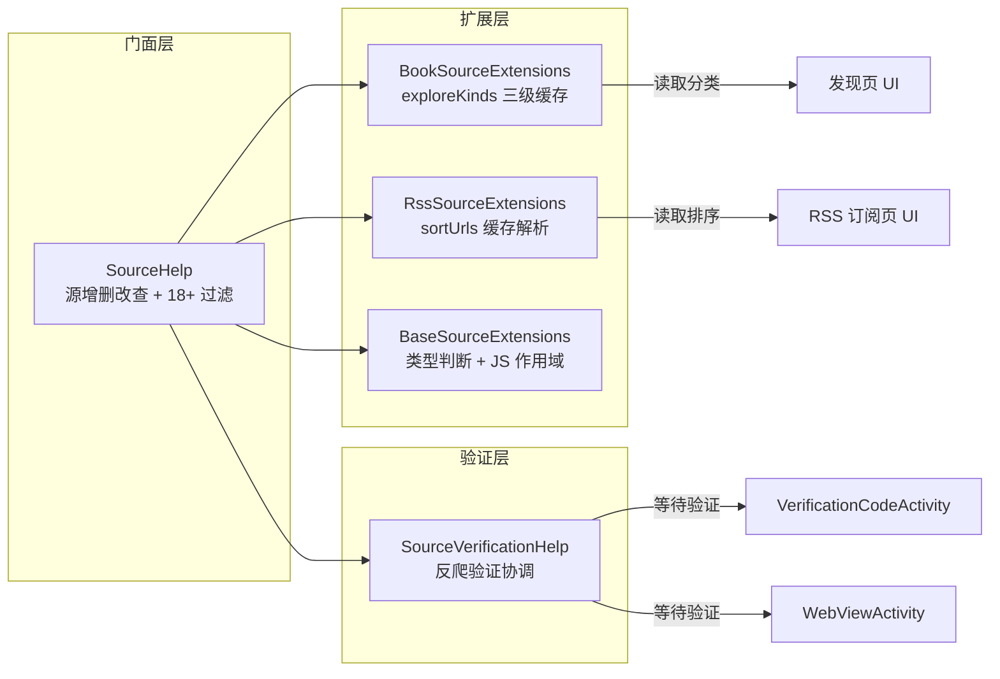
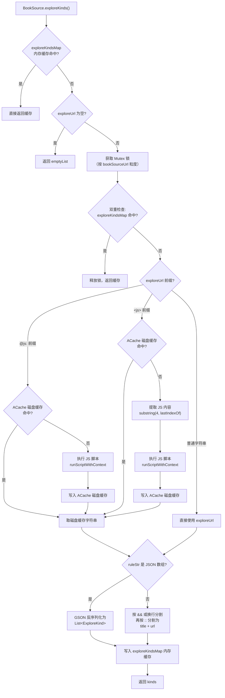
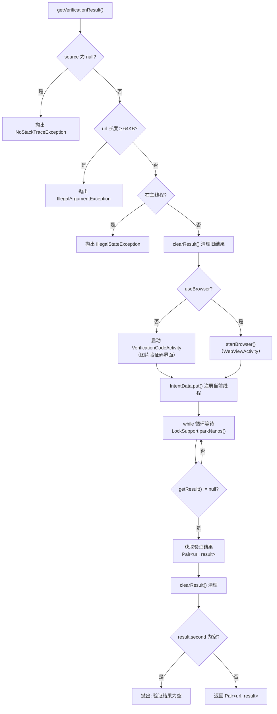

# 源辅助与扩展

> **核心问题**：Legado 的书源和 RSS 源在运行时需要大量扩展能力——分类发现（exploreKinds）、排序地址解析（sortUrls）、18+ 过滤、源验证（验证码/浏览器反爬）、源类型判断等，这些逻辑分散在多个文件中，且部分需要跨线程协调（如验证码等待用户输入）。
>
> **答案**：`SourceHelp` 作为门面统一源增删改查与 18+ 过滤；`BookSourceExtensions` 和 `RssSourceExtensions` 以 Kotlin 扩展函数形式为 `BookSource` / `RssSource` 实例注入分类/排序解析能力，采用三级缓存（内存 ConcurrentHashMap → ACache 磁盘 → 网络请求 + JS 执行）；`SourceVerificationHelp` 通过 `LockSupport.parkNanos` 实现跨线程验证结果等待；`BaseSourceExtensions` 提供源类型的统一判断。

---

## 1. 模块全景



---

## 2. exploreKinds 三级缓存读取流程

[BookSourceExtensions.kt](file:///f:/myself/github/WeAgentChat/temp/legado/app/src/main/java/io/legado/app/help/source/BookSourceExtensions.kt#L43)



### 缓存层级说明

| 层级 | 存储 | Key 生成 | 失效条件 |
|------|------|----------|----------|
| **L1 内存** | `exploreKindsMap: ConcurrentHashMap<String, List<ExploreKind>>` (L28) | `MD5(bookSourceUrl + exploreUrl)` (L31-L33) | 进程退出或调用 `clearExploreKindsCache()` |
| **L2 磁盘** | `ACache.get("explore")` (L29) | 同 L1 的 MD5 key | 调用 `clearExploreKindsCache()` 时 `aCache.remove()` |
| **L3 网络/JS** | `runScriptWithContext { evalJS(...) }` (L62-L66, L76-L79) | 无缓存 key | 每次执行后写入 L2 |

### 并发安全

- 每个书源 URL 持有独立的 `Mutex`（`mutexMap` L27），按 `bookSourceUrl` 粒度加锁
- 双重检查锁定模式：获取锁后再查一次内存缓存，避免重复计算
- JS 执行在 `Dispatchers.IO` 上进行（L54）

### 缓存 Key 设计

```kotlin
// BookSourceExtensions.kt L31-L33
private fun BookSource.getExploreKindsKey(): String {
    return MD5Utils.md5Encode(bookSourceUrl + exploreUrl)
}
```

Key 包含 `exploreUrl` 本身，意味着修改 `exploreUrl` 字段后旧缓存自动失效（MD5 不同），无需手动刷新。

---

## 3. BookSourceExtensions 与 RssSourceExtensions 对比

| 维度 | BookSourceExtensions | RssSourceExtensions |
|------|---------------------|---------------------|
| 源文件 | [BookSourceExtensions.kt](file:///f:/myself/github/WeAgentChat/temp/legado/app/src/main/java/io/legado/app/help/source/BookSourceExtensions.kt#L1) | [RssSourceExtensions.kt](file:///f:/myself/github/WeAgentChat/temp/legado/app/src/main/java/io/legado/app/help/source/RssSourceExtensions.kt#L1) |
| 总行数 | 138 行 | 58 行 |
| 扩展对象 | `BookSource` / `BookSourcePart` | `RssSource` |
| 核心函数 | `exploreKinds()` (L43) | `sortUrls()` (L17) |
| 返回类型 | `List<ExploreKind>` | `List<Pair<String, String>>` |
| 缓存 Key | `MD5(bookSourceUrl + exploreUrl)` (L31) | `MD5(sourceUrl + sortUrl)` (L13) |
| 内存缓存 | `ConcurrentHashMap<String, List<ExploreKind>>` (L28) | 无（每次读取 ACache 磁盘缓存） |
| 磁盘缓存 | `ACache.get("explore")` (L29) | `ACache.get("rssSortUrl")` (L11) |
| 并发保护 | `Mutex` 按书源 URL 粒度 (L27, L50) | 无 |
| JS 前缀支持 | `@js:` 和 `<js>` (L57-L84) | `@js:` 和 `<js>` (L23-L35) |
| JS 作用域注入 | 注入 `infoMap` (L59, L73) | 无额外注入 |
| JSON 数组解析 | 支持 `isJsonArray()` → `GSON.fromJsonArray<ExploreKind>()` (L87-L89) | 无（仅支持 `&&`/换行分割 + `::` 分割格式） |
| 缓存清理 | `clearExploreKindsCache()` (L107-L121) | `removeSortCache()` (L54-L57) |
| 附加功能 | `exploreKindsJson()` (L123-L128)、`getBookType()` (L130-L138) | 无 |
| 默认值 | `exploreUrl` 为空返回 `emptyList()` (L47-L49) | 解析结果为空返回 `Pair("", sourceUrl)` (L46-L48) |

### 数据格式差异

**BookSource exploreUrl 格式**（L87-L95）：

```
# JSON 数组格式
[{"title":"玄幻","url":"https://..."}`]

# 分割格式
玄幻::https://...&&武侠::https://...
```

**RssSource sortUrl 格式**（L39-L44）：

```
# 仅支持分割格式
科技::https://...&&财经::https://...
```

### getBookType 映射

[BookSourceExtensions.kt](file:///f:/myself/github/WeAgentChat/temp/legado/app/src/main/java/io/legado/app/help/source/BookSourceExtensions.kt#L130)

```kotlin
// L130-L138
fun BookSource.getBookType(): Int {
    return when (bookSourceType) {
        BookSourceType.file -> BookType.text or BookType.webFile
        BookSourceType.image -> BookType.image
        BookSourceType.audio -> BookType.audio
        BookSourceType.video -> BookType.video
        else -> BookType.text
    }
}
```

| bookSourceType | 返回 BookType | 说明 |
|----------------|--------------|------|
| `file` | `text or webFile` | 本地文件，同时标记为文本和网页文件 |
| `image` | `image` | 图片（漫画） |
| `audio` | `audio` | 有声书 |
| `video` | `video` | 视频 |
| 其他 | `text` | 默认文本 |

---

## 4. SourceHelp 门面详解

[SourceHelp.kt](file:///f:/myself/github/WeAgentChat/temp/legado/app/src/main/java/io/legado/app/help/source/SourceHelp.kt#L29)

### 4.1 18+ 过滤机制

```kotlin
// L31-L39
private val list18Plus by lazy {
    String(appCtx.assets.open("18PlusList.txt").readBytes())
        .splitNotBlank("\n").map {
            EncoderUtils.base64Decode(it)
        }.toHashSet()
}
```

- 启动时从 `assets/18PlusList.txt` 加载 Base64 编码的域名列表
- 解码后存入 `HashSet` 用于 O(1) 查询
- 导入书源/RSS 源时检查 URL 是否在黑名单中，命中则 toast 提示并拒绝导入（L129-L154）

### 4.2 源查询优化

```kotlin
// L42-L55
fun getSource(key: String?): BaseSource? {
    key ?: return null
    if (ReadBook.bookSource?.bookSourceUrl == key) return ReadBook.bookSource
    if (AudioPlay.bookSource?.bookSourceUrl == key) return AudioPlay.bookSource
    if (ReadManga.bookSource?.bookSourceUrl == key) return ReadManga.bookSource
    if (VideoPlay.source?.getKey() == key) return VideoPlay.source
    return appDb.bookSourceDao.getBookSource(key)
        ?: appDb.rssSourceDao.getByKey(key)
}
```

查询顺序：当前使用中的全局单例（ReadBook/AudioPlay/ReadManga/VideoPlay） → 数据库。避免频繁数据库查询。

### 4.3 删除操作的级联清理

| 操作 | 数据库删除 | 级联清理 |
|------|-----------|---------|
| `deleteBookSourceInternal()` (L91-L95) | `bookSourceDao.delete(key)` | `cacheDao.deleteSourceVariables(key)` + `SourceConfig.removeSource(key)` |
| `deleteRssSourceInternal()` (L111-L115) | `rssSourceDao.delete(key)` | `rssArticleDao.delete(key)` + `cacheDao.deleteSourceVariables(key)` |
| 批量删除 | `appDb.runInTransaction { ... }` | 事务完成后统一 `AppCacheManager.clearSourceVariables()` |

### 4.4 排序序号调整

```kotlin
// L174-L186
fun adjustSortNumber() {
    if (appDb.bookSourceDao.maxOrder > 99999
        || appDb.bookSourceDao.minOrder < -99999
        || appDb.bookSourceDao.hasDuplicateOrder
    ) {
        val sources = appDb.bookSourceDao.allPart
        sources.forEachIndexed { index, bookSource ->
            bookSource.customOrder = index
        }
        appDb.bookSourceDao.upOrder(sources)
    }
}
```

当排序号溢出（>99999 或 <-99999）或出现重复序号时，重新编号为连续整数。仅在 `insertBookSource()` 后异步执行（L151-L153）。

### 4.5 视频播放器启动

[SourceHelp.kt](file:///f:/myself/github/WeAgentChat/temp/legado/app/src/main/java/io/legado/app/help/source/SourceHelp.kt#L188)

`openVideoPlayer()` 方法根据 `isFloat` 参数选择两种启动模式：
- 浮窗模式：启动 `VideoPlayService` 前台服务（L189-L196）
- 全屏模式：启动 `VideoPlayerActivity`（L198-L204）

---

## 5. SourceVerificationHelp 校验流程

[SourceVerificationHelp.kt](file:///f:/myself/github/WeAgentChat/temp/legado/app/src/main/java/io/legado/app/help/source/SourceVerificationHelp.kt#L19)



### 核心机制

| 机制 | 实现 | 行号 |
|------|------|------|
| 线程阻塞等待 | `LockSupport.parkNanos(this, waitTime)` 循环等待 | L60-L67 |
| 等待超时间隔 | `1.minutes.inWholeNanoseconds`（1 分钟的纳秒值） | L21 |
| 线程唤醒 | `LockSupport.unpark(thread)` 由 `checkResult()` 调用 | L102-L106 |
| 结果存储 | `CacheManager.putMemory()` 内存级缓存 | L108-L110 |
| 线程注册 | `IntentData.put(key, Thread.currentThread())` 将当前线程注册到临时数据 | L54, L97 |

### 校验入口选择

| 场景 | 入口 | 说明 |
|------|------|------|
| 图片验证码 | `VerificationCodeActivity` (L49-L55) | `useBrowser=false`，显示验证码图片 |
| 浏览器反爬 | `WebViewActivity` (L57) | `useBrowser=true`，打开内置浏览器 |
| 主动提交结果 | `setResult()` (L108-L110) | 由 Activity 回调写入 |
| 检查/默认结果 | `checkResult()` (L102-L106) | 无结果时设为空字符串并唤醒线程 |

### 安全前置检查

```kotlin
// L41-L44
source ?: throw NoStackTraceException("source cannot be null")
require(url.length < 64 * 1024) { "url too long" }
check(!isMainThread) { "must be called on a background thread" }
```

三项检查确保：源非空、URL 不会导致 Intent 数据溢出、不会阻塞主线程。

---

## 6. BaseSourceExtensions 统一类型判断

[BaseSourceExtensions.kt](file:///f:/myself/github/WeAgentChat/temp/legado/app/src/main/java/io/legado/app/help/source/BaseSourceExtensions.kt#L1)

```kotlin
// L11-L13
fun BaseSource.getShareScope(coroutineContext: CoroutineContext? = null): Scriptable? {
    return SharedJsScope.getScope(jsLib, coroutineContext)
}

// L15-L20
fun BaseSource.getSourceType(): Int {
    return when (this) {
        is BookSource -> SourceType.book
        is RssSource -> SourceType.rss
        else -> error("unknown source type: ${this::class.simpleName}.")
    }
}
```

| 函数 | 作用 | 行号 |
|------|------|------|
| `getShareScope()` | 获取 JS 共享作用域，基于源的 `jsLib` 字段创建/复用 `Scriptable` | L11-L13 |
| `getSourceType()` | 将运行时类型映射为 `SourceType` 常量（book=0 / rss=1） | L15-L20 |

这两个扩展函数定义在 `BaseSource` 上，`BookSource` 和 `RssSource` 均可调用，实现统一的类型判断和 JS 作用域获取。

---

## 7. 源文件索引

| 文件 | 行数 | 职责 |
|------|------|------|
| [SourceHelp.kt](file:///f:/myself/github/WeAgentChat/temp/legado/app/src/main/java/io/legado/app/help/source/SourceHelp.kt#L1) | 207 行 | 源门面：增删改查、18+ 过滤、排序调整、视频播放器启动 |
| [SourceVerificationHelp.kt](file:///f:/myself/github/WeAgentChat/temp/legado/app/src/main/java/io/legado/app/help/source/SourceVerificationHelp.kt#L1) | 124 行 | 反爬验证协调：跨线程等待用户输入、浏览器/验证码启动 |
| [BookSourceExtensions.kt](file:///f:/myself/github/WeAgentChat/temp/legado/app/src/main/java/io/legado/app/help/source/BookSourceExtensions.kt#L1) | 138 行 | 书源扩展：exploreKinds 三级缓存、getBookType 映射 |
| [RssSourceExtensions.kt](file:///f:/myself/github/WeAgentChat/temp/legado/app/src/main/java/io/legado/app/help/source/RssSourceExtensions.kt#L1) | 58 行 | RSS 源扩展：sortUrls 磁盘缓存解析 |
| [BaseSourceExtensions.kt](file:///f:/myself/github/WeAgentChat/temp/legado/app/src/main/java/io/legado/app/help/source/BaseSourceExtensions.kt#L1) | 21 行 | 基础源扩展：类型判断、JS 共享作用域 |

### 关键行号速查

| 元素 | 文件 | 行号 |
|------|------|------|
| `SourceHelp` 对象定义 | SourceHelp.kt | L29 |
| `list18Plus` 懒加载 | SourceHelp.kt | L31-L39 |
| `getSource(key)` | SourceHelp.kt | L42-L55 |
| `getSource(key, type)` | SourceHelp.kt | L57-L64 |
| `deleteBookSourceInternal()` | SourceHelp.kt | L91-L95 |
| `deleteRssSourceInternal()` | SourceHelp.kt | L111-L115 |
| `insertBookSource()` + 18+ 过滤 | SourceHelp.kt | L141-L154 |
| `is18Plus()` | SourceHelp.kt | L156-L169 |
| `adjustSortNumber()` | SourceHelp.kt | L174-L186 |
| `openVideoPlayer()` | SourceHelp.kt | L188-L205 |
| `SourceVerificationHelp` 对象定义 | SourceVerificationHelp.kt | L19 |
| `getVerificationResult()` | SourceVerificationHelp.kt | L32-L72 |
| `startBrowser()` | SourceVerificationHelp.kt | L78-L99 |
| `checkResult()` | SourceVerificationHelp.kt | L102-L106 |
| `setResult()` / `getResult()` | SourceVerificationHelp.kt | L108-L119 |
| `exploreKindsMap` 内存缓存 | BookSourceExtensions.kt | L28 |
| `aCache` 磁盘缓存 | BookSourceExtensions.kt | L29 |
| `BookSource.exploreKinds()` | BookSourceExtensions.kt | L43-L105 |
| `BookSource.clearExploreKindsCache()` | BookSourceExtensions.kt | L115-L121 |
| `BookSource.exploreKindsJson()` | BookSourceExtensions.kt | L123-L128 |
| `BookSource.getBookType()` | BookSourceExtensions.kt | L130-L138 |
| `RssSource.sortUrls()` | RssSourceExtensions.kt | L17-L52 |
| `RssSource.removeSortCache()` | RssSourceExtensions.kt | L54-L57 |
| `BaseSource.getShareScope()` | BaseSourceExtensions.kt | L11-L13 |
| `BaseSource.getSourceType()` | BaseSourceExtensions.kt | L15-L20 |
