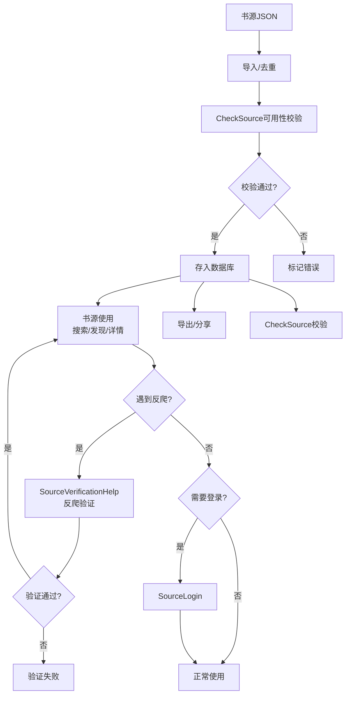
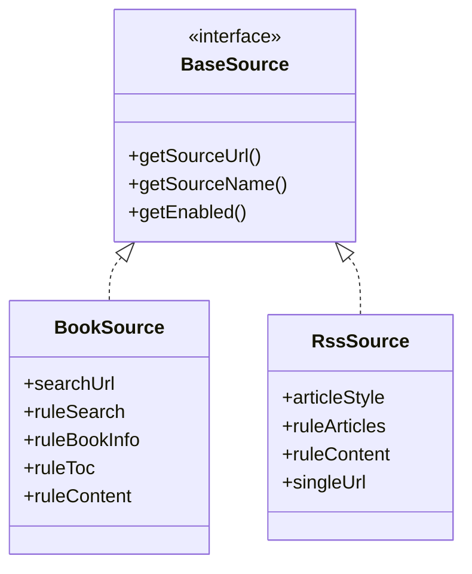

# 书源管理全链路

> **核心问题**：书源从哪里来？如何导入/导出/检验/调试？登录态如何管理？
> **答案**：完整的书源生命周期——网络导入(jsonURL) / 本地导入(JSON文件) / 订阅更新(RuleUpdate) / 检验(CheckSource) / 调试(Debug) / 导出(Backup) / 登录(SourceLogin)。

---

## 1. 生命周期全景

### 书源生命周期流程图



### 生命周期文本描述

```
    网络 URL 导入 ──┐
    本地文件导入 ──┤
    订阅源自动更新 ──┤──→ SourceHelp.insertBookSource()
    QR 码扫描导入 ──┤              │
    分享下载导入 ──┘              ▼
                        BookSourceDao.upsert()
                                  │
                        ┌────┬────┼────┬────┐
                        ▼    ▼    ▼    ▼    ▼
                    启用/禁用 编辑 检验 调试 删除
                       │    │    │    │    │
                       ▼    ▼    ▼    ▼    ▼
                  SourceHelp.updateBookSource() / deleteBookSource()
```

---

## 2. SourceHelp — 书源工具类

**文件**：[SourceHelp.kt](file:///f:/myself/github/WeAgentChat/temp/legado/app/src/main/java/io/legado/app/help/source/SourceHelp.kt)

### 全局方法

```kotlin
object SourceHelp {
    // 查询
    fun getSource(key: String?): BaseSource?           // 从DB → ReadBook → AudioPlay → ReadManga → VideoPlay
    
    // 增删
    fun insertBookSource(source: BookSource)            // 插入或覆盖（按 bookSourceUrl）
    fun deleteBookSource(key: String)                   // 删除书源（级联清理关联书籍）
    fun updateBookSource(source: BookSource)            // 更新书源字段

    // 批量
    fun insertBookSources(sources: List<BookSource>)    // 批量导入
    fun importKeepName: Boolean                         // 从 PreferKey.importKeepName
    fun importKeepGroup: Boolean                        // 从 PreferKey.importKeepGroup
    fun importKeepEnable: Boolean                       // 从 PreferKey.importKeepEnable
    
    // 排序
    fun adjustSortNumber()                              // 启动时自动调整 customOrder
    
    // 检查
    val list18Plus: Set<String>                         // 18+ 域名黑名单 (assets/18PlusList.txt)
    fun is18Plus(source: BookSource): Boolean
    fun is18Plus(source: RssSource): Boolean
    fun enable18Plus: Boolean                           // 是否启用 18+ 内容
    
    // 视频播放
    fun openVideoPlayer(source, url, title, isFloat)   // 启动视频播放
}
```

### 书源查询优先级

```kotlin
fun getSource(key: String?): BaseSource? {
    // 1. ReadBook.bookSource (当前阅读的书源)
    // 2. AudioPlay.bookSource (当前音频的书源)
    // 3. ReadManga.bookSource (当前漫画的书源)
    // 4. VideoPlay.source (当前视频的书源)
    // 5. appDb.bookSourceDao.getBookSource(key) (数据库)
    // 6. appDb.rssSourceDao.getByKey(key) (RSS 数据库)
}
```

---

## 3. SourceVerificationHelp — 反爬验证

**文件**：[SourceVerificationHelp.kt](file:///f:/myself/github/WeAgentChat/temp/legado/app/src/main/java/io/legado/app/help/source/SourceVerificationHelp.kt)

> ⚠️ **重要区分**：SourceVerificationHelp 是**反爬验证**（验证码/浏览器验证），不是书源可用性校验。
> 书源可用性校验由 [CheckSource](#35-checksource--书源可用性校验) 负责。

### 核心方法

```kotlin
object SourceVerificationHelp {

    // 获取反爬验证结果（主入口）
    // 处理图片验证码、滑动验证码、点击字符等反爬场景
    @Synchronized
    fun getVerificationResult(
        source: BaseSource?,     // 书源（不能为空）
        url: String,             // 验证码图片URL 或 网页URL
        title: String,           // 页面标题
        useBrowser: Boolean,     // true→打开浏览器验证; false→打开验证码图片弹窗
        refetchAfterSuccess: Boolean = true,  // 验证成功后是否重新获取
        html: String? = null     // 网页源代码
    ): Pair<String, String>      // 返回 (redirectedUrl, body)

    // 启动内置浏览器进行手动验证
    fun startBrowser(
        source: BaseSource?,
        url: String,
        title: String,
        saveResult: Boolean? = false,         // 保存网页源代码
        refetchAfterSuccess: Boolean? = true,
        html: String? = null
    )

    // 用户完成验证后回调，唤醒阻塞线程
    fun checkResult(sourceKey: String)

    // 结果存取（CacheManager 内存缓存）
    fun setResult(sourceKey: String, result: String, url: String = "")
    fun getResult(sourceKey: String): Pair<String, String>?
    fun clearResult(sourceKey: String)
}
```

### 验证流程

```
书源使用中遇到反爬（验证码/浏览器验证）
    │
    ▼
getVerificationResult(source, url, title, useBrowser, ...)
    │
    ├── useBrowser=false → 启动 VerificationCodeActivity（验证码图片弹窗）
    │                      用户输入验证码 → setResult() → checkResult() 唤醒线程
    │
    └── useBrowser=true  → 启动 WebViewActivity（浏览器手动验证）
                           用户完成验证 → setResult() → checkResult() 唤醒线程
    │
    ▼
LockSupport.parkNanos() 阻塞等待用户输入（最长1分钟循环等待）
    │
    ▼
getResult() 获取结果 → 返回 Pair(redirectedUrl, body)
```

### 关键实现细节

- **线程阻塞**：`LockSupport.parkNanos(this, waitTime)` 循环等待，`waitTime = 1分钟`
- **线程唤醒**：`checkResult()` 通过 `LockSupport.unpark(thread)` 唤醒阻塞线程
- **线程传递**：当前线程通过 `IntentData.put()` 传递给 Activity，Activity 完成后取回
- **结果缓存**：使用 `CacheManager` 内存缓存（非持久化），key 格式为 `{sourceKey}_verificationResult`
- **主线程检查**：`check(!isMainThread)`，必须在后台线程调用

---

## 3.5 CheckSource — 书源可用性校验

**文件**：[CheckSource.kt](file:///f:/myself/github/WeAgentChat/temp/legado/app/src/main/java/io/legado/app/model/CheckSource.kt)

> ⚠️ **重要区分**：CheckSource 是**书源可用性校验**（检测各端点是否可用），不是反爬验证。
> 反爬验证由 [SourceVerificationHelp](#3-sourceverificationhelp--反爬验证) 负责。

### SourceVerificationHelp vs CheckSource 对比

| 维度 | SourceVerificationHelp | CheckSource |
|------|----------------------|-------------|
| **用途** | 反爬验证（验证码/浏览器验证） | 书源可用性校验 |
| **触发时机** | 书源使用中遇到反爬拦截时 | 用户主动校验书源时 |
| **验证方式** | 用户手动操作（输入验证码/浏览器验证） | 自动化测试（搜索/发现/详情等） |
| **返回结果** | `Pair<String, String>` (url, body) | 校验状态（有效/无效/异常） |
| **线程模型** | `LockSupport.parkNanos` 阻塞等待用户输入 | 协程异步并发 |
| **结果缓存** | `CacheManager` 内存缓存 | 无缓存，实时校验 |

### 校验流程

```python
async def check_source(book_source: BookSource) -> CheckResult:
    """
    1. 检查 searchUrl 是否为空 → 跳过
    2. 执行搜索 "测试", 页码1
    3. 结果 > 0 → 有效（✅）
    4. 结果 == 0 → 无效（❌）
    5. 网络/解析异常 → 异常（⚠️）
    """
```

### CheckSourceService — 批量校验

```python
class CheckSourceService:
    """
    批量书源校验服务
    - 对每个书源执行搜索测试
    - 统计有效/无效/跳过数量
    - 使用 Semaphore 控制并发
    """
```

### CheckSource 配置项

| 配置 | 默认值 | 说明 |
|------|--------|------|
| `timeout` | 30s | 校验超时 |
| `checkDomain` | false | 检验域名 |
| `checkSearch` | true | 检验搜索 |
| `checkDiscovery` | true | 检验发现 |
| `checkInfo` | true | 检验详情 |
| `checkCategory` | true | 检验目录 |
| `checkContent` | true | 检验正文 |

---

## 4. 书源导入/关联

### UI 入口

| Activity | 作用 |
|----------|------|
| `FileAssociationActivity` | 处理系统文件关联（打开 .json 文件 → 识别类型 → 导入） |
| `OnLineImportActivity` | 在线导入（粘贴 URL → 下载 JSON → 识别 → 导入） |
| `ImportBookSourceDialog` | 书源导入确认对话框（预览书源列表 → 确认导入） |

### BaseAssociationViewModel — 导入基类

[BaseAssociationViewModel.kt](file:///f:/myself/github/WeAgentChat/temp/legado/app/src/main/java/io/legado/app/ui/association/BaseAssociationViewModel.kt)

```kotlin
// 统一导入流程:
1. 接收数据 (content/url/file)
2. 反序列化 (GSON.fromJsonArray)
3. 匹配类型 (BookSource / RssSource / ReplaceRule / HttpTTS / DictRule / Theme / TxtTocRule)
4. 展示导入对话框 (ImportXxxDialog)
5. 用户确认 → SourceHelp.insertXxx()
```

### 导入策略

| 配置项 | 默认值 | 说明 |
|--------|--------|------|
| `importKeepName` | true | 保留已有书源名称 |
| `importKeepGroup` | true | 保留已有分组 |
| `importKeepEnable` | true | 保留已有启用状态 |
| `importShowComment` | true | 导入时显示备注 |

### 导入去重

以 `bookSourceUrl` 为唯一键：
```kotlin
// ImportBookSourceDialog:
sources.forEach { new →
    val exists = appDb.bookSourceDao.getBookSourcePart(new.bookSourceUrl)
    if (exists != null) {
        // 根据 importKeepXxx 策略合并字段
    }
}
```

---

## 5. 书源导出

### 导出途径

1. **Backup 备份** → `bookSource.json` → 压缩到 backup.zip
2. **书源管理界面** → 选中书源 → 分享/导出 JSON
3. **Web API** → `BookSourceController` → `/api/bookSources` 接口

### 导出格式

```json
[
  {
    "bookSourceUrl": "https://example.com",
    "bookSourceName": "示例书源",
    "bookSourceGroup": "小说",
    "bookSourceType": 0,
    "searchUrl": "...",
    "ruleSearch": {...},
    "ruleBookInfo": {...},
    "ruleToc": "...",
    "ruleContent": {...},
    ...
  }
]
```

---

## 6. 书源登录 (SourceLogin)

**目录**：`ui/login/` — 5个文件

### 登录场景

部分书源要求登录后才能读取内容（如 VIP 章节），Legado 支持：
1. **URL 跳转登录**：在 WebView 中打开登录页
2. **JS 注入登录**：注入 JS 自动填写表单
3. **Cookie 持久化**：登录后 Cookie 存入 CookieStore

### SourceLoginActivity

**文件**：[SourceLoginActivity.kt](file:///f:/myself/github/WeAgentChat/temp/legado/app/src/main/java/io/legado/app/ui/login/SourceLoginActivity.kt)

```
SourceLoginActivity(source: BookSource)
    ├── WebView 加载 source.loginUrl
    ├── 注入 SourceLoginJsExtensions (JS→Java 桥接)
    │   ├── loginSuccess(cookie)  → CookieStore 保存
    │   ├── loginFail(msg)        → Toast 提示
    │   └── getLoginInfo(key)     → 读取上次登录数据
    ├── WebChromeClient → 监听页面标题
    └── WebViewClient  → 拦截 URL / 监听加载完成
```

### SourceLoginJsExtensions

登录页 JS 可用方法：

```kotlin
class SourceLoginJsExtensions {
    fun loginSuccess(data: String)       // 登录成功，保存数据(JSON)
    fun loginFail(msg: String)           // 登录失败
    fun getLoginInfo(key: String): String // 获取上次登录信息
    fun sourceInfo(): String              // 获取书源信息 (JSON)
    fun closeActivity()                   // 关闭登录页
}
```

### 登录态持久化

```
source.loginUrl (书源登录URL)
    → SourceLoginActivity
    → JS: java.getLoginInfo("cookies")   // 读取上次
    → WebView 执行登录 (用户手动操作)
    → JS: java.loginSuccess(cookies + token)  // 保存
    → CookieStore.save(origin, cookies)       // 持久化到 Room DB
    → 下次正文请求 → CookieManager.loadRequest()
```

---

## 7. BaseSourceExtensions — 实体扩展

**文件**：[BaseSourceExtensions.kt](file:///f:/myself/github/WeAgentChat/temp/legado/app/src/main/java/io/legado/app/help/source/BaseSourceExtensions.kt)

```kotlin
// BaseSource 的扩展属性/方法
fun BaseSource.getKey(): String                    // bookSourceUrl / sourceUrl
fun BaseSource.getHeaderMap(hasCookie: Boolean)    // 构建请求头 Map
fun BaseSource.getUserAgent(): String?             // 获取自定义 UA
fun BaseSource.getLoginInfo(): String?             // 获取登录信息 (CookieStore)
fun BaseSource.isEnabled(): Boolean                // 是否启用
fun BaseSource.getSourceType(): Int                // 源类型
```

### 请求头构建

```kotlin
fun BaseSource.getHeaderMap(hasCookie: Boolean): Map<String, String> {
    val map = mutableMapOf<String, String>()
    // 1. 书源自定义 header
    this.header?.let { map.putAll(parseHeader(it)) }
    // 2. 书源 Quick LoginInfo
    this.loginInfo?.let { map.putAll(parseHeader(it)) }
    // 3. CookieStore 持久 Cookie
    if (hasCookie) {
        CookieStore.load(this.getKey())?.let { map["Cookie"] = it }
    }
    return map
}
```

---

## 8. BaseSource / BookSource / RssSource 继承关系

### 继承类图



### 文本描述

```
BaseSource (基类)                          ← 公共字段
├── BookSource (书源, Room Entity)          ← 搜索/发现/详情/目录/正文 5组规则
│   └── BookSourcePart (轻量 Part)          ← 仅查询用的部分字段
└── RssSource (RSS源, Room Entity)          ← RSS 解析规则
    └── RssSourcePart (轻量 Part)
```

**BaseSource 公共字段**：
```kotlin
abstract class BaseSource {
    var sourceUrl: String           // 源 URL (主键)
    var sourceName: String          // 源名称
    var sourceGroup: String?        // 源分组
    var enabled: Boolean            // 是否启用
    var enabledExplore: Boolean     // 是否启用发现
    var lastUpdateTime: Long        // 最后更新时间
    var header: String?             // 自定义请求头 (JSON)
    var loginUrl: String?           // 登录 URL
    var loginUi: String?            // 登录 UI 配置 (JSON)
    var loginCheckJs: String?       // 登录检查 JS
    var comment: String?            // 备注/注释
}
```

---

## 9. 书源排序体系

```kotlin
// BookSource.customOrder — 用户拖拽排序
// SourceHelp.adjustSortNumber() — 启动时自动填充空 customOrder

fun adjustSortNumber() {
    // 未设排序号的书源 → 按数据库插入顺序分配初始序号
    // 已设排序号的书源 → 不覆盖
}
```

书源排序支持：
- 用户自定义拖拽排序（`customOrder` 字段）
- 按名称/更新时间/评分（`SourceConfig`）
- 分组展示（`bookSourceGroup`）

---

## 10. 18+ 内容过滤

```kotlin
// assets/18PlusList.txt
// 每行 Base64 编码的域名
// 解码后构建为 HashSet<String>

fun is18Plus(source: BookSource): Boolean {
    return list18Plus.contains(UrlUtil.getDomain(source.bookSourceUrl))
}

// AppConfig.enable18Plus → 是否允许 18+ 内容
// 禁用时 → 过滤搜索结果 / 不在发现页展示
```