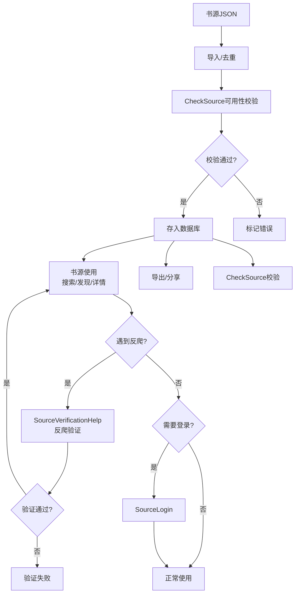
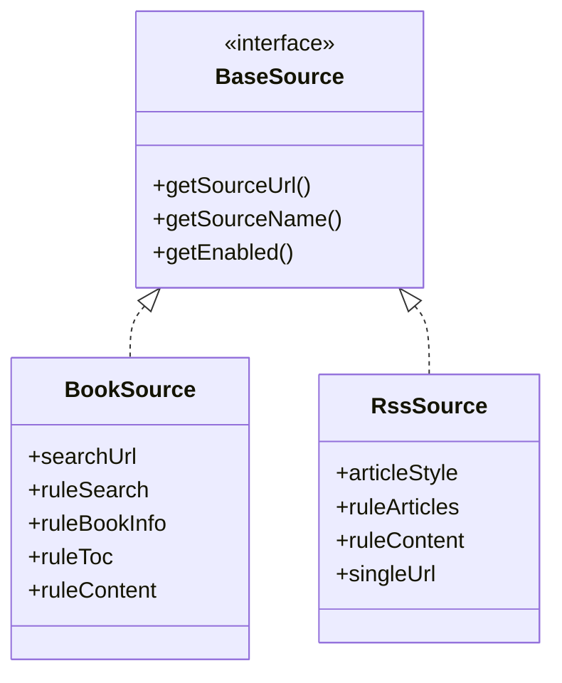

# 书源管理全链路

> **权威声明**：本文档为书源/订阅源扩展的**唯一权威文档**，已吸收原 source-extensions.md 全部内容（该文件已删除）。文中行数与行号均基于源码实测。
>
> **核心问题**：书源从哪里来？如何导入/导出/检验/调试？登录态如何管理？
> **答案**：完整的书源生命周期——网络导入(jsonURL) / 本地导入(JSON文件) / 订阅更新(RuleUpdate) / 检验(CheckSource) / 调试(Debug) / 导出(Backup) / 登录(SourceLogin)。

---

## 1. 生命周期全景

### 书源生命周期流程图



### 生命周期文本描述

```
    网络 URL 导入 ──┐
    本地文件导入 ──┤
    订阅源自动更新 ──┤──→ SourceHelp.insertBookSource()
    QR 码扫描导入 ──┤              │
    分享下载导入 ──┘              ▼
                        BookSourceDao.upsert()
                                  │
                        ┌────┬────┼────┬────┐
                        ▼    ▼    ▼    ▼    ▼
                    启用/禁用 编辑 检验 调试 删除
                       │    │    │    │    │
                       ▼    ▼    ▼    ▼    ▼
                  SourceHelp.updateBookSource() / deleteBookSource()
```

---

## 2. SourceHelp — 书源工具类（实测 260 行）

**文件**：[SourceHelp.kt](file:///f:/myself/github/WeAgentChat/temp/legado/app/src/main/java/io/legado/app/help/source/SourceHelp.kt)

### 全局方法（实测 L30-258）

```kotlin
object SourceHelp {
    // BookSource 内存缓存（L54，LruCache 上限 50）
    fun getCachedBookSource(key: String): BookSource?      // L60 读缓存（BackstageWebView 主线程场景）
    fun putBookSourceCache(key: String, source: BookSource) // L66 写缓存
    fun removeBookSourceCache(key: String)                  // L73 删缓存（删源时调用）

    // 查询（先全局单例后 DB）
    fun getSource(key: String?): BaseSource?                // L77-90
    fun getSource(key: String?, type: Int): BaseSource?     // L92-99 按类型直查 DB
    fun deleteSource(key: String, type: Int)                // L101-106 按类型分发删除

    // 删除（含 B7 回收站 + 限流记录清理）
    fun deleteBookSource(key: String)                       // L141-144
    fun deleteBookSources(sources: List<BookSource>)        // L117-124 事务批量
    fun deleteBookSourceParts(sources: List<BookSourcePart>) // L108-115 事务批量
    fun deleteRssSource(key: String)                        // L169-172
    fun deleteRssSources(sources: List<RssSource>)          // L146-153 事务批量

    // 启用 / 插入（18+ 过滤）
    fun enableSource(key: String, type: Int, enable: Boolean) // L174-179
    fun insertBookSource(vararg bookSources: BookSource)      // L193-207 18+过滤→插入→写缓存→异步调序
    fun insertRssSource(vararg rssSources: RssSource)         // L181-191 18+过滤→插入

    // 排序 / 视频
    fun adjustSortNumber()                                  // L227-239 序号溢出/重复时重排
    fun openVideoPlayer(source, url, title, isFloat)        // L241-258 浮窗走 VideoPlayService / 全屏走 Activity
}
```

> 18+ 检测入口为**私有** `is18Plus(url: String?)`（L209-222），基于 `list18Plus` 黑名单（assets/18PlusList.txt，Base64 域名，L32-41，加载失败回退 emptySet）。
> `enable18Plus` 开关在 `AppConfig`，不在本类；`importKeepName/importKeepGroup/importKeepEnable` 导入策略由导入对话框与 ViewModel 处理，不在本类。

### BookSource 内存缓存（L43-75）

- `bookSourceCache: LruCache<String, BookSource>(50)`（L54）：为 `BackstageWebView.load()` 主线程 `runBlocking` 查库场景优化，先读内存缓存，未命中再走数据库
- 缓存一致性：`insertBookSource` 写入（L202）、`deleteBookSourceInternal` 删除（L133）；书源编辑后需走 `insertBookSource` 刷新缓存
- 已知上限：50 个 BookSource 约 250KB 内存（每个约 5KB）| 升级路径：内存紧张可降至 20

### 书源查询优先级

```kotlin
fun getSource(key: String?): BaseSource? {
    // 1. ReadBook.bookSource (当前阅读的书源)
    // 2. AudioPlay.bookSource (当前音频的书源)
    // 3. ReadManga.bookSource (当前漫画的书源)
    // 4. VideoPlay.source (当前视频的书源)
    // 5. appDb.bookSourceDao.getBookSource(key) (数据库)
    // 6. appDb.rssSourceDao.getByKey(key) (RSS 数据库)
}
```

### 删除级联清理（L126-167）

| 操作 | 回收站（B7） | 数据库删除 | 级联清理 |
|------|-----------|---------|---------|
| `deleteBookSourceInternal()`（L126-139） | `SourceRecycleBinHelp.recycleBookSources()`（runCatching 包裹，开关关/异常不阻断删除） | `bookSourceDao.delete(key)` | `removeBookSourceCache` + `cacheDao.deleteSourceVariables` + `SourceConfig.removeSource` + `ConcurrentRateLimiter.clearRecord`（F-P1-C4 防内存泄漏） |
| `deleteRssSourceInternal()`（L155-167） | `SourceRecycleBinHelp.recycleRssSources()` | `rssSourceDao.delete(key)` | `rssArticleDao.delete` + `cacheDao.deleteSourceVariables` + `ConcurrentRateLimiter.clearRecord` |
| 批量删除（L108-124/L146-153） | — | `appDb.runInTransaction { ... }` | 事务完成后统一 `AppCacheManager.clearSourceVariables()` |

---

## 3. SourceVerificationHelp — 反爬验证

**文件**：[SourceVerificationHelp.kt](file:///f:/myself/github/WeAgentChat/temp/legado/app/src/main/java/io/legado/app/help/source/SourceVerificationHelp.kt)

> ⚠️ **重要区分**：SourceVerificationHelp 是**反爬验证**（验证码/浏览器验证），不是书源可用性校验。
> 书源可用性校验由 [CheckSource](#35-checksource--书源可用性校验) 负责。

### 核心方法

```kotlin
object SourceVerificationHelp {

    // 获取反爬验证结果（主入口）
    // 处理图片验证码、滑动验证码、点击字符等反爬场景
    @Synchronized
    fun getVerificationResult(
        source: BaseSource?,     // 书源（不能为空）
        url: String,             // 验证码图片URL 或 网页URL
        title: String,           // 页面标题
        useBrowser: Boolean,     // true→打开浏览器验证; false→打开验证码图片弹窗
        refetchAfterSuccess: Boolean = true,  // 验证成功后是否重新获取
        html: String? = null     // 网页源代码
    ): Pair<String, String>      // 返回 (redirectedUrl, body)

    // 启动内置浏览器进行手动验证
    fun startBrowser(
        source: BaseSource?,
        url: String,
        title: String,
        saveResult: Boolean? = false,         // 保存网页源代码
        refetchAfterSuccess: Boolean? = true,
        html: String? = null
    )

    // 用户完成验证后回调，唤醒阻塞线程
    fun checkResult(sourceKey: String)

    // 结果存取（CacheManager 内存缓存）
    fun setResult(sourceKey: String, result: String, url: String = "")
    fun getResult(sourceKey: String): Pair<String, String>?
    fun clearResult(sourceKey: String)
}
```

### 验证流程

```
书源使用中遇到反爬（验证码/浏览器验证）
    │
    ▼
getVerificationResult(source, url, title, useBrowser, ...)
    │
    ├── useBrowser=false → 启动 VerificationCodeActivity（验证码图片弹窗）
    │                      用户输入验证码 → setResult() → checkResult() 唤醒线程
    │
    └── useBrowser=true  → 启动 WebViewActivity（浏览器手动验证）
                           用户完成验证 → setResult() → checkResult() 唤醒线程
    │
    ▼
LockSupport.parkNanos() 阻塞等待用户输入（最长1分钟循环等待）
    │
    ▼
getResult() 获取结果 → 返回 Pair(redirectedUrl, body)
```

### 关键实现细节

- **线程阻塞**：`LockSupport.parkNanos(this, waitTime)` 循环等待，`waitTime = 1分钟`
- **线程唤醒**：`checkResult()` 通过 `LockSupport.unpark(thread)` 唤醒阻塞线程
- **线程传递**：当前线程通过 `IntentData.put()` 传递给 Activity，Activity 完成后取回
- **结果缓存**：使用 `CacheManager` 内存缓存（非持久化），key 格式为 `{sourceKey}_verificationResult`
- **主线程检查**：`check(!isMainThread)`，必须在后台线程调用

---

## 3.5 CheckSource — 书源可用性校验

**文件**：[CheckSource.kt](file:///f:/myself/github/WeAgentChat/temp/legado/app/src/main/java/io/legado/app/model/CheckSource.kt)

> ⚠️ **重要区分**：CheckSource 是**书源可用性校验**（检测各端点是否可用），不是反爬验证。
> 反爬验证由 [SourceVerificationHelp](#3-sourceverificationhelp--反爬验证) 负责。

### SourceVerificationHelp vs CheckSource 对比

| 维度 | SourceVerificationHelp | CheckSource |
|------|----------------------|-------------|
| **用途** | 反爬验证（验证码/浏览器验证） | 书源可用性校验 |
| **触发时机** | 书源使用中遇到反爬拦截时 | 用户主动校验书源时 |
| **验证方式** | 用户手动操作（输入验证码/浏览器验证） | 自动化测试（搜索/发现/详情等） |
| **返回结果** | `Pair<String, String>` (url, body) | 校验状态（有效/无效/异常） |
| **线程模型** | `LockSupport.parkNanos` 阻塞等待用户输入 | 协程异步并发 |
| **结果缓存** | `CacheManager` 内存缓存 | 无缓存，实时校验 |

### 校验流程

```python
async def check_source(book_source: BookSource) -> CheckResult:
    """
    1. 检查 searchUrl 是否为空 → 跳过
    2. 执行搜索 "测试", 页码1
    3. 结果 > 0 → 有效（✅）
    4. 结果 == 0 → 无效（❌）
    5. 网络/解析异常 → 异常（⚠️）
    """
```

### CheckSourceService — 批量校验

```python
class CheckSourceService:
    """
    批量书源校验服务
    - 对每个书源执行搜索测试
    - 统计有效/无效/跳过数量
    - 使用 Semaphore 控制并发
    """
```

### CheckSource 配置项

| 配置 | 默认值 | 说明 |
|------|--------|------|
| `timeout` | 30s | 校验超时 |
| `checkDomain` | false | 检验域名 |
| `checkSearch` | true | 检验搜索 |
| `checkDiscovery` | true | 检验发现 |
| `checkInfo` | true | 检验详情 |
| `checkCategory` | true | 检验目录 |
| `checkContent` | true | 检验正文 |

---

## 4. 书源导入/关联

### UI 入口

| Activity | 作用 |
|----------|------|
| `FileAssociationActivity` | 处理系统文件关联（打开 .json 文件 → 识别类型 → 导入） |
| `OnLineImportActivity` | 在线导入（粘贴 URL → 下载 JSON → 识别 → 导入） |
| `ImportBookSourceDialog` | 书源导入确认对话框（预览书源列表 → 确认导入） |

### BaseAssociationViewModel — 导入基类

[BaseAssociationViewModel.kt](file:///f:/myself/github/WeAgentChat/temp/legado/app/src/main/java/io/legado/app/ui/association/BaseAssociationViewModel.kt)

```kotlin
// 统一导入流程:
1. 接收数据 (content/url/file)
2. 反序列化 (GSON.fromJsonArray)
3. 匹配类型 (BookSource / RssSource / ReplaceRule / HttpTTS / DictRule / Theme / TxtTocRule)
4. 展示导入对话框 (ImportXxxDialog)
5. 用户确认 → SourceHelp.insertXxx()
```

### 导入策略

| 配置项 | 默认值 | 说明 |
|--------|--------|------|
| `importKeepName` | true | 保留已有书源名称 |
| `importKeepGroup` | true | 保留已有分组 |
| `importKeepEnable` | true | 保留已有启用状态 |
| `importShowComment` | true | 导入时显示备注 |

### 导入去重

以 `bookSourceUrl` 为唯一键：
```kotlin
// ImportBookSourceDialog:
sources.forEach { new →
    val exists = appDb.bookSourceDao.getBookSourcePart(new.bookSourceUrl)
    if (exists != null) {
        // 根据 importKeepXxx 策略合并字段
    }
}
```

---

## 5. 书源导出

### 导出途径

1. **Backup 备份** → `bookSource.json` → 压缩到 backup.zip
2. **书源管理界面** → 选中书源 → 分享/导出 JSON
3. **Web API** → `BookSourceController` → `/api/bookSources` 接口

### 导出格式

```json
[
  {
    "bookSourceUrl": "https://example.com",
    "bookSourceName": "示例书源",
    "bookSourceGroup": "小说",
    "bookSourceType": 0,
    "searchUrl": "...",
    "ruleSearch": {...},
    "ruleBookInfo": {...},
    "ruleToc": "...",
    "ruleContent": {...},
    ...
  }
]
```

---

## 6. 书源登录 (SourceLogin)

**目录**：`ui/login/` — 5个文件

### 登录场景

部分书源要求登录后才能读取内容（如 VIP 章节），Legado 支持：
1. **URL 跳转登录**：在 WebView 中打开登录页
2. **JS 注入登录**：注入 JS 自动填写表单
3. **Cookie 持久化**：登录后 Cookie 存入 CookieStore

### SourceLoginActivity

**文件**：[SourceLoginActivity.kt](file:///f:/myself/github/WeAgentChat/temp/legado/app/src/main/java/io/legado/app/ui/login/SourceLoginActivity.kt)

```
SourceLoginActivity(source: BookSource)
    ├── WebView 加载 source.loginUrl
    ├── 注入 SourceLoginJsExtensions (JS→Java 桥接)
    │   ├── loginSuccess(cookie)  → CookieStore 保存
    │   ├── loginFail(msg)        → Toast 提示
    │   └── getLoginInfo(key)     → 读取上次登录数据
    ├── WebChromeClient → 监听页面标题
    └── WebViewClient  → 拦截 URL / 监听加载完成
```

### SourceLoginJsExtensions

登录页 JS 可用方法：

```kotlin
class SourceLoginJsExtensions {
    fun loginSuccess(data: String)       // 登录成功，保存数据(JSON)
    fun loginFail(msg: String)           // 登录失败
    fun getLoginInfo(key: String): String // 获取上次登录信息
    fun sourceInfo(): String              // 获取书源信息 (JSON)
    fun closeActivity()                   // 关闭登录页
}
```

### 登录态持久化

```
source.loginUrl (书源登录URL)
    → SourceLoginActivity
    → JS: java.getLoginInfo("cookies")   // 读取上次
    → WebView 执行登录 (用户手动操作)
    → JS: java.loginSuccess(cookies + token)  // 保存
    → CookieStore.save(origin, cookies)       // 持久化到 Room DB
    → 下次正文请求 → CookieManager.loadRequest()
```

---

## 7. BaseSourceExtensions — 基础源扩展（实测 22 行）

**文件**：[BaseSourceExtensions.kt](file:///f:/myself/github/WeAgentChat/temp/legado/app/src/main/java/io/legado/app/help/source/BaseSourceExtensions.kt)

```kotlin
// L11-14：JS 共享作用域（jsLib 为空时回退加密作用域）
fun BaseSource.getShareScope(coroutineContext: CoroutineContext? = null): Scriptable? {
    return SharedJsScope.getScope(jsLib, coroutineContext)
        ?: if (jsLib.isNullOrBlank()) SharedJsScope.getCryptoScope(coroutineContext) else null
}

// L16-22：运行时类型 → SourceType 常量（book=0 / rss=1）
fun BaseSource.getSourceType(): Int {
    return when (this) {
        is BookSource -> SourceType.book
        is RssSource -> SourceType.rss
        else -> error("unknown source type: ${this::class.simpleName}.")
    }
}
```

> ⚠️ **归属澄清**：`getKey` / `getHeaderMap` / `getLoginInfo` 等**不是**本文件扩展函数，而是 `interface BaseSource`（data/entities/BaseSource.kt，346 行，L33 起）的接口方法：`getKey()` 抽象声明（L66）、`getHeaderMap(hasLoginHeader)` 默认实现（L104）、`getLoginInfo()` 默认实现（L172）。
>
> 请求头构建由 `BaseSource.getHeaderMap(L104)` 默认方法承担：① 书源自定义 header → ② loginInfo → ③ CookieStore 持久 Cookie（hasLoginHeader 时）。BookSource 与 RssSource 均可直接调用。

---

## 8. BaseSource / BookSource / RssSource 继承关系

### 继承类图



### 文本描述

```
BaseSource (基类)                          ← 公共字段
├── BookSource (书源, Room Entity)          ← 搜索/发现/详情/目录/正文 5组规则
│   └── BookSourcePart (轻量 Part)          ← 仅查询用的部分字段
└── RssSource (RSS源, Room Entity)          ← RSS 解析规则
    └── RssSourcePart (轻量 Part)
```

**BaseSource 接口（实测：`interface BaseSource : JsExtensions`，346 行，L33 起）**：
```kotlin
interface BaseSource : JsExtensions {
    // 接口声明字段（L37-62，由 BookSource/RssSource 实体实现）
    var concurrentRate: String?     // 并发频率（L37）
    var loginUrl: String?           // 登录 URL（L42）
    var loginUi: String?            // 登录 UI 配置 (JSON)（L47）
    var header: String?             // 自定义请求头 (JSON)（L52）
    var enabledCookieJar: Boolean?  // CookieJar 开关（L57）
    var jsLib: String?              // JS 库（L62）

    // 抽象声明
    fun getKey(): String            // L66

    // 默认方法（节选）
    fun getLoginJs(): String?       // L72
    fun login()                     // L86
    fun getHeaderMap(hasLoginHeader: Boolean = false)  // L104 请求头构建
    fun getLoginHeader(): String?   // L141
    fun getLoginInfo(): String?     // L172
    fun getLoginInfoMap(): MutableMap<String, String>  // L189
    fun putLoginInfo(info: String): Boolean            // L223
    fun putVariable(variable: String?)                 // L257
    fun refreshExplore()            // L293
    fun evalJS(jsStr: String, ...)  // L327
}
```

---

## 9. 书源排序体系

```kotlin
// BookSource.customOrder — 用户拖拽排序
// SourceHelp.adjustSortNumber() — 启动时自动填充空 customOrder

fun adjustSortNumber() {
    // 未设排序号的书源 → 按数据库插入顺序分配初始序号
    // 已设排序号的书源 → 不覆盖
}
```

书源排序支持：
- 用户自定义拖拽排序（`customOrder` 字段）
- 按名称/更新时间/评分（`SourceConfig`）
- 分组展示（`bookSourceGroup`）

---

## 10. 18+ 内容过滤

```kotlin
// assets/18PlusList.txt
// 每行 Base64 编码的域名
// 解码后构建为 HashSet<String>

// L209-222（私有，按 URL 提取 host 匹配，非按 source 实体）
private fun is18Plus(url: String?): Boolean {
    if (list18Plus.isEmpty()) return false
    url ?: return false
    val baseUrl = NetworkUtils.getBaseUrl(url) ?: return false
    // 提取"末两段"主域 host（如 example.com），命中黑名单即 18+
    return list18Plus.contains(host)
}

// AppConfig.enable18Plus → 是否允许 18+ 内容
// 禁用时 → 过滤搜索结果 / 不在发现页展示
// 导入拦截点：insertBookSource / insertRssSource 按 is18Plus(sourceUrl) 分组，命中组 toast 提示并拒绝导入（L181-207）
```

---

## 11. BookSourceExtensions — exploreKinds 三级缓存（实测 138 行）

**文件**：[BookSourceExtensions.kt](file:///f:/myself/github/WeAgentChat/temp/legado/app/src/main/java/io/legado/app/help/source/BookSourceExtensions.kt)

`BookSource.exploreKinds()`（L43-105）读取流程：内存缓存命中 → 直接返回；未命中按 `bookSourceUrl` 粒度取 `Mutex` 锁并双重检查 → 按 `exploreUrl` 前缀分流（`@js:` / `<js>` 走 ACache 磁盘缓存 + JS 执行，普通字符串直接使用）→ 按 JSON 数组（`GSON.fromJsonArray<ExploreKind>`）或 `&&`/换行 + `::` 分割解析 → 写入内存缓存返回。

### 缓存层级

| 层级 | 存储 | Key 生成 | 失效条件 |
|------|------|----------|----------|
| **L1 内存** | `exploreKindsMap: ConcurrentHashMap<String, List<ExploreKind>>`（L28） | `MD5(bookSourceUrl + exploreUrl)`（L31-33） | 进程退出或 `clearExploreKindsCache()`（L115-121） |
| **L2 磁盘** | `ACache.get("explore")`（L29） | 同 L1 的 MD5 key | `clearExploreKindsCache()` 时 `aCache.remove()` |
| **L3 网络/JS** | `runScriptWithContext { evalJS(...) }`（L62-66、L76-79） | 无缓存 key | 每次执行后写入 L2 |

- **并发安全**：每个书源 URL 独立 `Mutex`（`mutexMap` L27），双重检查锁定；JS 执行在 `Dispatchers.IO`（L54）
- **Key 设计**：MD5 包含 `exploreUrl` 本身，修改字段后旧缓存自动失效，无需手动刷新
- **默认值**：`exploreUrl` 为空返回 `emptyList()`（L47-49）
- **附加功能**：`exploreKindsJson()`（L123-128）、`getBookType()`（L130-138，`file→text or webFile / image→image / audio→audio / video→video / 默认 text`）

---

## 12. RssSourceExtensions — sortUrls 解析与 getSearchUrl（实测 120 行）

**文件**：[RssSourceExtensions.kt](file:///f:/myself/github/WeAgentChat/temp/legado/app/src/main/java/io/legado/app/help/source/RssSourceExtensions.kt)

| 函数 | 行号 | 说明 |
|------|------|------|
| `sortUrls()` | L26-77 | 解析 `sortUrl`：`<js>`/`@js:` 前缀 → ACache 磁盘缓存（`ACache.get("rssSortUrl")` L14）+ JS 执行 → 按 `&&`/换行 + `::` 分割；结果为空回退 `Pair("", sourceUrl)`（L72-74） |
| `removeSortCache()` | L79-83 | 清除磁盘缓存 |
| `getSearchUrl(searchKey)` | L89-120 | **fork 特性**：预执行 `searchUrl` 中 JS，注入 `key = searchKey`，返回最终 searchUrl |

- **线程模型**：JS 执行走独立单线程守护执行器 `sortUrlJsExecutor`（L16-20），`future.get(30, TimeUnit.SECONDS)` 超时后 cancel
- **getSearchUrl 存在原因**（L85-88 注释）：AnalyzeUrl 在协程 IO 线程执行 JS 时，若 JS 调用 `java.ajax()` 会导致死锁，故在独立线程预执行

### BookSourceExtensions 与 RssSourceExtensions 对比

| 维度 | BookSourceExtensions | RssSourceExtensions |
|------|---------------------|---------------------|
| 总行数 | 138 行 | 120 行 |
| 核心函数 | `exploreKinds()`（L43） | `sortUrls()`（L26）、`getSearchUrl()`（L89，fork） |
| 缓存 Key | `MD5(bookSourceUrl + exploreUrl)`（L31） | `MD5(sourceUrl + sortUrl)`（L22-24） |
| 内存缓存 | `ConcurrentHashMap`（L28） | 无（每次读 ACache 磁盘缓存） |
| 磁盘缓存 | `ACache.get("explore")`（L29） | `ACache.get("rssSortUrl")`（L14） |
| 并发保护 | `Mutex` 按书源 URL 粒度（L27） | `sortUrlJsExecutor` 单线程串行 |
| JSON 数组解析 | 支持 | 不支持（仅 `&&`/换行 + `::` 格式） |
| 默认值 | 空返回 `emptyList()` | 空返回 `Pair("", sourceUrl)` |
| 缓存清理 | `clearExploreKindsCache()`（L115-121） | `removeSortCache()`（L79-83） |

---

## 13. help/source/ 目录全景（实测 13 文件 1431 行）

### 已覆盖 5 类（本文档 §2/§3/§7/§11/§12）

| 文件 | 行数 | 职责 |
|------|------|------|
| SourceHelp.kt | 260 | 源门面：增删改查、LruCache、B7 回收站调用、18+ 过滤、排序调整、视频播放器启动 |
| SourceVerificationHelp.kt | 126 | 反爬验证协调：LockSupport 跨线程等待用户输入、浏览器/验证码启动 |
| BookSourceExtensions.kt | 138 | exploreKinds 三级缓存、getBookType 映射 |
| RssSourceExtensions.kt | 120 | sortUrls 磁盘缓存解析、getSearchUrl JS 预执行（fork） |
| BaseSourceExtensions.kt | 22 | getShareScope JS 共享作用域、getSourceType 类型判断 |

### 未覆盖 8 类清单

| 类名 | 行数 | 职责 |
|------|------|------|
| SourceRecycleBinHelp.kt | 246 | B7 源回收站：书源/订阅源/替换规则/TXT目录规则/TTS/字典规则/高亮规则共 7 类资源删除前回收、过期清理 |
| SourceNetworkClient.kt | 136 | M6 统一网络请求组件：回填 lastHost → 请求 → checkJs 登录检测 → 失败重试 → 重定向检测，抽取 WebBook/Rss 重复流程 |
| SourceExt.kt | 85 | Issue-6 UI 显示扩展：sourceInitial() 首字 + sourceUrlHost()（优先 lastHost），仅 UI 展示不改数据 |
| SourceLastHostHelper.kt | 86 | lastHost 回填：提取请求 host 与源 lastHost 比对，变化才异步写 DB + 内存缓存 |
| SourceContentFilter.kt | 84 | M2 统一 WebView 资源 URL 黑白名单过滤（RssSource 字段 / BookSource 全局配置） |
| SourcePreconnectHelper.kt | 50 | M4 统一预连接：列表/目录加载后对前 N 个 URL 并行 HEAD 预热，减少 300-1000ms 连接耗时 |
| SourceWebViewController.kt | 46 | M5 统一 WebView JS 注入控制（RssSource.injectJs / BookSource 全局配置），不统一 enableJs |
| SourceCacheManager.kt | 32 | M3 统一 WebView 缓存优先策略（RssSource.cacheFirst / BookSource 全局配置） |

---

## 14. 关键行号速查（全部实测）

| 元素 | 文件 | 行号 |
|------|------|------|
| `list18Plus` 懒加载 | SourceHelp.kt | L32-41 |
| `bookSourceCache` LruCache(50) | SourceHelp.kt | L54 |
| `getSource(key)` / `getSource(key, type)` | SourceHelp.kt | L77-90 / L92-99 |
| `deleteBookSourceInternal()`（B7 回收+clearRecord） | SourceHelp.kt | L126-139 |
| `deleteRssSourceInternal()` | SourceHelp.kt | L155-167 |
| `insertBookSource()`（18+ 过滤+写缓存） | SourceHelp.kt | L193-207 |
| `is18Plus(url)` 私有 | SourceHelp.kt | L209-222 |
| `adjustSortNumber()` | SourceHelp.kt | L227-239 |
| `openVideoPlayer()` | SourceHelp.kt | L241-258 |
| `waitTime`（1 分钟纳秒） | SourceVerificationHelp.kt | L21 |
| `getVerificationResult()` | SourceVerificationHelp.kt | L32-72 |
| `startBrowser()` | SourceVerificationHelp.kt | L78-99 |
| `checkResult()`（fork：不设空结果） | SourceVerificationHelp.kt | L102-108 |
| `setResult()` / `getResult()` / `clearResult()` | SourceVerificationHelp.kt | L110-112 / L114-121 / L123-125 |
| `exploreKindsMap` / `aCache` / `mutexMap` | BookSourceExtensions.kt | L28 / L29 / L27 |
| `exploreKinds()` | BookSourceExtensions.kt | L43-105 |
| `clearExploreKindsCache()` | BookSourceExtensions.kt | L115-121 |
| `getBookType()` | BookSourceExtensions.kt | L130-138 |
| `getSortUrlsKey()` | RssSourceExtensions.kt | L22-24 |
| `sortUrls()` | RssSourceExtensions.kt | L26-77 |
| `removeSortCache()` | RssSourceExtensions.kt | L79-83 |
| `getSearchUrl(searchKey)`（fork） | RssSourceExtensions.kt | L89-120 |
| `getShareScope()` / `getSourceType()` | BaseSourceExtensions.kt | L11-14 / L16-22 |
| `interface BaseSource` / `getKey()` / `getHeaderMap()` / `getLoginInfo()` | BaseSource.kt | L33 / L66 / L104 / L172 |