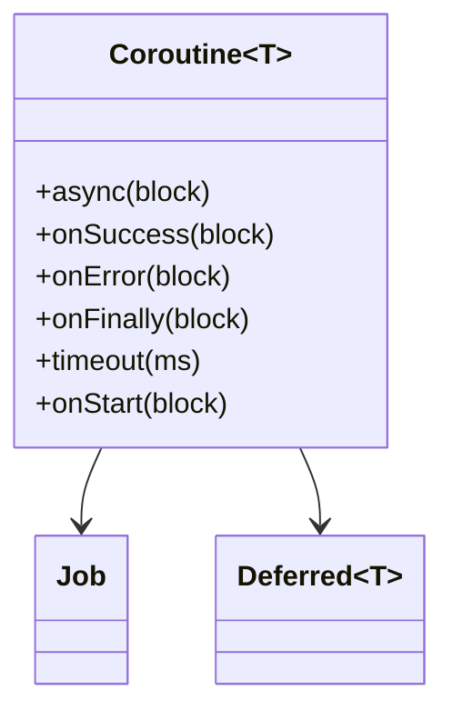
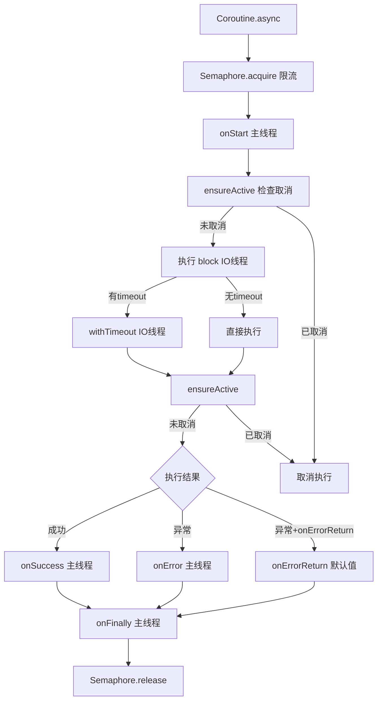
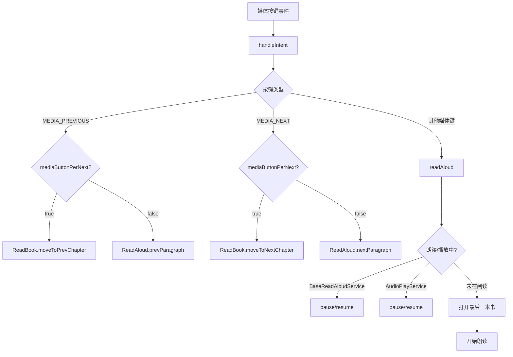
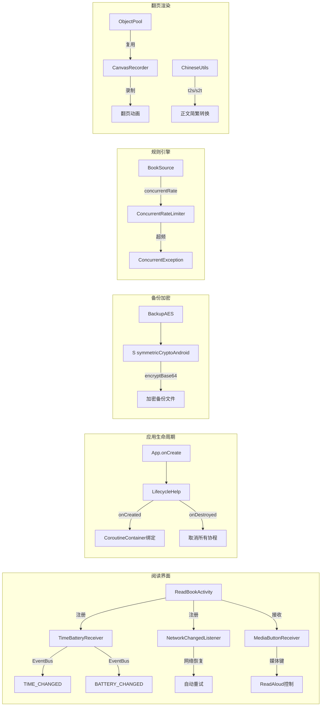

# 工具与辅助层

> **权威声明**：本文档已吸收原 receiver-system.md 与 utils-extensions.md 全部内容（两文件已删除），为工具/广播组件层的唯一权威文档。文件数与行数均基于源码实测。
>
> **核心问题**：`utils/` 目录有哪些重要工具类？协程/加密/广播接收器如何组织？
> **答案**：`utils/` 实测 114 个 .kt（根目录 95 + 4 子包 19：canvasrecorder 11 含 pools/ 3、compress 3、objectpool 5、viewbindingdelegate 3）；`help/coroutine/` 提供链式协程封装；`help/crypto/` 提供对称/非对称加密；广播组件共 7 项（`receiver/` 6 类 + `service/relay/RelayBootReceiver`）。

---

## 1. utils/ 工具类概览

**目录**：[utils/](file:///f:/myself/github/WeAgentChat/temp/legado/app/src/main/java/io/legado/app/utils/)（实测 114 个 .kt：根目录 95 + 子包 19）

### 1.0 子包结构（实测）

| 子包 | 文件数 | 核心内容 |
|------|--------|---------|
| `canvasrecorder/` | 11（根 8 + pools/ 3） | Canvas 录制：BaseCanvasRecorder / CanvasRecorder / CanvasRecorderApi23Impl / CanvasRecorderApi29Impl / CanvasRecorderImpl / CanvasRecorderLocked / CanvasRecorderFactory / CanvasRecorderExtensions；`pools/` 含 CanvasPool / PicturePool / RenderNodePool |
| `compress/` | 3 | ZipUtils（ZIP/GZIP）、LibArchiveUtils（libarchive）、SafeZipExtractor（安全解压） |
| `objectpool/` | 5 | ObjectPool 接口、BaseObjectPool、BaseSafeObjectPool、ObjectPoolLocked、ObjectPoolExtensions |
| `viewbindingdelegate/` | 3 | ActivityViewBindings、FragmentViewBindings、ViewBindingProperty |

```mermaid
graph TB
    UTILS[utils/ 工具类]

    UTILS --> ENC[编码<br/>EncodingDetect<br/>EncoderUtils<br/>Utf8BomUtils]
    UTILS --> CN[简繁转换<br/>ChineseUtils<br/>+OpenCC映射表]
    UTILS --> COMP[压缩<br/>ZipUtils<br/>LibArchiveUtils]
    UTILS --> POOL[池化<br/>ObjectPool<br/>BaseSafeObjectPool]
    UTILS --> CANVAS[Canvas录制<br/>CanvasRecorder<br/>CanvasRecorderFactory]
    UTILS --> VB[ViewBinding委托<br/>ActivityViewBindings<br/>FragmentViewBindings]
    UTILS --> NET[网络<br/>NetworkUtils<br/>UrlUtil]
    UTILS --> FILE[文件IO<br/>FileUtils<br/>DocumentUtils]
    UTILS --> IMG[图片<br/>ImageUtils<br/>SvgUtils<br/>QRCodeUtils]
    UTILS --> COROUTINE[协程<br/>CoroutineExtensions<br/>FlowExtensions<br/>Debounce/Throttle]
    UTILS --> COLL[集合<br/>CollectionExtensions<br/>Array/Map扩展]
    UTILS --> STR[字符串<br/>StringExtensions<br/>RegexExtensions]
    UTILS --> JSON_CAT[JSON/Gson<br/>GsonExtensions<br/>JsonExtensions]
    UTILS --> JSOUP_CAT[jsoup<br/>JsoupExtensions]
    UTILS --> ANDROID[Android扩展<br/>Context/View<br/>Activity/Fragment]
    UTILS --> OTHER[其他<br/>MD5/Color/Html<br/>SyncedRenderer]
```



### 1.1 分类索引

| 分类 | 核心文件 | 功能 |
|------|---------|------|
| **编码** | `EncodingDetect.kt` | 自动检测文件编码（icu4j CharsetDetector + HTML meta 解析） |
| | `EncoderUtils.kt` | escape / base64 编解码 |
| | `Utf8BomUtils.kt` | UTF-8 BOM 处理 |
| **简繁** | `ChineseUtils.kt` | 简繁转换（quick-transfer-chinese 库 + 自定义排除词典） |
| **压缩** | `compress/ZipUtils.kt` | ZIP/GZIP 压缩流操作 |
| | `compress/LibArchiveUtils.kt` | libarchive 格式支持 |
| **池化** | `objectpool/ObjectPool.kt` | 对象池接口 |
| | `objectpool/ObjectPoolLocked.kt` | 线程安全对象池 |
| | `objectpool/BaseObjectPool.kt` | 基类实现 |
| **Canvas** | `canvasrecorder/CanvasRecorder.kt` | Canvas 录制接口（翻页动画用） |
| | `canvasrecorder/CanvasRecorderFactory.kt` | API 23/29 多版本实现 |
| **ViewBinding**| `viewbindingdelegate/ActivityViewBindings.kt` | Activity ViewBinding 委托 |
| | `viewbindingdelegate/FragmentViewBindings.kt` | Fragment ViewBinding 委托 |
| **网络** | `NetworkUtils.kt` | 联网检测/WiFi判断/URL校验/代理/PAC/IP获取 |
| | `UrlUtil.kt` | URL 工具（BaseUrl提取等） |
| **文件/IO** | `FileUtils.kt`, `FileExtensions.kt` | 文件读写/路径工具 |
| | `DocumentUtils.kt` | SAF DocumentFile 操作 |
| | `ArchiveUtils.kt` | 通用压缩包读取 |
| **图片** | `ImageUtils.kt`, `BitmapUtils.kt` | 图片处理/位图工具 |
| | `SvgUtils.kt` | SVG 渲染 |
| | `QRCodeUtils.kt` | 二维码生成 |
| **协程** | `CoroutineExtensions.kt` | 协程扩展函数 |
| | `FlowExtensions.kt` | Flow 扩展（mapParallelSafe等） |
| | `Debounce.kt`, `Throttle.kt` | 防抖/节流 |
| **集合** | `CollectionExtensions.kt` | 集合工具扩展 |
| | `ArrayExtensions.kt`, `MapExtensions.kt` | 数组/Map 扩展 |
| **字符串** | `StringExtensions.kt`, `StringUtils.kt` | 字符串工具 |
| | `RegexExtensions.kt` | 正则工具 |
| **JSON/Gson** | `GsonExtensions.kt`, `JsonExtensions.kt` | JSON 序列化工具 |
| **Jsoup** | `JsoupExtensions.kt` | jsoup 扩展 |
| **Android扩展** | `ContextExtensions.kt` | Context 扩展 |
| | `ViewExtensions.kt` | View 扩展 |
| | `ActivityExtensions.kt` | Activity 扩展 |
| | `FragmentExtensions.kt` | Fragment 扩展 |
| **其他工具** | `MD5Utils.kt` | MD5 哈希 |
| | `RandomColor.kt` | 随机颜色生成 |
| | `ColorUtils.kt` | 颜色工具 |
| | `HtmlFormatter.kt` | HTML 格式化 |
| | `SyncedRenderer.kt` | 同步渲染器 |
| | `InfoMap.kt` | 信息 Map |

### 1.2 EncodingDetect — 编码自动检测

[EncodingDetect.kt:L1-L50](file:///f:/myself/github/WeAgentChat/temp/legado/app/src/main/java/io/legado/app/utils/EncodingDetect.kt)

```kotlin
object EncodingDetect {
    fun getHtmlEncode(bytes: ByteArray): String {
        // 1. 尝试从 <head> 标签中提取编码
        val startIndex = bytes.indexOf("<head>".toByteArray())
        // 2. 用 Jsoup 解析 meta charset
        val doc = Jsoup.parseBodyFragment(head)
        // 3. 先查 <meta charset="xxx">
        // 4. 再查 <meta http-equiv="content-type" content="text/html;charset=xxx">
    }
    
    fun getCharset(file: File): String? {
        // 使用 icu4j CharsetDetector 检测二进制文件编码
        val detector = CharsetDetector()
        detector.setText(file.readBytes())
        return detector.detect()?.name
    }
}
```

### 1.3 ChineseUtils — 简繁转换

[ChineseUtils.kt:L1-L49](file:///f:/myself/github/WeAgentChat/temp/legado/app/src/main/java/io/legado/app/utils/ChineseUtils.kt)

使用 `quick-transfer-chinese` 库，具有自定义排除词典功能：

```kotlin
object ChineseUtils {
    fun s2t(content: String): String   // 简→繁
    fun t2s(content: String): String   // 繁→简（含排除词典修正）
    
    fun fixT2sDict() {
        // 排除词典：避免"机車→机车"、"巨集→宏"等误转换
        val excludeList = listOf("槃", "划槳", "雪梨", "晶元", ...)
        ChineseUtils.loadExcludeDict(TRADITIONAL_TO_SIMPLE, excludeList)
    }
}
```

#### OpenCC 映射表（4个）

```python
# 底层基于 OpenCC（开放中文转换）的映射表:
# 1. STCharacters.txt: 单字 简→繁
# 2. STPhrases.txt: 短语 简→繁
# 3. TSCharacters.txt: 单字 繁→简
# 4. TSPhrases.txt: 短语 繁→简
```

> **重构建议**：直接使用 `python-opencc` 库替代自研引擎。

### 1.4 CanvasRecorder — Canvas 录制（翻页动画）

[CanvasRecorder.kt:L1-L27](file:///f:/myself/github/WeAgentChat/temp/legado/app/src/main/java/io/legado/app/utils/canvasrecorder/CanvasRecorder.kt)

```kotlin
interface CanvasRecorder {
    fun beginRecording(width: Int, height: Int): Canvas  // 开始录制
    fun endRecording()                                    // 结束录制
    fun draw(canvas: Canvas)                              // 回放绘制
    fun recycle()                                         // 回收资源
}
```

**实现策略**：
- API ≥ 29 → `CanvasRecorderApi29Impl`（利用 HardwareBuffer 硬件加速）
- API ≥ 23 → `CanvasRecorderApi23Impl`
- `CanvasRecorderLocked` 带锁包装
- 配套 `CanvasPool/PicturePool/RenderNodePool` 池化复用

### 1.5 ObjectPool — 对象池

[ObjectPool.kt:L1-L11](file:///f:/myself/github/WeAgentChat/temp/legado/app/src/main/java/io/legado/app/utils/objectpool/ObjectPool.kt)

```kotlin
interface ObjectPool<T> {
    fun obtain(): T         // 获取（池为空则 create）
    fun recycle(target: T)  // 回收
    fun create(): T         // 创建新实例
}
```

提供 `BaseObjectPool`（无锁）和 `BaseSafeObjectPool`（线程安全）两种实现。用于翻页动画的 Canvas/Picture/RenderNode 复用。

### 1.6 ViewBinding 委托

[ActivityViewBindings.kt](file:///f:/myself/github/WeAgentChat/temp/legado/app/src/main/java/io/legado/app/utils/viewbindingdelegate/ActivityViewBindings.kt)

```kotlin
// 使用方式：一行代码完成 ViewBinding 初始化+生命周期管理
class MyActivity : BaseActivity<ActivityMainBinding>() {
    // 自动 inflate + setContentView + onDestroy 清理
}
```

### 1.7 压缩工具

[ZipUtils.kt:L1-L40](file:///f:/myself/github/WeAgentChat/temp/legado/app/src/main/java/io/legado/app/utils/compress/ZipUtils.kt)

支持：ZIP 打包/解包、GZIP 压缩/解压、流式操作、协程异步（`withContext(IO)`）

---

## 2. help/coroutine/ — 协程工具

**目录**：[help/coroutine/](file:///f:/myself/github/WeAgentChat/temp/legado/app/src/main/java/io/legado/app/help/coroutine/)

| 文件 | 功能 |
|------|------|
| `Coroutine.kt` | 链式协程封装（onStart→onSuccess→onError→onFinally） |
| `CoroutineContainer.kt` | 协程生命周期容器接口 |
| `CompositeCoroutine.kt` | 协程组合管理 |
| `ActivelyCancelException.kt` | 主动取消异常（区分被动/主动取消） |

### 2.1 Coroutine — 链式协程

[Coroutine.kt:L26-L252](file:///f:/myself/github/WeAgentChat/temp/legado/app/src/main/java/io/legado/app/help/coroutine/Coroutine.kt)



提供链式回调风格的协程封装，替代传统 Callback 嵌套：

```kotlin
Coroutine.async(scope) {
    // 在 IO 线程执行
    fetchData()
}.timeout(30_000L)              // 30秒超时
 .onStart { showLoading() }     // 开始回调（主线程）
 .onSuccess { data ->           // 成功回调（主线程）
     updateUI(data)
 }.onError { e ->               // 错误回调（主线程）
     showError(e)
 }.onFinally {                  // 完成回调（主线程）
     hideLoading()
 }.onErrorReturn(defaultValue)  // 出错返回默认值
```

**执行流程**：
```
launch (IO线程)
  → Semaphore.acquire (限流)
  → onStart (主线程)
  → ensureActive
  → 执行 block / withTimeout (IO线程)
  → ensureActive
  → onSuccess (主线程) 或 onError / onErrorReturn
  → onFinally (主线程)
  → Semaphore.release
```



### 2.2 CoroutineContainer — 生命周期绑定

```kotlin
interface CoroutineContainer {
    fun add(coroutine: Coroutine<*>): Boolean
    fun clear()  // Activity/Fragment destroy 时取消所有协程
}
```

通过 `LifecycleHelp` [LifecycleHelp.kt](file:///f:/myself/github/WeAgentChat/temp/legado/app/src/main/java/io/legado/app/help/LifecycleHelp.kt) 自动绑定 Activity 生命周期。

---

## 3. help/crypto/ — 加密工具

**目录**：[help/crypto/](file:///f:/myself/github/WeAgentChat/temp/legado/app/src/main/java/io/legado/app/help/crypto/)

| 文件 | 功能 |
|------|------|
| `SymmetricCryptoAndroid.kt` | 对称加密 AES/DES/SM4，继承 hutool SymmetricCrypto |
| `AsymmetricCrypto.kt` | 非对称加密 RSA/SM2 |
| `Sign.kt` | 数字签名 |

### 3.1 SymmetricCryptoAndroid

[SymmetricCryptoAndroid.kt:L1-L40](file:///f:/myself/github/WeAgentChat/temp/legado/app/src/main/java/io/legado/app/help/crypto/SymmetricCryptoAndroid.kt)

Android 适配版对称加密，使用 Android Base64 替代 hutool 默认实现：

```kotlin
class SymmetricCryptoAndroid(
    algorithm: String,  // AES/DES/SM4
    key: ByteArray,
) : SymmetricCrypto(algorithm, key) {
    override fun encryptBase64(data: ByteArray): String
    override fun decrypt(data: String): ByteArray
}
```

**用途**：备份文件 AES 加密（`BackupAES.kt` 调用）。

### 3.2 加密模块完整接口

#### 对称加密（SymmetricCryptoAndroid）

```python
# SymmetricCryptoAndroid(transformation, key)
# transformation = "AES/CBC/PKCS5Padding"
# key = ByteArray
# iv = ByteArray (可选)
接口:
- decrypt(data: String) → ByteArray?   # Base64 输入，ByteArray 输出
- decryptStr(data: String) → String?    # Base64 输入，String 输出
- encrypt(data: ByteArray) → ByteArray  # 字节加密
- encryptBase64(data: String) → String  # 字符串加密后 Base64 编码
- encryptHex(data: String) → String     # 字符串加密后 Hex 编码
```

#### 非对称加密（AsymmetricCrypto）

```python
# AsymmetricCrypto(transformation)
接口:
- getPublicKey(): String
- getPrivateKey(): String
- encrypt(data: String): String
- decrypt(data: String): String
```

#### 签名（Sign）

```python
# Sign(algorithm) — e.g. "MD5withRSA"
接口:
- sign(data: String, privateKey: String): String
- verify(data: String, sign: String, publicKey: String): Boolean
```

---

## 4. receiver/ — 广播接收器层（实测 6 类 597 行 + RelayBootReceiver 共 7 项）

**目录**：[receiver/](file:///f:/myself/github/WeAgentChat/temp/legado/app/src/main/java/io/legado/app/receiver/)

| 文件 | 行数 | 职责 | 注册方式 |
|------|------|------|----------|
| `MediaButtonReceiver.kt` | 114 | 耳机/蓝牙媒体按键监听（播放/暂停/上下章） | AndroidManifest 静态注册 |
| `TimeBatteryReceiver.kt` | 25 | 每分钟时间滴答 + 电量变化 → EventBus 广播 | `ReadBookActivity` 动态注册 |
| `NetworkChangedListener.kt` | 65 | 网络状态变化监听 | API <24→Broadcast / ≥24→NetworkCallback |
| `SharedReceiverActivity.kt` | 50 | 系统分享/文本选择入口（透明Activity→分发处理） | AndroidManifest intent-filter |
| `ReadGoalWidgetProvider.kt` | 178 | 阅读目标桌面小组件：RemoteViews + Bitmap 进度环渲染当日目标进度，数据来自 appDb/ReadRecordWidgetStore，点击跳转阅读记录页 | AndroidManifest 桌面小部件 |
| `ReadRankWidgetProvider.kt` | 100 | 阅读排行桌面小组件：展示阅读时长排行，自定义 UPDATE 广播触发 `updateAll(force)`，IO 协程 + lastRefreshTime 节流 | AndroidManifest 桌面小部件 |
| `RelayBootReceiver.kt`（service/relay/） | 14 | 开机/包替换自启：ACTION_BOOT_COMPLETED / ACTION_MY_PACKAGE_REPLACED 时，若 `publicWebRelayEnabled` 开关开启则启动 RelayService | AndroidManifest BOOT_COMPLETED / MY_PACKAGE_REPLACED |

### 4.1 MediaButtonReceiver — 媒体按键

[MediaButtonReceiver.kt:L1-L114](file:///f:/myself/github/WeAgentChat/temp/legado/app/src/main/java/io/legado/app/receiver/MediaButtonReceiver.kt)

处理耳机/蓝牙设备的播放控制键：



```
按键事件 → handleIntent()
├── KEYCODE_MEDIA_PREVIOUS
│   ├── mediaButtonPerNext=true → ReadBook.moveToPrevChapter()
│   └── mediaButtonPerNext=false → ReadAloud.prevParagraph()
├── KEYCODE_MEDIA_NEXT
│   ├── mediaButtonPerNext=true → ReadBook.moveToNextChapter()
│   └── mediaButtonPerNext=false → ReadAloud.nextParagraph()
└── 其他媒体键 → readAloud()
    ├── BaseReadAloudService.isRun → pause/resume
    ├── AudioPlayService.isRun → pause/resume
    └── 未在阅读 → 打开最后一本书并开始朗读
```

### 4.2 TimeBatteryReceiver — 时间/电量

[TimeBatteryReceiver.kt:L1-L25](file:///f:/myself/github/WeAgentChat/temp/legado/app/src/main/java/io/legado/app/receiver/TimeBatteryReceiver.kt)

- `ACTION_TIME_TICK` → `postEvent(TIME_CHANGED)`（每分钟一次）
- `ACTION_BATTERY_CHANGED` → `postEvent(BATTERY_CHANGED, level)`

### 4.3 NetworkChangedListener — 网络变化

[NetworkChangedListener.kt:L1-L65](file:///f:/myself/github/WeAgentChat/temp/legado/app/src/main/java/io/legado/app/receiver/NetworkChangedListener.kt)

API 版本自适应：
- **API ≥ 24** → `ConnectivityManager.NetworkCallback`（新版 API）
- **API < 24** → `BroadcastReceiver` + `CONNECTIVITY_ACTION`（旧版兼容）

### 4.4 SharedReceiverActivity — 系统分享入口

[SharedReceiverActivity.kt:L1-L50](file:///f:/myself/github/WeAgentChat/temp/legado/app/src/main/java/io/legado/app/receiver/SharedReceiverActivity.kt)

透明 Activity，处理：
- `ACTION_SEND` → 其他 App 分享文本（URL 提取 → 搜索/添加书架）
- `ACTION_PROCESS_TEXT` → Android 6+ 选中文本处理
- `action=readAloud` → 快捷方式触发朗读

### 4.5 ReadGoalWidgetProvider — 阅读目标小组件

[ReadGoalWidgetProvider.kt:L1-L178](file:///f:/myself/github/WeAgentChat/temp/legado/app/src/main/java/io/legado/app/receiver/ReadGoalWidgetProvider.kt)

`AppWidgetProvider` 实现。`onUpdate`/`onReceive` 触发 `updateWidgets`：从 appDb + `ReadRecordWidgetStore` 读取当日阅读数据，Canvas/Paint（PorterDuffXfermode）绘制进度环 Bitmap，`RemoteViews` 渲染到小组件；`TaskStackBuilder` 点击跳转 `ReadRecordActivity`/`MainActivity`。

### 4.6 ReadRankWidgetProvider — 阅读排行小组件

[ReadRankWidgetProvider.kt:L1-L100](file:///f:/myself/github/WeAgentChat/temp/legado/app/src/main/java/io/legado/app/receiver/ReadRankWidgetProvider.kt)

`AppWidgetProvider` 实现。自定义广播 `UPDATE_READ_RANK_WIDGET` 触发 `updateAll(force = true)`；IO 协程作用域（SupervisorJob）内刷新数据，`lastRefreshTime` 时间戳节流防止重复刷新；点击跳转阅读记录页。

### 4.7 RelayBootReceiver — Relay 服务自启（service/relay/）

[RelayBootReceiver.kt:L1-L14](file:///f:/myself/github/WeAgentChat/temp/legado/app/src/main/java/io/legado/app/service/relay/RelayBootReceiver.kt)

仅响应 `ACTION_BOOT_COMPLETED` 与 `ACTION_MY_PACKAGE_REPLACED`；读取 `defaultSharedPreferences` 的 `publicWebRelayEnabled` 开关，开启时 `RelayService.start(context)` 恢复公共 Web 中继服务。

---

## 5. help/ 顶层辅助类

### 5.1 ConcurrentRateLimiter — 并发限流

[ConcurrentRateLimiter.kt:L1-L40](file:///f:/myself/github/WeAgentChat/temp/legado/app/src/main/java/io/legado/app/help/ConcurrentRateLimiter.kt)

解析书源的 `concurrentRate` 字段（格式：`N/M` = N次/M毫秒 或 `N` = 间隔N毫秒），用于请求频率控制：

```kotlin
class ConcurrentRateLimiter(source: BaseSource?) {
    // concurrentRecordMap: ConcurrentHashMap<String, ConcurrentRecord>
    //  key=书源URL → 记录访问次数+时间窗口
    // 超出频率 → throw ConcurrentException
}
```

### 5.2 其他重要辅助类

| 文件 | 功能 |
|------|------|
| `TTS.kt` | TTS 引擎工具（获取系统TTS引擎列表） |
| `MediaHelp.kt` | 媒体焦点管理 |
| `RuleComplete.kt` | JS 规则代码补全提示 |
| `RuleBigDataHelp.kt` | 规则大数据缓存管理 |
| `ReplaceAnalyzer.kt` | 替换规则分析（测试替换效果） |
| `DefaultData.kt` | 默认数据（预置书源等）版本升级 |
| `IntentData.kt` / `IntentHelp.kt` | Activity 跳转数据封装 |
| `LayoutManager.kt` | 布局管理器工具 |
| `CacheManager.kt` | 磁盘缓存管理 |
| `LauncherIconHelp.kt` | 桌面图标管理 |
| `PaintPool.kt` | Paint 对象池 |
| `GlideImageGetter.kt` | Html.fromHtml 中加载网络图片 |
| `DirectLinkUpload.kt` | 直链上传服务 |

---

## 6. 数据流依赖关系

```
ReadBookActivity
├── 注册 TimeBatteryReceiver → EventBus.TIME_CHANGED / BATTERY_CHANGED
├── 注册 NetworkChangedListener → 网络恢复自动重试
└── 接收 MediaButtonReceiver → 媒体键控制朗读

App.onCreate()
└── registerActivityLifecycleCallbacks(LifecycleHelp)
    └── onActivityCreated → CoroutineContainer 绑定
    └── onActivityDestroyed → 取消所有协程

备份模块
└── BackupAES → SymmetricCryptoAndroid(algorithm, key) → encryptBase64

规则引擎
└── ConcurrentRateLimiter → BookSource.concurrentRate → 请求频率控制

阅读界面
├── CanvasRecorder → 翻页动画画面录制
├── ObjectPool → Canvas/Picture 复用
└── ChineseUtils.t2s/s2t → 正文简繁转换
```



---

## 7. TimeUtils — 时间格式化

**文件**：[TimeUtils.kt](file:///f:/myself/github/WeAgentChat/temp/legado/app/src/main/java/io/legado/app/utils/TimeUtils.kt)

书源返回的日期格式五花八门（中文、英文、ISO、时间戳...），TimeUtils 负责归一化：

### 支持的日期格式（20+种）

```python
DATE_FORMATS = [
    "yyyy-MM-dd HH:mm:ss",
    "yyyy/MM/dd HH:mm:ss",
    "yyyy-MM-dd HH:mm",
    "yyyy-MM-dd",
    "MM/dd/yyyy HH:mm:ss",
    "dd/MM/yyyy HH:mm:ss",
    "yyyyMMddHHmmss",
    "yyyy年MM月dd日 HH:mm",
    "yyyy年MM月dd日",
    "MM月dd日 HH:mm",
    "MM-dd HH:mm",
    "HH:mm:ss",
    "HH:mm",
    # 英文格式
    "E, dd MMM yyyy HH:mm:ss Z",  # RFC 2822
    "EEE, dd MMM yyyy HH:mm:ss zzz",
    "yyyy-MM-dd'T'HH:mm:ssXXX",
    "yyyy-MM-dd'T'HH:mm:ss.SSSXXX",
    "dd MMM yyyy HH:mm:ss",
    "MMM dd, yyyy HH:mm:ss",
    "MMM dd, yyyy",
    "yyyy-M-d H:mm:ss",
    "yyyy-M-d",
    # 中文相对时间
    "刚刚",
    "\\d+分钟前",
    "\\d+小时前",
    "\\d+天前",
]
```

### 核心方法

```python
class TimeUtils:
    @staticmethod
    def parse_date_str(date_str: str) -> datetime | None:
        """自动识别格式并解析"""
        if not date_str:
            return None
        # 1. 尝试每种格式
        # 2. 相对时间 → now - delta
        # 3. 全部失败 → 返回 None

    @staticmethod
    def format_time(time_millis: int, fmt: str = "%Y-%m-%d %H:%M:%S") -> str:
        """毫秒时间戳 → 格式化字符串"""

    @staticmethod
    def format_utc_time(time_millis: int, fmt: str, shift_hours: int) -> str:
        """UTC 时间格式化（支持时区偏移）"""

    @staticmethod
    def time_ago(date_str: str) -> str:
        """转为"3分钟前"形式的相对时间"""
```

---

## 8. NetworkUtils — 网络工具

[NetworkUtils.kt](file:///f:/myself/github/WeAgentChat/temp/legado/app/src/main/java/io/legado/app/utils/NetworkUtils.kt)

| API | 说明 |
|-----|------|
| `isNetworkAvailable()` | 是否有网络连接 |
| `isWifiAvailable()` | 是否 WiFi 连接 |
| `getNetworkIp()` | 获取本机 IP |
| `isUrl(url)` | URL 合法性校验 |
| `getProxy()` | 获取系统代理设置 |
| `isPacProxy()` | 是否 PAC 代理 |

---

## 9. FlowExtensions — Flow 扩展

[FlowExtensions.kt](file:///f:/myself/github/WeAgentChat/temp/legado/app/src/main/java/io/legado/app/utils/FlowExtensions.kt)

| 扩展函数 | 说明 |
|----------|------|
| `Flow<T>.mapParallelSafe(mapper)` | 并行 map，异常项跳过不中断整个流 |
| `Flow<T>.mapParallelOrdered(mapper)` | 并行 map，保持顺序 |

---

## 10. ViewBinding 委托详解

[ActivityViewBindings.kt](file:///f:/myself/github/WeAgentChat/temp/legado/app/src/main/java/io/legado/app/utils/viewbindingdelegate/ActivityViewBindings.kt)
[FragmentViewBindings.kt](file:///f:/myself/github/WeAgentChat/temp/legado/app/src/main/java/io/legado/app/utils/viewbindingdelegate/FragmentViewBindings.kt)

```kotlin
// Activity 使用
class MyActivity : BaseActivity<ActivityMainBinding>() {
    // 自动 inflate + setContentView + onDestroy 清理
}

// Fragment 使用
class MyFragment : BaseFragment<FragmentMyBinding>() {
    // onViewCreated 绑定 + onDestroyView 清理
}
```

`ViewBindingProperty<R, T>` 实现 `ReadOnlyProperty<R, T>`，支持 `by viewBinder()` 委托语法：
- `getValue`：已绑定则直接返回；未绑定则注册 `ClearOnDestroyLifecycleObserver`
- DESTROYED 状态下获取：仍执行绑定但立即 post 清空
- `clear()`：移除 LifecycleObserver，通过 `mainHandler.post { viewBinding = null }` 在主线程清空

---

## 11. CoroutineExtensions — 协程扩展

[CoroutineExtensions.kt](file:///f:/myself/github/WeAgentChat/temp/legado/app/src/main/java/io/legado/app/utils/CoroutineExtensions.kt)

| 扩展函数 | 说明 |
|----------|------|
| `CoroutineScope.launchUI(block)` | 在主线程启动协程 |
| `CoroutineScope.launchIO(block)` | 在 IO 线程启动协程 |
| `CoroutineScope.launchDefault(block)` | 在 Default 线程启动协程 |
| `T.runOnIO(block)` | 切换到 IO 线程执行 |

---

## 12. 技术债务与注意事项

| 项目 | 说明 |
|------|------|
| **ChineseUtils 排除词典** | 繁→简排除词典约 80+ 词组，新增误转换需手动添加 |
| **CanvasRecorder API 版本** | API≥29 用 HardwareBuffer 硬件加速，低于 29 回退软件实现 |
| **ViewBinding 委托** | DESTROYED 后访问会执行绑定但立即清空，可能产生短暂泄漏 |
| **TimeUtils 相对时间** | "刚刚"/"N分钟前"等中文相对时间仅支持中文格式 |