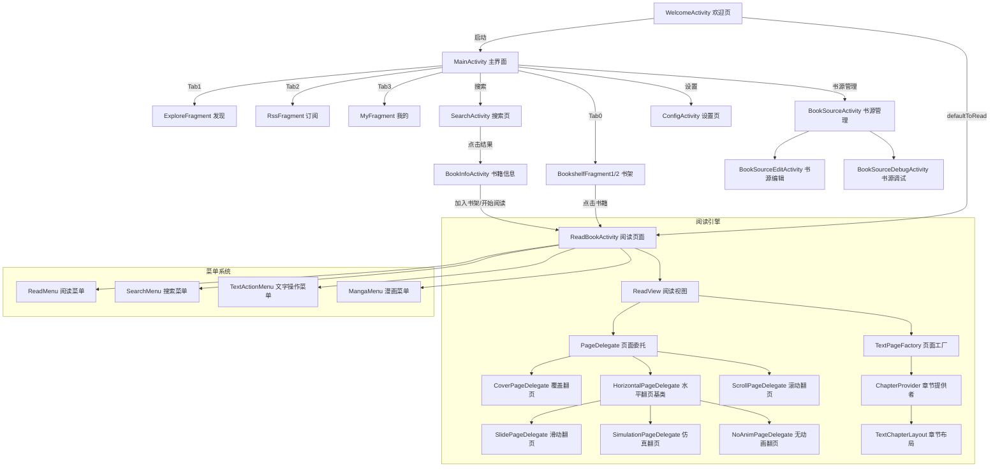
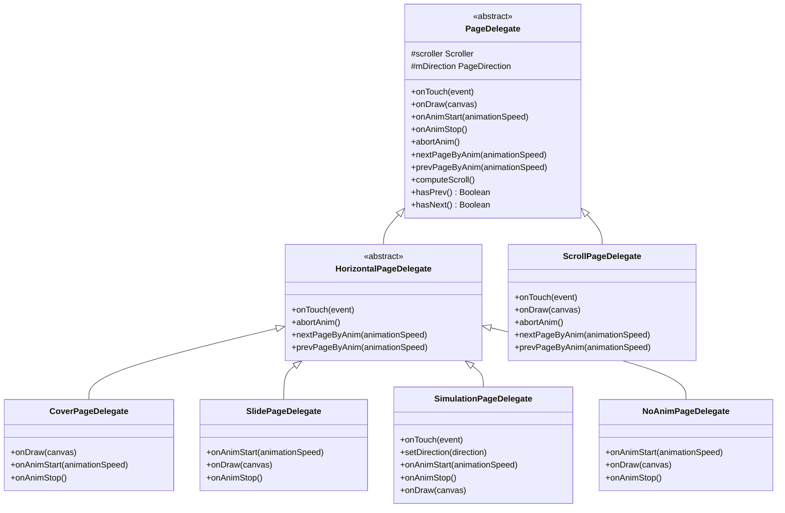

# Legado 核心 UI 页面深度分析

> 分析基于 Legado 源码，覆盖 7 大核心 UI 模块，57+ 个源文件。所有行号均通过 Read/Grep 工具验证。

---

## 1. 核心 UI 架构概览

---

## 2. ReadBookActivity 详细分析（阅读引擎）

### 2.1 类层次结构

`
BaseActivity -> VMBaseActivity<ActivityBookReadBinding, ReadBookViewModel>
    -> BaseReadBookActivity (抽象，屏幕方向/系统UI/对话框管理)
        -> ReadBookActivity (具体实现，事件处理/菜单/手势)
`

### 2.2 ReadBookActivity 核心职责

ReadBookActivity（1857 行）是整个应用最复杂的页面，承担阅读界面全部交互逻辑：

- **生命周期管理**：onActivityCreated (L270)、onPostCreate (L306)、onResume (L344)、onPause (L373)、onDestroy (L1722)
- **数据初始化**：通过 ReadBookViewModel.initData() 在 onPostCreate 中以 IdleHandler 方式延迟初始化
- **返回键拦截**：支持退出搜索、恢复进度、暂停朗读、停止自动翻页等分层拦截
- **菜单管理**：onCompatCreateOptionsMenu (L395)、upMenu (L430)、onCompatOptionsItemSelected (L467)
- **键盘翻页**：onKeyDown (L693)、onKeyUp (L740)、keyPage (L987)
- **触摸事件**：onTouch (L763+) 处理文字选择游标拖拽
- **进度恢复**：
estoreLastBookProcess 支持全文搜索/进度条跳转前的位置恢复
- **事件总线**：observeLiveBus (L1738) 监听 READ_BOOK_CONFIG/ALOUD_STATE/TTS_PROGRESS/SEARCH_RESULT 等事件

### 2.3 BaseReadBookActivity 基类（393 行）

| 功能 | 方法 | 行号 |
|------|------|------|
| 屏幕方向设置 | setOrientation() | L148 |
| 系统UI可见性更新 | upSystemUiVisibility() | L162 |
| 内边距配置 | showPaddingConfig() | L128 |
| 背景文字配置 | showBgTextConfig() | L132 |
| 点击区域配置 | showClickRegionalConfig() | L136 |
| 菜单显示/隐藏回调 | onMenuShow()/onMenuHide() | L120/L124 |

### 2.4 ReadBookViewModel 数据处理（593 行）

| 功能 | 方法 | 行号 |
|------|------|------|
| 初始化阅读配置 | initReadBookConfig() | L73 |
| 初始化数据 | initData() | L85 |
| 加载目录 | loadChapterList() | L196 |
| 加载目录（挂起） | loadChapterListAwait() | L204 |
| 打开章节 | openChapter() | L352 |
| 更新书源 | upBookSource() | L365 |
| 刷新当前内容 | 
efreshContentDur() | L375 |
| 自动换源 | utoChangeSource() | L308 |
| 同步阅读进度 | syncBookProgress() | L255 |
| 替换规则变更 | 
eplaceRuleChanged() | L568 |
| 禁用书源 | disableSource() | L577 |
| 保存图片 | saveImage() | L538 |

### 2.5 ReadView 阅读视图（771 行）

ReadView 是阅读页面的核心自定义 View，管理翻页动画和触摸交互：

| 功能 | 属性/方法 | 行号 |
|------|-----------|------|
| 类声明 | class ReadView | L51 |
| 三个页面视图 | prevPage/curPage/
extPage | L63-L65 |
| 页面工厂 | pageFactory: TextPageFactory | L58 |
| 页面委托 | pageDelegate: PageDelegate? | L59 |
| 自动翻页 | utoPager: AutoPager | L135 |
| 触摸事件 | onTouchEvent() | L174 |
| 尺寸变更 | onSizeChanged() | L144 |
| 更新页面动画 | upPageAnim() | L524 |
| 更新内容 | upContent() | L567 |
| 9宫格点击区域 | setRect9x() | L112 |
| 回调接口 | interface CallBack | L758 |

**ReadView.CallBack 接口**（L758-770）：

- isInitFinish: Boolean - 初始化是否完成
- showActionMenu() - 显示操作菜单
- screenOffTimerStart() - 启动息屏计时
- showTextActionMenu() - 显示文字操作菜单
- utoPageStop() - 停止自动翻页
- openChapterList() - 打开章节列表
- ddBookmark() - 添加书签
- changeReplaceRuleState() - 切换替换规则状态
- openSearchActivity(searchWord: String?) - 打开搜索
- upSystemUiVisibility() - 更新系统UI可见性
- sureNewProgress(progress: BookProgress) - 确认新进度

### 2.6 页面委托体系（6 种翻页效果）

| 委托类 | 行数 | 翻页效果 | 关键行号 |
|--------|------|----------|----------|
| PageDelegate | 208 | 抽象基类，Scroller 动画驱动 | L14 |
| HorizontalPageDelegate | 155 | 水平翻页基类 | L9 |
| CoverPageDelegate | 117 | 覆盖翻页 | L11 |
| SlidePageDelegate | 64 | 滑动翻页 | L8 |
| SimulationPageDelegate | 613 | 仿真翻页（最复杂，含贝塞尔曲线绘制） | L27 |
| NoAnimPageDelegate | 28 | 无动画翻页 | L6 |
| ScrollPageDelegate | 186 | 滚动翻页 | L12 |

### 2.7 ReadMenu 菜单系统（698 行）

| 功能 | 方法/属性 | 行号 |
|------|-----------|------|
| 类声明 | class ReadMenu | L65 |
| 初始化视图 | initView() | L175 |
| 菜单弹入 | 
unMenuIn() | L368 |
| 菜单弹出 | 
unMenuOut() | L382 |
| 更新亮度状态 | upBrightnessState() | L274 |
| 更新进度条 | upSeekBar() | L630 |
| 绑定事件 | indEvent() | L403 |
| 回调接口 | interface CallBack | L677 |

**ReadMenu.CallBack 接口**（L677-696）：

- utoPage() - 自动翻页
- openReplaceRule() - 打开替换规则
- openChapterList() - 打开章节列表
- openSearchActivity(searchWord: String?) - 打开搜索
- openSourceEditActivity() - 打开书源编辑
- openBookInfoActivity() - 打开书籍信息
- showReadStyle() - 显示阅读样式
- showMoreSetting() - 显示更多设置
- showReadAloudDialog() - 显示朗读对话框
- upSystemUiVisibility() - 更新系统UI
- onClickReadAloud() - 点击朗读
- showHelp() - 显示帮助
- showLogin() - 显示登录
- payAction() - 付费操作
- disableSource() - 禁用书源
- skipToChapter(index: Int) - 跳转到章节
- onMenuShow()/onMenuHide() - 菜单显隐回调

### 2.8 其他菜单组件

| 组件 | 类声明行 | 职责 |
|------|----------|------|
| SearchMenu | L29 | 全文搜索菜单，搜索结果导航 |
| TextActionMenu | L39 | 文字选中后的操作菜单（复制/搜索/替换等） |
| MangaMenu | L36 | 漫画阅读专用菜单 |

### 2.9 阅读配置对话框

| 对话框 | 行号 | 功能 |
|--------|------|------|
| ReadStyleDialog | L36 | 阅读样式配置（字体/间距/缩进） |
| BgTextConfigDialog | L77 | 背景和文字颜色配置 |
| MoreConfigDialog | L35 | 更多阅读设置 |
| AutoReadDialog | L28 | 自动阅读（自动翻页） |
| ReadAloudDialog | L28 | 朗读控制 |
| ReadAloudConfigDialog | L33 | 朗读配置 |
| ClickActionConfigDialog | L22 | 点击区域配置 |
| PaddingConfigDialog | L17 | 内边距配置 |
| TipConfigDialog | L24 | 提示信息配置 |
| PageKeyDialog | L17 | 翻页按键配置 |
| HttpTtsEditDialog | L35 | HTTP TTS 编辑 |
| SpeakEngineDialog | L60 | 朗读引擎选择 |
| ContentEditDialog | L37 | 正文编辑 |
| EffectiveReplacesDialog | L31 | 有效替换规则列表 |

### 2.10 页面实体与排版引擎

| 类 | 行号 | 职责 |
|----|------|------|
| TextPage | L33 | 单页数据（含 TextLine 列表） |
| TextChapter | L21 | 章节数据（含 TextPage 列表） |
| TextLine | L29 | 行数据 |
| TextParagraph | L4 | 段落数据 |
| TextPos | L10 | 文字位置（章节/页面/行偏移） |
| PageDirection | L3 | 翻页方向枚举（NEXT/PREV/NONE） |

**列（Column）实体体系**（用于多列排版）：

| 类 | 行号 | 职责 |
|----|------|------|
| TextColumn | L17 | 文本列 |
| TextHtmlColumn | L19 | HTML 文本列 |
| ImageColumn | L19 | 图片列 |
| ReviewColumn | L16 | 注释列 |
| ButtonColumn | L14 | 按钮列 |

**排版引擎**：

| 类 | 行号 | 职责 |
|----|------|------|
| ChapterProvider | L35 (object) | 章节排版入口，getTextChapterAsync(L149)、upStyle(L176)、upLayout(L313) |
| TextPageFactory | L10 | 页面工厂，管理 prevPage/curPage/nextPage 的切换逻辑 |
| TextChapterLayout | L69 | 章节布局引擎，将原始内容排版为 TextChapter |
| TextMeasure | L8 | 文字测量工具 |
| ZhLayout | L16 | 中文排版布局 |
| DataSource | L6 (interface) | 数据源接口，ReadView 实现，提供章节/页面数据 |

---

## 3. MainActivity（主界面）

### 3.1 Tab 结构

| Tab | Fragment | 功能 |
|-----|----------|------|
| Tab0 | BookshelfFragment1/2 | 书架列表 |
| Tab1 | ExploreFragment | 发现页 |
| Tab2 | RssFragment | 订阅页 |
| Tab3 | MyFragment | 我的页 |

### 3.2 核心功能

- **ViewPager2**: 4个Tab切换
- **DrawerLayout**: 侧边栏快捷操作
- **搜索入口**: ActionBar SearchView
- **书源管理**: DrawerLayout快捷入口

---

## 4. BookInfoActivity（书籍信息页）

### 4.1 模块结构

| 文件 | 类名 | 职责 |
|------|------|------|
| BookInfoActivity.kt | BookInfoActivity | 书籍信息页 |
| BookInfoViewModel.kt | BookInfoViewModel | 信息加载/加入书架 |

### 4.2 核心功能

- **书籍详情**: 从书源获取书籍封面/简介/目录
- **加入书架**: 添加到本地书架
- **开始阅读**: 跳转ReadBookActivity
- **换源**: 切换书源

---

## 5. SearchActivity（搜索页）

### 5.1 模块结构

| 文件 | 类名 | 职责 |
|------|------|------|
| SearchActivity.kt | SearchActivity | 搜索页 |
| SearchViewModel.kt | SearchViewModel | 搜索状态管理 |

### 5.2 核心功能

- **关键词搜索**: 调用多个书源并发搜索
- **搜索历史**: 最近搜索关键词
- **搜索结果**: BookInfoAdapter展示
- **点击结果**: 跳转BookInfoActivity

---

## 6. BookSourceActivity（书源管理页）

### 6.1 模块结构

| 文件 | 类名 | 职责 |
|------|------|------|
| BookSourceActivity.kt | BookSourceActivity | 书源列表页 |
| BookSourceViewModel.kt | BookSourceViewModel | 书源CRUD |
| BookSourceEditActivity.kt | BookSourceEditActivity | 书源编辑页 |
| BookSourceDebugActivity.kt | BookSourceDebugActivity | 书源调试页 |

### 6.2 核心功能

- **书源列表**: 分组/搜索/启用/禁用
- **导入书源**: JSON/二维码/在线导入
- **编辑书源**: 规则编辑（CSS/JSONPath/XPath/正则/JS）
- **调试书源**: 实时测试规则有效性

---

## 7. ConfigActivity（设置页）

### 7.1 模块结构

| 文件 | 类名 | 职责 |
|------|------|------|
| ConfigActivity.kt | ConfigActivity | 设置页容器 |

### 7.2 设置分类

| 分类 | 设置项 |
|------|--------|
| 阅读设置 | 字体/字号/翻页模式/主题 |
| 显示设置 | 亮度/屏幕方向/夜间模式 |
| 书源设置 | 并发数/超时/UA |
| 备份设置 | 导出/导入/云备份 |
| 其他设置 | TTS/朗读/自动翻页 |

---

## 8. WelcomeActivity（欢迎页）

### 8.1 功能

- **首次启动**: 显示欢迎引导
- **权限请求**: 存储权限
- **跳转逻辑**: 
  - defaultToRead=true → 直接进入ReadBookActivity
  - defaultToRead=false → 进入MainActivity

---

## 9. 源码锚点

| 页面 | 目录路径 | 主要文件 |
|------|----------|----------|
| MainActivity | `app/src/main/java/io/legado/app/ui/main/` | MainActivity.kt |
| ReadBookActivity | `app/src/main/java/io/legado/app/ui/book/read/` | ReadBookActivity.kt (1857行) |
| BookInfoActivity | `app/src/main/java/io/legado/app/ui/book/info/` | BookInfoActivity.kt |
| SearchActivity | `app/src/main/java/io/legado/app/ui/book/search/` | SearchActivity.kt |
| BookSourceActivity | `app/src/main/java/io/legado/app/ui/book/source/` | BookSourceActivity.kt |
| ConfigActivity | `app/src/main/java/io/legado/app/ui/config/` | ConfigActivity.kt |
| WelcomeActivity | `app/src/main/java/io/legado/app/ui/welcome/` | WelcomeActivity.kt |

---

*文档生成: wiki-generator v2.1 | 最后更新: 2026-06-30*
