# 次要 UI 页面架构文档

> 本文档覆盖 Legado 项目中 11 个次要 UI 模块，共 49 个 Kotlin 源文件。
> 所有行号基于源码实际内容验证，最后更新：2026-06-30。

---

## 1. 次要 UI 页面架构概览

```mermaid
flowchart TB
    subgraph 替换规则管理
        RRA[ReplaceRuleActivity] --> RRV[ReplaceRuleViewModel]
        RRA --> RAD[ReplaceRuleAdapter]
        RRA --> GMD[GroupManageDialog]
        RRA --> REA[ReplaceEditActivity]
        REA --> REV[ReplaceEditViewModel]
    end
    subgraph 字典规则管理
        DD[DictDialog] --> DVM[DictViewModel]
        DRA[DictRuleActivity] --> DRV[DictRuleViewModel]
        DRA --> DRAD[DictRuleAdapter]
        DRA --> DRED[DictRuleEditDialog]
    end
    subgraph 代码编辑器
        CEA[CodeEditActivity] --> CEV[CodeEditViewModel]
        CEA --> TMC[TextMateColorScheme2]
        CEA --> CTD[ChangeThemeDialog]
        CEA --> CSD[SettingsDialog]
    end
    subgraph 视频播放器
        VPA[VideoPlayerActivity] --> VPV[VideoPlayerViewModel]
        VPA --> CHA[ChapterAdapter]
        VPA --> VSD[video/SettingsDialog]
    end
    subgraph 内置浏览器
        WVA[WebViewActivity] --> WVM[WebViewModel]
    end
    subgraph 文件管理
        FMA[FileManageActivity] --> FMV[FileManageViewModel]
        HFA[HandleFileActivity] --> HFV[HandleFileViewModel]
        HFA --> HFC[HandleFileContract]
        HFA --> FPD[FilePickerDialog]
        FPD --> FPV[FilePickerViewModel]
    end
    subgraph 关于页面
        ABA[AboutActivity] --> ABF[AboutFragment]
        ABF --> ALD[AppLogDialog]
        ABF --> CLD[CrashLogsDialog]
        ABF --> UPD[UpdateDialog]
    end
    subgraph 书源登录
        SLA[SourceLoginActivity] --> SLV[SourceLoginViewModel]
        SLA --> SLD[SourceLoginDialog]
        SLA --> WLF[WebViewLoginFragment]
        SLD --> SLE[SourceLoginJsExtensions]
    end
    subgraph 二维码扫描
        QCA[QrCodeActivity] --> QCF[QrCodeFragment]
        QCA --> QCR[QrCodeResult]
    end
    subgraph 字体选择
        FSD[FontSelectDialog] --> FAD[FontAdapter]
    end
    REA -->|全屏编辑| CEA
    DRED -->|全屏编辑| CEA
```

---

## 2. 替换规则管理（列表 + 编辑）

### 2.1 模块结构

| 文件 | 类名 | 行号 | 职责 |
|------|------|------|------|
| ReplaceRuleActivity.kt | ReplaceRuleActivity | L59 | 替换规则列表页，VMBaseActivity |
| ReplaceRuleViewModel.kt | ReplaceRuleViewModel | L14 | 规则 CRUD + 排序 + 分组操作 |
| ReplaceRuleAdapter.kt | ReplaceRuleAdapter | L22 | 列表适配器，拖拽排序+多选+DiffUtil |
| GroupManageDialog.kt | GroupManageDialog | L33 | 分组管理弹窗（增/删/改） |
| edit/ReplaceEditActivity.kt | ReplaceEditActivity | L32 | 规则编辑页，支持全屏代码编辑 |
| edit/ReplaceEditViewModel.kt | ReplaceEditViewModel | L12 | 编辑数据初始化 + 保存 + 剪贴板粘贴 |

### 2.2 核心流程

**列表页** (ReplaceRuleActivity)：
- 数据源：appDb.replaceRuleDao.flowAll() 等 Flow 查询，支持搜索关键词 / 启用 / 禁用 / 分组过滤
- 操作：搜索（SearchView.OnQueryTextListener）、批量选择（DragSelectTouchHelper）、拖拽排序（ItemTouchCallback）
- 菜单功能：新增、分组管理、在线/本地/二维码导入、帮助
- 选择栏：启用/禁用选中、置顶/置底、导出选中
- 退出时刷新内容处理器缓存：ContentProcessor.upReplaceRules()（L183）

**编辑页** (ReplaceEditActivity)：
- 通过 startIntent() 传递 id / pattern / isRegex / scope 参数
- 字段：名称、分组、替换规则（正则/普通）、替换为、作用范围（标题/内容）、适用/排除范围、超时
- 全屏编辑：跳转 CodeEditActivity，通过 textEditLauncher 回传文本和光标位置
- 键盘工具栏：KeyboardToolPop 提供快捷输入和撤销/重做
- 保存时自动设置 order：appDb.replaceRuleDao.maxOrder + 1

**分组管理** (GroupManageDialog)：
- 观察 appDb.replaceRuleDao.flowGroups() 实时更新
- 操作：添加分组（空分组）、编辑分组名、删除分组（从规则中移除分组标签）

---

## 3. 字典规则管理

### 3.1 模块结构

| 文件 | 类名 | 职责 |
|------|------|------|
| DictDialog.kt | DictDialog | 阅读页内字典规则选择弹窗 |
| DictViewModel.kt | DictViewModel | 字典规则状态管理 |
| DictRuleActivity.kt | DictRuleActivity | 字典规则列表页 |
| DictRuleViewModel.kt | DictRuleViewModel | 字典规则 CRUD |
| DictRuleAdapter.kt | DictRuleAdapter | 列表适配器 |
| DictRuleEditDialog.kt | DictRuleEditDialog | 规则编辑弹窗 |

### 3.2 核心功能

- **字典查词**: 长按文字 → 选择字典规则 → 调用书源API查词
- **规则类型**: 支持CSS/JSONPath/XPath/正则四种解析
- **作用范围**: 可限制特定书源或全局

---

## 4. 代码编辑器

### 4.1 模块结构

| 文件 | 类名 | 职责 |
|------|------|------|
| CodeEditActivity.kt | CodeEditActivity | 全屏代码编辑页 |
| CodeEditViewModel.kt | CodeEditViewModel | 编辑状态管理 |
| TextMateColorScheme2.kt | TextMateColorScheme2 | 语法高亮配色 |
| ChangeThemeDialog.kt | ChangeThemeDialog | 主题切换弹窗 |
| SettingsDialog.kt | SettingsDialog | 编辑器设置 |

### 4.2 核心功能

- **语法高亮**: 支持 Kotlin/JavaScript/JSON/XML
- **主题切换**: 多种配色方案
- **键盘工具栏**: 快捷输入、撤销/重做
- **跳转来源**: ReplaceEditActivity、DictRuleEditDialog、书源编辑页

---

## 5. 视频播放器

### 5.1 模块结构

| 文件 | 类名 | 职责 |
|------|------|------|
| VideoPlayerActivity.kt | VideoPlayerActivity | 视频播放页 |
| VideoPlayerViewModel.kt | VideoPlayerViewModel | 播放状态管理 |
| ChapterAdapter.kt | ChapterAdapter | 章节列表适配器 |
| video/SettingsDialog.kt | SettingsDialog | 播放设置弹窗 |

### 5.2 核心功能

- **播放控制**: ExoPlayer 播放器
- **章节列表**: 从书源获取视频章节
- **倍速播放**: 0.5x/1x/1.5x/2x
- **后台播放**: 支持锁屏后继续播放

---

## 6. 内置浏览器

### 6.1 模块结构

| 文件 | 类名 | 职责 |
|------|------|------|
| WebViewActivity.kt | WebViewActivity | 内置浏览器页 |
| WebViewModel.kt | WebViewModel | 网页状态管理 |

### 6.2 核心功能

- **用途**: 书源登录、搜索页预览、书籍详情页加载
- **JS注入**: 注入 Legado JS API 用于书源规则测试
- **Cookie同步**: 与 HttpHelper 共享 Cookie

---

## 7. 文件管理

### 7.1 模块结构

| 文件 | 类名 | 职责 |
|------|------|------|
| FileManageActivity.kt | FileManageActivity | 文件管理页 |
| FileManageViewModel.kt | FileManageViewModel | 文件列表管理 |
| HandleFileActivity.kt | HandleFileActivity | 文件关联处理页 |
| HandleFileViewModel.kt | HandleFileViewModel | 文件处理逻辑 |
| HandleFileContract.kt | HandleFileContract | 文件处理契约 |
| FilePickerDialog.kt | FilePickerDialog | 文件选择弹窗 |
| FilePickerViewModel.kt | FilePickerViewModel | 文件选择状态 |

### 7.2 核心功能

- **文件浏览**: 本地书籍文件列表
- **导入书籍**: 选择txt/epub/umd文件导入
- **文件关联**: 处理外部打开书籍文件的Intent

---

## 8. 关于页面

### 8.1 模块结构

| 文件 | 类名 | 职责 |
|------|------|------|
| AboutActivity.kt | AboutActivity | 关于页容器 |
| AboutFragment.kt | AboutFragment | 关于页内容 |
| AppLogDialog.kt | AppLogDialog | 应用日志查看 |
| CrashLogsDialog.kt | CrashLogsDialog | 崩溃日志查看 |
| UpdateDialog.kt | UpdateDialog | 版本更新弹窗 |

### 8.2 核心功能

- **版本信息**: 显示应用版本、构建信息
- **开源许可**: 第三方库许可列表
- **日志查看**: AppLog/CrashLog 导出
- **检查更新**: GitHub Release 检查

---

## 9. 书源登录

### 9.1 模块结构

| 文件 | 类名 | 职责 |
|------|------|------|
| SourceLoginActivity.kt | SourceLoginActivity | 书源登录页 |
| SourceLoginViewModel.kt | SourceLoginViewModel | 登录状态管理 |
| SourceLoginDialog.kt | SourceLoginDialog | 登录配置弹窗 |
| WebViewLoginFragment.kt | WebViewLoginFragment | WebView登录片段 |
| SourceLoginJsExtensions.kt | SourceLoginJsExtensions | JS登录辅助 |

### 9.2 核心功能

- **登录方式**: Cookie登录、WebView登录、JS登录
- **Cookie编辑**: 手动输入Cookie
- **WebView登录**: 内置浏览器登录后自动提取Cookie

---

## 10. 二维码扫描

### 10.1 模块结构

| 文件 | 类名 | 职责 |
|------|------|------|
| QrCodeActivity.kt | QrCodeActivity | 二维码扫描页 |
| QrCodeFragment.kt | QrCodeFragment | 扫描片段 |
| QrCodeResult.kt | QrCodeResult | 扫描结果处理 |

### 10.2 核心功能

- **扫描用途**: 导入书源/订阅源二维码
- **相机权限**: 动态请求CAMERA权限
- **结果处理**: 解析JSON并导入

---

## 11. 字体选择

### 11.1 模块结构

| 文件 | 类名 | 职责 |
|------|------|------|
| FontSelectDialog.kt | FontSelectDialog | 字体选择弹窗 |
| FontAdapter.kt | FontAdapter | 字体列表适配器 |

### 11.2 核心功能

- **字体来源**: 系统字体 + 用户导入ttf文件
- **预览**: 实时预览字体效果
- **应用范围**: 阅读页字体设置

---

## 12. 源码锚点

| 模块 | 目录路径 | 主要文件 |
|------|----------|----------|
| 替换规则 | `app/src/main/java/io/legado/app/ui/replace/` | ReplaceRuleActivity.kt, ReplaceEditActivity.kt |
| 字典规则 | `app/src/main/java/io/legado/app/ui/dict/` | DictRuleActivity.kt, DictDialog.kt |
| 代码编辑 | `app/src/main/java/io/legado/app/ui/code/` | CodeEditActivity.kt |
| 视频播放 | `app/src/main/java/io/legado/app/ui/video/` | VideoPlayerActivity.kt |
| 内置浏览器 | `app/src/main/java/io/legado/app/ui/browser/` | WebViewActivity.kt |
| 文件管理 | `app/src/main/java/io/legado/app/ui/file/` | FileManageActivity.kt, HandleFileActivity.kt |
| 关于页面 | `app/src/main/java/io/legado/app/ui/about/` | AboutActivity.kt, AboutFragment.kt |
| 书源登录 | `app/src/main/java/io/legado/app/ui/login/` | SourceLoginActivity.kt |
| 二维码 | `app/src/main/java/io/legado/app/ui/qrcode/` | QrCodeActivity.kt |
| 字体选择 | `app/src/main/java/io/legado/app/ui/font/` | FontSelectDialog.kt |

---

*文档生成: wiki-generator v2.1 | 最后更新: 2026-06-30*